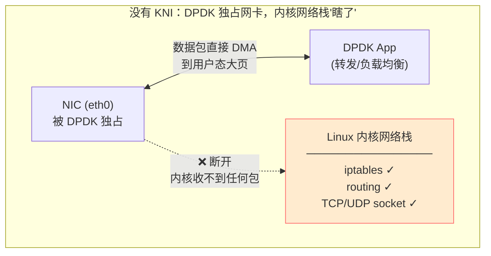
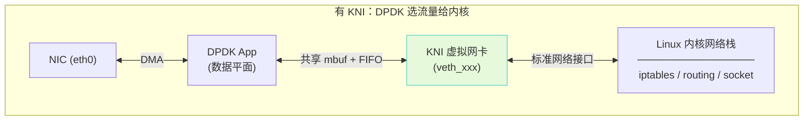
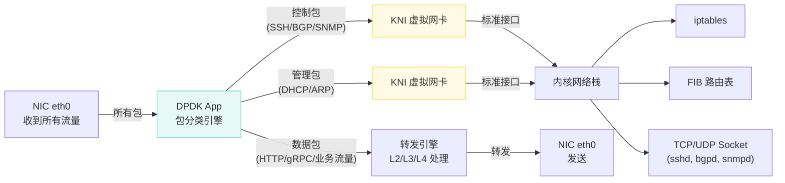
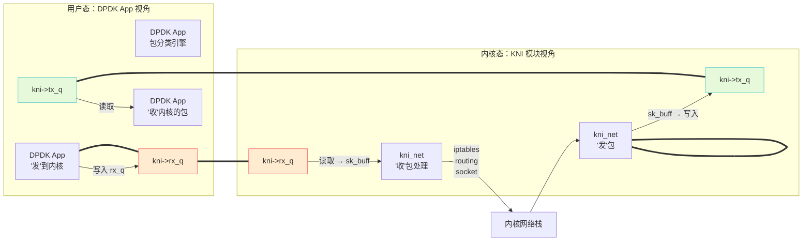
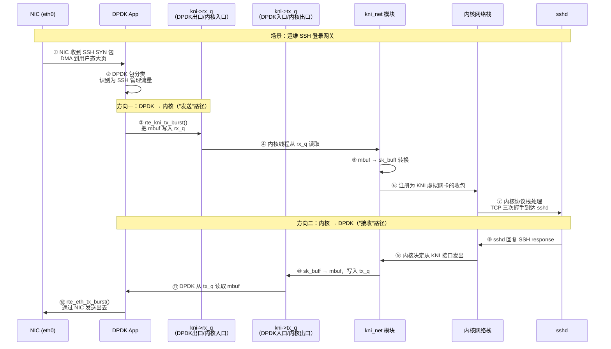

> [!warning] 已废弃提示
> **KNI 已在 DPDK 23.11 中被完全移除**（包括 `lib/kni/` 和 `kernel/linux/kni/`），不再存在于 DPDK 主线代码中。
> 本章节保留作为历史参考，记录 KNI 的设计思路和架构。实际项目中应使用 **AF_XDP**（第十五章补充）或 **TAP** 作为替代方案。
> 最后包含 KNI 的 DPDK 版本为 **22.11 LTS**。
>
> [!info] DPDK 深度探索系列 0. [[2026-04-09-dpdk-deep-dive-series-index|全栈学习路径总览]]
> 1-14. 前十四章已完成 15. **第十五章：KNI (Kernel NIC Interface) 用户态与内核通信**（已废弃，历史参考）
> 15b. [[2026-04-09-dpdk-deep-dive-ch15b-af-xdp|第十五章补充：AF_XDP —— KNI 的现代替代]]

---

## 1. 概述：为什么需要 KNI？

### 1.1 DPDK 的"内核隔离"问题

DPDK 通过 kernel bypass 实现了极致性能——网卡被 DPDK 独占后，数据包直接从 NIC DMA 到用户态大页，**完全绕过内核网络栈**。这带来了一个根本矛盾：

> **网卡被 DPDK 独占了，但有些流量就是必须走内核才能处理。**

用一个真实场景来说明。假设你有一台网关服务器，`eth0` 被 DPDK 接管用于转发数据平面流量。这台服务器同时需要：

- **SSH 登录管理**：运维人员通过 eth0 SSH 进来排查问题
- **BGP 路由协议**：和邻居路由器建立 BGP 会话，交换路由表
- **iptables 防火墙**：对某些流量做 ACL 过滤

没有 KNI 的时候，这些全部做不到：



**关键点**：不是 DPDK 缺功能，而是**网卡这个物理资源被独占了**。DPDK 把网卡绑到自己的驱动上（`igb_uio` / `vfio-pci`），内核原来的网卡驱动就被替换掉了，内核根本看不到这张网卡收到的包。

### 1.2 KNI 解决什么？

KNI 在 DPDK 和内核之间搭了一座桥：



核心思路：DPDK 在用户态决定哪些包需要给内核，通过 KNI 虚拟网卡把包"注入"到内核网络栈。对内核来说，KNI 就是一张普通网卡（`veth_xxx`），iptables、routing、socket 这些内核功能照常可用。

### 1.3 典型流量分流场景



| 场景         | 说明                   | 为什么必须走内核                             |
| ------------ | ---------------------- | -------------------------------------------- |
| **SSH 管理** | 运维通过 eth0 SSH 登录 | sshd 是用户态程序，但依赖内核 TCP/IP 协议栈  |
| **BGP/OSPF** | 与邻居路由器交换路由   | BGP/OSPF daemon（FRR/Bird）依赖内核 socket   |
| **iptables** | 防火墙/ACL 过滤        | iptables 是内核 netfilter 模块，必须内核处理 |
| **ARP**      | 地址解析               | ARP 协议由内核协议栈自动处理                 |
| **DHCP**     | 获取 IP 地址           | DHCP client 依赖内核 socket                  |
| **ICMP**     | ping 排障              | ICMP 由内核协议栈处理                        |

---

## 2. KNI 架构

### 2.1 整体架构

```
┌─────────────────────────────────────────────────────────────────────────────┐
│                              KNI 架构                                       │
├─────────────────────────────────────────────────────────────────────────────┤
│                                                                             │
│     用户态                               内核态                              │
│  ┌─────────────────┐               ┌─────────────────┐                    │
│  │   DPDK App     │               │   Linux Kernel  │                    │
│  │                │               │                 │                    │
│  │  ┌──────────┐  │   ioctl/FIFO  │  ┌──────────┐   │                    │
│  │  │   KNI    │  │◄─────────────►│  │ kni_net  │   │                    │
│  │  │  Device  │  │               │  │  Module  │   │                    │
│  │  └────┬─────┘  │               │  └────┬─────┘   │                    │
│  │       │        │               │       │         │                    │
│  │       │ mbuf   │               │       │ sk_buff │                    │
│  │       │共享    │               │       │转换     │                    │
│  │       ▼        │               │       ▼         │                    │
│  │  ┌─────────┐  │               │  ┌─────────────┐  │                    │
│  │  │ mbuf    │  │               │  │ eth0, eth1  │  │                    │
│  │  │ pool    │  │               │  │ (虚拟网卡)   │  │                    │
│  │  └─────────┘  │               │  └─────────────┘  │                    │
│  └─────────────────┘               └─────────────────┘                    │
│                                                                             │
│  KNI 设备 (/dev/kni)                                                       │
│  ┌─────────────────────────────────────────────────────────────────────┐  │
│  │  操作                    │  说明                                      │  │
│  ├─────────────────────────────────────────────────────────────────────┤  │
│  │  KNI_REQ_CREATE         │  创建 KNI 设备                            │  │
│  │  KNI_REQ_DESTROY       │  销毁 KNI 设备                            │  │
│  │  KNI_REQ_CHANGE_MTU    │  修改 MTU                                 │  │
│  │  KNI_REQ_GET_MAC      │  获取 MAC 地址                            │  │
│  │  KNI_REQ_SET_MAC      │  设置 MAC 地址                            │  │
│  │  KNI_REQ_SET_FILTER   │  设置过滤器                               │  │
│  │  KNI_RESP_PROCESS      │  用户态处理完成                           │  │
│  │  KNI_RESP_RX_CALLBACK │  接收回调通知                             │  │
│  └─────────────────────────────────────────────────────────────────────┘  │
│                                                                             │
└─────────────────────────────────────────────────────────────────────────────┘
```

### 2.2 数据流——一个容易搞混的方向问题

> [!warning] 方向陷阱
> KNI 的 `rx_q` / `tx_q` 是**从内核视角**命名的。但从 DPDK App 的视角来看，**方向完全反过来**。这是理解 KNI 数据流最容易出错的地方。

先记住这个对应关系：

| FIFO 名称     | 内核视角             | DPDK App 视角             | 包的流向                |
| ------------- | -------------------- | ------------------------- | ----------------------- |
| **`rx_q`**    | 内核**接收**包的队列 | DPDK **发送**包到内核     | DPDK App → 内核         |
| **`tx_q`**    | 内核**发送**包的队列 | DPDK **接收**来自内核的包 | 内核 → DPDK App         |
| **`alloc_q`** | 内核**申请** mbuf    | DPDK **分配** mbuf 给内核 | 内核 → DPDK（请求方向） |
| **`free_q`**  | 内核**释放** mbuf    | DPDK **回收** mbuf        | 内核 → DPDK             |

所以你说的没错——**KNI 的 `rx_q` 对 DPDK App 来说是发送路径**。



用一句话概括：**KNI 的 rx_q 是 DPDK 的出口，tx_q 是 DPDK 的入口。**

### 2.3 完整数据流（以 SSH 管理流量为例）

下面用一个具体场景——运维 SSH 登录——把两个方向的完整流程串起来：



关键理解：

1. **步骤 ③ `rte_kni_tx_burst()`**：名字里有 `tx`，但它实际是把包**发往内核**（写入 `rx_q`）。这个 `tx` 是 KNI 库函数的命名，容易和 DPDK 的 `rte_eth_tx_burst()` 混淆——后者是发往 **NIC**。
2. **步骤 ⑪ DPDK 从 `tx_q` 读取**：对 DPDK App 来说，这和从网卡 RX 收包的语义一样——都是"拿包进来处理"。`tx_q` 里的包是内核处理完后需要通过 DPDK 发到网上的。

---

## 3. KNI 核心数据结构

### 3.1 用户态数据结构

```c
// lib/kni/rte_kni.h

struct rte_kni_conf {
    char name[RTE_KNI_NAMESIZE];    // KNI 设备名称 (如 "vEth0")
    uint16_t group_id;              // Group ID (用于 multi-process)
    uint32_t mbuf_size;             // mbuf 大小
    uint16_t mtu;                   // MTU
    uint8_t mac_addr[6];           // MAC 地址

    // 关联的物理端口
    uint16_t port_id;

    // 控制消息队列（名称从内核视角命名，DPDK App 视角方向相反！）
    struct rte_kni_fifo *tx_q;       // 内核 TX：DPDK 从此读包（收到内核要发出的包）
    struct rte_kni_fifo *rx_q;      // 内核 RX：DPDK 往此写包（把包发给内核）
    struct rte_kni_fifo *alloc_q;   // 内核请求分配 mbuf
    struct rte_kni_fifo *free_q;   // 内核释放 mbuf

    // 物理地址 (用于 mbuf 共享)
    uint64_t phys_addr;
};

// KNI 上下文
struct rte_kni_ctx {
    int kni_fd;                     // /dev/kni 文件描述符
    struct rte_kni_conf conf;        // 配置

    struct rte_kni_fifo *tx_q;
    struct rte_kni_fifo *rx_q;
    struct rte_kni_fifo *alloc_q;
    struct rte_kni_fifo *free_q;

    struct rte_mempool *mbuf_pool;   // mbuf 池
    void *mbuf_pool_ptr;            // mbuf 池虚拟地址
};

// FIFO 队列
struct rte_kni_fifo {
    volatile uint32_t write_index;   // 写索引
    volatile uint32_t read_index;    // 读索引
    volatile uint32_t count;          // 元素数量
    uint32_t size;                   // 队列大小
    void *buffer[];                  // 数据缓冲区
};
```

### 3.2 内核态数据结构

```c
// kernel/linux-kni/kni_net.c

struct kni_dev {
    char name[IFNAMSIZ];           // 设备名称

    struct net_device *net_dev;    // Linux 网络设备

    // FIFO 指针（用户空间映射）
    struct rte_kni_fifo *tx_q;     // 用户态发送队列
    struct rte_kni_fifo *rx_q;     // 用户态接收队列
    struct rte_kni_fifo *alloc_q;  // 分配请求队列
    struct rte_kni_fifo *free_q;   // 释放请求队列

    // mbuf 池信息
    void *mbuf_pool;               // mbuf 池指针
    uint32_t mbuf_size;            // mbuf 大小

    // 统计
    uint64_t rx_packets;
    uint64_t tx_packets;
    uint64_t rx_dropped;
    uint64_t tx_dropped;

    // 锁
    spinlock_t tx_lock;
    struct mutex kni_lock;

    // 回调
    void (*kni_rx_callback)(struct kni_dev *dev);
};
```

---

## 4. KNI 创建与销毁

### 4.1 创建 KNI 设备

```c
// lib/kni/rte_kni.c

// 创建 KNI 设备
struct rte_kni *
rte_kni_create(uint16_t port_id,
               unsigned mtu,
               struct rte_mempool *mbuf_pool,
               struct rte_kni_conf *conf)
{
    struct rte_kni *kni;

    // 1. 分配 KNI 上下文
    kni = rte_zmalloc("kni", sizeof(struct rte_kni), 0);
    if (!kni)
        return NULL;

    // 2. 填充配置
    if (conf) {
        memcpy(&kni->conf, conf, sizeof(struct rte_kni_conf));
    } else {
        // 使用默认配置
        snprintf(kni->conf.name, RTE_KNI_NAMESIZE, "kni%d", port_id);
        kni->conf.port_id = port_id;
    }

    kni->conf.mtu = mtu;
    kni->mbuf_pool = mbuf_pool;

    // 3. 打开 /dev/kni 设备
    kni->kni_fd = open("/dev/kni", O_RDWR);
    if (kni->kni_fd < 0) {
        rte_free(kni);
        return NULL;
    }

    // 4. 创建 FIFO 队列
    kni->tx_q = create_kni_fifo(KNI_FIFO_SIZE);
    kni->rx_q = create_kni_fifo(KNI_FIFO_SIZE);
    kni->alloc_q = create_kni_fifo(KNI_FIFO_SIZE);
    kni->free_q = create_kni_fifo(KNI_FIFO_SIZE);

    kni->conf.tx_q = kni->tx_q;
    kni->conf.rx_q = kni->rx_q;
    kni->conf.alloc_q = kni->alloc_q;
    kni->conf.free_q = kni->free_q;
    kni->conf.phys_addr = rte_malloc_virt2iova(mbuf_pool);

    // 5. 发送 KNI_REQ_CREATE 到内核
    struct rte_kni_request req;
    memset(&req, 0, sizeof(req));
    req.req_id = KNI_REQ_CREATE;
    memcpy(&req.conf, &kni->conf, sizeof(struct rte_kni_conf));

    if (ioctl(kni->kni_fd, KNI_IOCTL_CREATE, &req) < 0) {
        close(kni->kni_fd);
        rte_free(kni);
        return NULL;
    }

    return kni;
}

// 创建 FIFO
static struct rte_kni_fifo *
create_kni_fifo(unsigned size)
{
    struct rte_kni_fifo *fifo;

    // 对齐到 Cache line
    size = RTE_ALIGN_MUL_CEIL(size, RTE_CACHE_LINE_SIZE);

    fifo = rte_zmalloc("kni_fifo",
                        sizeof(struct rte_kni_fifo) + size * sizeof(void *),
                        0);
    if (!fifo)
        return NULL;

    fifo->size = size;
    fifo->write_index = 0;
    fifo->read_index = 0;
    fifo->count = 0;

    return fifo;
}
```

### 4.2 销毁 KNI 设备

```c
// 销毁 KNI 设备
int
rte_kni_destroy(struct rte_kni *kni)
{
    struct rte_kni_request req;

    memset(&req, 0, sizeof(req));
    req.req_id = KNI_REQ_DESTROY;

    // 发送销毁请求到内核
    if (ioctl(kni->kni_fd, KNI_IOCTL_DESTROY, &req) < 0) {
        return -1;
    }

    // 清理资源
    close(kni->kni_fd);
    rte_free(kni->tx_q);
    rte_free(kni->rx_q);
    rte_free(kni->alloc_q);
    rte_free(kni->free_q);
    rte_free(kni);

    return 0;
}
```

---

## 5. 数据传输

### 5.1 接收数据 (内核 → 用户态)

```c
// 用户态：从内核接收数据
static uint16_t
kni_rx_burst(struct rte_kni *kni, struct rte_mbuf **mbufs, uint16_t num)
{
    uint16_t i = 0;

    for (i = 0; i < num; i++) {
        // 从 rx_q 读取 mbuf
        struct rte_mbuf *m = kni->rx_q->buffer[kni->rx_q->read_index];

        if (m == NULL)
            break;

        mbufs[i] = m;

        // 更新读索引
        kni->rx_q->read_index = (kni->rx_q->read_index + 1) % kni->rx_q->size;
        kni->rx_q->count--;
    }

    return i;
}

// 内核态：kni_net.c 中的接收处理
static int
kni_net_rx(struct kni_dev *dev)
{
    struct rte_mbuf *m;
    struct sk_buff *skb;
    unsigned i;

    // 从 tx_q 读取 mbuf（来自用户态）
    while (kni_fifo_count(dev->tx_q) > 0) {
        m = kni_fifo_get(dev->tx_q);
        if (!m)
            break;

        // mbuf → sk_buff 转换
        skb = mbuf_to_skb(m, dev->mtu);
        if (!skb) {
            rte_pktmbuf_free(m);
            dev->rx_dropped++;
            continue;
        }

        // 上报到 Linux 网络栈
        skb->dev = dev->net_dev;
        netif_rx(skb);
        dev->rx_packets++;
    }

    // 通知用户态已处理
    return 0;
}

// mbuf → sk_buff 转换
static struct sk_buff *
mbuf_to_skb(struct rte_mbuf *m, unsigned mtu)
{
    struct sk_buff *skb;

    // 从 alloc_q 获取 skb（实际是预分配的）
    skb = kni_skb_alloc(mtu);
    if (!skb)
        return NULL;

    // 复制数据
    unsigned data_len = rte_pktmbuf_data_len(m);
    skb_put(skb, data_len);
    rte_memcpy(skb->data, rte_pktmbuf_mtod(m, void *), data_len);

    // 复制 meta 信息
    // ...

    return skb;
}
```

### 5.2 发送数据 (用户态 → 内核)

```c
// 用户态：发送数据到内核
static uint16_t
kni_tx_burst(struct rte_kni *kni, struct rte_mbuf **mbufs, uint16_t num)
{
    uint16_t i;

    for (i = 0; i < num; i++) {
        // 放入 tx_q，发送给内核
        kni->tx_q->buffer[kni->tx_q->write_index] = mbufs[i];

        kni->tx_q->write_index = (kni->tx_q->write_index + 1) % kni->tx_q->size;
        kni->tx_q->count++;
    }

    // 通知内核有数据
    ioctl(kni->kni_fd, KNI_IOCTL_TX, NULL);

    return i;
}

// 内核态：kni_net_tx() 发送回调
static netdev_tx_t
kni_net_start_xmit(struct sk_buff *skb, struct net_device *dev)
{
    struct kni_dev *kni = netdev_priv(dev);
    struct rte_mbuf *m;

    // 检查 free_q 是否有可用 mbuf
    if (unlikely(kni_fifo_free_count(kni->free_q) == 0)) {
        // 通知用户态分配更多 mbuf
        kni_notify(kni, KNI_REQ_ALLOC);
        return NETDEV_TX_BUSY;
    }

    // sk_buff → mbuf 转换
    m = skb_to_mbuf(skb, kni->mbuf_pool);
    if (!m) {
        dev->stats.tx_dropped++;
        dev_kfree_skb(skb);
        return NETDEV_TX_OK;
    }

    // 放入 rx_q（回传给用户态）
    kni_fifo_put(kni->rx_q, m);

    // 通知用户态
    kni_notify(kni, KNI_RESP_RX_CALLBACK);

    dev->stats.tx_packets++;
    dev_kfree_skb(skb);

    return NETDEV_TX_OK;
}

// sk_buff → mbuf 转换
static struct rte_mbuf *
skb_to_mbuf(struct sk_buff *skb, struct rte_mempool *mp)
{
    struct rte_mbuf *m;

    // 从 free_q 获取 mbuf（避免频繁分配）
    m = kni_fifo_get(mp->free_q);
    if (!m) {
        // 从 pool 分配
        m = rte_pktmbuf_alloc(mp);
        if (!m)
            return NULL;
    }

    // 复制数据到 mbuf
    unsigned data_len = skb->len;
    char *dst = rte_pktmbuf_mtod(m, char *);
    rte_memcpy(dst, skb->data, data_len);

    m->pkt_len = data_len;
    m->data_len = data_len;

    return m;
}
```

### 5.3 mbuf 分配/释放管理

```c
// 用户态：处理分配请求
static void
kni_handle_alloc(struct rte_kni *kni)
{
    struct rte_mbuf *m;

    while (kni_fifo_count(kni->alloc_q) > 0) {
        // 分配 mbuf
        m = rte_pktmbuf_alloc(kni->mbuf_pool);
        if (!m) {
            // 内存不足
            break;
        }

        // 放入 free_q 供内核使用
        kni_fifo_put(kni->free_q, m);
    }
}

// 用户态：处理释放请求
static void
kni_handle_free(struct rte_kni *kni)
{
    struct rte_mbuf *m;

    while (kni_fifo_count(kni->free_q) > 0) {
        // 从 free_q 取出并释放
        m = kni_fifo_get(kni->free_q);
        if (m) {
            rte_pktmbuf_free(m);
        }
    }
}
```

---

## 6. ioctl 控制接口

### 6.1 支持的 ioctl 命令

```c
// kernel/linux-kni/kni_net.c

#define KNI_IOCTL_CREATE      _IOWR('K', 0, struct rte_kni_conf)
#define KNI_IOCTL_DESTROY     _IOW('K', 1, struct rte_kni_conf)
#define KNI_IOCTL_CHANGE_MTU  _IOWR('K', 2, struct rte_kni_conf)
#define KNI_IOCTL_GET_MAC     _IOWR('K', 3, struct rte_kni_conf)
#define KNI_IOCTL_SET_MAC     _IOWR('K', 4, struct rte_kni_conf)
#define KNI_IOCTL_SET_FILTER  _IOWR('K', 5, struct rte_kni_conf)
#define KNI_IOCTL_TX          _IO('K', 6)
#define KNI_IOCTL_RX          _IO('K', 7)

// 处理 ioctl
static long
kni_ioctl(struct file *file, unsigned int cmd, unsigned long arg)
{
    struct rte_kni_conf conf;
    struct kni_dev *dev;

    switch (cmd) {
    case KNI_IOCTL_CREATE:
        // 创建设备
        if (copy_from_user(&conf, (void __user *)arg, sizeof(conf)))
            return -EFAULT;

        dev = kni_create(&conf);
        if (!dev)
            return -ENOMEM;

        if (copy_to_user((void __user *)arg, &conf, sizeof(conf)))
            return -EFAULT;
        break;

    case KNI_IOCTL_CHANGE_MTU:
        // 修改 MTU
        if (copy_from_user(&conf, (void __user *)arg, sizeof(conf)))
            return -EFAULT;

        dev = kni_get(conf.name);
        if (!dev)
            return -EINVAL;

        return dev->net_dev->change_mtu(dev->net_dev, conf.mtu);

    case KNI_IOCTL_GET_MAC:
        // 获取 MAC
        if (copy_from_user(&conf, (void __user *)arg, sizeof(conf)))
            return -EFAULT;

        dev = kni_get(conf.name);
        if (!dev)
            return -EINVAL;

        memcpy(conf.mac_addr, dev->net_dev->addr, 6);

        if (copy_to_user((void __user *)arg, &conf, sizeof(conf)))
            return -EFAULT;
        break;

    // ... 其他命令
    }
}
```

### 6.2 修改 MTU 示例

```c
// 用户态：修改 MTU
int
rte_kni_set_mtu(struct rte_kni *kni, uint16_t mtu)
{
    struct rte_kni_request req;

    memset(&req, 0, sizeof(req));
    req.req_id = KNI_REQ_CHANGE_MTU;
    req.conf.mtu = mtu;
    strncpy(req.conf.name, kni->conf.name, RTE_KNI_NAMESIZE);

    if (ioctl(kni->kni_fd, KNI_IOCTL_CHANGE_MTU, &req) < 0) {
        return -1;
    }

    if (req.result != 0) {
        return -result;
    }

    kni->conf.mtu = mtu;
    return 0;
}
```

---

## 7. 完整使用示例

### 7.1 KNI 服务器

```c
// KNI 服务器示例 - 处理控制平面流量

static volatile int quit = 0;

int
main(int argc, char **argv)
{
    struct rte_mempool *mbuf_pool;
    struct rte_kni *kni;
    struct rte_kni_conf conf;

    // 1. 初始化 EAL
    rte_eal_init(argc, argv);

    // 2. 创建 mbuf 池
    mbuf_pool = rte_pktmbuf_pool_create("mbuf_pool",
                                        8192,
                                        256,
                                        0,
                                        RTE_MBUF_DEFAULT_BUF_SIZE,
                                        rte_socket_id());

    // 3. 配置 KNI
    memset(&conf, 0, sizeof(conf));
    snprintf(conf.name, RTE_KNI_NAMESIZE, "vEth0");
    conf.port_id = 0;  // 关联的物理端口
    conf.mtu = 1500;
    conf.mbuf_size = RTE_MBUF_DEFAULT_BUF_SIZE;

    // 生成 MAC 地址
    conf.mac_addr[0] = 0x00;
    conf.mac_addr[1] = 0x11;
    conf.mac_addr[2] = 0x22;
    conf.mac_addr[3] = 0x33;
    conf.mac_addr[4] = 0x44;
    conf.mac_addr[5] = 0x55;

    // 4. 创建 KNI 设备
    kni = rte_kni_create(conf.port_id, conf.mtu, mbuf_pool, &conf);
    if (!kni) {
        rte_exit(EXIT_FAILURE, "Failed to create KNI\n");
    }

    printf("KNI %s created\n", conf.name);

    // 5. 主循环
    while (!quit) {
        struct rte_mbuf *pkts[32];

        // 处理释放请求
        kni_handle_free(kni);

        // 处理分配请求
        kni_handle_alloc(kni);

        // 从内核接收数据（需要发往物理端口）
        uint16_t nb_rx = kni_rx_burst(kni, pkts, 32);
        if (nb_rx > 0) {
            // 通过 DPDK 端口发送
            rte_eth_tx_burst(0, 0, pkts, nb_rx);
        }

        // 从物理端口接收（需要发往内核）
        uint16_t nb_tx = rte_eth_rx_burst(0, 0, pkts, 32);
        if (nb_tx > 0) {
            // 发送到内核
            kni_tx_burst(kni, pkts, nb_tx);
        }
    }

    // 6. 清理
    rte_kni_destroy(kni);
    rte_eal_cleanup();

    return 0;
}
```

### 7.2 多进程 KNI

```c
// 多进程环境下的 KNI
// 进程 A：数据面，处理高速流量
// 进程 B：控制面，通过 KNI 处理控制流量

// 进程 A
void
dataplane_process(struct rte_kni *kni)
{
    struct rte_mbuf *pkts[32];

    while (1) {
        // 纯数据转发
        uint16_t nb_rx = rte_eth_rx_burst(0, 0, pkts, 32);

        // 直接转发，不走 KNI
        if (nb_rx > 0) {
            // 处理、转发
            forward_packets(pkts, nb_rx);
        }

        // 检查 KNI 是否有紧急数据
        uint16_t kni_rx = kni_rx_burst(kni, pkts, 32);
        if (kni_rx > 0) {
            // 处理控制平面流量
            process_control_traffic(pkts, kni_rx);
        }
    }
}

// 进程 B
void
controlplane_process(struct rte_kni *kni)
{
    while (1) {
        // 监控 KNI 状态
        // 处理 BGP/OSPF 等路由协议
        sleep(1);
    }
}
```

---

## 8. 性能与优化

### 8.1 性能瓶颈

```
┌─────────────────────────────────────────────────────────────────────────────┐
│                            KNI 性能瓶颈                                     │
├─────────────────────────────────────────────────────────────────────────────┤
│                                                                             │
│  1. 数据拷贝 (mbuf ↔ sk_buff)                                              │
│     - 每次转换都需要复制数据                                                │
│     - 解决方案：共享数据区域，避免拷贝                                       │
│                                                                             │
│  2. 上下文切换                                                              │
│     - 用户态 ↔ 内核态 切换开销                                               │
│     - ioctl 系统调用                                                        │
│     - 解决方案：使用 futex 替代 ioctl 通知                                   │
│                                                                             │
│  3. FIFO 锁竞争                                                            │
│     - 多核同时访问 FIFO                                                     │
│     - 解决方案：无锁 FIFO + memory barrier                                   │
│                                                                             │
│  4. mbuf 池限制                                                             │
│     - KNI 专用 mbuf 池大小有限                                              │
│     - 解决方案：动态调整池大小                                               │
│                                                                             │
└─────────────────────────────────────────────────────────────────────────────┘
```

### 8.2 零拷贝优化

```c
// 使用零拷贝 KNI（避免 mbuf ↔ sk_buff 拷贝）

// 零拷贝方案：直接共享数据指针
// 内核和用户态约定同一块内存区域

struct kni_buf_info {
    void *ptr;              // 共享内存地址
    uint64_t phys_addr;    // 物理地址
    uint32_t len;           // 长度
};

// mbuf 指向共享内存，而不是复制数据
static struct rte_mbuf *
kni_alloc_shared_mbuf(struct kni_buf_info *buf, struct rte_mempool *pool)
{
    struct rte_mbuf *m;

    m = rte_pktmbuf_alloc(pool);
    if (!m)
        return NULL;

    // 填充数据指针，但不复制数据
    m->buf_addr = buf->ptr;
    m->buf_iova = buf->phys_addr;
    m->data_off = 0;
    m->pkt_len = buf->len;
    m->data_len = buf->len;

    return m;
}
```

### 8.3 KNI vs vhost-user

| 特性         | KNI            | vhost-user          |
| ------------ | -------------- | ------------------- |
| **用途**     | 内核网络栈交互 | VM 通信             |
| **数据路径** | FIFO + ioctl   | virtqueue + eventfd |
| **性能**     | 较低（有拷贝） | 高（零拷贝）        |
| **功能**     | 完整内核栈     | 仅数据转发          |
| **适用**     | 控制平面       | 数据平面            |

---

## 9. 小结

本章核心要点：

1. **KNI 背景**：DPDK 绕过内核导致无法使用 iptables/routing 等功能，KNI 提供用户态与内核网络栈的桥梁。

2. **KNI 架构**：/dev/kni 设备 + 4 个 FIFO 队列（tx/rx/alloc/free）+ ioctl 控制。

3. **数据流**：接收方向（NIC → PMD → rx_q → 用户态），发送方向（用户态 → tx_q → 内核栈 → rx_q → PMD → NIC）。

4. **FIFO 队列**：tx_q（用户→内核）、rx_q（内核→用户）、alloc_q（内核请求分配）、free_q（内核请求释放）。

5. **mbuf ↔ sk_buff 转换**：数据拷贝是主要开销，零拷贝是优化方向。

6. **ioctl 命令**：CREATE/DESTROY/CHANGE_MTU/GET_MAC/SET_MAC/SET_FILTER/TX/RX。

7. **应用场景**：控制平面流量（SSH/BGP）、iptables 过滤、DHCP/DNS、多进程分离（数据面+控制面）。

8. **性能瓶颈**：数据拷贝、上下文切换（ioctl）、FIFO 锁竞争、mbuf 池限制。

9. **KNI vs vhost-user**：KNI 适合控制平面（有内核栈），vhost-user 适合数据平面（高性能 VM 通信）。

**下一篇预告**：[[2026-04-09-dpdk-deep-dive-ch16-vhost-user|第十六章]]将深入讲解 vhost-user 与 virtio 加速——VM 与 DPDK 的高性能共享内存通信。

---

> [!tip] 参考文献
>
> - Intel, "DPDK KNI", https://doc.dpdk.org/guides/prog_guide/kernel_nic_interface.html
> - Linux kernel source: drivers/net/kni/
> - "KNI vs vhost-user", https://doc.dpdk.org/guides/prog_guide/overview.html
