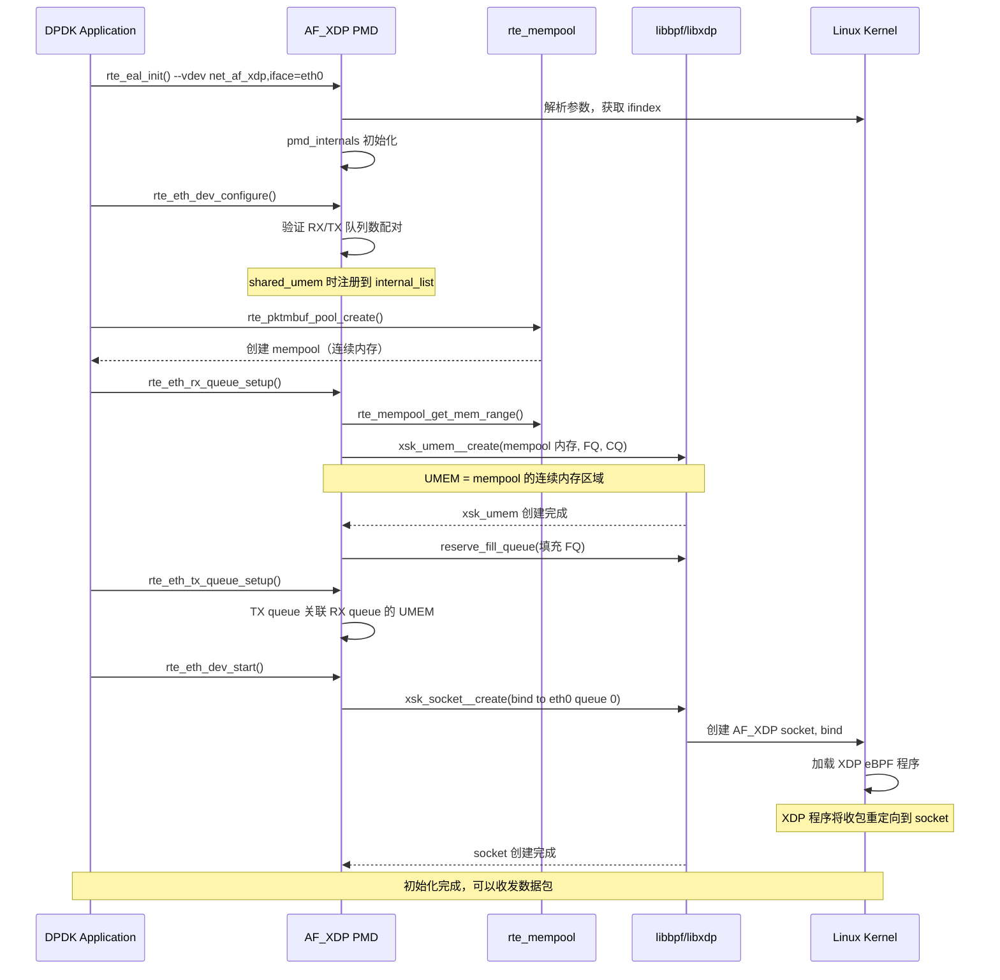

> [!info] DPDK 深度探索系列 0. [[2026-04-09-dpdk-deep-dive-series-index|全栈学习路径总览]]
> 1-14. 前十四章已完成 15. [[2026-04-09-dpdk-deep-dive-ch15-kni-interface|第十五章：KNI (Kernel NIC Interface)]]（已废弃，历史参考）
> 15b. **第十五章补充：AF_XDP —— KNI 的现代替代**

> [!tip] 延伸阅读
> 本章节聚焦于 **DPDK 如何封装 AF_XDP**。如需深入了解 AF_XDP 本身的架构原理、UMEM、数据路径等，请参考：
>
> - [[2026-04-25-af-xdp-deep-dive-ch1-architecture-and-principles|AF_XDP 深度探索 Ch1：架构与原理]]
> - [[2026-04-27-af-xdp-deep-dive-ch3-data-path-analysis|AF_XDP 深度探索 Ch3：数据路径分析]]

---

## 1. 从 KNI 到 AF_XDP：为什么需要替代？

### 1.1 KNI 的根本问题

在[第十五章](2026-04-09-dpdk-deep-dive-ch15-kni-interface)中我们详细分析了 KNI 的架构。KNI 虽然实现了用户态与内核网络栈的通信，但存在几个无法绕过的根本缺陷：

| 问题                    | 说明                                                                         |
| ----------------------- | ---------------------------------------------------------------------------- |
| **内核模块依赖**        | KNI 需要编译内核模块（`rte_kni.ko`），必须与运行内核版本严格匹配             |
| **mbuf ↔ sk_buff 转换** | 即使"零拷贝"模式也需要在 DPDK mbuf 和内核 sk_buff 之间共享内存，转换开销不小 |
| **4 个 FIFO 瓶颈**      | tx_q/rx_q/alloc_q/free_q 四个无锁 FIFO 成为吞吐量瓶颈                        |
| **维护中断**            | KNI 已在 DPDK 23.11 中被完全移除，不再有官方维护                             |
| **ioctl 同步**          | 控制接口通过 ioctl 同步调用，每次操作都有用户态/内核态切换                   |

### 1.2 AF_XDP 的优势

AF_XDP（Address Family eXpress Data Path）是 Linux 内核 4.18 引入的原生 socket 类型（`AF_XDP = 44`），专门为高性能包处理设计：

```
KNI vs AF_XDP 架构对比：

KNI（已废弃）：
┌──────────┐     ┌──────────────┐     ┌──────────┐     ┌─────────────┐
│ DPDK App │◄──►│ KNI Module   │◄──►│  FIFO    │◄──►│ Kernel Stack│
└──────────┘     │ (rte_kni.ko) │     │ (4个队列) │     └─────────────┘
└──────────┘     └──────────────┘     └──────────┘     └─────────────┘
问题：内核模块 + mbuf/sk_buff转换 + FIFO瓶颈

AF_XDP（现代方案）：
┌──────────┐     ┌──────────────────────────────────────────┐     ┌─────────────┐
│ DPDK App │◄──►│ UMEM (共享内存) ◄──► AF_XDP Socket      │◄──►│ Kernel Stack│
└──────────┘     │  FQ/CQ/RX/TX Ring                       │     └─────────────┘
└──────────┘     └──────────────────────────────────────────┘     └─────────────┘
优势：无内核模块 + 零拷贝 + 内核原生支持
```

关键差异总结：

| 维度           | KNI                   | AF_XDP                       |
| -------------- | --------------------- | ---------------------------- |
| **内核模块**   | 需要编译 `rte_kni.ko` | 无需任何内核模块             |
| **内核版本**   | 需匹配内核版本        | 内核 >= 4.18 即可            |
| **数据拷贝**   | mbuf ↔ sk_buff 转换   | 零拷贝（UMEM 直通）          |
| **通信方式**   | 4 个 FIFO 队列        | Ring Buffer（FQ/CQ/RX/TX）   |
| **控制接口**   | ioctl 系统调用        | 标准 socket API              |
| **XDP 程序**   | 不涉及                | eBPF 程序重定向              |
| **DPDK 状态**  | 23.11 已移除          | 活跃维护（`net_af_xdp` PMD） |
| **Kubernetes** | 不支持                | 原生支持（Device Plugin）    |

---

## 2. AF_XDP 核心概念回顾

> [!note] 简要回顾
> 本节只做简要回顾，详细原理请参考 [AF_XDP 深度探索 Ch1](2026-04-25-af-xdp-deep-dive-ch1-architecture-and-principles)。

### 2.1 UMEM（User Memory）

UMEM 是 AF_XDP 的核心——一块在用户态和内核之间共享的连续内存区域。所有数据包的接收和发送都直接在这块内存上操作，无需拷贝。

```
UMEM 布局：

┌─────────────────────────────────────────────────────────────┐
│                      UMEM（共享内存）                        │
├─────────────────────────────────────────────────────────────┤
│                                                             │
│  ┌─────────┐ ┌─────────┐ ┌─────────┐     ┌─────────┐      │
│  │ Frame 0 │ │ Frame 1 │ │ Frame 2 │ ... │ Frame N │      │
│  │ 2KB     │ │ 2KB     │ │ 2KB     │     │ 2KB     │      │
│  └─────────┘ └─────────┘ └─────────┘     └─────────┘      │
│                                                             │
│  每帧大小 = frame_size（默认 2048 字节）                     │
│  总大小 = NUM_BUFFERS × frame_size（默认 4096 × 2048 = 8MB）│
│                                                             │
│  用户态 DPDK 和内核态 NIC DMA 都可以直接访问                  │
│                                                             │
└─────────────────────────────────────────────────────────────┘
```

### 2.2 四个 Ring Buffer

AF_XDP 通过四个 Ring Buffer 管理数据包的流转：

```
Ring Buffer 数据流向：

                    UMEM（共享内存池）
                    ┌───────────────┐
                    │               │
         ┌──────────┤ Fill Queue    ├──────────┐
         │          │ (FQ, 用户→内核)│          │
         │          └───────────────┘          │
         │                                     │
         ▼                                     ▼
┌─────────────────┐                   ┌─────────────────┐
│  RX Ring        │                   │  TX Ring        │
│  (内核→用户)     │                   │  (用户→内核)     │
│                 │                   │                 │
│  内核放入接收    │                   │  用户放入发送    │
│  描述符          │                   │  描述符          │
└─────────────────┘                   └─────────────────┘
         │                                     │
         │          ┌───────────────┐          │
         └──────────┤ Comp Queue    ├──────────┘
                    │ (CQ, 内核→用户)│
                    └───────────────┘

流程：
1. 用户通过 FQ 告诉内核：这些 UMEM frame 可以用来接收数据包
2. 内核将收到的数据包 DMA 到 UMEM frame，并在 RX Ring 写入描述符
3. 用户从 RX Ring 读取描述符，直接访问 UMEM 中的数据（零拷贝！）
4. 用户发送时，在 TX Ring 写入描述符指向 UMEM frame
5. 内核从 TX Ring 取出发送描述符，DMA 发送后通过 CQ 通知用户 frame 已释放
```

| Ring                      | 方向        | 类型            | 作用                                 |
| ------------------------- | ----------- | --------------- | ------------------------------------ |
| **FQ** (Fill Queue)       | 用户 → 内核 | `xsk_ring_prod` | 用户向内核提供空闲 frame 用于接收    |
| **RX** (RX Ring)          | 内核 → 用户 | `xsk_ring_cons` | 内核通知用户有哪些 frame 收到了数据  |
| **TX** (TX Ring)          | 用户 → 内核 | `xsk_ring_prod` | 用户提交待发送的 frame 描述符        |
| **CQ** (Completion Queue) | 内核 → 用户 | `xsk_ring_cons` | 内核通知用户哪些 TX frame 已发送完毕 |

### 2.3 XDP 程序与重定向

AF_XDP 的工作需要一个 XDP（eBPF）程序将数据包重定向到 AF_XDP socket。默认程序非常简单：

```c
// AF_XDP 默认 XDP 程序（由 libxdp/libbpf 提供）
// 功能：将所有收到的数据包重定向到对应的 AF_XDP socket

SEC("xdp")
int xdp_sock_prog(struct xdp_md *ctx)
{
    int index = ctx->rx_queue_index;
    // bpf_map_lookup_elem 从 xsks_map 查找该队列对应的 socket
    // bpf_redirect_map 将数据包重定向到该 socket
    return bpf_redirect_map(&xsks_map, index, 0);
}
```

当用户通过 `xdp_prog` 参数指定自定义 XDP 程序时，DPDK 会加载该程序替代默认程序，可以在重定向前执行自定义过滤/修改逻辑。

---

## 3. DPDK AF_XDP PMD 驱动

### 3.1 驱动概览

DPDK 将 AF_XDP 封装为标准的 **vdev（virtual device）PMD**，位于 `drivers/net/af_xdp/rte_eth_af_xdp.c`。它让 DPDK 应用可以像使用其他 PMD 一样，通过标准的 `rte_eth_rx_burst()` / `rte_eth_tx_burst()` API 收发数据包。

```
DPDK AF_XDP PMD 架构：

┌──────────────────────────────────────────────────────────────────┐
│                       DPDK Application                           │
│  rte_eth_rx_burst() / rte_eth_tx_burst() / rte_eth_dev_configure()│
└──────────────┬───────────────────────────────────┬───────────────┘
               │                                   │
               ▼                                   ▼
┌──────────────────────────┐          ┌──────────────────────────┐
│   rte_eth_dev            │          │   rte_mempool             │
│   (PMD 接口层)            │          │   (mbuf 池)               │
│                          │          │                          │
│   eth_af_xdp_rx()        │          │   mempool 提供的连续     │
│   eth_af_xdp_tx()        │◄────────►│   内存区域映射为 UMEM    │
│   eth_dev_configure()    │          │                          │
│   eth_rx_queue_setup()   │          └──────────────────────────┘
│   eth_tx_queue_setup()   │                     │
└──────────┬───────────────┘                     │
           │                                     │
           ▼                                     ▼
┌──────────────────────────────────────────────────────────────┐
│                    AF_XDP Socket (libbpf/libxdp)              │
│                                                              │
│   xsk_umem  ◄── UMEM 共享内存                                │
│   xsk_socket ◄── AF_XDP socket (bind to netdev queue)        │
│   FQ/CQ/RX/TX Ring ◄── 四个 Ring Buffer                      │
│                                                              │
└──────────────────────────┬───────────────────────────────────┘
                           │
                           ▼
┌──────────────────────────────────────────────────────────────┐
│                    Linux Kernel                               │
│                                                              │
│   NIC Driver ──► XDP Program (eBPF) ──► AF_XDP redirect      │
│                                                              │
│   NIC DMA 直接读写 UMEM（零拷贝）                              │
│                                                              │
└──────────────────────────────────────────────────────────────┘
```

### 3.2 核心数据结构

PMD 的核心数据结构定义在 `rte_eth_af_xdp.c` 中：

```c
/* UMEM 信息结构体 */
struct xsk_umem_info {
    struct xsk_umem *umem;          /* libbpf UMEM 句柄 */
    struct rte_ring *buf_ring;      /* copy 模式下复用 frame 的 ring */
    const struct rte_memzone *mz;   /* memzone（copy 模式） */
    struct rte_mempool *mb_pool;    /* 关联的 DPDK mempool */
    void *buffer;                   /* UMEM 起始地址 */
    RTE_ATOMIC(uint8_t) refcnt;     /* 引用计数（shared_umem） */
    uint32_t max_xsks;              /* 最大 socket 数（shared_umem） */
};

/* RX 队列 */
struct pkt_rx_queue {
    struct xsk_ring_cons rx;        /* RX Ring（消费者） */
    struct xsk_umem_info *umem;     /* 关联的 UMEM */
    struct xsk_socket *xsk;         /* AF_XDP socket 句柄 */
    struct rte_mempool *mb_pool;    /* mbuf 池 */
    uint16_t port;                  /* DPDK 端口号 */

    struct rx_stats stats;          /* 统计信息 */

    struct xsk_ring_prod fq;        /* Fill Queue（生产者） */
    struct xsk_ring_cons cq;        /* Completion Queue（消费者） */

    struct pkt_tx_queue *pair;      /* 配对的 TX 队列 */
    struct pollfd fds[1];           /* poll fd */
    int xsk_queue_idx;              /* 绑定的网卡队列号 */
    int busy_budget;                /* busy poll budget */
};

/* TX 队列 */
struct pkt_tx_queue {
    struct xsk_ring_prod tx;        /* TX Ring（生产者） */
    struct xsk_umem_info *umem;     /* 关联的 UMEM（与 RX 共享） */

    struct tx_stats stats;          /* 统计信息 */

    struct pkt_rx_queue *pair;      /* 配对的 RX 队列 */
    int xsk_queue_idx;              /* 绑定的网卡队列号 */
};

/* PMD 内部状态 */
struct pmd_internals {
    int if_index;                   /* 网卡接口索引 */
    char if_name[IFNAMSIZ];         /* 网卡接口名称 */
    int start_queue_idx;            /* 起始队列号 */
    int queue_cnt;                  /* 队列数量 */
    int max_queue_cnt;              /* 最大队列数量 */
    int combined_queue_cnt;         /* 网卡 combined queue 数 */
    bool shared_umem;               /* 是否共享 UMEM */
    char prog_path[PATH_MAX];       /* 自定义 XDP 程序路径 */
    bool custom_prog_configured;    /* 自定义程序是否已加载 */
    bool force_copy;                /* 是否强制 copy 模式 */
    bool use_cni;                   /* Kubernetes CNI 模式 */
    bool use_pinned_map;            /* 使用 pinned xsk map */
    char dp_path[PATH_MAX];         /* Device Plugin 路径 */
    struct bpf_map *map;            /* BPF map 句柄 */

    struct rte_ether_addr eth_addr; /* MAC 地址 */

    struct pkt_rx_queue *rx_queues; /* RX 队列数组 */
    struct pkt_tx_queue *tx_queues; /* TX 队列数组 */
};
```

> [!note] RX/TX 配对
> 注意 `pkt_rx_queue` 和 `pkt_tx_queue` 通过 `pair` 指针互相引用。这是因为 AF_XDP 的 CQ（Completion Queue）与 RX 队列关联，而 TX 发送完成后需要通过 CQ 释放 frame。同样 FQ（Fill Queue）与 RX 队列关联，TX 需要通过 pair 访问 CQ。

### 3.3 关键宏定义

```c
/* AF_XDP 地址族（Linux 内核定义） */
#ifndef AF_XDP
#define AF_XDP 44
#endif

/* PMD 默认参数 */
#define ETH_AF_XDP_FRAME_SIZE         2048    /* 每帧大小 */
#define ETH_AF_XDP_NUM_BUFFERS        4096    /* UMEM 中 frame 总数 */
#define ETH_AF_XDP_DFLT_NUM_DESCS     XSK_RING_CONS__DEFAULT_NUM_DESCS  /* Ring 默认描述符数 */
#define ETH_AF_XDP_DFLT_START_QUEUE_IDX  0   /* 默认起始队列 */
#define ETH_AF_XDP_DFLT_QUEUE_COUNT    1     /* 默认队列数 */
#define ETH_AF_XDP_DFLT_BUSY_BUDGET    64    /* 默认 busy poll budget */
#define ETH_AF_XDP_DFLT_BUSY_TIMEOUT   20    /* 默认 busy poll 超时 */

/* 批处理大小 */
#define ETH_AF_XDP_RX_BATCH_SIZE      XSK_RING_CONS__DEFAULT_NUM_DESCS
#define ETH_AF_XDP_TX_BATCH_SIZE      XSK_RING_CONS__DEFAULT_NUM_DESCS

/* 以太网开销 */
#define ETH_AF_XDP_ETH_OVERHEAD       (RTE_ETHER_HDR_LEN + RTE_ETHER_CRC_LEN)

/* XDP socket 相关的 socket option 层 */
#ifndef SOL_XDP
#define SOL_XDP 283
#endif
```

---

## 4. PMD 初始化流程

### 4.1 EAL 参数配置

AF_XDP PMD 通过 EAL vdev 参数配置（不是 PCI 设备，而是虚拟设备）：

```bash
# 基本用法：绑定到网卡 eth0 的队列 0
--vdev net_af_xdp,iface=eth0

# 指定队列号
--vdev net_af_xdp,iface=eth0,start_queue=1

# 多队列
--vdev net_af_xdp,iface=eth0,queue_count=2

# 强制 copy 模式（禁用零拷贝）
--vdev net_af_xdp,iface=eth0,force_copy=1

# 自定义 XDP 程序
--vdev net_af_xdp,iface=eth0,xdp_prog=/path/to/prog.o

# busy polling 参数
--vdev net_af_xdp,iface=eth0,busy_budget=32

# 共享 UMEM（跨 vdev）
--vdev net_af_xdp0,iface=eth0,shared_umem=1
--vdev net_af_xdp1,iface=eth1,shared_umem=1

# Kubernetes CNI 模式
--vdev net_af_xdp0,use_cni=1,dp_path="/tmp/afxdp_dp/eth0/afxdp.sock"

# 使用 pinned map
--vdev net_af_xdp0,use_pinned_map=1,dp_path="/tmp/afxdp_dp/eth0/xsks_map"
```

### 4.2 初始化序列



### 4.3 UMEM 创建详解

UMEM 的创建是初始化中最关键的步骤。DPDK AF_XDP PMD 的 UMEM 创建取决于内核是否支持 `XDP_UMEM_UNALIGNED_CHUNK_FLAG`：

**零拷贝模式（内核 >= 5.4，支持 unaligned chunk）：**

```c
// 零拷贝模式下的 UMEM 配置
struct xsk_umem_config usr_config = {
    .fill_size = ETH_AF_XDP_DFLT_NUM_DESCS * 2,  // FQ 大小 = 默认描述符数 × 2
    .comp_size = ETH_AF_XDP_DFLT_NUM_DESCS,       // CQ 大小 = 默认描述符数
    .flags = XDP_UMEM_UNALIGNED_CHUNK_FLAG         // 启用非对齐 chunk（零拷贝关键）
};

// UMEM 直接使用 mempool 的连续内存
struct rte_mempool_mem_range_info range;
rte_mempool_get_mem_range(mb_pool, &range);

// 页对齐后创建 UMEM
void *aligned_addr = (void *)RTE_ALIGN_FLOOR((uintptr_t)range.start, getpagesize());
uint64_t umem_size = range.length + RTE_PTR_DIFF(range.start, aligned_addr);
xsk_umem__create(&umem->umem, aligned_addr, umem_size, &rxq->fq, &rxq->cq, &usr_config);
```

**Copy 模式（内核 < 5.4 或 force_copy=1）：**

```c
// Copy 模式下的 UMEM 配置
struct xsk_umem_config usr_config = {
    .fill_size = ETH_AF_XDP_DFLT_NUM_DESCS,
    .comp_size = ETH_AF_XDP_DFLT_NUM_DESCS,
    .frame_size = ETH_AF_XDP_FRAME_SIZE,  // 固定 2048 字节
    .frame_headroom = 0                    // 无 headroom
};

// Copy 模式使用 memzone 分配独立内存
const struct rte_memzone *mz = rte_memzone_reserve_aligned(...);

// 额外创建 rte_ring 用于管理空闲 frame 地址
umem->buf_ring = rte_ring_create(ring_name, ETH_AF_XDP_NUM_BUFFERS, ...);
// 将所有 frame 地址入队
for (i = 0; i < ETH_AF_XDP_NUM_BUFFERS; i++)
    rte_ring_enqueue(umem->buf_ring, (void *)(i * ETH_AF_XDP_FRAME_SIZE));
```

> [!important] 零拷贝 vs Copy 的根本区别
>
> - **零拷贝模式**：UMEM 直接映射到 DPDK mempool 的连续内存区域。DPDK mbuf 和内核 XDP 描述符指向同一块物理内存。收包时无需拷贝，只需将 mbuf 指针"附加"到 RX Ring 描述符对应的 UMEM 地址上。
> - **Copy 模式**：UMEM 使用独立的 memzone 内存。收包时通过 `rte_memcpy()` 将数据从 UMEM frame 拷贝到 DPDK mbuf。额外维护一个 `rte_ring` 来回收 UMEM frame 地址。

---

## 5. 数据路径：收包与发包

### 5.1 收包路径（RX）

#### 5.1.1 零拷贝收包（`af_xdp_rx_zc`）

```c
static uint16_t
af_xdp_rx_zc(void *queue, struct rte_mbuf **bufs, uint16_t nb_pkts)
{
    struct pkt_rx_queue *rxq = queue;
    struct xsk_ring_cons *rx = &rxq->rx;
    struct xsk_ring_prod *fq = &rxq->fq;
    struct xsk_umem_info *umem = rxq->umem;

    // Step 1: 从 RX Ring peek 可用的接收描述符
    nb_pkts = xsk_ring_cons__peek(rx, nb_pkts, &idx_rx);
    if (nb_pkts == 0) {
        // busy poll 或 poll 等待
        if (rxq->busy_budget)
            recvfrom(xsk_socket__fd(rxq->xsk), NULL, 0, MSG_DONTWAIT, NULL, NULL);
        else if (xsk_ring_prod__needs_wakeup(fq))
            poll(&rxq->fds[0], 1, 1000);
        return 0;
    }

    // Step 2: 从 mempool 分配 mbuf 用于后续补充 FQ
    rte_pktmbuf_alloc_bulk(umem->mb_pool, fq_bufs, nb_pkts);

    // Step 3: 遍历每个接收描述符
    for (i = 0; i < nb_pkts; i++) {
        desc = xsk_ring_cons__rx_desc(rx, idx_rx++);
        addr = desc->addr;
        len = desc->len;

        // 从地址中提取 offset 和 base addr（unaligned 模式）
        offset = xsk_umem__extract_offset(addr);
        addr = xsk_umem__extract_addr(addr);

        // 关键：直接将 UMEM 地址转换为 mbuf 指针（零拷贝！）
        bufs[i] = (struct rte_mbuf *)
                xsk_umem__get_data(umem->buffer, addr + umem->mb_pool->header_size);
        bufs[i]->data_off = offset - sizeof(struct rte_mbuf)
                - rte_pktmbuf_priv_size(umem->mb_pool) - umem->mb_pool->header_size;
        bufs[i]->port = rxq->port;

        rte_pktmbuf_pkt_len(bufs[i]) = len;
        rte_pktmbuf_data_len(bufs[i]) = len;
    }

    // Step 4: 释放 RX Ring 条目，补充 FQ
    xsk_ring_cons__release(rx, nb_pkts);
    reserve_fill_queue(umem, nb_pkts, fq_bufs, fq);

    return nb_pkts;
}
```

零拷贝收包的关键在于：**mbuf 结构体本身就存储在 UMEM 中**。`rte_pktmbuf_alloc_bulk()` 从 mempool 分配的 mbuf 实际上位于 UMEM 内存区域内，因此内核 DMA 写入的数据和 mbuf 在同一块内存中，无需任何拷贝。

#### 5.1.2 Copy 收包（`af_xdp_rx_cp`）

```c
static uint16_t
af_xdp_rx_cp(void *queue, struct rte_mbuf **bufs, uint16_t nb_pkts)
{
    // ...
    for (i = 0; i < nb_pkts; i++) {
        desc = xsk_ring_cons__rx_desc(rx, idx_rx++);
        addr = desc->addr;
        len = desc->len;

        // 获取 UMEM 中的数据地址
        pkt = xsk_umem__get_data(rxq->umem->mz->addr, addr);

        // 拷贝数据到 DPDK mbuf
        rte_memcpy(rte_pktmbuf_mtod(mbufs[i], void *), pkt, len);

        // 回收 UMEM frame 地址到 buf_ring
        rte_ring_enqueue(umem->buf_ring, (void *)addr);

        bufs[i] = mbufs[i];
        bufs[i]->port = rxq->port;
    }
    // ...
}
```

Copy 模式的区别：

- 从 mempool 分配独立的 mbuf（不在 UMEM 中）
- 通过 `rte_memcpy()` 将数据从 UMEM 拷贝到 mbuf
- 通过 `rte_ring` 回收 UMEM frame 地址供下次使用

### 5.2 发包路径（TX）

#### 5.2.1 零拷贝发包（`af_xdp_tx_zc`）

```c
static uint16_t
af_xdp_tx_zc(void *queue, struct rte_mbuf **bufs, uint16_t nb_pkts)
{
    struct pkt_tx_queue *txq = queue;
    struct xsk_umem_info *umem = txq->umem;

    for (i = 0; i < nb_pkts; i++) {
        mbuf = bufs[i];

        if (mbuf->pool == umem->mb_pool) {
            // 快速路径：mbuf 来自 UMEM mempool → 真正的零拷贝
            desc = xsk_ring_prod__tx_desc(&txq->tx, idx_tx);
            desc->len = mbuf->pkt_len;

            // 直接计算 UMEM 中的地址
            addr = (uint64_t)mbuf - (uint64_t)umem->buffer
                    - umem->mb_pool->header_size;
            offset = rte_pktmbuf_mtod(mbuf, uint64_t)
                    - (uint64_t)mbuf + umem->mb_pool->header_size;
            offset = offset << XSK_UNALIGNED_BUF_OFFSET_SHIFT;
            desc->addr = addr | offset;
        } else {
            // 慢速路径：mbuf 来自其他 mempool → 需要拷贝
            struct rte_mbuf *local_mbuf = rte_pktmbuf_alloc(umem->mb_pool);
            desc = xsk_ring_prod__tx_desc(&txq->tx, idx_tx);
            desc->len = mbuf->pkt_len;

            addr = (uint64_t)local_mbuf - (uint64_t)umem->buffer
                    - umem->mb_pool->header_size;
            offset = ...;
            pkt = xsk_umem__get_data(umem->buffer, addr + offset);

            // 拷贝数据到 UMEM frame
            rte_memcpy(pkt, rte_pktmbuf_mtod(mbuf, void *), desc->len);
            rte_pktmbuf_free(mbuf);  // 释放原始 mbuf
        }
    }

    // 提交 TX 描述符
    xsk_ring_prod__submit(&txq->tx, count);
    // 触发内核发送（send 系统调用）
    kick_tx(txq, cq);

    return count;
}
```

> [!note] TX 快速路径与慢速路径
>
> - **快速路径**：当 mbuf 来自 UMEM 关联的 mempool 时，直接将 mbuf 地址转换为 UMEM 描述符地址，**真正的零拷贝**。
> - **慢速路径**：当 mbuf 来自其他 mempool 时（跨端口转发），需要从 UMEM mempool 分配新 mbuf，拷贝数据后再发送。这不可避免地有一次内存拷贝。
>
> **慢速路径什么时候触发？** 最典型的场景是跨端口转发：
>
> ```
> Port 1 (ixgbe PMD, mempool_B)          Port 0 (AF_XDP PMD, mempool_A = UMEM)
>   │                                         │
>   │  rte_eth_rx_burst → mbuf from pool_B     │
>   │         ↓                               │
>   │  应用处理（路由查表/修改 MAC）              │
>   │         ↓                               │
>   │  rte_eth_tx_burst(port0, mbuf) ─────────→│
>   │                                         │
>   │                              mbuf->pool != pool_A
>   │                                         ↓
>   │                              slow path: alloc from pool_A
>   │                              rte_memcpy → 发送
>   │                              rte_pktmbuf_free(原始 mbuf)
> ```
>
> 原因：AF_XDP 的 TX 描述符指向的地址必须在 UMEM 范围内，内核才能 DMA。其他 mempool 的内存不在 UMEM 里，内核看不到，只能拷贝一份。
>
> 注意：这里的"其他 mempool"是 DPDK 内部不同端口各自 mempool 的情况，**跟内核协议栈无关**。AF_XDP TX 的终点是 NIC DMA 发送引擎，不是内核网络栈。

#### 5.2.2 TX 发送触发（`kick_tx`）

```c
static void
kick_tx(struct pkt_tx_queue *txq, struct xsk_ring_cons *cq)
{
    // 先从 CQ 回收已完成的 TX frame
    pull_umem_cq(umem, XSK_RING_CONS__DEFAULT_NUM_DESCS, cq);

    // 如果需要 wakeup（XDP_USE_NEED_WAKEUP 模式）
    if (tx_syscall_needed(&txq->tx))
        while (send(xsk_socket__fd(txq->pair->xsk), NULL,
                    0, MSG_DONTWAIT) < 0) {
            if (errno != EBUSY && errno != EAGAIN && errno != EINTR)
                break;
            // EAGAIN 时继续回收 CQ 以释放空间
            if (errno == EAGAIN)
                pull_umem_cq(umem, ..., cq);
        }
}
```

`kick_tx` 做两件事：

1. 从 CQ 回收已发送完成的 frame（零拷贝模式下通过 `rte_pktmbuf_free()` 释放 mbuf）
2. 如果启用了 `XDP_USE_NEED_WAKEUP`，通过 `send()` 系统调用通知内核有新的 TX 描述符

### 5.3 CQ 回收（`pull_umem_cq`）

```c
static void
pull_umem_cq(struct xsk_umem_info *umem, int size, struct xsk_ring_cons *cq)
{
    n = xsk_ring_cons__peek(cq, size, &idx_cq);

    for (i = 0; i < n; i++) {
        addr = *xsk_ring_cons__comp_addr(cq, idx_cq++);
        // 零拷贝模式：直接 free mbuf（mbuf 在 UMEM 中）
        addr = xsk_umem__extract_addr(addr);
        rte_pktmbuf_free((struct rte_mbuf *)
                    xsk_umem__get_data(umem->buffer, addr + umem->mb_pool->header_size));
        // Copy 模式：将 frame 地址回收到 buf_ring
        rte_ring_enqueue(umem->buf_ring, (void *)addr);
    }

    xsk_ring_cons__release(cq, n);
}
```

### 5.4 完整收发流程

```mermaid
flowchart TB
    subgraph RX["接收路径 (RX)"]
        RX1["NIC DMA 写入 UMEM"] --> RX2["XDP 程序执行<br/>bpf_redirect_map"]
        RX2 --> RX3["内核写入 RX Ring<br/>（描述符: addr + len）"]
        RX3 --> RX4["用户态 xsk_ring_cons__peek<br/>读取 RX Ring"]
        RX4 --> RX5{"零拷贝模式?"}
        RX5 -->|是| RX6["直接从 UMEM 地址<br/>构造 mbuf 指针"]
        RX5 -->|否| RX7["rte_memcpy 到 mbuf<br/>回收 UMEM frame"]
        RX6 --> RX8["rte_pktmbuf_alloc_bulk<br/>分配新 mbuf"]
        RX7 --> RX9["xsk_ring_cons__release<br/>释放 RX Ring 条目"]
        RX8 --> RX9
        RX9 --> RX10["reserve_fill_queue<br/>补充 FQ"]
    end

    subgraph TX["发送路径 (TX)"]
        TX1["用户态构造 TX 描述符"] --> TX2{"mbuf 来自 UMEM?"}
        TX2 -->|是| TX3["直接设置 desc->addr<br/>零拷贝"]
        TX2 -->|否| TX4["分配 UMEM mbuf<br/>rte_memcpy 数据"]
        TX3 --> TX5["xsk_ring_prod__submit<br/>提交 TX Ring"]
        TX4 --> TX5
        TX5 --> TX6["kick_tx: send() syscall<br/>通知内核"]
        TX6 --> TX7["内核 DMA 读取 UMEM<br/>发送到 NIC"]
        TX7 --> TX8["内核写入 CQ<br/>标记完成"]
        TX8 --> TX9["pull_umem_cq<br/>回收 frame"]
    end
```



### 5.5 AF_XDP 无法覆盖的方向：DPDK → 内核协议栈

前面的 5.1-5.4 讨论的都是 AF_XDP 的收发包路径，但有一个方向 AF_XDP **完全覆盖不到**：

> **DPDK 处理完的包，需要注入内核网络栈**（比如需要内核路由、iptables 过滤、或者送给内核上的服务）。

AF_XDP 的 TX Ring 终点是 **NIC DMA 发送引擎**，不是内核协议栈。写进 TX Ring 的包会从网卡发出去，而不是交给内核的 TCP/IP 栈处理。

```
AF_XDP 能做的：
  NIC → XDP redirect → AF_XDP RX Ring → DPDK        ✓
  DPDK → AF_XDP TX Ring → 内核驱动 → NIC 发出       ✓

AF_XDP 做不到的：
  DPDK → ??? → 内核网络栈 (iptables/routing/socket)  ✗
```

#### 补充方案：TAP 接口

DPDK 提供了 TAP PMD（`net_tap`）来填补这个缺口。TAP 是内核提供的虚拟网络设备，写入 TAP 的数据包会直接进入内核协议栈：

```
┌──────────────────────────────────────────────────────────┐
│                    DPDK Application                      │
│                                                          │
│  ┌─────────────┐         ┌─────────────┐                │
│  │ AF_XDP PMD  │         │  TAP PMD    │                │
│  │ (数据面)     │         │  (控制面)    │                │
│  └──────┬──────┘         └──────┬──────┘                │
│         │                       │                        │
│         │  rte_eth_tx_burst     │  rte_eth_tx_burst      │
│         │  → NIC 发出           │  → 写入 /dev/tapX      │
└─────────┼───────────────────────┼────────────────────────┘
          │                       │
          ▼                       ▼
       NIC 发出              ┌─────────────┐
                             │ 内核网络栈    │
                             │             │
                             │ iptables    │
                             │ routing     │
                             │ socket      │
                             └─────────────┘
```

使用方式：

```bash
# 创建 TAP 接口作为 DPDK vdev
--vdev net_tap0,iface=tap0

# DPDK App 中把需要走内核的包从 tap0 发出
rte_eth_tx_burst(tap_port_id, 0, bufs, nb_pkts);

# 从内核收到回复（比如 DNS 查询响应）
rte_eth_rx_burst(tap_port_id, 0, bufs, nb_pkts);
```

#### 完整的双向路径

结合前面的内容，AF_XDP + TAP 覆盖了所有方向：

```
                        ┌───────────────┐
                        │    NIC         │
                        └───┬───────┬───┘
                    RX DMA│       │TX DMA
                            │       ▲
                   XDP      │       │ 内核驱动读 TX Ring
                  redirect  │       │
                            │       │
┌───────────────┐    ┌──────▼───┐   │
│  内核网络栈    │◄───│ AF_XDP   │   │
│               │XDP │ Socket   │   │
│  sshd/bgpd    │PASS│           │   │
│  iptables     │    └──────┬───┘   │
│  routing      │           │       │
└───────┬───────┘           │       │
        │                   │       │
  TAP RX│              DPDK App    │
  (写入)│                   │       │
        │         ┌─────────┴─────┐ │
        │         │               │ │
        │    数据面处理           │ │
        │    (转发/LB)           │ │
        │         │               │ │
        │         ├───→ AF_XDP TX─┘
        │         │     (发到 NIC)
        │         │
        │         └───→ TAP TX────┘
        │               (注入内核)
        ▼
  TAP PMD
  /dev/tap0
```

| 方向        | 机制                            | 说明                           |
| ----------- | ------------------------------- | ------------------------------ |
| NIC → DPDK  | XDP redirect → AF_XDP RX        | 数据面包给 DPDK                |
| NIC → 内核  | XDP_PASS                        | 管理/控制包放行给内核          |
| DPDK → NIC  | AF_XDP TX Ring → 内核驱动 → DMA | 数据面发包                     |
| DPDK → 内核 | TAP PMD → `/dev/tapX`           | 需要内核处理时通过 TAP 注入    |
| 内核 → DPDK | TAP PMD RX                      | 内核发出的包通过 TAP 回到 DPDK |

> [!important] 性能提醒
> TAP 路径涉及用户态/内核态的 `write()`/`read()` 系统调用，性能远低于 AF_XDP 的 Ring Buffer 方式。只适合低频控制面流量（DNS 查询、偶尔的路由更新等），不要把数据面包给 TAP。

---

## 6. 运行时行为

### 6.1 轮询模式 vs 中断模式

AF_XDP PMD 支持两种等待方式，通过 `XDP_USE_NEED_WAKEUP` 标志控制（内核 >= 5.4）：

```c
// 零包时的处理逻辑（af_xdp_rx_zc 中）
if (nb_pkts == 0) {
    if (rxq->busy_budget) {
        // Busy Poll 模式（内核 >= 5.11）
        // recvfrom() 触发 NAPI poll，无上下文切换
        recvfrom(xsk_socket__fd(rxq->xsk), NULL, 0, MSG_DONTWAIT, NULL, NULL);
    } else if (xsk_ring_prod__needs_wakeup(fq)) {
        // 标准 Poll 模式
        // poll() 阻塞等待，允许 CPU 休眠
        poll(&rxq->fds[0], 1, 1000);
    }
    return 0;
}
```

| 模式            | 条件                                 | 行为                        | CPU 开销       | 延迟 |
| --------------- | ------------------------------------ | --------------------------- | -------------- | ---- |
| **Busy Poll**   | `busy_budget > 0`（内核 >= 5.11）    | `recvfrom()` 触发 NAPI poll | 高（持续轮询） | 最低 |
| **Need Wakeup** | `XDP_USE_NEED_WAKEUP`（内核 >= 5.4） | `poll()` 阻塞等待           | 低（可休眠）   | 较低 |
| **默认轮询**    | 无特殊标志                           | 循环检查 RX Ring            | 最高           | 低   |
|                 |                                      |                             |                |      |

### 6.2 Busy Polling 优化

Busy Polling 可以显著提升单核性能，但需要配合内核参数调优：

```bash
# 启用 busy polling（默认 budget=64）
--vdev net_af_xdp,iface=eth0,busy_budget=64

# 禁用 busy polling
--vdev net_af_xdp,iface=eth0,busy_budget=0

# 推荐的内核调优（配合 busy polling 使用）
echo 2 | sudo tee /sys/class/net/eth0/napi_defer_hard_irqs
echo 200000 | sudo tee /sys/class/net/eth0/gro_flush_timeout
```

`napi_defer_hard_irqs` 和 `gro_flush_timeout` 的作用是延迟硬件中断，转而通过 watchdog timer 调度 NAPI context，减少中断开销。

### 6.3 批处理拆分

当应用请求的包数超过 `ETH_AF_XDP_RX_BATCH_SIZE` 时，PMD 会自动拆分为多个批次：

```c
static uint16_t
eth_af_xdp_rx(void *queue, struct rte_mbuf **bufs, uint16_t nb_pkts)
{
    if (likely(nb_pkts <= ETH_AF_XDP_RX_BATCH_SIZE))
        return af_xdp_rx(queue, bufs, nb_pkts);

    // 拆分为多个小批次
    nb_rx = 0;
    while (nb_pkts) {
        n = RTE_MIN(nb_pkts, ETH_AF_XDP_RX_BATCH_SIZE);
        ret = af_xdp_rx(queue, &bufs[nb_rx], n);
        nb_rx += ret;
        nb_pkts -= ret;
        if (ret < n)
            break;  // 没有更多包了
    }
    return nb_rx;
}
```

TX 侧的 `af_xdp_tx_cp_batch` 也有相同的批处理拆分逻辑。

---

## 7. 高级特性

### 7.1 Shared UMEM

Shared UMEM 允许多个 AF_XDP socket（可能绑定到不同的网卡/队列）共享同一块 UMEM 内存：

```c
// eth_dev_configure 中注册 shared UMEM
if (internal->shared_umem) {
    list = find_internal_resource(internal);
    // 将当前 PMD 加入 internal_list
    TAILQ_INSERT_TAIL(&internal_list, list, next);
}

// xdp_umem_configure 中查找已有的 UMEM
if (internals->shared_umem) {
    if (get_shared_umem(rxq, internals->if_name, &umem) < 0)
        return NULL;
    if (umem != NULL && umem->refcnt < umem->max_xsks) {
        // 复用已有 UMEM，增加引用计数
        rte_atomic_fetch_add_explicit(&umem->refcnt, 1, ...);
    }
}
```

使用限制：

- 共享 UMEM 的 socket 必须有不同的 `(netdev, queue_id)` 组合
- 同一网卡的同一队列不能创建两个共享 UMEM 的 socket
- 最大共享 socket 数 = `mempool_populated_size / ETH_AF_XDP_NUM_BUFFERS`

```
Shared UMEM 示例：

┌──────────────────────────────────────────────────────┐
│                    UMEM（共享）                       │
│  ┌─────┐ ┌─────┐ ┌─────┐ ┌─────┐ ┌─────┐ ┌─────┐  │
│  │ F0  │ │ F1  │ │ F2  │ │ F3  │ │ ... │ │ FN  │  │
│  └──┬──┘ └──┬──┘ └─────┘ └─────┘ └─────┘ └─────┘  │
└─────┼───────┼───────────────────────────────────────┘
      │       │
      ▼       ▼
  ┌───────┐ ┌───────┐
  │ AF_XDP│ │ AF_XDP│
  │ Socket│ │ Socket│
  │eth0:0 │ │eth1:0 │
  └───┬───┘ └───┬───┘
      │         │
      ▼         ▼
    eth0       eth1
```

### 7.2 自定义 XDP 程序

通过 `xdp_prog` 参数可以指定自定义的 eBPF 程序：

```bash
--vdev net_af_xdp,iface=eth0,xdp_prog=/path/to/custom_prog.o
```

PMD 加载自定义程序的过程：

```c
// xsk_configure 中
if (strnlen(internals->prog_path, PATH_MAX)) {
    if (!internals->custom_prog_configured) {
        ret = load_custom_xdp_prog(internals->prog_path,
                        internals->if_index, &internals->map);
        internals->custom_prog_configured = 1;
    }
}
```

自定义程序可以实现：

- 包过滤（只重定向特定流量到 AF_XDP socket）
- 包修改（修改 header 后重定向）
- 负载均衡（基于 hash 分发到不同 queue）
- 统计/监控（在 XDP 层收集统计信息）

### 7.3 Kubernetes 集成

AF_XDP PMD 原生支持 Kubernetes 场景，通过两种方式与 AF_XDP Device Plugin 集成：

**CNI 模式（`use_cni=1`）：**

- 通过 Unix Domain Socket 与 Device Plugin 通信
- Device Plugin 负责 XDP 程序的加载和管理
- DPDK 应用无需 CAP_BPF / CAP_NET_ADMIN 权限

**Pinned Map 模式（`use_pinned_map=1`）：**

- 使用预先 pin 的 BPF map
- 适用于任何外部实体管理 BPF map 的场景

```bash
# CNI 模式
--vdev net_af_xdp0,use_cni=1,dp_path="/tmp/afxdp_dp/eth0/afxdp.sock"

# Pinned Map 模式
--vdev net_af_xdp0,use_pinned_map=1,dp_path="/tmp/afxdp_dp/eth0/xsks_map"
```

### 7.4 MTU 限制

AF_XDP 的 MTU 受 XDP 的"一包一页"限制：

```
最大包长计算（零拷贝模式）：
max_rx_pktlen = page_size                   // 页大小（4KB）
              - sizeof(rte_mempool_objhdr)  // mempool 对象头
              - sizeof(struct rte_mbuf)     // mbuf 结构体
              - RTE_PKTMBUF_HEADROOM        // DPDK headroom（128B）
              - XDP_PACKET_HEADROOM          // XDP headroom（256B）

// 4KB 页面下：
// max_rx_pktlen = 4096 - 16 - 128 - 128 - 256 = 3568
// max_mtu = max_rx_pktlen - ETH_AF_XDP_ETH_OVERHEAD = 3568 - 18 = 3550
```

实际可用 MTU 还受底层网卡驱动的 RX buffer 大小限制，可能更小。

---

## 8. PMD 函数注册

AF_XDP PMD 通过标准的 `rte_eth_dev_ops` 注册所有回调函数：

```c
static const struct eth_dev_ops ops = {
    .dev_configure        = eth_dev_configure,
    .dev_start            = eth_dev_start,
    .dev_stop             = eth_dev_stop,
    .dev_close            = eth_dev_close,
    .dev_infos_get        = eth_dev_info,
    .rx_queue_setup       = eth_rx_queue_setup,
    .tx_queue_setup       = eth_tx_queue_setup,
    .rx_queue_release     = eth_rx_queue_release,
    .tx_queue_release     = eth_tx_queue_release,
    .link_update          = eth_link_update,
    .stats_get            = eth_stats_get,
    .stats_reset          = eth_stats_reset,
    .get_monitor_addr     = eth_get_monitor_addr,    // 支持 rte_power_monitor
    .xstats_get           = eth_xstats_get,
    .xstats_get_by_id     = eth_xstats_get_by_id,
    .xstats_get_names     = eth_xstats_get_names,
};

// burst 函数直接赋值
eth_dev->rx_pkt_burst = eth_af_xdp_rx;
eth_dev->tx_pkt_burst = eth_af_xdp_tx;
```

> [!note] Power Monitor 支持
> `eth_get_monitor_addr` 使得 AF_XDP PMD 可以与 DPDK 的 power management 库配合，在没有包到达时让 CPU 进入低功耗状态，同时通过监控 RX Ring 的 producer 指针在包到达时立即唤醒。

---

## 9. 完整使用示例

### 9.1 最小示例

```c
#include <rte_eal.h>
#include <rte_ethdev.h>
#include <rte_mbuf.h>

#define AF_XDP_IFACE "eth0"
#define NUM_MBUFS    4096
#define BURST_SIZE   32

static struct rte_mempool *mbuf_pool;

static int
port_init(uint16_t port_id)
{
    struct rte_eth_conf port_conf = {0};
    struct rte_eth_dev_info dev_info;
    uint16_t nb_rx_q = 1, nb_tx_q = 1;
    int ret;

    ret = rte_eth_dev_info_get(port_id, &dev_info);
    if (ret < 0)
        return ret;

    // Configure port
    ret = rte_eth_dev_configure(port_id, nb_rx_q, nb_tx_q, &port_conf);
    if (ret < 0)
        return ret;

    // Setup RX queue
    ret = rte_eth_rx_queue_setup(port_id, 0, dev_info.default_rxportconf.ring_size,
                    rte_eth_dev_socket_id(port_id), NULL, mbuf_pool);
    if (ret < 0)
        return ret;

    // Setup TX queue
    ret = rte_eth_tx_queue_setup(port_id, 0, dev_info.default_txportconf.ring_size,
                    rte_eth_dev_socket_id(port_id), NULL);
    if (ret < 0)
        return ret;

    // Start port
    ret = rte_eth_dev_start(port_id);
    if (ret < 0)
        return ret;

    return 0;
}

int main(int argc, char *argv[])
{
    uint16_t port_id = 0;
    struct rte_mbuf *bufs[BURST_SIZE];
    uint16_t nb_rx;

    // EAL init with AF_XDP vdev
    // Usage: ./app --vdev=net_af_xdp,iface=eth0
    int ret = rte_eal_init(argc, argv);
    if (ret < 0)
        rte_exit(EXIT_FAILURE, "EAL init failed\n");

    // Create mbuf pool (must be contiguous for UMEM)
    mbuf_pool = rte_pktmbuf_pool_create("mbuf_pool", NUM_MBUFS, 256, 0,
                    RTE_MBUF_DEFAULT_BUF_SIZE, rte_socket_id());
    if (mbuf_pool == NULL)
        rte_exit(EXIT_FAILURE, "mbuf pool create failed\n");

    // Init AF_XDP port
    if (port_init(port_id) < 0)
        rte_exit(EXIT_FAILURE, "port init failed\n");

    // Main loop - standard DPDK poll mode
    while (1) {
        // RX burst
        nb_rx = rte_eth_rx_burst(port_id, 0, bufs, BURST_SIZE);
        if (nb_rx > 0) {
            // Process packets...
            for (int i = 0; i < nb_rx; i++) {
                // Access packet data via rte_pktmbuf_mtod(bufs[i], void *)
            }
            // TX burst (loopback)
            rte_eth_tx_burst(port_id, 0, bufs, nb_rx);
        }
    }

    return 0;
}
```

### 9.2 编译运行

```bash
# 编译 DPDK（确保启用 AF_XDP PMD）
cd dpdk
meson setup build
ninja -C build

# 编译应用
gcc -o afxdp_app main.c $(pkg-config --cflags --libs libdpdk)

# 确保网卡有足够的队列
ethtool -L eth0 combined 1

# 运行
./afxdp_app -l 0 -n 4 --vdev=net_af_xdp,iface=eth0 --no-pci
```

---

## 10. KNI vs AF_XDP 全面对比

| 维度             | KNI                           | AF_XDP                          |
| ---------------- | ----------------------------- | ------------------------------- |
| **内核依赖**     | 内核模块 `rte_kni.ko`         | 内核 >= 4.18 原生支持           |
| **数据拷贝**     | mbuf ↔ sk_buff 转换           | 零拷贝（UMEM 共享内存）         |
| **通信队列**     | 4 个 FIFO（tx/rx/alloc/free） | 4 个 Ring Buffer（FQ/CQ/RX/TX） |
| **包处理程序**   | 内核网络栈原生处理            | XDP eBPF 程序重定向             |
| **控制接口**     | ioctl 系统调用                | 标准 socket API                 |
| **DPDK API**     | `rte_kni_*` 系列函数          | 标准 `rte_eth_*` API            |
| **多队列**       | 每个 KNI 设备一个             | 支持多队列（`queue_count`）     |
| **共享内存**     | mbuf 共享（有限）             | UMEM 共享（更灵活）             |
| **Kubernetes**   | 不支持                        | 原生支持（Device Plugin）       |
| **性能**         | 中等（~1-2 Mpps）             | 高（零拷贝可达线速）            |
| **MTU**          | 无特殊限制                    | 受页大小限制（~3550B）          |
| **DPDK 版本**    | 23.11 移除                    | 持续维护                        |
| **PCI 绑定**     | 不需要                        | 不需要（vdev）                  |
| **promisc 模式** | 支持                          | use_cni 模式下不支持            |

---

## 11. 生产部署方案选型：AF_XDP vs SR-IOV

当一台网关服务器需要同时处理**数据面**（DPDK 高速转发）和**控制面**（SSH/BGP/iptables 等内核功能）时，有两种主流方案。选择哪一种取决于对性能和部署复杂度的权衡。

### 11.1 方案一：SR-IOV 硬件分流（生产首选）

SR-IOV 是 PCIe 硬件特性，在网卡层面将一块物理网卡切成多个独立的 VF（Virtual Function），每个 VF 对操作系统来说就是一块独立的 PCIe 设备，有自己独立的队列和 DMA 引擎。

```
┌─────────────────────────────────────────────────────┐
│                 物理网卡 (PF)                        │
│                                                     │
│  ┌──────────────┐          ┌──────────────┐         │
│  │    VF0       │          │    VF1       │         │
│  │  独立 PCIe   │          │  独立 PCIe   │         │
│  │  独立队列     │          │  独立队列     │         │
│  │  独立 DMA    │          │  独立 DMA    │         │
│  └──────┬───────┘          └──────┬───────┘         │
└─────────┼──────────────────────────┼─────────────────┘
          │                          │
          ▼                          ▼
   ┌─────────────┐            ┌─────────────┐
   │ DPDK 原生 PMD│            │ Linux 内核   │
   │ (vfio-pci)  │            │ 网络驱动     │
   │             │            │             │
   │ 数据面转发    │            │ sshd        │
   │ rte_eth_rx   │            │ bgpd (FRR)  │
   │ rte_eth_tx   │            │ iptables    │
   │ → 直接写寄存器│            │ routing     │
   └─────────────┘            └─────────────┘

两边各自走最快的路径，互不干扰。
```

配置流程：

```bash
# 1. 创建 VF（以 Intel 网卡为例）
echo 2 > /sys/class/net/eth0/device/sriov_numvfs

# 2. VF0 绑定 DPDK
dpdk-devbind.py -b vfio-pci 0000:01:10.0

# 3. VF1 留给内核（内核自动加载驱动，出现 eth1）
ip addr add 10.0.0.1/24 dev eth1

# 4. DPDK App 绑定 VF0，代码完全不变
#    rte_eth_rx_burst() / rte_eth_tx_burst() 走原生 PMD
#    和独占整张网卡没有任何区别
```

**优势**：数据面走原生 DPDK PMD，`rte_eth_tx_burst()` 直接写 NIC 寄存器，**性能零损失**。
**劣势**：需要网卡支持 SR-IOV，配置复杂，需要 root 权限操作 VF。

### 11.2 方案二：AF_XDP 单网卡分流（轻量替代）

不需要 SR-IOV，在同一张网卡上通过 XDP 程序在收包路径上做分流：

```
┌─────────────────────────────────────────────────────┐
│                   NIC (eth0)                         │
│                   只有一个 PF                         │
└──────────────────────┬──────────────────────────────┘
                       │
              XDP eBPF 程序（入口分流）
             ┌─────────┼─────────┐
             │                   │
        AF_XDP redirect      XDP_PASS
             │                   │
             ▼                   ▼
   ┌──────────────────┐  ┌──────────────────┐
   │ AF_XDP PMD       │  │ 内核网络栈        │
   │ (net_af_xdp)     │  │                  │
   │                  │  │ sshd / bgpd      │
   │ 数据面转发         │  │ iptables         │
   │                  │  │ routing          │
   │ rte_eth_rx ✓     │  │                  │
   │ rte_eth_tx ⚠️    │  │                  │
   │ → send() + 内核   │  │                  │
   │   驱动中转        │  │                  │
   └──────────────────┘  └──────────────────┘
```

```bash
# 一行启动，无需 VF、无需绑核
./app -l 0 -n 4 --vdev=net_af_xdp,iface=eth0 --no-pci
```

**优势**：部署简单，无需特殊硬件，普通网卡即可。
**劣势**：数据面 TX 仍走内核驱动（`send()` 系统调用），比原生 PMD 慢 **10-20%**。

### 11.3 方案对比

| 维度               | SR-IOV + 原生 PMD              | AF_XDP 单网卡                      |
| ------------------ | ------------------------------ | ---------------------------------- |
| **数据面 TX 性能** | 100%（直接写寄存器）           | ~80-90%（走内核驱动）              |
| **数据面 RX 性能** | 100%                           | ~90-95%（XDP redirect 有微小开销） |
| **硬件要求**       | 网卡必须支持 SR-IOV            | 任意网卡，内核 >= 4.18             |
| **部署复杂度**     | 高（VF 创建、绑定、权限）      | 低（一行命令）                     |
| **控制面性能**     | 内核原生，无开销               | 内核原生，无开销                   |
| **权限要求**       | root（创建 VF、vfio-pci 绑定） | root（加载 XDP 程序）              |
| **容器支持**       | 需要直通 VF                    | 原生 Device Plugin                 |
| **DPDK 代码改动**  | 无                             | 无                                 |
| **典型场景**       | 生产网关、性能敏感             | 开发测试、容器/K8s                 |

### 11.4 AF_XDP 的局限

| 局限               | 说明                                                                                          |
| ------------------ | --------------------------------------------------------------------------------------------- |
| **TX 性能瓶颈**    | 发包走内核驱动 + send() 系统调用，无法达到原生 PMD 的性能                                     |
| **MTU 限制**       | 受 XDP 一包一页限制，大帧不支持                                                               |
| **Secondary 进程** | RX/TX 不支持 secondary 进程（ring 映射只在 primary）                                          |
| **队列数限制**     | Secondary 进程 IPC 最多 8 个队列（`RTE_MP_MAX_FD_NUM`）                                       |
| **无法回注内核**   | DPDK 处理后的包需要走内核协议栈时，AF_XDP TX 是发到 NIC 出去，不是注入内核。需要 TAP 接口补充 |

### 11.5 选型建议

```
需要极致性能？
├── 是 → 网卡支持 SR-IOV？
│         ├── 是 → SR-IOV + DPDK 原生 PMD（生产首选）
│         └── 否 → 多网卡方案（一张 DPDK 独占，一张内核管理）
└── 否 → 容器/K8s 环境？
          ├── 是 → AF_XDP + Device Plugin（唯一选择）
          └── 否 → AF_XDP 单网卡（最简单）
```

---

## 12. 小结

AF_XDP 作为 KNI 的现代替代，从根本上解决了 KNI 的几个核心问题：

1. **无内核模块依赖**：利用 Linux 内核原生 AF_XDP socket，无需编译和加载内核模块
2. **真正零拷贝**：UMEM 共享内存机制让内核 DMA 和用户态应用直接操作同一块内存
3. **标准 socket API**：所有通信通过标准 socket 系统调用，不再需要 ioctl
4. **eBPF 可编程**：XDP 程序可以在重定向前执行自定义逻辑
5. **云原生友好**：原生支持 Kubernetes AF_XDP Device Plugin

但需要注意，AF_XDP 并非 DPDK 的性能最优解——数据面 TX 仍走内核驱动，比原生 PMD 有 **10-20% 的性能损失**。生产环境中追求极致性能的场景，仍然应该使用 **SR-IOV + DPDK 原生 PMD** 的方案，让数据面和控制面各自走最快的路径。

AF_XDP 的核心价值在于**降低了 kernel bypass 的门槛**：不需要专用网卡、不需要 hugepage、不需要绑核，一行 `--vdev=net_af_xdp,iface=eth0` 就能用。这使得它在容器/K8s、开发测试、轻量级网关等场景中成为最实用的选择。

> [!tip] 下一步
> 想要深入理解 AF_XDP 底层原理（UMEM 内存布局、Ring Buffer 实现、DMA 流程等），请阅读 [AF_XDP 深度探索系列](2026-04-25-af-xdp-deep-dive-ch1-architecture-and-principles)。
