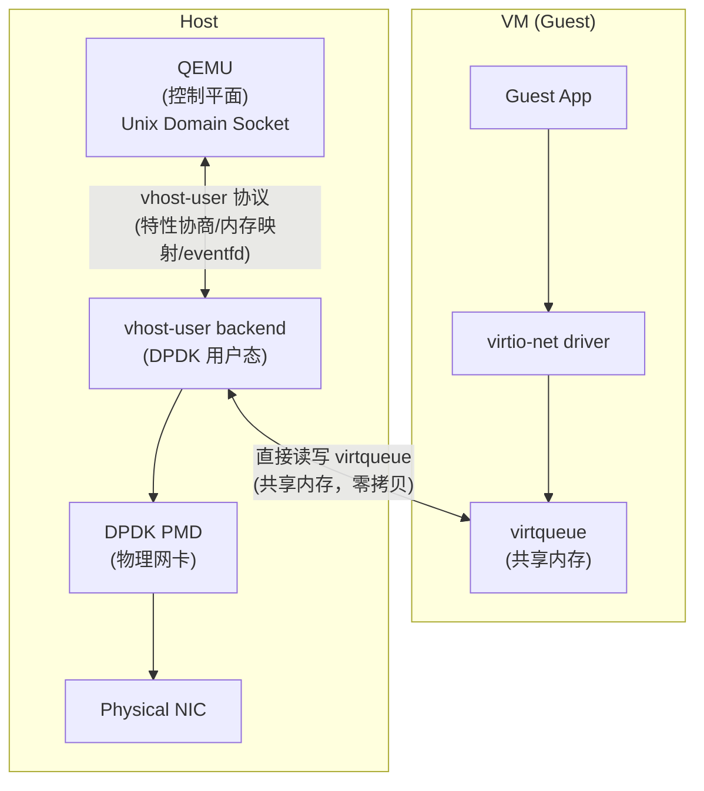
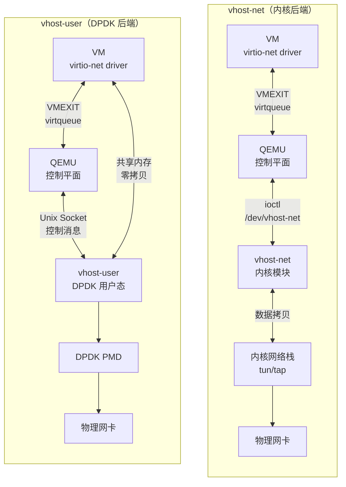

> [!info] DPDK 深度探索系列 0. [[2026-04-09-dpdk-deep-dive-series-index|全栈学习路径总览]]
> 1-15. 前十五章已完成
> 15b. [[2026-04-09-dpdk-deep-dive-ch15b-af-xdp|第十五章补充：AF_XDP —— KNI 的现代替代]] 16. **第十六章：vhost-user 与 virtio 加速**
> 16a. [[2026-04-09-dpdk-deep-dive-ch16a-ovs-dpdk-vhost-user-lab|第十六章补充：OVS-DPDK 与 vhost-user 最小实战]]

---

## 1. 概述：为什么需要 vhost-user？

### 1.1 从 vhost-net 到 vhost-user：内核瓶颈

在虚拟化场景中，VM 的网络 I/O 需要经过 virtio 前端驱动（Guest 内）和 vhost 后端（Host 侧）配合完成。最早的后端是 **vhost-net**（内核模块），数据路径是：

```
VM → virtio driver → VMEXIT → QEMU → vhost-net (内核) → 物理网卡
                                                    ↑
                                              每次收发包都要经过
                                              内核模块处理
```

vhost-net 虽然比纯 QEMU 模拟快得多（省去了 QEMU 用户态的 I/O 模拟），但仍有瓶颈：

- **VMEXIT 开销**：Guest 访问 virtqueue 需要陷入 Host，即使 vhost 在内核态也绕不开
- **内核调度**：vhost-net worker 线程受内核调度器制约
- **无法利用 DPDK**：vhost-net 走内核网络栈，无法使用 DPDK 的 PMD 和轮询模式

**vhost-user 的核心思路**：把 vhost 后端从内核搬到用户态，直接和 DPDK 对接，绕过内核网络栈。

### 1.2 vhost-user vs vhost-net vs KNI

| 特性          | KNI（已废弃）         | vhost-net（内核）     | vhost-user（DPDK）          |
| ------------- | --------------------- | --------------------- | --------------------------- |
| **通信对象**  | Linux 内核网络栈      | VM (QEMU)             | VM (QEMU)                   |
| **后端位置**  | 内核模块 `rte_kni.ko` | 内核模块 `vhost_net`  | 用户态 (DPDK)               |
| **数据路径**  | FIFO + ioctl (有拷贝) | 内核 tun/tap (有拷贝) | 共享内存 + eventfd (零拷贝) |
| **延迟**      | ~5-10μs               | ~3-10μs               | ~1-5μs                      |
| **吞吐量**    | ~1-2 Mpps             | ~5-10 Mpps            | 线速 (几乎无开销)           |
| **DPDK 集成** | 有限                  | 不支持                | 原生支持                    |
| **适用场景**  | 控制平面（SSH/BGP）   | 轻量级 VM 网络        | 数据平面 VM 网络、NFV       |

### 1.3 virtio + vhost-user 架构



关键点：**virtqueue 是 VM 和 Host 之间的共享内存区域**，两边都可以直接读写，无需任何拷贝。QEMU 只负责控制平面（内存映射、fd 传递），不参与数据平面。

### 1.4 三层架构：Guest、QEMU、DPDK 各自做什么？

vhost-user 涉及三个参与者，理解它们各自的角色是读懂本章的前提：

```
┌─────────────────────────────────────────────────────────────────────┐
│                        三层架构全景                                 │
├─────────────────────────────────────────────────────────────────────┤
│                                                                     │
│  第一层：Guest（VM 内部）                                           │
│  ┌─────────────────────────────────────────────────────────────┐   │
│  │  Guest App → virtio-net driver → virtqueue（共享内存）       │   │
│  │                                                             │   │
│  │  Guest 只知道一件事：                                        │   │
│  │  "我有一个 virtio-net 网卡，我用标准的 virtio 驱动操作它"      │   │
│  │                                                             │   │
│  │  Guest 不知道也不关心：                                      │   │
│  │  - 后端是 vhost-net（内核）还是 vhost-user（DPDK）           │   │
│  │  - 后端是 QEMU 模拟还是硬件 offload                         │   │
│  │  - Host 上有没有 DPDK                                      │   │
│  └─────────────────────────────────────────────────────────────┘   │
│       │ MMIO 写寄存器（触发 VMEXIT）                                 │
│       │ 共享内存读写（数据面，不触发 VMEXIT）                        │
│       ▼                                                             │
│  第二层：QEMU（中间人，控制平面）                                    │
│  ┌─────────────────────────────────────────────────────────────┐   │
│  │  QEMU 负责"牵线搭桥"：                                      │   │
│  │                                                             │   │
│  │  1. 创建 VM 和 virtio-net 前端设备                           │   │
│  │  2. 收到 VMEXIT 后，把事件转发给后端                          │   │
│  │  3. 连接 DPDK vhost-user backend（Unix Socket）              │   │
│  │  4. 把 VM 的内存 fd 传给 DPDK（SET_MEM_TABLE）              │   │
│  │  5. 把 kickfd/callfd 传给 DPDK                              │   │
│  │                                                             │   │
│  │  QEMU 不参与数据面：                                        │   │
│  │  - 不拷贝数据包                                              │   │
│  │  - 不处理网络包                                              │   │
│  │  - 连接建立后几乎透明                                        │   │
│  └─────────────────────────────────────────────────────────────┘   │
│       │ Unix Domain Socket（vhost-user 协议）                       │
│       │ SCM_RIGHTS（fd 传递）                                     │
│       ▼                                                             │
│  第三层：DPDK vhost-user backend（数据面）                          │
│  ┌─────────────────────────────────────────────────────────────┐   │
│  │  DPDK 负责"干苦力"：                                        │   │
│  │                                                             │   │
│  │  1. 通过 Unix Socket 完成特性协商和内存映射                   │   │
│  │  2. 直接读写 VM 的 virtqueue（共享内存，零拷贝）              │   │
│  │  3. 把收到的包通过 DPDK PMD 发到物理网卡                      │   │
│  │  4. 把物理网卡收到的包写入 VM 的 virtqueue                    │   │
│  │  5. 通过 eventfd 与 VM 进行收发通知                           │   │
│  └─────────────────────────────────────────────────────────────┘   │
│       │                                                           │
│       ▼                                                           │
│  物理网卡                                                          │
│                                                                     │
└─────────────────────────────────────────────────────────────────────┘
```

### 1.5 Guest 如何"通知"Host？（MMIO 与 VMEXIT）

一个核心问题：Guest 在 VM 里运行，Host 在 VM 外面。Guest 怎么告诉 Host "我有新数据了"？

答案是通过 **MMIO（Memory-Mapped I/O）寄存器触发 VMEXIT**：

```
Guest 发包通知的完整过程：

  Guest (VM 内)                          Host
  ─────────────                          ─────

  1. virtio-net driver 写数据到 desc 缓冲区
     （共享内存，直接写，无 VMEXIT）

  2. 把 desc 索引写入 avail ring
     （共享内存，直接写，无 VMEXIT）

  3. 写 MMIO 寄存器通知 Host
     ┌──────────────────────────────────────┐
     │  VIRTIO_MMIO_QUEUE_NOTIFY = 0x50   │
     │  outl(queue_id, 0x50)              │
     └──────────────────┬───────────────────┘
                        │
                        ▼
                   VMEXIT（CPU 陷入 Host）
                        │
                        ▼
                    QEMU 截获
                        │
              ┌─────────┴──────────┐
              │                    │
         vhost-net 模式         vhost-user 模式
              │                    │
              ▼                    ▼
         内核直接处理         QEMU 写入 kickfd
         无需额外步骤          (eventfd_write)
                                   │
                                   ▼
                              DPDK 收到 epoll 事件
                              开始处理 avail ring
```

**MMIO** 是 virtio 设备暴露给 Guest 的一组寄存器，映射到 Guest 的物理地址空间。Guest 往这些地址写值时，CPU 会触发 **VMEXIT**，把控制权交给 Host（QEMU）。

> [!note] 数据面不触发 VMEXIT
> 步骤 1 和 2（写 desc 缓冲区和 avail ring）是对共享内存的操作，**不会触发 VMEXIT**。只有步骤 3（写 MMIO 通知寄存器）才触发 VMEXIT。这是 virtio 高性能的关键——绝大多数工作都在 VM 内完成，不需要陷入 Host。

### 1.6 三种 fd 各自做什么？

vhost-user 涉及三种 fd，容易混淆：

```
┌─────────────────────────────────────────────────────────────────┐
│  fd 全景                                                          │
├─────────────────────────────────────────────────────────────────┤
│                                                                 │
│  1. conn_fd（Unix Domain Socket 连接 fd）                        │
│     ─────────────────────────────────────                      │
│     类型：AF_UNIX, SOCK_STREAM                                 │
│     创建者：QEMU connect() → DPDK accept()                     │
│     用途：QEMU 和 DPDK 之间的控制消息通道                        │
│     传输内容：                                                    │
│       - VhostUserMsg（特性协商、内存表、virtqueue 地址等）       │
│       - SCM_RIGHTS 辅助消息（附带其他 fd 传递）                   │
│     数据面参与：不参与（只在初始化时用）                           │
│                                                                 │
│  2. kickfd（eventfd，VM → Host 通知）                            │
│     ────────────────────────────────                            │
│     类型：eventfd                                                 │
│     创建者：QEMU                                                │
│     传递方式：QEMU 通过 SET_VRING_KICK 消息 + SCM_RIGHTS 传给 DPDK│
│     用途：VM 写完 avail ring 后，通知 DPDK 有新数据              │
│     工作方式：                                                    │
│       DPDK 通过 eventfd_read() 读取（epoll 监听）               │
│       QEMU 通过 eventfd_write() 写入（收到 VMEXIT 后）           │
│                                                                 │
│  3. callfd（eventfd，Host → VM 通知）                            │
│     ────────────────────────────────                            │
│     类型：eventfd                                                 │
│     创建者：QEMU                                                │
│     传递方式：QEMU 通过 SET_VRING_CALL 消息 + SCM_RIGHTS 传给 DPDK│
│     用途：DPDK 处理完 used ring 后，通知 VM 回收缓冲区            │
│     工作方式：                                                    │
│       DPDK 通过 eventfd_write() 写入                             │
│       Guest 通过 virtio 中断机制收到通知                          │
│                                                                 │
│  4. 内存 fd（mmap 的 fd，不是 socket 也不是 eventfd）             │
│     ───────────────────────────────────────────────              │
│     类型：普通文件 fd（共享内存或 hugepage）                      │
│     创建者：QEMU（VM 内存的 backing file）                       │
│     传递方式：QEMU 通过 SET_MEM_TABLE 消息 + SCM_RIGHTS 传给 DPDK│
│     用途：DPDK mmap 这些 fd 后，可以直接访问 VM 的物理内存        │
│     这是零拷贝的基础                                               │
│                                                                 │
└─────────────────────────────────────────────────────────────────┘
```

### 1.7 从 VM 启动到发第一个包的完整流程

```
阶段一：QEMU 启动 VM

  QEMU 命令：
  qemu-system-x86_64 \
      -chardev socket,id=vhost-net0,path=/var/run/dpdk/vhost-net0 \
      -netdev type=vhost-user,id=net0,chardev=vhost-net0 \
      -device virtio-net-pci,netdev=net0 \
      -m 4096 ...

  QEMU 启动 VM，VM 开始引导...

阶段二：QEMU 连接 DPDK

  1. QEMU connect() /var/run/dpdk/vhost-net0
  2. DPDK accept()，得到 conn_fd
  3. DPDK epoll 加入 conn_fd

阶段三：控制面协商（通过 conn_fd 上的 vhost-user 协议）

  QEMU                          DPDK
  ─────                          ─────
  GET_FEATURES      ──────────→  回复 VHOST_USER_NET_SUPPORTED_FEATURES
  SET_FEATURES      ──────────→  保存协商后的特性
  SET_OWNER         ──────────→  标记 owner
  SET_MEM_TABLE     ──────────→  mmap 内存 fd，建立 GPA → HVA 映射
  SET_VRING_ADDR    ──────────→  记录 virtqueue 的 GPA 地址
  SET_VRING_KICK    ──────────→  保存 kickfd，加入 epoll
  SET_VRING_CALL    ──────────→  保存 callfd
  SET_VRING_ENABLE  ──────────→  启用 virtqueue

  协商完成，触发 new_device 回调

阶段四：Guest 加载 virtio-net 驱动

  Guest 内核发现 virtio-net PCI 设备
  → 加载 virtio_net 驱动
  → 驱动通过 MMIO 探测设备特性、配置 virtqueue
  → 驱动准备好接收缓冲区，写入 avail ring

阶段五：发送第一个包

  Guest virtio-net driver:
    1. 构造数据包 → 写入 desc 缓冲区（共享内存）
    2. desc 索引写入 avail ring（共享内存）
    3. outl(queue_id, VIRTIO_MMIO_QUEUE_NOTIFY) → VMEXIT

  QEMU 收到 VMEXIT:
    4. 识别是 virtio notify
    5. eventfd_write(kickfd, 1)  → 通知 DPDK

  DPDK 收到 kickfd 事件（epoll）:
    6. 读取 avail ring，解析 desc
    7. 通过 GPA → HVA 映射直接访问 VM 内存中的数据包
    8. 构造 rte_mbuf，通过 DPDK PMD 发到物理网卡
    9. 更新 used ring
    10. eventfd_write(callfd, 1) → 通知 Guest 回收缓冲区

  Guest 收到通知:
    11. 读取 used ring，回收 desc 缓冲区
```

---

## 2. virtio 机制

### 2.1 virtqueue 结构

virtqueue 是 VM 和 Host 之间的共享内存环形缓冲区。每个 virtio-net 设备至少有两个 virtqueue：

- **TX virtqueue**：VM → Host（VM 发包）
- **RX virtqueue**：Host → VM（VM 收包）

每个 virtqueue 由三个部分组成：

```
virtqueue 内存布局（共享内存）：

┌─────────────────────────────────────────────────────────────┐
│                    Descriptor Table                           │
│  ┌──────────┬──────────┬──────────┬─────┬──────────┐        │
│  │ desc[0]  │ desc[1]  │ desc[2]  │ ... │ desc[N]  │        │
│  │ addr, len│ addr, len│ addr, len│     │ addr, len│        │
│  │ flags,   │ flags,   │ flags,   │     │ flags,   │        │
│  │ next     │ next     │ next     │     │ next     │        │
│  └──────────┴──────────┴──────────┴─────┴──────────┘        │
│  每个 desc 指向一个 Guest 物理内存中的缓冲区                      │
├─────────────────────────────────────────────────────────────┤
│                    Available Ring                              │
│  ┌─────────┬─────┬──────────┬──────────┬─────┬──────────┐   │
│  │ flags   │ idx │ ring[0]  │ ring[1]  │ ... │ ring[N]  │   │
│  └─────────┴─────┴──────────┴──────────┴─────┴──────────┘   │
│  Guest 写入 desc 索引，Host 读取                               │
│  "我准备好了这些缓冲区，你来用"                                  │
├─────────────────────────────────────────────────────────────┤
│                    Used Ring                                   │
│  ┌─────────┬─────┬──────────┬──────────┬─────┬──────────┐   │
│  │ flags   │ idx │ elem[0]  │ elem[1]  │ ... │ elem[N]  │   │
│  │         │     │ id, len  │ id, len  │     │ id, len  │   │
│  └─────────┴─────┴──────────┴──────────┴─────┴──────────┘   │
│  Host 写入处理结果，Guest 读取                                   │
│  "我用完了这些缓冲区，你可以回收了"                               │
└─────────────────────────────────────────────────────────────┘

数据流向（以 TX 为例）：
  Guest: 写数据到 desc 缓冲区 → 把 desc 索引写入 avail ring → kick Host
  Host:  读 avail ring → 处理 desc 中的数据 → 把结果写入 used ring → call Guest
```

```c
// vring_desc - 描述符（定义在 Linux kernel virtio_ring.h）
struct vring_desc {
    __u64 addr;     // 缓冲区物理地址 (Guest Physical Address)
    __u32 len;      // 缓冲区长度
    __u16 flags;    // 标志
    __u16 next;     // 下一个描述符索引 (链式描述符时使用)
};

// 描述符标志
#define VRING_DESC_F_NEXT       1  // 有下一个描述符（链式）
#define VRING_DESC_F_WRITE      2  // 设备可写（Host → VM 方向）
#define VRING_DESC_F_INDIRECT   4  // 间接描述符表

// vring_avail - 可用环（Guest 写，Host 读）
struct vring_avail {
    __u16 flags;         // VRING_AVAIL_F_NO_INTERRUPT 等
    __u16 idx;           // 下一个要填充的位置（单调递增）
    __u16 ring[];        // desc 索引数组
};

// vring_used_elem - 已用环元素
struct vring_used_elem {
    __u32 id;    // 已使用的描述符头部索引
    __u32 len;   // 写入的数据长度（对设备只写时有效）
};

// vring_used - 已用环（Host 写，Guest 读）
struct vring_used {
    __u16 flags;         // VRING_USED_F_NO_NOTIFY 等
    __u16 idx;           // 下一个要填充的位置（单调递增）
    struct vring_used_elem ring[];
};
```

### 2.2 virtio-net 头部

```c
// virtio-net 头 (在数据前面的控制头，定义在 Linux kernel virtio_net.h)
struct virtio_net_hdr {
    __u8 flags;          // VIRTIO_NET_HDR_F_*
    __u8 gso_type;       // VIRTIO_NET_HDR_GSO_*
    __virtio16 hdr_len;  // GSO 头部长度
    __virtio16 gso_size; // GSO 分段大小
    __virtio16 csum_start;
    __virtio16 csum_offset;
};

// 合并接收变体（num_buffers 只在这个结构中）
struct virtio_net_hdr_mrg_rxbuf {
    struct virtio_net_hdr hdr;
    __virtio16 num_buffers;  // 合并接收的缓冲片数
};

// 头部标志
#define VIRTIO_NET_HDR_F_NEEDS_CSUM  1  // 需要设备计算校验和
#define VIRTIO_NET_HDR_F_DATA_VALID   2  // 校验和已由设备验证
#define VIRTIO_NET_HDR_F_RSC_INFO     4  // RSC (Receive Segment Coalescing) 信息

// GSO 类型
#define VIRTIO_NET_HDR_GSO_NONE       0  // 无 GSO
#define VIRTIO_NET_HDR_GSO_TCPV4      1  // IPv4 TCP
#define VIRTIO_NET_HDR_GSO_TCPV6      2  // IPv6 TCP
#define VIRTIO_NET_HDR_GSO_UDP         3  // UDP (virtio 1.0+)
#define VIRTIO_NET_HDR_GSO_TCP_ECN    4  // TCP ECN
```

### 2.3 发送流程 (VM → Host)

```
┌─────────────────────────────────────────────────────────────────────────────┐
│                    virtio 发送流程 (VM → Host)                              │
├─────────────────────────────────────────────────────────────────────────────┤
│                                                                             │
│  Guest 侧 (virtio-net driver):                                             │
│  ─────────────────────────────                                            │
│                                                                             │
│  1. 准备数据到 desc 指向的缓冲区                                           │
│     desc[desc_idx].addr → Guest 物理内存                                    │
│     desc[desc_idx].len  → 数据长度                                         │
│                                                                             │
│  2. 将 desc_idx 写入 avail ring                                           │
│     avail->ring[avail->idx % size] = desc_idx                            │
│     avail->idx++                                                          │
│                                                                             │
│  3. 通知 Host (kick)                                                       │
│     写入 kickfd (eventfd)，Host 侧 epoll 收到通知                            │
│                                                                             │
│  Host 侧 (vhost-user backend):                                            │
│  ────────────────────────────────                                          │
│                                                                             │
│  4. 轮询 avail ring，检查新增的 desc                                       │
│     avail->idx - last_avail_idx → 新 desc 数量                            │
│                                                                             │
│  5. 读取 desc，获取缓冲区地址和长度                                        │
│     通过 GPA → HVA 映射直接访问 VM 内存                                    │
│                                                                             │
│  6. 处理数据（转发/发到物理网卡）                                           │
│                                                                             │
│  7. 将处理结果写入 used ring                                               │
│     used->ring[used->idx % size] = { .id = desc_idx, .len = written }    │
│     used->idx++                                                           │
│                                                                             │
│  8. 通知 Guest (call)                                                      │
│     写入 callfd (eventfd)，Guest 收到通知后回收缓冲区                        │
│                                                                             │
└─────────────────────────────────────────────────────────────────────────────┘

注意 avail/used 的方向：
  avail ring: Guest 写入（"我准备好了"），Host 读取
  used  ring: Host 写入（"我处理完了"），Guest 读取
```

---

## 3. vhost-user 协议

### 3.1 vhost-user 消息类型

```c
// DPDK 中的实际类型定义 (lib/vhost/vhost_user.h)
typedef enum VhostUserRequest {
    VHOST_USER_NONE                     = 0,
    VHOST_USER_GET_FEATURES             = 1,
    VHOST_USER_SET_FEATURES             = 2,
    VHOST_USER_SET_OWNER                = 3,
    VHOST_USER_RESET_OWNER              = 4,
    VHOST_USER_SET_MEM_TABLE            = 5,   // 共享内存表（最关键的消息）
    VHOST_USER_SET_LOG_BASE             = 6,
    VHOST_USER_SET_LOG_FD               = 7,
    VHOST_USER_SET_VRING_NUM            = 8,   // 设置 virtqueue 大小
    VHOST_USER_SET_VRING_ADDR           = 9,   // 设置 virtqueue 地址
    VHOST_USER_SET_VRING_BASE           = 10,
    VHOST_USER_GET_VRING_BASE           = 11,
    VHOST_USER_SET_VRING_KICK           = 12,  // 绑定 kick fd (VM → Host 通知)
    VHOST_USER_SET_VRING_CALL           = 13,  // 绑定 call fd (Host → VM 通知)
    VHOST_USER_SET_VRING_ERR            = 14,
    VHOST_USER_GET_PROTOCOL_FEATURES    = 15,
    VHOST_USER_SET_PROTOCOL_FEATURES    = 16,
    VHOST_USER_GET_QUEUE_NUM            = 17,
    VHOST_USER_SET_VRING_ENABLE         = 18,
    VHOST_USER_SEND_RARP                = 19,
    VHOST_USER_NET_SET_MTU              = 20,
    VHOST_USER_SET_SLAVE_REQ_FD         = 21,
    VHOST_USER_IOTLB_MSG                = 22,
    VHOST_USER_SET_VRING_ENDIAN         = 23,
    VHOST_USER_GET_CONFIG               = 24,
    VHOST_USER_SET_CONFIG               = 25,
    VHOST_USER_CREATE_CRYPTO_SESSION    = 26,
    VHOST_USER_CLOSE_CRYPTO_SESSION     = 27,
    VHOST_USER_POSTCOPY_ADVISE          = 28,
    VHOST_USER_MAX_MSG                  = 29,
} VhostUserRequest;

// 消息格式 (lib/vhost/vhost_user.h)
typedef struct VhostUserMsg {
    union {
        uint32_t master;    // VhostUserRequest (QEMU → backend)
        uint32_t slave;     // VhostUserBackendRequest (backend → QEMU)
    } request;

    uint32_t flags;         // VHOST_USER_FLAG_*
    uint32_t size;          // payload 大小

    union {
        uint64_t u64;
        struct vhost_vring_state state;      // index + num
        struct vhost_vring_addr addr;
        struct vhost_memory memory;
        struct vhost_user_memory memory2;
    } payload;
} __attribute__((packed)) VhostUserMsg;
```

### 3.2 主要消息流程

```c
// 1. 获取特性
static int
vhost_user_get_features(int sockfd, uint64_t *features)
{
    VhostUserMsg msg = {
        .request.master = VHOST_USER_GET_FEATURES,
        .flags = VHOST_USER_VERSION,
        .size = 0,
    };

    sendmsg(sockfd, &msg, 0);
    recvmsg(sockfd, &msg, 0);

    *features = msg.payload.u64;
    return 0;
}

// 2. 设置内存表（关键！这是零拷贝的基础）
static int
vhost_user_set_mem_table(int sockfd, struct vhost_user_ctx *ctx)
{
    VhostUserMsg msg;
    int fds[RTE_MAX_MEM_REGIONS];
    int fd_num = 0;

    msg.request.master = VHOST_USER_SET_MEM_TABLE;
    msg.size = sizeof(msg.payload.memory);
    msg.payload.memory.nregions = ctx->nregions;

    // 填充每个内存区域
    for (int i = 0; i < ctx->nregions; i++) {
        msg.payload.memory.regions[i].guest_phys_addr = region[i].gpa;
        msg.payload.memory.regions[i].userspace_addr  = region[i].hva;
        msg.payload.memory.regions[i].memory_size     = region[i].size;
        msg.payload.memory.regions[i].mmap_offset     = region[i].offset;

        // 通过 SCM_RIGHTS 传递内存 fd
        fds[fd_num++] = region[i].fd;
    }

    // 发送消息 + fds (sendmsg 的 SCM_RIGHTS 机制)
    struct msghdr msgh;
    struct iovec iov = { &msg, sizeof(msg) };
    msgh.msg_iov = &iov;
    msgh.msg_iovlen = 1;
    msgh.msg_control = fds_buf;  // SCM_RIGHTS 辅助消息
    sendmsg(sockfd, &msgh, 0);

    return 0;
}

// 3. 绑定 VRING kick/call fd
static int
vhost_user_set_vring_kick(int sockfd, uint32_t index, int fd)
{
    VhostUserMsg msg = {
        .request.master = VHOST_USER_SET_VRING_KICK,
        .flags = VHOST_USER_VERSION,
        .size = sizeof(struct vhost_vring_file),
    };
    msg.payload.u64 = (uint64_t)index;
    // fd 通过 SCM_RIGHTS 传递

    sendmsg_with_fd(sockfd, &msg, fd);
    return 0;
}

static int
vhost_user_set_vring_call(int sockfd, uint32_t index, int fd)
{
    VhostUserMsg msg = {
        .request.master = VHOST_USER_SET_VRING_CALL,
        .flags = VHOST_USER_VERSION,
        .size = sizeof(struct vhost_vring_file),
    };
    msg.payload.u64 = (uint64_t)index;

    sendmsg_with_fd(sockfd, &msg, fd);
    return 0;
}
```

### 3.3 共享内存映射

```c
// vhost-user 关键：QEMU 将 VM 内存区域通过 fd 传递给 DPDK
// DPDK mmap 这些 fd 后，可以直接访问 VM 物理内存（零拷贝基础）

// DPDK 中的定义 (lib/vhost/vhost.h)
typedef struct VhostUserMemoryRegion {
    uint64_t guest_phys_addr;   // VM 物理地址 (GPA)
    uint64_t userspace_addr;    // Host 用户空间地址 (HVA)
    uint64_t memory_size;       // 区域大小
    uint64_t mmap_offset;       // mmap 偏移量
} VhostUserMemoryRegion;

typedef struct VhostUserMemory {
    uint32_t nregions;
    uint32_t padding;
    VhostUserMemoryRegion regions[];
} VhostUserMemory;

// GPA → HVA 转换（DPDK 公共 API）
// DPDK 内部维护 GPA → HVA 映射表，收到 SET_MEM_TABLE 时构建
int rte_vhost_va_from_guest_pa(int vid, uint64_t gpa, uint64_t *va);
```

---

## 4. DPDK vhost-user 实现

### 4.1 vhost-user 库

```c
// lib/vhost/rte_vhost.h — DPDK vhost 公共 API

// 特性位 (定义在 lib/vhost/vhost.h)
#define VIRTIO_F_VERSION_1              32  // virtio 1.0
#define VIRTIO_F_RING_INDIRECT_DESC      28  // 间接描述符 (注意：值是 28，不是 38)
#define VIRTIO_RING_F_INDIRECT_DESC      28  // 同上，标准命名
#define VIRTIO_F_RING_EVENT_IDX          29  // Event_idx (注意：值是 29，不是 39)
#define VIRTIO_RING_F_EVENT_IDX          29  // 同上，标准命名
#define VIRTIO_F_RING_PACKED             34  // Packed virtqueue (virtio 1.0)
#define VHOST_USER_F_PROTOCOL_FEATURES   30  // 协议特性协商

// DPDK 中实际使用的特性集合 (lib/vhost/vhost_user.h)
#define VHOST_USER_NET_SUPPORTED_FEATURES   \
    (VIRTIO_NET_SUPPORTED_FEATURES |        \
     (1ULL << VIRTIO_F_RING_PACKED) |       \
     (1ULL << VIRTIO_NET_F_MTU) |           \
     (1ULL << VHOST_F_LOG_ALL) |            \
     (1ULL << VHOST_USER_F_PROTOCOL_FEATURES) | \
     (1ULL << VIRTIO_NET_F_CTRL_RX) |       \
     (1ULL << VIRTIO_NET_F_GUEST_ANNOUNCE))

// vhost-user 回调（DPDK 实际定义）
struct rte_vhost_device_ops {
    int (*new_device)(int vid);                                         /**< Add device */
    void (*destroy_device)(int vid);                                    /**< Remove device */
    int (*vring_state_changed)(int vid, uint16_t queue_id, int enable); /**< VRING enable/disable */
    int (*features_changed)(int vid, uint64_t features);                /**< Feature negotiation result */
    int (*new_connection)(int vid);                                     /**< New vhost connection */
    void (*destroy_connection)(int vid);                                /**< vhost connection closed */
    void (*guest_notified)(int vid);                                    /**< Guest notified about pending packets */
    bool (*guest_notify)(int vid, uint16_t queue_id);                   /**< Custom notification to guest */
};
```

### 4.2 创建 vhost-user 设备

```c
// 1. 注册 vhost-user socket（创建 Unix Domain Socket 并监听）
int
rte_vhost_driver_register(const char *path, uint64_t flags);

// 2. 注册回调
int
rte_vhost_driver_callback_register(const char *path,
                                   const struct rte_vhost_device_ops *ops);

// 3. 启动 vhost-user 后端（开始接受 QEMU 连接）
int
rte_vhost_driver_start(const char *path);

// 典型使用流程：
static const struct rte_vhost_device_ops vswitch_ops = {
    .new_device = vswitch_new_device,
    .destroy_device = vswitch_destroy_device,
    .vring_state_changed = vswitch_vring_state_changed,
};

int main(int argc, char *argv[])
{
    const char *socket_path = "/var/run/vhost-switch/vhost-net0";

    // 注册 socket
    rte_vhost_driver_register(socket_path, 0);

    // 注册回调
    rte_vhost_driver_callback_register(socket_path, &vswitch_ops);

    // 启动（内部创建 epoll 循环，监听 QEMU 连接和 kickfd 事件）
    rte_vhost_driver_start(socket_path);

    // 之后 DPDK 应用通过 rte_vhost_dequeue_burst() /
    // rte_vhost_enqueue_burst() 收发 VM 的数据包
}
```

内部实现原理（DPDK `lib/vhost/socket.c`）：

```c
// rte_vhost_driver_start() 内部会创建 Unix Domain Socket 并进入事件循环
// 以下是简化后的内部实现

static int
vhost_user_start_server(struct vhost_user_socket *vsocket)
{
    // 1. 创建 Unix Domain Socket
    int listen_fd = socket(AF_UNIX, SOCK_STREAM, 0);

    // 2. bind + listen
    struct sockaddr_un un;
    memset(&un, 0, sizeof(un));
    un.sun_family = AF_UNIX;
    strncpy(un.sun_path, vsocket->path, sizeof(un.sun_path) - 1);
    unlink(vsocket->path);  // 删除旧文件
    bind(listen_fd, (struct sockaddr *)&un, sizeof(un));
    listen(listen_fd, 64);

    // 3. 创建 epoll，监听 listen_fd
    int epfd = epoll_create1(0);
    struct epoll_event ev = { .events = EPOLLIN, .data.fd = listen_fd };
    epoll_ctl(epfd, EPOLL_CTL_ADD, listen_fd, &ev);

    // 4. 事件循环
    while (1) {
        struct epoll_event events[MAX_EVENTS];
        int nfds = epoll_wait(epfd, events, MAX_EVENTS, -1);

        for (int i = 0; i < nfds; i++) {
            if (events[i].data.fd == listen_fd) {
                // ── QEMU 新连接 ──
                int conn_fd = accept(listen_fd, NULL, NULL);

                // 特性协商
                vhost_user_msg_handler(conn_fd, VHOST_USER_GET_FEATURES);
                vhost_user_msg_handler(conn_fd, VHOST_USER_SET_FEATURES);

                // 内存映射（SET_MEM_TABLE 携带 fd）
                vhost_user_msg_handler(conn_fd, VHOST_USER_SET_MEM_TABLE);

                // 绑定 kickfd/callfd
                vhost_user_msg_handler(conn_fd, VHOST_USER_SET_VRING_KICK);
                vhost_user_msg_handler(conn_fd, VHOST_USER_SET_VRING_CALL);

                // 触发 new_device 回调
                if (ops->new_device)
                    ops->new_device(vid);

                // 将 conn_fd 加入 epoll（用于后续消息）
                ev.events = EPOLLIN;
                ev.data.fd = conn_fd;
                epoll_ctl(epfd, EPOLL_CTL_ADD, conn_fd, &ev);

            } else {
                // ── kickfd 事件（VM 通知有新数据） ──
                // 读取 eventfd 计数器（清零）
                eventfd_t val;
                eventfd_read(events[i].data.fd, &val);
                // 标记对应 virtqueue 有数据可读
            }
        }
    }
}
```

关键：**socket fd 有两个，作用不同**：

```
listen_fd（监听 socket）
  └── 由 rte_vhost_driver_register() 创建
  └── bind 到 /var/run/vhost-switch/vhost-net0
  └── QEMU 启动时 connect() 这个路径
  └── accept() 后得到 conn_fd

conn_fd（连接 socket）
  └── QEMU 连接后 accept() 得到
  └── 所有 vhost-user 协议消息（SET_MEM_TABLE、SET_VRING_KICK 等）
     都通过这个 fd 用 sendmsg()/recvmsg() 收发
  └── SET_MEM_TABLE 和 SET_VRING_KICK/CALL 的 fd
     通过 SCM_RIGHTS 机制附带在 sendmsg() 的辅助消息中传递

kickfd/callfd（eventfd，不是 socket）
  └── 由 QEMU 创建，通过 vhost-user 消息传给 DPDK
  └── kickfd: VM → Host 通知（VM 写 avail ring 后写入）
  └── callfd: Host → VM 通知（Host 写 used ring 后写入）
  └── 加入 epoll 监听，收到事件说明有数据要处理
```

### 4.3 处理 vhost-user 消息

```c
// DPDK 内部处理 vhost-user 消息的逻辑（简化）
// 实际实现在 lib/vhost/vhost_user.c

static int
vhost_user_msg_handler(int vid, int fd)
{
    VhostUserMsg msg;

    // 接收消息（可能附带 fd）
    recvmsg(fd, &msg, 0);

    switch (msg.request.master) {
    case VHOST_USER_GET_FEATURES:
        // 回复支持的特性位
        msg.payload.u64 = VHOST_USER_NET_SUPPORTED_FEATURES;
        sendmsg(fd, &msg, 0);
        break;

    case VHOST_USER_SET_FEATURES:
        // 保存协商后的特性
        dev->features = msg.payload.u64;
        break;

    case VHOST_USER_SET_MEM_TABLE:
        // 映射 VM 内存区域（零拷贝的关键步骤）
        for (int i = 0; i < msg.payload.memory.nregions; i++) {
            void *mmap_addr = mmap(NULL,
                msg.payload.memory.regions[i].memory_size +
                msg.payload.memory.regions[i].mmap_offset,
                PROT_READ | PROT_WRITE, MAP_SHARED,
                fds[i], 0);
            // 记录 GPA → HVA 映射
            add_mem_region(dev,
                msg.payload.memory.regions[i].guest_phys_addr,
                (uint64_t)(uintptr_t)mmap_addr +
                    msg.payload.memory.regions[i].mmap_offset,
                msg.payload.memory.regions[i].memory_size);
        }
        break;

    case VHOST_USER_SET_VRING_KICK:
        // 绑定 kick fd (VM → Host 通知)
        // 当 VM 写入 avail ring 后，通过 eventfd 通知 Host
        vq->kickfd = fds[0];
        // 添加到 epoll 监听，收到通知时处理 avail ring
        break;

    case VHOST_USER_SET_VRING_CALL:
        // 绑定 call fd (Host → VM 通知)
        // 当 Host 处理完 used ring 后，通过 eventfd 通知 VM
        vq->callfd = fds[0];
        break;

    case VHOST_USER_SET_VRING_ENABLE:
        // 启用/禁用 virtqueue
        vq->enabled = msg.payload.state.num;
        // 触发 vring_state_changed 回调
        if (dev->ops && dev->ops->vring_state_changed)
            dev->ops->vring_state_changed(vid,
                msg.payload.state.index, vq->enabled);
        break;

    default:
        break;
    }

    return 0;
}
```

---

## 5. 数据路径实现

### 5.1 TX 零拷贝 (VM → Host)

```c
// DPDK 提供的 vhost 收包 API（从 VM 的 TX virtqueue 取包）
// lib/vhost/rte_vhost.h

uint16_t rte_vhost_dequeue_burst(int vid, uint16_t queue_id,
                                  struct rte_mempool *mbuf_pool,
                                  struct rte_mbuf **pkts, uint16_t count);
```

内部处理流程（简化）：

```c
static uint16_t
vhost_dequeue_burst_packed(int vid, uint16_t qid,
                           struct rte_mempool *mbuf_pool,
                           struct rte_mbuf **pkts, uint16_t count)
{
    struct vhost_virtqueue *vq = get_vq(vid, qid);
    uint16_t nb_pkts = 0;

    // 检查 avail ring 有多少新描述符
    uint16_t avail_idx = vq->avail->idx;
    uint16_t start_idx = vq->last_avail_idx;

    while (nb_pkts < count && start_idx + nb_pkts < avail_idx) {
        // 获取描述符索引
        uint16_t desc_idx = vq->avail->ring[(start_idx + nb_pkts) & (vq->size - 1)];

        // 解析描述符链（一个包可能跨多个 desc）
        struct rte_mbuf *m = rte_pktmbuf_alloc(mbuf_pool);
        uint32_t desc_offset = 0;
        uint16_t cur_desc = desc_idx;

        while (cur_desc != desc_idx || desc_offset == 0) {
            struct vring_desc *desc = &vq->desc[cur_desc];

            // GPA → HVA 转换，直接访问 VM 内存
            uint64_t hva;
            rte_vhost_va_from_guest_pa(vid, desc->addr, &hva);

            // 拷贝 virtio-net 头 + 数据到 mbuf
            if (desc_offset == 0) {
                // 第一个 desc：跳过 virtio_net_hdr
                void *hdr = (void *)(uintptr_t)hva;
                desc_offset = sizeof(struct virtio_net_hdr);
            }

            uint32_t data_len = desc->len - desc_offset;
            rte_memcpy(rte_pktmbuf_mtod_offset(m, void *, m->pkt_len),
                       (void *)((uintptr_t)hva + desc_offset), data_len);
            m->pkt_len += data_len;
            m->data_len += data_len;

            desc_offset = 0;

            // 链式描述符
            if (desc->flags & VRING_DESC_F_NEXT)
                cur_desc = desc->next;
            else
                break;
        }

        pkts[nb_pkts++] = m;
    }

    vq->last_avail_idx += nb_pkts;

    // 更新 used ring（通知 VM 缓冲区已用完）
    for (int i = 0; i < nb_pkts; i++) {
        uint16_t desc_idx = vq->avail->ring[(start_idx + i) & (vq->size - 1)];
        vq->used->ring[vq->used->idx & (vq->size - 1)].id = desc_idx;
        vq->used->ring[vq->used->idx & (vq->size - 1)].len = pkts[i]->pkt_len;
        vq->used->idx++;
    }

    // 通知 VM（写入 callfd）
    if (vq->callfd >= 0)
        eventfd_write(vq->callfd, (eventfd_t)1);

    return nb_pkts;
}
```

> [!note] 零拷贝的含义
> 上面代码中仍有 `rte_memcpy`，是因为 DPDK 和 VM 的内存在不同的物理页上，必须拷贝才能让 DPDK PMD 使用。`rte_memcpy` 本身没有任何特殊处理，就是普通的内存拷贝。
>
> **零拷贝模式**是另一套完全不同的代码路径（`rte_vhost_dequeue_burst_zcp`），不是在 rte_memcpy 里做优化。它要求 DPDK 的 mempool 和 QEMU 的 VM 内存**共享同一块 hugepage**，这样 mbuf 的数据指针可以直接指向 VM 的缓冲区，NIC DMA 直接读取，不需要拷贝。
>
> ```
> 普通模式：VM 内存 → rte_memcpy → mbuf → NIC DMA（两次内存访问）
> 零拷贝模式：mbuf->buf_addr = VM 缓冲区地址 → NIC DMA 直接读（一次内存访问）
> ```
>
> 零拷贝的代价是配置复杂度增加：QEMU 和 DPDK 必须共享 hugepage，且 mbuf 的回收时序需要和 VM 的 used ring 同步。大多数场景下普通拷贝模式的性能已经足够。

### 5.2 RX 路径 (Host → VM)

```c
// DPDK 提供的 vhost 发包 API（向 VM 的 RX virtqueue 发包）
// lib/vhost/rte_vhost.h

uint16_t rte_vhost_enqueue_burst(int vid, uint16_t queue_id,
                                  struct rte_mbuf **pkts, uint16_t count);
```

内部处理流程（简化）：

```c
static uint16_t
vhost_enqueue_burst_packed(int vid, uint16_t qid,
                           struct rte_mbuf **pkts, uint16_t count)
{
    struct vhost_virtqueue *vq = get_vq(vid, qid);
    uint16_t nb_pkts = 0;

    while (nb_pkts < count) {
        // 检查 avail ring 是否有空闲 desc（VM 提供的接收缓冲区）
        uint16_t avail_idx = vq->avail->idx;
        if (vq->last_avail_idx + nb_pkts >= avail_idx)
            break;  // VM 没有提供足够的接收缓冲区

        uint16_t desc_idx = vq->avail->ring[(vq->last_avail_idx + nb_pkts) & (vq->size - 1)];

        // 获取 VM 缓冲区地址
        uint64_t hva;
        rte_vhost_va_from_guest_pa(vid, vq->desc[desc_idx].addr, &hva);
        uint32_t buf_len = vq->desc[desc_idx].len;

        // 写入 virtio-net 头
        struct virtio_net_hdr *hdr = (struct virtio_net_hdr *)(uintptr_t)hva;
        memset(hdr, 0, sizeof(*hdr));

        // 拷贝数据到 VM 缓冲区
        uint32_t copy_len = RTE_MIN(pkts[nb_pkts]->pkt_len, buf_len - sizeof(*hdr));
        rte_memcpy(hdr + 1, rte_pktmbuf_mtod(pkts[nb_pkts], void *), copy_len);

        // 更新 used ring
        vq->used->ring[vq->used->idx & (vq->size - 1)].id = desc_idx;
        vq->used->ring[vq->used->idx & (vq->size - 1)].len = sizeof(*hdr) + copy_len;
        vq->used->idx++;

        rte_pktmbuf_free(pkts[nb_pkts]);
        nb_pkts++;
    }

    vq->last_avail_idx += nb_pkts;

    // 通知 VM
    if (vq->callfd >= 0)
        eventfd_write(vq->callfd, (eventfd_t)1);

    return nb_pkts;
}
```

---

## 6. vhost-user vs vhost-net



| 特性          | vhost-user (DPDK)               | vhost-net (kernel)     |
| ------------- | ------------------------------- | ---------------------- |
| **后端位置**  | 用户态 (DPDK)                   | 内核模块               |
| **通信方式**  | Unix Domain Socket              | ioctl `/dev/vhost-net` |
| **数据路径**  | 共享内存（零拷贝）              | tun/tap（有拷贝）      |
| **控制路径**  | QEMU ↔ DPDK（socket）           | QEMU ↔ kernel（ioctl） |
| **轮询模式**  | 支持（rte_vhost_dequeue_burst） | 不支持（依赖中断）     |
| **DPDK 集成** | 原生（PMD 对接）                | 不支持                 |
| **灵活性**    | 高（自定义后端逻辑）            | 低（固定行为）         |
| **性能**      | 最高（接近裸金属）              | 较高（受内核调度制约） |
| **依赖**      | QEMU + DPDK                     | 内核模块 + QEMU        |

---

## 7. 完整示例

### 7.1 vhost-user 交换机

下面的示例实现了一个支持多 VM 的 MAC 学习交换机，核心逻辑：

- 每个 VM 连接时分配一个 vid，记录其 MAC 地址
- 收到物理端口的包，查 MAC 表决定转发到哪个 VM（或广播）
- VM 发出的包进行 MAC 学习
- VM 之间可以直接通信

```c
// vhost-user MAC-learning switch

#include <rte_vhost.h>
#include <rte_ethdev.h>
#include <rte_ether.h>

#define MAX_VMS       8
#define MAX_SOCKETS   8
#define BURST_SIZE    32

// per-VM state
struct vm_entry {
    int      vid;              // vhost device ID (-1 = slot empty)
    uint8_t  mac[RTE_ETHER_ADDR_LEN];
    int      active;
};

// switch context
struct vhost_switch {
    uint16_t            phys_port_id;
    struct rte_mempool *mbuf_pool;
    struct vm_entry     vms[MAX_VMS];
    uint16_t            nb_vms;
    char                socket_paths[MAX_SOCKETS][128];
};

static struct vhost_switch g_switch;

// --- MAC table lookup ---
static struct vm_entry *
find_vm_by_mac(const uint8_t *mac)
{
    for (int i = 0; i < g_switch.nb_vms; i++) {
        if (g_switch.vms[i].active &&
            rte_is_same_ether_addr(mac, g_switch.vms[i].mac))
            return &g_switch.vms[i];
    }
    return NULL;
}

// --- MAC learning from VM's outgoing packets ---
static void
learn_mac(int vid, const uint8_t *mac)
{
    for (int i = 0; i < g_switch.nb_vms; i++) {
        if (g_switch.vms[i].vid == vid) {
            rte_ether_addr_copy((struct rte_ether_addr *)mac,
                                (struct rte_ether_addr *)g_switch.vms[i].mac);
            return;
        }
    }
}

// --- Callbacks ---
static int
vswitch_new_device(int vid)
{
    if (g_switch.nb_vms >= MAX_VMS) {
        printf("Too many VMs, rejecting vid=%d\n", vid);
        return -1;
    }

    // get MAC address configured by QEMU via virtio features
    struct rte_ether_addr mac;
    if (rte_vhost_get_mac_addr(vid, &mac) != 0) {
        // fallback: read from virtio-net config space
        printf("Warning: cannot get MAC for vid=%d\n", vid);
        memset(&mac, 0, sizeof(mac));
    }

    struct vm_entry *e = &g_switch.vms[g_switch.nb_vms];
    e->vid    = vid;
    e->active = 1;
    rte_ether_addr_copy(&mac, (struct rte_ether_addr *)e->mac);
    g_switch.nb_vms++;

    printf("VM connected: vid=%d, mac=%02x:%02x:%02x:%02x:%02x:%02x\n",
           vid, mac.addr_bytes[0], mac.addr_bytes[1], mac.addr_bytes[2],
           mac.addr_bytes[3], mac.addr_bytes[4], mac.addr_bytes[5]);
    return 0;
}

static void
vswitch_destroy_device(int vid)
{
    for (int i = 0; i < g_switch.nb_vms; i++) {
        if (g_switch.vms[i].vid == vid) {
            g_switch.vms[i].active = 0;
            g_switch.vms[i].vid = -1;
            printf("VM disconnected: vid=%d\n", vid);
            return;
        }
    }
}

static const struct rte_vhost_device_ops vswitch_ops = {
    .new_device      = vswitch_new_device,
    .destroy_device  = vswitch_destroy_device,
};

// --- Main loop ---
int main(int argc, char *argv[])
{
    rte_eal_init(argc, argv);

    g_switch.mbuf_pool = rte_pktmbuf_pool_create("mbuf_pool",
        8192, 256, 0, RTE_MBUF_DEFAULT_BUF_SIZE, rte_socket_id());

    // register one vhost-user socket per VM slot
    for (int i = 0; i < MAX_SOCKETS; i++) {
        snprintf(g_switch.socket_paths[i], 128,
                 "/var/run/vhost-switch/vhost-net%d", i);
        rte_vhost_driver_register(g_switch.socket_paths[i], 0);
        rte_vhost_driver_callback_register(g_switch.socket_paths[i],
                                          &vswitch_ops);
        rte_vhost_driver_start(g_switch.socket_paths[i]);
    }

    struct rte_mbuf *mbufs[BURST_SIZE];

    while (1) {
        // ========== 1. Physical port → VM(s) ==========
        uint16_t nb_rx = rte_eth_rx_burst(g_switch.phys_port_id,
                                          0, mbufs, BURST_SIZE);
        for (int i = 0; i < nb_rx; i++) {
            struct rte_ether_hdr *eth =
                rte_pktmbuf_mtod(mbufs[i], struct rte_ether_hdr *);
            int is_broadcast = rte_is_broadcast_ether_addr(&eth->dst_addr);
            struct vm_entry *dst = find_vm_by_mac(eth->dst_addr.bytes);

            if (dst) {
                // unicast: forward to target VM
                rte_vhost_enqueue_burst(dst->vid, 0, &mbufs[i], 1);
            } else if (is_broadcast) {
                // broadcast: flood to all VMs
                for (int j = 0; j < g_switch.nb_vms; j++) {
                    if (g_switch.vms[j].active)
                        rte_vhost_enqueue_burst(g_switch.vms[j].vid, 0,
                                                &mbufs[i], 1);
                }
                rte_pktmbuf_free(mbufs[i]);  // free original
            } else {
                // unknown unicast: flood (or drop in production)
                for (int j = 0; j < g_switch.nb_vms; j++) {
                    if (g_switch.vms[j].active)
                        rte_vhost_enqueue_burst(g_switch.vms[j].vid, 0,
                                                &mbufs[i], 1);
                }
                rte_pktmbuf_free(mbufs[i]);
            }
        }

        // ========== 2. VM → Physical port / VM-to-VM ==========
        for (int j = 0; j < g_switch.nb_vms; j++) {
            struct vm_entry *vm = &g_switch.vms[j];
            if (!vm->active) continue;

            uint16_t nb_deq = rte_vhost_dequeue_burst(
                vm->vid, 1, g_switch.mbuf_pool, mbufs, BURST_SIZE);
            if (nb_deq == 0) continue;

            for (int i = 0; i < nb_deq; i++) {
                struct rte_ether_hdr *eth =
                    rte_pktmbuf_mtod(mbufs[i], struct rte_ether_hdr *);

                // learn source MAC
                learn_mac(vm->vid, eth->src_addr.bytes);

                // check if destination is another VM
                struct vm_entry *dst = find_vm_by_mac(eth->dst_addr.bytes);
                if (dst && dst != vm) {
                    // VM-to-VM: forward directly, no NIC involved
                    rte_vhost_enqueue_burst(dst->vid, 0, &mbufs[i], 1);
                } else {
                    // send to physical port (upstream / external)
                    rte_eth_tx_burst(g_switch.phys_port_id, 0,
                                     &mbufs[i], 1);
                }
            }
        }
    }

    return 0;
}
```

QEMU 侧启动多个 VM：

```bash
# VM1 — connects to vhost-net0
qemu-system-x86_64 \
    -chardev socket,id=vhost-net0,path=/var/run/vhost-switch/vhost-net0 \
    -netdev type=vhost-user,id=net0,chardev=vhost-net0,vhostforce=on \
    -device virtio-net-pci,netdev=net0,mac=00:11:22:33:44:55 \
    -m 4096 -smp 4 ...

# VM2 — connects to vhost-net1
qemu-system-x86_64 \
    -chardev socket,id=vhost-net1,path=/var/run/vhost-switch/vhost-net1 \
    -netdev type=vhost-user,id=net1,chardev=vhost-net1,vhostforce=on \
    -device virtio-net-pci,netdev=net1,mac=00:11:22:33:44:66 \
    -m 4096 -smp 4 ...
```

核心转发逻辑：

- **物理端口 → VM**：查 MAC 表单播 / 广播泛洪
- **VM → 物理端口**：默认发往物理端口（上联 / 外部通信）
- **VM → VM**：查到目标 VM 在本地 MAC 表中，直接 `enqueue_burst` 到目标 VM，不经过物理 NIC

---

## 8. 小结

本章核心要点：

1. **vhost-user 的动机**：vhost-net（内核后端）受内核调度制约，无法利用 DPDK 的 PMD 和轮询模式。vhost-user 把 vhost 后端搬到用户态，与 DPDK 直接对接。

2. **virtqueue 结构**：desc 描述符表（数据缓冲区）+ avail 可用环（**Guest 写 Host 读**）+ used 已用环（**Host 写 Guest 读**），三者构成共享内存环形缓冲区。

3. **virtio-net 头**：紧跟在数据前的控制头，包含 flags、gso_type、checksum 信息。`num_buffers` 只在 `virtio_net_hdr_mrg_rxbuf` 变体中。

4. **发送流程**：VM 填充 desc → 写入 avail ring → kickfd 通知 Host → Host 读取 desc 处理 → 写入 used ring → callfd 通知 VM。

5. **vhost-user 协议**：通过 Unix Domain Socket + SCM_RIGHTS（fd 传递）进行控制平面通信。核心消息：GET/SET_FEATURES、SET_MEM_TABLE（共享内存映射）、SET_VRING_KICK/CALL（eventfd 绑定）。

6. **共享内存映射**：QEMU 将 VM 内存区域通过 fd 传递给 DPDK，DPDK mmap 后通过 GPA → HVA 转换直接访问 VM 内存。

7. **DPDK vhost API**：`rte_vhost_dequeue_burst()`（从 VM 取包）和 `rte_vhost_enqueue_burst()`（向 VM 发包），与 `rte_eth_rx_burst()` / `rte_eth_tx_burst()` 风格一致。

8. **eventfd 通知**：kick fd（VM→Host：avail ring 有新数据）、call fd（Host→VM：used ring 有新结果），替代传统中断。

9. **特性位注意**：`VIRTIO_RING_F_INDIRECT_DESC = 28`（不是 38），`VIRTIO_RING_F_EVENT_IDX = 29`（不是 39）。DPDK 使用 `VHOST_USER_NET_SUPPORTED_FEATURES` 作为默认特性集。

10. **应用场景**：vhost-user 网桥（连接 VM 和物理端口）、存储加速（vhost-scsi）、VDPA（通用 virtio 设备加速）。

**下一篇预告**：[[2026-04-09-dpdk-deep-dive-ch17-vhost-scsi|第十七章]]将讲解 vhost-scsi 存储虚拟化——高性能 VM 存储访问。

---

> [!tip] 参考文献
>
> - "vhost-user 协议", https://qemu.readthedocs.io/en/latest/interop/vhost-user.html
> - "virtio 规范", https://docs.oasis-open.org/virtio/virtio/v1.1/virtio-v1.1.html
> - Intel, "DPDK Vhost", https://doc.dpdk.org/guides/prog_guide/vhost_lib.html
> - Linux kernel, "vhost: virtio server", https://www.kernel.org/doc/Documentation/vhost/vhost.txt
