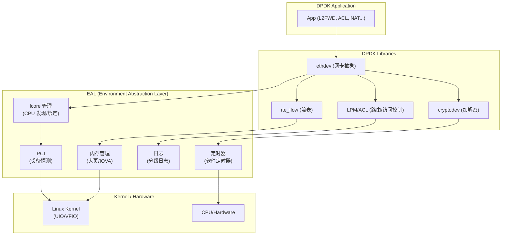
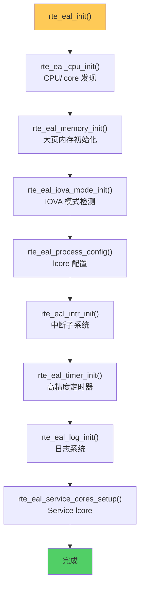
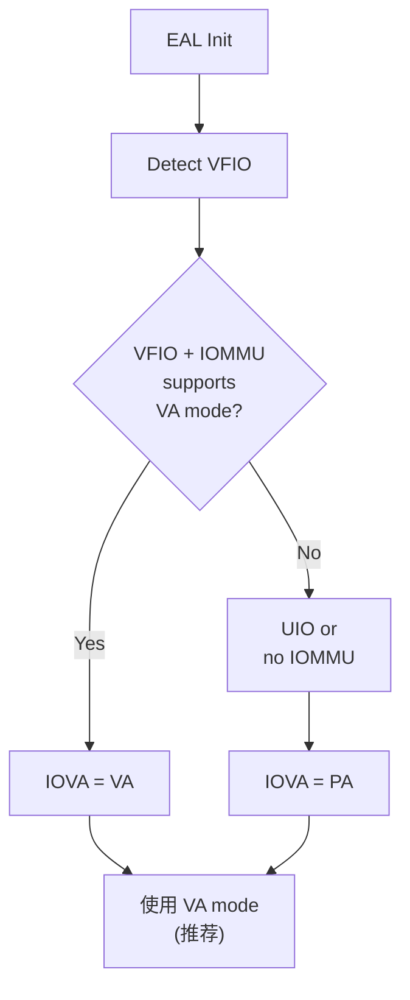
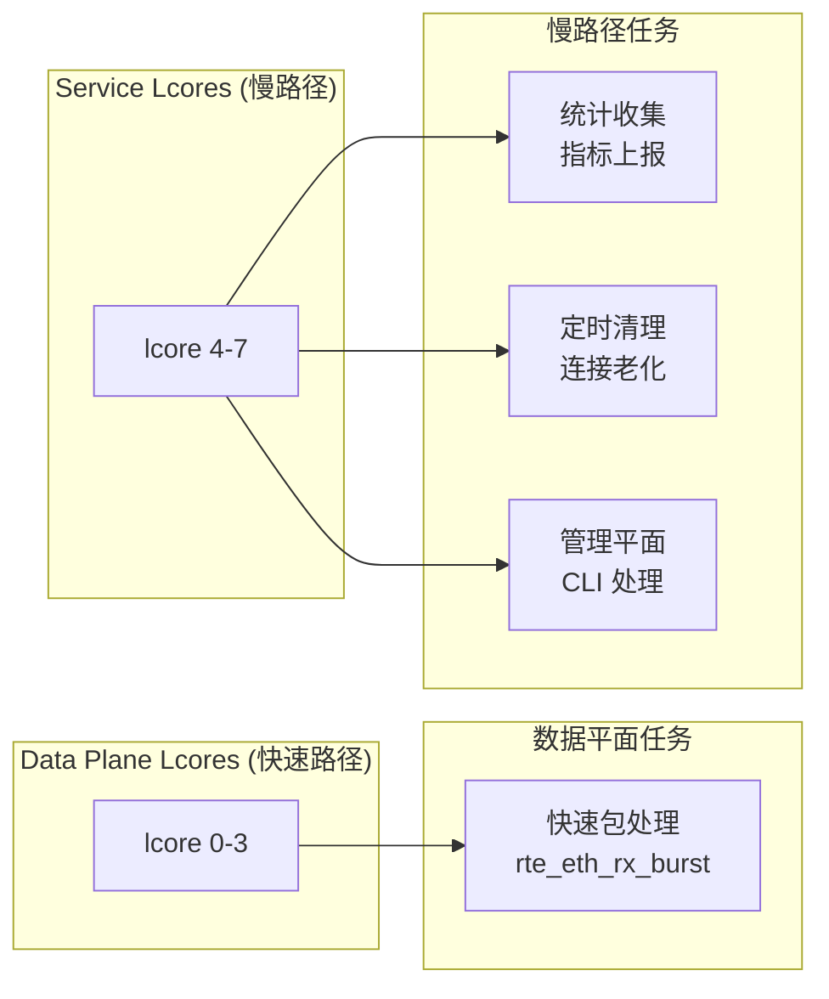

> [!info] DPDK 深度探索系列
> 0. [[2026-04-09-dpdk-deep-dive-series-index|全栈学习路径总览]]
> 1. [[2026-04-09-dpdk-deep-dive-ch1-architecture-overview|第一章：架构概述——kernel bypass 原理与 DPDK 定位]]
> 2. [[2026-04-09-dpdk-deep-dive-ch2-uio-vfio-iommu|第二章：UIO/VFIO/IOMMU 用户态驱动框架]]
> 3. **第三章：EAL 初始化与 lcore 模型**
> 4. [[2026-04-09-dpdk-deep-dive-ch4-hugepage-mempool|第四章：大页内存与 mempool 机制]]
> 5. [[2026-04-09-dpdk-deep-dive-ch5-mbuf-mechanism|第五章：Mbuf 结构与 Dynfield]]

---

## 1. 概述：EAL 在 DPDK 中的角色

EAL (Environment Abstraction Layer) 是 DPDK 的"操作系统适配层"，负责屏蔽底层硬件和 OS 的差异，提供统一的编程接口。

**EAL 的核心职责**：



---

## 2. rte_eal_init 完整流程

`rte_eal_init()` 是 DPDK 应用的入口点，负责初始化所有 EAL 组件。

### 2.1 函数签名与参数

```c
// EAL 初始化函数
int rte_eal_init(int argc, char **argv);

// 典型调用
int main(int argc, char **argv) {
    int ret = rte_eal_init(argc, argv);
    if (ret < 0) {
        rte_exit(EXIT_FAILURE, "EAL init failed\n");
    }
    // ... 应用逻辑 ...
}
```

### 2.2 参数解析

EAL 支持丰富的启动参数：

| 参数 | 说明 | 示例 |
|------|------|------|
| `-c COREMASK` | CPU mask（已废弃） | `-c 0xf` |
| `-l CORELIST` | lcore 列表 | `-l 0-3` |
| `-n CHANNELS` | DDR 通道数 | `-n 4` |
| `--lcores COREMAP` | lcore 到 CPU 的映射 | `--lcores='0-3@0,4-7@1'` |
| `--socket-mem MEM` | 每个 Socket 的大页内存 | `--socket-mem=1024,1024` |
| `-m SIZE` | 总大页内存（已废弃） | `-m 1024` |
| `--master-lcore MSCID` | master lcore ID | `--master-lcore 0` |
| `-v` | 显示版本 | `-v` |
| `--huge-dir` | 大页目录 | `--huge-dir=/mnt/huge` |
| `--file-prefix` | 大页文件前缀 | `--file-prefix=myapp` |
| `-t TIMEOUT` | 初始化超时 | `-t 10` |
| `--allow` | 允许的设备 | `--allow=0000:01:00.0` |
| `--log-level` | 日志级别 | `--log-level=8` |

### 2.3 初始化流程图



---

## 3. CPU/lcore 发现

### 3.1 rte_eal_cpu_init 详解

```c
// lib/eal/common/eal_common_cpu.c

// 每个逻辑核的信息
struct lcore_info {
    unsigned socket_id;          // NUMA socket
    unsigned core_id;            // 物理 core ID
    unsigned thread_id;          // SMT thread ID
    rte_cpuset_t cpuset;         // CPU 亲和性 mask
};

// 全局 lcore 信息数组
static struct lcore_info lcore_config[RTE_MAX_LCORE];

int rte_eal_cpu_init(void) {
    unsigned lcore_id = 0;
    
    // 遍历 /sys/devices/system/cpu/ 获取所有逻辑核
    for (int cpu = 0; cpu < CPU_SETSIZE; cpu++) {
        if (!is_cpu_present(cpu))
            continue;
        
        // 获取 socket_id (NUMA node)
        lcore_config[lcore_id].socket_id = cpu_to_socket(cpu);
        
        // 获取 core_id
        lcore_config[lcore_id].core_id = cpu_to_core(cpu);
        
        // 设置 cpuset
        CPU_SET(cpu, &lcore_config[lcore_id].cpuset);
        
        lcore_id++;
    }
    
    // 设置全局 lcore 数量
    rte_config.lcore_count = lcore_id;
    
    return 0;
}
```

### 3.2 NUMA 感知

```c
// 获取 CPU 对应的 NUMA socket
static inline int cpu_to_socket(int cpu) {
    char path[128];
    FILE *f;
    int socket;
    
    sprintf(path, 
            "/sys/devices/system/cpu/cpu%d/topology/thread_siblings_list", 
            cpu);
    
    f = fopen(path, "r");
    if (f) {
        // 读取 thread_siblings_list (first cpu in the core)
        int first_cpu;
        fscanf(f, "%d", &first_cpu);
        fclose(f);
        
        // 从 first_cpu 获取 socket
        sprintf(path, 
                "/sys/devices/system/cpu/cpu%d/node", 
                first_cpu);
        
        if (access(path, F_OK) == 0) {
            f = fopen(path, "r");
            fscanf(f, "%d", &socket);
            fclose(f);
        } else {
            socket = 0;  // Fallback to socket 0
        }
    } else {
        socket = 0;
    }
    
    return socket;
}
```

### 3.3 lcore_role 枚举

```c
// lib/eal/include/rte_lcore.h

enum rte_lcore_role {
    ROLE_RTE = 0,       // 工作 lcore，可运行数据平面
    ROLE_OFF,           // 禁用
    ROLE_SERVICE,       // Service core (DPDK 17+)
    ROLE_VIRTUAL        // 虚拟 lcore (无对应物理 CPU)
};

// lcore 配置结构
struct rte_lcore_config {
    uint32_t count;                    // 总 lcore 数
    enum rte_lcore_role role[RTE_MAX_LCORE];
    unsigned socket_id[RTE_MAX_LCORE];
    rte_cpuset_t cpuset[RTE_MAX_LCORE];
    int pipe_master2worker[2];          // 通信管道
    int pipe_worker2master[2];
};
```

---

## 4. 大页内存初始化

### 4.1 rte_eal_memory_init 流程

```
┌─────────────────────────────────────────────────────────────────┐
│                  rte_eal_memory_init()                          │
└─────────────────────────────────────────────────────────────────┘
                              │
          ┌───────────────────┼───────────────────┐
          ▼                   ▼                   ▼
   ┌──────────────┐   ┌──────────────┐   ┌──────────────┐
   │ Try 1GB Huge │   │ Try 2MB Huge │   │ Fallback     │
   │ pages        │   │ pages        │   │ 4KB pages    │
   └──────────────┘   └──────────────┘   └──────────────┘
          │                   │                   │
          ▼                   ▼                   ▼
   ┌──────────────┐   ┌──────────────┐   ┌──────────────┐
   │ Success?     │   │ Success?     │   │ Not recommended│
   └──────────────┘   └──────────────┘   └──────────────┘
          │                   │
          └─────────┬─────────┘
                    ▼
           ┌──────────────────┐
           │ Setup memseg     │
           │ (IOVA mapping)   │
           └──────────────────┘
                    │
                    ▼
           ┌──────────────────┐
           │ Setup memzone   │
           │ (kernel API)     │
           └──────────────────┘
```

### 4.2 大页配置

```bash
# 查看当前大页配置
grep -i huge /proc/meminfo

# HugePages_Total:    1024
# HugePages_Free:     512
# Hugepagesize:       2048 kB

# 配置 1GB 大页 (需要 BIOS 支持)
echo 4 > /sys/kernel/mm/hugepages/hugepages-1048576kB/nr_hugepages

# 配置 2MB 大页
echo 1024 > /sys/kernel/mm/hugepages/hugepages-2048kB/nr_hugepages

# 查看大页文件
ls -la /mnt/huge/
# -rw------- 1 root root 2G Apr  9 10:00 2MB-0-1048576kB
# -rw------- 1 root root 2G Apr  1 10:00 1048576kB-0
```

### 4.3 memseg 结构

```c
// lib/eal/common/eal_memory.c

struct rte_memseg {
    phys_addr_t phys_addr;      // 物理地址
    uint64_t iova;              // IOVA 地址
    void *addr;                 // 虚拟地址
    size_t len;                 // 长度
    int socket_id;              // NUMA socket
    uint32_t hugepage_sz;       // 大页 size (2MB/1GB)
    int master;                 // 主 segment
};

// 全局内存段列表
static struct rte_memseg *memseg[RTE_MAX_NUMA_NODES];
static int num_memseg[RTE_MAX_NUMA_NODES];

// memzone 是预分配的内存区域
struct rte_memzone {
    char name[RTE_MEMZONE_NAMESIZE];
    phys_addr_t phys_addr;
    uint64_t iova;
    void *addr;
    size_t len;
    unsigned socket_id;
    uint32_t flags;
    uint32_t hugepage_sz;
};
```

---

## 5. IOVA 模式检测

### 5.1 两种 IOVA 模式

| 模式 | 说明 | 适用场景 |
|------|------|---------|
| **IOVA as PA** | IOVA = 物理地址 | VFIO with IOMMU, UIO |
| **IOVA as VA** | IOVA = 虚拟地址 | 虚拟化场景，VFIO |

```c
// lib/eal/common/eal_memory.c

enum rte_iova_mode {
    RTE_IOVA_DC = 0,    // Don't care (未检测)
    RTE_IOVA_PA = 'p',  // IOVA as Physical Address
    RTE_IOVA_VA = 'v'   // IOVA as Virtual Address
};

// 检测 VFIO IOMMU 是否支持 DMA 地址翻译
static int detect_iova_mode(void) {
    struct vfio_iommu_info *info;
    
    // 检查是否使用 VFIO
    if (rte_eal_has_type(RTE_DEV_BUS_PCI)) {
        // 尝试获取 VFIO IOMMU 信息
        if (vfio_get_iommu_type(NULL, NULL) >= 0) {
            // 检查是否支持 VA mode
            if (vfio_check_device(NULL, VFIO_IOMMU_INFO_VADDR) == 0)
                return RTE_IOVA_VA;
        }
    }
    
    return RTE_IOVA_PA;  // 默认 PA 模式
}
```

### 5.2 IOVA 模式选择流程



---

## 6. lcore 配置与绑定

### 6.1 --lcores 参数详解

`--lcores` 是最强大的 lcore 配置参数，支持灵活的 CPU 绑定：

```bash
# 格式: --lcores='<lcore_set>@<cpu_set>[,<lcore_set>@<cpu_set>]...'

# 示例 1: lcore 0-3 绑定到 CPU 0-3
./dpdk-app --lcores='0-3@0-3'

# 示例 2: lcore 0-1 绑定到 CPU 0, lcore 2-3 绑定到 CPU 4
./dpdk-app --lcores='0-1@0,2-3@4'

# 示例 3: 复杂映射，NUMA aware
./dpdk-app --lcores='0-3@0,4-7@1,8-11@0,12-15@1'

# 示例 4: 使用角色分隔符
./dpdk-app --lcores='0-3@0,4-7@1;ROLE_SERVICE=8-15@0-7'
```

### 6.2 lcore 绑定实现

```c
// lib/eal/common/eal_common_lcore.c

// 解析 --lcores 参数
static int eal_parse_lcores(const char *arg) {
    const char *p = arg;
    unsigned lcore_id = 0;
    
    while (*p) {
        // 解析 lcore_set
        unsigned start, end;
        sscanf(p, "%u-%u", &start, &end);
        
        // 跳过 '@'
        while (*p && *p != '@') p++;
        if (*p != '@') return -1;
        p++;
        
        // 解析 cpu_set
        rte_cpuset_t cpuset;
        CPU_ZERO(&cpuset);
        
        while (*p && *p != ',' && *p != ';') {
            unsigned cpu_start, cpu_end;
            sscanf(p, "%u-%u", &cpu_start, &cpu_end);
            
            for (unsigned cpu = cpu_start; cpu <= cpu_end; cpu++)
                CPU_SET(cpu, &cpuset);
            
            while (*p && *p != ',' && *p != ';') p++;
            if (*p == '-') p++;  // skip '-'
        }
        
        // 应用绑定
        for (unsigned l = start; l <= end; l++) {
            lcore_config[l].cpuset = cpuset;
            lcore_config[l].socket_id = cpu_to_socket(cpu_start);
            lcore_id++;
        }
        
        if (*p == ';') {
            // 处理角色...
            p++;
        }
        if (*p == ',') p++;
    }
    
    return 0;
}
```

### 6.3 CPU 亲和性设置

```c
// 使用 sched_setaffinity 设置 CPU 亲和性
int eal_thread_set_affinity(unsigned lcore_id) {
    cpu_set_t cpuset;
    CPU_ZERO(&cpuset);
    
    // 从 lcore_config 获取 cpuset
    for (int i = 0; i < CPU_SETSIZE; i++) {
        if (CPU_ISSET(i, &lcore_config[lcore_id].cpuset))
            CPU_SET(i, &cpuset);
    }
    
    // 设置当前线程的 CPU 亲和性
    pthread_t tid = pthread_self();
    return pthread_setaffinity_np(tid, sizeof(cpu_set_t), &cpuset);
}

// 在 worker lcore 上执行
int rte_eal_remote_launch(int (*f)(void *), void *arg, unsigned lcore_id) {
    // 创建线程
    pthread_t tid;
    pthread_create(&tid, NULL, eal_thread_loop, arg);
    
    // 等待线程初始化完成
    // ...
}
```

---

## 7. Master lcore

### 7.1 Master lcore 的角色

Master lcore 是 DPDK 应用中**负责初始化和协调**的特殊 lcore：

| 职责 | 说明 |
|------|------|
| **初始化** | 执行所有库的初始化（如 rte_eth_dev_configure） |
| **协调** | 分发任务给 worker lcore |
| **清理** | 负责应用退出时的资源释放 |
| **主循环** | 通常不参与数据平面（可配置） |

### 7.2 指定 master lcore

```bash
# 方法 1: --master-lcore 参数
./dpdk-app --master-lcore=0 --lcores='0@0,1-3@1-3'

# 方法 2: 自动选择（默认第一个 WORKER lcore）
```

### 7.3 Master lcore 初始化代码

```c
// lib/eal/common/eal_common_process.c

// 设置 master lcore
static int eal_parse_master_lcore(const char *arg) {
    unsigned m_lcore = atoi(arg);
    
    if (m_lcore >= rte_config.lcore_count) {
        RTE_LOG(ERR, EAL, "Invalid master lcore %u\n", m_lcore);
        return -1;
    }
    
    rte_config.master_lcore = m_lcore;
    rte_config.lcore_role[m_lcore] = ROLE_RTE;
    
    return 0;
}
```

---

## 8. 中断子系统初始化

### 8.1 VFIO 中断处理

```c
// lib/eal/linux/eal_interrupts.c

int rte_eal_intr_init(void) {
    // 1. 检查是否使用 VFIO
    if (internal_config.vfio_intr_mode == VFIO_INT) {
        // 初始化 VFIO 中断处理
        vfio_intr_init();
    }
    
    // 2. 设置管道用于中断事件通知
    int pipefd[2];
    pipe(pipefd);
    intr_pipe_read = pipefd[0];
    intr_pipe_write = pipefd[1];
    
    // 3. 启动中断处理线程
    pthread_create(&intr_thread, NULL, eal_intr_thread, NULL);
    
    return 0;
}

// 中断处理线程
static void *eal_intr_thread(void *arg) {
    struct epoll_event ev;
    int epfd = epoll_create1(0);
    
    // 监听 VFIO 中断和管道
    epoll_ctl(epfd, EPOLL_CTL_ADD, intr_pipe_read, &ev);
    epoll_ctl(epfd, EPOLL_CTL_ADD, vfio_event_fd, &ev);
    
    while (1) {
        int n = epoll_wait(epfd, &ev, 1, -1);
        
        if (ev.data.fd == intr_pipe_read) {
            // 收到退出信号
            break;
        } else if (ev.data.fd == vfio_event_fd) {
            // VFIO 中断，处理
            handle_vfio_irq();
        }
    }
    
    return NULL;
}
```

### 8.2 中断类型

| 类型 | 说明 | VFIO 支持 |
|------|------|----------|
| **INTx** | Legacy PCI 中断 | ✅ |
| **MSI** | Message Signaled Interrupt | ✅ |
| **MSI-X** | 扩展 MSI，支持更多向量 | ✅ (推荐) |

```c
// 配置 MSI-X 中断
int rte_eth_dev_rx_intr_ctl(uint16_t port_id, uint16_t qid, 
                            int epfd, int op, void *data) {
    struct vfio_irq_info info = { .argsz = sizeof(info) };
    info.index = VFIO_PCI_MSIX_IRQ_INDEX;
    
    // 设置 MSI-X 中断
    struct vfio_irq_set *irq_set;
    irq_set = setup_irq_set(VFIO_PCI_MSIX_IRQ_INDEX, qid, op, data);
    
    return ioctl(vfio_dev_fd, VFIO_DEVICE_SET_IRQS, irq_set);
}
```

---

## 9. 定时器子系统

### 9.1 EAL 定时器初始化

```c
// lib/eal/common/eal_common_timer.c

int rte_eal_timer_init(void) {
    // 1. 检测硬件时钟源
    const char *clock_source = eal_timer_source();
    
    if (strcmp(clock_source, "TSC") == 0) {
        rte_config.timer_source = RTE_TIMER_TSC;
    } else if (strcmp(clock_source, "HPET") == 0) {
        rte_config.timer_source = RTE_TIMER_HPET;
    } else if (strcmp(clock_source, "ARM Generic Timer") == 0) {
        rte_config.timer_source = RTE_TIMER_ARM_GPT;
    }
    
    // 2. 初始化 per-lcore 定时器管理
    RTE_LCORE_FOREACH_WORKER(lcore_id) {
        rte_timer_subsystem_init();
    }
    
    return 0;
}
```

### 9.2 时钟源对比

| 时钟源 | 精度 | 性能 | 适用场景 |
|--------|------|------|----------|
| **TSC** | 1-2 cycles | 最高 | x86 推荐，数据平面 |
| **HPET** | 100ns | 中 | 需要跨 socket 同步 |
| **ARM Generic Timer** | 架构相关 | 高 | ARM 平台 |

---

## 10. 日志系统

### 10.1 日志级别

```c
// lib/eal/include/rte_log.h

enum {
    RTE_LOG_EMERG = 1,   // 系统不可用
    RTE_LOG_ALERT = 2,   // 需要立即处理
    RTE_LOG_CRIT = 3,    // 严重状态
    RTE_LOG_ERR = 4,     // 错误
    RTE_LOG_WARNING = 5, // 警告
    RTE_LOG_NOTICE = 6,  // 重要但正常
    RTE_LOG_INFO = 7,    // 信息
    RTE_LOG_DEBUG = 8     // 调试
};

// 设置全局日志级别
rte_log_set_global_level(RTE_LOG_INFO);

// 设置特定类型日志级别
RTE_LOG_REGISTER_LEVEL(rte_log_lib_ethdev, "lib.ethdev");
rte_log_set_level(rte_log_lib_ethdev, RTE_LOG_DEBUG);
```

### 10.2 日志宏

```c
// 使用日志宏
RTE_LOG(INFO, EAL, "EAL initialized on lcore %u\n", lcore_id);
RTE_LOG(ERR, EAL, "Failed to initialize PCI: %s\n", strerror(errno));
RTE_LOG(DEBUG, Mempool, "mempool %s free_count=%lu\n", 
        name, rte_mempool_free_count(pool));
```

---

## 11. Service lcore

### 11.1 Service lcore 概念

DPDK 17.05 引入了 Service lcore——专门运行"慢路径"服务的 lcore，释放数据平面 lcore 的算力：



### 11.2 Service lcore 配置

```bash
# --lcores 格式扩展，支持 ROLE_SERVICE
./dpdk-app --lcores='0-3@0-3;SERVICE=4-7@4-7'

# 或者通过 API
struct servicecore_info info = {
    .lcores = {4, 5, 6, 7},
    .count = 4
};
rte_service_set_affinity(&info);
```

---

## 12. EAL 初始化完整代码示例

```c
// 完整的 DPDK 应用入口
#include <rte_eal.h>
#include <rte_ethdev.h>
#include <rte_malloc.h>
#include <rte_lcore.h>

#define RX_DESC 128
#define TX_DESC 128

static volatile bool quit = false;

static int
lcore_worker(void *arg)
{
    uint16_t port_id = *(uint16_t *)arg;
    
    printf("Worker lcore %u started, handling port %u\n",
           rte_lcore_id(), port_id);
    
    while (!quit) {
        struct rte_mbuf *pkts[32];
        
        // 批量接收
        uint16_t nb_rx = rte_eth_rx_burst(port_id, 0, pkts, 32);
        
        if (nb_rx == 0)
            continue;
        
        // 处理并转发
        for (int i = 0; i < nb_rx; i++) {
            rte_pktmbuf_free(pkts[i]);
        }
        
        // 批量发送
        // rte_eth_tx_burst(...);
    }
    
    return 0;
}

int main(int argc, char *argv[])
{
    int ret;
    uint16_t port_id;
    
    // ========== EAL 初始化 ==========
    ret = rte_eal_init(argc, argv);
    if (ret < 0)
        rte_exit(EXIT_FAILURE, "EAL init failed\n");
    
    // 调整参数（EAL 会修改 argc/argv）
    argc -= ret;
    argv += ret;
    
    // ========== PCI 探测 ==========
    RTE_ETH_FOREACH_DEV(port_id) {
        printf("Found port: %u\n", port_id);
    }
    
    if (port_id == 0) {
        printf("No Ethernet ports, exiting\n");
        return -1;
    }
    
    // ========== 端口配置 ==========
    struct rte_eth_conf port_conf = {
        .rxmode = {
            .mq_mode = RTE_ETH_MQ_RX_NONE,
        },
        .txmode = {
            .mq_mode = RTE_ETH_MQ_TX_NONE,
        },
    };
    
    ret = rte_eth_dev_configure(0, 1, 1, &port_conf);
    if (ret < 0)
        rte_exit(EXIT_FAILURE, "Port config failed\n");
    
    // ========== 设置 Rx/Tx 队列 ==========
    struct rte_mempool *mbuf_pool = rte_pktmbuf_pool_create(
        "mbuf_pool",
        8192,
        256,
        0,
        RTE_MBUF_DEFAULT_BUF_SIZE,
        rte_eth_dev_socket_id(0)
    );
    
    ret = rte_eth_rx_queue_setup(0, 0, RX_DESC,
                                   rte_eth_dev_socket_id(0),
                                   NULL, mbuf_pool);
    
    ret = rte_eth_tx_queue_setup(0, 0, TX_DESC,
                                   rte_eth_dev_socket_id(0),
                                   NULL);
    
    // ========== 启动端口 ==========
    ret = rte_eth_dev_start(0);
    if (ret < 0)
        rte_exit(EXIT_FAILURE, "Start port failed\n");
    
    rte_eth_promiscuous_enable(0);
    
    // ========== 启动 worker lcore ==========
    unsigned lcore_id;
    RTE_LCORE_FOREACH_WORKER(lcore_id) {
        rte_eal_remote_launch(lcore_worker, &port_id, lcore_id);
    }
    
    // Master lcore 主循环
    printf("Master lcore %u running\n", rte_lcore_id());
    
    // ========== 等待退出 ==========
    while (!quit) {
        sleep(1);
    }
    
    // 清理
    rte_eal_mp_wait_lcore();
    rte_eth_dev_stop(0);
    rte_eth_dev_close(0);
    rte_eal_cleanup();
    
    return 0;
}
```

---

## 13. 小结

本章核心要点：

1. **EAL 职责**：OS 抽象层，负责 CPU/lcore 发现、内存管理、中断处理、定时器、日志等核心功能。

2. **rte_eal_init 流程**：CPU init → memory init → IOVA mode → lcore config → intr init → timer init → log init → service cores。

3. **lcore 模型**：区分物理 CPU 和"逻辑核"（lcore），通过 `--lcores` 实现灵活的 CPU 绑定，支持 NUMA 亲和。

4. **IOVA 模式**：VFIO + IOMMU 支持 VA mode（推荐），UIO 只能使用 PA mode。

5. **Master lcore**：负责初始化和协调，通常不参与数据平面。

6. **Service lcore**：DPDK 17+ 引入，释放数据平面 lcore 的慢路径任务。

**下一篇预告**：[[2026-04-09-dpdk-deep-dive-ch4-hugepage-mempool|第四章]]将深入讲解大页内存的内部实现、HugeTLB 机制、以及 rte_mempool 的设计原理和性能优化技巧。

---

> [!tip] 参考文献
> - Intel, "DPDK EAL Reference", https://doc.dpdk.org/guides/prog_guide/env_abstraction_layer.html
> - Intel, "DPDK Memory Management", https://doc.dpdk.org/guides/prog_guide/mempool_lib.html
> - Linux Kernel Documentation, "HugeTLB", https://www.kernel.org/doc/html/latest/admin-guide/mm/hugetlbpage.html
