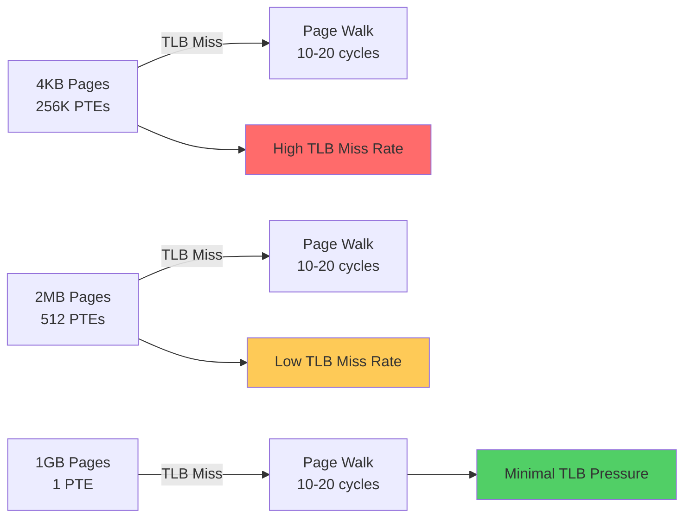
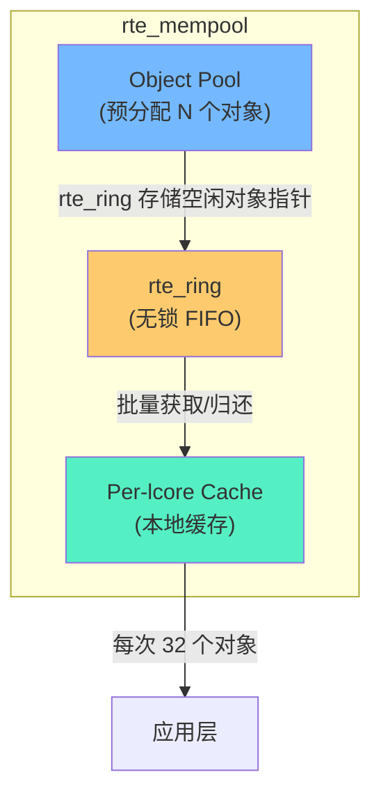

> [!info] DPDK 深度探索系列
> 0. [[2026-04-09-dpdk-deep-dive-series-index|全栈学习路径总览]]
> 1. [[2026-04-09-dpdk-deep-dive-ch1-architecture-overview|第一章：架构概述——kernel bypass 原理与 DPDK 定位]]
> 2. [[2026-04-09-dpdk-deep-dive-ch2-uio-vfio-iommu|第二章：UIO/VFIO/IOMMU 用户态驱动框架]]
> 3. [[2026-04-09-dpdk-deep-dive-ch3-eal-initialization|第三章：EAL 初始化与 lcore 模型]]
> 4. **第四章：大页内存与 mempool 机制**
> 5. [[2026-04-09-dpdk-deep-dive-ch5-mbuf-mechanism|第五章：Mbuf 结构与 Dynfield]]

---

## 1. 概述：为什么 DPDK 必须使用大页？

DPDK 的高性能建立在**预分配大页内存**之上。理解这一设计选择，是理解 DPDK 内存模型的关键。

### 1.1 传统 4KB 页的问题

Linux 默认使用 4KB 页面，当 DPDK 需要 1GB 内存时：

```
传统 4KB 页分配：
- 需要 256,000 个页表项（PTE）
- 每个 PTE 8 字节 → 2MB 的页表内存
- TLB Miss: 虚拟地址 → 物理地址需要多次内存访问
- TLB 容量有限：通常 64-512 个 entry
- 高 TLB miss 率导致性能急剧下降

100G NIC @ 64B packets = 150 Mpps
每包处理时间预算: ~6.6 ns
TLB miss penalty: 100-200 ns (25-30x 预算)
```

### 1.2 大页的优势

| 特性 | 4KB 页 | 2MB 页 | 1GB 页 |
|------|--------|--------|--------|
| **页表项数 (1GB)** | 256K | 512 | 1 |
| **TLB coverage** | 1GB/4KB = 256K entry 需要 | 1GB/2MB = 512 entry | 1 entry |
| **TLB miss 率** | 高 | 低 | 极低 |
| **内存粒度** | 细 | 中 | 粗 |
| **碎片风险** | 低 | 中 | 高 |



---

## 2. Linux HugeTLB 机制

### 2.1 HugeTLB 原理

HugeTLB 是 Linux 内核支持大页内存的子系统，允许进程使用 2MB 或 1GB 的巨页代替默认的 4KB 页：

```
┌─────────────────────────────────────────────────────────────────┐
│                    Linux Virtual Memory                         │
│                                                                  │
│  ┌─────────────────────────────────────────────────────────────┐ │
│  │  Process Virtual Address Space                              │ │
│  │                                                              │ │
│  │    ┌─────┐    ┌─────┐    ┌─────┐    ┌─────┐                │ │
│  │    │4KB  │    │4KB  │    │4KB  │    │4KB  │    ...         │ │
│  │    │Page │    │Page │    │Page │    │Page │                │ │
│  │    └─────┘    └─────┘    └─────┘    └─────┘                │ │
│  │         vs.                                              │ │
│  │    ┌───────────┐                                          │ │
│  │    │   2MB     │                                          │ │
│  │    │ HugePage  │                                          │ │
│  │    └───────────┘                                          │ │
│  └─────────────────────────────────────────────────────────────┘ │
│                              │                                    │
│                              ▼                                    │
│  ┌─────────────────────────────────────────────────────────────┐ │
│  │  CPU MMU / TLB                                               │ │
│  │                                                              │ │
│  │    4KB pages: TLB needs 256K entries to cover 1GB            │ │
│  │    2MB pages: TLB needs only 512 entries to cover 1GB        │ │
│  │    1GB pages: TLB needs only 1 entry to cover 1GB            │ │
│  └─────────────────────────────────────────────────────────────┘ │
│                              │                                    │
│                              ▼                                    │
│  ┌─────────────────────────────────────────────────────────────┐ │
│  │  Physical Memory                                             │ │
│  │                                                              │ │
│  │    ┌───────────────────────────────────────────────────────┐ │ │
│  │    │  HugeTLB Page Pool                                     │ │ │
│  │    │  (pre-allocated at system boot or via admin action)    │ │ │
│  │    └───────────────────────────────────────────────────────┘ │ │
│  └─────────────────────────────────────────────────────────────┘ │
└─────────────────────────────────────────────────────────────────┘
```

### 2.2 配置 HugeTLB

```bash
# 查看当前大页配置
cat /proc/meminfo | grep -i huge

# HugePages_Total:     0     # 尚未分配
# HugePages_Free:      0
# Hugepagesize:     2048 kB  # 2MB 大页

# 分配 1024 个 2MB 大页（共 2GB）
echo 1024 > /sys/kernel/mm/hugepages/hugepages-2048kB/nr_hugepages

# 检查分配结果
cat /proc/meminfo | grep -i huge
# HugePages_Total:  1024
# HugePages_Free:    1024     # 尚未被使用
# Hugepagesize:     2048 kB

# 分配 1GB 大页（需要 BIOS 支持）
echo 4 > /sys/kernel/mm/hugepages/hugepages-1048576kB/nr_hugepages

# 查看大页使用的挂载点
df -h | grep huge
# hugetlbfs           2G      0   2G  0% /mnt/huge

# 查看已分配的大页文件
ls -la /mnt/huge/
# total 0
# -rw-r--r-- 1 root root 2097152 Apr  9 10:00 2MB-0-1048576kB
```

### 2.3 大页内存布局

```
┌─────────────────────────────────────────────────────────────────┐
│                   系统物理内存 (64GB)                            │
│                                                                  │
│  ┌──────────┐ ┌────────────────────────┐ ┌───────────────────┐   │
│  │  DDR 0   │ │      DDR 0              │ │      DDR 1        │   │
│  │  (32GB)  │ │  (continued)            │ │   (32GB)          │   │
│  └──────────┘ └────────────────────────┘ └───────────────────┘   │
│                                                                  │
│  ┌───────────────────────────────────────────────────────────┐   │
│  │              2MB HugePage Pool (Socket 0)                 │   │
│  │  ┌──────┐ ┌──────┐ ┌──────┐ ┌──────┐ ┌──────┐            │   │
│  │  │ HP 0 │ │ HP 1 │ │ HP 2 │ │ HP 3 │ │ HP 4 │  ...     │   │
│  │  └──────┘ └──────┘ └──────┘ └──────┘ └──────┘            │   │
│  │  每个 2MB，所有 HP 连续排列                                 │   │
│  └───────────────────────────────────────────────────────────┘   │
└─────────────────────────────────────────────────────────────────┘
```

---

## 3. DPDK 大页内存管理

### 3.1 DPDK 内存初始化流程

```
rte_eal_memory_init()
    │
    ├─► eal_dmi_config_init()       # 检测 IOMMU/DMI
    │
    ├─► eal_memalloc_init()         # 初始化内存分配器
    │       │
    │       ├─► 尝试 1GB 大页 (Socket 0)
    │       │
    │       ├─► 尝试 1GB 大页 (Socket 1)
    │       │
    │       ├─► 尝试 2MB 大页 (Socket 0)
    │       │
    │       └─► 尝试 2MB 大页 (Socket 1)
    │
    └─► rte_eal_iova_mode_init()    # 设置 IOVA 模式
```

### 3.2 memseg 和 memzone

DPDK 使用两个核心数据结构管理内存：

#### memseg：物理内存段

```c
// lib/eal/common/eal_memory.c

struct rte_memseg {
    phys_addr_t phys_addr;      // 物理起始地址
    uint64_t iova;              // IOVA 地址（见下）
    void *addr;                 // 虚拟起始地址
    size_t len;                 // 段长度
    int socket_id;              // NUMA socket
    uint32_t hugepage_sz;       // 大页 size (2MB or 1GB)
    uint32_tflags;              // 标志位
    int32_t users;              // 引用计数
    char name[RTE_MEMZONE_NAMESIZE];  // 可选名称
};

// memseg 列表（每个 socket 独立管理）
struct rte_memseg_list {
    volatile uint32_t lock;    // 同步锁
    uint32_t page_sz;          // 页大小
    int socket_id;              // socket ID
    uint32_t memseg_arr_len;   // seg 数组长度
    uint32_t memseg_cnt;       // 当前 seg 数量
    struct rte_memseg *memseg; // 指向 memseg 数组
};
```

#### memzone：预分配的具名内存区域

```c
// lib/eal/include/rte_malloc.h

struct rte_memzone {
    char name[RTE_MEMZONE_NAMESIZE];  // 最多 32 字符
    phys_addr_t phys_addr;             // 物理地址
    uint64_t iova;                     // IOVA 地址
    void *addr;                        // 虚拟地址
    size_t len;                        // 长度
    unsigned socket_id;                // NUMA socket
    uint32_t flags;                    // 对齐标志
    uint32_t hugepage_sz;              // 大页 size
};

// 创建 memzone
const struct rte_memzone *
rte_memzone_reserve(const char *name,
                    size_t len,
                    int socket_id,
                    unsigned flags);

// 示例：创建 64KB 对齐的 1MB memzone
const struct rte_memzone *mz;
mz = rte_memzone_reserve("packet_buffer",
                          1024 * 1024,
                          rte_eth_dev_socket_id(port_id),
                          RTE_MEMZONE_64KB);
```

### 3.3 IOVA 模式详解

IOVA (I/O Virtual Address) 是 DPDK 内存模型的核心概念：

| 模式 | IOVA 含义 | 依赖 | 适用场景 |
|------|-----------|------|---------|
| **IOVA as PA** | IOVA = 物理地址 | VFIO+IOMMU 或 UIO | 直接分配 |
| **IOVA as VA** | IOVA = 虚拟地址 | VFIO+IOMMU v2 | 虚拟化，推荐 |

```c
// 检测 IOVA 模式
enum rte_iova_mode {
    RTE_IOVA_DC = 0,    // 未检测
    RTE_IOVA_PA = 'p',  // 物理地址模式
    RTE_IOVA_VA = 'v'   // 虚拟地址模式
};

// DPDK 内存映射（IOVA = VA 模式）
// 用户虚拟地址自动映射到 IOVA，无需手动管理

void *ptr = rte_malloc("packet", 1024, 0);
// ptr 同时是虚拟地址和 IOVA
// 网卡可以直接使用 ptr 作为 DMA 地址
```

### 3.4 多 socket 内存分配

```c
// 在指定 socket 上分配内存
struct rte_mempool *
rte_pktmbuf_pool_create(const char *name,
                        unsigned n,
                        unsigned cache_size,
                        uint16_t priv_size,
                        uint16_t data_room_size,
                        int socket_id)
{
    int sbuf;
    
    // 验证 socket_id 有效
    if (socket_id >= RTE_MAX_NUMA_NODES)
        socket_id = 0;
    
    // 分配在正确 socket 上
    if (socket_id == rte_socket_id(0))
        sbuf = rte_malloc_socket(...);
    else
        sbuf = rte_malloc_socket(...);
}
```

---

## 4. rte_mempool 设计

### 4.1 为什么需要 mempool？

传统内存分配（malloc/kmalloc）的问题：

```
问题 1: 分配延迟不可预测
    // 高负载时，内存碎片导致分配失败或 OOM killer
    struct sk_buff *skb = alloc_skb(len);  // ~100-300ns
    // 但可能在内存紧张时触发 page fault: ~1000-5000ns

问题 2: 内存碎片
    // 频繁 alloc/free 导致内存碎片
    // 1GB 内存，经过 10M 次 alloc/free 后
    // 可能只有 600MB 可用连续空间

问题 3: 跨 NUMA 访问惩罚
    // 在 socket 0 分配的内存，被 socket 1 的 CPU 访问
    // 延迟从 ~100ns 增加到 ~300ns
```

### 4.2 mempool 核心设计

mempool 的核心是一个**预先分配的对象池**，配合无锁 ring 实现高效的对象获取和归还：



### 4.3 无锁 Ring

DPDK 的 rte_ring 是一个高性能的无锁 FIFO，实现参考了 Linux kernel 的kfifo：

```c
// lib/eal/common/eal_ring.h

struct rte_ring {
    char name[RTE_RING_NAMESIZE];     // 名称
    uint32_t flags;                    // 标志
    uint32_t size;                     // ring 大小（必须是 2 的幂）
    uint32_t mask;                     // size - 1（用于 & mask 替代 %）
    
    // 读指针（生产端）
    volatile uint32_t prod.tail;
    volatile uint32_t prod.head;
    
    // 写指针（消费端）
    volatile uint32_t cons.tail;
    volatile uint32_t cons.head;
    
    // 对象存储（每个 entry 是指针）
    void *ring[];  // 柔性数组
};

// 创建 ring
struct rte_ring *r = rte_ring_create(
    "packet_ring",
    8192,          // 大小（2 的幂）
    SOCKET0,       // socket
    0              // flags
);

// 批量入队（无锁 CAS）
uint32_t
rte_ring_mp_enqueue_bulk(struct rte_ring *r,
                          void *const *obj_table,
                          uint32_t n,
                          uint32_t *free_space)
{
    uint32_t prod_head, prod_next;
    uint32_t free;
    
    // 1. 获取当前 prod_head
    prod_head = r->prod.head;
    
    // 2. 计算新的 prod_head
    prod_next = prod_head + n;
    
    // 3. 检查空间（cons.tail 提供信息）
    free = (r->cons.tail > prod_head) ?
           (r->mask + 1 - prod_head + r->cons.tail) :
           (r->cons.tail - prod_head);
    
    if (n > free)
        return 0;
    
    // 4. CAS 更新 prod_head
    if (rte_atomic32_cmpset(&r->prod.head, prod_head, prod_next)) {
        // 成功，移动对象到 ring
        for (uint32_t i = 0; i < n; i++)
            r->ring[prod_head & r->mask + i] = obj_table[i];
        
        // 5. 更新 prod_tail（可见性保证）
        rte_smp_wmb();  // 写屏障
        r->prod.tail = prod_next;
    }
    
    return n;
}
```

### 4.4 Per-lcore 缓存

mempool 为每个 lcore 提供本地缓存，减少对 ring 的竞争：

```c
// mempool 结构
struct rte_mempool {
    char name[RTE_MEMZONE_NAMESIZE];
    struct rte_ring *ring_data;         // 底层 ring
    void *pool_data;                    // 对象池内存
    uint32_t size;                      // 池中对象总数
    uint32_t cache_size;                // per-lcore 缓存大小
    uint32_t private_size;              // 私有数据大小
    
    // Per-lcore 缓存（每个 lcore 独立的本地缓存）
    struct rte_mempool_cache {
        uint32_t len;                   // 缓存中对象数
        void *objs[cache_size];         // 缓存对象指针
    } __rte_cache_aligned;
    
    // 管理结构
    uint32_t populated;                 // 已填充对象数
    rte_mempool_populate_fn_t populate;  // 填充函数
};
```

```c
// 从 mempool 获取对象（优先从本地缓存）
struct rte_mbuf *
rte_pktmbuf_alloc(struct rte_mempool *mp)
{
    struct rte_mempool_cache *cache;
    struct rte_mbuf *m;
    
    // 1. 获取当前 lcore 的本地缓存
    cache = rte_mempool_get_cache(mp);
    
    // 2. 如果本地缓存有对象，直接返回
    if (cache->len > 0) {
        cache->len--;
        m = cache->objs[cache->len];
        return m;
    }
    
    // 3. 本地缓存空了，从 ring 批量补充
    // 批量获取 DEFAULT_CACHE_SIZE (32) 个对象
    rte_mempool_generic_get(mp, DEFAULT_CACHE_SIZE, cache);
    
    // 4. 返回第一个对象
    cache->len--;
    m = cache->objs[cache->len];
    
    return m;
}
```

### 4.5 缓存亲和性

```c
// 应用层：确保在正确的 lcore 上分配
int lcore_worker(void *arg) {
    // 每个 lcore 有独立的 mempool 缓存
    struct rte_mempool *mp = get_mempool_for_this_lcore();
    
    while (1) {
        struct rte_mbuf *m = rte_pktmbuf_alloc(mp);
        // m 来自本地缓存，O(1) 操作，~10ns
        process(m);
        rte_pktmbuf_free(m);
    }
}
```

---

## 5. mbuf pool 创建详解

### 5.1 rte_pktmbuf_pool_create 参数

```c
// lib/mbuf/rte_mbuf.h

struct rte_mempool *
rte_pktmbuf_pool_create(const char *name,
                         unsigned nb_mbuf,
                         unsigned cache_size,
                         uint16_t priv_size,
                         uint16_t data_room_size,
                         int socket_id)
```

| 参数 | 说明 | 典型值 |
|------|------|-------|
| `name` | 池名称 | "mbuf_pool_0" |
| `nb_mbuf` | mbuf 总数 | 8192 |
| `cache_size` | per-lcore 缓存 | 256 |
| `priv_size` | 私有数据大小 | 0 |
| `data_room_size` | 数据区大小 | RTE_MBUF_DEFAULT_BUF_SIZE (2176) |
| `socket_id` | NUMA socket | rte_eth_dev_socket_id(port_id) |

### 5.2 计算内存需求

```
mbuf 结构大小：
  struct rte_mbuf {
      struct rte_mempool *pool;     // 8 bytes
      void *buf_addr;               // 8 bytes
      uint64_t buf_iova;            // 8 bytes
      uint16_t buf_len;             // 2 bytes
      uint16_t data_off;            // 2 bytes
      uint16_t refcnt;              // 2 bytes
      uint16_t nb_segs;             // 2 bytes
      uint16_t port;                // 2 bytes
      uint64_t timestamp;            // 8 bytes
      uint32_t pkt_len;             // 4 bytes
      uint16_t vlan_tci;            // 2 bytes
      uint16_t vlan_tci_outer;      // 2 bytes
      uint32_t ol_flags;            // 4 bytes
      // + dynfield (动态字段)
  } = ~64 bytes

数据缓冲区大小：2176 bytes (2KB + 64)

每个 mbuf 总计：64 + 2176 = 2240 bytes ≈ 2.2KB

对于 8192 个 mbuf：
  总内存 = 8192 × 2240 ≈ 18.4 MB
```

### 5.2 实际创建示例

```c
// DPDK 典型 mbuf pool 创建
#define MBUF_DATA_SIZE (RTE_MBUF_DEFAULT_BUF_SIZE)
#define NB_MBUF 8192
#define CACHE_SIZE 256

struct rte_mempool *
create_mbuf_pool(uint16_t port_id, uint16_t queue_id)
{
    struct rte_mempool *mp;
    int socket_id = rte_eth_dev_socket_id(port_id);
    
    // 创建 mbuf pool
    mp = rte_pktmbuf_pool_create(
        "mbuf_pool",                    // name
        NB_MBUF,                        // nb_mbuf (8192)
        CACHE_SIZE,                     // cache_size (256)
        0,                              // priv_size (0)
        MBUF_DATA_SIZE,                 // data_room_size (2176)
        socket_id                       // socket_id
    );
    
    if (mp == NULL) {
        rte_exit(EXIT_FAILURE,
                  "Cannot create mbuf pool: %s\n",
                  rte_strerror(rte_errno));
    }
    
    // 设置私有数据（用于携带自定义信息）
    struct rte_mempool_priv_flags flags = 0;
    
    // 检查 pool 统计
    struct rte_mempool_info info;
    rte_mempool_get_info(mp, &info);
    printf("Mempool %s: size=%u, free=%lu, alloc=%u\n",
           mp->name, info.size,
           rte_mempool_free_count(mp),
           rte_mempool_in_use_count(mp));
    
    return mp;
}
```

### 5.3 多池设计

对于高性能应用，通常创建多个专用池：

```c
// 按用途分离 mbuf pool
struct {
    struct rte_mempool *pkt_pool;      // 普通数据包
    struct rte_mempool *ctrl_pool;     // 控制平面包（小）
    struct rte_mempool * Jumbo_pool;    // Jumbo frame 池（9KB）
    struct rte_mempool *crypto_pool;    // 加密操作池
} mempools;

// 普通数据包池：2KB 数据区
mempools.pkt_pool = rte_pktmbuf_pool_create(
    "pkt_pool", 16384, 256, 0, 2048, socket_id);

// Jumbo 帧池：9KB 数据区
struct rte_mempool_conf conf = {
    .mbuf_data_size = 9216 + RTE_PKTMBUF_HEADROOM,
    .mbuf_pool_size = 2048,
    .cache_size = 64
};
mempools.jumbo_pool = rte_pktmbuf_pool_create(
    "jumbo_pool", 2048, 64, 0, 9216 + 128, socket_id);
```

---

## 6. 性能优化实践

### 6.1 NUMA 感知分配

```c
// 错误示例：所有 port 使用同一个 pool
mp = rte_pktmbuf_pool_create("shared_pool", 16384, ...);
// 问题：socket 1 的 port 使用 socket 0 分配的内存，跨 NUMA 访问

// 正确示例：每个 socket 独立 pool
struct rte_mempool *mp_by_socket[RTE_MAX_NUMA_NODES];

RTE_ETH_FOREACH_DEV(port_id) {
    int socket_id = rte_eth_dev_socket_id(port_id);
    
    if (mp_by_socket[socket_id] == NULL) {
        mp_by_socket[socket_id] = rte_pktmbuf_pool_create(
            "pool", 16384, 256, 0, 2048, socket_id);
    }
    
    // 每个 port 使用本地 socket 的 pool
    setup_rx_queue(port_id, mp_by_socket[socket_id]);
}
```

### 6.2 缓存行对齐

```c
// DPDK 结构体使用 __rte_cache_aligned 保证对齐
struct rte_mempool_cache {
    uint32_t len;
    void *objs[32];  // 典型 cache_line = 64 bytes
} __rte_cache_aligned;

// 避免 False Sharing
struct stats {
    uint64_t rx_pkts;
    uint64_t tx_pkts;
} __rte_cache_aligned;  // 每个 stats 结构独占缓存行

// 在多核场景下，避免不同 lcore 的计数器在同一个缓存行
struct {
    struct stats s;  // lcore 0
} __rte_cache_aligned;

struct {
    struct stats s;  // lcore 1
} __rte_cache_aligned;
```

### 6.3 批量操作

```c
// 批量获取/归还 mbuf，减少函数调用开销
uint16_t
rte_eth_rx_burst(uint16_t port_id, uint16_t queue_id,
                 struct rte_mbuf **rx_pkts, uint16_t nb_pkts)
{
    // 返回 nb_pkts 个 mbuf，应用直接处理
    // 无需每次 alloc/free
}

// 批量处理
for (int i = 0; i < nb_rx; i++) {
    process_packet(rx_pkts[i]);  // O(1) per packet
}

// 批量归还
rte_mempool_put_bulk(mp, (void **)rx_pkts, nb_rx);
// 一次性归还 32 个 mbuf，比 32 次单次归还快
```

---

## 7. 内存配置诊断

### 7.1 查看 DPDK 内存布局

```bash
# 使用 dpdk-procinfo 查看内存
dpdk-procinfo -- --legacy-meminfo l2fwd

# 或者在应用内打印
rte_dump_memzone(NULL);   // 所有 memzone
rte_dump_memseg(NULL);    // 所有 memseg
rte_dump_ivmem(NULL);     // IOVA 映射
```

### 7.2 常见内存错误

| 错误 | 原因 | 解决 |
|------|------|------|
| `EAL: failed to map HugePage file` | 大页不足 | 增加 hugepages |
| `EAL: Cannot allocate mbuf` | mbuf pool 耗尽 | 增加 pool size |
| `IOMMU: DMA map failed` | IOVA 地址冲突 | 使用 VA mode |
| `out of memory` | 跨 NUMA 分配失败 | 检查 socket-mem |
| `memzone reservation failed` | 内存碎片 | 重启应用 |

### 7.3 调优参数

```bash
# 推荐的大页配置（10G NIC）
# 2MB 大页：2048 个 = 4GB
echo 2048 > /sys/kernel/mm/hugepages/hugepages-2048kB/nr_hugepages

# 或者 1GB 大页（推荐用于大型部署）
echo 4 > /sys/kernel/mm/hugepages/hugepages-1048576kB/nr_hugepages
echo 1024 > /sys/kernel/mm/hugepages/hugepages-2048kB/nr_hugepages

# DPDK EAL 参数
./app \
    --socket-mem=1024,1024 \    # 每个 socket 1GB
    --socket-limit=512,512 \    # 限制每个 socket
    --single-file-segments \    # 所有段放单个文件
    --legacy-mem \             # 旧版内存模式
```

---

## 8. 小结

本章核心要点：

1. ** HugeTLB 机制**：大页（2MB/1GB）大幅减少 TLB miss，100G+ 网络处理必须使用大页。

2. **DPDK 内存层次**：memseg（物理段）→ memzone（具名区域）→ mempool（对象池）。

3. **IOVA 模式**：VA mode（DPDK 20+ 默认）简化内存管理，PA mode 兼容旧系统。

4. **mempool 架构**：无锁 ring + per-lcore 缓存，O(1) 获取/归还，~10ns 延迟。

5. **性能优化**：NUMA 感知分配、缓存行对齐、批量操作是三大关键。

**下一篇预告**：[[2026-04-09-dpdk-deep-dive-ch5-mbuf-mechanism|第五章]]将深入讲解 DPDK 数据包的核心——rte_mbuf 结构的完整字段、Dynfield 动态字段机制、以及 mbuf 在收发包流程中的生命周期。

---

> [!tip] 参考文献
> - Intel, "DPDK Memory Management", https://doc.dpdk.org/guides/prog_guide/mempool_lib.html
> - Intel, "DPDK Mbuf Library", https://doc.dpdk.org/guides/prog_guide/mbuf_lib.html
> - Linux Kernel Documentation, "HugeTLB", https://www.kernel.org/doc/html/latest/admin-guide/mm/hugetlbpage.html
> - "Lock-free single-producer single-consumer queue", DPDK source code lib/eal/common/eal_ring.c
