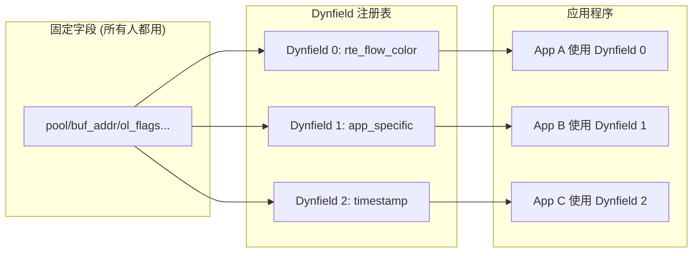

> [!info] DPDK 深度探索系列
> 0. [[2026-04-09-dpdk-deep-dive-series-index|全栈学习路径总览]]
> 1. [[2026-04-09-dpdk-deep-dive-ch1-architecture-overview|第一章：架构概述——kernel bypass 原理与 DPDK 定位]]
> 2. [[2026-04-09-dpdk-deep-dive-ch2-uio-vfio-iommu|第二章：UIO/VFIO/IOMMU 用户态驱动框架]]
> 3. [[2026-04-09-dpdk-deep-dive-ch3-eal-initialization|第三章：EAL 初始化与 lcore 模型]]
> 4. [[2026-04-09-dpdk-deep-dive-ch4-hugepage-mempool|第四章：大页内存与 mempool 机制]]
> 5. **第五章：Mbuf 结构、Dynfield、Dynflag 详解**
> 6. [[2026-04-09-dpdk-deep-dive-ch6-ring-queue|第六章：Ring 无锁队列实现与性能分析]]

---

## 1. 概述：为什么 DPDK 需要 mbuf？

mbuf (memory buffer) 是 DPDK 数据包处理的核心抽象——它代表一个网络数据包，包含数据包元数据（meta）和数据载荷（payload）。

### 1.1 传统 sk_buff 的问题

Linux kernel 的 `struct sk_buff` 功能完善但开销大：

```c
// Linux sk_buff 部分字段（约 200+ 字节）
struct sk_buff {
    struct sk_buff *next;
    struct sk_buff *prev;
    ktime_t     tstamp;         // 时间戳
    struct sock *sk;             // 所属 socket
    struct net_device *dev;      // 入站设备
    char         cb[48];         // 控制块
    unsigned int len;            // 数据长度
    unsigned int data_len;       // 数据分段长度
    __u16        protocol;      // 协议类型
    __u16        transport_header;
    __u16        network_header;
    __u16        mac_header;
    // ...
    struct skb_shared_info *sp;  // 分片信息
    // + 200+ 行
};

// 问题：每个字段都可能触发 Cache miss
// 64B cache line × 4 = 256 bytes per packet minimum
```

### 1.2 DPDK mbuf 设计目标

| 目标 | 实现 | 效果 |
|------|------|------|
| **零拷贝** | 数据区与描述符分离 | 避免不必要的数据复制 |
| **最小开销** | 固定头部 + 动态字段 | 减少 cache miss |
| **批量操作** | 预分配 + 从 mempool 获取 | O(1) 分配 ~10ns |
| **硬件卸载** | ol_flags 标记 offload 需求 | 网卡自动计算 CRC/校验和 |

---

## 2. rte_mbuf 结构详解

### 2.1 完整结构图

```
┌─────────────────────────────────────────────────────────────────────────────┐
│                              rte_mbuf (struct rte_mbuf)                     │
├─────────────────────────────────────────────────────────────────────────────┤
│                                                                             │
│  ┌─────────────────────────────────────────────────────────────────────┐   │
│  │                     Primary Structure (128 bytes, 含缓存行填充)      │   │
│  │                                                                      │   │
│  │  struct rte_mempool *pool;     // 8B  指向所属 mempool              │   │
│  │  void *buf_addr;                // 8B  数据缓冲区虚拟地址            │   │
│  │  rte_iova_t buf_iova;          // 8B  数据缓冲区 IOVA 地址          │   │
│  │  uint16_t buf_len;             // 2B  缓冲区总长度 (通常 2176)      │   │
│  │  uint16_t data_off;            // 2B  数据在缓冲区中的偏移         │   │
│  │  uint16_t refcnt;              // 2B  引用计数 (clones/multi-seg)   │   │
│  │  uint16_t nb_segs;            // 2B  分段数量 (multi-segment)      │   │
│  │                                                                       │   │
│  │  uint64_t ol_flags;            // 8B  Offload 标志位                │   │
│  │  uint16_t pkt_len;             // 2B  完整包长度 (所有 segment 之和) │   │
│  │  uint16_t data_len;            // 2B  本 segment 数据长度           │   │
│  │  uint16_t port;               // 2B  来源端口                      │   │
│  │  uint16_t vlan_tci;           // 2B  VLAN tag                     │   │
│  │  uint64_t timestamp;           // 8B  包时间戳 (DPDK 19.11+ 为 dynfield) │
│  │                                                                       │   │
│  │  union {                                                             │   │
│  │      uint32_t sched_len;      //   调度器使用                       │   │
│  │      uint32_t usr;            //   用户自定义                       │   │
│  │  };                                                                  │   │
│  │                                                                       │   │
│  │  uint16_t vlan_tci_outer;      // 2B  Outer VLAN tag (QinQ)         │   │
│  │                                                                       │   │
│  │  /* 协议头部长度 (位域编码在 64bit tx_offload 中) */                 │   │
│  │  uint64_t tx_offload;           // 8B  TX offload 元数据            │   │
│  │    ├─ l2_len (7 bits)          //   L2 头部长度                     │   │
│  │    ├─ l3_len (9 bits)          //   L3 头部长度                     │   │
│  │    ├─ l4_len (7 bits)          //   L4 头部长度                     │   │
│  │    └─ tso_segsz (16 bits)      //   TSO segment size                │   │
│  │                                                                       │   │
│  │  /* 指针 */                                                          │   │
│  │  struct rte_mbuf *next;        // 8B  下一个 segment (链表)         │   │
│  │  struct rte_mbuf *priv;        // 8B  私有数据指针                  │   │
│  │                                                                       │   │
│  │  /* Dynfield 区域 (预留给动态注册的字段) */                          │   │
│  │  uint8_t dynfield[0];         // 动态字段数组                      │   │
│  │                                                                       │   │
│  └─────────────────────────────────────────────────────────────────────┘   │
│                                                                             │
│  ┌─────────────────────────────────────────────────────────────────────┐   │
│  │                     Data Buffer (buf_addr 指向的内存)                 │   │
│  │                                                                      │   │
│  │  ┌───────────────────────────────────────────────────────────────┐   │   │
│  │  │  RTE_PKTMBUF_HEADROOM (128 bytes)                             │   │   │
│  │  │  (用于 prepend 协议头部，VXLAN 封装等)                        │   │   │
│  │  ├───────────────────────────────────────────────────────────────┤   │   │
│  │  │                    Packet Data                                │   │   │
│  │  │                    (data_len 字节)                             │   │   │
│  │  ├───────────────────────────────────────────────────────────────┤   │   │
│  │  │  Tailroom: buf_len - data_off - data_len                     │   │   │
│  │  │  (用于 append 数据)                                           │   │   │
│  │  └───────────────────────────────────────────────────────────────┘   │   │
│  └─────────────────────────────────────────────────────────────────────┘   │
└─────────────────────────────────────────────────────────────────────────────┘
```

### 2.2 核心字段详解

#### 2.2.1 内存相关字段

```c
// 指向所属 mempool（用于归还时验证）
struct rte_mempool *pool;

// 数据缓冲区地址
void *buf_addr;               // 虚拟地址
rte_iova_t buf_iova;           // IOVA 地址（DMA 用）
uint16_t buf_len;              // 缓冲区总大小（通常 2176B）
uint16_t data_off;             // 数据起始偏移

// 示例：获取数据指针
// rte_pktmbuf_mtod 是一个宏，不是函数
#define rte_pktmbuf_mtod(m, type) ((type)((char *)(m)->buf_addr + (m)->data_off))

// 使用：获取以太网头指针
struct rte_ether_hdr *eth = rte_pktmbuf_mtod(m, struct rte_ether_hdr *);

// 带偏移的版本
#define rte_pktmbuf_mtod_offset(m, type, offset) \
    ((type)((char *)(m)->buf_addr + (m)->data_off + (offset)))

// 安全读取（处理 multi-segment 跨段）
static inline void *
rte_pktmbuf_read(const struct rte_mbuf *m, uint32_t off,
                 uint32_t len, void *buf)
{
    if (off + len <= rte_pktmbuf_data_len(m)) {
        return rte_pktmbuf_mtod_offset(m, void *, off);
    }
    // 处理跨 segment 的情况：逐段拷贝到 buf
    // ...
}
```

#### 2.2.2 分段管理字段

```c
// 引用计数（用于 mbuf clone）
// 当 refcnt > 1 时，不能修改结构或归还 pool
uint16_t refcnt;

// 分段数量（single-segment 通常为 1）
uint16_t nb_segs;

// multi-segment mbuf 示例
// Jumbo frame 被拆分到多个 mbuf segment 中
// 每个 segment 的数据区通常为 2KB
//
//     mbuf[0] (head)         mbuf[1]              mbuf[2]
//    ┌──────────────┐       ┌──────────────┐      ┌──────────────┐
//    │ [ETH+IP+TCP] │       │  Payload     │      │  Payload     │
//    │  headers     │       │  (2048B)     │      │  (剩余)      │
//    │  (54B)       │       │              │      │              │
//    │  + payload   │──────►│              │─────►│              │
//    │  (1994B)     │       │              │      │              │
//    └──────────────┘       └──────────────┘      └──────────────┘
//    next = mbuf[1]        next = mbuf[2]        next = NULL
//
//    mbuf[0]: data_len=2048,  pkt_len=6000
//    mbuf[1]: data_len=2048
//    mbuf[2]: data_len=1904
//    nb_segs = 3, pkt_len = 2048 + 2048 + 1904 = 6000
```

#### 2.2.3 包描述字段

```c
// 完整包长度（所有 segment 之和）
uint32_t pkt_len;

// VLAN tags
uint16_t vlan_tci;         // inner VLAN
uint16_t vlan_tci_outer;   // outer VLAN (QinQ)

// 来源端口
uint16_t port;

// 时间戳
uint64_t timestamp;
```

### 2.3 ol_flags 卸载标志

ol_flags 是 mbuf 最复杂的字段之一，定义了数据包的硬件卸载能力：

> [!note] 以下使用 `PKT_TX_*` / `PKT_RX_*` 旧命名（兼容性宏）。DPDK 20+ 推荐使用 `RTE_MBUF_F_TX_*` / `RTE_MBUF_F_RX_*` 新命名。

```c
// lib/mbuf/rte_mbuf_core.h

// ============== Packet Type ==============
#define PKT_TX_IPV4          (1ULL <<  3)   // IPv4 packet
#define PKT_TX_IPV6          (1ULL <<  4)   // IPv6 packet
#define PKT_TX_VLAN          (1ULL <<  5)   // VLAN tag present
#define PKT_TX_TUNNEL_UDP    (1ULL <<  6)   // UDP tunnel

// ============== Offload Flags (多个位域) ==============

// L3 checksum offload
#define PKT_TX_L4_NO_CKSUM    (0ULL <<  8)  // No L4 cksum
#define PKT_TX_TCP_CKSUM      (1ULL <<  8)  // TCP checksum
#define PKT_TX_UDP_CKSUM      (2ULL <<  8)  // UDP checksum
#define PKT_TX_SCTP_CKSUM     (3ULL <<  8)  // SCTP checksum
#define PKT_TX_L4_CKSUM       (3ULL <<  8)  // Generic L4 cksum

// L3 checksum offload
#define PKT_TX_IP_CKSUM       (1ULL << 10)  // IP header checksum

// TSO (TCP Segmentation Offload)
#define PKT_TX_TSO            (1ULL << 11)  // TSO enabled

// VLAN offload
#define PKT_TX_VLAN_PKT       (1ULL << 12)  // VLAN tag insertion

// Security (IPsec)
#define PKT_TX_SEC_OFFLOAD    (1ULL << 13)  // Security offload

// Timestamp
#define PKT_TX_TIMESTAMP      (1ULL << 14)  // Timestamp flag

// ============== Rx-side flags (接收相关) ==============

// L3/L4 checksum validated
#define PKT_RX_L4_CKSUM_BAD   (1ULL << 16)  // L4 cksum error
#define PKT_RX_L4_CKSUM_GOOD  (1ULL << 17) // L4 cksum good
#define PKT_RX_IP_CKSUM_BAD   (1ULL << 18) // IP cksum error
#define PKT_RX_IP_CKSUM_GOOD  (1ULL << 19) // IP cksum good
#define PKT_RX_VLAN           (1ULL << 20) // VLAN tag present

// RSS hash result
#define PKT_RX_RSS_HASH       (1ULL << 21) // RSS hash computed
uint32_t rss;                    // RSS hash value

// Flow ID / mark
#define PKT_RX_FDIR           (1ULL << 22) // FDIR matched
#define PKT_RX_FDIR_ID        (1ULL << 23) // FDIR ID available
uint32_t fdir_id;               // Flow director ID
```

### 2.4 常用标志组合

```c
// 发送一个简单的 UDP 包
mbuf->ol_flags = PKT_TX_IPV4 | PKT_TX_UDP_CKSUM;
mbuf->l3_len = 20;   // IPv4 header length
mbuf->l4_len = 8;    // UDP header length

// 发送 VLAN tagged packet
mbuf->ol_flags = PKT_TX_IPV4 | PKT_TX_VLAN | PKT_TX_VLAN_PKT;
mbuf->vlan_tci = vlan_tag;

// 接收检查
if (mbuf->ol_flags & PKT_RX_L4_CKSUM_GOOD) {
    // L4 checksum 已验证，无需软件重算
}
```

---

## 3. Dynfield 动态字段机制

### 3.1 为什么需要 Dynfield？

传统的 mbuf 结构是固定的，但应用程序经常需要附加额外数据（如 flow ID、timestamp、encapsulation info）。DPDK 19.11 引入了 dynfield 机制，允许多个应用程序共享 mbuf 的扩展空间而互不冲突：



### 3.2 Dynfield 注册

```c
// lib/mbuf/rte_mbuf_dyn.h

// 动态字段描述
struct rte_mbuf_dynfield {
    const char *name;           // 字段名称（全局唯一）
    size_t size;                // 字段大小（通常 8）
    size_t align;               // 对齐要求
    int offset;                 // 注册成功后由 DPDK 填入偏移量
};

// 注册动态字段（库或应用初始化时调用）
// 返回 offset，后续通过 offset 访问字段
// 如果名称已注册或空间不足返回负值
int rte_mbuf_dynfield_register(const struct rte_mbuf_dynfield *params);

// 使用示例：
static const struct rte_mbuf_dynfield my_field_desc = {
    .name = "my_app_counter",
    .size = sizeof(uint64_t),
    .align = __alignof__(uint64_t),
};

int my_field_offset = rte_mbuf_dynfield_register(&my_field_desc);
if (my_field_offset < 0) {
    // 注册失败：名称冲突或空间不足
}

// 后续通过 offset 读写：
*(uint64_t *)((char *)m + my_field_offset) = value;
```

### 3.3 常用 Dynfield

```c
// ============== DPDK 内置 dynfield（已预注册） ==============

// 内置 dynfield 通过名称查找获取 offset：
// 1. RSS hash（接收时由 PMD 自动填充）
int rss_hash_offset = rte_mbuf_dynfield_lookup("rte_flow_dynf.rss_hash", NULL);

// 2. Timestamp（接收时由 PMD 自动填充）
int timestamp_offset = rte_mbuf_dynfield_lookup("rte_net_ptp_dynfield_timestamp", NULL);

// 3. Flow mark（rte_flow 标记）
// 注意：flow mark 直接存储在 mbuf->hash.fdir.hi 中，不是 dynfield
```

### 3.4 使用 Dynfield

```c
// ============== 注册自定义 dynfield ==============
static const struct rte_mbuf_dynfield app_counter_desc = {
    .name = "app_counter",
    .size = sizeof(uint32_t),
    .align = __alignof__(uint32_t),
};

int offset = rte_mbuf_dynfield_register(&app_counter_desc);
if (offset < 0)
    rte_exit(EXIT_FAILURE, "dynfield register failed\n");

// ============== 读取/写入 ==============

// 写入
static inline void
app_counter_set(struct rte_mbuf *m, uint32_t val)
{
    *(uint32_t *)((char *)m + offset) = val;
}

// 读取
static inline uint32_t
app_counter_get(const struct rte_mbuf *m)
{
    return *(uint32_t *)((char *)m + offset);
}

// ============== 内置 dynfield 读取 ==============

// RSS hash（使用 DPDK 提供的 lookup）
int rss_off = rte_mbuf_dynfield_lookup("rte_flow_dynf.rss_hash", NULL);
if (rss_off >= 0) {
    uint32_t rss = *(uint32_t *)((char *)m + rss_off);
    printf("RSS hash: %u\n", rss);
}

// Timestamp
int ts_off = rte_mbuf_dynfield_lookup("rte_net_ptp_dynfield_timestamp", NULL);
if (ts_off >= 0) {
    uint64_t ts = *(uint64_t *)((char *)m + ts_off);
    printf("Timestamp: %"PRIu64"\n", ts);
}
```

---

## 4. Dynflag 动态标志

### 4.1 Dynflag 概念

与 dynfield 类似，dynflag 允许动态分配 ol_flags 中的未定义位。dynfield 存一个值（"优先级是 3"），dynflag 存一个布尔状态（"需要丢弃"）。

```
dynflag vs dynfield vs 固定 ol_flag

  固定 ol_flag：每个包都用的标志（IPV4、UDP_CKSUM 等）
                零开销，直接位运算

  dynflag：     应用自定义的布尔标签
                只占 1 bit，ol_flags 本来就在 cache line 里
                读取无额外 cache miss

  dynfield：    应用自定义的数值字段
                需要额外内存空间，读取有 pointer arithmetic
                适合存非布尔值（uint32_t 计数器、uint64_t 时间戳）
```

```c
// lib/mbuf/rte_mbuf_dyn.h

// 动态标志描述
struct rte_mbuf_dynflag {
    const char *name;           // 标志名称（全局唯一）
    int bitnum;                 // 注册成功后由 DPDK 分配的 bit 位置
};

// 注册动态标志
int rte_mbuf_dynflag_register(const struct rte_mbuf_dynflag *params);
```

### 4.2 注册和使用

```c
// ============== 注册自定义 flag ==============

static const struct rte_mbuf_dynflag app_color_flag = {
    .name = "app_colored_packet",
    // bitnum 由 DPDK 在注册时自动分配
};

int app_color_flag_bit = rte_mbuf_dynflag_register(&app_color_flag);

// ============== 使用 ==============

// 设置
mbuf->ol_flags |= (1ULL << app_color_flag_bit);

// 检查
if (mbuf->ol_flags & (1ULL << app_color_flag_bit)) {
    // 标志置位
}
```

### 4.3 实际应用场景

**场景 1：流量染色（QoS 丢弃）**

```c
static const struct rte_mbuf_dynflag red_flag = {
    .name = "qos_red",
};
int red_bit = rte_mbuf_dynflag_register(&red_flag);

// 收包时根据 meter 染色
if (rte_meter_trtcm_color_blind_check(meter, length, time) == RTE_METER_RED) {
    m->ol_flags |= (1ULL << red_bit);
}

// 转发时优先丢弃红色包
if (m->ol_flags & (1ULL << red_bit)) {
    rte_pktmbuf_free(m);
    continue;
}
```

**场景 2：多阶段 pipeline 状态传递**

```
  lcore 0 (ACL)  ──flag──▶  lcore 1 (NAT)  ──flag──▶  lcore 2 (Route)

  每个阶段完成后设置对应的 dynflag，
  下游 lcore 检查前序阶段是否已完成
```

```c
int stage_acl_bit   = rte_mbuf_dynflag_register(&(struct rte_mbuf_dynflag){ .name = "stage_acl" });
int stage_nat_bit   = rte_mbuf_dynflag_register(&(struct rte_mbuf_dynflag){ .name = "stage_nat" });
int stage_route_bit = rte_mbuf_dynflag_register(&(struct rte_mbuf_dynflag){ .name = "stage_route" });

// lcore 0
if (apply_acl(m) == PASS)
    m->ol_flags |= (1ULL << stage_acl_bit);

// lcore 1
if (m->ol_flags & (1ULL << stage_acl_bit)) {
    apply_nat(m);
    m->ol_flags |= (1ULL << stage_nat_bit);
}

// lcore 2（最终发送前检查）
uint64_t required = (1ULL << stage_acl_bit)
                   | (1ULL << stage_nat_bit)
                   | (1ULL << stage_route_bit);
if ((m->ol_flags & required) != required) {
    // 某个阶段未完成，走 slow path 或丢弃
}
```

### 4.4 ol_flags 空间演进

ol_flags 只有 64 bit，builtin 标志持续增长，DPDK 通过将低频 builtin 迁移为 dynflag 来维持平衡：

```
DPDK 17.xx：  timestamp、rss 等都是固定字段，mbuf 结构膨胀
DPDK 19.11：  timestamp 迁移为 dynfield，省出 8 字节
DPDK 20.11：  更多不常用 flag 迁移为 dynflag
DPDK 21.11+：  持续瘦身

核心策略：
  高频标志（IPV4、CKSUM、TSO）→ 保留在 ol_flags 固定位置
  低频标志（IPsec、Security 等）→ 迁移为 dynflag
  用户自定义                         → dynflag
```

---

## 5. mbuf 生命周期

### 5.1 创建（从 mempool 分配）

```c
// 方式 1：rte_pktmbuf_alloc（最常用）
struct rte_mbuf *m = rte_pktmbuf_alloc(mbuf_pool);

// 内部流程
// 1. 从 per-lcore cache 获取（如果缓存有）
// 2. 如果缓存空，从 ring 批量补充
// 3. 初始化 mbuf 字段（rte_pktmbuf_reset）
m->pool = mbuf_pool;
m->buf_addr = ...;
m->data_off = RTE_PKTMBUF_HEADROOM;
m->pkt_len = 0;
m->ol_flags = 0;
m->refcnt = 1;

// 方式 2：直接从 mempool 获取（跳过 mbuf 字段初始化）
// 适用于后续会完整覆写所有字段的场景
struct rte_mbuf *m;
rte_mempool_get(mbuf_pool, (void **)&m);
// 注意：此时 m 的字段是未初始化状态，必须手动设置
rte_pktmbuf_reset(m);  // 如果需要标准初始化，手动调用

// 方式 3：批量分配（推荐，减少 per-lcore cache 竞争）
struct rte_mbuf *pkts[32];
rte_pktmbuf_alloc_bulk(mbuf_pool, pkts, 32);
```

### 5.2 填充数据

```c
// 直接填充
char *p = rte_pktmbuf_append(m, size);  // 在尾部追加
memcpy(p, data, size);

// 或者在指定位置
char *p = rte_pktmbuf_prepend(m, size);  // 在头部插入
memcpy(p, header, size);

// 示例：构造一个 UDP 包
// prepend 在数据前面插入空间，所以要从内层到外层依次 prepend
// 正确顺序：先 append payload，再 prepend UDP → IP → Ethernet

// 1. 先放 payload
char *payload = rte_pktmbuf_append(m, payload_len);
memcpy(payload, data, payload_len);

// 2. 从内到外 prepend 各层头部
struct rte_udp_hdr *udp = rte_pktmbuf_prepend(m, sizeof(*udp));
struct rte_ipv4_hdr *ip = rte_pktmbuf_prepend(m, sizeof(*ip));
struct rte_ether_hdr *eth = rte_pktmbuf_prepend(m, sizeof(*eth));

// 填充 Ethernet
eth->ether_type = rte_cpu_to_be_16(RTE_ETHER_TYPE_IPV4);

// 填充 IP
ip->version_ihl = 0x45;
ip->dst_addr = dst_ip;
// ...

// 填充 UDP
udp->src_port = rte_cpu_to_be_16(src_port);
udp->dst_port = rte_cpu_to_be_16(dst_port);
udp->dgram_len = rte_cpu_to_be_16(sizeof(*udp) + payload_len);
```

### 5.3 多段 mbuf

```c
// 创建 multi-segment 包
struct rte_mbuf *m = rte_pktmbuf_alloc(mbuf_pool);
struct rte_mbuf *m2 = rte_pktmbuf_alloc(mbuf_pool);
struct rte_mbuf *m3 = rte_pktmbuf_alloc(mbuf_pool);

// 连接分段（只能追加到链表尾部）
rte_pktmbuf_chain(m, m2);
rte_pktmbuf_chain(m, m3);

// 现在 m->nb_segs = 3
// m->pkt_len = m->data_len + m2->data_len + m3->data_len
```

### 5.4 Clone 和 Reference Counting

```c
// Clone：创建一个间接 mbuf，共享原始 mbuf 的数据缓冲区
struct rte_mbuf *clone = rte_pktmbuf_clone(m, clone_pool);
// clone 是一个 indirect mbuf（无自有数据区）
// clone->buf_addr 指向 m 的数据区
// m 的 refcnt = 2，两者都不能修改共享数据

// 增加引用计数
rte_pktmbuf_refcnt_update(m, 1);

// 减少引用计数（当 refcnt 降到 0 时才释放数据缓冲区）
uint16_t new_cnt = rte_pktmbuf_refcnt_update(m, -1);
if (new_cnt == 0) {
    // 最后一个引用，数据缓冲区将被归还到 mempool
}
```

### 5.5 释放（归还 mempool）

```c
// 单个释放
rte_pktmbuf_free(m);

// 批量释放
rte_mbuf *pkts[MAX_BURST];
uint16_t count = rte_eth_rx_burst(port, queue, pkts, MAX_BURST);

for (int i = 0; i < count; i++) {
    rte_pktmbuf_free(pkts[i]);
}

// 或者批量释放（更快，DPDK 21.11+）
rte_pktmbuf_free_bulk(pkts, count);
```

---

## 6. mbuf 与硬件卸载

### 6.1 TX Offload 流程

```
应用构造 mbuf
    │
    │ 设置 ol_flags 和相关字段
    ▼
┌───────────────────────────────────────┐
│ m->ol_flags = PKT_TX_IPV4 |          │
│               PKT_TX_UDP_CKSUM;      │
│ m->l3_len = 20;  // IPv4 header      │
│ m->l4_len = 8;   // UDP header      │
└───────────────────────────────────────┘
    │
    │ rte_eth_tx_burst()
    ▼
┌───────────────────────────────────────┐
│           PMD Driver                   │
│                                       │
│ 1. 检查 ol_flags                      │
│ 2. 准备 DMA 描述符                    │
│    - 设置 checksum offload 标志位    │
│    - 告诉 NIC 从哪个偏移开始计算     │
│ 3. 准备 VLAN insertion 描述符         │
└───────────────────────────────────────┘
    │
    │ DMA 描述符提交到网卡
    ▼
┌───────────────────────────────────────┐
│           NIC Hardware                 │
│                                       │
│ - DMA 读取 mbuf 数据                   │
│ - 硬件计算 IP checksum (L3)           │
│ - 硬件计算 UDP/TCP checksum (L4)      │
│ - 硬件插入 VLAN tag (如果配置)        │
│ - 硬件 TSO 分片 (如果配置)            │
│ - 发送帧                              │
└───────────────────────────────────────┘
```

### 6.2 RX Offload 流程

```
NIC 接收到帧
    │
    │ DMA 到 mbuf
    ▼
┌───────────────────────────────────────┐
│           NIC Hardware                 │
│                                       │
│ - 剥离 Ethernet CRC (if configured)   │
│ - 计算 L3/L4 checksums                │
│ - 解析 VLAN tags                      │
│ - RSS hash 计算                       │
│ - FDIR 匹配                           │
└───────────────────────────────────────┘
    │
    │ 接收描述符填充
    ▼
┌───────────────────────────────────────┐
│           PMD Driver                   │
│                                       │
│ 1. 从 DMA 描述符读取 info             │
│ 2. 设置 ol_flags:                     │
│    - PKT_RX_L4_CKSUM_GOOD if valid   │
│    - PKT_RX_IP_CKSUM_GOOD if valid   │
│    - PKT_RX_RSS_HASH with hash       │
│    - PKT_RX_VLAN with VLAN tag        │
│ 3. 写入 dynfield:                     │
│    - rss_hash                         │
│    - timestamp                        │
│ 4. 更新 m->pkt_len, m->data_len      │
└───────────────────────────────────────┘
    │
    │ rte_eth_rx_burst()
    ▼
应用处理 mbuf
```

### 6.3 常用 offload 配置

```c
// 接收端口配置：启用 checksum 验证
struct rte_eth_rxconf rx_conf = {
    .offloads = DEV_RX_OFFLOAD_IPV4_CKSUM |
                DEV_RX_OFFLOAD_UDP_CKSUM  |
                DEV_RX_OFFLOAD_TCP_CKSUM,
};

// 发送端口配置：启用 checksum offload
struct rte_eth_txconf tx_conf = {
    .offloads = DEV_TX_OFFLOAD_IPV4_CKSUM |
                DEV_TX_OFFLOAD_UDP_CKSUM  |
                DEV_TX_OFFLOAD_TCP_CKSUM  |
                DEV_TX_OFFLOAD_VLAN_INSERT,
};

// 接收处理：检查 checksum 标志
uint16_t
handle_packet(struct rte_mbuf *m)
{
    // 检查 IP checksum
    if (m->ol_flags & PKT_RX_IP_CKSUM_BAD) {
        // IP checksum 错误，丢弃或记录
        return DROP;
    }
    
    // 检查 L4 checksum
    if (m->ol_flags & PKT_RX_L4_CKSUM_BAD) {
        return DROP;
    }
    
    // checksum 正确，快速路径
    return FORWARD;
}
```

### 6.4 TSO (TCP Segmentation Offload)

```c
// 配置 TSO
struct rte_eth_txconf tx_conf = {
    .offloads = DEV_TX_OFFLOAD_TCP_TSO,
};

struct rte_eth_dev_info dev_info;
rte_eth_dev_info_get(port, &dev_info);

// 设置 TSO segment size
if (dev_info.tx_offload_capa & DEV_TX_OFFLOAD_TCP_TSO) {
    uint16_t tso_mss = 1460;  // MSS (Max Segment Size)
    rte_eth_dev_set_mtu(port, tso_mss + sizeof(struct rte_ipv4_hdr) + sizeof(struct rte_tcp_hdr));
}

// 发送超大包（自动分片）
m->ol_flags |= PKT_TX_TSO;
m->tso_segsz = 1460;  // MSS

// 构造一个 64KB 的 TCP 包
// NIC 自动分片为 ~46 个 MSS segments
uint16_t nb_segs = rte_eth_tx_burst(port, queue, &m, 1);
```

---

## 7. mbuf 调试和诊断

### 7.1 打印 mbuf 内容

```c
// DPDK 提供 rte_pktmbuf_dump（直接调用即可）
rte_pktmbuf_dump(stdout, m, 64);  // 打印 mbuf 信息 + 前 64 字节数据

// 手动打印关键字段
printf("mbuf: %p, pool: %s\n", m, m->pool->name);
printf("  buf_addr=%p, buf_iova=0x%"PRIx64", buf_len=%u\n",
       m->buf_addr, m->buf_iova, m->buf_len);
printf("  data_off=%u, data_len=%u, pkt_len=%u\n",
       m->data_off, m->data_len, m->pkt_len);
printf("  nb_segs=%u, refcnt=%u, port=%u\n",
       m->nb_segs, rte_mbuf_refcnt_read(m), m->port);
printf("  ol_flags=0x%"PRIx64"\n", m->ol_flags);

// 打印数据内容（十六进制）
uint8_t *data = rte_pktmbuf_mtod(m, uint8_t *);
for (uint32_t i = 0; i < 64 && i < m->data_len; i++)
    printf("%02x ", data[i]);
printf("\n");
```

### 7.2 常见错误

| 错误 | 原因 | 解决 |
|------|------|------|
| `mbuf allocation failed` | mempool 耗尽 | 增加 pool size 或检查泄漏 |
| `Assertion ... refcnt == 1 failed` | debug 模式下 refcnt > 1 时执行了 free/prepend | 检查 clone/refcnt 管理，必要时先 rte_pktmbuf_copy 深拷贝 |
| `mbuf has no room for headroom` | data_off 被用尽，无法 prepend | 分配新 mbuf 或使用 rte_pktmbuf_copy |
| `packet length exceeds mbuf bufsize` | 数据超过单 segment 容量 | 使用 multi-segment mbuf 或更大的 pool |
| `cannot free mbuf` | refcnt > 1，最后一个引用未释放 | 确保每个 clone 都有对应的 free |

### 7.3 mbuf 完整性检查

```c
// 检查 mbuf 完整性
static int
validate_mbuf(struct rte_mbuf *m)
{
    // 检查所属 pool 有效
    if (m->pool == NULL)
        return -1;
    
    // 检查 refcnt
    if (rte_mbuf_refcnt_read(m) == 0)
        return -2;
    
    // 检查数据长度（data 不能超出缓冲区）
    if (m->data_off + m->data_len > m->buf_len)
        return -3;
    
    // 检查 multi-segment
    if (m->nb_segs > 1) {
        struct rte_mbuf *s = m->next;
        for (int i = 1; i < m->nb_segs; i++) {
            if (s == NULL)
                return -4;
            s = s->next;
        }
    }
    
    return 0;
}
```

---

## 8. 小结

本章核心要点：

1. **mbuf 设计**：零拷贝、最小开销、批量操作、硬件卸载——DPDK 高性能的核心。

2. **结构详解**：128 字节固定头部（含缓存行填充） + 动态数据缓冲区 + dynfield 扩展空间。

3. **ol_flags**：定义数据包的硬件卸载能力——checksum、TSO、VLAN、RSS 等。

4. **Dynfield**：DPDK 19.11+ 引入，允许应用程序注册自定义字段（RSS hash、timestamp、flow ID）。

5. **Dynflag**：类似的标志位扩展机制，用于应用程序私有标志。

6. **生命周期**：分配（mempool）→ 填充（rte_pktmbuf_append/prepend）→ 处理 → 释放（归还 pool）。

7. **TX/RX Offload**：PMD 和网卡协同实现 checksum、TSO、VLAN 的硬件卸载。

**下一篇预告**：[[2026-04-09-dpdk-deep-dive-ch6-ring-queue|第六章]]将深入讲解 DPDK 无锁数据结构——rte_ring 的无锁 CAS 实现、MP/MC vs SP/SC 模式、及其在 mempool 和线程间通信中的应用。

---

> [!tip] 参考文献
> - Intel, "DPDK Mbuf Library", https://doc.dpdk.org/guides/prog_guide/mbuf_lib.html
> - Intel, "Mbuf One", https://doc.dpdk.org/rte__mbuf_8h.html
> - "rte_mbuf Dynfield and Dynflag", https://doc.dpdk.org/guides/prog_guide/mbuf_lib.html#dynamic-fields-and-flags
