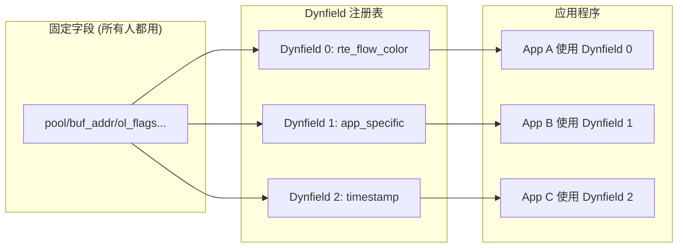

> [!info] DPDK 深度探索系列
> 0. [[2026-04-09-dpdk-deep-dive-series-index|全栈学习路径总览]]
> 1. [[2026-04-09-dpdk-deep-dive-ch1-architecture-overview|第一章：架构概述——kernel bypass 原理与 DPDK 定位]]
> 2. [[2026-04-09-dpdk-deep-dive-ch2-uio-vfio-iommu|第二章：UIO/VFIO/IOMMU 用户态驱动框架]]
> 3. [[2026-04-09-dpdk-deep-dive-ch3-eal-initialization|第三章：EAL 初始化与 lcore 模型]]
> 4. [[2026-04-09-dpdk-deep-dive-ch4-hugepage-mempool|第四章：大页内存与 mempool 机制]]
> 5. **第五章：Mbuf 结构、Dynfield、Dynflag 详解**
> 6. [[2026-04-09-dpdk-deep-dive-ch6-ring-queue|第六章：Ring 无锁队列实现与性能分析]]

---

## 1. 概述：为什么 DPDK 需要 mbuf？

mbuf (memory buffer) 是 DPDK 数据包处理的核心抽象——它代表一个网络数据包，包含数据包元数据（meta）和数据载荷（payload）。

### 1.1 传统 sk_buff 的问题

Linux kernel 的 `struct sk_buff` 功能完善但开销大：

```c
// Linux sk_buff 部分字段（约 200+ 字节）
struct sk_buff {
    struct sk_buff *next;
    struct sk_buff *prev;
    ktime_t     tstamp;         // 时间戳
    struct sock *sk;             // 所属 socket
    struct net_device *dev;      // 入站设备
    char         cb[48];         // 控制块
    unsigned int len;            // 数据长度
    unsigned int data_len;       // 数据分段长度
    __u16        protocol;      // 协议类型
    __u16        transport_header;
    __u16        network_header;
    __u16        mac_header;
    // ...
    struct skb_shared_info *sp;  // 分片信息
    // + 200+ 行
};

// 问题：每个字段都可能触发 Cache miss
// 64B cache line × 4 = 256 bytes per packet minimum
```

### 1.2 DPDK mbuf 设计目标

| 目标 | 实现 | 效果 |
|------|------|------|
| **零拷贝** | 数据区与描述符分离 | 避免不必要的数据复制 |
| **最小开销** | 固定头部 + 动态字段 | 减少 cache miss |
| **批量操作** | 预分配 + 从 mempool 获取 | O(1) 分配 ~10ns |
| **硬件卸载** | ol_flags 标记 offload 需求 | 网卡自动计算 CRC/校验和 |

---

## 2. rte_mbuf 结构详解

### 2.1 完整结构图

```
┌─────────────────────────────────────────────────────────────────────────────┐
│                              rte_mbuf (struct rte_mbuf)                     │
├─────────────────────────────────────────────────────────────────────────────┤
│                                                                             │
│  ┌─────────────────────────────────────────────────────────────────────┐   │
│  │                     Primary Structure (64 bytes)                   │   │
│  │                                                                      │   │
│  │  struct rte_mempool *pool;     // 8B  指向所属 mempool              │   │
│  │  void *buf_addr;                // 8B  数据缓冲区虚拟地址            │   │
│  │  uint64_t buf_iova;            // 8B  数据缓冲区 IOVA 地址          │   │
│  │  uint32_t buf_len;             // 4B  缓冲区总长度 (通常 2176)      │   │
│  │                                                                       │   │
│  │  /* Packet meta数据 */                                               │   │
│  │  uint16_t data_off;            // 2B  数据在缓冲区中的偏移         │   │
│  │  uint16_t refcnt;              // 2B  引用计数 (clones/multi-seg)   │   │
│  │  uint16_t nb_segs;            // 2B  分段数量 (multi-segment)      │   │
│  │  uint16_t port;               // 2B  来源端口                      │   │
│  │                                                                       │   │
│  │  /* 4B 填充 (unused) */                                              │   │
│  │                                                                       │   │
│  │  /* Timestamp */                                                    │   │
│  │  uint64_t timestamp;           // 8B  包时间戳 (可配置)             │   │
│  │                                                                       │   │
│  │  /* Segment descriptor */                                           │   │
│  │  union {                                                             │   │
│  │      uint32_t pkt_len;          //   完整包长度                      │   │
│  │      uint32_t shched_len;      //   用于图形化调度                  │   │
│  │  };                                                                  │   │
│  │  uint16_t vlan_tci;            // 2B  VLAN tag                     │   │
│  │  uint16_t vlan_tci_outer;      // 2B  Outer VLAN tag                │   │
│  │                                                                       │   │
│  │  /* Offload flags */                                                │   │
│  │  union rte_vlan_macip_f酒;    // 4B  VLAN + L3/L4 offset           │   │
│  │                                                                       │   │
│  │  uint32_t ol_flags;            // 4B  Offload 标志位                │   │
│  │                                                                       │   │
│  │  /* DynamIC fields */                                              │   │
│  │  struct rte_mbuf_dyn_field dump1;  // 8B  动态字段 1                │   │
│  │  struct rte_mbuf_dyn_field dump2;  // 8B  动态字段 2                │   │
│  │                                                                       │   │
│  │  /* Segment data pointer */                                         │   │
│  │  char *l2_len;                  //  L2 头部长度指针                  │   │
│  │  char *l3_len;                 //  L3 头部长度指针                  │   │
│  │  char *l4_len;                 //  L4 头部长度指针                  │   │
│  │  char *tso_segsz;              //  TSO segment size                 │   │
│  │                                                                       │   │
│  └─────────────────────────────────────────────────────────────────────┘   │
│                                                                             │
│  ┌─────────────────────────────────────────────────────────────────────┐   │
│  │                     DynamIC Data (用户自定义)                        │   │
│  │                                                                      │   │
│  │  buf_addr + data_off 指向这里                                        │   │
│  │                                                                       │   │
│  │  ┌───────────────────────────────────────────────────────────────┐   │   │
│  │  │  RTE_PKTMBUF_HEADROOM (128 bytes)                             │   │   │
│  │  │  (headroom for encapsulation)                                 │   │   │
│  │  ├───────────────────────────────────────────────────────────────┤   │   │
│  │  │                                                               │   │   │
│  │  │                    Packet Data                                │   │   │
│  │  │                    (Variable length, e.g. 2048 bytes)         │   │   │
│  │  │                                                               │   │   │
│  │  │                                                               │   │   │
│  │  ├───────────────────────────────────────────────────────────────┤   │   │
│  │  │  RTE_PKTMBUF_TAILROOM (optional)                             │   │   │
│  │  │  (tailroom, may not exist)                                   │   │   │
│  │  └───────────────────────────────────────────────────────────────┘   │   │
│  │                                                                       │   │
│  └─────────────────────────────────────────────────────────────────────┘   │
│                                                                             │
│  ┌─────────────────────────────────────────────────────────────────────┐   │
│  │                     DynamIC Private Data (optional)                   │   │
│  │                                                                      │   │
│  │  priv_size > 0 时存在，用于应用程序私有数据                          │   │
│  │  例如：flow director 规则、封装协议信息                              │   │
│  │                                                                       │   │
│  └─────────────────────────────────────────────────────────────────────┘   │
└─────────────────────────────────────────────────────────────────────────────┘
```

### 2.2 核心字段详解

#### 2.2.1 内存相关字段

```c
// 指向所属 mempool（用于归还时验证）
struct rte_mempool *pool;

// 数据缓冲区地址
void *buf_addr;           // 虚拟地址
uint64_t buf_iova;        // IOVA 地址（DMA 用）
uint32_t buf_len;         // 缓冲区总大小（通常 2176B）
uint16_t data_off;        // 数据起始偏移

// 示例：获取数据指针
static inline char *
rte_pktmbuf_mtod(struct rte_mbuf *m, type)
{
    return (type)(rte_pktmbuf_read(m, 0, m->data_len, NULL));
}

// 安全读取（处理 multi-segment）
static inline void *
rte_pktmbuf_read(const struct rte_mbuf *m, uint32_t off,
                 uint32_t len, void *buf)
{
    if (off + len <= rte_pktmbuf_data_len(m)) {
        return rte_pktmbuf_mtod_offset(m, void *, off);
    }
    // 处理跨 segment 的情况...
}
```

#### 2.2.2 分段管理字段

```c
// 引用计数（用于 mbuf clone）
// 当 refcnt > 1 时，不能修改结构或归还 pool
uint16_t refcnt;

// 分段数量（single-segment 通常为 1）
uint16_t nb_segs;

// multi-segment mbuf 示例
// 例如：一个 VLAN + IP + TCP + Payload 的大包
//
//     mbuf[0] (head)     mbuf[1]           mbuf[2]
//    ┌──────────┐       ┌──────────┐       ┌──────────┐
//    │ VLAN hdr │       │ IP hdr   │       │ TCP hdr  │ → mbuf[3]
//    │ (14B)    │       │ (20B)    │       │ (20B)    │
//    ├──────────┤       ├──────────┤       ├──────────┤
//    │          │       │          │       │          │
//    │          │──────►│          │──────►│ Payload  │ → ... → mbuf[n]
//    │          │       │          │       │          │
//    └──────────┘       └──────────┘       └──────────┘
//    next = mbuf[1]    next = mbuf[2]    next = NULL
```

#### 2.2.3 包描述字段

```c
// 完整包长度（所有 segment 之和）
uint32_t pkt_len;

// VLAN tags
uint16_t vlan_tci;         // inner VLAN
uint16_t vlan_tci_outer;   // outer VLAN (QinQ)

// 来源端口
uint16_t port;

// 时间戳
uint64_t timestamp;
```

### 2.3 ol_flags 卸载标志

ol_flags 是 mbuf 最复杂的字段之一，定义了数据包的硬件卸载能力：

```c
// lib/mbuf/rte_mbuf_core.h

// ============== Packet Type (3 bits) ==============
#define PKT_TX_IPV4          (1ULL <<  3)   // IPv4 packet
#define PKT_TX_IPV6          (1ULL <<  4)   // IPv6 packet
#define PKT_TX_VLAN          (1ULL <<  5)   // VLAN tag present
#define PKT_TX_TUNNEL_UDP    (1ULL <<  6)   // UDP tunnel

// ============== Offload Flags (多个位域) ==============

// L3 checksum offload
#define PKT_TX_L4_NO_CKSUM    (0ULL <<  8)  // No L4 cksum
#define PKT_TX_TCP_CKSUM      (1ULL <<  8)  // TCP checksum
#define PKT_TX_UDP_CKSUM      (2ULL <<  8)  // UDP checksum
#define PKT_TX_SCTP_CKSUM     (3ULL <<  8)  // SCTP checksum
#define PKT_TX_L4_CKSUM       (3ULL <<  8)  // Generic L4 cksum

// L3 checksum offload
#define PKT_TX_IP_CKSUM       (1ULL << 10)  // IP header checksum

// TSO (TCP Segmentation Offload)
#define PKT_TX_TSO            (1ULL << 11)  // TSO enabled

// VLAN offload
#define PKT_TX_VLAN_PKT       (1ULL << 12)  // VLAN tag insertion

// Security (IPsec)
#define PKT_TX_SEC_OFFLOAD    (1ULL << 13)  // Security offload

// Timestamp
#define PKT_TX_TIMESTAMP      (1ULL << 14)  // Timestamp flag

// ============== Rx-side flags (接收相关) ==============

// L3/L4 checksum validated
#define PKT_RX_L4_CKSUM_BAD   (1ULL << 16)  // L4 cksum error
#define PKT_RX_L4_CKSUM_GOOD  (1ULL << 17) // L4 cksum good
#define PKT_RX_IP_CKSUM_BAD   (1ULL << 18) // IP cksum error
#define PKT_RX_IP_CKSUM_GOOD  (1ULL << 19) // IP cksum good
#define PKT_RX_VLAN           (1ULL << 20) // VLAN tag present

// RSS hash result
#define PKT_RX_RSS_HASH       (1ULL << 21) // RSS hash computed
uint32_t rss;                    // RSS hash value

// Flow ID / mark
#define PKT_RX_FDIR           (1ULL << 22) // FDIR matched
#define PKT_RX_FDIR_ID        (1ULL << 23) // FDIR ID available
uint32_t fdir_id;               // Flow director ID
```

### 2.4 常用标志组合

```c
// 发送一个简单的 UDP 包
mbuf->ol_flags = PKT_TX_IPV4 | PKT_TX_UDP_CKSUM;
mbuf->l3_len = 20;   // IPv4 header length
mbuf->l4_len = 8;    // UDP header length

// 发送 VLAN tagged packet
mbuf->ol_flags = PKT_TX_IPV4 | PKT_TX_VLAN | PKT_TX_VLAN_PKT;
mbuf->vlan_tci = vlan_tag;

// 接收检查
if (mbuf->ol_flags & PKT_RX_L4_CKSUM_GOOD) {
    // L4 checksum 已验证，无需软件重算
}
```

---

## 3. Dynfield 动态字段机制

### 3.1 为什么需要 Dynfield？

传统的 mbuf 结构是固定的，但应用程序经常需要附加额外数据（如 flow ID、timestamp、encapsulation info）。DPDK 19.11 引入了 dynfield 机制，允许多个应用程序共享 mbuf 的扩展空间而互不冲突：



### 3.2 Dynfield 注册

```c
// lib/mbuf/rte_mbuf_dyn.h

// 动态字段描述
struct rte_mbuf_dyn {
    const char *name;           // 字段名称
    size_t size;                // 字段大小（通常 8）
    size_t align;               // 对齐要求
    uint64_t flags;             // 标志
    void *opaque;               // 用户不透明数据
};

// 注册动态字段（库或应用初始化时调用）
int
rte_mbuf_dyn_register(struct rte_mbuf_dyn *dyn)
{
    // 查找第一个空闲的 dynfield 槽位
    int idx = find_free_dynfield();
    if (idx < 0) return -ENOSPC;
    
    // 存储到全局注册表
    rte_mbuf_dyn_table[idx] = *dyn;
    
    return idx;
}

// 全局注册表（最多 64 个 dynfield）
static struct rte_mbuf_dyn rte_mbuf_dyn_table[RTE_MBUF_DYN_MAX];
static int rte_mbuf_dyn_count = 0;
```

### 3.3 常用 Dynfield

```c
// ============== DPDK 内置 dynfield ==============

// 1. RSS hash (接收时自动填充)
#define RTE_MBUF_DYNFRAG_HASH_FLD      0
struct rte_mbuf_dyn rss_dynfield = {
    .name = "rss_hash",
    .size = sizeof(uint64_t),
    .align = __alignof__(uint64_t),
};

// 2. Timestamp (接收时自动填充)
#define RTE_MBUF_DYNFRAG_TIMESTAMP_FLD  1
struct rte_mbuf_dyn timestamp_dynfield = {
    .name = "timestamp",
    .size = sizeof(uint64_t),
    .align = __alignof__(uint64_t),
};

// 3. Flow ID (rte_flow 标记)
#define RTE_MBUF_DYNFRAG_FLOW_ID_FLD  2
struct rte_mbuf_dyn flowid_dynfield = {
    .name = "flow_id",
    .size = sizeof(uint32_t),
    .align = __alignof__(uint32_t),
};
```

### 3.4 使用 Dynfield

```c
// ============== 获取 dynfield 偏移 ==============
int rss_hash_offset = rte_mbuf_dynfield_offset(RTE_MBUF_DYNFRAG_HASH_FLD);
int timestamp_offset = rte_mbuf_dynfield_offset(RTE_MBUF_DYNFRAG_TIMESTAMP_FLD);

// ============== 读取/写入 ==============

// 读取 RSS hash
static inline uint64_t
rte_mbuf_dyn_hash_value(const struct rte_mbuf *m)
{
    return *(uint64_t *)((char *)m + rss_hash_offset);
}

// 写入 RSS hash
static inline void
rte_mbuf_dyn_hash_value_set(struct rte_mbuf *m, uint64_t val)
{
    *(uint64_t *)((char *)m + rss_hash_offset) = val;
}

// 读取 timestamp
static inline uint64_t
rte_mbuf_dyn_timestamp_value(const struct rte_mbuf *m)
{
    return *(uint64_t *)((char *)m + timestamp_offset);
}
```

---

## 4. Dynflag 动态标志

### 4.1 Dynflag 概念

与 dynfield 类似，dynflag 允许动态分配 ol_flags 中的未定义位：

```c
// lib/mbuf/rte_mbuf_dyn.h

// 动态标志描述
struct rte_mbuf_dynflag {
    const char *name;           // 标志名称
    uint64_t mask;              // 位掩码
    void *opaque;               // 用户数据
};

// 全局 dynflag 表
static struct rte_mbuf_dynflag rte_mbuf_dynflag_table[RTE_MBUF_DYNFLAG_MAX];
```

### 4.2 注册和使用

```c
// ============== 注册自定义 flag ==============

// App A 需要一个 "colored packet" 标志
static struct rte_mbuf_dynflag app_color_flag = {
    .name = "app.colored_packet",
    .mask = 1ULL << 63,  // 使用最高位
};

int app_color_flag_bit = rte_mbuf_dynflag_register(&app_color_flag);

// ============== 使用 ==============

// 发送时设置
if (is_colored)
    mbuf->ol_flags |= (1ULL << app_color_flag_bit);

// 接收时检查
if (mbuf->ol_flags & (1ULL << app_color_flag_bit)) {
    // 这是一个 colored packet
}
```

---

## 5. mbuf 生命周期

### 5.1 创建（从 mempool 分配）

```c
// 方式 1：rte_pktmbuf_alloc（最常用）
struct rte_mbuf *m = rte_pktmbuf_alloc(mbuf_pool);

// 内部流程
// 1. 从 per-lcore cache 获取（如果缓存有）
// 2. 如果缓存空，从 ring 批量补充
// 3. 初始化 mbuf 字段
m->pool = mbuf_pool;
m->buf_addr = ...;
m->data_off = RTE_PKTMBUF_HEADROOM;
m->pkt_len = 0;
m->ol_flags = 0;
m->refcnt = 1;

// 方式 2：rte_pktmbuf_raw_alloc（20.11+，更快）
struct rte_mbuf *m = rte_pktmbuf_raw_alloc(mbuf_pool);
rte_pktmbuf_reset(m);
```

### 5.2 填充数据

```c
// 直接填充
char *p = rte_pktmbuf_append(m, size);  // 在尾部追加
memcpy(p, data, size);

// 或者在指定位置
char *p = rte_pktmbuf_prepend(m, size);  // 在头部插入
memcpy(p, header, size);

// 示例：构造一个 UDP 包
struct rte_ether_hdr *eth = rte_pktmbuf_prepend(m, sizeof(*eth));
struct rte_ipv4_hdr *ip = rte_pktmbuf_prepend(m, sizeof(*ip));
struct rte_udp_hdr *udp = rte_pktmbuf_prepend(m, sizeof(*udp));

// 填充 Ethernet
eth->ether_type = rte_cpu_to_be_16(RTE_ETHER_TYPE_IPV4);

// 填充 IP
ip->version_ihl = 0x45;
ip->dst_addr = dst_ip;
// ...

// 填充 UDP
udp->src_port = rte_cpu_to_be_16(src_port);
udp->dst_port = rte_cpu_to_be_16(dst_port);
udp->dgram_len = rte_cpu_to_be_16(sizeof(*udp) + payload_len);

// 填充 payload
char *payload = rte_pktmbuf_append(m, payload_len);
memcpy(payload, data, payload_len);
```

### 5.3 多段 mbuf

```c
// 创建 multi-segment 包
struct rte_mbuf *m = rte_pktmbuf_alloc(mbuf_pool);
struct rte_mbuf *m2 = rte_pktmbuf_alloc(mbuf_pool);
struct rte_mbuf *m3 = rte_pktmbuf_alloc(mbuf_pool);

// 连接分段
rte_pktmbuf_chain(m, m2);
rte_pktmbuf_chain(m, m3);

// 现在 m->nb_segs = 3
// m->pkt_len = m->data_len + m2->data_len + m3->data_len

// 注意：只能从 head segment 追加
// 如果需要从中间 segment 追加，使用 rte_pktmbuf_frag_add_at
```

### 5.4 Clone 和 Reference Counting

```c
// Clone：一个 mbuf 指向相同的数据缓冲区
struct rte_mbuf *clone = rte_pktmbuf_clone(m, mbuf_pool);
// clone 和 m 共享数据缓冲区
// refcnt = 2，两者都不能修改数据

// 增加引用计数
rte_pktmbuf_refcnt_update(m, 1);

// 减少引用计数（当 refcnt 降到 0 时才能释放数据）
uint16_t new_cnt = rte_pktmbuf_refcnt_update(m, -1);
if (new_cnt == 0) {
    // 最后一个引用，可以安全释放
}

// 独立复制（copy-on-write）
struct rte_pktmbuf_cp_hdr {
    struct rte_mbuf *original;
    // ... 保存原始数据
};
// 应用可以修改 clone 而不影响 original
```

### 5.5 释放（归还 mempool）

```c
// 单个释放
rte_pktmbuf_free(m);

// 批量释放
rte_mbuf *pkts[MAX_BURST];
uint16_t count = rte_eth_rx_burst(port, queue, pkts, MAX_BURST);

for (int i = 0; i < count; i++) {
    rte_pktmbuf_free(pkts[i]);
}

// 或者批量释放（更快）
rte_mbuf_raw_free_bulk(pkts, count);

// 检查释放是否成功
int rte_mbuf_raw_free_bulk(struct rte_mbuf **mbufs, uint16_t count)
{
    for (int i = 0; i < count; i++) {
        if (rte_mbuf_refcnt_read(mbufs[i]) != 1) {
            // 不是唯一引用，不能释放
            return -EINVAL;
        }
    }
    // 所有检查通过，批量归还到 ring
    rte_ring_mp_enqueue_bulk(mbuf_pool->ring, (void **)mbufs, count);
    return 0;
}
```

---

## 6. mbuf 与硬件卸载

### 6.1 TX Offload 流程

```
应用构造 mbuf
    │
    │ 设置 ol_flags 和相关字段
    ▼
┌───────────────────────────────────────┐
│ m->ol_flags = PKT_TX_IPV4 |          │
│               PKT_TX_UDP_CKSUM;      │
│ m->l3_len = 20;  // IPv4 header      │
│ m->l4_len = 8;   // UDP header      │
└───────────────────────────────────────┘
    │
    │ rte_eth_tx_burst()
    ▼
┌───────────────────────────────────────┐
│           PMD Driver                   │
│                                       │
│ 1. 检查 ol_flags                      │
│ 2. 计算 L4 checksum (如果需要)        │
│    - 读取 m->l4_len                   │
│    - 在 payload 中计算 checksum      │
│    - 写入 UDP header 的 cksum 字段   │
│ 3. 计算 L3 checksum (如果需要)       │
│ 4. 添加 VLAN tags (如果 PKT_TX_VLAN) │
└───────────────────────────────────────┘
    │
    │ DMA 描述符准备
    ▼
┌───────────────────────────────────────┐
│           NIC Hardware                 │
│                                       │
│ - DMA 读取 mbuf 数据                   │
│ - 硬件追加 Ethernet header (可选)     │
│ - 硬件计算并填充 final checksums      │
│ - 发送帧                              │
└───────────────────────────────────────┘
```

### 6.2 RX Offload 流程

```
NIC 接收到帧
    │
    │ DMA 到 mbuf
    ▼
┌───────────────────────────────────────┐
│           NIC Hardware                 │
│                                       │
│ - 剥离 Ethernet CRC (if configured)   │
│ - 计算 L3/L4 checksums                │
│ - 解析 VLAN tags                      │
│ - RSS hash 计算                       │
│ - FDIR 匹配                           │
└───────────────────────────────────────┘
    │
    │ 接收描述符填充
    ▼
┌───────────────────────────────────────┐
│           PMD Driver                   │
│                                       │
│ 1. 从 DMA 描述符读取 info             │
│ 2. 设置 ol_flags:                     │
│    - PKT_RX_L4_CKSUM_GOOD if valid   │
│    - PKT_RX_IP_CKSUM_GOOD if valid   │
│    - PKT_RX_RSS_HASH with hash       │
│    - PKT_RX_VLAN with VLAN tag        │
│ 3. 写入 dynfield:                     │
│    - rss_hash                         │
│    - timestamp                        │
│ 4. 更新 m->pkt_len, m->data_len      │
└───────────────────────────────────────┘
    │
    │ rte_eth_rx_burst()
    ▼
应用处理 mbuf
```

### 6.3 常用 offload 配置

```c
// 接收端口配置：启用 checksum 验证
struct rte_eth_rxconf rx_conf = {
    .offloads = DEV_RX_OFFLOAD_IPV4_CKSUM |
                DEV_RX_OFFLOAD_UDP_CKSUM  |
                DEV_RX_OFFLOAD_TCP_CKSUM,
};

// 发送端口配置：启用 checksum offload
struct rte_eth_txconf tx_conf = {
    .offloads = DEV_TX_OFFLOAD_IPV4_CKSUM |
                DEV_TX_OFFLOAD_UDP_CKSUM  |
                DEV_TX_OFFLOAD_TCP_CKSUM  |
                DEV_TX_OFFLOAD_VLAN_INSERT,
};

// 接收处理：检查 checksum 标志
uint16_t
handle_packet(struct rte_mbuf *m)
{
    // 检查 IP checksum
    if (m->ol_flags & PKT_RX_IP_CKSUM_BAD) {
        // IP checksum 错误，丢弃或记录
        return DROP;
    }
    
    // 检查 L4 checksum
    if (m->ol_flags & PKT_RX_L4_CKSUM_BAD) {
        return DROP;
    }
    
    // checksum 正确，快速路径
    return FORWARD;
}
```

### 6.4 TSO (TCP Segmentation Offload)

```c
// 配置 TSO
struct rte_eth_txconf tx_conf = {
    .offloads = DEV_TX_OFFLOAD_TCP_TSO,
};

struct rte_eth_dev_info dev_info;
rte_eth_dev_info_get(port, &dev_info);

// 设置 TSO segment size
if (dev_info.tx_offload_capa & DEV_TX_OFFLOAD_TCP_TSO) {
    uint16_t tso_mss = 1460;  // MSS (Max Segment Size)
    rte_eth_dev_set_mtu(port, tso_mss + sizeof(ip) + sizeof(tcp));
}

// 发送超大包（自动分片）
m->ol_flags |= PKT_TX_TSO;
m->tso_segsz = 1460;  // MSS

// 构造一个 64KB 的 TCP 包
// NIC 自动分片为 ~46 个 MSS segments
uint16_t nb_segs = rte_eth_tx_burst(port, queue, &m, 1);
```

---

## 7. mbuf 调试和诊断

### 7.1 打印 mbuf 内容

```c
// DPDK 提供 rte_pktmbuf_dump
void
rte_pktmbuf_dump(FILE *f, const struct rte_mbuf *m, uint32_t max_len)
{
    fprintf(f, "mbuf: %p, iova: 0x%" PRIx64 ", buf_len: %u\n",
            m, m->buf_iova, m->buf_len);
    fprintf(f, "  data_off: %u, data_len: %u, pkt_len: %u\n",
            m->data_off, rte_pktmbuf_data_len(m), m->pkt_len);
    fprintf(f, "  nb_segs: %u, refcnt: %u, port: %u\n",
            m->nb_segs, m->refcnt, m->port);
    fprintf(f, "  ol_flags: 0x%" PRIx64 "\n", m->ol_flags);
    
    // dump 数据内容
    fprintf(f, "  data: ");
    for (uint32_t i = 0; i < max_len && i < rte_pktmbuf_data_len(m); i++) {
        fprintf(f, "%02x ", rte_pktmbuf_read_byte(m, 0, i));
    }
    fprintf(f, "\n");
}

// 使用示例
rte_pktmbuf_dump(stdout, m, 64);
```

### 7.2 常见错误

| 错误 | 原因 | 解决 |
|------|------|------|
| `mbuf allocation failed` | mempool 耗尽 | 增加 pool size |
| `mbuf is being accessed by another thread` | refcnt > 1 | clone 场景 |
| `mbuf has no room for headroom` | data_off 已被用尽 | 使用 mbuf copy |
| `packet length exceeds mbuf bufsize` | Jumbo frame | 使用更大的 pool |
| `indirect mbuf should have refcnt 1` | clone 未正确处理 | 检查 refcnt |

### 7.3 mbuf 完整性检查

```c
// 检查 mbuf 完整性
static int
validate_mbuf(struct rte_mbuf *m)
{
    // 检查所属 pool 有效
    if (m->pool == NULL)
        return -1;
    
    // 检查 refcnt
    if (rte_mbuf_refcnt_read(m) == 0)
        return -2;
    
    // 检查数据长度
    uint32_t data_len = rte_pktmbuf_data_len(m);
    if (data_len > m->buf_len)
        return -3;
    
    // 检查 multi-segment
    if (m->nb_segs > 1) {
        struct rte_mbuf *s = m->next;
        for (int i = 1; i < m->nb_segs; i++) {
            if (s == NULL)
                return -4;
            s = s->next;
        }
    }
    
    return 0;
}
```

---

## 8. 小结

本章核心要点：

1. **mbuf 设计**：零拷贝、最小开销、批量操作、硬件卸载——DPDK 高性能的核心。

2. **结构详解**：64 字节固定头部 + 动态数据缓冲区 + dynfield 扩展空间。

3. **ol_flags**：定义数据包的硬件卸载能力——checksum、TSO、VLAN、RSS 等。

4. **Dynfield**：DPDK 19.11+ 引入，允许应用程序注册自定义字段（RSS hash、timestamp、flow ID）。

5. **Dynflag**：类似的标志位扩展机制，用于应用程序私有标志。

6. **生命周期**：分配（mempool）→ 填充（rte_pktmbuf_append/prepend）→ 处理 → 释放（归还 pool）。

7. **TX/RX Offload**：PMD 和网卡协同实现 checksum、TSO、VLAN 的硬件卸载。

**下一篇预告**：[[2026-04-09-dpdk-deep-dive-ch6-ring-queue|第六章]]将深入讲解 DPDK 无锁数据结构——rte_ring 的无锁 CAS 实现、MP/MC vs SP/SC 模式、及其在 mempool 和线程间通信中的应用。

---

> [!tip] 参考文献
> - Intel, "DPDK Mbuf Library", https://doc.dpdk.org/guides/prog_guide/mbuf_lib.html
> - Intel, "Mbuf One", https://doc.dpdk.org/rte__mbuf_8h.html
> - "rte_mbuf Dynfield and Dynflag", https://doc.dpdk.org/guides/prog_guide/mbuf_lib.html#dynamic-fields-and-flags
