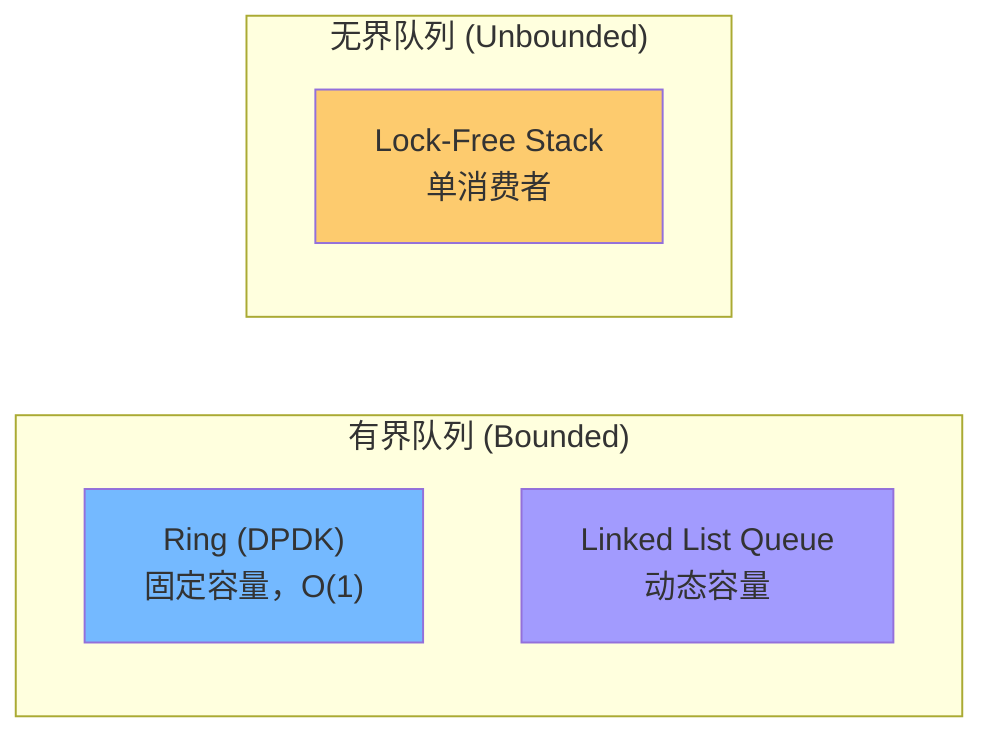
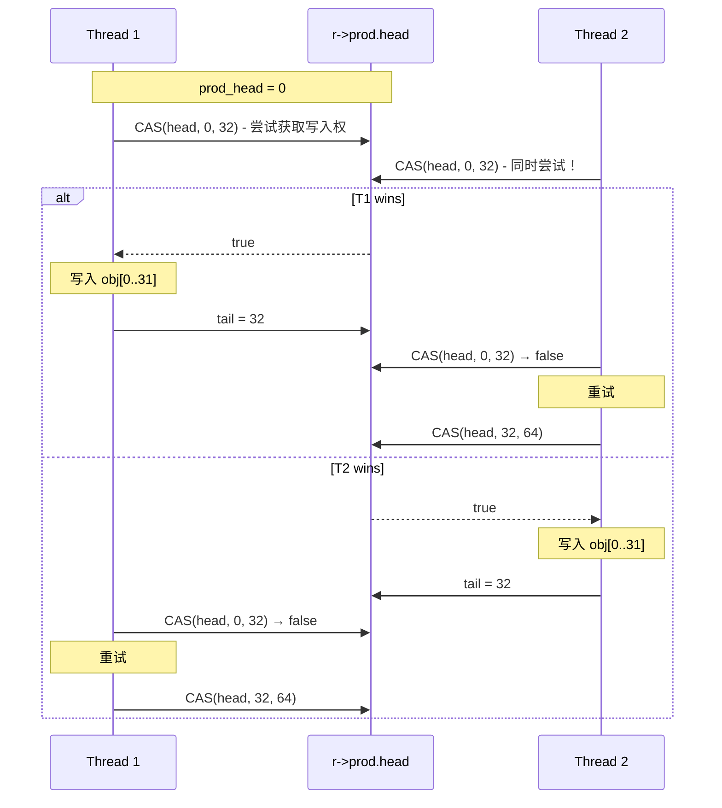

> [!info] DPDK 深度探索系列
> 0. [[2026-04-09-dpdk-deep-dive-series-index|全栈学习路径总览]]
> 1. [[2026-04-09-dpdk-deep-dive-ch1-architecture-overview|第一章：架构概述——kernel bypass 原理与 DPDK 定位]]
> 2. [[2026-04-09-dpdk-deep-dive-ch2-uio-vfio-iommu|第二章：UIO/VFIO/IOMMU 用户态驱动框架]]
> 3. [[2026-04-09-dpdk-deep-dive-ch3-eal-initialization|第三章：EAL 初始化与 lcore 模型]]
> 4. [[2026-04-09-dpdk-deep-dive-ch4-hugepage-mempool|第四章：大页内存与 mempool 机制]]
> 5. [[2026-04-09-dpdk-deep-dive-ch5-mbuf-mechanism|第五章：Mbuf 结构与 Dynfield]]
> 6. **第六章：Ring 无锁队列实现与性能分析**

---

## 1. 概述：为什么需要无锁队列？

DPDK 的 rte_ring 是一个高性能的无锁 FIFO（First-In-First-Out）队列，被广泛应用于：

| 应用场景 | 说明 |
|---------|------|
| **mempool 底层** | mempool 使用 ring 存储空闲对象 |
| **线程间通信** | lcores 之间传递数据包 |
| **生产者-消费者** | 多生产者-多消费者模型 |
| **事件分发** | Event-Dev 框架的事件队列 |

### 1.1 传统锁的问题

```
场景：4 个线程同时向同一个队列写入

┌─────────────────────────────────────────────────────────────────┐
│  Thread 1 ──► Mutex Lock ──┐                                    │
│  Thread 2 ──► Mutex Lock ──┼──► [Shared Queue] ──► Thread 4   │
│  Thread 3 ──► Mutex Lock ──┤       ▲                           │
│  Thread 4 ──► Mutex Lock ──┘       │                           │
│                                       │                           │
│  问题：                               │                           │
│  1. 锁竞争严重：4 个线程争抢一把锁    │                           │
│  2. 上下文切换：获取锁失败导致 sleep │                           │
│  3. Cache line bouncing：锁变量在    │                           │
│     多个 CPU core 之间来回传递        │                           │
└─────────────────────────────────────────────────────────────────┘

性能数据：
- 无竞争 mutex: ~25ns
- 轻度竞争: ~100ns
- 重度竞争: ~1000ns+
- 而 DPDK 每包处理预算: ~6.6ns (100G @ 64B)
```

### 1.2 Lock-Free vs Mutex

| 特性 | Lock-Free | Mutex |
|------|-----------|-------|
| **延迟** | 确定性的 O(1) | 不可预期（可能 sleep） |
| **吞吐** | 高（无序列化） | 低（串行化） |
| **死锁风险** | 无（总会前进） | 有（忘记 unlock） |
| **优先级反转** | 无 | 有（低优先级持有锁） |
| **实现复杂度** | 高 | 低 |
| **公平性** | 不保证 FIFO | 可保证 |

---

## 2. Ring 核心设计

### 2.1 Ring vs 其他队列



### 2.2 Ring 数据结构

```c
// lib/eal/common/eal_ring.h

struct rte_ring {
    char name[RTE_RING_NAMESIZE];   // 32 字节名称
    int flags;                       // 标志（RING_F_SP_ENQ 等）
    uint32_t size;                   // ring 大小（2 的幂）
    uint32_t mask;                   // size - 1（用于 & mask 替代 %）
    
    // 可见性保证：生产端和消费端可以不同步
    // 但更新顺序必须遵守 memory ordering
    
    /* Producer 部分 */
    struct {
        volatile uint32_t head;   // 队首（消费位置）
        volatile uint32_t tail;   // 队尾（生产位置）
    } prod;
    
    /* Consumer 部分 */
    struct {
        volatile uint32_t head;   // 队首
        volatile uint32_t tail;   // 队尾
    } cons;
    
    // 对象存储
    void *ring[];  // 柔性数组，大小为 size
};
```

### 2.3 Ring 布局

```
┌─────────────────────────────────────────────────────────────────────────────┐
│                         rte_ring 内存布局                                    │
├─────────────────────────────────────────────────────────────────────────────┤
│                                                                             │
│  struct rte_ring {                                                          │
│      char name[32];          // 名称                                         │
│      int flags;              // 标志                                        │
│      uint32_t size;          // 16 (实际申请的 2 的幂)                      │
│      uint32_t mask;          // 15 (size - 1)                              │
│                                                                             │
│      prod.head = 0;          // 生产者可见                                 │
│      prod.tail = 0;          //                                              │
│                                                                             │
│      cons.head = 0;          // 消费者可见                                 │
│      cons.tail = 0;          //                                              │
│  };                                                                          │
│                                                                             │
├─────────────────────────────────────────────────────────────────────────────┤
│                                                                             │
│  void *ring[] (柔性数组，16 个元素)                                          │
│                                                                             │
│  ┌────────┬────────┬────────┬────────┬────────┬────────┬────────┬────────┐ │
│  │ obj[0] │ obj[1] │ obj[2] │ obj[3] │ obj[4] │ obj[5] │ obj[6] │ obj[7] │ │
│  └────────┴────────┴────────┴────────┴────────┴────────┴────────┴────────┘ │
│  ┌────────┬────────┬────────┬────────┬────────┬────────┬────────┬────────┐ │
│  │ obj[8] │ obj[9] │ obj[10]│ obj[11]│ obj[12]│ obj[13]│ obj[14]│ obj[15]│ │
│  └────────┴────────┴────────┴────────┴────────┴────────┴────────┴────────┘ │
│                                                                             │
│  索引计算：idx = pos & mask  (pos 是递增的序号，mask = size-1 = 15)        │
│                                                                             │
│  示例：pos = 17 时，idx = 17 & 15 = 1                                      │
│        pos = 31 时，idx = 31 & 15 = 15                                    │
│        pos = 32 时，idx = 32 & 15 = 0  (绕回)                              │
│                                                                             │
└─────────────────────────────────────────────────────────────────────────────┘
```

---

## 3. 原子操作与 CAS

### 3.1 CAS (Compare-And-Swap) 原理

CAS 是无锁算法的基石：

```c
// CAS 伪代码
bool CAS(uint32_t *addr, uint32_t old_val, uint32_t new_val) {
    if (*addr == old_val) {
        *addr = new_val;
        return true;  // 成功
    }
    return false;    // 失败，已被其他线程修改
}

// 单核上的 CAS
// Thread 1                    Thread 2
// ────────                    ────────
// val = 0                      val = 0
// CAS(&val, 0, 1) → true      (sleep)
// val = 1                      CAS(&val, 0, 2) → false
//                              CAS(&val, 1, 2) → true
//                              val = 2
```

### 3.2 x86 CAS 实现

```c
// x86_64 CAS (汇编)
static inline int
rte_atomic32_cmpset(volatile uint32_t *dst, uint32_t exp, uint32_t src)
{
    uint8_t ret;
    
    asm volatile (
        "lock cmpxchgl %[src], %[dst];"
        "sete %[ret];"
        : [dst] "=m" (*dst),
          [ret] "=a" (ret)
        : "m" (*dst),
          "a" (exp),
          [src] "r" (src)
        : "memory", "cc");
    
    return ret;
}

// 说明：
// 1. "lock" 前缀：总线锁，保证原子性
// 2. cmpxchgl：比较并交换（32 位）
// 3. "sete"：设置目标寄存器为 1（如果成功）否则为 0
```

### 3.3 CAS 的 ABA 问题

```
┌─────────────────────────────────────────────────────────────────┐
│  ABA 问题演示                                                    │
│                                                                  │
│  Thread 1                      Thread 2                          │
│  ────────                      ────────                          │
│  read *addr = A                read *addr = A                   │
│  (其他线程修改)                                                   │
│  *addr = B                     (其他线程修改)                     │
│  *addr = A                     *addr = C (应该是 B!)            │
│  CAS(&addr, A, D) → true!     CAS(&addr, A, B) → true! (错误)   │
│                                                                  │
│  结果：Thread 2 误以为 A 没有被修改过                            │
└─────────────────────────────────────────────────────────────────┘

解决方案：
1. Double-width CAS (DCAS) — 128 位 CAS
2. Tagged Pointers — 用版本号标记指针
3. Hazard Pointers — 记录正在访问的指针
```

```c
// DPDK ring 使用的是 32 位索引，ABA 问题影响较小
// 因为：
// 1. 索引是单调递增的，不会绕回（除非写入 2^32 次）
// 2. 即使绕回，中间状态是确定的（tail 已更新）
```

---

## 4. 入队操作详解

### 4.1 SP (Single Producer) 入队

```c
// lib/eal/common/eal_ring.c

// 单生产者入队（无锁，因为只有一个生产者）
static __rte_always_inline uint32_t
__rte_ring_sp_do_enqueue(struct rte_ring *r, void * const *obj_table,
                          uint32_t n, enum rte_ring_queue_behavior behavior)
{
    uint32_t prod_head, prod_next;
    uint32_t free_entries;
    
    // 1. 获取当前 prod_head（本地副本）
    prod_head = r->prod.head;
    
    // 2. 计算 prod_next（本次入队后的 head）
    prod_next = prod_head + n;
    
    // 3. 检查空间
    // cons.tail 提供"已消费"信息
    free_entries = (r->cons.tail > prod_head) ?
                    // tail > head：说明有 wrap-around
                    r->mask + 1 - prod_head + r->cons.tail :
                    // tail <= head：正常情况
                    r->cons.tail - prod_head;
    
    if (n > free_entries) {
        // 空间不足
        if (behavior == RTE_RING_QUEUE_FIXED)
            return 0;
        // 最多入队 free_entries 个
        n = free_entries;
        if (n == 0)
            return 0;
        prod_next = prod_head + n;
    }
    
    // 4. 写入对象到 ring
    // 这里不需要 CAS，因为只有一个生产者
    // 但需要内存屏障保证写入顺序
    for (uint32_t i = 0; i < n; i++) {
        r->ring[(prod_head + i) & r->mask] = obj_table[i];
    }
    
    // 5. 内存屏障：确保数据写入在更新 head 之前
    rte_smp_wmb();  // 写屏障（Store-Store）
    
    // 6. 更新 prod_tail（可见性保证）
    // 消费者现在可以看到新数据
    r->prod.tail = prod_next;
    
    return n;
}
```

### 4.2 MP (Multi Producer) 入队

```c
// 多生产者入队（使用 CAS）
static __rte_always_inline uint32_t
__rte_ring_mp_do_enqueue(struct rte_ring *r, void * const *obj_table,
                          uint32_t n, enum rte_ring_queue_behavior behavior)
{
    uint32_t prod_head, prod_next;
    uint32_t free_entries;
    uint32_t success = 0;
    
    do {
        // 1. 获取当前 prod_head
        prod_head = r->prod.head;
        
        // 2. 计算 free entries
        free_entries = (r->cons.tail > prod_head) ?
                        r->mask + 1 - prod_head + r->cons.tail :
                        r->cons.tail - prod_head;
        
        if (n > free_entries) {
            if (behavior == RTE_RING_QUEUE_FIXED)
                return 0;
            n = free_entries;
            if (n == 0)
                return 0;
        }
        
        prod_next = prod_head + n;
        
        // 3. CAS：尝试将 prod_head 更新为 prod_next
        // 如果失败，说明其他生产者先一步更新了 head
        // 需要重试
    } while (!rte_atomic32_cmpset(&r->prod.head, prod_head, prod_next));
    
    // 4. CAS 成功，当前线程获得"独占"更新权
    // 可以安全写入数据
    for (uint32_t i = 0; i < n; i++) {
        r->ring[(prod_head + i) & r->mask] = obj_table[i];
    }
    
    // 5. 内存屏障
    rte_smp_wmb();
    
    // 6. 更新 prod_tail
    // 这里使用 store-release语义
    r->prod.tail = prod_next;
    
    return n;
}
```

### 4.3 CAS 冲突处理



---

## 5. 出队操作详解

### 5.1 SC (Single Consumer) 出队

```c
// 单消费者出队
static __rte_always_inline uint32_t
__rte_ring_sc_do_dequeue(struct rte_ring *r, void **obj_table,
                          uint32_t n, enum rte_ring_queue_behavior behavior)
{
    uint32_t cons_head, cons_next;
    uint32_t entries;
    
    // 1. 获取当前 cons_head
    cons_head = r->cons.head;
    
    // 2. 计算可用对象数
    // prod.tail 提供"已生产"信息
    entries = (r->prod.tail > cons_head) ?
              r->prod.tail - cons_head :
              r->mask + 1 - cons_head + r->prod.tail;
    
    if (n > entries) {
        if (behavior == RTE_RING_QUEUE_FIXED)
            return 0;
        n = entries;
        if (n == 0)
            return 0;
    }
    
    cons_next = cons_head + n;
    
    // 3. 读取数据（单消费者，不需要 CAS）
    // 但需要内存屏障保证读取顺序
    for (uint32_t i = 0; i < n; i++) {
        obj_table[i] = r->ring[(cons_head + i) & r->mask];
    }
    
    // 4. 内存屏障
    rte_smp_rmb();  // 读屏障（Load-Load）
    
    // 5. 更新 cons_tail
    r->cons.tail = cons_next;
    
    return n;
}
```

### 5.2 MC (Multi Consumer) 出队

```c
// 多消费者出队
static __rte_always_inline uint32_t
__rte_ring_mc_do_dequeue(struct rte_ring *r, void **obj_table,
                          uint32_t n, enum rte_ring_queue_behavior behavior)
{
    uint32_t cons_head, cons_next;
    uint32_t entries;
    
    do {
        cons_head = r->cons.head;
        
        entries = (r->prod.tail > cons_head) ?
                  r->prod.tail - cons_head :
                  r->mask + 1 - cons_head + r->prod.tail;
        
        if (n > entries) {
            if (behavior == RTE_RING_QUEUE_FIXED)
                return 0;
            n = entries;
            if (n == 0)
                return 0;
        }
        
        cons_next = cons_head + n;
        
        // CAS 尝试更新 cons_head
    } while (!rte_atomic32_cmpset(&r->cons.head, cons_head, cons_next));
    
    // CAS 成功，安全读取数据
    for (uint32_t i = 0; i < n; i++) {
        obj_table[i] = r->ring[(cons_head + i) & r->mask];
    }
    
    rte_smp_rmb();
    r->cons.tail = cons_next;
    
    return n;
}
```

---

## 6. 内存屏障

### 6.1 为什么需要内存屏障？

```
问题场景：
┌─────────────────────────────────────────────────────────────────┐
│  Producer                      Consumer                        │
│  ────────                      ────────                        │
│  ring[idx] = data;             if (tail == expected)           │
│  tail = idx + 1;               data = ring[idx];              │
│                                                                  │
│  问题：如果顺序打乱，consumer 可能读到旧数据！                   │
└─────────────────────────────────────────────────────────────────┘

解决：使用内存屏障保证写入和读取顺序
```

### 6.2 DPDK 内存屏障

```c
// lib/eal/include/rte_atomic.h

// 写屏障（Store-Store）：所有之前的写操作必须在之后的写操作之前完成
#define rte_smp_wmb() asm volatile("" ::: "memory")

// 读屏障（Load-Load）：所有之前的读操作必须在之后的读操作之前完成
#define rte_smp_rmb() asm volatile("" ::: "memory")

// 完整屏障（Full）：综合 wmb + rmb
#define rte_smp_mb() asm volatile("lock; addl $0,0(%%rsp)" ::: "memory")

// x86 上：
// - wmb: 不需要指令（x86 TSO 保证 store order）
// - rmb: 不需要指令（x86 TSO 保证 load order）
// - mb:  需要 "lock addl"（强制刷新 CPU 缓存）
```

### 6.3 为什么 x86 不需要显式屏障？

```
x86 TSO (Total Store Order) 保证：
1. 所有 Store 按程序顺序执行（不会出现 Store reorder）
2. Store Buffer 按 FIFO 顺序刷新到 Cache

因此：
- wmb: 无需指令（已保证）
- rmb: 无需指令（已保证）
- mb:  需要 "lock" 前缀（强制刷新 Store Buffer）
```

---

## 7. Ring 变体：ring_pool

### 7.1 传统 ring 的问题

```c
// 传统 enqueue/dequeue 返回 void*
// 批量操作需要预分配输出数组

void *objs[32];
uint32_t n = rte_ring_sc_dequeue(r, objs, 32);
// 问题：需要栈空间存储指针数组
```

### 7.2 ring_pool 的改进

```c
// DPDK 20.11 引入 ring_pool
// 直接返回对象指针，无需预分配数组

// 创建 pool mode 的 ring
struct rte_ring *r = rte_ring_create_pool(
    "obj_pool",    // 名称
    1024,          // 大小
    socket_id,     // NUMA socket
    0              // flags
);

// 入队：直接传入对象指针
rte_ring_sp_enqueue(r, obj);

// 出队：直接返回对象指针
void *obj;
if (rte_ring_sc_dequeue(r, &obj) == 0) {
    // 成功获取 obj
}

// 批量出队
void *objs[32];
uint32_t n = rte_ring_mc_dequeue_burst(r, objs, 32, NULL);
```

---

## 8. Ring 性能分析

### 8.1 性能测试数据

```c
// Intel Xeon Gold 6154 @ 3.0GHz
// 测试：单生产者 → 单消费者

// 每操作延迟（ns）：
// 
// 操作类型          平均    P99    最大
// ─────────────────────────────────────
// SP enqueue        3.2     5.1    12
// SC dequeue        3.1     4.9    11
// MP enqueue (2P)   8.3     15     45
// MP enqueue (4P)   22      48     120
// MC dequeue (2C)   8.1     14     42
// MC dequeue (4C)   21      46     115
```

### 8.2 性能影响因素

| 因素 | 影响 | 建议 |
|------|------|------|
| **Cache line** | head/tail 在同一 Cache line | ⚠️ 已优化 |
| **CAS 竞争** | 多个生产者时冲突增加 | 使用 SP/SC 模式 |
| **NUMA** | 跨 Socket 访问延迟 3x | 在本地 Socket 创建 ring |
| **Ring 大小** | 过大占用内存 | 合适大小（建议 2^n, n=9-14） |

### 8.3 ring vs 其他队列

```c
// 测试对比

// Ring
struct rte_ring *ring = rte_ring_create("test", 1024, SOCKET0, 0);
for (int i = 0; i < 1000000; i++) {
    rte_ring_sp_enqueue(ring, obj);
    rte_ring_sc_dequeue(ring, &obj);
}
// 吞吐量: ~150 Mpps (单线程)

// Lock-free stack (SPSC)
struct lfstack *stack = lfstack_create();
for (int i = 0; i < 1000000; i++) {
    lfstack_push(stack, obj);
    lfstack_pop(stack, &obj);
}
// 吞吐量: ~140 Mpps (单线程)

// Mutex queue
pthread_mutex_t mutex = PTHREAD_MUTEX_INITIALIZER;
for (int i = 0; i < 1000000; i++) {
    pthread_mutex_lock(&mutex);
    queue_push(&queue, obj);
    pthread_mutex_unlock(&mutex);
    pthread_mutex_lock(&mutex);
    queue_pop(&queue, &obj);
    pthread_mutex_unlock(&mutex);
}
// 吞吐量: ~2 Mpps (单线程) — 250x slower！
```

---

## 9. Ring 在 DPDK 中的应用

### 9.1 mempool 的 ring

```c
// rte_mempool 内部使用 ring 存储空闲对象

struct rte_mempool {
    char name[RTE_MEMZONE_NAMESIZE];
    struct rte_ring *ring_data;         // ← 底层是 ring！
    void *pool_data;                    // mbuf 数据区
    uint32_t size;                      // 对象总数
    uint32_t cache_size;                // per-lcore 缓存
    // ...
};

// alloc 操作
mbuf = rte_pktmbuf_alloc(mp);
// 内部：
// 1. 从本地缓存获取（缓存命中：O(1)）
// 2. 缓存空：从 ring 批量获取 32 个

// free 操作
rte_pktmbuf_free(mbuf);
// 内部：
// 1. 放入本地缓存
// 2. 缓存满：批量归还到 ring
```

### 9.2 线程间通信

```c
// 生产者线程（lcore 0）
static void
producer(void *arg)
{
    struct rte_ring *ring = arg;
    
    while (!quit) {
        struct rte_mbuf *m = rte_pktmbuf_alloc(mbuf_pool);
        // 填充 mbuf...
        
        // 发送到消费者
        while (rte_ring_sp_enqueue(ring, m) != 0) {
            // 队列满，短暂退避
            rte_pause();
        }
    }
}

// 消费者线程（lcore 1）
static void
consumer(void *arg)
{
    struct rte_ring *ring = arg;
    struct rte_mbuf *m;
    
    while (!quit) {
        if (rte_ring_sc_dequeue(ring, (void **)&m) == 0) {
            // 处理数据包
            process_packet(m);
            rte_pktmbuf_free(m);
        }
    }
}
```

---

## 10. Ring 配置最佳实践

### 10.1 创建参数

```c
// Ring 大小必须是 2 的幂
// 常见大小：256, 512, 1024, 2048, 4096, 8192

#define RING_F_SP_ENQ  0x0001  // 单生产者
#define RING_F_SC_DEQ  0x0002  // 单消费者
#define RING_F_EXACT_SZ 0x0004 // 精确大小（非 2 的幂）
#define RING_F_MC_RTS  0x0008  // 多消费者
#define RING_F_MP_RTS  0x0010  // 多生产者

// 最常用配置：
struct rte_ring *r = rte_ring_create(
    "my_ring",
    1024,                      // 大小（2 的幂）
    rte_socket_id(),           // NUMA socket
    RING_F_SP_ENQ | RING_F_SC_DEQ  // 单生产者单消费者，最快
);

// 如果多线程：
struct rte_ring *r = rte_ring_create(
    "my_ring",
    1024,
    rte_socket_id(),
    0  // 默认多生产者多消费者
);
```

### 10.2 常见错误

| 错误 | 原因 | 解决 |
|------|------|------|
| `Ring is full` | 入队速率 > 出队速率 | 增加 ring 大小或提高消费速度 |
| `Ring is empty` | 出队速率 > 入队速率 | 增加生产速率或使用 burst 接口 |
| `No space in ring` | 批量入队时空间不足 | 使用单对象入队或增大 ring |
| `Object lost` | 生产者覆盖未消费对象 | 增加 ring 大小或添加背压机制 |

### 10.3 调试

```c
// 打印 ring 状态
void
dump_ring(const struct rte_ring *r)
{
    printf("Ring: %s\n", r->name);
    printf("  size: %u, mask: 0x%x\n", r->size, r->mask);
    printf("  prod head: %u, tail: %u\n", r->prod.head, r->prod.tail);
    printf("  cons head: %u, tail: %u\n", r->cons.head, r->cons.tail);
    
    uint32_t used = (r->prod.tail >= r->cons.head) ?
                     r->prod.tail - r->cons.head :
                     r->size - r->cons.head + r->prod.tail;
    uint32_t free = r->size - used;
    
    printf("  used: %u, free: %u\n", used, free);
}

// 获取实时统计
int
get_ring_stats(const struct rte_ring *r, struct rte_ring_stats *stats)
{
    stats->enq_count = r->prod.tail;
    stats->deq_count = r->cons.tail;
    stats->enq_fail = r->enq_fail;
    stats->deq_fail = r->deq_fail;
    return 0;
}
```

---

## 11. 小结

本章核心要点：

1. **无锁队列价值**：避免锁竞争和上下文切换，在高并发下比 mutex 快 50-100x。

2. **CAS 原子操作**：Compare-And-Swap 是无锁算法的基石，x86 使用 `lock cmpxchgl` 指令。

3. **Ring 数据结构**：固定大小数组 + head/tail 索引，使用 mask 替代模运算。

4. **四种模式**：
   - SP/SC：单生产者单消费者，最快
   - MP/MC：多生产者多消费者，使用 CAS
   - MP/SC 和 SP/MC：混合场景

5. **内存屏障**：DPDK 使用 `rte_smp_wmb/rmb` 保证读写顺序，x86 TSO 减少了需要的屏障。

6. **性能**：SP/SC 每操作 ~3ns，MP/MC 每操作 ~8-22ns（取决于竞争程度）。

7. **应用**：ring 是 mempool 和线程间通信的核心组件。

**下一篇预告**：[[2026-04-09-dpdk-deep-dive-ch7-pmd-driver|第七章]]将深入讲解 DPDK PMD（Poll Mode Driver）驱动架构——网卡驱动的注册流程、收发包路径、描述符管理、以及 Intel i40e/ixgbe 驱动的具体实现。

---

> [!tip] 参考文献
> - Intel, "DPDK Ring Library", https://doc.dpdk.org/guides/prog_guide/ring_lib.html
> - "Implementations of Lock-Free Queues", https://www.researchgate.net/publication/2241499_Implementing_Lock-Free_Queues
> - "Simple, Fast, and Practical Non-Blocking and Blocking Concurrent Queue Algorithms", Maged M. Michael, Michael L. Scott, 1996
