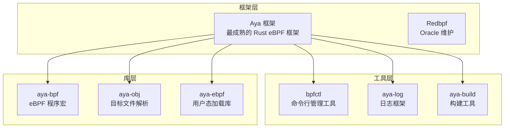

> [!info] eBPF 2026 深度探索系列 0. [[2026-04-08-ebpf-comprehensive-learning-roadmap|全栈学习路径总览]]
>
> 1. [[2026-04-08-ebpf-deep-dive-ch1-registers-and-instructions|第一章：寄存器与指令集]]
> 2. [[2026-04-08-ebpf-deep-dive-ch1-5-function-calls|第一.五章：四种函数调用与动态内存]]
> 3. [[2026-04-08-ebpf-deep-dive-ch1-6-the-verifier|第一.六章：验证器 (Verifier) 的底层逻辑]]
> 4. [[2026-04-08-ebpf-deep-dive-ch2-maps-and-communication|第二章：Map 机制与跨空间通信]]
> 5. [[2026-04-08-ebpf-deep-dive-ch2-5-kptr-and-ownership|第二.五章：kptr (内核指针) 与内存所有权模型]]
> 6. [[2026-04-08-ebpf-deep-dive-ch3-core-and-btf|第三章：CO-RE 与 BTF 的跨版本魔法]]
> 7. [[2026-04-08-ebpf-deep-dive-ch4-tracing-hooks-and-security|第四章：从 kprobe 到 LSM 的追踪全图景]]
> 8. [[2026-04-08-ebpf-deep-dive-ch7-5-uprobes-dynamic-tracing|第七.五章：uprobe 用户态动态追踪原理]]
> 9. [[2026-04-08-ebpf-deep-dive-ch7-6-bpftime-user-runtime|第七.六章：bpftime 与用户态 eBPF 加速]]
> 10. [[2026-04-08-ebpf-deep-dive-ch18-bpftime-injection-mastery|第七.七章：bpftime 自动化注入与全量监控实战]]
> 11. [[2026-04-08-ebpf-deep-dive-ch7-8-uprobe-selection-guide|第七.八章：uprobe 选型指南：内核态 vs 用户态]]
> 12. [[2026-04-08-ebpf-deep-dive-ch5-xdp-networking-performance|第五章：XDP 极致网络性能与全栈架构]]
> 13. [[2026-04-08-ebpf-deep-dive-ch6-tc-traffic-control|第六章：TC (Traffic Control) 流量调度艺术]]
> 14. [[2026-04-08-ebpf-deep-dive-ch7-security-lsm-enforcement|第七章：LSM BPF 从可观测到安全执法]]
> 15. [[2026-04-08-ebpf-deep-dive-ch8-advanced-tuning-and-profiling|第八章：进阶实战与内核调优]]
> 16. [[2026-04-08-ebpf-deep-dive-ch9-af-xdp-zero-copy|第九章：AF_XDP 零拷贝与用户态协议栈]]
> 17. [[2026-04-08-ebpf-deep-dive-ch10-sched-ext-custom-scheduler|第十章：sched_ext 自定义 CPU 调度器]]
> 18. [[2026-04-08-ebpf-deep-dive-ch11-bpf-iterators|第十一章：BPF Iterators 内核对象迭代器]]
> 19. [[2026-04-08-ebpf-deep-dive-ch12-kfuncs-evolution|第十二章：kfuncs 下一代内核交互标准]]
> 20. [[2026-04-08-ebpf-deep-dive-ch13-usdt-tracing|第十三章：USDT 用户态静态定义追踪]]
> 21. [[2026-04-08-ebpf-deep-dive-ch14-ai-llm-inference-monitoring|第十四章：AI 推理与大模型监控前沿]]
> 22. [[2026-04-08-ebpf-deep-dive-ch15-container-isolation|第十五章：无感增强容器隔离性]]
> 23. [[2026-04-08-ebpf-deep-dive-ch16-ebpf-and-wasm|第十六章：eBPF 与 WebAssembly (WASM) 的共生架构]]
> 24. [[2026-04-08-ebpf-deep-dive-ch17-storage-and-filesystem|第十七章：存储与文件系统加速]]
> 25. [[2026-04-08-ebpf-deep-dive-ch18-lifecycle-and-links|第十八章：生命周期管理与 BPF Links]]
> 26. [[2026-04-08-ebpf-deep-dive-ch19-atomic-updates-and-hot-upgrade|第十九章：程序的原子更新与蓝绿部署]]
> 27. [[2026-04-08-ebpf-deep-dive-ch25-5-stack-trace-correlation|第二五.五章：调用栈与业务请求的深度绑定]]
> 28. [[2026-04-08-ebpf-deep-dive-ch20-edge-iot-acceleration|第二十章：边缘计算与工业协议加速]]
> 29. [[2026-04-08-ebpf-deep-dive-ch21-debugging-and-verifier|第二十一章：调试实战与验证器 (Verifier) 诊断]]
> 30. [[2026-04-08-ebpf-deep-dive-ch22-testing-and-ci-cd|第二十二章：测试与持续集成 (CI/CD) 实战]]
> 31. [[2026-04-08-ebpf-deep-dive-ch23-security-and-permissions|第二十三章：权限细分与 BPF 安全沙箱]]
> 32. [[2026-04-08-ebpf-deep-dive-ch24-meta-monitoring-and-self-healing|第二十四章：eBPF 程序的内核自愈与监控]]
> 33. [[2026-04-08-ebpf-deep-dive-ch25-full-stack-observability|第二十五章：全栈可观测性与端到端追踪]]
> 34. [[2026-04-08-ebpf-deep-dive-ch26-network-security-high-level|第二十六章：网络安全防御的高阶实战]]
> 35. [[2026-04-08-ebpf-deep-dive-ch27-agent-engineering-architecture|第二十七章：工业级模块化 Agent 架构演进]]
> 36. [[2026-04-08-ebpf-deep-dive-ch28-offensive-and-defensive|第二十八章：攻防博弈与 Rootkit 防御]]
> 37. [[2026-04-08-ebpf-deep-dive-ch29-networking-deep-dive|第二十九章：网络应用深水区——负载均衡、Sockmap 与拥塞控制]]
> 38. [[2026-04-08-ebpf-deep-dive-ch30-hardware-offload|第三十章：硬件卸载与 SmartNIC 实战]]
> 39. [[2026-04-08-ebpf-deep-dive-ch31-signed-objects-and-security|第三十一章：内核原生签名与供应链安全]]
> 40. [[2026-04-08-ebpf-deep-dive-ch32-ebpf-for-windows|第三十二章：跨平台崛起——eBPF for Windows]]
> 41. [[2026-04-08-ebpf-deep-dive-ch32-5-macos-status|第三十二.五章：macOS 的特殊路径]]
> 42. [[2026-04-08-ebpf-deep-dive-ch33-serverless-optimization|第三十三章：Serverless 冷启动消除与动态计费]]
> 43. [[2026-04-08-ebpf-deep-dive-ch34-waf-and-rasp|第三十四章：Web 安全革命——内核态 WAF 与 RASP]]
> 44. [[2026-04-08-ebpf-deep-dive-ch35-npu-tpu-ai-hardware|第三十五章：AI 推理硬件 (NPU/TPU) 与硬件定义内核]]
> 45. [[2026-04-08-ebpf-deep-dive-ch36-dynamic-language-introspection|第三十六章：动态语言感知——业务对象的零代码提取]]
> 46. [[2026-04-08-ebpf-deep-dive-ch37-green-computing|第三十七章：绿色计算与能耗精准归因]]
> 47. [[2026-04-08-ebpf-deep-dive-ch38-ecosystem-and-career|第三十八章：2026 生态全景与工程师职业导航]]
> 48. **第三十九章：Rust eBPF 开发实战——Aya 框架与安全编程**
> 49. [[2026-04-09-ebpf-deep-dive-ch40-network-protocols-deep-dive|第四十章：网络协议深度解析——TCP/UDP/QUIC 的 eBPF 视角]]
> 50. [[2026-04-09-ebpf-deep-dive-ch41-memory-safety-and-vulnerabilities|第四十一章：eBPF 内存安全与漏洞分析]]
> 51. [[2026-04-09-ebpf-deep-dive-ch42-service-mesh-integration|第四十二章：eBPF 与 Service Mesh 深度集成]]

---

## 1. 概述：Rust 与 eBPF 的天然契合

在 2026 年，Rust 已经成为 eBPF 开发的首选语言之一。Rust 的**所有权系统**和**零成本抽象**与 eBPF 的安全约束模型高度契合——编译器在编译期就消除了内存安全问题，大幅减少了 eBPF 验证器 (Verifier) 需要检查的运行时错误。

### 1.1 为什么选择 Rust 而非 C？

| 维度               | C + libbpf                        | Rust + Aya                     | 说明                       |
| :----------------- | :-------------------------------- | :----------------------------- | :------------------------- |
| **内存安全**       | 手动管理，容易出现 Use-After-Free | 编译器保证，不可能出现 UAF     | Rust 的核心优势            |
| **空指针**         | 常见错误源                        | `Option<T>` 编译期消除         | 减少 NULL dereference      |
| **并发安全**       | 手动锁管理                        | `Send`/`Sync` trait 编译期检查 | 减少 race condition        |
| **Map 类型安全**   | `void *` + 强制转换               | 泛型 `Map<K, V>`               | 类型系统保证               |
| **构建系统**       | Makefile + clang                  | Cargo 生态                     | 依赖管理更友好             |
| **CO-RE 支持**     | 手动 BTF 处理                     | Aya BTF derive 宏自动生成      | 开发体验大幅提升           |
| **学习曲线**       | 中等                              | 较高（需学 Rust）              | Rust 入门门槛是主要障碍    |
| **内核社区接受度** | 最高                              | 快速增长                       | 2026 年大量新项目选择 Rust |

### 1.2 Rust eBPF 生态系统



---

## 2. Aya 框架架构深度解析

### 2.1 项目结构

Aya 采用独特的双 crate 架构，将 eBPF 程序和用户态加载器分离：

```
rust-ebpf-firewall/
├── ebpf-firewall-common/      # 共享类型定义
│   ├── Cargo.toml
│   └── src/
│       └── lib.rs             # 共享的 struct/enum
├── ebpf-firewall-ebpf/        # eBPF 内核态程序
│   ├── Cargo.toml             # target = "bpfel-unknown-none"
│   └── src/
│       └── main.rs            # eBPF 程序入口
└── ebpf-firewall/             # 用户态加载器
    ├── Cargo.toml
    └── src/
        └── main.rs            # 加载和管理 eBPF 程序
```

### 2.2 编译目标

Rust eBPF 程序编译为 `bpfel-unknown-none`（小端）或 `bpfeb-unknown-none`（大端）目标，而非标准的 `x86_64-unknown-linux-gnu`：

```toml
# ebpf-firewall-ebpf/Cargo.toml
[package]
name = "ebpf-firewall-ebpf"
version = "0.1.0"
edition = "2021"

[dependencies]
aya-bpf = { version = "0.1", path = "../aya/aya-bpf" }
aya-log-ebpf = "0.1"
ebpf-firewall-common = { path = "../ebpf-firewall-common" }

[[bin]]
name = "firewall"
path = "src/main.rs"

[profile.dev]
opt-level = 3
debug = false

[profile.release]
opt-level = 3
lto = true
```

### 2.3 Aya 的类型安全优势

```rust
// C 版本：Map 操作，类型不安全
struct bpf_map_def SEC(".maps") blocklist = {
    .type = BPF_MAP_TYPE_HASH,
    .key_size = sizeof(u32),
    .value_size = sizeof(u8),
    .max_entries = 65536,
};

// 使用时需要手动转换
u32 *blocked = bpf_map_lookup_elem(&blocklist, &ip);

// Rust 版本：编译器保证类型安全
use aya_bpf::{
    maps::HashMap,
    programs::XdpContext,
};

#[map(name = "BLOCKLIST")]
static mut BLOCKLIST: HashMap<u32, u8> = HashMap::with_max_entries(65536, 0);

// 使用时，类型自动推导
fn try_firewall(ctx: &XdpContext) -> Result<XdpResult, ()> {
    let ip: u32 = ...;  // 自动推导
    if let Some(_) = unsafe { BLOCKLIST.get(&ip) } {
        return Ok(XdpResult::XdpDrop);
    }
    Ok(XdpResult::XdpPass)
}
```

---

## 3. 代码实战：用 Aya 构建高性能防火墙

### 3.1 共享类型定义

```rust
// ebpf-firewall-common/src/lib.rs
#![no_std]

use aya_bpf_cty::c_char;

/// XDP 程序返回值
#[repr(u32)]
pub enum XdpAction {
    Aborted = 0,
    Drop = 1,
    Pass = 2,
    Tx = 3,
    Redirect = 4,
}

/// 防火墙规则
#[repr(C)]
pub struct FirewallRule {
    pub src_ip: u32,
    pub dst_ip: u32,
    pub src_port: u16,
    pub dst_port: u16,
    pub protocol: u8,
    pub action: u8,  // 0=allow, 1=deny
}

/// 统计事件
#[repr(C)]
pub struct StatsEvent {
    pub src_ip: u32,
    pub dst_ip: u32,
    pub dst_port: u16,
    pub action: u8,
    pub count: u64,
}
```

### 3.2 eBPF 内核态程序

```rust
// ebpf-firewall-ebpf/src/main.rs
#![no_std]
#![no_main]

use aya_bpf::{
    bindings::xdp_action,
    macros::{map, xdp},
    maps::{HashMap, PerCpuArray, RingBuf},
    programs::XdpContext,
};
use aya_log_ebpf::info;
use ebpf_firewall_common::{FirewallRule, StatsEvent, XdpAction};
use network_types::eth::{EthHdr, EtherType};
use network_types::ip::{Ipv4Hdr, IpProto};
use network_types::tcp::TcpHdr;
use network_types::udp::UdpHdr;

/// IPv4 黑名单 Map
#[map(name = "BLOCKLIST")]
static mut BLOCKLIST: HashMap<u32, u8> = HashMap::with_max_entries(65536, 0);

/// 端口黑名单 Map
#[map(name = "PORT_BLOCKLIST")]
static mut PORT_BLOCKLIST: HashMap<u16, u8> = HashMap::with_max_entries(1024, 0);

/// 每包统计 (per-CPU)
#[map(name = "PACKET_STATS")]
static mut PACKET_STATS: PerCpuArray<u64> = PerCpuArray::with_max_entries(4, 0);

/// 事件上报 RingBuf
#[map(name = "EVENTS")]
static mut EVENTS: RingBuf<StatsEvent> = RingBuf::with_byte_size(256 * 1024, 0);

/// 检查 IP 是否在黑名单中
fn is_ip_blocked(ip: u32) -> bool {
    unsafe { BLOCKLIST.get(&ip).is_some() }
}

/// 检查端口是否在黑名单中
fn is_port_blocked(port: u16) -> bool {
    unsafe { PORT_BLOCKLIST.get(&port).is_some() }
}

/// 上报统计事件
fn report_event(src_ip: u32, dst_ip: u32, dst_port: u16, action: u8) {
    unsafe {
        if let Some(event) = EVENTS.reserve(0) {
            event.src_ip = src_ip;
            event.dst_ip = dst_ip;
            event.dst_port = dst_port;
            event.action = action;
            event.count = 1;
            event.submit(0);
        }
    }
}

/// 更新统计计数器
fn update_stats(index: usize) {
    unsafe {
        if let Some(counter) = PACKET_STATS.get_ptr_mut(index) {
            *counter += 1;
        }
    }
}

#[xdp(name = "firewall")]
pub fn xdp_firewall(ctx: XdpContext) -> u32 {
    match try_firewall(ctx) {
        Ok(ret) => ret,
        Err(_) => xdp_action::XDP_ABORTED,
    }
}

fn try_firewall(ctx: XdpContext) -> Result<u32, ()> {
    let eth_hdr: &EthHdr = ctx.data()?;
    if eth_hdr.ether_type != EtherType::Ipv4 {
        return Ok(xdp_action::XDP_PASS);
    }

    let ip_hdr: &Ipv4Hdr = ctx.data_offset(eth_hdr)?;
    let src_ip = u32::from_be(ip_hdr.src_addr);
    let dst_ip = u32::from_be(ip_hdr.dst_addr);

    // 检查 IP 黑名单
    if is_ip_blocked(src_ip) {
        update_stats(0);  // dropped by IP
        report_event(src_ip, dst_ip, 0, 1);
        return Ok(xdp_action::XDP_DROP);
    }

    // 检查 TCP/UDP 端口
    match ip_hdr.proto {
        IpProto::Tcp => {
            let tcp_hdr: &TcpHdr = ctx.data_offset(ip_hdr)?;
            let dst_port = u16::from_be(tcp_hdr.dest);

            if is_port_blocked(dst_port) {
                update_stats(1);  // dropped by port
                report_event(src_ip, dst_ip, dst_port, 1);
                return Ok(xdp_action::XDP_DROP);
            }
        }
        IpProto::Udp => {
            let udp_hdr: &UdpHdr = ctx.data_offset(ip_hdr)?;
            let dst_port = u16::from_be(udp_hdr.dest);

            if is_port_blocked(dst_port) {
                update_stats(1);
                report_event(src_ip, dst_ip, dst_port, 1);
                return Ok(xdp_action::XDP_DROP);
            }
        }
        _ => {}
    }

    update_stats(2);  // passed
    Ok(xdp_action::XDP_PASS)
}

#[panic_handler]
fn panic(_info: &core::panic::PanicInfo) -> ! {
    loop {}
}
```

### 3.3 用户态加载器

```rust
// ebpf-firewall/src/main.rs
use aya::{
    Bpf, programs::Xdp,
    maps::{HashMap, PerCpuArray, RingBuf},
};
use aya_log::BpfLogger;
use clap::Parser;
use ebpf_firewall_common::StatsEvent;
use log::info;
use tokio::signal;

#[derive(Parser, Debug)]
#[command(name = "firewall", about = "Rust eBPF firewall")]
struct Args {
    #[arg(short, long, default_value = "eth0")]
    interface: String,

    #[arg(short, long)]
    block_ip: Option<Vec<String>>,

    #[arg(short, long)]
    block_port: Option<Vec<u16>>,
}

#[tokio::main]
async fn main() -> Result<(), anyhow::Error> {
    env_logger::init();
    let args = Args::parse();

    // 加载编译好的 eBPF 程序
    let mut bpf = Bpf::load(include_bytes_aligned!(
        "../../target/bpfel-unknown-none/release/firewall"
    ))?;
    if let Err(e) = BpfLogger::init(&mut bpf) {
        warn!("Failed to initialize BPF logger: {}", e);
    }

    // 获取 Map 引用
    let blocklist: HashMap<_, u32, u8> =
        HashMap::try_from(bpf.map_mut("BLOCKLIST").unwrap())?;
    let port_blocklist: HashMap<_, u16, u8> =
        HashMap::try_from(bpf.map_mut("PORT_BLOCKLIST").unwrap())?;

    // 插入初始黑名单规则
    if let Some(ips) = args.block_ip {
        for ip_str in ips {
            let ip: u32 = ip_str.parse()?;
            blocklist.insert(ip, 1u8, 0)?;
            info!("Blocked IP: {}", ip_str);
        }
    }

    if let Some(ports) = args.block_port {
        for port in ports {
            port_blocklist.insert(port, 1u8, 0)?;
            info!("Blocked port: {}", port);
        }
    }

    // 挂载 XDP 程序
    let program: &mut Xdp = bpf.program_mut("firewall")
        .unwrap().try_into()?;
    program.load()?;
    program.attach(&args.interface, XdpFlags::default())?;

    info!("Firewall attached to {}", args.interface);

    // 启动事件读取任务
    let events: RingBuf<_> = RingBuf::try_from(bpf.map_mut("EVENTS").unwrap())?;
    tokio::spawn(async move {
        while let Some(event) = events.read_next() {
            let e: &StatsEvent = event.as_ref();
            let src = std::net::Ipv4Addr::from(e.src_ip.to_be());
            let dst = std::net::Ipv4Addr::from(e.dst_ip.to_be());
            info!(
                "Event: {}:{} -> {}:{} action={}",
                src, 0, dst, e.dst_port, e.action
            );
        }
    });

    // 等待终止信号
    signal::ctrl_c().await?;
    info!("Shutting down...");
    Ok(())
}
```

---

## 4. Aya 与 libbpf 的功能对比

### 4.1 完整功能矩阵

| 功能         | libbpf (C)                        | Aya (Rust)                     | 说明              |
| :----------- | :-------------------------------- | :----------------------------- | :---------------- |
| XDP 程序     | `bpf_program__attach_xdp`         | `Xdp::attach()`                | 功能等价          |
| TC 程序      | `bpf_program__attach_tc`          | `SchedClassifier::attach()`    | 功能等价          |
| Tracepoint   | `bpf_program__attach_tracepoint`  | `TracePoint::attach()`         | 功能等价          |
| Kprobe       | `bpf_program__attach_kprobe`      | `KProbe::attach()`             | 功能等价          |
| Uprobe       | `bpf_program__attach_uprobe`      | `UProbe::attach()`             | 功能等价          |
| LSM Hook     | `bpf_program__attach_lsm`         | `Lsm::attach()`                | 功能等价          |
| Perf Event   | `bpf_program__attach_perf_event`  | `PerfEventArray`               | 功能等价          |
| RingBuf      | `bpf_ringbuf` API                 | `RingBuf<T>`                   | Rust 类型更安全   |
| Per-CPU Map  | 手动 `bpf_map_lookup_percpu_elem` | `PerCpuArray<T>`               | 自动处理 CPU 数组 |
| CO-RE        | `btf__type_by_id` + 手动偏移      | `#[derive(Deserialize)]` + BTF | Aya 自动化程度高  |
| BTF 生成     | `pahole`                          | `aya-obj` 内置                 | Cargo 集成        |
| Fentry/Fexit | `bpf_program__attach_trace`       | `FEntry::attach()`             | 功能等价          |
| cgroup       | `bpf_program__attach_cgroup`      | `CgroupSock::attach()`         | 功能等价          |

### 4.2 性能对比

| 指标                | C + libbpf | Rust + Aya | 差异            |
| :------------------ | :--------- | :--------- | :-------------- |
| 编译时间            | ~2s        | ~5s        | Rust 编译较慢   |
| 二进制大小 (用户态) | ~50KB      | ~2MB       | Rust 静态链接   |
| eBPF 字节码大小     | ~1.5KB     | ~2KB       | Rust 生成略大   |
| 运行时性能          | 基准       | 基准 ±2%   | JIT 后无差异    |
| Map 操作延迟        | 基准       | 基准 ±1%   | 差异可忽略      |
| 加载时间            | ~5ms       | ~8ms       | Rust 初始化略慢 |

---

## 5. 高级技巧：Aya 的 derive 宏与 CO-RE

### 5.1 BTF 类型自动映射

Aya 的 `#[derive(Deserialize)]` 宏可以自动将内核数据结构映射为 Rust 类型，实现跨内核版本兼容：

```rust
use aya_ebpf_bindings::bindings::task_struct;
use aya_bpf::cty::c_int;

/// 从内核 task_struct 中提取进程信息
/// Aya 自动通过 BTF 生成正确的偏移量
#[repr(C)]
pub struct ProcessInfo {
    pub pid: u32,
    pub ppid: u32,
    pub comm: [u8; 16],
    pub uid: u32,
}

// 使用 Aya BTF 辅助宏读取内核结构体
unsafe fn read_process_info(ctx: &mut ProbeContext) -> ProcessInfo {
    let task: *const task_struct = ctx.arg(0).ok().unwrap();

    let mut info = ProcessInfo::zeroed();
    bpf_probe_read_kernel(
        &mut info.pid as *mut _ as *mut u8,
        core::mem::size_of::<u32>(),
        (task as *const u8).add(TASK_PID_OFFSET),
    );
    bpf_probe_read_kernel(
        &mut info.ppid as *mut _ as *mut u8,
        core::mem::size_of::<u32>(),
        (task as *const u8).add(TASK_TGID_OFFSET),
    );
    bpf_probe_read_kernel_str(
        info.comm.as_mut_ptr(),
        16,
        (task as *const u8).add(TASK_COMM_OFFSET),
    );
    info
}
```

### 5.2 错误处理模式

```rust
// Aya eBPF 中的错误处理
// 注意：eBPF 程序不能使用 panic! 或 Result::unwrap()

fn safe_packet_processing(ctx: &XdpContext) -> Result<XdpAction, PacketError> {
    let eth = ctx.data::<EthHdr>().map_err(|_| PacketError::TooShort)?;
    if eth.ether_type != EtherType::Ipv4 {
        return Ok(XdpAction::Pass);
    }

    let ip = ctx.data_offset::<Ipv4Hdr>(eth)
        .map_err(|_| PacketError::TruncatedIp)?;

    // 检查 IP 版本
    if ip.version != 4 {
        return Err(PacketError::InvalidIpVersion);
    }

    // 类型安全的端口检查
    let dst_port = match ip.proto {
        IpProto::Tcp => {
            let tcp = ctx.data_offset::<TcpHdr>(ip)
                .map_err(|_| PacketError::TruncatedTcp)?;
            u16::from_be(tcp.dest)
        }
        IpProto::Udp => {
            let udp = ctx.data_offset::<UdpHdr>(ip)
                .map_err(|_| PacketError::TruncatedUdp)?;
            u16::from_be(udp.dest)
        }
        _ => return Ok(XdpAction::Pass),
    };

    if is_blocked_port(dst_port) {
        Ok(XdpAction::Drop)
    } else {
        Ok(XdpAction::Pass)
    }
}

// XDP 入口：优雅地处理所有错误
#[xdp]
pub fn process_packet(ctx: XdpContext) -> u32 {
    match safe_packet_processing(&ctx) {
        Ok(action) => action as u32,
        Err(_) => xdp_action::XDP_PASS,  // 错误时放行，而非丢弃
    }
}
```

---

## 6. 测试与调试

### 6.1 单元测试 eBPF 程序

```rust
// ebpf-firewall-ebpf/tests/integration_test.rs
#[cfg(test)]
mod tests {
    use super::*;

    #[test]
    fn test_ip_blocklist_check() {
        // 构造测试 IP
        let blocked_ip: u32 = 0xC0A80001;  // 192.168.0.1

        // 测试空黑名单
        assert!(!is_ip_blocked(blocked_ip));
    }

    #[test]
    fn test_port_blocklist_check() {
        let blocked_port: u16 = 22;
        assert!(!is_port_blocked(blocked_port));
    }
}
```

### 6.2 集成测试框架

```bash
# 运行 eBPF 程序的集成测试
cargo xtask integration-test

# 使用 bpfctl 验证程序加载
sudo bpfctl load target/bpfel-unknown-none/release/firewall --iface eth0
sudo bpfctl list
sudo bpfctl map dump BLOCKLIST
sudo bpfctl unload firewall
```

### 6.3 CI/CD 配置

```yaml
# .github/workflows/rust-ebpf-ci.yml
name: Rust eBPF CI
on: [push, pull_request]

jobs:
  build:
    runs-on: ubuntu-24.04
    steps:
      - uses: actions/checkout@v4
      - uses: dtolnay/rust-toolchain@stable
        with:
          targets: bpfel-unknown-none
          components: rust-src

      - name: Install eBPF dependencies
        run: |
          sudo apt install -y clang llvm libelf-dev linux-tools-$(uname -r)
          cargo install bpfctl

      - name: Build eBPF program
        run: cargo xtask build-ebpf

      - name: Build userspace
        run: cargo build --release

      - name: Run unit tests
        run: cargo test

      - name: Integration test
        run: |
          sudo cargo xtask integration-test
          sudo cargo xtask run -- --interface lo --block-ip 127.0.0.1 &
          sleep 5
          sudo kill %1
```

---

## 7. 从 C 迁移到 Rust 的实战经验

### 7.1 迁移步骤


### 7.2 常见迁移陷阱

| 陷阱                    | 描述                                  | 解决方案                                              |
| :---------------------- | :------------------------------------ | :---------------------------------------------------- |
| **`unsafe` 滥用**       | 将 C 代码直接用 unsafe 包裹           | 逐步重构，最小化 unsafe 范围                          |
| **eBPF 不支持全局析构** | Rust 的 `Drop` trait 不可用           | 使用 `ManualDrop` 或避免需要析构的类型                |
| **Map 类型不匹配**      | Rust 的 `HashMap` ≠ eBPF 的 `HashMap` | 使用 `aya_bpf::maps::HashMap`                         |
| **字节序转换**          | 网络包使用大端序                      | 使用 `u16::from_be()` 而非 `ntohs()`                  |
| **eBPF 堆分配**         | 不支持 `Vec`, `String`, `Box`         | 使用栈分配或 Map 存储                                 |
| **循环限制**            | 验证器限制循环次数                    | 使用 `#pragma unroll` 等效或 Aya 的 `loop_count` hint |

---

## 8. 2026 年 Rust eBPF 项目案例

| 项目                      | 作者/公司        | 功能           | Stars    |
| :------------------------ | :--------------- | :------------- | :------- |
| **Aya**                   | Aya Contributors | Rust eBPF 框架 | 3.5k+    |
| **RustyBPF**              | Cloudflare       | 网络安全工具   | 800+     |
| **BoringTun (Rust)**      | Cloudflare       | WireGuard 实现 | 2k+      |
| **Fubuki**                | 独立开发者       | 网络多队列工具 | 500+     |
| **Tetragon (Rust Agent)** | Isovalent        | 安全事件收集   | 部分使用 |

---

## 9. FAQ

**Q1：Aya 支持哪些 Linux 内核版本？**

A：Aya 最低要求 Linux 5.8+（支持 BTF），推荐 5.15+ 以获得完整的 CO-RE 支持。部分高级功能（如 fentry/fexit）需要 5.18+。在生产环境中，建议使用 6.1+ LTS 内核以获得最佳性能和功能支持。

**Q2：Rust eBPF 程序的性能会比 C 差吗？**

A：在 JIT 编译后，性能差异极小（< 3%）。Rust 编译器生成的 eBPF 字节码在大多数情况下与 clang 生成的一样高效。唯一可能存在差异的场景是：1) Rust 的边界检查在某些热路径上增加了额外指令；2) Rust 的泛型单态化可能导致更大的字节码。这些差异在实际应用中通常可以忽略。

**Q3：Aya 可以用于生产环境吗？**

A：可以。Aya 在 2026 年已达到生产级成熟度，被多家公司用于核心基础设施。但需要注意：1) Aya 的 API 仍在演进中，大版本升级可能有破坏性变更；2) 相比 libbpf，社区规模较小，遇到问题时可参考的资源较少；3) 建议在生产部署前进行充分的集成测试。

**Q4：如何调试 Aya eBPF 程序？**

A：调试方法：1) `aya-log` 提供类似 `bpf_printk` 的日志功能；2) `bpfctl` 命令行工具查看程序状态和 Map 内容；3) `cargo xtask` 工具链支持热重载（修改代码后自动重新编译和加载）；4) 对于复杂的逻辑问题，可以先用 C 版本验证行为，再用 Rust 重写。注意：eBPF 程序不支持 gdb 单步调试。

**Q5：Rust eBPF 程序如何处理 CO-RE（跨内核版本兼容）？**

A：Aya 通过 BTF (BPF Type Format) 实现 CO-RE：1) 使用 `aya-obj` 工具在编译时提取 BTF 类型信息；2) `#[derive(Deserialize)]` 宏自动生成基于 BTF 的偏移量查找代码；3) 运行时通过内核的 BTF 信息动态适配不同内核版本。开发者无需手动处理偏移量差异，这与 libbpf 的 CO-RE 原理相同，但 API 更加友好。

**Q6：Aya 支持哪些 eBPF 程序类型？**

A：Aya 在 2026 年支持：XDP、TC (SchedClassifier/SchedAction)、Tracepoint、Kprobe/Uprobe、LSM、PerfEvent、SocketFilter、Cgroup (Sock/SkB/Device/Sysctl)、Fentry/Fexit、SkLookup、SockOps。基本上覆盖了 libbpf 支持的所有程序类型，少数实验性类型（如 BPF Timer）可能还在开发中。

**Q7：没有 Rust 经验的 C eBPF 开发者应该如何入门？**

A：推荐路径：1) 先花 2-3 周学习 Rust 基础（所有权、借用、生命周期），推荐阅读《The Rust Programming Language》；2) 用 Rust 重写一个简单的 C eBPF 程序（如 XDP "Hello World"），通过对比学习 Aya 的 API；3) 逐步迁移现有项目，从用户态加载器开始，再迁移 eBPF 程序；4) 参考官方示例 `aya-rs/aya-book` 中的完整教程。

**Q8：Aya 和 Redbpf 如何选择？**

A：Aya 是社区驱动的开源项目，更新频率高，API 设计现代，社区活跃。Redbpf 由 Oracle 维护，更稳定但更新较慢。2026 年推荐选择 Aya，原因：1) 社区更大，遇到问题更容易获得帮助；2) 支持的内核版本范围更广；3) 与 Cargo 生态集成更好。但如果你的团队已经使用 Oracle Linux 且需要企业级支持，Redbpf 也是可行的选择。
