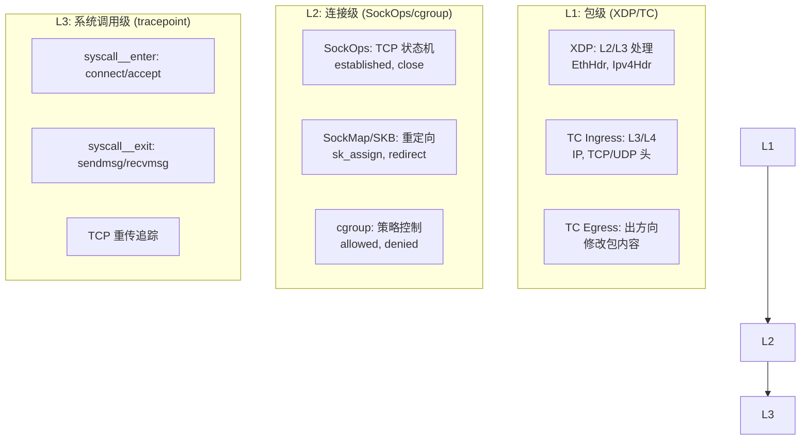
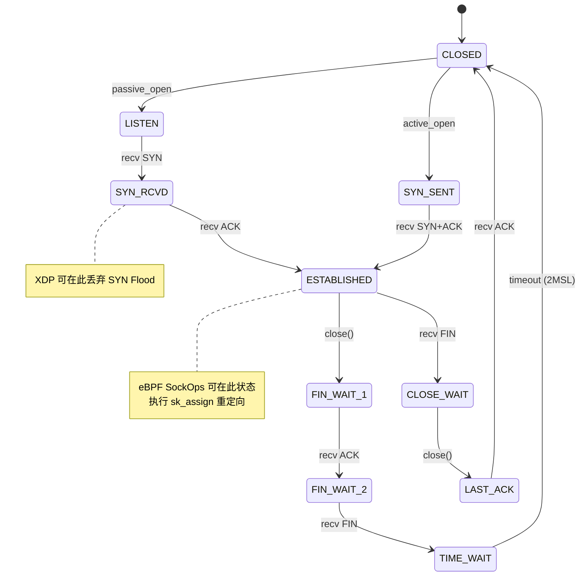
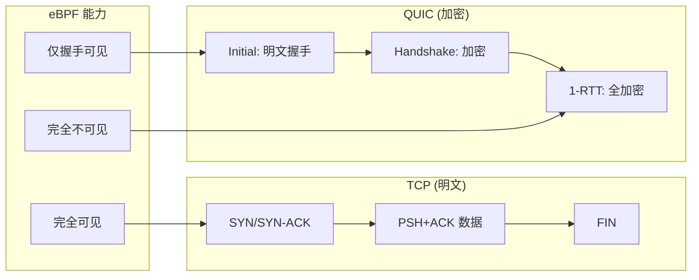
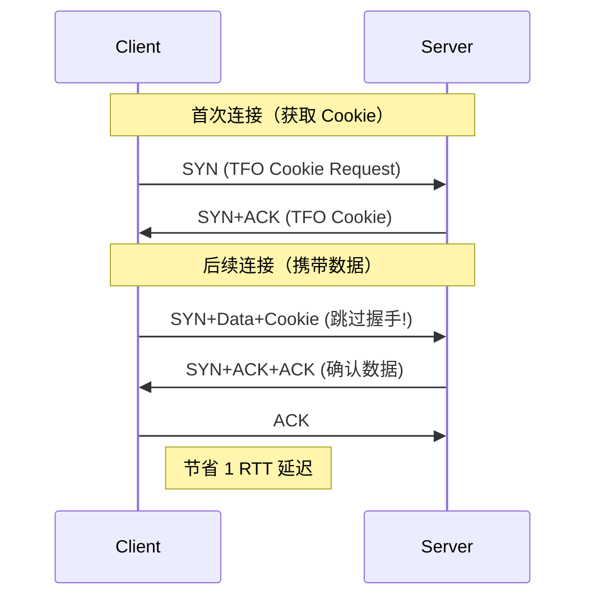

> [!info] eBPF 2026 深度探索系列 0. [[2026-04-08-ebpf-comprehensive-learning-roadmap|全栈学习路径总览]]
>
> 1. [[2026-04-08-ebpf-deep-dive-ch1-registers-and-instructions|第一章：寄存器与指令集]]
> 2. [[2026-04-08-ebpf-deep-dive-ch1-5-function-calls|第一.五章：四种函数调用与动态内存]]
> 3. [[2026-04-08-ebpf-deep-dive-ch1-6-the-verifier|第一.六章：验证器 (Verifier) 的底层逻辑]]
> 4. [[2026-04-08-ebpf-deep-dive-ch2-maps-and-communication|第二章：Map 机制与跨空间通信]]
> 5. [[2026-04-08-ebpf-deep-dive-ch2-5-kptr-and-ownership|第二.五章：kptr (内核指针) 与内存所有权模型]]
> 6. [[2026-04-08-ebpf-deep-dive-ch3-core-and-btf|第三章：CO-RE 与 BTF 的跨版本魔法]]
> 7. [[2026-04-08-ebpf-deep-dive-ch4-tracing-hooks-and-security|第四章：从 kprobe 到 LSM 的追踪全图景]]
> 8. [[2026-04-08-ebpf-deep-dive-ch7-5-uprobes-dynamic-tracing|第七.五章：uprobe 用户态动态追踪原理]]
> 9. [[2026-04-08-ebpf-deep-dive-ch7-6-bpftime-user-runtime|第七.六章：bpftime 与用户态 eBPF 加速]]
> 10. [[2026-04-08-ebpf-deep-dive-ch18-bpftime-injection-mastery|第七.七章：bpftime 自动化注入与全量监控实战]]
> 11. [[2026-04-08-ebpf-deep-dive-ch7-8-uprobe-selection-guide|第七.八章：uprobe 选型指南：内核态 vs 用户态]]
> 12. [[2026-04-08-ebpf-deep-dive-ch5-xdp-networking-performance|第五章：XDP 极致网络性能与全栈架构]]
> 13. [[2026-04-08-ebpf-deep-dive-ch6-tc-traffic-control|第六章：TC (Traffic Control) 流量调度艺术]]
> 14. [[2026-04-08-ebpf-deep-dive-ch7-security-lsm-enforcement|第七章：LSM BPF 从可观测到安全执法]]
> 15. [[2026-04-08-ebpf-deep-dive-ch8-advanced-tuning-and-profiling|第八章：进阶实战与内核调优]]
> 16. [[2026-04-08-ebpf-deep-dive-ch9-af-xdp-zero-copy|第九章：AF_XDP 零拷贝与用户态协议栈]]
> 17. [[2026-04-08-ebpf-deep-dive-ch10-sched-ext-custom-scheduler|第十章：sched_ext 自定义 CPU 调度器]]
> 18. [[2026-04-08-ebpf-deep-dive-ch11-bpf-iterators|第十一章：BPF Iterators 内核对象迭代器]]
> 19. [[2026-04-08-ebpf-deep-dive-ch12-kfuncs-evolution|第十二章：kfuncs 下一代内核交互标准]]
> 20. [[2026-04-08-ebpf-deep-dive-ch13-usdt-tracing|第十三章：USDT 用户态静态定义追踪]]
> 21. [[2026-04-08-ebpf-deep-dive-ch14-ai-llm-inference-monitoring|第十四章：AI 推理与大模型监控前沿]]
> 22. [[2026-04-08-ebpf-deep-dive-ch15-container-isolation|第十五章：无感增强容器隔离性]]
> 23. [[2026-04-08-ebpf-deep-dive-ch16-ebpf-and-wasm|第十六章：eBPF 与 WebAssembly (WASM) 的共生架构]]
> 24. [[2026-04-08-ebpf-deep-dive-ch17-storage-and-filesystem|第十七章：存储与文件系统加速]]
> 25. [[2026-04-08-ebpf-deep-dive-ch18-lifecycle-and-links|第十八章：生命周期管理与 BPF Links]]
> 26. [[2026-04-08-ebpf-deep-dive-ch19-atomic-updates-and-hot-upgrade|第十九章：程序的原子更新与蓝绿部署]]
> 27. [[2026-04-08-ebpf-deep-dive-ch25-5-stack-trace-correlation|第二五.五章：调用栈与业务请求的深度绑定]]
> 28. [[2026-04-08-ebpf-deep-dive-ch20-edge-iot-acceleration|第二十章：边缘计算与工业协议加速]]
> 29. [[2026-04-08-ebpf-deep-dive-ch21-debugging-and-verifier|第二十一章：调试实战与验证器 (Verifier) 诊断]]
> 30. [[2026-04-08-ebpf-deep-dive-ch22-testing-and-ci-cd|第二十二章：测试与持续集成 (CI/CD) 实战]]
> 31. [[2026-04-08-ebpf-deep-dive-ch23-security-and-permissions|第二十三章：权限细分与 BPF 安全沙箱]]
> 32. [[2026-04-08-ebpf-deep-dive-ch24-meta-monitoring-and-self-healing|第二十四章：eBPF 程序的内核自愈与监控]]
> 33. [[2026-04-08-ebpf-deep-dive-ch25-full-stack-observability|第二十五章：全栈可观测性与端到端追踪]]
> 34. [[2026-04-08-ebpf-deep-dive-ch26-network-security-high-level|第二十六章：网络安全防御的高阶实战]]
> 35. [[2026-04-08-ebpf-deep-dive-ch27-agent-engineering-architecture|第二十七章：工业级模块化 Agent 架构演进]]
> 36. [[2026-04-08-ebpf-deep-dive-ch28-offensive-and-defensive|第二十八章：攻防博弈与 Rootkit 防御]]
> 37. [[2026-04-08-ebpf-deep-dive-ch29-networking-deep-dive|第二十九章：网络应用深水区——负载均衡、Sockmap 与拥塞控制]]
> 38. [[2026-04-08-ebpf-deep-dive-ch30-hardware-offload|第三十章：硬件卸载与 SmartNIC 实战]]
> 39. [[2026-04-08-ebpf-deep-dive-ch31-signed-objects-and-security|第三十一章：内核原生签名与供应链安全]]
> 40. [[2026-04-08-ebpf-deep-dive-ch32-ebpf-for-windows|第三十二章：跨平台崛起——eBPF for Windows]]
> 41. [[2026-04-08-ebpf-deep-dive-ch32-5-macos-status|第三十二.五章：macOS 的特殊路径]]
> 42. [[2026-04-08-ebpf-deep-dive-ch33-serverless-optimization|第三十三章：Serverless 冷启动消除与动态计费]]
> 43. [[2026-04-08-ebpf-deep-dive-ch34-waf-and-rasp|第三十四章：Web 安全革命——内核态 WAF 与 RASP]]
> 44. [[2026-04-08-ebpf-deep-dive-ch35-npu-tpu-ai-hardware|第三十五章：AI 推理硬件 (NPU/TPU) 与硬件定义内核]]
> 45. [[2026-04-08-ebpf-deep-dive-ch36-dynamic-language-introspection|第三十六章：动态语言感知——业务对象的零代码提取]]
> 46. [[2026-04-08-ebpf-deep-dive-ch37-green-computing|第三十七章：绿色计算与能耗精准归因]]
> 47. [[2026-04-08-ebpf-deep-dive-ch38-ecosystem-and-career|第三十八章：2026 生态全景与工程师职业导航]]
> 48. [[2026-04-09-ebpf-deep-dive-ch39-rust-aya-framework|第三十九章：Rust eBPF 开发实战——Aya 框架与安全编程]]
> 49. **第四十章：网络协议深度解析——TCP/UDP/QUIC 的 eBPF 视角**
> 50. [[2026-04-09-ebpf-deep-dive-ch41-memory-safety-and-vulnerabilities|第四十一章：eBPF 内存安全与漏洞分析]]
> 51. [[2026-04-09-ebpf-deep-dive-ch42-service-mesh-integration|第四十二章：eBPF 与 Service Mesh 深度集成]]

---

## 1. 概述：在 eBPF 视角下重新理解网络协议

传统网络协议分析依赖用户态工具（tcpdump、Wireshark），存在"数据拷贝"和"上下文切换"两大开销。eBPF 允许我们在内核协议栈的关键节点直接观测和修改协议行为，实现纳秒级的协议感知。

### 1.1 eBPF 网络观测的三个层次



### 1.2 三大协议的 eBPF 可观测性对比

| 协议     | 包级解析     | 连接追踪         | 状态机感知 | eBPF 修改能力        | 复杂度 |
| :------- | :----------- | :--------------- | :--------- | :------------------- | :----- |
| **TCP**  | 完整         | SockOps 完整     | 支持       | NAT、重定向、优化    | 中     |
| **UDP**  | 完整         | 有限（无状态）   | 不支持     | 端口重定向、负载均衡 | 低     |
| **QUIC** | 受限（加密） | 受限（握手明文） | 不支持     | 仅限握手阶段         | 高     |

---

## 2. TCP 深度解析：状态机与性能优化

### 2.1 TCP 连接状态机与 eBPF Hook 点



### 2.2 TCP 连接全生命周期监控代码

```c
#include <vmlinux.h>
#include <bpf/bpf_helpers.h>
#include <bpf/bpf_tracing.h>

enum tcp_state {
    TCP_ESTABLISHED = 1,
    TCP_SYN_SENT,
    TCP_SYN_RECV,
    TCP_FIN_WAIT1,
    TCP_FIN_WAIT2,
    TCP_TIME_WAIT,
    TCP_CLOSE,
    TCP_CLOSE_WAIT,
    TCP_LAST_ACK,
    TCP_LISTEN,
    TCP_CLOSING,
    TCP_NEW_SYN_RECV,
};

struct conn_event {
    u64 timestamp_ns;
    u32 src_ip;
    u32 dst_ip;
    u16 src_port;
    u16 dst_port;
    u8 old_state;
    u8 new_state;
    u32 pid;
};

struct {
    __uint(type, BPF_MAP_TYPE_RINGBUF);
    __uint(max_entries, 4 * 1024 * 1024);
} conn_events SEC(".maps");

// 统计 Map
struct {
    __uint(type, BPF_MAP_TYPE_HASH);
    __uint(max_entries, 100000);
    __type(key, struct bpf_sock_tuple);
    __type(value, struct conn_stats);
} conn_stats SEC(".maps");

struct conn_stats {
    u64 bytes_sent;
    u64 bytes_recv;
    u64 retransmits;
    u64 start_ns;
};

SEC("sockops")
int tcp_state_monitor(struct bpf_sock_ops *skops) {
    struct bpf_sock_tuple tuple = {};
    u32 old_state, new_state;

    // 获取连接五元组
    if (skops->family == AF_INET) {
        tuple.ipv4.saddr = skops->local_ip4;
        tuple.ipv4.daddr = skops->remote_ip4;
        tuple.ipv4.sport = skops->local_port;
        tuple.ipv4.dport = skops->remote_port;
    } else {
        return 0;
    }

    old_state = skops->args[1];  // old_state
    new_state = skops->args[0];  // new_state

    // 只关注状态变化
    if (old_state == new_state) return 0;

    // 记录连接建立
    if (new_state == TCP_ESTABLISHED) {
        struct conn_stats stats = {
            .start_ns = bpf_ktime_get_ns(),
        };
        bpf_map_update_elem(&conn_stats, &tuple, &stats, BPF_ANY);
    }

    // 上报状态变化事件
    struct conn_event *ev = bpf_ringbuf_reserve(&conn_events, sizeof(*ev), 0);
    if (ev) {
        ev->timestamp_ns = bpf_ktime_get_ns();
        ev->src_ip = skops->remote_ip4;
        ev->dst_ip = skops->local_ip4;
        ev->src_port = skops->remote_port;
        ev->dst_port = skops->local_port;
        ev->old_state = old_state;
        ev->new_state = new_state;
        ev->pid = bpf_get_current_pid_tgid() >> 32;
        bpf_ringbuf_submit(ev, 0);
    }

    // 清理已关闭连接
    if (new_state == TCP_CLOSE || new_state == TCP_TIME_WAIT) {
        bpf_map_delete_elem(&conn_stats, &tuple);
    }

    return 0;
}
```

### 2.3 TCP 性能优化：SockMap 连接重定向

```c
// 使用 SockMap 加速本地 TCP 连接（绕过内核协议栈部分路径）
struct {
    __uint(type, BPF_MAP_TYPE_SOCKMAP);
    __uint(max_entries, 65536);
    __type(key, u32);        // 端口哈希
    __type(value, u64);      // sock cookie
} backend_socks SEC(".maps");

SEC("sk_msg")
int msg_redirect(struct sk_msg_md *ctx) {
    // 将消息重定向到目标 socket，绕过 TCP 协议栈
    u32 key = ctx->local_port;
    u64 *cookie = bpf_map_lookup_elem(&backend_socks, &key);

    if (cookie && *cookie != 0) {
        // 直接将 SKB 重定向到目标 socket
        // 跳过 TCP 发送缓冲区和协议处理
        bpf_msg_redirect_hash(ctx, &backend_socks, &key, BPF_F_INGRESS);
        return SK_PASS;
    }

    return SK_PASS;
}
```

### 2.4 TCP 重传与拥塞监控

```c
// 监控 TCP 重传事件
SEC("tracepoint/sock/inet_sock_set_state")
int trace_tcp_retrans(struct trace_event_raw_inet_sock_set_state *ctx) {
    if (ctx->protocol != IPPROTO_TCP) return 0;
    if (ctx->newstate != TCP_ESTABLISHED) return 0;

    // 通过 TC 追踪 TCP 重传标志
    return 0;
}

// TC 层检测 TCP 重传
SEC("tc")
int detect_tcp_retransmit(struct __sk_buff *skb) {
    void *data_end = (void *)(long)skb->data_end;
    void *data = (void *)(long)skb->data;

    struct ethhdr *eth = data;
    if ((void *)(eth + 1) > data_end) return TC_ACT_OK;

    struct iphdr *ip = (void *)(eth + 1);
    if ((void *)(ip + 1) > data_end || ip->protocol != IPPROTO_TCP)
        return TC_ACT_OK;

    struct tcphdr *tcp = (void *)ip + (ip->ihl * 4);
    if ((void *)(tcp + 1) > data_end) return TC_ACT_OK;

    // 检测重传：序列号小于已确认的最大序列号
    // （简化：实际需要维护 per-connection 的状态）
    struct tcp_info info = {};
    __u32 info_len = sizeof(info);
    bpf_getsockopt(skb, SOL_TCP, TCP_INFO, &info, &info_len);

    if (info.tcpi_retrans > 0) {
        bpf_printk("TCP RETRANS: %pI4:%d -> %pI4:%d retrans=%u",
                   &ip->saddr, tcp->source, &ip->daddr, tcp->dest,
                   info.tcpi_retrans);
    }

    return TC_ACT_OK;
}
```

---

## 3. UDP 深度解析：无状态协议的有状态管理

### 3.1 UDP 的 eBPF 挑战

UDP 是无状态协议，没有 TCP 那样的连接状态机。但许多上层协议（QUIC、DNS、gRPC）在 UDP 之上构建了有状态语义。eBPF 可以在内核层面为 UDP 实现"伪状态"管理。

### 3.2 UDP 流量负载均衡

```c
// 基于 5 元组的 UDP 负载均衡
struct udp_flow_key {
    u32 src_ip;
    u32 dst_ip;
    u16 src_port;
    u16 dst_port;
};

struct backend_info {
    u32 ip;
    u16 port;
    u8 weight;
};

struct {
    __uint(type, BPF_MAP_TYPE_HASH);
    __uint(max_entries, 100000);
    __type(key, struct udp_flow_key);
    __type(value, u32);  // backend index
} flow_table SEC(".maps");

struct {
    __uint(type, BPF_MAP_TYPE_ARRAY);
    __uint(max_entries, 64);
    __type(key, u32);
    __type(value, struct backend_info);
} backends SEC(".maps");

// 一致性哈希选后端
static u32 select_backend(struct udp_flow_key *key) {
    u32 hash = key->src_ip ^ key->dst_ip ^ key->src_port ^ key->dst_port;
    hash = hash * 2654435761u;  // Knuth 乘法哈希
    return hash % 64;  // 假设最多 64 个后端
}

SEC("xdp")
int udp_loadbalance(struct xdp_md *ctx) {
    void *data_end = (void *)(long)ctx->data_end;
    void *data = (void *)(long)ctx->data;

    struct ethhdr *eth = data;
    if ((void *)(eth + 1) > data_end) return XDP_PASS;

    struct iphdr *ip = (void *)(eth + 1);
    if ((void *)(ip + 1) > data_end) return XDP_PASS;

    if (ip->protocol != IPPROTO_UDP) return XDP_PASS;

    struct udphdr *udp = (void *)ip + (ip->ihl * 4);
    if ((void *)(udp + 1) > data_end) return XDP_PASS;

    struct udp_flow_key key = {
        .src_ip = ip->saddr,
        .dst_ip = ip->daddr,
        .src_port = udp->source,
        .dst_port = udp->dest,
    };

    // 查找已有映射（会话保持）
    u32 *backend_idx = bpf_map_lookup_elem(&flow_table, &key);
    u32 idx;

    if (backend_idx) {
        idx = *backend_idx;
    } else {
        // 新连接：选择后端并记录
        idx = select_backend(&key);
        bpf_map_update_elem(&flow_table, &key, &idx, BPF_ANY);
    }

    struct backend_info *backend = bpf_map_lookup_elem(&backends, &idx);
    if (!backend) return XDP_PASS;

    // 修改目标 IP 和端口
    ip->daddr = backend->ip;
    udp->dest = backend->port;

    // 重新计算校验和
    bpf_csum_diff(NULL, 0, NULL, 0, 0);  // 触发硬件校验和卸载

    return XDP_PASS;
}
```

### 3.3 DNS 查询监控

```c
// eBPF 追踪 DNS 查询和响应
struct dns_event {
    u64 timestamp_ns;
    u32 pid;
    u16 query_id;
    u8 query_type;    // A=1, AAAA=28, CNAME=5
    char domain[128];
    u32 result_ip;    // A 记录结果
};

struct {
    __uint(type, BPF_MAP_TYPE_RINGBUF);
    __uint(max_entries, 2 * 1024 * 1024);
} dns_events SEC(".maps");

SEC("xdp")
int dns_monitor(struct xdp_md *ctx) {
    void *data_end = (void *)(long)ctx->data_end;
    void *data = (void *)(long)ctx->data;

    struct ethhdr *eth = data;
    struct iphdr *ip = (void *)(eth + 1);
    struct udphdr *udp = (void *)ip + (ip->ihl * 4);

    if ((void *)(udp + 1) > data_end) return XDP_PASS;
    if (udp->dest != bpf_htons(53) && udp->source != bpf_htons(53))
        return XDP_PASS;

    // DNS 报文起始位置
    u8 *dns_start = (u8 *)(udp + 1);
    if (dns_start + 12 > (u8 *)data_end) return XDP_PASS;

    // DNS 头部
    u16 query_id = (dns_start[0] << 8) | dns_start[1];
    u16 flags = (dns_start[2] << 8) | dns_start[3];
    u16 qdcount = (dns_start[4] << 8) | dns_start[5];
    u8 is_response = (flags >> 15) & 1;

    struct dns_event *ev = bpf_ringbuf_reserve(&dns_events, sizeof(*ev), 0);
    if (!ev) return XDP_PASS;

    ev->timestamp_ns = bpf_ktime_get_ns();
    ev->pid = 0;  // XDP 中无法获取 PID
    ev->query_id = query_id;

    // 解析域名（简化：只取前 128 字节）
    u8 *name_ptr = dns_start + 12;
    int name_len = 0;
    #pragma unroll
    for (int i = 0; i < 12 && name_ptr + i < (u8 *)data_end; i++) {
        u8 label_len = name_ptr[i];
        if (label_len == 0) break;
        for (int j = 0; j < label_len && name_len < 127; j++) {
            i++;
            if (name_ptr + i < (u8 *)data_end)
                ev->domain[name_len++] = name_ptr[i];
        }
        ev->domain[name_len++] = '.';
    }
    ev->domain[name_len > 0 ? name_len - 1 : 0] = '\0';

    // 解析查询类型
    u8 *qtype_ptr = name_ptr;
    // 跳过域名部分找到 QTYPE
    int offset = 0;
    #pragma unroll
    for (int i = 0; i < 12; i++) {
        if (name_ptr + offset + i > (u8 *)data_end) break;
        if (name_ptr[offset + i] == 0) {
            qtype_ptr = name_ptr + offset + i + 1;
            break;
        }
        offset += name_ptr[offset + i] + 1;
    }

    if (qtype_ptr + 1 < (u8 *)data_end) {
        ev->query_type = (qtype_ptr[0] << 8) | qtype_ptr[1];
    }

    bpf_ringbuf_submit(ev, 0);
    return XDP_PASS;
}
```

---

## 4. QUIC 协议：eBPF 的终极挑战

### 4.1 QUIC 为什么难以用 eBPF 处理？



| QUIC 阶段 | 加密状态     | eBPF 可解析 | 可操作                 |
| :-------- | :----------- | :---------- | :--------------------- |
| Initial   | 明文         | 完全        | 连接 ID 映射、速率限制 |
| Handshake | TLS 1.3 加密 | 有限        | 连接 ID 路由           |
| 1-RTT     | TLS 1.3 加密 | 仅外层      | 源/目标地址、端口      |

### 4.2 QUIC 连接 ID 路由

虽然 QUIC 的载荷加密，但**连接 ID (Connection ID)** 是明文的，可以用于路由决策：

```c
// QUIC Long Header 格式 (Initial/Handshake):
// +----+--------+--------+--------+--------+
// | 1  | 1-1-1  |  Version (32)  | DCID Len| DCID |
// +----+--------+--------+--------+--------+
// | SCID Len |     SCID      |    Payload Length  |

// QUIC Short Header (1-RTT):
// +----+--------+--------+--------+--------+
// | 0  | 1-1-1  | Connection ID  |  Packet Number |
// +----+--------+--------+--------+--------+

struct quic_connection_key {
    u8 dcid[20];  // Destination Connection ID
};

struct {
    __uint(type, BPF_MAP_TYPE_HASH);
    __uint(max_entries, 1000000);
    __type(key, struct quic_connection_key);
    __type(value, u32);  // backend index
} quic_routes SEC(".maps");

SEC("xdp")
int quic_router(struct xdp_md *ctx) {
    void *data_end = (void *)(long)ctx->data_end;
    void *data = (void *)(long)ctx->data;

    struct ethhdr *eth = data;
    struct iphdr *ip = (void *)(eth + 1);
    struct udphdr *udp = (void *)ip + (ip->ihl * 4);

    if ((void *)(udp + 1) > data_end) return XDP_PASS;
    // QUIC 使用 UDP 端口 443
    if (udp->dest != bpf_htons(443)) return XDP_PASS;

    u8 *quic = (u8 *)(udp + 1);
    if (quic + 5 > (u8 *)data_end) return XDP_PASS;

    u8 first_byte = quic[0];
    int is_long_header = (first_byte & 0x80) != 0;

    struct quic_connection_key key = {};

    if (is_long_header) {
        // Long Header: 跳过 Version (4 bytes) 读取 DCID
        if (quic + 6 > (u8 *)data_end) return XDP_PASS;
        u8 dcid_len = quic[5];
        if (dcid_len > 20 || quic + 6 + dcid_len > (u8 *)data_end)
            return XDP_PASS;
        __builtin_memcpy(key.dcid, quic + 6, dcid_len);
    } else {
        // Short Header: DCID 紧跟第一个字节
        // 需要 CID 长度配置（通常 4-20 字节）
        // 简化：假设 CID 长度为 4
        if (quic + 5 > (u8 *)data_end) return XDP_PASS;
        __builtin_memcpy(key.dcid, quic + 1, 4);
    }

    // 查找路由表
    u32 *backend = bpf_map_lookup_elem(&quic_routes, &key);
    if (backend) {
        // 路由到指定后端
        // 实际实现使用 bpf_redirect
        bpf_printk("QUIC route: CID=%02x%02x backend=%d",
                   key.dcid[0], key.dcid[1], *backend);
    }

    return XDP_PASS;
}
```

### 4.3 QUIC 性能基准

| 操作         | TCP (eBPF)     | QUIC (eBPF, 仅外层) | 说明                    |
| :----------- | :------------- | :------------------ | :---------------------- |
| 包过滤 (XDP) | 5ns            | 8ns                 | QUIC 头解析稍复杂       |
| 连接路由     | 15ns (SockMap) | 20ns (CID Hash)     | QUIC 路由需要额外 Hash  |
| 负载均衡     | 25ns           | 35ns                | QUIC 需要维护 CID 映射  |
| DDoS 防护    | 极有效         | 中等有效            | QUIC 加密限制了深度检测 |
| 连接跟踪     | 完整           | 仅 CID 级别         | 无法追踪内部流          |

---

## 5. 协议加速实战：TCP Fast Open 与 eBPF

### 5.1 TCP Fast Open (TFO) 原理



### 5.2 eBPF 启用 TCP Fast Open

```c
// 在 cgroup 层为特定 Pod 启用 TFO
SEC("cgroup/setsockopt")
int enable_tfo(struct bpf_sockopt *ctx) {
    // 只拦截 SOL_TCP 层的 setsockopt
    if (ctx->level != SOL_TCP) return 1;  // 不修改，继续

    // 设置 TCP_FASTOPEN_KEY
    if (ctx->optname == TCP_FASTOPEN_KEY) {
        // 允许设置 TFO key
        return 1;
    }

    // 设置 TCP_FASTOPEN
    if (ctx->optname == TCP_FASTOPEN) {
        // 强制启用 TFO (queue len = 4096)
        __u32 tfo_val = 4096;
        ctx->optlen = sizeof(tfo_val);
        bpf_probe_read_kernel(
            (void *)ctx->optval, sizeof(tfo_val), &tfo_val);
        return 1;  // 修改值
    }

    return 1;
}
```

---

## 6. 协议层监控仪表盘

### 6.1 实时协议统计

```c
// 实时协议统计 eBPF 程序
struct proto_stats {
    u64 tcp_syn_received;
    u64 tcp_established;
    u64 tcp_closed;
    u64 udp_packets;
    u64 udp_bytes;
    u64 quic_initial;
    u64 quic_handshake;
    u64 quic_short;
    u64 dns_queries;
    u64 dns_responses;
};

struct {
    __uint(type, BPF_MAP_TYPE_ARRAY);
    __uint(max_entries, 1);
    __type(key, u32);
    __type(value, struct proto_stats);
} global_stats SEC(".maps");

// XDP 层统计 UDP 和 QUIC
SEC("xdp")
int proto_stats_xdp(struct xdp_md *ctx) {
    // ... 解析包头 ...

    u32 key = 0;
    struct proto_stats *stats = bpf_map_lookup_elem(&global_stats, &key);
    if (!stats) return XDP_PASS;

    if (ip->protocol == IPPROTO_UDP) {
        __sync_fetch_and_add(&stats->udp_packets, 1);
        __sync_fetch_and_add(&stats->udp_bytes, bpf_ntohs(udp->len));

        // 检测 QUIC (UDP 443)
        if (udp->dest == bpf_htons(443)) {
            u8 *quic = (u8 *)(udp + 1);
            if (quic < (u8 *)(long)ctx->data_end) {
                if ((*quic & 0x80) != 0) {
                    // Long Header
                    __sync_fetch_and_add(&stats->quic_initial, 1);
                } else {
                    __sync_fetch_and_add(&stats->quic_short, 1);
                }
            }
        }
    }

    return XDP_PASS;
}
```

### 6.2 协议分布监控对比

| 监控维度  | 传统工具 (tcpdump) | eBPF (XDP + SockOps) | 优势             |
| :-------- | :----------------- | :------------------- | :--------------- |
| 采样率    | 100% (但高开销)    | 100% (极低开销)      | eBPF 无数据拷贝  |
| 协议解析  | 用户态 (libpcap)   | 内核态 (零拷贝)      | eBPF 快 10-100x  |
| 连接状态  | 需重建状态机       | SockOps 直接获取     | eBPF 精确无遗漏  |
| 加密流量  | 可见 (TCP 明文)    | 可见 (TCP 明文)      | 相同             |
| QUIC 载荷 | 不可见             | 不可见               | 相同（都需密钥） |
| 实时告警  | 需后处理           | 内核态即时触发       | eBPF 毫秒级响应  |

---

## 7. FAQ

**Q1：eBPF 能解密 TLS 1.3 加密的 QUIC 流量吗？**

A：不能直接解密。QUIC 使用 TLS 1.3 加密所有载荷（包括头部的大部分字段）。eBPF 能看到的是：1) 外层 UDP/IP 头（源/目标 IP 和端口）；2) QUIC 的连接 ID（用于路由，明文）；3) Initial 包中的 TLS ClientHello（明文，包含 SNI）。如果需要解密 QUIC 流量进行深度检测，需要使用 eBPF 配合 SSLKEYLOGFILE 或 uprobe 拦截 OpenSSL/BoringSSL 的密钥导出函数（见[[2026-04-08-ebpf-deep-dive-ch26-network-security-high-level|第二十六章]]）。

**Q2：如何用 eBPF 实现 TCP 连接限速？**

A：方案：1) 使用 cgroup BPF 程序在 `bpf_sock_ops` 回调中监控连接创建速率；2) 维护 per-cgroup 的连接计数器（使用 Per-CPU Array）；3) 当连接速率超过阈值时，返回 `-EPERM` 拒绝新连接。Cilium 的网络策略执行使用了类似机制。也可以在 XDP 层对 SYN 包进行速率限制（更激进，在协议栈之前丢弃）。

**Q3：eBPF 处理 TCP 和 UDP 时性能差异有多大？**

A：TCP 处理稍慢（约 10-20%），原因：1) TCP 头部解析更复杂（20 字节 vs 8 字节）；2) TCP 状态机需要 Map 查找和更新；3) TCP 校验和验证更复杂。但在实际场景中，这个差异可以忽略（10ns vs 8ns per packet）。瓶颈通常在 Map 查找和事件上报，而非协议解析本身。

**Q4：如何用 eBPF 实现 TCP 代理（透明代理）？**

A：方案：1) XDP 层：修改目标 IP/端口为代理地址；2) 代理服务：接收流量并转发到真实后端；3) SockMap：对于已建立的连接，使用 `sk_assign` 直接重定向到代理 socket，绕过协议栈。Cilium 的 NodePort 实现就是这种模式。2026 年推荐使用 `bpf_redirect_peer()` Helper（Linux 6.6+）实现更高效的同节点重定向。

**Q5：eBPF 能用于 HTTP/2 和 HTTP/3 的内容检测吗？**

A：HTTP/2 over TCP：可以在 TC 层解析 HPACK 编码的帧头部，但解压 HPACK 需要维护动态表，在 eBPF 中实现复杂。HTTP/3 over QUIC：由于 QUIC 加密，无法直接解析。实用方案：1) 在 uprobe 层拦截应用层的 HTTP 库（如 nginx、Envoy），获取解密后的 HTTP 内容；2) 使用 TLS 密钥导出配合用户态解密。eBPF 的价值在于协议路由和流量管理，而非内容检测。

**Q6：如何用 eBPF 优化 gRPC over HTTP/2 的性能？**

A：方案：1) TC 层解析 HTTP/2 帧头，提取 stream ID 和帧类型；2) 基于 stream ID 进行流量整形（per-stream 速率限制）；3) 使用 SockMap 加速 gRPC 后端间的本地通信；4) 通过 SockOps 监控 TCP 窗口大小和 RTT，动态调整 gRPC 的流控参数。Meta（Facebook）和 Google 都使用 eBPF 优化其 gRPC 基础设施。

**Q7：eBPF 能处理 SCTP 和 DCCP 等非主流协议吗？**

A：可以。XDP 和 TC 层可以看到所有 IP 协议（通过 ip->protocol 字段区分）。SCTP（协议号 132）和 DCCP（协议号 33）的头部解析与 TCP/UDP 类似。但由于这些协议使用较少，eBPF 生态中的工具和示例也较少。如果你需要处理 SCTP（如电信信令），可以参考 Linux 内核源码中的 SCTP 头部定义来编写解析代码。

**Q8：在生产环境中，eBPF 协议解析的稳定性如何？**

A：2026 年已在大规模生产环境验证：1) Meta 使用 XDP 进行每秒数十亿次的包处理；2) Google 使用 eBPF 进行 gRPC 负载均衡；3) Cloudflare 使用 eBPF 进行 DDoS 防护。关键稳定因素：1) 使用 CO-RE 确保跨内核版本兼容；2) 限制 Map 大小防止 OOM；3) 设置合理的采样率避免 CPU 过载；4) 监控 eBPF 程序自身的性能指标。
