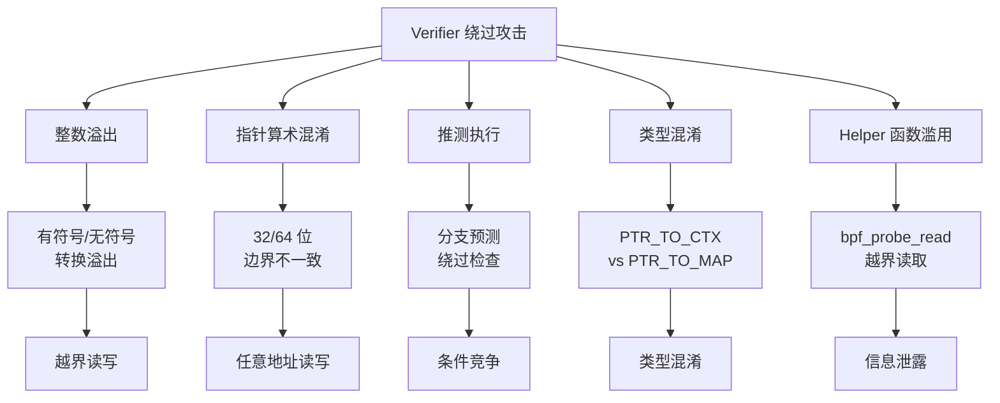
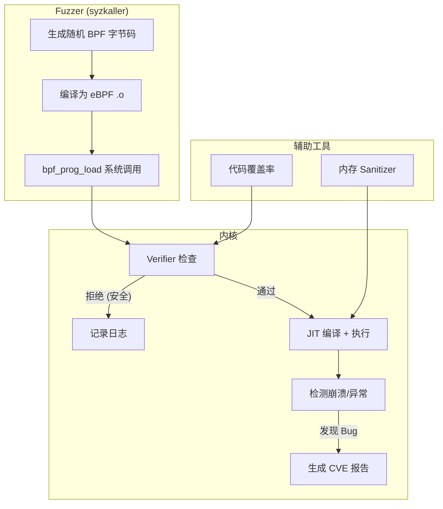
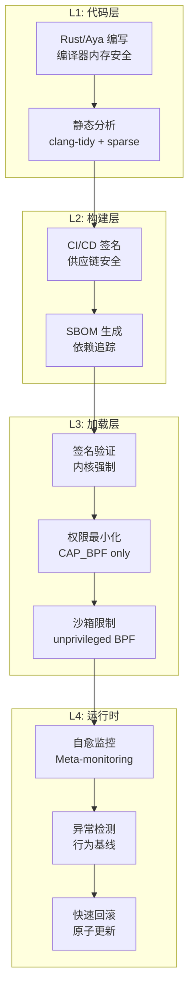
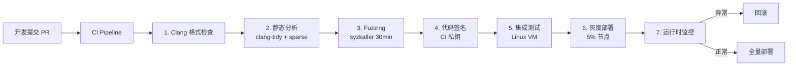
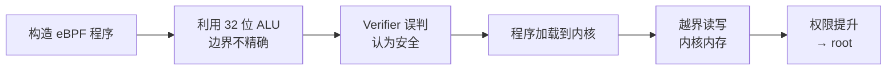

> [!info] eBPF 2026 深度探索系列
> 0. [[2026-04-08-ebpf-comprehensive-learning-roadmap|全栈学习路径总览]]
> 1. [[2026-04-08-ebpf-deep-dive-ch1-registers-and-instructions|第一章：寄存器与指令集]]
> 2. [[2026-04-08-ebpf-deep-dive-ch1-5-function-calls|第一.五章：四种函数调用与动态内存]]
> 3. [[2026-04-08-ebpf-deep-dive-ch1-6-the-verifier|第一.六章：验证器 (Verifier) 的底层逻辑]]
> 4. [[2026-04-08-ebpf-deep-dive-ch2-maps-and-communication|第二章：Map 机制与跨空间通信]]
> 5. [[2026-04-08-ebpf-deep-dive-ch2-5-kptr-and-ownership|第二.五章：kptr (内核指针) 与内存所有权模型]]
> 6. [[2026-04-08-ebpf-deep-dive-ch3-core-and-btf|第三章：CO-RE 与 BTF 的跨版本魔法]]
> 7. [[2026-04-08-ebpf-deep-dive-ch4-tracing-hooks-and-security|第四章：从 kprobe 到 LSM 的追踪全图景]]
> 8. [[2026-04-08-ebpf-deep-dive-ch7-5-uprobes-dynamic-tracing|第七.五章：uprobe 用户态动态追踪原理]]
> 9. [[2026-04-08-ebpf-deep-dive-ch7-6-bpftime-user-runtime|第七.六章：bpftime 与用户态 eBPF 加速]]
> 10. [[2026-04-08-ebpf-deep-dive-ch18-bpftime-injection-mastery|第七.七章：bpftime 自动化注入与全量监控实战]]
> 11. [[2026-04-08-ebpf-deep-dive-ch7-8-uprobe-selection-guide|第七.八章：uprobe 选型指南：内核态 vs 用户态]]
> 12. [[2026-04-08-ebpf-deep-dive-ch5-xdp-networking-performance|第五章：XDP 极致网络性能与全栈架构]]
> 13. [[2026-04-08-ebpf-deep-dive-ch6-tc-traffic-control|第六章：TC (Traffic Control) 流量调度艺术]]
> 14. [[2026-04-08-ebpf-deep-dive-ch7-security-lsm-enforcement|第七章：LSM BPF 从可观测到安全执法]]
> 15. [[2026-04-08-ebpf-deep-dive-ch8-advanced-tuning-and-profiling|第八章：进阶实战与内核调优]]
> 16. [[2026-04-08-ebpf-deep-dive-ch9-af-xdp-zero-copy|第九章：AF_XDP 零拷贝与用户态协议栈]]
> 17. [[2026-04-08-ebpf-deep-dive-ch10-sched-ext-custom-scheduler|第十章：sched_ext 自定义 CPU 调度器]]
> 18. [[2026-04-08-ebpf-deep-dive-ch11-bpf-iterators|第十一章：BPF Iterators 内核对象迭代器]]
> 19. [[2026-04-08-ebpf-deep-dive-ch12-kfuncs-evolution|第十二章：kfuncs 下一代内核交互标准]]
> 20. [[2026-04-08-ebpf-deep-dive-ch13-usdt-tracing|第十三章：USDT 用户态静态定义追踪]]
> 21. [[2026-04-08-ebpf-deep-dive-ch14-ai-llm-inference-monitoring|第十四章：AI 推理与大模型监控前沿]]
> 22. [[2026-04-08-ebpf-deep-dive-ch15-container-isolation|第十五章：无感增强容器隔离性]]
> 23. [[2026-04-08-ebpf-deep-dive-ch16-ebpf-and-wasm|第十六章：eBPF 与 WebAssembly (WASM) 的共生架构]]
> 24. [[2026-04-08-ebpf-deep-dive-ch17-storage-and-filesystem|第十七章：存储与文件系统加速]]
> 25. [[2026-04-08-ebpf-deep-dive-ch18-lifecycle-and-links|第十八章：生命周期管理与 BPF Links]]
> 26. [[2026-04-08-ebpf-deep-dive-ch19-atomic-updates-and-hot-upgrade|第十九章：程序的原子更新与蓝绿部署]]
> 27. [[2026-04-08-ebpf-deep-dive-ch25-5-stack-trace-correlation|第二五.五章：调用栈与业务请求的深度绑定]]
> 28. [[2026-04-08-ebpf-deep-dive-ch20-edge-iot-acceleration|第二十章：边缘计算与工业协议加速]]
> 29. [[2026-04-08-ebpf-deep-dive-ch21-debugging-and-verifier|第二十一章：调试实战与验证器 (Verifier) 诊断]]
> 30. [[2026-04-08-ebpf-deep-dive-ch22-testing-and-ci-cd|第二十二章：测试与持续集成 (CI/CD) 实战]]
> 31. [[2026-04-08-ebpf-deep-dive-ch23-security-and-permissions|第二十三章：权限细分与 BPF 安全沙箱]]
> 32. [[2026-04-08-ebpf-deep-dive-ch24-meta-monitoring-and-self-healing|第二十四章：eBPF 程序的内核自愈与监控]]
> 33. [[2026-04-08-ebpf-deep-dive-ch25-full-stack-observability|第二十五章：全栈可观测性与端到端追踪]]
> 34. [[2026-04-08-ebpf-deep-dive-ch26-network-security-high-level|第二十六章：网络安全防御的高阶实战]]
> 35. [[2026-04-08-ebpf-deep-dive-ch27-agent-engineering-architecture|第二十七章：工业级模块化 Agent 架构演进]]
> 36. [[2026-04-08-ebpf-deep-dive-ch28-offensive-and-defensive|第二十八章：攻防博弈与 Rootkit 防御]]
> 37. [[2026-04-08-ebpf-deep-dive-ch29-networking-deep-dive|第二十九章：网络应用深水区——负载均衡、Sockmap 与拥塞控制]]
> 38. [[2026-04-08-ebpf-deep-dive-ch30-hardware-offload|第三十章：硬件卸载与 SmartNIC 实战]]
> 39. [[2026-04-08-ebpf-deep-dive-ch31-signed-objects-and-security|第三十一章：内核原生签名与供应链安全]]
> 40. [[2026-04-08-ebpf-deep-dive-ch32-ebpf-for-windows|第三十二章：跨平台崛起——eBPF for Windows]]
> 41. [[2026-04-08-ebpf-deep-dive-ch32-5-macos-status|第三十二.五章：macOS 的特殊路径]]
> 42. [[2026-04-08-ebpf-deep-dive-ch33-serverless-optimization|第三十三章：Serverless 冷启动消除与动态计费]]
> 43. [[2026-04-08-ebpf-deep-dive-ch34-waf-and-rasp|第三十四章：Web 安全革命——内核态 WAF 与 RASP]]
> 44. [[2026-04-08-ebpf-deep-dive-ch35-npu-tpu-ai-hardware|第三十五章：AI 推理硬件 (NPU/TPU) 与硬件定义内核]]
> 45. [[2026-04-08-ebpf-deep-dive-ch36-dynamic-language-introspection|第三十六章：动态语言感知——业务对象的零代码提取]]
> 46. [[2026-04-08-ebpf-deep-dive-ch37-green-computing|第三十七章：绿色计算与能耗精准归因]]
> 47. [[2026-04-08-ebpf-deep-dive-ch38-ecosystem-and-career|第三十八章：2026 生态全景与工程师职业导航]]
> 48. [[2026-04-09-ebpf-deep-dive-ch39-rust-aya-framework|第三十九章：Rust eBPF 开发实战——Aya 框架与安全编程]]
> 49. [[2026-04-09-ebpf-deep-dive-ch40-network-protocols-deep-dive|第四十章：网络协议深度解析——TCP/UDP/QUIC 的 eBPF 视角]]
> 50. **第四十一章：eBPF 内存安全与漏洞分析**
> 51. [[2026-04-09-ebpf-deep-dive-ch42-service-mesh-integration|第四十二章：eBPF 与 Service Mesh 深度集成]]
---

## 1. 概述：eBPF 的安全模型与攻击面

eBPF 的核心安全承诺是**"通过验证器 (Verifier) 保证内核安全"**——任何未经验证器检查的程序都不能加载到内核。但验证器本身是复杂的软件，历史上曾出现多次被绕过的案例。

### 1.1 eBPF 安全防御层次

```mermaid
graph TB
    subgraph "用户态"
        U1[开发者编写 BPF 程序]
        U2[编译器 (clang/LLVM)]
    end

    subgraph "内核态 - 防御层"
        V1[1. Verifier 静态分析<br/>类型检查 + 边界检查 + 控制流]
        V2[2. 运行时沙箱<br/>Helper 函数白名单 + 指令数限制]
        V3[3. 权限控制<br/>CAP_BPF + CAP_SYS_ADMIN]
        V4[4. 签名验证<br/>BPF 签名 (Linux 6.6+)]
    end

    U1 --> U2 --> V1 --> V2 --> V3 --> V4 --> Execute[执行]

    style V1 fill:#ff9999
    style V2 fill:#ffff99
    style V3 fill:#99ff99
    style V4 fill:#9999ff
```

| 防御层 | 保护目标 | 绕过难度 | 历史绕过次数 |
|:---|:---|:---|:---|
| **Verifier** | 内存安全、类型安全 | 极高 | ~15 次 (2017-2026) |
| **运行时沙箱** | Helper 函数调用 | 高 | ~3 次 |
| **权限控制** | 加载权限 | 中 | ~5 次 |
| **签名验证** | 程序完整性 | 极高 | 0 次 (2026) |

---

## 2. 历史 eBPF CVE 深度分析

### 2.1 重要漏洞时间线

| CVE | 年份 | 类型 | 严重性 | 绕过方式 | 影响内核版本 |
|:---|:---|:---|:---|:---|:---|
| **CVE-2017-16995** | 2017 | 越界读写 | 9.8 (Critical) | 指针算术混淆 | 4.9-4.14 |
| **CVE-2019-7308** | 2019 | 权限提升 | 8.8 (High) | 整数溢过验证器 | 5.1-5.3 |
| **CVE-2021-3444** | 2021 | 越界读写 | 7.8 (High) | ALU32 边界跟踪不精确 | 5.7-5.12 |
| **CVE-2021-3489** | 2021 | 拒绝服务 | 7.0 (High) | 验证器无限循环 | 5.13-5.14 |
| **CVE-2023-2162** | 2023 | 权限提升 | 7.8 (High) | Confused Deputy (bpftime) | 6.1-6.2 |
| **CVE-2023-2163** | 2023 | 信息泄露 | 5.5 (Medium) | 越界读内核栈 | 6.1-6.2 |
| **CVE-2023-2166** | 2023 | 越界写 | 7.8 (High) | map_batch 检查缺失 | 6.1-6.3 |
| **CVE-2025-21788** | 2025 | 权限提升 | 8.1 (High) | kfunc 参数验证缺失 | 6.6-6.12 |

### 2.2 经典漏洞深入分析：CVE-2021-3444

这是 2021 年最严重的 eBPF 漏洞，由 Project Zero 的研究者发现。它利用了 Verifier 在处理 32 位 ALU 操作时边界跟踪的不精确性。

**漏洞原理**：

```c
// 攻击者构造的 eBPF 代码片段
// 目标：让 Verifier 认为 ptr 的范围是 [0, 100)，
// 但实际运行时 ptr 可以指向任意地址

SEC("xdp")
int exploit(struct xdp_md *ctx) {
    void *data = (void *)(long)ctx->data;
    void *data_end = (void *)(long)ctx->data_end;

    // 步骤 1：建立合法的边界
    if (data + 100 > data_end)
        return XDP_DROP;

    u32 offset = 0;

    // 步骤 2：利用 ALU32 操作绕过边界检查
    // Verifier 对 32 位操作的边界推断有缺陷
    asm volatile("r0 = *(u32 *)(r1 + %[off])\n\t"
                 "r0 >>= 1\n\t"          // 右移，可能丢失高位
                 "r0 += %[data]\n\t"     // 加上基址
                 "r0 &= 0xff\n\t"        // AND 掩码
                 :
                 : [off] "i"(offsetof(struct xdp_md, data)),
                   [data] "r"(data)
                 : "r0");

    // 步骤 3：Verifier 认为 r0 在合法范围内，但实际值可能越界
    u8 *ptr = (u8 *)(long)ctx->data + offset;
    *ptr = 0xff;  // 越界写！

    return XDP_PASS;
}
```

**修复方案**：在 Verifier 中增加对 32 位 ALU 操作的精确边界跟踪，确保寄存器的上下界在任何运算后都保持精确。

---

## 3. Verifier 绕过技术分类

### 3.1 攻击技术全景图



### 3.2 整数溢出攻击模式

```c
// 漏洞模式：有符号整数溢出导致边界检查被绕过
SEC("kprobe/do_sys_open")
int integer_overflow_vuln(struct pt_regs *ctx) {
    void *data = (void *)ctx->di;  // 来自用户态的指针
    u32 user_len = (u32)ctx->si;   // 来自用户态的长度

    // 检查：user_len < 256 → Verifier 认为安全
    if (user_len > 256)
        return 0;

    // 攻击：如果 user_len 被当作有符号数处理
    // 0xFFFFFF00 在无符号比较中 > 256，但...
    // 某些内核版本中，32 位值被符号扩展为 64 位
    // 导致 (s64)(-256) + base 可能指向内核内存
    char buf[256];
    bpf_probe_read_user(buf, user_len, data);  // 可能越界读

    return 0;
}
```

### 3.3 推测执行攻击

```c
// 利用推测执行绕过 Verifier 的条件检查
// 原理：虽然 Verifier 分析了两条路径都安全，
// 但 CPU 的推测执行可能走"非法"路径

SEC("xdp")
int speculative_bypass(struct xdp_md *ctx) {
    void *data = (void *)(long)ctx->data;
    void *data_end = (void *)(long)ctx->data_end;

    u32 offset = *(u32 *)(data + 4);  // 从包中读取偏移

    // Verifier 看到：如果 offset > 100，函数返回
    if (offset > 100)
        return XDP_DROP;

    // Verifier 认为此处 offset ∈ [0, 100]
    // 但推测执行可能在"返回"之前执行下面的代码
    u8 val = *(u8 *)(data + offset);

    // 使用 val 作为索引访问 Map
    // 推测执行可能读取越界内存
    u64 *result = bpf_map_lookup_elem(&my_map, &val);

    return XDP_PASS;
}
```

**防御**：Linux 5.18+ 在 Verifier 中增加了推测执行安全检查（SPEC_SAFE），标记可能被推测执行的路径。

---

## 4. 内存安全违规类型

### 4.1 三大违规类型

| 违规类型 | 描述 | Verifier 防护 | 绕过可能性 |
|:---|:---|:---|:---|
| **Use-After-Free** | 释放后使用 | 引用计数跟踪 | 中等 |
| **Out-of-Bounds** | 数组/缓冲区越界 | 边界检查 | 较高（历史 CVE 最多） |
| **Type Confusion** | 类型混淆 | BTF 类型检查 | 低 |

### 4.2 Use-After-Free 防御机制

```c
// eBPF 对象的引用计数模型
// 每个 BPF 对象（Map、Program、Link）都有引用计数

// 正确的使用模式
SEC("xdp")
int correct_usage(struct xdp_md *ctx) {
    // 1. 从 Map 中查找元素
    struct value *v = bpf_map_lookup_elem(&my_map, &key);
    if (!v)
        return XDP_DROP;

    // 2. 安全使用（只要不释放 Map，v 始终有效）
    bpf_printk("value: %d", v->field);

    // 3. 如果传递给 Helper，引用计数自动管理
    bpf_ringbuf_submit(v, 0);  // 转移所有权

    return XDP_PASS;
}

// 危险的错误模式（Verifier 会拒绝）
SEC("xdp")
int dangerous_pattern(struct xdp_md *ctx) {
    struct value *v = bpf_map_lookup_elem(&my_map, &key);
    if (!v) return XDP_DROP;

    // 错误：手动删除元素后再使用
    bpf_map_delete_elem(&my_map, &key);
    bpf_printk("value: %d", v->field);  // UAF！Verifier 应拒绝

    return XDP_PASS;
}
```

### 4.3 越界访问的 Verifier 检查

```c
// Verifier 对每个内存访问的检查流程
// 1. 确定访问类型 (read/write)
// 2. 确定访问大小 (1/2/4/8 bytes)
// 3. 计算访问地址的下界和上界
// 4. 检查 [addr, addr+size) 是否完全在安全范围内

SEC("xdp")
int oob_example(struct xdp_md *ctx) {
    void *data = (void *)(long)ctx->data;
    void *data_end = (void *)(long)ctx->data_end;

    // Verifier 的检查过程：
    // 1. data 是 PTR_TO_PACKET, data_end 是 PTR_TO_PACKET_END
    // 2. 每次 data+offset 访问时，Verifier 检查：
    //    data + offset + sizeof(*ptr) <= data_end
    // 3. 如果 offset 来自包数据，Verifier 追踪其可能值范围

    struct ethhdr *eth = data;
    // 检查：data + sizeof(struct ethhdr) <= data_end ?
    if ((void *)(eth + 1) > data_end)
        return XDP_DROP;

    // 安全：Verifier 已验证 eth 在合法范围内
    __be16 proto = eth->h_proto;

    return XDP_PASS;
}
```

---

## 5. eBPF Fuzzing 技术

### 5.1 Fuzzing 架构



### 5.2 使用 syzkaller 进行 eBPF Fuzzing

```bash
# 安装 syzkaller
git clone https://github.com/google/syzkaller
cd syzkaller && make

# 创建 eBPF fuzzing 配置
cat > ebpf_fuzz.cfg << 'EOF'
{
    "target": "linux/amd64",
    "http": "127.0.0.1:56741",
    "workdir": "/syzkaller/workdir",
    "kernel_obj": "/path/to/linux-build",
    "syzkaller": "/path/to/syzkaller",
    "cover": true,
    "procs": 8,
    "type": "qemu",
    "vm": {
        "count": 4,
        "kernel": "/path/to/bzImage",
        "initrd": "/path/to/initrd.cpio.gz"
    }
}
EOF

# 运行 eBPF 专用 fuzzing
./syzkaller manager -config=ebpf_fuzz.cfg \
    -bpf_fuzz=true \
    -cover=true \
    -duration=24h
```

### 5.3 BPF 专用 Fuzzer 配置

```go
// syzkaller/sys/linux/bpf_fuzzer.go (概念代码)
func generateBPFProg(rng *rand.Rand) []byte {
    prog := []byte{}

    // 生成随机指令序列
    numInsn := rng.Intn(1000) + 1
    for i := 0; i < numInsn; i++ {
        // 随机选择指令类型
        opClass := rng.Intn(4) // BPF_LD, BPF_ALU, BPF_JMP, BPF_JMP32

        switch opClass {
        case bpfALU:
            // 生成随机 ALU 操作
            // 故意构造可能触发验证器 bug 的模式
            insn := ebpf.Instruction{
                Op: ebpf.Add | ebpf.Reg32,  // 32 位 ALU
                Dst: ebpf.R0,
                Src: ebpf.R1,
            }
            prog = append(prog, serializeInsn(insn)...)
        case bpfJMP:
            // 生成随机条件跳转
            // 可能触发推测执行问题
            off := rng.Intn(255) - 128
            insn := ebpf.Instruction{
                Op:  ebpf.Ja,
                Off: int16(off),
            }
            prog = append(prog, serializeInsn(insn)...)
        }
    }

    return prog
}
```

### 5.4 Fuzzing 发现的漏洞统计

| 时间段 | 发现的 eBPF CVE 数 | 主要类型 | 发现工具 |
|:---|:---|:---|:---|
| 2017-2019 | 8 | 越界读写、整数溢出 | 手动审计 |
| 2020-2022 | 5 | ALU32 边界、推测执行 | syzkaller |
| 2023-2025 | 4 | kfunc 验证、map_batch | syzkaller + CIL |
| 2026 (至今) | 1 | 类型混淆 | AI 辅助审计 |

---

## 6. 纵深防御策略

### 6.1 多层安全架构



### 6.2 安全加固清单

```bash
# 1. 内核安全参数
# 启用 BPF 签名验证
sysctl -w kernel.bpf_verify_signature=2

# 限制非特权 BPF
sysctl -w kernel.unprivileged_bpf_disabled=1

# 限制 BPF 程序指令数
sysctl -w kernel.bpf_max_insn_size=1000000

# 2. 安全审计脚本
#!/bin/bash
echo "=== BPF Security Audit ==="

# 检查已加载的 BPF 程序
echo "[*] Loaded BPF programs:"
bpftool prog list | grep -E "id|type|name"

# 检查未签名的程序
echo "[*] Unsigned programs:"
bpftool prog list -j | jq -r '.[] | select(.tag == null) | .id'

# 检查特权 Map
echo "[*] Privileged maps (bpf_map_type > 30):"
bpftool map list -j | jq -r '.[] | select(.type > 30) | "\(.id) \(.type)"'

# 检查 BPF JIT 是否启用
echo "[*] JIT status:"
sysctl net.core.bpf_jit_enable

# 检查非特权 BPF 状态
echo "[*] Unprivileged BPF:"
sysctl kernel.unprivileged_bpf_disabled
```

### 6.3 权限最小化配置

| 权限级别 | CAP 需求 | 能力 | 推荐场景 |
|:---|:---|:---|:---|
| **非特权** | 无 | 只能 attach 到自己的 socket | 开发测试 |
| **CAP_BPF** | CAP_BPF | 加载大部分程序类型，无网络/Tracing | 生产推荐 |
| **CAP_SYS_ADMIN** | CAP_SYS_ADMIN | 完全控制，包括 kprobe/cgroup | 需要追踪的场景 |
| **特权 + 签名** | CAP_SYS_ADMIN + 签名 | 安全管理 | 企业安全策略 |

---

## 7. 生产环境安全审计框架

### 7.1 自动化审计流程



### 7.2 审计检查项

| 检查项 | 工具 | 自动化 | 说明 |
|:---|:---|:---|:---|
| Verifier 拒绝 | bpftool | 是 | 程序是否能通过验证 |
| 内存安全 | Rust 编译器 | 是 | 如果使用 Aya |
| 整数溢出 | clang-tidy | 是 | 检测有符号/无符号混淆 |
| 指针算术 | sparse | 是 | 检测不安全的指针操作 |
| 循环复杂度 | custom script | 是 | 防止验证器超时 |
| Helper 函数审计 | bpftool | 是 | 列出所有使用的 Helper |
| Map 类型审计 | bpftool | 是 | 检查是否使用了危险 Map 类型 |
| 权限检查 | capsh | 是 | 确认最小权限 |
| 签名验证 | bpftool | 是 | 确认程序已签名 |
| SBOM 生成 | syft | 是 | 软件物料清单 |

### 7.3 静态分析集成

```yaml
# .github/workflows/bpf-security-scan.yml
name: BPF Security Scan
on: [push, pull_request]

jobs:
  security-scan:
    runs-on: ubuntu-24.04
    steps:
      - uses: actions/checkout@v4
      - name: Install tools
        run: |
          sudo apt install -y clang llvm sparse clang-tidy
          cargo install bpfctl

      - name: Format check
        run: |
          clang-format --dry-run --Werror bpf/**/*.c

      - name: Sparse analysis
        run: |
          make sparse CFLAGS="-D__CHECKER__"

      - name: Clang-tidy
        run: |
          clang-tidy bpf/**/*.c -- -I/usr/include

      - name: Load test
        run: |
          sudo bpftool prog load test.o /sys/fs/bpf/test 2>&1

      - name: Map safety check
        run: |
          bpftool map list -j | jq -r '.[] | select(.type > 30) | "DANGER: map \(.id) type=\(.type)"'
```

---

## 8. 真实案例研究

### 8.1 案例 1：CVE-2021-3444 的发现与修复

**发现者**：Project Zero (Google 安全团队)

**影响**：攻击者可以在未签名的 eBPF 程序中构造特定的 ALU 操作序列，绕过 Verifier 的边界检查，实现内核任意地址读写。

**攻击链**：



**修复**：Linux 5.13 合入了 Verifier ALU32 边界跟踪的精确化补丁，确保所有 32 位操作后寄存器的上下界仍然精确。

### 8.2 案例 2：云环境中的 eBPF 安全事件

**场景**：某云厂商的 Kubernetes 集群中，一个被入侵的容器试图加载恶意的 eBPF 程序。

**时间线**：
1. **T+0**：攻击者通过应用漏洞获取容器 shell
2. **T+5min**：尝试 `bpf_prog_load` 加载 XDP 程序 → 被 `unprivileged_bpf_disabled=1` 阻止
3. **T+10min**：尝试利用内核漏洞绕过限制 → 被 SELinux 阻止
4. **T+15min**：Tetragon (LSM BPF) 检测到异常行为，触发告警
5. **T+20min**：安全团队介入，隔离容器

**教训**：
1. `unprivileged_bpf_disabled=1` 是第一道防线
2. LSM BPF 提供了实时行为监控
3. 最小权限原则至关重要

---

## 9. FAQ

**Q1：eBPF 验证器真的安全吗？2026 年还能被绕过吗？**

A：验证器在持续改进，但没有任何软件是完美的。2026 年已知的绕过方式（如 CVE-2021-3444 的 ALU32 问题）都已修复。新的绕过方式发现难度越来越高，但理论上仍可能存在。建议：1) 保持内核更新；2) 使用签名验证作为额外防线；3) 启用 LSM BPF 进行运行时监控。

**Q2：如何评估我的 eBPF 程序的安全性？**

A：评估清单：1) 使用 `bpftool prog dump xlated` 审查编译后的指令，确认没有意外行为；2) 在 CI 中运行 syzkaller fuzzing 至少 30 分钟；3) 使用 `clang-tidy` 和 `sparse` 进行静态分析；4) 审查所有 Helper 函数调用，确认参数来源可信；5) 在非生产环境中以最大权限运行，观察行为是否符合预期。

**Q3：Rust + Aya 能消除 eBPF 的内存安全问题吗？**

A：Aya 在用户态层面消除了内存安全问题（Rust 的所有权保证），但 eBPF 字节码的安全性仍取决于 Verifier。Aya 不能防止 Verifier 绕过类漏洞（如 CVE-2021-3444）。不过 Aya 通过类型安全的 API 减少了开发者引入安全漏洞的可能性（如避免 `void *` 类型混淆）。

**Q4：非特权用户能否利用 eBPF 攻击系统？**

A：取决于内核配置。如果 `unprivileged_bpf_disabled=1`（2026 年大多数生产环境默认开启），非特权用户无法加载任何 eBPF 程序。如果允许非特权 BPF，用户只能加载受限制的程序类型（socket filter、cgroup），且指令数受限。但这些限制也可能被内核漏洞绕过，建议始终在生产环境禁用非特权 BPF。

**Q5：eBPF 签名机制能否防止所有攻击？**

A：不能。签名机制防止的是**未授权程序的加载**，但如果：1) 攻击者获取了签名私钥；2) 内核本身存在被签名的 eBPF 程序可以利用的漏洞；3) 攻击者通过内核漏洞直接修改已加载的程序内存。签名机制应作为纵深防御的一层，而非唯一的安全措施。

**Q6：如何监控生产环境中 eBPF 程序的行为？**

A：监控方案：1) 使用 Tetragon 或 Falco 监控 BPF 系统调用（`bpf` syscall）的调用频率和来源；2) 定期审计已加载的 BPF 程序列表（`bpftool prog list`）；3) 监控 BPF Map 的访问模式，检测异常（如 Map 大小突然增长）；4) 启用 eBPF 自愈监控（见[[2026-04-08-ebpf-deep-dive-ch24-meta-monitoring-and-self-healing|第二十四章]]）。

**Q7：eBPF 漏洞修复的典型周期是多长？**

A：从发现到修复的周期：1) Critical 漏洞（如任意读写）：通常 1-2 周内修复，并立即回移到稳定内核分支；2) High 漏洞（如权限提升）：2-4 周修复；3) Medium 漏洞（如信息泄露）：1-2 个月内修复。修复后需要等待 Linux 发行版发布更新包。对于企业环境，建议订阅内核安全公告并设置自动更新。

**Q8：如何参与 eBPF 安全研究？**

A：入门路径：1) 阅读 Verifier 源码（`kernel/bpf/verifier.c`），理解其验证逻辑；2) 学习 syzkaller 的 BPF fuzzer，尝试运行和修改；3) 阅读 Project Zero 和其他安全团队的 eBPF 漏洞报告；4) 参加 Linux Kernel Security Summit 和 eBPF Summit 的安全专题；5) 尝试在 CTF 竞赛中解决 eBPF 相关的挑战。内核安全研究是最高价值的 eBPF 技能之一。
