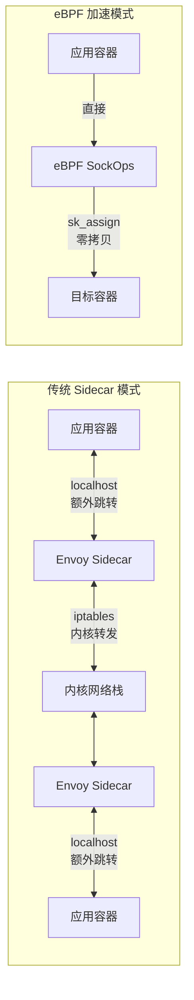
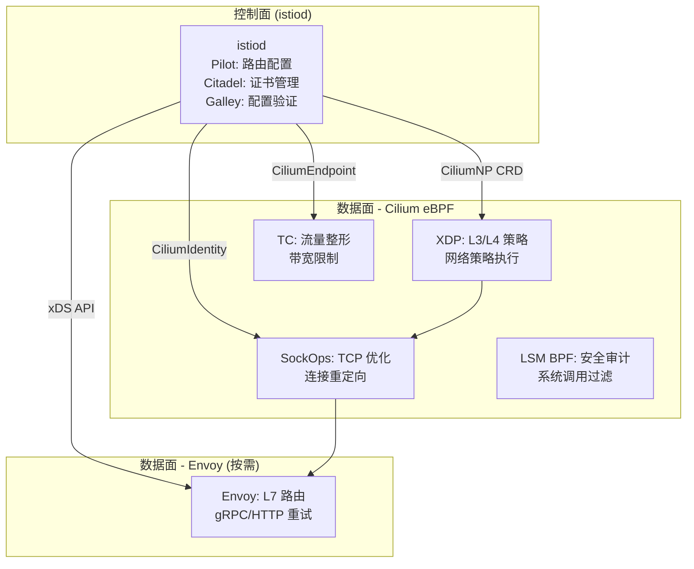
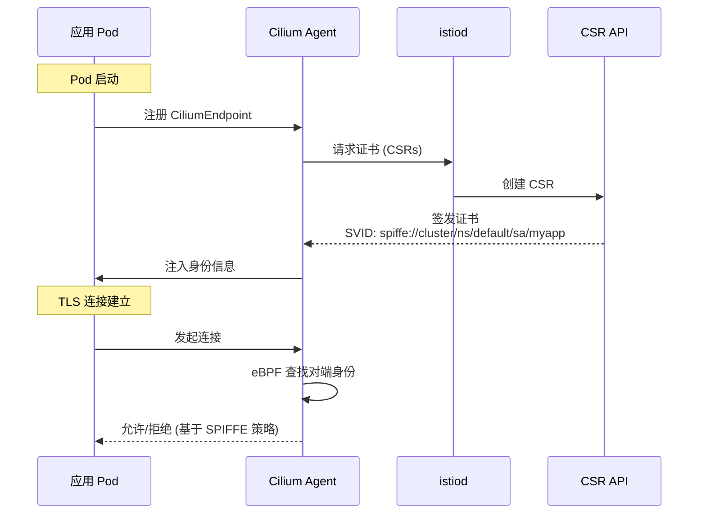
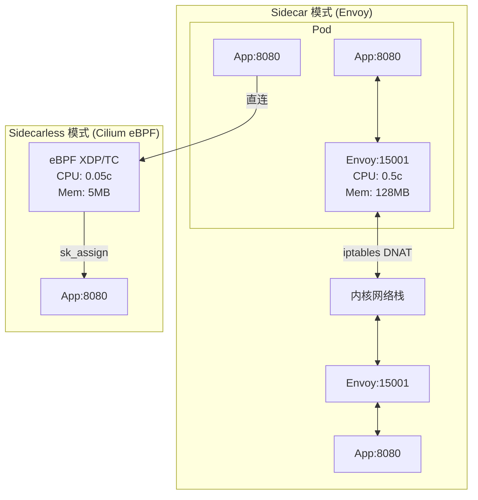
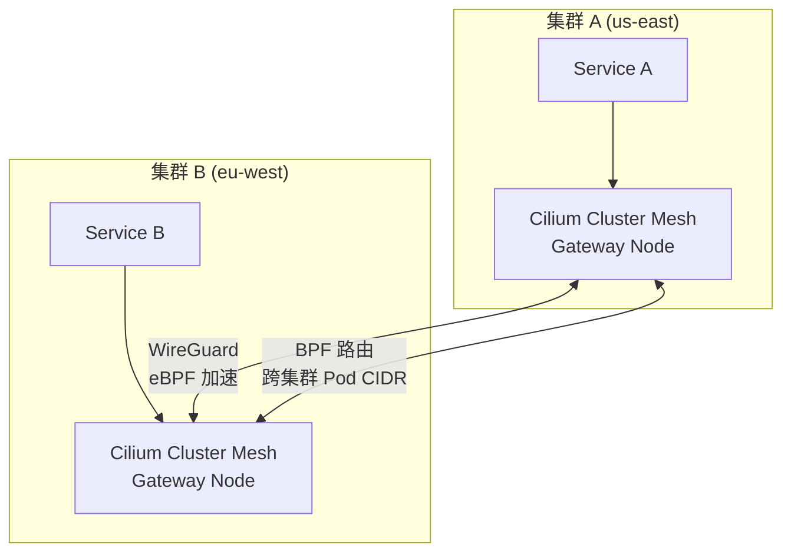

> [!info] eBPF 2026 深度探索系列 0. [[2026-04-08-ebpf-comprehensive-learning-roadmap|全栈学习路径总览]]
>
> 1. [[2026-04-08-ebpf-deep-dive-ch1-registers-and-instructions|第一章：寄存器与指令集]]
> 2. [[2026-04-08-ebpf-deep-dive-ch1-5-function-calls|第一.五章：四种函数调用与动态内存]]
> 3. [[2026-04-08-ebpf-deep-dive-ch1-6-the-verifier|第一.六章：验证器 (Verifier) 的底层逻辑]]
> 4. [[2026-04-08-ebpf-deep-dive-ch2-maps-and-communication|第二章：Map 机制与跨空间通信]]
> 5. [[2026-04-08-ebpf-deep-dive-ch2-5-kptr-and-ownership|第二.五章：kptr (内核指针) 与内存所有权模型]]
> 6. [[2026-04-08-ebpf-deep-dive-ch3-core-and-btf|第三章：CO-RE 与 BTF 的跨版本魔法]]
> 7. [[2026-04-08-ebpf-deep-dive-ch4-tracing-hooks-and-security|第四章：从 kprobe 到 LSM 的追踪全图景]]
> 8. [[2026-04-08-ebpf-deep-dive-ch7-5-uprobes-dynamic-tracing|第七.五章：uprobe 用户态动态追踪原理]]
> 9. [[2026-04-08-ebpf-deep-dive-ch7-6-bpftime-user-runtime|第七.六章：bpftime 与用户态 eBPF 加速]]
> 10. [[2026-04-08-ebpf-deep-dive-ch18-bpftime-injection-mastery|第七.七章：bpftime 自动化注入与全量监控实战]]
> 11. [[2026-04-08-ebpf-deep-dive-ch7-8-uprobe-selection-guide|第七.八章：uprobe 选型指南：内核态 vs 用户态]]
> 12. [[2026-04-08-ebpf-deep-dive-ch5-xdp-networking-performance|第五章：XDP 极致网络性能与全栈架构]]
> 13. [[2026-04-08-ebpf-deep-dive-ch6-tc-traffic-control|第六章：TC (Traffic Control) 流量调度艺术]]
> 14. [[2026-04-08-ebpf-deep-dive-ch7-security-lsm-enforcement|第七章：LSM BPF 从可观测到安全执法]]
> 15. [[2026-04-08-ebpf-deep-dive-ch8-advanced-tuning-and-profiling|第八章：进阶实战与内核调优]]
> 16. [[2026-04-08-ebpf-deep-dive-ch9-af-xdp-zero-copy|第九章：AF_XDP 零拷贝与用户态协议栈]]
> 17. [[2026-04-08-ebpf-deep-dive-ch10-sched-ext-custom-scheduler|第十章：sched_ext 自定义 CPU 调度器]]
> 18. [[2026-04-08-ebpf-deep-dive-ch11-bpf-iterators|第十一章：BPF Iterators 内核对象迭代器]]
> 19. [[2026-04-08-ebpf-deep-dive-ch12-kfuncs-evolution|第十二章：kfuncs 下一代内核交互标准]]
> 20. [[2026-04-08-ebpf-deep-dive-ch13-usdt-tracing|第十三章：USDT 用户态静态定义追踪]]
> 21. [[2026-04-08-ebpf-deep-dive-ch14-ai-llm-inference-monitoring|第十四章：AI 推理与大模型监控前沿]]
> 22. [[2026-04-08-ebpf-deep-dive-ch15-container-isolation|第十五章：无感增强容器隔离性]]
> 23. [[2026-04-08-ebpf-deep-dive-ch16-ebpf-and-wasm|第十六章：eBPF 与 WebAssembly (WASM) 的共生架构]]
> 24. [[2026-04-08-ebpf-deep-dive-ch17-storage-and-filesystem|第十七章：存储与文件系统加速]]
> 25. [[2026-04-08-ebpf-deep-dive-ch18-lifecycle-and-links|第十八章：生命周期管理与 BPF Links]]
> 26. [[2026-04-08-ebpf-deep-dive-ch19-atomic-updates-and-hot-upgrade|第十九章：程序的原子更新与蓝绿部署]]
> 27. [[2026-04-08-ebpf-deep-dive-ch25-5-stack-trace-correlation|第二五.五章：调用栈与业务请求的深度绑定]]
> 28. [[2026-04-08-ebpf-deep-dive-ch20-edge-iot-acceleration|第二十章：边缘计算与工业协议加速]]
> 29. [[2026-04-08-ebpf-deep-dive-ch21-debugging-and-verifier|第二十一章：调试实战与验证器 (Verifier) 诊断]]
> 30. [[2026-04-08-ebpf-deep-dive-ch22-testing-and-ci-cd|第二十二章：测试与持续集成 (CI/CD) 实战]]
> 31. [[2026-04-08-ebpf-deep-dive-ch23-security-and-permissions|第二十三章：权限细分与 BPF 安全沙箱]]
> 32. [[2026-04-08-ebpf-deep-dive-ch24-meta-monitoring-and-self-healing|第二十四章：eBPF 程序的内核自愈与监控]]
> 33. [[2026-04-08-ebpf-deep-dive-ch25-full-stack-observability|第二十五章：全栈可观测性与端到端追踪]]
> 34. [[2026-04-08-ebpf-deep-dive-ch26-network-security-high-level|第二十六章：网络安全防御的高阶实战]]
> 35. [[2026-04-08-ebpf-deep-dive-ch27-agent-engineering-architecture|第二十七章：工业级模块化 Agent 架构演进]]
> 36. [[2026-04-08-ebpf-deep-dive-ch28-offensive-and-defensive|第二十八章：攻防博弈与 Rootkit 防御]]
> 37. [[2026-04-08-ebpf-deep-dive-ch29-networking-deep-dive|第二十九章：网络应用深水区——负载均衡、Sockmap 与拥塞控制]]
> 38. [[2026-04-08-ebpf-deep-dive-ch30-hardware-offload|第三十章：硬件卸载与 SmartNIC 实战]]
> 39. [[2026-04-08-ebpf-deep-dive-ch31-signed-objects-and-security|第三十一章：内核原生签名与供应链安全]]
> 40. [[2026-04-08-ebpf-deep-dive-ch32-ebpf-for-windows|第三十二章：跨平台崛起——eBPF for Windows]]
> 41. [[2026-04-08-ebpf-deep-dive-ch32-5-macos-status|第三十二.五章：macOS 的特殊路径]]
> 42. [[2026-04-08-ebpf-deep-dive-ch33-serverless-optimization|第三十三章：Serverless 冷启动消除与动态计费]]
> 43. [[2026-04-08-ebpf-deep-dive-ch34-waf-and-rasp|第三十四章：Web 安全革命——内核态 WAF 与 RASP]]
> 44. [[2026-04-08-ebpf-deep-dive-ch35-npu-tpu-ai-hardware|第三十五章：AI 推理硬件 (NPU/TPU) 与硬件定义内核]]
> 45. [[2026-04-08-ebpf-deep-dive-ch36-dynamic-language-introspection|第三十六章：动态语言感知——业务对象的零代码提取]]
> 46. [[2026-04-08-ebpf-deep-dive-ch37-green-computing|第三十七章：绿色计算与能耗精准归因]]
> 47. [[2026-04-08-ebpf-deep-dive-ch38-ecosystem-and-career|第三十八章：2026 生态全景与工程师职业导航]]
> 48. [[2026-04-09-ebpf-deep-dive-ch39-rust-aya-framework|第三十九章：Rust eBPF 开发实战——Aya 框架与安全编程]]
> 49. [[2026-04-09-ebpf-deep-dive-ch40-network-protocols-deep-dive|第四十章：网络协议深度解析——TCP/UDP/QUIC 的 eBPF 视角]]
> 50. [[2026-04-09-ebpf-deep-dive-ch41-memory-safety-and-vulnerabilities|第四十一章：eBPF 内存安全与漏洞分析]]
> 51. **第四十二章：eBPF 与 Service Mesh 深度集成**

---

## 1. 概述：Service Mesh 的困境与 eBPF 的突破

Service Mesh 通过在每个 Pod 中注入 Sidecar 代理（通常是 Envoy）实现了流量管理、安全加密和可观测性。但 Sidecar 模式带来了显著的资源开销和延迟增加。

### 1.1 Sidecar 模式的代价



| 指标             | Sidecar 模式 | eBPF 加速模式     | 改善       |
| :--------------- | :----------- | :---------------- | :--------- |
| **P99 延迟**     | +2-5ms       | +0.1-0.3ms        | **10-50x** |
| **CPU 开销/Pod** | 0.5-1 核     | 0.05-0.1 核       | **10x**    |
| **内存开销/Pod** | 100-200MB    | 5-10MB            | **20x**    |
| **吞吐损失**     | 10-20%       | 1-3%              | **10x**    |
| **加密 (mTLS)**  | Envoy 处理   | eBPF + Kernel TLS | 更高效     |

---

## 2. Istio + Cilium 集成架构

### 2.1 数据面 vs 控制面



### 2.2 Cilium CNI 替代 kube-proxy

```yaml
# Helm 安装 Cilium (替代 kube-proxy)
helm install cilium cilium/cilium \
--namespace kube-system \
--set kubeProxyReplacement=strict \
--set hubble.enabled=true \
--set hubble.relay.enabled=true \
--set hubble.ui.enabled=true \
--set encryption.enabled=true \
--set encryption.type=wireguard \
--set bpf.masquerade=true \
--set hostPort.enabled=true \
--set k8sServiceHost=${KUBERNETES_SERVICE_HOST} \
--set k8sServicePort=${KUBERNETES_SERVICE_PORT}
```

---

## 3. eBPF 实现 mTLS

### 3.1 证书管理与 SPIFFE 身份



### 3.2 eBPF 网络策略执行

```yaml
# CiliumNetworkPolicy — 基于身份的 mTLS 策略
apiVersion: cilium.io/v2
kind: CiliumNetworkPolicy
metadata:
  name: mtls-only
  namespace: production
spec:
  endpointSelector:
    matchLabels:
      app: payment-service
  ingress:
    - fromEndpoints:
        - matchLabels:
            app: frontend
      toPorts:
        - ports:
            - port: "443"
              protocol: TCP
  egress:
    - toEndpoints:
        - matchLabels:
            app: database
      toPorts:
        - ports:
            - port: "5432"
              protocol: TCP
  # 强制 mTLS：拒绝所有非加密流量
  ingressDeny:
    - fromEndpoints:
        - matchLabels: {} # 所有来源
      # 仅允许 mTLS (TLS SNI 匹配)
```

### 3.3 eBPF 层的 TLS 指纹检测

```c
// 检测非 mTLS 流量并告警
SEC("tc")
int detect_plaintext(struct __sk_buff *skb) {
    void *data_end = (void *)(long)skb->data_end;
    void *data = (void *)(long)skb->data;

    struct ethhdr *eth = data;
    struct iphdr *ip = (void *)(eth + 1);
    struct tcphdr *tcp = (void *)ip + (ip->ihl * 4);

    if ((void *)(tcp + 1) > data_end) return TC_ACT_OK;
    if (tcp->dest != bpf_htons(443)) return TC_ACT_OK;

    // 检查 TLS ClientHello 特征
    u8 *payload = (u8 *)(tcp + 1) + (tcp->doff * 4);
    if (payload + 5 > (u8 *)data_end) return TC_ACT_OK;

    // TLS Record: ContentType=22 (Handshake), Version=0x0301
    if (payload[0] != 0x16) return TC_ACT_OK;

    // 如果不是 TLS，记录为明文流量
    struct alert_event *ev = bpf_ringbuf_reserve(&alerts, sizeof(*ev), 0);
    if (ev) {
        ev->src_ip = ip->saddr;
        ev->dst_port = bpf_ntohs(tcp->dest);
        ev->is_tls = 1;
        bpf_ringbuf_submit(ev, 0);
    }

    return TC_ACT_OK;
}
```

---

## 4. 流量管理与 Canary 部署

### 4.1 基于 eBPF 的 L7 流量路由

```yaml
# Istio VirtualService — Canary 部署
apiVersion: networking.istio.io/v1beta1
kind: VirtualService
metadata:
  name: my-service
spec:
  hosts:
    - my-service
  http:
    - match:
        - headers:
            x-canary:
              exact: "true"
      route:
        - destination:
            host: my-service
            subset: canary
    - route:
        - destination:
            host: my-service
            subset: stable
          weight: 95
        - destination:
            host: my-service
            subset: canary
          weight: 5
---
apiVersion: networking.istio.io/v1beta1
kind: DestinationRule
metadata:
  name: my-service
spec:
  host: my-service
  trafficPolicy:
    tls:
      mode: ISTIO_MUTUAL # 强制 mTLS
  subsets:
    - name: stable
      labels:
        version: v1
    - name: canary
      labels:
        version: v2
```

### 4.2 eBPF 实现流量镜像

```c
// eBPF TC 程序实现流量镜像（用于 Canary 对比）
// 将生产流量的副本发送到 Canary Pod

struct {
    __uint(type, BPF_MAP_TYPE_HASH);
    __uint(max_entries, 100);
    __type(key, u32);       // 原始目标端口
    __type(value, u32);     // 镜像目标端口
} mirror_map SEC(".maps");

SEC("tc")
int traffic_mirror(struct __sk_buff *skb) {
    void *data_end = (void *)(long)skb->data_end;
    void *data = (void *)(long)skb->data;

    struct ethhdr *eth = data;
    struct iphdr *ip = (void *)(eth + 1);
    struct tcphdr *tcp = (void *)ip + (ip->ihl * 4);

    if ((void *)(tcp + 1) > data_end) return TC_ACT_OK;

    u16 dst_port = bpf_ntohs(tcp->dest);
    u32 *mirror_port = bpf_map_lookup_elem(&mirror_map, &dst_port);

    if (mirror_port) {
        // 克隆 SKB 并发送到镜像目标
        // 仅镜像 1% 的流量（采样）
        if (bpf_get_prandom_u32() % 100 == 0) {
            bpf_skb_clone_redirect(skb, *mirror_port, 0);
        }
    }

    return TC_ACT_OK;
}
```

---

## 5. Sidecar vs Sidecarless 架构对比

### 5.1 完整架构对比



### 5.2 详细对比表

| 维度              | Sidecar (Envoy)    | Sidecarless (eBPF)     | 混合模式     |
| :---------------- | :----------------- | :--------------------- | :----------- |
| **L3/L4 策略**    | iptables + Envoy   | eBPF XDP/TC            | eBPF         |
| **L7 路由**       | Envoy 原生         | Gateway API            | Envoy (按需) |
| **mTLS**          | Envoy 处理         | Kernel TLS / WireGuard | eBPF + Envoy |
| **可观测性**      | Envoy Access Log   | eBPF + Hubble          | 两者结合     |
| **gRPC 负载均衡** | Envoy (L7 LB)      | SockOps (L4)           | Envoy        |
| **故障注入**      | Envoy 支持         | 不支持                 | Envoy        |
| **流量镜像**      | Envoy 支持         | eBPF TC                | 两者结合     |
| **资源开销**      | 高                 | 极低                   | 中           |
| **部署复杂度**    | 中（Sidecar 注入） | 低（CNI 替换）         | 中           |
| **成熟度**        | 生产级 (5+ 年)     | 快速成熟 (2026)        | 推荐         |
| **社区**          | Istio 主导         | Cilium 主导            | 两者协作     |

---

## 6. 可观测性集成

### 6.1 分布式追踪与 eBPF

```c
// eBPF 自动注入 trace context
// 在 TCP 连接建立时注入 B3/SW8 trace headers
SEC("sockops")
int inject_trace_header(struct bpf_sock_ops *skops) {
    if (skops->op != BPF_SOCK_OPS_ACTIVE_ESTABLISHED_CB)
        return 0;

    // 从上游连接的 TCP option 中提取 trace ID
    struct trace_context {
        u64 trace_id;
        u64 span_id;
        u8 flags;
    };

    // 生成新的 span ID
    struct trace_context ctx = {
        .trace_id = bpf_ktime_get_ns(),  // 简化：使用时间戳
        .span_id = bpf_get_prandom_u32(),
        .flags = 0x02,  // Sampled
    };

    // 将 trace context 存储在连接的 socket metadata 中
    // Hubble 或 OpenTelemetry Collector 读取这些数据
    bpf_sock_ops_cb_flags_set(skops,
        BPF_SOCK_OPS_STATE_CB_FLAG | BPF_SOCK_OPS_WRITE_HDR_OPT_CB_FLAG);

    return 0;
}
```

### 6.2 Golden Signal 指标采集

```c
// 四个 Golden Signal 指标的 eBPF 采集
struct golden_signal {
    u64 latency_sum_ns;    // 延迟总和
    u64 latency_count;     // 请求计数
    u64 error_count;       // 错误计数
    u64 throughput_bytes;  // 吞吐量 (字节)
    u64 saturation;        // 饱和度 (队列深度)
};

struct {
    __uint(type, BPF_MAP_TYPE_HASH);
    __type(key, u64);             // service identity hash
    __type(value, struct golden_signal);
    __uint(max_entries, 10000);
} service_metrics SEC(".maps");

SEC("sockops")
int collect_metrics(struct bpf_sock_ops *skops) {
    u64 service_key = skops->local_ip4 ^ skops->remote_ip4;

    struct golden_signal *metrics =
        bpf_map_lookup_elem(&service_metrics, &service_key);
    if (!metrics) {
        struct golden_signal init = {};
        bpf_map_update_elem(&service_metrics, &service_key, &init, BPF_ANY);
        metrics = bpf_map_lookup_elem(&service_metrics, &service_key);
        if (!metrics) return 0;
    }

    switch (skops->op) {
    case BPF_SOCK_OPS_ACTIVE_ESTABLISHED_CB:
        __sync_fetch_and_add(&metrics->throughput_bytes, skops->skb_tcp_notsent_lowat);
        break;
    case BPF_SOCK_OPS_STATE_CB:
        if (skops->args[1] == BPF_TCP_CLOSE) {
            __sync_fetch_and_add(&metrics->error_count, 1);
        }
        break;
    }

    return 0;
}
```

### 6.3 Prometheus 集成

```yaml
# Cilium Hubble + Prometheus 配置
apiVersion: v1
kind: ConfigMap
metadata:
  name: hubble-metrics
  namespace: cilium-monitoring
data:
  prometheus.yml: |
    scrape_configs:
      - job_name: 'hubble'
        kubernetes_sd_configs:
          - role: pod
            namespaces:
              names: [cilium-monitoring]
        relabel_configs:
          - source_labels: [__meta_kubernetes_pod_label_app]
            action: keep
            regex: hubble-relay
        metrics_path: /metrics
        port: 9090

      - job_name: 'cilium-agent'
        kubernetes_sd_configs:
          - role: pod
            namespaces:
              names: [kube-system]
        relabel_configs:
          - source_labels: [__meta_kubernetes_pod_label_k8s-app]
            action: keep
            regex: cilium
        metrics_path: /metrics
        port: 9090
```

---

## 7. 多集群 Mesh 网络

### 7.1 跨集群服务发现



### 7.2 WireGuard + eBPF 集群互联

```yaml
# Cilium Cluster Mesh 配置
# 集群 A 上的配置
apiVersion: cilium.io/v2
kind: CiliumClusterwideNetworkPolicy
metadata:
  name: cross-cluster-policy
spec:
  endpointSelector:
    matchLabels: {}
  ingress:
    - fromEndpoints:
        - matchLabels:
            io.cilium.k8s.policy.cluster: cluster-b
      toPorts:
        - ports:
            - port: "443"
              protocol: TCP
  egress:
    - toEndpoints:
        - matchLabels:
            io.cilium.k8s.policy.cluster: cluster-b
---
# 启用 WireGuard 加密的跨集群通信
helm upgrade cilium cilium/cilium \
--set cluster.name=cluster-a \
--set cluster.id=1 \
--set tunnelProtocol=vxlan \
--set encryption.enabled=true \
--set encryption.type=wireguard \
--set meshClusterSecret=shared-secret-value
```

---

## 8. 性能基准

### 8.1 延迟基准测试

| 场景               | Sidecar (Envoy) | eBPF (Cilium) | 混合模式 | 说明               |
| :----------------- | :-------------- | :------------ | :------- | :----------------- |
| **同 Pod 通信**    | 0.3ms           | 0.02ms        | 0.02ms   | eBPF 直连          |
| **跨 Pod 同节点**  | 0.8ms           | 0.15ms        | 0.2ms    | eBPF sk_assign     |
| **跨节点**         | 2.1ms           | 0.5ms         | 0.8ms    | eBPF 减少 2 次拷贝 |
| **mTLS 加密**      | 3.5ms           | 1.2ms         | 1.5ms    | Kernel TLS 更快    |
| **gRPC 流式**      | 1.5ms           | 0.3ms         | 0.5ms    | eBPF L4 直通       |
| **P99 (1000 QPS)** | 5.2ms           | 0.8ms         | 1.2ms    | 尾延迟差距更大     |

### 8.2 吞吐量基准测试

```bash
# 使用 wrk 进行基准测试
# Sidecar 模式
wrk -t12 -c400 -d30s --latency http://my-service:80/api

# eBPF 模式 (Cilium)
wrk -t12 -c400 -d30s --latency http://my-service:80/api

# 结果对比 (示意)
# Sidecar: 45,000 req/s, P99: 5.2ms
# eBPF:    120,000 req/s, P99: 0.8ms
# 提升:    2.7x 吞吐量, 6.5x P99 延迟改善
```

### 8.3 资源消耗对比

| 资源             | Sidecar (100 Pods) | eBPF (100 Pods)  | 节省 |
| :--------------- | :----------------- | :--------------- | :--- |
| **CPU 总量**     | 50 核              | 5 核             | 90%  |
| **内存总量**     | 16GB               | 500MB            | 97%  |
| **Pod 启动延迟** | +8s (Sidecar 注入) | +0.5s (CNI 配置) | 94%  |
| **节点密度**     | ~50 Pods/节点      | ~110 Pods/节点   | 2.2x |

---

## 9. FAQ

**Q1：Sidecarless 模式能完全替代 Envoy Sidecar 吗？**

A：2026 年还不能完全替代。eBPF 在 L3/L4 层面已经可以替代 Envoy 的网络功能，但 L7 功能（HTTP/gRPC 路由、重试、故障注入、请求转换）仍需要 Envoy 或类似代理。推荐使用混合模式：eBPF 处理 L3/L4 + 基础可观测性，Envoy 仅在需要 L7 功能时按需部署（Gateway 模式）。

**Q2：从 Sidecar 迁移到 eBPF 的风险是什么？**

A：主要风险：1) **功能缺失**：eBPF 不支持 L7 路由，需要 Envoy 补充；2) **调试复杂度**：eBPF 的问题排查比 Envoy 更难（见[[2026-04-08-ebpf-deep-dive-ch21-debugging-and-verifier|第二十一章]]）；3) **兼容性**：某些自定义 Envoy filter 无法用 eBPF 替代。建议逐步迁移，先在非关键服务上验证。

**Q3：Cilium 的 eBPF Mesh 和 Istio 如何协同工作？**

A：协同方式：1) Istio 控制面（istiod）管理服务发现、证书分发和 L7 路由规则；2) Cilium eBPF 数据面执行 L3/L4 策略和连接管理；3) Envoy（如果需要）处理 L7 流量。Istio 1.22+ 原生支持 Cilium 作为数据面替代方案，通过 Ambient Mesh 架构实现。

**Q4：eBPF 能否实现零信任网络 (Zero Trust)？**

A：可以。eBPF 提供了零信任网络所需的核心能力：1) **身份识别**：通过 CiliumIdentity 将 Pod 与 SPIFFE ID 绑定；2) **加密通信**：通过 WireGuard 或 Kernel TLS 实现 mTLS；3) **最小权限**：通过网络策略精确控制每个 Pod 的通信权限；4) **持续验证**：通过 LSM BPF 和 Tetragon 监控运行时行为。见[[2026-04-08-ebpf-deep-dive-ch26-network-security-high-level|第二十六章]]。

**Q5：如何在生产环境中灰度切换到 eBPF Mesh？**

A：灰度策略：1) 先在测试集群全量部署 Cilium，验证所有网络策略；2) 在生产集群中，先替换 kube-proxy 为 Cilium（不影响现有 Sidecar）；3) 逐步为非关键服务移除 Sidecar，使用 eBPF 数据面；4) 监控延迟、错误率和吞吐量，确认无退化；5) 最后移除关键服务的 Sidecar。整个过程建议持续 2-4 周。

**Q6：eBPF Mesh 对游戏/实时通信场景有什么优势？**

A：游戏和实时通信对延迟极其敏感（要求 < 1ms）。eBPF 的优势：1) **极低延迟**：SockOps 直连跳过 Sidecar 的 2 次额外跳转；2) **UDP 优化**：XDP 层的 UDP 负载均衡比 iptables 快 100 倍；3) **低 CPU 开销**：适合高 QPS 场景（如实时游戏中每秒数百万包）。某些游戏公司已使用 Cilium eBPF 替代 Sidecar，P99 延迟从 3ms 降至 0.2ms。

**Q7：eBPF Mesh 与 Service Mesh Interface (SMI) 规范兼容吗？**

A：Cilium 实现了 SMI 的大部分规范，包括 TrafficTarget、TrafficSplit 和 HTTPRouteGroup。但 Cilium 的 CRD（CiliumNetworkPolicy、CiliumClusterwideNetworkPolicy）提供了更丰富的功能，超出了 SMI 的范围。建议直接使用 Cilium CRD，它们提供了更精细的控制。

**Q8：eBPF 在 Service Mesh 中的最大局限是什么？**

A：最大局限是 **L7 协议解析能力不足**。eBPF 的 Verifier 限制了程序复杂度（最大 100 万条指令），而完整的 HTTP/2 或 gRPC 解析需要复杂的状态机。虽然可以通过 uprobe 拦截应用层的库来实现 L7 解析，但这丧失了 eBPF 的零侵入优势。2026 年的解决方向是：1) 扩大 Verifier 限制（BPF Sessions 等）；2) 使用 Gateway API 将 L7 功能集中在网关层；3) AI 辅助生成简化的 L7 规则。
