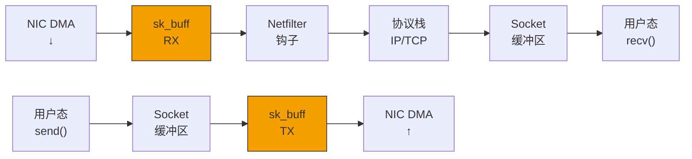
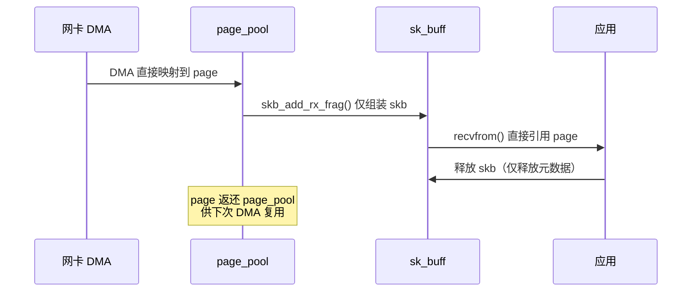
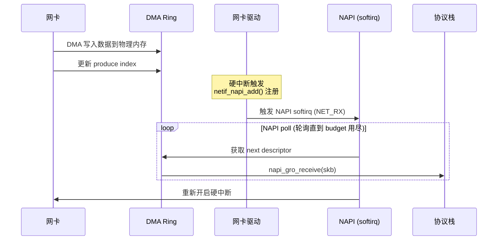
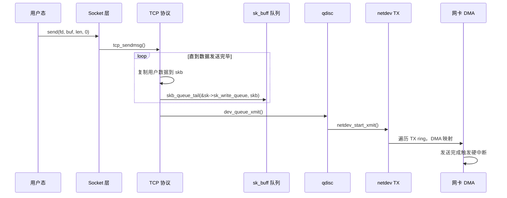

> [!info] Kernel Protocol Stack 深度探索系列 0. [[2026-04-13-kernel-protocol-stack-deep-dive-series-index|全栈学习路径总览]]
>
> 1. **第一章：sk_buff 与数据包生命周期**
> 2. [[2026-04-13-kernel-protocol-stack-deep-dive-ch2-netdevice|第二章：Netdevice 与网卡抽象]]

---

## 1. 概述：为什么 sk_buff 是内核网络栈的核心？

在 Linux 内核网络协议栈中，**sk_buff**（socket buffer）是贯穿始终的核心数据结构。从网卡驱动接收数据包的第一刻起，到传递给应用程序的 socket 缓冲区，每一个字节的网络数据都封装在一个 sk_buff 中流转于各协议层之间。

**理解 sk_buff 之所以重要，有三个原因：**

1. **性能关键路径**：sk_buff 的分配、释放、克隆操作是网络数据路径上最频繁的内存操作。优化 sk_buff 开销是提升网络吞吐量的核心手段。
2. **零拷贝基础**：从内核到用户态的数据传递效率，直接取决于 sk_buff 的引用计数和内存共享机制。
3. **协议无关设计**：同一套 sk_buff 操作接口服务于从 Ethernet 到 TCP 的所有协议，理解其设计有助于理解整个网络栈的抽象。



---

## 2. sk_buff 结构设计：Head-Body 分离

### 2.1 核心数据结构

sk_buff 的设计遵循 **Head-Body 分离** 哲学——将元数据（metadata）和实际数据分开存储，通过指针偏移访问各层协议头部：

```c
// include/linux/skbuff.h
struct sk_buff {
    /* --- 重要成员，按访问频率排列 --- */

    /* 1. 热路径成员（Cache 行对齐） */
    unsigned short      len;           /* 数据长度 */
    unsigned int        data_len;      /* non-linear 区域长度 */
    __u32               hash;          /* flow hash，用于 RSS/rps */
    enum skb_free_reason free_reason;  /* 释放原因（调试） */

    /* 2. 指针家族（指向数据区域） */
    unsigned char       *head;         /* 分配起始 */
    unsigned char       *data;         /* 有效数据起始 */
    unsigned char       *tail;         /* 有效数据结束 */
    unsigned char       *end;          /* 分配结束 */

    /* 3. 各层协议头指针（懒计算，按需设置） */
    struct ethhdr       *ethernet;
    struct iphdr        *ip_hdr;
    struct ipv6hdr      *ipv6_hdr;
    struct tcphdr       *tcp_hdr;
    struct udphdr       *udp_hdr;

    /* 4. 网络层信息 */
    struct sock         *sk;            /* 关联的 sock（TX 时设置） */
    struct net_device   *dev;          /* 关联的 net_device */
    __be16              protocol;      /* Ethernet 协议类型 */
    u8                  ip_summed;     /* checksum 状态 */

    /* 5. 时间戳与标记 */
    ktime_t             tstamp;         /* 接收/发送时间 */
    u64                 skb_mstamp_ns; /* 微秒时间戳（jiffies 替代） */

    /* 6. 分片信息 */
    struct sk_buff      *next;         /* frag_list 链表 */
    struct sk_buff      *prev;
    struct skb_shared_hwtstamps *hwtstamps;

    /* 7. 引用计数与克隆 */
    atomic_t            users;          /* 引用计数，析构依据 */

    /* 8. GRO 相关 */
    unsigned int        gro_max_size;
    unsigned int        gro_count;

    /* ... 200+ 行其他字段 ... */
};
```

### 2.2 Head-Body 内存布局

```
┌─────────────────────────────────────────────────────────────┐
│                    sk_buff 内存布局                         │
├─────────────────────────────────────────────────────────────┤
│                                                             │
│  head              data            tail           end       │
│    │                 │               │              │       │
│    ▼                 ▼               ▼              ▼       │
│ ┌──────┬────────────────────────────────────────────────┐    │
│ │      │  L2 Header │ L3 Header | L4 Header | Payload  │    │
│ │ 线性区域      │          │          │                   │    │
│ └──────┴────────────────────────────────────────────────┘    │
│                    ▲                                          │
│                    │                                         │
│            mac_header / network_header / transport_header    │
│                                                             │
├─────────────────────────────────────────────────────────────┤
│  frag_list: 非线性区域（分片包）                              │
│  ┌────────┐  ┌────────┐  ┌────────┐                        │
│  │ frag 0 │->│ frag 1 │->│ frag 2 │-> NULL                  │
│  └────────┘  └────────┘  └────────┘                        │
└─────────────────────────────────────────────────────────────┘
```

**关键设计决策：**

| 特性              | 说明           | 优势                              |
| ----------------- | -------------- | --------------------------------- |
| `head/end`        | 缓冲区边界指针 | 预分配整个区域，避免动态扩展      |
| `data/tail`       | 有效数据边界   | 支持在头部/尾部增长数据           |
| `skb_shared_info` | 紧跟 end 之后  | 存储 frags[]、gso_size 等分片信息 |
| `users` 原子计数  | 引用计数       | 支持克隆、零拷贝共享              |

### 2.3 各层头指针懒计算

```c
// 网络层头指针设置（按需计算，避免不必要的解析）
static inline void iph = ip_hdr(skb);     // skb->data 偏移 L2 头
static inline void tcph = tcp_hdr(skb);   // skb->data 偏移 L2+L3 头
static inline void udph = udp_hdr(skb);   // skb->data 偏移 L2+L3 头

// 这些宏实际是内联函数，包含边界检查
#define ip_hdr(skb)   ((struct iphdr *)(skb->data + (skb)->mac_header))
```

---

## 3. sk_buff 分配与释放

### 3.1 分配路径

内核提供多种 sk_buff 分配方式，针对不同场景：

```c
// 1. 标准分配（推荐用于 RX 路径）
struct sk_buff *alloc_skb(unsigned int size, gfp_t priority);
struct sk_buff *netdev_alloc_skb(struct net_device *dev, unsigned int length);

// 2. NAPI 友好分配（带 GRO 预留空间）
struct sk_buff *napi_alloc_skb(struct napi_struct *napi, unsigned int len);

// 3. page_pool 返还（RX 路径优化）
void skb_add_rx_frag(struct sk_buff *skb, int i, struct page *page,
                     int off, int size);
```

**alloc_skb 内部流程：**

```c
struct sk_buff *alloc_skb(unsigned int size, gfp_t priority)
{
    struct sk_buff *skb;

    // 1. 分配 sk_buff 结构体本身（SLAB 可回收）
    skb = kmem_cache_alloc(skbuff_head_cache, priority);
    if (!skb)
        return NULL;

    // 2. 分配 data 缓冲区（size 包括 headroom）
    unsigned int overhead = SKB_DATA_ALIGN(size);
    skb->data = __netdev_alloc_skb(dev, overhead, priority);

    // 3. 初始化指针
    skb->head = skb->data;
    skb->data = skb->head + NET_SKB_PAD;  // 预留 headroom
    skb->tail = skb->data;
    skb->end  = skb->head + overhead;

    // 4. 初始化引用计数 = 1
    atomic_set(&skb->users, 1);

    // 5. 初始化 list 指针
    skb->next = skb->prev = NULL;

    return skb;
}
```

**关键参数：**

```c
#define NET_SKB_PAD     16   // L2 头对齐，通常足够承载 Ethernet + VLAN + L2 tunnel
#define SKB_DATA_ALIGN(x)  (((x) + (SMP_CACHE_BYTES - 1)) & ~(SMP_CACHE_BYTES - 1))
#define SMP_CACHE_BYTES    64  // L1 cache line 对齐
```

### 3.2 释放路径与 free_reason

```c
void kfree_skb(struct sk_buff *skb);
void consume_skb(struct sk_buff *skb);   // 统计计入 "Consumed" 而非 "Dropped"

enum skb_free_reason {
    SKB_REASON_DROPPED,       // 被 netif_rx 丢弃
    SKB_REASON_CONSUMED,      // 被应用正确消费
    SKB_REASON_PKT_PROCESSED, // 处理完成
    SKB_REASON_OWNER,         // 引用归零被 owner 释放
    // ... 更多原因
};
```

**释放流程：**

```c
void kfree_skb(struct sk_buff *skb)
{
    if (atomic_dec_and_test(&skb->users)) {
        // 引用计数归零，执行实际释放
        __kfree_skb(skb);
    }
}

void __kfree_skb(struct sk_buff *skb)
{
    // 1. 调用析构钩子（如有，如 frag 回收）
    if (skb->destructor)
        skb->destructor(skb);

    // 2. 释放 data 缓冲区（回 page_pool 或 kfree）
    skb_release_data(skb);

    // 3. 释放 sk_buff 结构体（SLAB 回收）
    kmem_cache_free(skbuff_head_cache, skb);
}
```

### 3.3 page_pool 优化：RX 路径零分配

现代内核网卡的 RX 路径通过 **page_pool** 实现零分配：



**page_pool 核心参数：**

```c
struct page_pool_params {
    unsigned int    flags;          // PP_FLAG_PAGE_FRAG, PP_FLAG_DMA_MAP
    unsigned int    order;          // 页面阶（0=4KB, 1=64KB HugePage）
    unsigned int    pool_size;      // 池大小（1024-4096）
    int             nid;            // NUMA 节点
    struct device   *dev;           // DMA 映射设备
    enum dma_data_direction dma_dir; // DMA direction
};
```

---

## 4. sk_buff 克隆与分片

### 4.1 克隆（skb_clone）

克隆用于**需要修改 sk_buff 但不修改数据**的场景，例如：QoS 队列复制、多播复制、Conntrack 预连接。

```c
// 克隆：共享 data，复制 sk_buff 头部
struct sk_buff *skb_clone(struct sk_buff *skb, gfp_t priority);

// 内部实现
struct sk_buff *skb_clone(struct sk_buff *skb, gfp_t priority)
{
    struct sk_buff *n;

    // 1. 从 SLAB 分配新的 sk_buff 头
    n = kmem_cache_alloc(skbuff_head_cache, priority);
    if (!n)
        return NULL;

    // 2. 浅拷贝所有字段
    memcpy(n, skb, sizeof(*skb));

    // 3. 关键：data 指针共享，仅 users++
    atomic_inc(&skb_shinfo(skb)->dataref);  // data 引用++
    atomic_set(&n->users, 1);               // 新 skb 引用 = 1

    // 4. 清除可能指向全局状态的指针
    n->sk = NULL;        // 克隆不继承 sock 引用！
    n->destructor = NULL;

    return n;
}
```

```
原始 skb                  克隆 skb
┌─────────────────┐       ┌─────────────────┐
│ skb->head ──────┼──────►│ skb->head ──────┼──┐
│ skb->data       │       │ skb->data       │  │
│ skb->tail       │       │ skb->tail       │  ▼
│ skb->len = 100  │       │ skb->len = 100  │  [共享 data 区域]
│ users = 2       │       │ users = 1       │
└─────────────────┘       └─────────────────┘
        ▲                                 │
        │ data 引用计数 = 2                │
        └─────────────────────────────────┘
```

### 4.2 分片（skb_fragment）

分片用于**需要修改数据**的场景，例如：TCP 分片、隧道封装、Tunnel decapsulation。

```c
// 复制一份完整的数据副本
struct sk_buff *skb_copy(const struct sk_buff *skb, gfp_t priority);

// 带 headroom 扩展的复制（用于在头部添加协议头）
struct sk_buff *skb_copy_expand(const struct sk_buff *skb,
                                 int newheadroom, int newtailroom,
                                 gfp_t priority);
```

**skb_copy_expand 典型用途：**

```c
// 在 L3 头前添加 GRE 头
struct sk_buff *encap_skb(struct sk_buff *skb)
{
    struct sk_buff *new_skb;

    // 需要在头部预留 GRE 头空间（8-16 字节）
    new_skb = skb_copy_expand(skb,
                               LL_RESERVED_SPACE(dev) + GRE_HEADER_SIZE,
                               0,  // tailroom 足够
                               GFP_ATOMIC);
    if (!new_skb)
        return NULL;

    // 移动 data 指针，准备写入 GRE 头
    skb_push(new_skb, GRE_HEADER_SIZE);

    return new_skb;
}
```

### 4.3 分片链表（skb_frag / frag_list）

对于**GSO/TSO 超大包**，内核使用分片链表而非连续内存：

```c
struct skb_shared_info {
    unsigned short  gso_size;        // 分片大小（TSO 时为 MSS）
    unsigned short  gso_segs;        // 分段数量
    unsigned short  gso_type;        // GSO_TYPE_TCPV4 / GSO_TYPE_UDP
    struct sk_buff  *frag_list;      // 分片链表头
    skb_frag_t      frags[MAX_SKB_FRAGS];  // 线性分片（最多 17 个）
};

typedef struct {
    struct page     *page;
    unsigned int    page_offset;
    unsigned int    size;
} skb_frag_t;
```

```
skb (线性部分)          frag_list (非线性部分)
┌──────────────┐        ┌──────────────┐
│ TCP Header   │        │ Fragment 1   │
│ + Init Data  │  next  │ Fragment 2   │
└──────────────┘   →    │ Fragment 3   │
                        └──────────────┘

GSO 包 (64KB) = skb (16KB 线性) + frags (3 × 16KB)
```

---

## 5. 数据包接收路径：Ring → sk_buff

### 5.1 NAPI 轮询与 Ring Buffer

现代网卡使用 **Ring Buffer** 存储 DMA 描述符，sk_buff 在 RX 路径的典型流程：



### 5.2 驱动层示例：Intel i40e

```c
static int i40e_clean_rx_irq(struct i40e_ring *rx_ring, int budget)
{
    struct sk_buff *skb;
    unsigned int total_bytes = 0, total_packets = 0;

    while (total_packets < budget) {
        union i40e_rx_desc *desc;
        struct page *page;

        // 1. 获取下一个 descriptor
        desc = &rx_ring->desc[rx_ring->next_to_clean];

        // 2. 检查 DD (Descriptor Done) 标志
        if (!(desc->wb.status_error & cpu_to_le16(I40E_RXD_STAT_DD)))
            break;

        // 3. 构建 sk_buff（page_pool 模式）
        skb = napi_alloc_skb(&rx_ring->q_vector->napi,
                               rx_ring->netdev->mtu + ETH_HLEN);
        if (!skb) {
            rx_ring->rx_stats.alloc_fail++;
            break;
        }

        // 4. 映射 DMA 地址到 skb
        dma_sync_single_for_cpu(rx_ring->dev,
                                  le64_to_cpu(desc->read.pkt_addr),
                                  rx_ring->rx_buf_len,
                                  DMA_FROM_DEVICE);

        skb_put(skb, le16_to_cpu(desc->wb.qword1.pkt_len) & 0x7FFF);

        // 5. 设置协议类型
        skb->protocol = eth_type_trans(skb, rx_ring->netdev);

        // 6. 送入协议栈
        netif_receive_skb(skb);

        total_packets++;
        total_bytes += skb->len;
    }

    return total_packets;
}
```

### 5.3 GRO (Generic Receive Offload)

GRO 是 **软件层面的 packet coalescing**，在协议栈入口（netif_receive_skb）之前将多个同流小包合并为大包，减少协议栈处理开销：

```c
// gro_receive 入口
enum gro_result {
    GRO_MERGED,          // 合并到已有 gro_skb
    GRO_MERGED_FREE,    // 合并后释放
    GRO_HELD,           // 暂存等待更多分片
    GRO_NORMAL,         // 不符合 GRO，直接转发
    GRO_DROP,           // 丢弃
};

gro_result napi_gro_receive(struct napi_struct *napi, struct sk_buff *skb)
{
    skb_gro_reset_offset(skb);

    for (protocol = rcu_dereference(OFFLOAD_GRO_CB(skb)->prot_hook);
         protocol;
         protocol = next_hook) {
        // 调用注册的 gro_receive 回调
        pp = ptype->gro_receive(head, skb);
    }

    // GRO 合并结果处理
    return dev_gro_receive(napi, skb);
}
```

**GRO vs 非 GRO 性能对比（单连接 iperf）：**

| 场景     | 64B 小包 | 1400B MTU | 提升       |
| -------- | -------- | --------- | ---------- |
| 禁用 GRO | 380 Kpps | 320 Kpps  | 基准       |
| 启用 GRO | 520 Kpps | 335 Kpps  | +37% / +5% |

---

## 6. 数据包发送路径：sk_buff → Ring

### 6.1 send() 系统调用路径



### 6.2 tcp_sendmsg 关键代码

```c
int tcp_sendmsg(struct sock *sk, struct msghdr *msg, size_t size)
{
    struct tcp_sock *tp = tcp_sk(sk);
    int ret, copied = 0;

    while (copied < size) {
        struct sk_buff *skb;
        int copy, err;

        // 1. 检查是否可以 attach 到现有 skb（减少分片）
        skb = skb_peek_tail(&sk->sk_write_queue);
        if (skb && can_coalesce(skb, msg->msg_iov)) {
            copy = min_t(int, seglen, tp->snd_wnd);
            // 追加到 skb->tail
        } else {
            // 2. 需要分配新的 skb
            skb = alloc_skb_fclone(tp->mss_cache + MAX_TCP_HEADER,
                                    sk->sk_allocation);
            // 设置 IP/TCP 头
            skb_set_owner_w(skb, sk);
            skb_queue_tail(&sk->sk_write_queue, skb);
        }

        // 3. 从用户态复制数据
        copy = min_t(int, copy, size - copied);
        if (memcpy_from_msg(skb_put(skb, copy), msg, copy))
            goto out;

        copied += copy;
    }

out:
    // 4. 触发发送（如果没有 pending TX）
    if (copied && !tp->pending_data)
        tcp_push_pending_frames(sk);

    return copied;
}
```

### 6.3 qdisc 与 netdev 队列

```c
int dev_queue_xmit(struct sk_buff *skb)
{
    struct net_device *dev = skb->dev;
    struct Qdisc *q;
    int rc;

    // 1. 处理虚拟设备（veth、bridge）
    if (netif_is_bridge(skb->dev)) {
        return br_dev_queue_push_xmit(skb);
    }

    // 2. 获取 qdisc
    q = rcu_dereference_bh(dev->qdisc);

    // 3. 如果 qdisc 无锁，直接发送
    if (q->enqueue == dev_qdisc_put_ops &&
        spin_trylock(&q->busylock)) {
        rc = dev_qdisc_xmit(skb, q);
        spin_unlock(&q->busylock);
        return rc;
    }

    // 4. 入队（可能触发 backlog）
    return q->enqueue(skb, q, &to_free) & NET_XMIT_MASK;
}
```

---

## 7. sk_buff 内存布局与 Cache 优化

### 7.1 内存布局参数

```c
// include/linux/skbuff.h
enum {
    NET_SKB_PAD     = 16,           // headroom 最小值（Cache 对齐）
    NET_IP_ALIGN    = 0,            // L2 头对齐（2.6.14 后多为 0）
    HL柔阵楚        = 16,           // headroom 典型值
    SKB_DATA_ALIGN(x) = (((x) + SMP_CACHE_BYTES - 1) & ~(SMP_CACHE_BYTES - 1)),
};
```

**典型 RX sk_buff 布局：**

```
Offset 0:  struct sk_buff           (576 bytes on 64-bit)
Offset 576: struct skb_shared_info   (取决于 frags/max 17)
           ─────────────────────────  ← 64-byte aligned
           struct ethhdr + skb->data
           ─────────────────────────
Offset 576+size: skb_shared_info 末尾

实际 data 区域:
Offset 592 (NET_SKB_PAD=16): skb->head
Offset 608: skb->data (mac_header = 14)
Offset 622: skb->network_header (ip_hdr)
Offset 642: skb->transport_header (tcp_hdr)
```

### 7.2 Cache 行优化技巧

**避免 false sharing：**

```c
// 错误：多个 skb 的 users 在同一 cache line
struct sk_buff *skb1, *skb2;
// skb1->users 和 skb2->users 可能在同一 cache line
// 修改 skb1->users 会 invalidate skb2 所在 cache line

// 正确：kmem_cache 分配时自动对齐
skb = kmem_cache_alloc(skbuff_head_cache, GFP_ATOMIC);
// skbuff_head_cache 的对象已经按 cache line 对齐
```

**热数据分离：**

```c
// sk_buff 热路径成员（频繁访问）
unsigned short      len;           // 每次访问
unsigned char       *data;         // 每次访问

// 冷数据成员（不热路径）
struct dst_entry    *dst;          // 仅路由查找时
struct sec_path     *sp;           // 仅 IPSec 时

// 内核通过重组结构体，将热字段放在结构体开头（cache line 友好）
```

---

## 8. 调试与诊断

### 8.1 sk_buff 调试选项

```bash
# 启用 sk_buff 调试（会显著降低性能）
echo 1 > /proc/sys/net/core/netdev_debug
echo 1 > /proc/sys/net/core/skbuff_debug

# 查看分配失败统计
cat /proc/net/sockstat
cat /proc/net/rt_acct  # 路由缓存统计
```

### 8.2 使用 bpftrace 追踪

```bash
# 追踪 sk_buff 分配
bpftrace -e '
tracepoint:skb:skb_kfree_kmalloc {
    @["kfree"] = count();
    @by_reason[args->reason] = count();
}
tracepoint:skb:skb_kfree_skb {
    @["kfree_skb"] = count();
}
'

# 追踪分配延迟
bpftrace -e '
profile:hz:99 /pid == $1/ {
    @[ksym(stack)] = count();
}
' $(pgrep -f your_network_app)
```

### 8.3 ss 命令查看 socket 缓冲区

```bash
# 查看 TCP socket 的 skb 队列
ss -ti src 192.168.1.100

# 查看 receive buffer 积压
ss -antp | grep Recv-Q

# 查看 skb memory pressure
cat /proc/net/sockmem
```

---

## 9. 总结

sk_buff 是 Linux 内核网络栈最核心的数据结构，其设计体现了几个关键权衡：

| 设计决策       | 权衡           | 实际效果                               |
| -------------- | -------------- | -------------------------------------- |
| Head-Body 分离 | 灵活 vs 简单   | 支持各层协议头指针，修改数据需完整复制 |
| 引用计数       | 共享 vs 独立   | 克隆开销低，但析构需原子操作           |
| page_pool      | 零分配 vs 复杂 | RX 路径零分配，TX 仍需分配             |
| GRO            | 吞吐 vs 延迟   | 合并小包提升吞吐，增加单包延迟         |

**下一章预告：** [[2026-04-13-kernel-protocol-stack-deep-dive-ch2-netdevice|第二章：Netdevice 与网卡抽象]] — 理解 net_device 结构、驱动注册流程、NAPI 机制与发送队列管理。

---

> [!quote] 参考文献
>
> - [[2026-04-09-dpdk-deep-dive-ch5-mbuf-mechanism|DPDK Mbuf 机制对比]] — 用户态数据包缓冲设计
> - [[2026-04-08-ebpf-deep-dive-ch6-tc-traffic-control|eBPF TC 钩子]] — sk_buff 的 BPF 视角
> - [[2026-04-09-dpdk-deep-dive-ch4-hugepage-mempool|DPDK Mempool]] — 大页内存池对比
