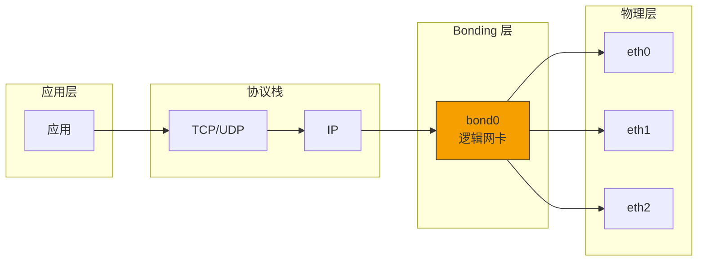
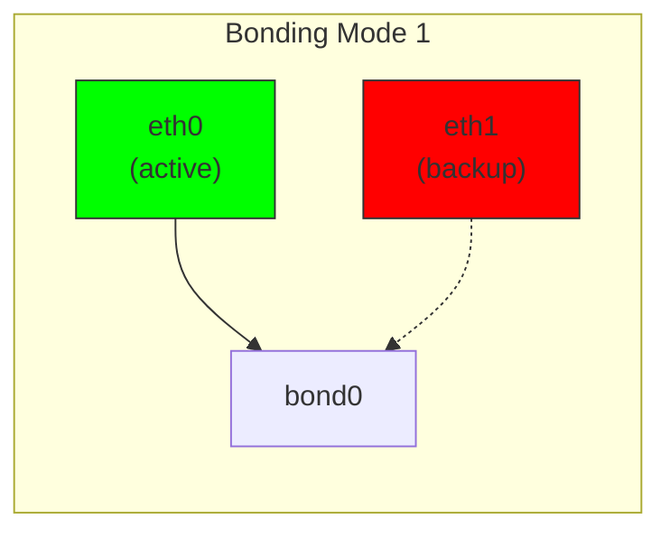
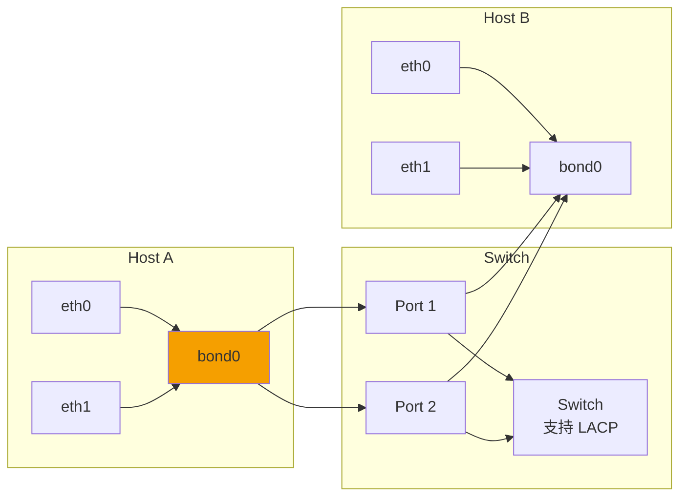
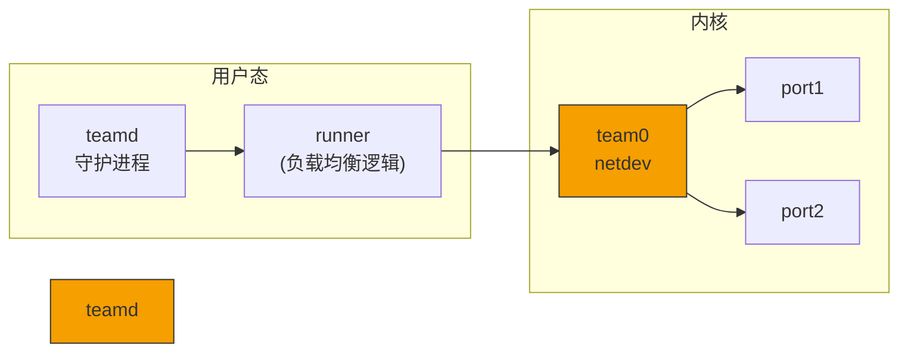
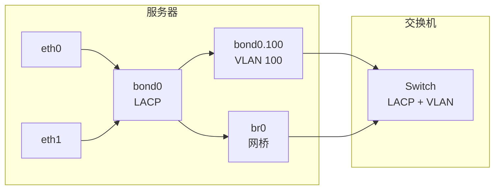
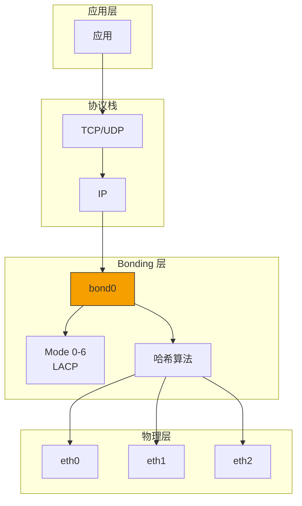

> [!info] Kernel Protocol Stack 深度探索系列 0. [[2026-04-13-kernel-protocol-stack-deep-dive-series-index|全栈学习路径总览]]
>
> 1. [[2026-04-13-kernel-protocol-stack-deep-dive-ch1-skbuff|第一章：sk_buff 与数据包生命周期]]
> 2. [[2026-04-13-kernel-protocol-stack-deep-dive-ch2-netdevice|第二章：Netdevice 与网卡抽象]]
> 3. [[2026-04-13-kernel-protocol-stack-deep-dive-ch3-ring-buffer|第三章：Ring Buffer 与 DMA]]
> 4. [[2026-04-13-kernel-protocol-stack-deep-dive-ch4-softirq|第四章：软中断与 ksoftirqd]]
> 5. [[2026-04-13-kernel-protocol-stack-deep-dive-ch5-napi|第五章：NAPI 与轮询模式]]
> 6. [[2026-04-13-kernel-protocol-stack-deep-dive-ch6-ethernet|第六章：Ethernet 与 MAC 层]]
> 7. [[2026-04-13-kernel-protocol-stack-deep-dive-ch7-bridge|第七章：网桥与 Switchdev]]
> 8. [[2026-04-13-kernel-protocol-stack-deep-dive-ch8-vlan|第八章：VLAN 与 802.1Q]]
> 9. [[2026-04-13-kernel-protocol-stack-deep-dive-ch9-macvlan|第九章：MACVLAN 与虚拟网卡]]
> 10. **第十章：Bonding 与 teamd**

---

## 1. 概述：链路聚合解决的问题

链路聚合（Link Aggregation）通过将多个物理网卡捆绑成一个逻辑通道，实现：

1. **带宽聚合**：多个接口带宽叠加（但不是简单相加）
2. **冗余备份**：某条链路故障时流量自动切换
3. **负载均衡**：流量分散到多个物理链路
4. **负载共享**：提高网络利用率

**Bonding 在 Linux 网络栈中的位置：**



---

## 2. Bonding 驱动架构

### 2.1 Bonding 数据结构

```c
// drivers/net/bonding/bond_main.c
struct bonding {
    struct net_device       *dev;           // bond 设备自身
    struct slave            *curr_active_slave;  // 当前活跃从设备
    struct slave            *current_arp_slave;  // 当前 ARP 监测从设备
    struct slave            *primary_slave;  // 主设备（优先级最高）

    // 从设备列表
    struct list_head        bond_list;
    struct list_head        vlan_list;

    // 模式与配置
    s8                      params.mode;    // 聚合模式
    s8                      params.xmit_policy; // 负载均衡策略
    u16                     params.mii_mon; // MII 监测间隔
    u16                     params.arp_mon; // ARP 监测间隔

    // 统计
    atomic64_t              stats;
    struct rtnl_link_stats64 bond_stats;

    // LACP 相关
    struct lacpdu            *lacpdu;
    u16                     aggregator_id;

    // 锁
    spinlock_t              lock;
    struct mutex             lock;
};
```

### 2.2 从设备结构

```c
// drivers/net/bonding/bond_main.c
struct slave {
    struct net_device       *dev;           // 物理设备
    struct bonding          *bond;          // 所属 bond

    struct list_head        list;           // 加入 bond 的链表

    // 状态
    u8                      state;         // 状态 (BOND_STATE_*)
    u8                      original_mtu;  // 原始 MTU

    // 链路状态
    u32                     link_status;   // BOND_LINK_*
    u32                     last_link_up; // 上次链路 UP 时间

    // LACP
    u16                     aggregator_id;
    u8                      port_number;

    // 负载均衡
    u32                     delay;
    u32                     link_failure_count;

    // 统计
    struct rtnl_link_stats64 slave_stats;
};
```

### 2.3 Bonding 注册

```c
// drivers/net/bonding/bond_main.c
static int bond_init(struct net_device *dev)
{
    struct bonding *bond = netdev_priv(dev);

    // 1. 初始化成员
    INIT_LIST_HEAD(&bond->bond_list);
    INIT_LIST_HEAD(&bond->vlan_list);

    // 2. 设置 rx_handler
    netdev_for_each_lower_dev(dev, slave, iter) {
        slave->dev->rx_handler = bond_handle_frame;
        slave->dev->rx_handler_data = bond;
    }

    // 3. 注册 ARP monitor
    bond->arp_mon_timer.expires = jiffies + HZ;
    add_timer(&bond->arp_mon_timer);

    return 0;
}
```

---

## 3. Bonding 模式详解

### 3.1 模式总览

| 模式 | 名称           | 负载均衡 | 冗余 | 需要的交换机配置 |
| ---- | -------------- | -------- | ---- | ---------------- |
| 0    | balance-rr     | 轮询     | 无   | 无（但不推荐）   |
| 1    | active-backup  | 无       | 有   | 无               |
| 2    | balance-xor    | Hash     | 无   | 无               |
| 3    | broadcast      | 无       | 有   | 无               |
| 4    | 802.3ad (LACP) | Hash     | 有   | 需要 LACP        |
| 5    | balance-tlb    | 自适应   | 有   | 无               |
| 6    | balance-alb    | 自适应   | 有   | 无               |

### 3.2 Mode 0: balance-rr（轮询）

**特点：** 数据包轮询发送到各个从设备

```c
// drivers/net/bonding/bond_main.c
static netdev_tx_t bond_xmit_roundrobin(struct sk_buff *skb,
                                          struct bonding *bond)
{
    struct slave *slave;
    int i, slave_no;

    // 轮询选择从设备
    slave_no = bond->rr_tx_counter % bond->slave_cnt;
    bond->rr_tx_counter++;

    i = 0;
    list_for_each_entry(slave, &bond->vlan_list, list) {
        if (i++ == slave_no)
            return bond_dev_queue_xmit(bond, slave, skb);
    }

    return NETDEV_TX_OK;
}
```

**问题：** 不保证有序，可能导致数据包乱序

### 3.3 Mode 1: active-backup（主备）

**特点：** 只有主设备活跃，备设备待命



```c
static netdev_tx_t bond_xmit_active_backup(struct sk_buff *skb,
                                            struct bonding *bond)
{
    struct slave *slave;

    // 始终使用 curr_active_slave
    rcu_read_lock();
    slave = rcu_dereference(bond->curr_active_slave);

    if (likely(slave && slave->link_status == BOND_LINK_UP))
        return bond_dev_queue_xmit(bond, slave, skb);

    // 无活跃链路，尝试 ARP 发送
    slave = bond->current_arp_slave;
    if (slave)
        return bond_dev_queue_xmit(bond, slave, skb);

    rcu_read_unlock();
    return NETDEV_TX_DROP;
}
```

### 3.4 Mode 4: 802.3ad（LACP）

**特点：** 基于 IEEE 802.3ad，支持链路聚合和负载均衡



**LACP PDU 格式：**

```c
// drivers/net/bonding/bond_3ad.c
struct lacpdu {
    // LACP 子类型
    u8  subtype;              // 0x01 (LACP)
    u8  version;

    // TLV 类型
    u8  tlv_type;
    u8  actor_info_length;    // 20
    u8  actor_system_priority[2];
    u8  actor_system[6];     // MAC
    u8  actor_key[2];
    u8  actor_port_priority[2];
    u8  actor_port[2];
    u8  actor_state;
    u8  actor_reserved[3];

    u8  partner_info_length;
    u8  partner_system_priority[2];
    u8  partner_system[6];
    u8  partner_key[2];
    u8  partner_port_priority[2];
    u8  partner_port[2];
    u8  partner_state;
    u8  partner_reserved[3];

    u8  collector_info_length;
    u8  collector_max_delay[2];
    u8  collector_reserved[12];

    u8  terminator_length;
    u8  terminator_reserved[50];
};
```

### 3.5 Mode 5 & 6: 自适应负载均衡

**balance-tlb (mode 5)：** 发送端负载均衡，根据当前负载分配

**balance-alb (mode 6)：** 发送端 + 接收端负载均衡，使用 ARP 协商

```c
// balance-alb 核心机制
static void alb_send_learning_arp(struct slave *slave)
{
    // 向网络发送 ARP，宣告新的 MAC-to-IP 映射
    // 交换机更新 CAM 表
    arp_send(ARPOP_REQUEST, ETH_P_ARP, slave->bond->dev->ipaddr,
             dev, target_ip, slave->dev->dev_addr, ...);
}
```

---

## 4. 链路监测机制

### 4.1 MII/ETHTOOL 监测

```c
// drivers/net/bonding/bond_main.c
static int bond_mii_monitor(struct bonding *bond)
{
    struct slave *slave;
    bool link_up;

    list_for_each_entry(slave, &bond->slave_list, list) {
        // 查询底层驱动获取链路状态
        link_up = netif_carrier_ok(slave->dev);

        if (link_up != (slave->link_status == BOND_LINK_UP)) {
            if (link_up) {
                // 链路 UP
                slave->link_status = BOND_LINK_UP;
                bond_set_active_slave(slave);
            } else {
                // 链路 DOWN
                slave->link_status = BOND_LINK_DOWN;
                bond_set_backup_slave(slave);
            }
        }
    }

    return 0;
}
```

### 4.2 ARP 监测

```c
// drivers/net/bonding/bond_main.c
static int bond_arp_monitor(struct bonding *bond)
{
    struct slave *slave;
    struct neighbour *neigh;
    struct flowi fl;

    // 对每个配置的 ARP target 发送请求
    for (i = 0; i < bond->params.arp_num_targets; i++) {
        __be32 target = bond->params.arp_targets[i];

        // 构造 ARP 请求
        neigh = neigh_lookup(&arp_tbl, &target, bond->dev);
        if (neigh && !(neigh->nud_state & NUD_VALID)) {
            // 目标不可达，切换链路
            bond_set_active_slave_by_link(bond);
        }
    }

    return 0;
}
```

---

## 5. 负载均衡算法

### 5.1 XOR 哈希算法

```c
// drivers/net/bonding/bond_xmit_hash.c
static u32 bond_xmit_hash(struct bonding *bond, struct sk_buff *skb)
{
    struct ethhdr *eth = (struct ethhdr *)skb->data;
    u32 hash;

    switch (bond->params.xmit_policy) {
    case BOND_XMIT_POLICY_ENCAP23:
        // 基于 L2/L3/L4 头的哈希
        if (skb->protocol == htons(ETH_P_IP)) {
            struct iphdr *iph = ip_hdr(skb);
            hash = bond_ip_hash(iph->saddr, iph->daddr);
        } else if (skb->protocol == htons(ETH_P_IPV6)) {
            struct ipv6hdr *ip6h = ipv6_hdr(skb);
            hash = bond_ipv6_hash(ip6h->saddr.s6_addr,
                                  ip6h->daddr.s6_addr);
        }
        break;

    case BOND_XMIT_POLICY_ENCAP34:
        // 添加 L4 端口号
        if (iph->protocol == IPPROTO_TCP ||
            iph->protocol == IPPROTO_UDP) {
            struct udphdr *uh = (struct udphdr *)(iph + 1);
            hash ^= uh->source ^ uh->dest;
        }
        break;

    default:
        // 基于 MAC 地址
        hash = eth->h_dest[5] ^ eth->h_source[5];
    }

    return hash;
}
```

### 5.2 哈希用于从设备选择

```c
// 根据哈希值选择从设备
static struct slave *bond_xmit_slave_get(struct bonding *bond,
                                           struct sk_buff *skb)
{
    struct slave *slave;
    int slave_cnt;
    u32 hash;

    slave_cnt = bond->slave_cnt;
    if (slave_cnt == 0)
        return NULL;

    hash = bond_xmit_hash(bond, skb);
    slave = bond->first_slave;

    // 取模运算选择从设备
    return bond_get_slave_by_index((hash % slave_cnt), ...);
}
```

---

## 6. teamd：新一代链路聚合

### 6.1 teamd 架构

teamd 是用户空间的链路聚合守护进程，比内核 bonding 更灵活：



### 6.2 teamd 配置示例

```json
{
  "device": "team0",
  "runner": {
    "name": "lacp",
    "active": true,
    "fast_rate": true,
    "tx_hash": ["eth", "ipv4", "ipv6"]
  },
  "ports": {
    "eth0": {},
    "eth1": {}
  }
}
```

### 6.3 teamd Runner 类型

| Runner       | 说明                 | 对应 bonding 模式 |
| ------------ | -------------------- | ----------------- |
| broadcast    | 所有端口发送相同数据 | mode 3            |
| roundrobin   | 轮询发送             | mode 0            |
| activebackup | 主备切换             | mode 1            |
| loadbalance  | 哈希负载均衡         | mode 2            |
| lacp         | 802.3ad LACP         | mode 4            |
| random       | 随机选择             | -                 |

### 6.4 teamd 负载均衡

```c
// teamd/teamd_runner_lacp.c
static int teamd_lacp_select_tx_port(struct team *team,
                                       struct sk_buff *skb)
{
    struct lacpdu *lacpdu;
    u32 hash;

    // 计算哈希
    hash = team_get_hash(team, skb);

    // 根据哈希和活跃端口选择
    return team_get_tx_port_by_hash(team, hash);
}
```

---

## 7. Bonding 配置与管理

### 7.1 内核模块加载配置

```bash
# /etc/modprobe.d/bonding.conf
options bonding mode=4
options bonding miimon=100
options bonding lacp_rate=1
options bonding xmit_hash_policy=layer2+3
options bonding max_bonds=2
```

### 7.2 ip 命令配置

```bash
# 创建 bond 接口
ip link add bond0 type bond mode 802.3ad
ip link set bond0 type bond miimon 100
ip link set bond0 type bond lacp_rate fast

# 添加从设备
ip link set eth0 master bond0
ip link set eth1 master bond0

# 配置 IP
ip addr add 192.168.1.100/24 dev bond0
ip link set bond0 up

# 查看状态
cat /proc/net/bonding/bond0
ip -d link show bond0
```

### 7.3 NetworkManager 配置

```bash
# 使用 nmcli 配置 bond
nmcli con add type bond ifname bond0 mode 802.3ad

# 添加从设备
nmcli con add type bond-slave ifname eth0 master bond0
nmcli con add type bond-slave ifname eth1 master bond0

# 配置 bond
nmcli con mod bond0 bond.miimon 100
nmcli con mod bond0 bond.lacp-rate fast

# 激活
nmcli con up bond0
```

---

## 8. Bonding 与 VLAN/网桥的结合

### 8.1 Bonding 上创建 VLAN

```bash
# bond0 是 LACP 聚合
ip link add bond0 type bond mode 802.3ad

# 在 bond0 上创建 VLAN
ip link add link bond0 name bond0.100 type vlan id 100

# 配置 IP
ip addr add 192.168.100.1/24 dev bond0.100
```

### 8.2 Bonding 作为网桥端口

```bash
# 创建网桥
ip link add br0 type bridge

# 将 bond0 加入网桥
ip link set bond0 master br0

# 配置网桥 IP
ip addr add 192.168.1.1/24 dev br0
```

### 8.3 完整拓扑示例



---

## 9. 常见问题与排查

### 9.1 链路状态正常但不通信

```bash
# 检查 bond 状态
cat /proc/net/bonding/bond0

# 检查从设备状态
ip link show eth0
ip link show eth1

# 检查交换机侧 LACP 状态
show lacp interfaces
```

### 9.2 负载不均衡

```bash
# 检查哈希策略
cat /sys/class/net/bond0/bonding/xmit_hash_policy

# 切换到更细粒度的哈希
echo layer2+3 > /sys/class/net/bond0/bonding/xmit_hash_policy
```

### 9.3 切换延迟

```bash
# 检查 miimon 设置（建议 100ms）
cat /sys/class/net/bond0/bonding/miimon

# 调整 arp_interval（ARP 监测）
echo 1000 > /sys/class/net/bond0/bonding/arp_interval
```

---

## 10. 总结



**Bonding 关键点：**

1. **7 种模式覆盖不同场景**：从简单轮询到智能 LACP
2. **MII/ARP 监测机制**：检测链路故障并自动切换
3. **XOR 哈希实现负载均衡**：支持 L2/L3/L4 多层哈希
4. **LACP (802.3ad)**：与交换机协同的标准化链路聚合
5. **teamd**：用户空间实现，更灵活的 runner 机制
6. **常与 VLAN/网桥组合**：构建复杂网络拓扑
