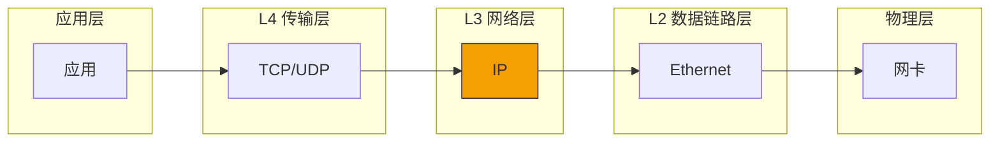

> [!info] Kernel Protocol Stack 深度探索系列 0. [[2026-04-13-kernel-protocol-stack-deep-dive-series-index|全栈学习路径总览]]
>
> 1. [[2026-04-13-kernel-protocol-stack-deep-dive-ch1-skbuff|第一章：sk_buff 与数据包生命周期]]
> 2. [[2026-04-13-kernel-protocol-stack-deep-dive-ch2-netdevice|第二章：Netdevice 与网卡抽象]]
> 3. [[2026-04-13-kernel-protocol-stack-deep-dive-ch3-ring-buffer|第三章：Ring Buffer 与 DMA]]
> 4. [[2026-04-13-kernel-protocol-stack-deep-dive-ch4-softirq|第四章：软中断与 ksoftirqd]]
> 5. [[2026-04-13-kernel-protocol-stack-deep-dive-ch5-napi|第五章：NAPI 与轮询模式]]
> 6. [[2026-04-13-kernel-protocol-stack-deep-dive-ch6-ethernet|第六章：Ethernet 与 MAC 层]]
> 7. [[2026-04-13-kernel-protocol-stack-deep-dive-ch7-bridge|第七章：网桥与 Switchdev]]
> 8. [[2026-04-13-kernel-protocol-stack-deep-dive-ch8-vlan|第八章：VLAN 与 802.1Q]]
> 9. [[2026-04-13-kernel-protocol-stack-deep-dive-ch9-macvlan|第九章：MACVLAN 与虚拟网卡]]
> 10. [[2026-04-13-kernel-protocol-stack-deep-dive-ch10-bonding|第十章：Bonding 与 teamd]]
> 11. **第十一章：IP 协议封装**

---

## 1. 概述：IP 协议在网络栈中的位置

IP（Internet Protocol）是网络层的核心协议，负责将数据包从源主机路由到目标主机。它提供无连接、不可靠的分组传输服务。

**IP 协议的核心职责：**

1. **寻址**：使用 IP 地址标识网络上的每个节点
2. **路由**：决定数据包从源到目的的路径
3. **分片**：将大于 MTU 的数据包分成小片段
4. **TTL**：防止数据包在网络中无限循环



---

## 2. IPv4 头部结构

### 2.1 IPv4 头部格式

```
┌─────────────────────────────────────────────────────────────────────────┐
│                      IPv4 Header (20-60 bytes)                         │
├────────┬────────┬─────────┬──────────────────┬──────────────────────────┤
│ Ver    │  IHL   │  ToS    │     Total Length                        │  0-3
├────────┼────────┼─────────┼──────────────────┼──────────────────────────┤
│        Identification      │ Flags │     Fragment Offset               │  4-7
├────────┼────────┼─────────┼──────────────────┼──────────────────────────┤
│  TTL   │ Protocol          │        Header Checksum                  │  8-11
├────────┼────────┼─────────┼──────────────────┼──────────────────────────┤
│                         Source IP Address                              │ 12-15
├─────────────────────────────────────────────────────────────────────────┤
│                       Destination IP Address                           │ 16-19
├─────────────────────────────────────────────────────────────────────────┤
│                         Options (optional)                             │ 20+
└─────────────────────────────────────────────────────────────────────────┘
```

### 2.2 IPv4 头部代码表示

```c
// include/uapi/linux/ip.h
struct iphdr {
#if defined(__LITTLE_ENDIAN_BITFIELD)
    __u8   ihl:4,           // IP Header Length (单位: 4字节)
           version:4;       // 版本 (4)
#elif defined(__BIG_ENDIAN_BITFIELD)
    __u8   version:4,
           ihl:4;
#endif
    __u8   tos;             // Type of Service (DSCP + ECN)
    __be16 tot_len;         // Total Length (包含头部)
    __be16 id;              // Identification (分片用)
    __be16 frag_off;        // Flags + Fragment Offset
    __u8   ttl;             // Time to Live
    __u8   protocol;        // 上层协议 (1=ICMP, 6=TCP, 17=UDP)
    __be16 check;           // Header Checksum
    __be32 saddr;           // Source IP Address
    __be32 daddr;           // Destination IP Address

    /* options follow */
};
```

### 2.3 各字段详解

**Version (4 bits):** IP 版本，IPv4 为 4

**IHL - Internet Header Length (4 bits):** 头部长度，单位为 4 字节

- 最小值 5 (20 bytes，无选项)
- 最大值 15 (60 bytes，携带选项)

**Type of Service / DSCP + ECN (8 bits):**

| 位   | 7-5          | 4-2                                | 1-0                              |
| ---- | ------------ | ---------------------------------- | -------------------------------- |
| 名称 | Precedence   | DSCP                               | ECN                              |
| 说明 | 优先级 (0-7) | Differentiated Services Code Point | Explicit Congestion Notification |

**DSCP 值：**

| DSCP   | PHB     | 用途                            |
| ------ | ------- | ------------------------------- |
| 0 (BE) | Default | Best Effort，无特殊处理         |
| 46     | EF      | Expedited Forwarding，低延迟    |
| 34     | AF41    | Assured Forwarding，high drop   |
| 26     | AF31    | Assured Forwarding，medium drop |
| 18     | AF21    | Assured Forwarding，low drop    |

**Total Length (16 bits):** 整个 IP 包长度，包含头部和数据，最大 65535 字节

**Identification (16 bits):** 分片重组标识，同一数据包的所有分片有相同 ID

**Flags + Fragment Offset (16 bits):**

| 位   | 15-13 | 12-0                   |
| ---- | ----- | ---------------------- |
| 名称 | Flags | Fragment Offset        |
| 说明 | MF/DF | 片偏移（8 字节为单位） |

**TTL (8 bits):** 每经过一个路由器减 1，为 0 时丢弃

**Protocol (8 bits):** 负载协议类型

```c
// include/uapi/in.h
#define IPPROTO_IP        0     // Dummy protocol
#define IPPROTO_ICMP      1     // ICMP
#define IPPROTO_IGMP      2     // IGMP
#define IPPROTO_IPIP      4     // IP encapsulation
#define IPPROTO_TCP       6     // TCP
#define IPPROTO_EGP       8     // Exterior Gateway Protocol
#define IPPROTO_PUP       12    // PUP
#define IPPROTO_UDP       17    // UDP
#define IPPROTO_IDP       22    // XNS IDP
#define IPPROTO_DCCP      33    // DCCP
#define IPPROTO_IPV6      41    // IPv6 encapsulation
#define IPPROTO_RSVP      46    // RSVP
#define IPPROTO_GRE       47    // GRE
#define IPPROTO_ESP       50    // IPSec ESP
#define IPPROTO_AH        51    // IPSec AH
#define IPPROTO_MTP       92    // Multicast Transport Protocol
#define IPPROTO_BEETPH    94    // BEET PH
#define IPPROTO_ENCAP     98    // Encapsulation Header
#define IPPROTO_PIM       103   // PIM
#define IPPROTO_COMP      108   // Compression Header
#define IPPROTO_SCTP      132   // SCTP
#define IPPROTO_UDPLITE   136   // UDP-Lite
#define IPPROTO_MPLS      137   // MPLS in IP
```

---

## 3. IPv6 头部结构

### 3.1 IPv6 头部格式

```
┌─────────────────────────────────────────────────────────────────────────┐
│                      IPv6 Header (40 bytes)                             │
├────────┬────────┬──────────────────┬──────────────────────────────────────┤
│ Ver    │  Tc    │    Flow Label   │                                      │  0-3
├────────┼────────┼──────────────────┼──────────────────────────────────────┤
│        Payload Length        │ Next Header │    Hop Limit                  │  4-7
├─────────────────────────────────────────────────────────────────────────┤
│                                                                         │
│                         Source IPv6 Address (128 bits)                  │
│                                                                         │
├─────────────────────────────────────────────────────────────────────────┤
│                                                                         │
│                       Destination IPv6 Address (128 bits)               │
│                                                                         │
└─────────────────────────────────────────────────────────────────────────┘
```

### 3.2 IPv6 头部代码表示

```c
// include/uapi/linux/ipv6.h
struct ipv6hdr {
#if defined(__LITTLE_ENDIAN_BITFIELD)
    __u8   priority:4,       // Traffic Class (旧版)
           version:4;       // 版本 (6)
#elif defined(__BIG_ENDIAN_BITFIELD)
    __u8   version:4,
           priority:4;
#endif
    __u8   flow_lbl[3];     // Flow Label (24 bits)
    __be16 payload_len;      // Payload Length (不含头部)
    __u8   nexthdr;         // Next Header (类似 IPv4 protocol)
    __u8   hop_limit;       // Hop Limit (类似 IPv4 TTL)

    struct in6_addr saddr;   // Source Address (128 bits)
    struct in6_addr daddr;   // Destination Address (128 bits)
};
```

### 3.3 IPv6 vs IPv4 主要区别

| 特性       | IPv4                   | IPv6                     |
| ---------- | ---------------------- | ------------------------ |
| 地址长度   | 32 bits                | 128 bits                 |
| 头部长度   | 20-60 bytes            | 固定 40 bytes            |
| 分片       | 发送端和路由器都可分片 | 仅发送端分片             |
| 校验和     | 头部校验和             | 无校验和                 |
| Options    | 通过 IHL 实现选项      | 通过扩展头部实现         |
| Flow Label | 无                     | 20 bits 用于流标记       |
| ARP        | ARP 协议               | NDP (Neighbor Discovery) |

### 3.4 IPv6 扩展头部

IPv6 使用链式扩展头部替代 IPv4 的选项：

| Next Header | 扩展头部            |
| ----------- | ------------------- |
| 0           | Hop-by-Hop Options  |
| 6           | TCP                 |
| 17          | UDP                 |
| 43          | Routing (Type 0)    |
| 44          | Fragment            |
| 50          | ESP                 |
| 51          | AH                  |
| 59          | No Next Header      |
| 60          | Destination Options |

---

## 4. IP 校验和

### 4.1 IPv4 校验和算法

```c
// net/ipv4/ip_output.c
__sum16 ip_fast_csum(const void *iph, unsigned int ihl)
{
    unsigned int sum;
    __wsum csum;

    // 32-bit 分组累加
    sum = *(const __u32 *)iph++;
    sum += *(const __u32 *)iph++;
    sum += *(const __u32 *)iph++;
    sum += *(const __u32 *)iph++;
    ihl -= 4;

    while (ihl--) {
        sum += *(const __u32 *)iph++;
    }

    // 处理奇数字节
    sum = (sum & 0xffff) + (sum >> 16);
    sum += sum >> 16;

    return (__force __sum16)~sum;
}
```

**校验和计算步骤：**

1. 将 IP 头部按 16 位分组
2. 所有分组累加（进位加到最低位）
3. 取反得到校验和

### 4.2 IP 校验和验证

```c
// net/ipv4/ip_input.c
static int ip_rcv_finish(struct net *net, struct sock *sock,
                          struct sk_buff *skb)
{
    // 校验和已在 earlier 验证，这里不再重复

    // 处理选项
    if (IPCB(skb)->opt.len) {
        if (ip_rcv_options(skb))
            goto drop;
    }

    // 路由查找
    return dst_input(skb);
drop:
    kfree_skb(skb);
    return NET_RX_DROP;
}
```

### 4.3 UDP/TCP 伪头部校验和

```c
// include/linux/tcp.h
struct pseudohdr {
    __be32   saddr;          // Source IP
    __be32   daddr;          // Destination IP
    __u8     pad;            // Padding (always zero)
    __u8     protocol;       // Protocol (6 for TCP, 17 for UDP)
    __be16   length;         // TCP/UDP header + data length
};

// TCP 校验和计算
__sum16 tcp_v4_check(struct tcphdr *th, int len,
                     __be32 saddr, __be32 daddr, __wsum base)
{
    return csum_tcpudp_nofold(saddr, daddr, len, IPPROTO_TCP, base);
}
```

---

## 5. IP 分片与重组

### 5.1 分片原因

当 IP 包大小超过路径 MTU (PMTU) 时，需要分片：

- **以太网络典型 MTU**: 1500 bytes
- **IPv4 头部长度**: 20 bytes (无选项)
- **最大数据负载**: 1480 bytes per fragment

### 5.2 IPv4 分片字段

| 字段            | 用途                                       |
| --------------- | ------------------------------------------ |
| Identification  | 同一原始包的所有分片共享同一 ID            |
| Flags           | MF (More Fragments) = 1 表示后面还有分片   |
| Fragment Offset | 当前分片在原始数据中的偏移（8 字节为单位） |

**分片规则：**

- 除最后一个分片外，每个分片大小必须是 8 字节的倍数
- 第一个分片的偏移为 0

### 5.3 IPv4 分片代码

```c
// net/ipv4/ip_output.c
static int ip_fragment(struct net *net, struct sock *sk,
                       struct sk_buff *skb, unsigned int mtu,
                       int *df)
{
    struct iphdr *iph;
    struct sk_buff *skb2;
    unsigned int hlen, left, len, ptr, offset;
    int err = 0;

    iph = ip_hdr(skb);

    // 计算头部和分片参数
    hlen = iph->ihl * 4;           // 头部长度
    left = ntohs(iph->tot_len) - hlen;  // 数据长度
    ptr = hlen;                    // 指向数据开始

    // 每个分片的最大数据量
    fraglen = (mtu - hlen - sizeof(struct ipfrag)) & ~7;

    // 分片循环
    while (left > 0) {
        len = min(left, fraglen);

        // 分配新的 skb
        skb2 = alloc_skb(len + hlen + LL_RESERVED_SPACE(dev), GFP_ATOMIC);

        // 复制头部
        skb_copy_header(skb2, skb);

        // 设置分片信息
        iph = ip_hdr(skb2);
        iph->frag_off = htons(offset >> 3);
        if (offset + len < ntohs(orig_iph->tot_len) - hlen)
            iph->frag_off |= htons(IP_MF);  // More fragments

        // 复制数据
        skb_copy_bits(skb, ptr, skb_put(skb2, len), len);

        // 发送
        iph->tot_len = htons(len + hlen);
        ip_send_check(iph);
        ip_local_out(net, skb2);

        left -= len;
        offset += len;
        ptr += len;
    }

    kfree_skb(skb);
    return err;
}
```

### 5.4 IPv4 重组

```c
// net/ipv4/ip_fragment.c
struct ipq {
    struct inet_frag_queue base;

    u16     id;              // Identification
    u8      protocol;         // Protocol
    u32     saddr;           // Source IP
    u32     daddr;           // Destination IP
};

static void ip_expire(unsigned long data)
{
    struct ipq *qp = (struct ipq *)data;
    struct net *net = &init_net;

    // 超时，删除所有分片
    ipfrag_skb_cb(qp, IP_FRAG_CB(skb));
    list_for_each_entry(skb, &qp->fragments, frag_list) {
        kfree_skb(skb);
    }

    // 通知上层
    icmp_send(ICMP_TIME_EXCEED, ICMP_EXC_FRAG_TIME, 0);
    inet_frag_kill(&qp->q);
}
```

### 5.5 IPv6 分片

IPv6 仅在发送端分片，路由器不参与分片：

```c
// net/ipv6/ip6_output.c
static int ip6_fragment(struct net *net, struct sock *sk,
                        struct sk_buff *skb, int (*output)(struct net*, struct sock*, struct sk_buff*))
{
    struct frag_hdr *fhdr;
    unsigned int mtu, hlen, left, len;
    int err = 0;

    // 计算 MTU
    mtu = ip6_skb_dst_mtu(skb);

    // IPv6 分片头部
    hlen = sizeof(struct frag_hdr);

    while (left > 0) {
        len = min(left, (mtu - hlen - sizeof(struct frag_hdr)) & ~7);

        // 创建分片
        skb2 = skb_segment(skb, hlen + sizeof(struct frag_hdr), len);

        // 添加 IPv6 分片头部
        fhdr = (struct frag_hdr *)skb_push(skb2, sizeof(struct frag_hdr));
        ipv6_frag_init(fhdr, fragoff, !more);
        fhdr->nexthdr = protocol;

        // 发送
        ip6_push_pending_frames(skb);
    }
}
```

---

## 6. IP 选项处理

### 6.1 IPv4 选项格式

IPv4 选项紧跟在头部之后，长度可变：

```
┌────────┬────────┬───────────────┐
│ Type   │ Length │ Data          │
│ 1 byte │ 1 byte │ variable      │
└────────┴────────┴───────────────┘
```

**常见选项类型：**

| Type | Name | 说明                           |
| ---- | ---- | ------------------------------ |
| 0    | EOOL | End of Options List            |
| 1    | NOP  | No Operation                   |
| 7    | RR   | Record Route                   |
| 68   | TS   | Timestamp                      |
| 131  | LSR  | Loose Source Route             |
| 137  | SSRR | Strict Source and Record Route |

### 6.2 IP 选项代码处理

```c
// net/ipv4/ip_options.c
int ip_forward_options(struct sk_buff *skb)
{
    struct ip_options *opt = &(IPCB(skb)->opt);
    unsigned char *ptr;

    if (opt->rr_needroute) {
        // 记录路由
        ptr = opt->ptr + (opt->rr_len - 1);
        memcpy(ptr, &iph->daddr, 4);
        opt->ptr += 4;
    }

    if (opt->srr_is_hit) {
        // 源路由处理
        if (!ip_options_rcu_srh(skb, opt))
            return -EINVAL;
    }

    // TTL 减一
    iph->ttl--;

    return 0;
}
```

### 6.3 IPv6 扩展头部处理

```c
// net/ipv6/exthdrs.c
int ipv6_parse_hopopts(struct sk_buff *skb)
{
    struct inet_skb_parm *opt = IPCB(skb);
    unsigned int off = sizeof(struct ipv6hdr);

    while (off < skb->len) {
        struct hop_opt *hopopt = (struct hop_opt *)(skb->data + off);

        switch (hopopt->nexthdr) {
        case IPPROTO_ICMPV6:
            // 处理 ICMPv6
            break;
        case NEXTHDR_DEST:
            // 目标选项
            off += (hopopt->hdrlen + 1) << 3;
            break;
        default:
            // 未知扩展头
            return -1;
        }
    }

    return 0;
}
```

---

## 7. sk_buff 中的 IP 信息

### 7.1 IP 头指针

```c
// include/linux/skbuff.h
struct sk_buff {
    // IP 头指针
    struct iphdr       *ip_hdr;
    struct ipv6hdr     *ipv6_hdr;

    // 传输层头指针
    struct tcphdr      *tcp_hdr;
    struct udphdr      *udp_hdr;

    // 分片信息
    __be16              frag_off;
    u8                  ip_summed;   // CHECKSUM_*
};

// 获取 IP 头
static inline struct iphdr *ip_hdr(const struct sk_buff *skb)
{
    return (struct iphdr *)skb->network_header;
}

// 设置 IP 头
static inline void iph = ip_hdr(skb);
```

### 7.2 IP 选项存储

```c
// net/ipv4/ip_input.c
struct ip_options {
    __u32       faddr;           // 第一个路由目的
    __u32       daddr;           // 最终目的
    __u32       saddr;           // loose source route 的下一跳

    int         optlen;         // 选项长度
    int         offset;         // 当前处理偏移

    unsigned char       *__data;   // 选项数据
    unsigned char       data[40];   // 最大选项空间

    // 标志位
    unsigned char       rr_needroute:1;
    unsigned char       ts_needtime:1;
    unsigned char       srr_is_hit:1;
    unsigned char       srr_local:1;
    unsigned char       lsrr:1;
    unsigned char       ssrr:1;
    unsigned char       rxtime:1;
    unsigned char       __unused:1;
};
```

---

## 8. 总结

```mermaid
graph TD
    subgraph "应用层"
        APP["应用"]
    end

    subgraph "L4"
        L4["TCP/UDP"]
    end

    subgraph "IPv4/IPv6"
        IP_V["IP Header<br/>20-60/40 bytes"]
        IP_OPT["Options/Ext Headers"]
        IP_CSUM["Checksum"]
        IP_FRAG["Fragmentation"]
    end

    subgraph "L2"
        ETH["Ethernet"]
    end

    APP --> L4 --> IP_V
    IP_V --> IP_OPT
    IP_V --> IP_CSUM
    IP_V --> IP_FRAG
    IP_FRAG --> ETH

    style IP_V fill:#f59f00,stroke:#333
```

**IP 协议关键点：**

1. **IPv4 头 20-60 字节**，可变长度包含选项
2. **IPv6 头固定 40 字节**，选项通过扩展头部实现
3. **校验和覆盖 IPv4 头**，IPv6 无头校验和
4. **分片机制**：IPv4 路由器可分片，IPv6 仅发送端分片
5. **DSCP/ECN**：用于 QoS 和拥塞通知
6. **TTL/Hop Limit**：防止数据包无限循环
7. **Protocol/Next Header**：标识负载协议类型
