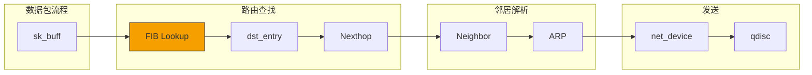
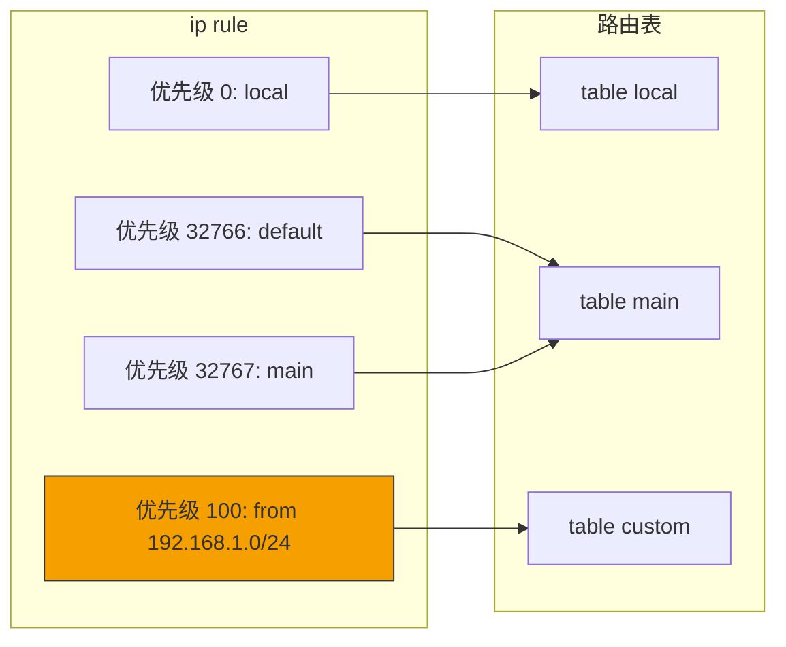
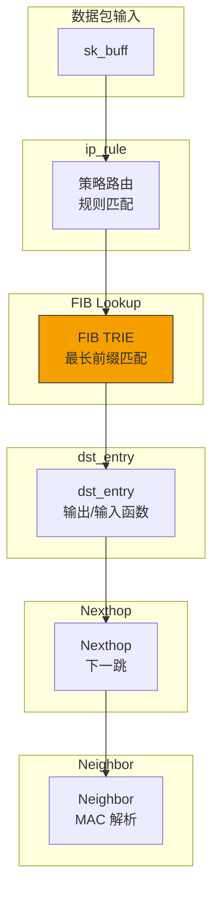

> [!info] Kernel Protocol Stack 深度探索系列
> 0. [[2026-04-13-kernel-protocol-stack-deep-dive-series-index|全栈学习路径总览]]
> 1. [[2026-04-13-kernel-protocol-stack-deep-dive-ch1-skbuff|第一章：sk_buff 与数据包生命周期]]
> 2. [[2026-04-13-kernel-protocol-stack-deep-dive-ch2-netdevice|第二章：Netdevice 与网卡抽象]]
> 3. [[2026-04-13-kernel-protocol-stack-deep-dive-ch3-ring-buffer|第三章：Ring Buffer 与 DMA]]
> 4. [[2026-04-13-kernel-protocol-stack-deep-dive-ch4-softirq|第四章：软中断与 ksoftirqd]]
> 5. [[2026-04-13-kernel-protocol-stack-deep-dive-ch5-napi|第五章：NAPI 与轮询模式]]
> 6. [[2026-04-13-kernel-protocol-stack-deep-dive-ch6-ethernet|第六章：Ethernet 与 MAC 层]]
> 7. [[2026-04-13-kernel-protocol-stack-deep-dive-ch7-bridge|第七章：网桥与 Switchdev]]
> 8. [[2026-04-13-kernel-protocol-stack-deep-dive-ch8-vlan|第八章：VLAN 与 802.1Q]]
> 9. [[2026-04-13-kernel-protocol-stack-deep-dive-ch9-macvlan|第九章：MACVLAN 与虚拟网卡]]
> 10. [[2026-04-13-kernel-protocol-stack-deep-dive-ch10-bonding|第十章：Bonding 与 teamd]]
> 11. [[2026-04-13-kernel-protocol-stack-deep-dive-ch11-ip-framing|第十一章：IP 协议封装]]
> 12. **第十二章：路由与 FIB**

---

## 1. 概述：路由在网络栈中的位置

路由（Routing）是网络层的核心功能，决定数据包从源到目的地的路径。Linux 内核维护一个转发信息库（FIB，Forwarding Information Base），用于快速查找路由。

**路由的核心职责：**

1. **最长前缀匹配**：从多个匹配的路由中选择最具体的
2. **下一跳解析**：确定数据包下一步发往哪里
3. **接口选择**：决定从哪个网卡发送
4. **策略路由**：根据多个规则选择路由表



---

## 2. FIB 数据结构

### 2.1 路由表结构

Linux 支持多路由表（默认 256 个）：

```c
// include/net/fib_notifier.h
struct fib_table {
    struct hlist_node       tb_hlist;       // 哈希链表节点
    u32                     tb_id;           // 路由表 ID (RT_TABLE_*)
    unsigned char           tb_data[0];       // 路由数据
    
    // 路由查找函数
    int                     (*tb_lookup)(struct fib_table *tb,
                                          const struct flowi4 *flp,
                                          struct fib_result *res);
    
    // 路由配置函数
    int                     (*tb_insert)(struct fib_table *tb,
                                          struct fib_config *cfg);
    
    // 路由删除函数
    int                     (*tb_delete)(struct fib_table *tb,
                                          struct fib_config *cfg);
};
```

### 2.2 路由条目结构

```c
// include/net/ip_fib.h
struct fib_result {
    __be32                  fi_fib;          // 匹配的 fib_info
    unsigned char           prefix_len;      // 前缀长度
    unsigned char           nh_sel;          // 选择的 nexthop
    unsigned char           type;            // 路由类型 (RTN_*)
    unsigned char           scope;           // 路由范围
    struct fib_info         *fi;             // fib_info 指针
    struct fib_nh_exception *fnh_ex;        // 异常信息
};

struct fib_info {
    struct hlist_node       fib_hash;       // 哈希表链表
    struct list_head        fib_list;       // 路由信息链表
    unsigned int            fib_flags;       // 标志 (RTNH_F_*)
    unsigned char           fib_treeref;     // TRIE 引用计数
    atomic_t                fib_clntref;    // 引用计数
    int                     fib_protocol;     // 路由协议
    __be32                  fib_prefsrc;     // 首选源地址
    u32                     fib_priority;    // 路由优先级
    u32                     fib_metric;      // 路由度量
    u8                      fib_type;        // 路由类型
    __be32                  fib_dst;         // 目的网络
    __be32                  fib_src;         // 源网络
    __u8                    fib_dst_len;      // 目的前缀长度
    __u8                    fib_src_len;      // 源前缀长度
    
    struct fib_nh           fib_nh[0];      // nexthop 信息
};
```

### 2.3 Nexthop 结构

```c
// include/net/ip_fib.h
struct fib_nh {
    struct net_device       *nh_dev;        // 关联的 net_device
    struct fib_nh_exception *nh_exceptions; // 异常列表
    __be32                  nh_gw;           // 网关地址
    int                     nh_oif;         // 输出接口索引
    u32                     nh_flags;       // 标志位
    unsigned char           nh_scope;        // nexthop 范围
#ifdef CONFIG_IP_ROUTE_MULTIPATH
    int                     nh_weight;      // 权重（负载均衡）
    int                     nh_power;        // 功率（负载均衡）
#endif
#ifdef CONFIG_IP_ROUTE_CLASSID
    u32                     nh_classid;     // 流量分类 ID
#endif
};
```

### 2.4 路由类型

```c
// include/uapi/linux/route.h
#define RTN_UNSPEC      0   // 未指定
#define RTN_UNICAST     1   // 单播路由（普通路由）
#define RTN_LOCAL       2   // 本地接口路由
#define RTN_BROADCAST   3   // 广播路由
#define RTN_ANYCAST     4   // 任播路由
#define RTN_MULTICAST   5   // 多播路由
#define RTN_BLACKHOLE   6   // 黑洞路由（丢弃）
#define RTN_UNREACHABLE 7   // 不可达（返回 ICMP 错误）
#define RTN_PROHIBIT    8   // 禁止（返回 ICMP 禁止）
#define RTN_THROW       9   // 继续查找其他表
#define RTN_NAT         10  // NAT 路由
#define RTN_XRESOLVE    11  // 外部解析
```

---

## 3. 路由查找算法

### 3.1 FIB TRIE 结构

现代 Linux 使用 LC-trie（Level Compressed Trie）存储路由：

```c
// net/ipv4/fib_trie.c
struct trie {
    struct tnode *trie;         // TRIE 根节点
    struct leaf   *list;         // 叶子链表
    size_t         max_size;     // 最大大小
    int            size;         // 当前大小
    atomic_t       tn_size_avg;
    struct {
        int bytes;               // 内存使用
        int nodes;               // 节点数量
    } stat;
};

struct tnode {
    __be32         key;          // 键值
    unsigned char   pos;          // 位置（压缩级别）
    unsigned char   bits;         // 位数
    unsigned char   full_children;  // 满子树数量
    unsigned char   empty_children; // 空子树数量
    struct rcu_head rcu;
    union {
        struct tnode *child[0];  // 子节点数组
        struct leaf   *leaf[0];   // 叶子数组
    };
};
```

### 3.2 路由查找流程

```c
// net/ipv4/fib_lookup.h
static inline int fib_lookup(struct net *net, const struct flowi4 *flp,
                             struct fib_result *res)
{
    struct fib_table *tb;
    
    // 1. 根据 skb 的 fwmark 或 oif 选择路由表
    tb = fib_get_table(net, RT_TABLE_MAIN);
    
    // 2. 调用表的查找函数
    return tb->tb_lookup(tb, flp, res);
}

// net/ipv4/fib_trie.c
static int fib_trie_lookup(struct fib_table *tb,
                          const struct flowi4 *flp,
                          struct fib_result *res)
{
    struct trie *t = (struct trie *)tb->tb_data;
    t_key key = ntohl(flp->daddr);
    t_key m;
    int ret;
    
    // 遍历 trie 树，查找最长前缀匹配
    // ...
    
    return ret;
}
```

### 3.3 最长前缀匹配（LPM）

```
路由表：
  0.0.0.0/0          -> 默认路由（匹配 0 位）
  10.0.0.0/8         -> A 类网络（匹配 8 位）
  10.20.0.0/16       -> B 类子网（匹配 16 位）
  10.20.30.0/24      -> C 类子网（匹配 24 位）

目标 IP：10.20.30.5
匹配结果：10.20.30.0/24（最长匹配 24 位）
```

---

## 4. 路由缓存（历史）

### 4.1 路由缓存概述

Linux 2.6.39 之前使用路由缓存（routing cache）加速查找：

```
_dst_cache 哈希表：
  key = (daddr, saddr, dport, sport, protocol, oif)
  value = dst_entry
```

**问题：**
- 大量并发连接时缓存条目爆炸
- 每秒创建/销毁大量 dst_entry
- 放大攻击风险

### 4.2 路由缓存移除

**Linux 2.6.39 (2011)：** 移除了路由缓存

**替代方案：**
- RPS (Receive Packet Steering) - 多核分发
- 硬件 FIB - 智能网卡
- FIB notifier - 用户空间缓存同步

### 4.3 dst_entry 结构

```c
// include/net/dst.h
struct dst_entry {
    struct rcu_head         rcu_head;         // RCU 头
    struct net_device       *dev;             // 关联设备
    struct dst_ops          *ops;             // dst 操作
    unsigned long           _metrics;         // 指标（跳数等）
    unsigned long           expires;          // 过期时间
    struct dst_entry       *from;             // 路由源（用于生成 dst）
    
    // Nexthop 信息
    struct neighbour        *_neigh;
    
    // 输入/输出函数
    int                     (*input)(struct sk_buff *);
    int                     (*output)(struct net *, struct sock *, struct sk_buff *);
    
    // 统计
    struct dst_stats        __percpu *stats;
    atomic_t                __refcnt;
    
    // 优先级和obsolete 标记
    short                   obsolete;
    int                     pending;
};
```

---

## 5. 路由配置与管理

### 5.1 ip route 命令

```bash
# 查看路由表
ip route show
ip route show table all

# 查看特定表
ip route show table 100

# 添加路由
ip route add 192.168.100.0/24 via 10.0.0.1 dev eth0
ip route add default via 192.168.1.1 dev eth0

# 添加多路径路由
ip route add 10.0.0.0/8 dev eth0 weight 1
ip route add 10.0.0.0/8 dev eth1 weight 2

# 删除路由
ip route del 192.168.100.0/24

# 添加黑洞路由
ip route add blackhole 10.254.0.0/16
```

### 5.2 路由表配置

```bash
# 查看路由表配置
cat /etc/iproute2/rt_tables

# 添加自定义路由表
echo "200 custom" >> /etc/iproute2/rt_tables

# 配置策略路由
ip rule add from 192.168.1.0/24 table custom
ip rule add oif eth0 table 100

# 查看规则
ip rule show
```

### 5.3 /proc/sys/net/ipv4/conf/*/route_localnet

```bash
# 允许本地网络使用路由而非交付本地
echo 1 > /proc/sys/net/ipv4/conf/all/route_localnet
echo 1 > /proc/sys/net/ipv4/conf/eth0/route_localnet
```

---

## 6. 策略路由

### 6.1 策略路由架构



### 6.2 规则匹配字段

```c
// include/uapi/linux/fib_rules.h
enum {
    FRA_UNSPEC,
    FRA_SRC,          // 源地址
    FRA_DST,          // 目的地址
    FRA_IIFNAME,      // 输入接口
    FRA_OIFNAME,      // 输出接口
    FRA_GOTO,         // 跳转规则
    FRA_PRIORITY,     // 优先级
    FRA_FWMARK,       // fwmark
    FRA_FLOW,         // flow ID
    FRA_TUN_ID,       // tunnel ID
    FRA_SUPPRESS_IFGROUP,
    FRA_SUPPRESS_PREFIXLEN,
    FRA_TABLE,        // 目标表
    FRA_FWMASK,       // fwmark mask
    FRA_OIFNAME_IL,
    FRA_PAD,
    FRA_L3MDEV,
    FRA_UID_RANGE,
    FRA_PROTOCOL,
    FRA_IP_PROTO,
    FRA_SPORT_RANGE,
    FRA_DPORT_RANGE,
    __FRA_MAX
};
```

### 6.3 策略路由配置

```bash
# 基于源地址选择路由表
ip rule add from 192.168.100.0/24 table 100

# 基于 fwmark 选择路由表
iptables -A PREROUTING -i eth0 -j MARK --set-mark 10
ip rule add fwmark 10 table 110

# 基于输入接口选择路由表
ip rule add iif lo table local

# 禁止某些流量
ip rule add from 10.0.0.0/8 prohibit

# 查看规则
ip rule show
```

---

## 7. 路由与 dst_entry

### 7.1 dst 输出路径

```c
// net/ipv4/route.c
int ip_output(struct net *net, struct sock *sk, struct sk_buff *skb)
{
    struct dst_entry *dst = skb_dst(skb);
    struct net_device *dev = dst->dev;
    
    // 更新统计
    IP_INC_STATS(net, IPSTATS_MIB_OUTREQUESTS);
    
    // 钩子点（Netfilter）
    if (ip_local_out(net, sk, skb))
        return 0;
    
    return NET_XMIT_DROP;
}

int ip_local_out(struct net *net, struct sock *sk, struct sk_buff *skb)
{
    int err;
    
    // NF_INET_LOCAL_OUT 钩子
    err = nf_hook(NFPROTO_IPV4, NF_INET_LOCAL_OUT,
                  net, sk, skb, NULL, dst->dev,
                  dst_output);
    
    if (likely(err == 1))
        err = dst_output(net, sk, skb);
    
    return err;
}

int dst_output(struct net *net, struct sock *sk, struct sk_buff *skb)
{
    return skb_dst(skb)->output(net, sk, skb);
}
```

### 7.2 路由输入路径

```c
// net/ipv4/ip_input.c
int ip_rcv(struct sk_buff *skb, struct net_device *dev,
           struct packet_type *pt, struct net_device *orig_dev)
{
    struct net *net = dev_net(dev);
    
    // NF_INET_PRE_ROUTING 钩子
    if (ip_rcv_finish(net, &init_net, skb))
        return NET_RX_SUCCESS;
    
    return NET_RX_DROP;
}

int ip_rcv_finish(struct net *net, struct sock *sk, struct sk_buff *skb)
{
    struct dst_entry *dst;
    
    // 路由查找
    if (skb_dst(skb))
        goto route_done;
    
    // 执行路由查找
    if (ip_route_input_noref(skb, iph->daddr, iph->saddr,
                             iph->tos, dev))
        goto drop;
    
route_done:
    dst = skb_dst(skb);
    
    // 根据路由类型处理
    switch (dst->dev->flags & IFF_UP) {
    case RTN_UNICAST:
    case RTN_LOCAL:
        return dst_input(skb);
    case RTN_BLACKHOLE:
        goto drop;
    case RTN_UNREACHABLE:
        // 发送 ICMP 不可达
        break;
    }
    
drop:
    kfree_skb(skb);
    return NET_RX_DROP;
}
```

---

## 8. 路由协议

### 8.1 路由协议类型

| 协议 | 说明 | 优先级 |
|------|------|--------|
| `redirect` | ICMP 重定向 | 0 |
| `kernel` | 内核添加的路由 | 0 |
| `boot` | 启动时读取的路由 | 0 |
| `static` | 管理员添加的路由 | 0 |
| `gated` | gated 守护进程 | 100 |
| `ra` | IPv6 路由通告 | 100 |
| `mrouted` | 多播路由 daemon | 100 |
| `babel` | Babel 协议 | 100 |
| `bird` | BIRD 守护进程 | 100 |

### 8.2 路由优先级

```c
// net/ipv4/fib_rules.c
static int fib_default_adv(struct fib_table *tb, struct fib_config *cfg)
{
    // 路由优先级比较
    if (cfg->fc_priority)
        return cfg->fc_priority;
    
    // 根据协议设置默认优先级
    switch (cfg->fc_protocol) {
    case RTPROT_STATIC:
        return 0;
    case RTPROT_GATED:
        return 100;
    case RTPROT_RA:
        return 100;
    // ...
    }
}
```

---

## 9. 路由统计与调试

### 9.1 查看路由统计

```bash
# 查看路由缓存统计
cat /proc/net/stat/rt_cache

# 查看路由表大小
ip route show cache

# 清空路由缓存（历史功能）
ip route flush cache
```

### 9.2 路由调试

```bash
# 启用路由调试
echo 1 > /proc/sys/net/ipv4/conf/all/forwarding
echo 1 > /proc/sys/net/ipv4/conf/eth0/forwarding

# 查看 FIB 信息
cat /proc/net/fib_trie

# 查看 fib_notifier 事件
cat /proc/net/fib_notifiers
```

---

## 10. 总结



**路由关键点：**

1. **FIB TRIE**：现代 Linux 使用 LC-trie 实现 O(k) 路由查找
2. **最长前缀匹配**：选择最具体的路由
3. **多路由表**：支持 256 个路由表（rt_tables）
4. **策略路由**：通过 ip rule 基于源地址、fwmark、接口等选择路由表
5. **dst_entry**：包含输出函数、nexthop、统计等
6. **路由缓存已移除**：2.6.39 后不再使用
7. **Nexthop**：支持多路径负载均衡（ECMP）
