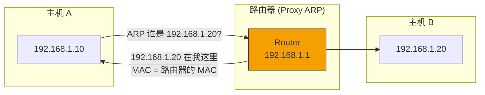
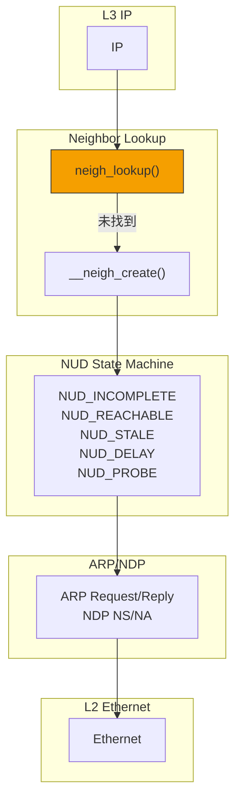

> [!info] Kernel Protocol Stack 深度探索系列 0. [[2026-04-13-kernel-protocol-stack-deep-dive-series-index|全栈学习路径总览]]
>
> 1. [[2026-04-13-kernel-protocol-stack-deep-dive-ch1-skbuff|第一章：sk_buff 与数据包生命周期]]
> 2. [[2026-04-13-kernel-protocol-stack-deep-dive-ch2-netdevice|第二章：Netdevice 与网卡抽象]]
> 3. [[2026-04-13-kernel-protocol-stack-deep-dive-ch3-ring-buffer|第三章：Ring Buffer 与 DMA]]
> 4. [[2026-04-13-kernel-protocol-stack-deep-dive-ch4-softirq|第四章：软中断与 ksoftirqd]]
> 5. [[2026-04-13-kernel-protocol-stack-deep-dive-ch5-napi|第五章：NAPI 与轮询模式]]
> 6. [[2026-04-13-kernel-protocol-stack-deep-dive-ch6-ethernet|第六章：Ethernet 与 MAC 层]]
> 7. [[2026-04-13-kernel-protocol-stack-deep-dive-ch7-bridge|第七章：网桥与 Switchdev]]
> 8. [[2026-04-13-kernel-protocol-stack-deep-dive-ch8-vlan|第八章：VLAN 与 802.1Q]]
> 9. [[2026-04-13-kernel-protocol-stack-deep-dive-ch9-macvlan|第九章：MACVLAN 与虚拟网卡]]
> 10. [[2026-04-13-kernel-protocol-stack-deep-dive-ch10-bonding|第十章：Bonding 与 teamd]]
> 11. [[2026-04-13-kernel-protocol-stack-deep-dive-ch11-ip-framing|第十一章：IP 协议封装]]
> 12. [[2026-04-13-kernel-protocol-stack-deep-dive-ch12-routing|第十二章：路由与 FIB]]
> 13. **第十三章：Neighbor 与 ARP**

---

## 1. 概述：Neighbor 子系统的角色

Neighbor（邻居）子系统负责维护 IP 地址到 MAC 地址的映射。在 IPv4 中这叫 ARP（Address Resolution Protocol），在 IPv6 中叫 NDP（Neighbor Discovery Protocol）。

**Neighbor 子系统的核心职责：**

1. **地址解析**：IP → MAC 的转换
2. **邻居状态管理**：跟踪相邻节点的可达性
3. **自动发现**：通过广播发现邻居
4. **重复地址检测**：检测 IP 地址冲突

```mermaid
graph LR
    subgraph "应用层"
        APP["应用"]
    end

    subgraph "L4"
        L4["TCP/UDP"]
    end

    subgraph "L3"
        L3["IP"]
    end

    subgraph "Neighbor"
        ARP["ARP/NDP"]
        NUD["NUD 状态机"]
    end

    subgraph "L2"
        ETH["Ethernet"]
    end

    APP --> L4 --> L3 --> ARP --> ETH

    style ARP fill:#f59f00,stroke:#333
```

---

## 2. Neighbor 数据结构

### 2.1 邻居条目结构

```c
// include/net/neighbour.h
struct neighbour {
    struct hlist_node       next;              // 哈希链表
    struct hlist_node     dbg_flags;
    struct net_device       *dev;             // 关联的网络设备
    struct neigh_table     *tbl;             // 所属的 neigh_table

    // 关键数据
    unsigned char           primary_key[8];    // IP 地址
    __u8                   addr[ETH_ALEN];   // MAC 地址
    struct hh_cache        *hh;               // 硬件头缓存

    // 状态
    unsigned long           used;              // 最后使用时间
    atomic_t                refcnt;            // 引用计数
    seqlock_t               lock;              // 保护锁
    unsigned int            confirmed;         // 确认时间
    unsigned int            updated;           // 更新时间
    unsigned int            stabled;           // 稳定时间

    // 状态机
    __u8                   nud_state;         // NUD_*

    // 操作函数
    int                     (*output)(struct neighbour *, struct sk_buff *);
    int                     (*connected_output)(struct neighbour *, struct sk_buff *);

    // Timer
    struct timer_list       timer;

    // 实际输出函数
    int                     (*ar_trans_output)(struct net *, struct sock *, struct sk_buff *);

    struct rcu_head         rcu;
};
```

### 2.2 NUD 状态

```c
// include/net/neighbour.h
enum {
    NUD_INCOMPLETE   = 0x01,   // 正在解析（等待响应）
    NUD_REACHABLE    = 0x02,   // 已确认可达
    NUD_STALE        = 0x04,   // 过期但可能可达
    NUD_DELAY        = 0x08,   // 等待确认中
    NUD_PROBE        = 0x10,   // 正在探测
    NUD_FAILED       = 0x20,   // 解析失败
    NUD_NOARP        = 0x40,   // 无需 ARP（如本地环回）
    NUD_PERMANENT    = 0x80,   // 永久条目
};
```

**状态转换图：**

```
                    ┌─────────────┐
         ARP 请求    │             │
    ───────────────▶│  NUD_NONE   │
                    │             │
                    └─────────────┘
                            │
                            ▼
                    ┌─────────────┐
                    │ NUD_STALE   │◀──────────┐
                    │ (初始状态)   │           │
                    └─────────────┘           │
                            │                 │
                            │ 确认可达         │ 超时
                            ▼                 │
                    ┌─────────────┐           │
                    │ NUD_REACHABLE│───────────┘
                    │ (正常状态)   │
                    └─────────────┘
                            │
                            │ 流量时刷新
                            ▼
                    ┌─────────────┐
                    │   NUD_DELAY │────────────┘
                    │ (等待探测)  │
                    └─────────────┘
                            │
                            ▼
                    ┌─────────────┐
                    │  NUD_PROBE  │
                    │ (正在探测)  │
                    └─────────────┘
                            │
                            ▼
                    ┌─────────────┐
                    │  NUD_STALE  │
                    │   或        │
                    │ NUD_FAILED  │
                    └─────────────┘
```

### 2.3 neigh_table 结构

```c
// include/net/neighbour.h
struct neigh_table {
    int                     family;           // AF_INET 或 AF_INET6
    int                     entry_size;       // 条目大小
    int                     key_len;         // 键长度（IP 地址长度）

    // 哈希函数
    __u32                   (*hash)(const void *pkey,
                                    const struct net_device *dev);

    // 构造函数和比较函数
    int                     (*constructor)(struct neighbour *);
    int                     (*pconstructor)(struct pneigh_entry *);

    // 探测函数
    void                    (*proxy_redo)(struct sk_buff *skb);

    char                    *id;             // 表名 ("arp_cache", "nd_cache")
    struct neigh_parms      parms;           // 默认参数

    // 哈希表
    struct hlist_head       *hash_buckets;
    unsigned int            hash_mask;
    atomic_t                 hash_size;

    // Timer
    struct timer_list       proxy_timer;

    // 输出函数
    void                    (*output)(struct net *, struct sock *, struct sk_buff *);

    // 统计
    atomic_t                 allocs;
    atomic_t                 destroys;
    atomic_t                 hash_grows;

    // LRU 列表
    struct list_head        proxy_queue;
    struct fnic_list        gc_list;         // GC 列表
};
```

---

## 3. ARP 协议详解

### 3.1 ARP 帧格式

```
┌──────────┬──────────┬──────────┬───────────────┐
│ Hardware │ Protocol │ HLen | PLen | Operation     │
│ Type     | Type    │                │              │
│ 2 bytes  | 2 bytes │ 1B    | 1B     │ 2 bytes       │
├──────────┴──────────┼──────────┼──────────────────┤
│ Sender HW Address   │ Sender Protocol Address    │
│ (6 bytes MAC)       │ (4 bytes IPv4)              │
├─────────────────────┴─────────────────────────────┤
│ Target HW Address  │ Target Protocol Address      │
│ (6 bytes MAC)      │ (4 bytes IPv4)               │
└─────────────────────┴─────────────────────────────┘
                      ◄─── 28 bytes ────►
```

### 3.2 ARP 操作码

```c
// include/uapi/linux/if_arp.h
#define ARPOP_REQUEST    1   // ARP 请求
#define ARPOP_REPLY      2   // ARP 响应
#define ARPOP_RREQUEST   3   // RARP 请求
#define ARPOP_RREPLY     4   // RARP 响应
#define ARPOP_InREQUEST  5   // InARP 请求
#define ARPOP_InREPLY    6   // InARP 响应
#define ARPOP_NAK        7   // ARP NAK
```

### 3.3 ARP 接收处理

```c
// net/ipv4/arp.c
int arp_rcv(struct sk_buff *skb, struct net_device *dev,
            struct packet_type *pt, struct net_device *orig_dev)
{
    struct arphdr *arp;
    unsigned char *arp_ptr;
    __be32 sip, tip;
    unsigned char *sha, *tha;

    // 1. 检查长度
    if (!pskb_may_pull(skb, arp_hdr_len(dev)))
        goto freeskb;

    arp = arp_hdr(skb);

    // 2. 检查协议类型（只处理 Ethernet/IP）
    if (arp->ar_hrd != htons(ARPHRD_ETHER) ||
        arp->ar_pro != htons(ETH_P_IP) ||
        arp->ar_hln != ETH_ALEN ||
        arp->ar_pln != 4)
        goto freeskb;

    // 3. 提取字段
    arp_ptr = (unsigned char *)(arp + 1);
    sha = arp_ptr;                    // Sender MAC
    arp_ptr += ETH_ALEN;
    memcpy(&sip, arp_ptr, 4);          // Sender IP
    arp_ptr += 4;
    tha = arp_ptr;                     // Target MAC
    arp_ptr += ETH_ALEN;
    memcpy(&tip, arp_ptr, 4);          // Target IP

    // 4. 学习发送者的 MAC -> IP 映射
    neigh_update(neigh, sha, NUD_REACHABLE, ...);

    // 5. 处理 ARP 请求
    if (arp->ar_op == htons(ARPOP_REQUEST)) {
        // 是请求本机的 IP 吗？
        if (inet_addr_on_dev(ip_dev_find(dev_net(dev), dev, tip)))
            arp_send_reply(dev, sip, tip, sha);
    }

freeskb:
    kfree_skb(skb);
    return 0;
}
```

### 3.4 ARP 表查找与创建

```c
// net/ipv4/arp.c
struct neighbour *arp_lookup(struct net *net, __be32 pkey,
                           struct net_device *dev,
                           bool skip)
{
    struct neigh_table *tbl = &arp_tbl;
    struct neighbour *n;
    uint hash = tbl->hash(pkey, dev);

    // 在哈希表中查找
    rcu_read_lock_bh();
    for (n = rcu_dereference_bh(tbl->hash_buckets[hash]);
         n != NULL;
         n = rcu_dereference_bh(n->next)) {
        if (n->dev == dev &&
            *(__be32 *)n->primary_key == pkey) {
            // 找到匹配的邻居条目
            if (skip && (n->nud_state & NUD_NOARP))
                continue;
            neigh_hold(n);
            goto out;
        }
    }
    n = NULL;

out:
    rcu_read_unlock_bh();
    return n;
}
```

---

## 4. 邻居状态机

### 4.1 邻居创建

```c
// net/ipv4/arp.c
struct neighbour *__neigh_create(struct neigh_table *tbl,
                                const void *pkey,
                                struct net_device *dev)
{
    struct neighbour *n;
    int err;

    // 1. 分配邻居条目
    n = kmem_cache_alloc(tbl->kmem_cachep, GFP_ATOMIC);
    if (!n)
        return NULL;

    // 2. 初始化
    n->tbl = tbl;
    n->dev = dev;
    dev_hold(dev);

    // 3. 调用构造函数
    if (tbl->constructor) {
        err = tbl->constructor(n);
        if (err)
            goto out;
    }

    // 4. 插入哈希表
    hash = tbl->hash(pkey, dev);
    rcu_assign_pointer(n->next, tbl->hash_buckets[hash]);
    rcu_assign_pointer(tbl->hash_buckets[hash], n);

    atomic_inc(&tbl->allocs);
    return n;

out:
    neigh_release(n);
    return NULL;
}
```

### 4.2 邻居更新

```c
// net/core/neighbour.c
int neigh_update(struct neighbour *neigh, const u8 *lladdr,
                u8 new, __u32 flags)
{
    unsigned long now = jiffies;
    int notify = 0;

    write_seqlock_bh(&neigh->lock);

    // 检查是否改变
    if (lladdr && memcmp(lladdr, neigh->ha, dev->addr_len) != 0) {
        // MAC 地址改变
        if (new != NUD_STALE)
            notify = 1;
    }

    // 更新 MAC
    if (lladdr)
        memcpy(neigh->ha, lladdr, dev->addr_len);

    // 更新状态
    neigh->updated = jiffies;

    if (new & NUD_CONNECTED)
        neigh->confirmed = now;

    neigh->nud_state = new;

    // 状态变化后的处理
    if (new == NUD_REACHABLE)
        neigh_timer_start(neigh, neigh->parms->reachable_time);

    write_sequnlock_bh(&neigh->lock);

    if (notify)
        neigh_update_notify(neigh);

    return 0;
}
```

### 4.3 邻居探测

```c
// net/core/neighbour.c
static void neigh_probe(struct neighbour *neigh)
{
    struct sk_buff *skb;

    // 创建 ARP 请求
    skb = neigh->ar_trans_output(neigh->dev, NULL, skb);

    if (skb) {
        // 发送 ARP 请求
        __dev_queue_xmit(skb);
    }
}
```

---

## 5. Proxy ARP

### 5.1 Proxy ARP 原理

Proxy ARP 允许路由器代替其他主机响应 ARP 请求：



### 5.2 Proxy ARP 配置

```bash
# 启用 Proxy ARP
echo 1 > /proc/sys/net/ipv4/conf/eth0/proxy_arp
echo 1 > /proc/sys/net/ipv4/conf/all/proxy_arp

# 设置 Proxy ARP 范围
echo 1 > /proc/sys/net/ipv4/conf/eth0/proxy_arp_collect
echo 2048 > /proc/sys/net/ipv4/neigh/eth0/base_reachable_time

# 查看 Proxy ARP 条目
ip neigh show proxy
```

### 5.3 Proxy ARP 实现

```c
// net/ipv4/arp.c
static int arp_process(struct net *net, struct sock *sk, struct sk_buff *skb)
{
    // ...
    if (IN_DEV_CONF_GET(in_dev, PROXY_ARP)) {
        // 检查是否是 Proxy ARP 请求
        if (arp->ar_op == htons(ARPOP_REQUEST)) {
            // 检查是否有 Proxy ARP 条目
            if (ipv4_is_lbcast(tip) ||
                pneigh_lookup(&arp_tbl, &tip, dev, 0)) {
                // 发送 Proxy ARP 响应
                arp_send_reply(dev, sip, tip, dev->dev_addr);
            }
        }
    }
    // ...
}
```

---

## 6. Gratuitous ARP

### 6.1 什么是 Gratuitous ARP

Gratuitous ARP（免费 ARP）是主机主动发送的 ARP 广播，用于：

1. **IP 地址变更通知**：宣告 IP 已迁移到新的 MAC
2. **MAC 地址变更通知**：宣告 MAC 地址已改变
3. **更新其他主机的 ARP 缓存**：防止旧条目残留
4. **冲突检测**：检测是否有其他主机使用相同 IP

### 6.2 Gratuitous ARP 格式

```
Sender IP = 本机 IP
Target IP = 本机 IP (与 sender 相同)
Sender MAC = 本机 MAC
Target MAC = 00:00:00:00:00:00
```

### 6.3 Gratuitous ARP 实现

```c
// net/ipv4/arp.c
void arp_send_gratuitous(struct net_device *dev)
{
    struct sk_buff *skb;
    struct arphdr *arp;
    unsigned char *arp_ptr;

    // 分配 skb
    skb = alloc_skb(arp_hdr_len(dev) + LL_ALLOCATED_SPACE(dev), GFP_ATOMIC);
    if (!skb)
        return;

    // 填充 ARP 头部
    arp = arp_hdr(skb);
    arp->ar_op = htons(ARPOP_REQUEST);
    arp->ar_pro = htons(ETH_P_IP);

    // Sender IP = Target IP = 本机 IP
    arp_ptr = (unsigned char *)(arp + 1);
    memcpy(arp_ptr, dev->dev_addr, ETH_ALEN);
    arp_ptr += ETH_ALEN;
    memcpy(arp_ptr, &dev->ip_ptr, 4);
    arp_ptr += 4;
    memset(arp_ptr, 0, ETH_ALEN);  // Target MAC = 0
    arp_ptr += ETH_ALEN;
    memcpy(arp_ptr, &dev->ip_ptr, 4);

    // 发送
    dev_queue_xmit(skb);
}
```

---

## 7. IPv6 NDP (Neighbor Discovery Protocol)

### 7.1 NDP 消息类型

| ICMPv6 Type | 名称                   | 用途                      |
| ----------- | ---------------------- | ------------------------- |
| 133         | Router Solicitation    | 主机请求路由器信息        |
| 134         | Router Advertisement   | 路由器宣告信息            |
| 135         | Neighbor Solicitation  | 邻居请求（类似 ARP）      |
| 136         | Neighbor Advertisement | 邻居宣告（类似 ARP 响应） |
| 137         | Redirect               | 重定向                    |

### 7.2 NDP 数据结构

```c
// include/net/ndisc.h
struct nd_msg {
    struct icmp6hdr        icmph;             // ICMPv6 头
    struct in6_addr        target;            // 目标地址
    unsigned char          opt[0];            // 选项
};

// NDP 选项
struct nd_opt_hdr {
    __u8            type;                      // 选项类型
    __u8            len;                       // 长度（8 字节为单位）
};
```

### 7.3 NDP 与 ARP 的对比

| 功能         | IPv4 ARP              | IPv6 NDP                            |
| ------------ | --------------------- | ----------------------------------- |
| 地址解析     | ARP Request/Reply     | Neighbor Solicitation/Advertisement |
| 路由发现     | ICMP Router Discovery | Router Solicitation/Advertisement   |
| 重复地址检测 | ARP Probe             | Neighbor Solicitation               |
| 重定向       | ICMP Redirect         | Redirect                            |

---

## 8. 邻居表管理

### 8.1 查看邻居表

```bash
# 查看 ARP 表
ip neigh show
arp -a

# 查看 IPv6 邻居
ip -6 neigh show

# 查看详细邻居信息
ip neigh show dev eth0

# 查看 nud 状态统计
cat /proc/net/stat/nf_conntrack
```

### 8.2 操作邻居条目

```bash
# 添加静态 ARP 条目
ip neigh add 192.168.1.100 lladdr aa:bb:cc:dd:ee:ff dev eth0 nud permanent

# 添加 reachable 条目
ip neigh add 192.168.1.100 lladdr aa:bb:cc:dd:ee:ff dev eth0 nud reachable

# 删除邻居条目
ip neigh del 192.168.1.100 dev eth0

# 清空邻居表
ip neigh flush all
ip neigh flush dev eth0
```

### 8.3 邻居表调优

```bash
# 查看邻居表参数
ip neigh show

# 配置 reachable_time
echo 30000 > /proc/sys/net/ipv4/neigh/default/base_reachable_time

# 配置 gc_thresh
echo 1024 > /proc/sys/net/ipv4/neigh/default/gc_thresh1
echo 2048 > /proc/sys/net/ipv4/neigh/default/gc_thresh2
echo 4096 > /proc/sys/net/ipv4/neigh/default/gc_thresh3
```

---

## 9. 总结



**Neighbor 关键点：**

1. **neigh_table**：管理特定协议族（IPv4/IPv6）的所有邻居条目
2. **NUD 状态机**：管理邻居的可达性状态
3. **ARP**：IPv4 的 IP → MAC 解析协议
4. **NDP**：IPv6 的邻居发现协议
5. **Proxy ARP**：路由器代替其他主机响应 ARP
6. **Gratuitous ARP**：主动宣告 IP-MAC 映射变化
7. **邻居超时**：STALE → DELAY → PROBE → REACHABLE 流程
8. **GC 回收**：定期清理过期的邻居条目
