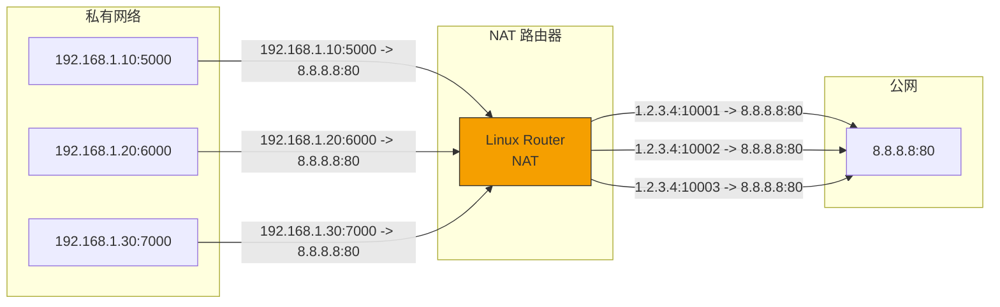
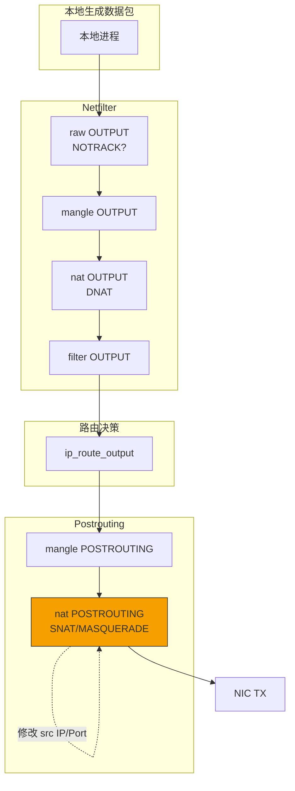
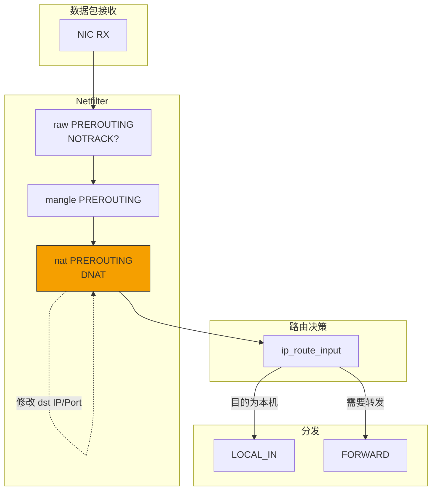
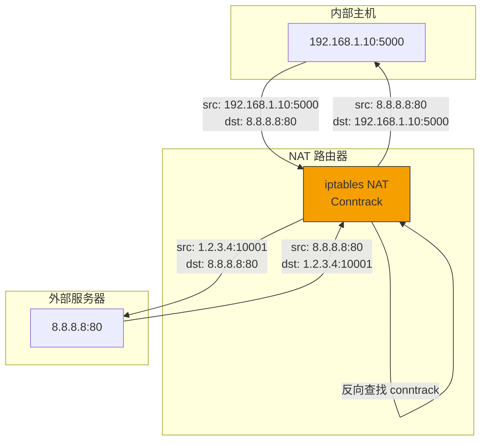

> [!info] Kernel Protocol Stack 深度探索系列
> 0. [[2026-04-13-kernel-protocol-stack-deep-dive-series-index|全栈学习路径总览]]
> 1. [[2026-04-13-kernel-protocol-stack-deep-dive-ch1-skbuff|第一章：sk_buff 与数据包生命周期]]
> 2. [[2026-04-13-kernel-protocol-stack-deep-dive-ch2-netdevice|第二章：Netdevice 与网卡抽象]]
> 3. [[2026-04-13-kernel-protocol-stack-deep-dive-ch3-ring-buffer|第三章：Ring Buffer 与 DMA]]
> 4. [[2026-04-13-kernel-protocol-stack-deep-dive-ch4-softirq|第四章：软中断与 ksoftirqd]]
> 5. [[2026-04-13-kernel-protocol-stack-deep-dive-ch5-napi|第五章：NAPI 与轮询模式]]
> 6. [[2026-04-13-kernel-protocol-stack-deep-dive-ch6-ethernet|第六章：Ethernet 与 MAC 层]]
> 7. [[2026-04-13-kernel-protocol-stack-deep-dive-ch7-bridge|第七章：网桥与 Switchdev]]
> 8. [[2026-04-13-kernel-protocol-stack-deep-dive-ch8-vlan|第八章：VLAN 与 802.1Q]]
> 9. [[2026-04-13-kernel-protocol-stack-deep-dive-ch9-macvlan|第九章：MACVLAN 与虚拟网卡]]
> 10. [[2026-04-13-kernel-protocol-stack-deep-dive-ch10-bonding|第十章：Bonding 与 teamd]]
> 11. [[2026-04-13-kernel-protocol-stack-deep-dive-ch11-ip-framing|第十一章：IP 协议封装]]
> 12. [[2026-04-13-kernel-protocol-stack-deep-dive-ch12-routing|第十二章：路由与 FIB]]
> 13. [[2026-04-13-kernel-protocol-stack-deep-dive-ch13-neighbor|第十三章：Neighbor 与 ARP]]
> 14. [[2026-04-13-kernel-protocol-stack-deep-dive-ch14-iptables|第十四章：iptables 基础]]
> 15. [[2026-04-13-kernel-protocol-stack-deep-dive-ch15-conntrack|第十五章：连接跟踪 Conntrack]]
> 16. **第十六章：NAT 与地址转换**

---

## 1. 概述：NAT 的作用与类型

NAT（Network Address Translation，网络地址转换）解决 IPv4 地址枯竭问题，允许私有网络中的多个主机共享少量公网 IP 访问互联网。

**NAT 的核心功能：**

1. **节省公网 IP**：多个私有 IP 映射到少量公网 IP
2. **安全隔离**：隐藏内部网络结构
3. **端口复用**：多个内部主机共享同一公网 IP
4. **负载分担**：基于 NAT 的服务器负载均衡



---

## 2. NAT 类型详解

### 2.1 SNAT（Source NAT）

修改数据包的**源 IP 和/或源端口**：

| 类型 | 说明 |
|------|------|
| 基础 SNAT | 固定源 IP（1:1 映射） |
| IP 伪装 (Masquerade) | 自动使用出口接口 IP |
| 端口伪装 | 同时修改源端口（端口复用） |

```bash
# 基础 SNAT
iptables -t nat -A POSTROUTING -s 192.168.1.0/24 -j SNAT --to-source 1.2.3.4

# 端口范围 SNAT
iptables -t nat -A POSTROUTING -s 192.168.1.0/24 -j SNAT --to-source 1.2.3.4:10000-20000

# Masquerade（自动使用出口 IP）
iptables -t nat -A POSTROUTING -o eth0 -j MASQUERADE
```

### 2.2 DNAT（Destination NAT）

修改数据包的**目的 IP 和/或目的端口**：

| 类型 | 说明 |
|------|------|
| 基础 DNAT | 固定目的 IP（端口映射） |
| 端口转发 | 将外部端口映射到内部主机 |
| 负载均衡 | 一对多 DNAT |

```bash
# 基础 DNAT
iptables -t nat -A PREROUTING -d 1.2.3.4 --dport 80 -j DNAT --to-destination 192.168.1.100

# 端口转发
iptables -t nat -A PREROUTING -p tcp --dport 8080 -j REDIRECT --to-ports 80

# 负载均衡
iptables -t nat -A PREROUTING -p tcp --dport 80 -j DNAT --to-destination 192.168.1.100-192.168.1.102
```

### 2.3 Full Cone vs Restricted Cone

| NAT 类型 | 说明 | 连接限制 |
|---------|------|---------|
| **Full Cone** | 任何外部主机都可以通过映射端口连接 | 无限制 |
| **Restricted Cone** | 只有映射时访问过的外部主机可以连接 | 限制源 IP |
| **Port Restricted Cone** | 只有映射时访问过的 (IP,Port) 可以连接 | 限制源 IP:Port |
| **Symmetric** | 每个 (源IP, 源端口, 目的IP, 目的端口) 有独立映射 | 最严格 |

---

## 3. NAT 数据结构

### 3.1 NAT 辅助结构

```c
// include/net/netfilter/nf_nat.h
struct nf_conn_nat {
    // NAT 方向
    enum nf_nat_manip_type maniptype;
    
    // NAT 信息
    struct nf_conn_nat_info info;
    
    // 关联的 conntrack
    struct nf_conn          *ct;
};

// NAT 协议特定信息
struct nf_nat_l4proto {
    __u16 protonum;           // IPPROTO_TCP/UDP/ICMP
    
    // 端口范围
    int (*nlat_to_protonum)(struct nf_conntrack_tuple *);
    
    // 范围初始化
    void (*nlat_to_range)(struct nf_conntrack_tuple *,
                         struct nf_nat_range2 *);
};
```

### 3.2 NAT 映射结构

```c
// include/net/netfilter/nf_nat.h
struct nf_nat_tuple {
    struct nf_conntrack_tuple     src;    // 源元组
    struct nf_conntrack_tuple     dst;    // 目的元组
};

// NAT 范围
struct nf_nat_range2 {
    unsigned int                flags;       // NAT 标志
    struct nf_nat_addr         min_addr;    // 最小地址
    struct nf_nat_addr         max_addr;    // 最大地址
    union nf_nat_conntrack_proto min_proto;  // 最小端口
    union nf_nat_conntrack_proto max_proto;  // 最大端口
};

// NAT 标志
enum nf_nat_manip_type {
    NF_NAT_MANIP_SRC,          // SNAT
    NF_NAT_MANIP_DST           // DNAT
};

enum nf_nat_flags {
    NF_NAT_RANGE_MAP_IPS       = (1 << 0),
    NF_NAT_RANGE_PROTO_SPECIFIED = (1 << 1),
    NF_NAT_RANGE_PROTO_RANDOM  = (1 << 2),
    NF_NAT_RANGE_PERSISTENT    = (1 << 3),
    NF_NAT_RANGE_NAT_EXTERNAL_IPS = (1 << 4),
};
```

### 3.3 连接中的 NAT 状态

```c
// include/net/netfilter/nf_conntrack.h
struct nf_conn {
    // ... 其他字段 ...
    
    /* NAT 状态 */
    union {
        struct nf_conn_nat     *nat;
        struct nf_conntrack_nat_extension *nat_ext;
    }NAT;
    
    /* status 中的 NAT 标志 */
    // IPS_SRC_NAT, IPS_DST_NAT, IPS_SRC_NAT_DONE, IPS_DST_NAT_DONE
};
```

---

## 4. NAT 处理流程

### 4.1 SNAT 流程（出站）



### 4.2 DNAT 流程（入站）



### 4.3 NAT 转换代码

```c
// net/netfilter/nf_nat_core.c
static unsigned int nf_nat_fn(void *priv, struct sk_buff *skb,
                              const struct nf_hook_state *state)
{
    struct nf_conn *ct;
    enum ip_conntrack_info ctinfo;
    enum nf_nat_manip_type maniptype = HOOK2MANIP(state->hook);
    
    // 1. 连接跟踪查找
    ct = nf_ct_get(skb, &ctinfo);
    if (!ct)
        return NF_ACCEPT;
    
    // 2. 跳过已 NAT 的包
    if (ct->status & IPS_SRC_NAT_DONE && ct->status & IPS_DST_NAT_DONE)
        return NF_ACCEPT;
    
    // 3. 应用 NAT 规则
    if (maniptype == NF_NAT_MANIP_SRC)
        nf_ip_snat(skb, state, ct, ctinfo);
    else
        nf_ip_dnat(skb, state, ct, ctinfo);
    
    return NF_ACCEPT;
}

// TCP/UDP 端口修改
static void nf_nat_l4proto_snat(struct sk_buff *skb,
                                 struct nf_conn *ct,
                                 enum ip_conntrack_info ctinfo)
{
    struct tcphdr *tcph;
    __be16 *portptr;
    
    if (skb_ensure_writable(skb, skb->transport_header + sizeof(*tcph)))
        return;
    
    tcph = tcp_hdr(skb);
    
    // 修改源端口
    portptr = &tcph->source;
    *portptr = ct->tuplehash[IP_CT_DIR_ORIGINAL].tuple.src.u.tcp.port;
    
    // 重新计算校验和
    inet_proto_csum_replace4(&tcph->check, skb,
                            ct->tuplehash[IP_CT_DIR_REPLY].tuple.src.u.tcp.port,
                            *portptr, true);
}
```

---

## 5. 连接跟踪中的 NAT

### 5.1 NAT 与 Conntrack 协作

NAT 依赖 Conntrack 实现：

1. **连接创建**：NAT 创建新的 conntrack 条目
2. **反向查找**：回复包通过 conntrack 找到原始映射
3. **序列号调整**：TCP 序列号需要调整

```c
// NAT 双向跟踪
struct nf_conntrack_tuple {
    union nf_conntrack_man_proto  u;
};

struct nf_conn {
    tuplehash[IP_CT_DIR_ORIGINAL]   // 原始方向的 tuple
    tuplehash[IP_CT_DIR_REPLY]      // 回复方向的 tuple (反向 IP/Port)
};
```

### 5.2 回复包自动反向

```c
// 回复包自动 SNAT -> DNAT
// 例如：内部 192.168.1.10:5000 -> 1.2.3.4:10001

// 原始包：
//   src: 192.168.1.10:5000
//   dst: 8.8.8.8:80

// 转换后：
//   src: 1.2.3.4:10001
//   dst: 8.8.8.8:80

// 回复包（conntrack 自动反向）：
//   src: 8.8.8.8:80
//   dst: 1.2.3.4:10001

// 转换前（conntrack 自动反向查找）：
//   src: 8.8.8.8:80
//   dst: 192.168.1.10:5000
```

### 5.3 NAT 超时与生命周期

```bash
# NAT 连接超时
echo 3600 > /proc/sys/net/netfilter/nf_conntrack_generic_timeout

# TCP NAT 超时
echo 7200 > /proc/sys/net/netfilter/nf_conntrack_tcp_timeout_established

# UDP NAT 超时
echo 300 > /proc/sys/net/netfilter/nf_conntrack_udp_timeout
```

---

## 6. 端口冲突与解决

### 6.1 端口复用算法

当多个内部主机使用相同源端口时，NAT 需要分配不同的外部端口：

```c
// net/netfilter/nf_nat_core.c
static bool nf_nat_find_port(struct nf_conntrack_tuple *tuple, 
                              struct nf_nat_l4proto *l4proto)
{
    // 端口分配算法：
    // 1. 首先尝试保留原始端口
    // 2. 如果冲突，尝试端口范围
    // 3. 随机选择可用端口
    
    unsigned int i, min, max;
    
    min = l4proto->nlat_to_range.min;
    max = l4proto->nlat_to_range.max;
    
    for (i = 0; i < max - min + 1; i++) {
        port = htons(min + (i + atomic_read(&nf_conntrack_count) % (max - min + 1)));
        if (!nf_nat_used_ports(port, ...)) {
            return port;
        }
    }
    
    return 0;  // 没有可用端口
}
```

### 6.2 端口冲突示例

```
内部主机 A: 192.168.1.10:5000
内部主机 B: 192.168.1.20:5000

NAT 映射:
  192.168.1.10:5000 -> 1.2.3.4:10001
  192.168.1.20:5000 -> 1.2.3.4:10002
```

---

## 7. 高级 NAT 配置

### 7.1 负载均衡 DNAT

```bash
# 使用 iptables NAT 链实现简单负载均衡
iptables -t nat -A PREROUTING -p tcp --dport 80 \
    -m statistic --mode random --probability 0.33 \
    -j DNAT --to-destination 192.168.1.100:80

iptables -t nat -A PREROUTING -p tcp --dport 80 \
    -m statistic --mode random --probability 0.5 \
    -j DNAT --to-destination 192.168.1.101:80

iptables -t nat -A PREROUTING -p tcp --dport 80 \
    -j DNAT --to-destination 192.168.1.102:80
```

### 7.2 一对多 NAT（PAT）

```bash
# 将整个私有网络映射到单个公网 IP
iptables -t nat -A POSTROUTING -s 192.168.1.0/24 -o eth0 -j MASQUERADE

# 等价于：
iptables -t nat -A POSTROUTING -s 192.168.1.0/24 -o eth0 \
    -j SNAT --to-source $(ip -4 addr show eth0 | grep -oP '(?<=inet\s)\d+(\.\d+){3}')
```

### 7.3 双向 NAT

```bash
# 同时配置 SNAT 和 DNAT
# 场景：内网服务器需要同时被外部访问和访问外部

# DNAT：外部访问内网服务器
iptables -t nat -A PREROUTING -i eth0 -d 1.2.3.4 --dport 80 \
    -j DNAT --to-destination 192.168.1.100

# SNAT：内网服务器访问外部时使用固定 IP
iptables -t nat -A POSTROUTING -s 192.168.1.100 -o eth0 \
    -j SNAT --to-source 1.2.3.4
```

---

## 8. NAT 与应用程序

### 8.1 NAT 对应用的影响

某些应用程序需要了解自己的公网 IP/端口：

| 应用 | 问题 | 解决方案 |
|------|------|---------|
| FTP | 控制通道携带 IP 信息 | FTP Helper |
| SIP | SIP 头携带私有 IP | SIP Helper |
| H.323 | 携带 IP 地址 | H.323 Helper |
| IRC | DCC 携带 IP 信息 | IRC Helper |
| BitTorrent | Tracker 通信 | 应用层代理 |

### 8.2 NAT 穿透技术

**STUN (Session Traversal Utilities for NAT):**

```bash
# 安装 STUN 服务器
apt-get install stun

# 客户端查询 STUN 服务器获取公网映射
stun stun.l.google.com:19302
```

**TURN (Traversal Using Relays around NAT):**

```bash
# 中继模式：所有流量通过中继服务器
# 用于对称 NAT
```

**ICE (Interactive Connectivity Establishment):**

- 尝试 STUN
- 失败时回退到 TURN

---

## 9. NAT 调试与排查

### 9.1 查看 NAT 状态

```bash
# 查看 NAT 表
cat /proc/net/nf_conntrack | grep NAT

# 查看 NAT 映射
iptables -t nat -L -n -v

# 查看转换统计
cat /proc/net/stat/nf_conntrack

# 使用 conntrack-tools
conntrack -L -p tcp --src 192.168.1.10
conntrack -L -p tcp --dst 1.2.3.4
```

### 9.2 常见问题

**问题：连接建立后无响应**

```bash
# 检查 conntrack 是否正常工作
cat /proc/sys/net/netfilter/nf_conntrack_max

# 检查是否有足够的连接跟踪条目
dmesg | grep "nf_conntrack"
```

**问题：外部无法访问内网服务**

```bash
# 确认 DNAT 规则存在
iptables -t nat -L -n -v | grep DNAT

# 确认 FORWARD 规则允许流量
iptables -L FORWARD -n -v

# 检查 IP forwarding
cat /proc/sys/net/ipv4/ip_forward
```

**问题：NAT 连接超时**

```bash
# 增加超时时间
echo 7200 > /proc/sys/net/netfilter/nf_conntrack_tcp_timeout_established

# 关闭反向路径过滤
echo 0 > /proc/sys/net/ipv4/conf/all/rp_filter
```

---

## 10. 总结



**NAT 关键点：**

1. **SNAT**：修改源 IP/端口，用于内部主机访问外部
2. **DNAT**：修改目的 IP/端口，用于外部访问内部服务
3. **MASQUERADE**：自动使用出口接口 IP
4. **Conntrack 依赖**：NAT 依赖连接跟踪实现双向流
5. **端口复用**：多个内部主机可共享同一公网 IP
6. **协议 Helpers**：FTP/SIP 等需要 Helper 理解应用层协议
7. **NAT 类型**：Full Cone、Restricted Cone、Port Restricted、Symmetric
8. **调试**：查看 /proc/net/nf_conntrack 和 iptables -t nat -L
