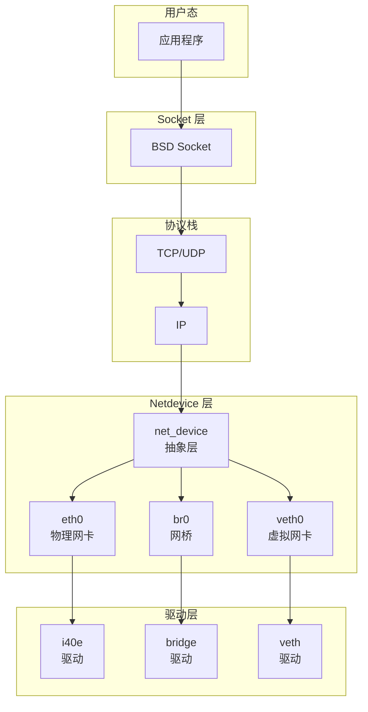
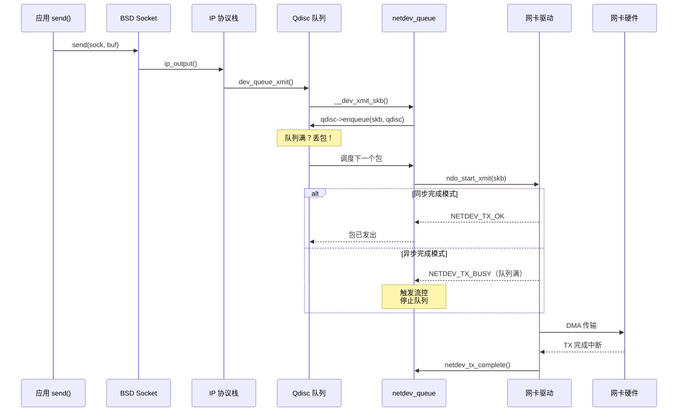
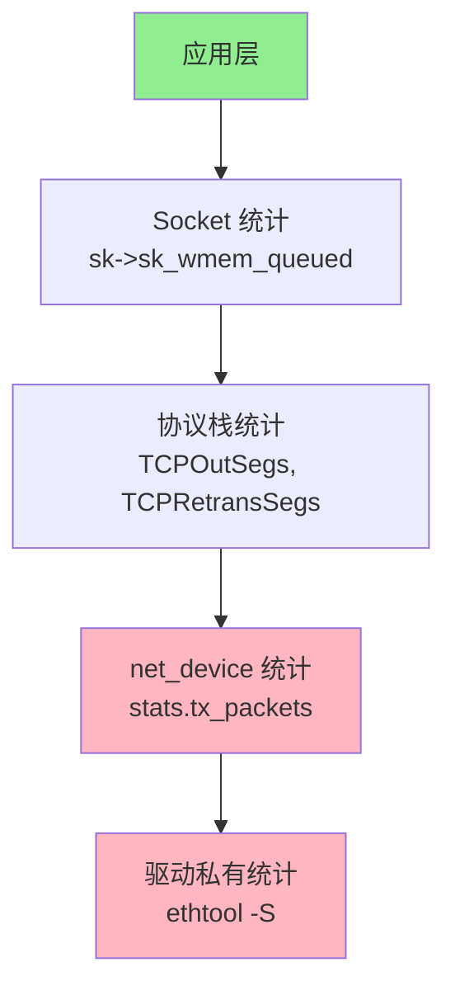

> [!info] Kernel Protocol Stack 深度探索系列
> 0. [[2026-04-13-kernel-protocol-stack-deep-dive-series-index|全栈学习路径总览]]
> 1. [[2026-04-13-kernel-protocol-stack-deep-dive-ch1-skbuff|第一章：sk_buff 与数据包生命周期]]
> 2. **第二章：Netdevice 与网卡抽象**
> 3. [[2026-04-13-kernel-protocol-stack-deep-dive-ch3-ring-buffer|第三章：Ring Buffer 与 DMA]]
> 4. [[2026-04-13-kernel-protocol-stack-deep-dive-ch4-softirq|第四章：软中断与 ksoftirqd]]
> 5. [[2026-04-13-kernel-protocol-stack-deep-dive-ch5-napi|第五章：NAPI 与轮询模式]]
> 6. [[2026-04-13-kernel-protocol-stack-deep-dive-ch6-ethernet|第六章：Ethernet 与 MAC 层]]

---

## 1. 概述：为什么需要 net_device 抽象？

Linux 内核网络栈的设计哲学是**一切皆文件**的扩展——但与字符设备/块设备不同，网络设备没有通用的 open/close/read/write 界面，而是定义了专属的 **net_device** 抽象层。这一层解决的问题是：

1. **统一异构硬件**：从千兆以太网到无线网卡、从虚拟网卡到 VPN 隧道，内核需要用同一套接口操作它们
2. **协议栈解耦**：上层协议栈（IP、TCP）不关心底层是 PCIe 网卡还是 virtio——它们只与 net_device 交互
3. **资源隔离**：每个 net_device 拥有独立的发送队列、统计计数、QoS 规则、功耗管理



---

## 2. net_device 结构：网卡在内核中的表示

### 2.1 核心数据结构

`net_device` 是内核网络子系统最复杂的结构体之一（2000+ 行），它既是设备驱动程序的 C 语言"对象"，也是内核管理网络资源的"句柄"：

```c
// include/linux/netdevice.h
struct net_device {
    /* === 1. 身份标识（Name）=== */
    char            name[IFNAMSIZ];      // "eth0", "wlan0", "br0"
    
    /* === 2. 硬件信息 === */
    unsigned long       mem_end;          // 设备内存结束地址
    unsigned long       mem_start;        // 设备内存起始地址
    unsigned long       base_addr;        // I/O 基地址（legacy ISA）
    unsigned int        irq;              // 中断号
    
    /* === 3. 协议层头信息（用于快速路径） === */
    unsigned short      hard_header_len;  // 硬件头长度（Ethernet = 14）
    unsigned short      needed_headroom;   // 发送时需要的最小 headroom
    unsigned short      needed_tailroom;   // 发送时需要的最小 tailroom
    
    unsigned char       *dev_addr;        // MAC 地址（永久）
    unsigned char       *broadcast;       // 广播地址
    unsigned short      type;             // ARPHRD_ETHER, ARPHRD_LOOPBACK, ...
    unsigned short      mtu;              // 最大传输单元（默认 1500）
    unsigned short      max_mtu;          // 最大允许 MTU
    
    /* === 4. 发送队列（Multi-Queue 支持）=== */
    unsigned int        num_tx_queues;     // TX 队列数量
    unsigned int        real_num_tx_queues;  // 实际激活的队列数
    struct Qdisc        *qdisc;           // 排队规则（默认 pfifo_fast）
    struct netdev_queue *_tx_q;           // TX 队列数组（每个队列一个）
    
    /* === 5. 接收相关 === */
    unsigned int        num_rx_queues;     // RX 队列数量（需要 RSS）
    struct sk_buff      *(*ndo_dflt_recv)(struct sk_buff *);
    
    /* === 6. 驱动回调函数（函数指针）=== */
    const struct net_device_ops *netdev_ops;  // 核心操作集
    
    /* === 7. PHY/MII 相关 === */
    struct phy_device   *phydev;          // PHY 设备（自动协商）
    int                 link;              // 链路状态（up/down）
    u32                 speed;             // 链路速度（Mbps）
    u8                  duplex;            // 双工模式（0=half, 1=full）
    
    /* === 8. 统计（频繁访问，热路径）=== */
    struct net_device_stats  stats;        // 标准统计
    atomic_long_t      tc_setup形;         // TC offload 计数
    
    /* === 9. 电源管理 === */
    struct dev_pm_qos_request *pm_qos_request;
    
    /* === 10. 设备锁 === */
    spinlock_t          addr_list_lock;    // MAC 地址列表锁
    struct netdev_hw_addr_list  uc;        // 单播地址列表
    struct netdev_hw_addr_list  mc;        // 多播地址列表
    
    /* === 11. netns 隔离 === */
    struct net          *nd_net;           // 所属网络命名空间
    
    /* ... 150+ 更多字段 ... */
};
```

### 2.2 netdev_ops：驱动操作集

驱动通过 `netdev_ops` 导出其能力，这是网卡驱动与内核协议栈交互的核心接口：

```c
// include/linux/netdevice.h
struct net_device_ops {
    int             (*ndo_init)(struct net_device *dev);
    void            (*ndo_uninit)(struct net_device *dev);
    int             (*ndo_open)(struct net_device *dev);
    int             (*ndo_stop)(struct net_device *dev);
    
    /* === TX 路径（最关键）=== */
    netdev_tx_t     (*ndo_start_xmit)(struct sk_buff *skb,
                                       struct net_device *dev);
    
    /* === RX 路径：一般走默认 netif_rx，但驱动可override === */
    struct sk_buff  *(*ndo_rx_skb)(struct net_device *dev,
                                    struct sk_buff *skb);
    
    /* === 多队列配置 === */
    int             (*ndo_set_rx_mode)(struct net_device *dev);
    int             (*ndo_set_mac_address)(struct net_device *dev,
                                            void *addr);
    
    /* === 统计 === */
    void            (*ndo_get_stats64)(struct net_device *dev,
                                        struct rtnl_link_stats64 *storage);
    
    /* === VLAN === */
    int             (*ndo_vlan_rx_add_vid)(struct net_device *dev,
                                            __be16 proto, u16 vid);
    int             (*ndo_vlan_rx_kill_vid)(struct net_device *dev,
                                              __be16 proto, u16 vid);
    
    /* === Socket 通知 === */
    int             (*ndo_neigh_setup)(struct net_device *dev,
                                       struct neigh_parms *);
    
    /* === 及其他 40+ 回调 ... === */
};
```

### 2.3 设备注册与注销

驱动在加载时通过 `register_netdevice` 将网卡注册到内核：

```c
// 注册流程（驱动模块 init 时调用）
int register_netdevice(struct net_device *dev)
{
    struct net *net = dev_net(dev);  // 获取所属 netns
    
    // 1. 分配 device 结构（misc 或 PCI）
    ret = alloc_netdev_mqs(...);
    if (ret)
        return ret;
    
    // 2. 初始化 dev->qdisc = &noop_qdisc
    dev->qdisc = &noop_qdisc;
    
    // 3. 注册到 netdev_chain 通知链
    call_netdevice_notifiers(NETDEV_REGISTER, dev);
    
    // 4. 加入全局网卡链表
    list_add_tail_rcu(&dev->dev_list, &net->dev_base_head);
    
    // 5. 在 /sys/class/net/ 创建 sysfs 条目
    ret = register_netdevice_notifier(dev);
    if (ret)
        goto err_out;
    
    // 6. 开启设备（如果需要）
    if (dev->flags & IFF_UP)
        dev_activate(dev);
    
    return 0;
}
```

**注销路径：**

```c
void unregister_netdevice(struct net_device *dev)
{
    // 1. 禁止入队新数据包
    dev_deactivate(dev);
    
    // 2. 清理 NAPI
    list_for_each_entry(napi, &dev->napi_list, dev_list)
        napi_disable(napi);
    
    // 3. 发送 NETDEV_UNREGISTER 通知
    call_netdevice_notifiers(NETDEV_UNREGISTER, dev);
    
    // 4. 从全局链表中移除
    list_del_rcu(&dev->dev_list);
    
    // 5. 释放资源（异步，call_rcu）
    free_netdev(dev);
}
```

---

## 3. 发送路径：hard_start_xmit

### 3.1 TX 完整流程

数据包从协议栈到达网卡的 TX 路径是内核网络栈最热的路径之一：



### 3.2 ndo_start_xmit：驱动的核心回调

驱动必须实现 `ndo_start_xmit`，这是数据包离开内核进入网卡的最后一道门：

```c
// 驱动实现示例（Intel i40e）
static netdev_tx_t i40e_xmit_frame(struct sk_buff *skb,
                                   struct net_device *netdev)
{
    struct i40e_ring *tx_ring;
    u16 tx_desc_idx;
    unsigned int tx_flags;
    int err;
    
    // 1. 选择 TX 队列（RSS hash 或 skb->priority）
    tx_ring = i40e_tx_csum(skb, netdev);
    
    // 2. 检查 headroom 是否足够
    if (unlikely(skb_headroom(skb) < i40e_compute_headroom(tx_ring))) {
        struct sk_buff *ns = skb_realloc_headroom(
            skb, i40e_compute_headroom(tx_ring));
        if (!ns) {
            i40e_tx_csum_err(tx_ring);
            goto out_drop;
        }
        consume_skb(skb);
        skb = ns;
    }
    
    // 3. 计算 TSO/FEATURES（offload）
    tx_flags = i40e_xmit_flags(skb);
    
    // 4. 获取 TX descriptor
    tx_desc_idx = i40e_tx_map(tx_ring, skb, tx_flags);
    
    // 5. DMA 映射（同步）
    i40e_tx_desc鄴_fill(tx_desc, tx_ring->tx_buf + tx_desc_idx);
    
    // 6. 写入网卡寄存器触发 DMA
    i40e_maybe_stop_tx(tx_ring, DESC_NEEDED);
    writel(tx_ring->next_to_use, tx_ring->tail);
    
    return NETDEV_TX_OK;  // 同步完成

out_drop:
    dev_kfree_skb_any(skb);
    return NETDEV_TX_OK;
}
```

### 3.3 返回值语义与队列管理

```c
enum netdev_tx {
    NETDEV_TX_OK      = 0,   // 发送成功（ descriptor 已提交）
    NETDEV_TX_BUSY    = 1,   // 发送失败，队列满（停止队列）
    NETDEV_TX_DEFERRED= 2,   // 硬件已接受，稍后完成
};
```

**队列停止/唤醒机制：**

```c
// 驱动在 TX 完成中断中检测队列空闲
static void i40e_tx_cmpl(struct i40e_ring *tx_ring)
{
    // 队列已满，检测现在是否有空间
    if (netif_tx_queue_stopped(tx_ring->tx_queue) &&
        i40e_tx_csum_is_sop(tx_ring)) {
        
        // 唤醒 TX 队列
        netif_wake_subqueue(tx_ring->netdev, tx_ring->q_index);
    }
}

// 内核自动统计
// netdev->stats.tx_packets++
// netdev->stats.tx_bytes += skb->len
```

---

## 4. 接收路径：netif_rx 与 NAPI

### 4.1 两种接收模式对比

Linux 网卡 RX 有两种模式：

| 特性 | 传统中断模式 | NAPI 轮询模式 |
|------|-------------|--------------|
| 触发方式 | 每个包一个硬件中断 | 第一次包触发中断，之后轮询 |
| CPU 开销 | 高（高吞吐时中断风暴） | 低（batch processing） |
| 延迟 | 低 | 略高 |
| 实现 | 简单 | 复杂 |
| 适用场景 | 低速网卡 | 高速网卡（>1Gbps） |

### 4.2 传统 netif_rx 路径

对于不使用 NAPI 的驱动，RX 路径使用 `netif_rx`：

```c
// netif_rx（传统中断路径）
int netif_rx(struct sk_buff *skb)
{
    struct softnet_data *sd;
    unsigned long timeout;
    int ret;
    
    // 1. 时间戳
    skb->tstamp = ktime_get_real();
    
    // 2. 进入 softirq（NET_RX softirq）
    enqueue_to_backlog(skb, &sd);
    
    raise_softirq(NET_RX_SOFTIRQ);
    
    return NET_RX_SUCCESS;  // 但实际会丢弃，不返回错误
}
```

**`enqueue_to_backlog` 细节：**

```c
static int enqueue_to_backlog(struct sk_buff *skb, int cpu,
                               unsigned int *pkt_truesize)
{
    struct softnet_data *sd = &per_cpu(softnet_data, cpu);
    
    // 如果当前 CPU 的 backlog 队列已满，丢弃
    if (skb_queue_len(&sd->input_pkt_queue) > rx_queue_len) {
        goto drop;
    }
    
    // 加入 per-CPU backlog 队列
    __skb_queue_tail(&sd->input_pkt_queue, skb);
    
    // 如果 CPU 正在 NAPI 轮询，不触发 softirq
    if (!__test_and_set_bit(NAPI_STATE_SCHED, &sd->backlog.state))
        ____napi_schedule(sd, &sd->backlog);
    
    return NET_RX_SUCCESS;

drop:
    atomic_long_inc(&skb->dev->stats.rx_dropped);
    return NET_RX_DROP;
}
```

### 4.3 NAPI 接收路径（详见第五章）

NAPI 是现代高速网卡的标准 RX 模式。驱动在中断处理中不处理数据包，而是触发 NAPI 轮询：

```c
// NAPI 中断处理
static irqreturn_t i40e_msix_clean_rings(int irq, void *data)
{
    struct i40e_q_vector *q_vector = data;
    
    // 1. 禁止这个队列的中断（防止中断风暴）
    i40e_disable_vectors(q_vector);
    
    // 2. 触发 NAPI 轮询
    napi_schedule(&q_vector->napi);
    
    return IRQ_HANDLED;
}

// 驱动提供 poll 回调
static int i40e_napi_poll(struct napi_struct *napi, int budget)
{
    struct i40e_q_vector *q_vector = container_of(napi, ...);
    int work_done = 0;
    
    // 处理 RX
    work_done = i40e_clean_rx_irq(q_vector->rx_ring, budget);
    
    // 处理 TX 完成（通常不需要 budget）
    i40e_clean_tx_irq(q_vector->tx_ring);
    
    // 如果 budget 用尽或 RX 未完成，保持轮询
    if (work_done < budget) {
        napi_complete_done(napi, work_done);
        i40e_enable_vectors(q_vector);  // 重新开启中断
    }
    
    return work_done;
}
```

---

## 5. 设备属性与 sysfs 接口

### 5.1 网络设备的 sysfs 树

每个注册的 net_device 在 `/sys/class/net/` 下有一组标准属性：

```
/sys/class/net/
├── eth0/
│   ├── address          # MAC 地址（永久）
│   ├── addr_assign_type # 地址分配类型（0=永久, 1=随机, 2=用户设置）
│   ├── broadcast        # 广播地址
│   ├── carrier          # 链路载波状态（1=up, 0=down）
│   ├── carrier_changes  # 链路状态变化计数
│   ├── dev_id           # 设备 ID（用于区分多端口卡）
│   ├── duplex           # 双工模式
│   ├── flags            # IFF_UP, IFF_RUNNING, ...
│   ├── ifalias          # 用户定义的别名
│   ├── ifindex          # 设备索引（唯一）
│   ├── iflink           # 关联设备（veth pair）
│   ├── link_mode        # 链路模式
│   ├── mtu              # MTU 值
│   ├── operstate        # 操作状态（unknown/Up/Down）
│   ├── speed            # 速度（Mbps）
│   ├── statistics/
│   │   ├── rx_bytes     # 接收字节数
│   │   ├── rx_packets   # 接收包数
│   │   ├── rx_dropped   # 接收丢弃数
│   │   ├── rx_errors    # 接收错误数
│   │   ├── tx_bytes     # 发送字节数
│   │   ├── tx_packets   # 发送包数
│   │   ├── tx_dropped   # 发送丢弃数
│   │   └── tx_errors    # 发送错误数
│   ├── power/
│   │   ├── wakeonlan    # WoL 配置
│   │   └── autosuspend_delay_ms
│   ├── queues/
│   │   ├── rx-0/        # RX 队列 0
│   │   ├── tx-0/        # TX 队列 0
│   │   └── ...          # 多队列网卡有多个
│   ├── bonding/
│   └── ...
```

### 5.2 ethtool 接口

`ethtool` 是操作网卡参数的标准工具，驱动通过 `ethtool_ops` 提供支持：

```c
struct ethtool_ops {
    // 基本信息
    u32    (*get_link)(struct net_device *dev);
    void   (*get_strings)(struct net_device *dev, u32 stringset, u8 *data);
    int    (*get_sset_count)(struct net_device *dev, int sset);
    
    // 统计
    void   (*get_ethtool_stats)(struct net_device *dev,
                                 struct ethtool_stats *stats,
                                 u64 *data);
    
    // 线圈配置
    int    (*get_coalesce)(struct net_device *dev,
                           struct ethtool_coalesce *coal);
    int    (*set_coalesce)(struct net_device *dev,
                           struct ethtool_coalesce *coal);
    
    // RX 队列配置
    int    (*get_rxnfc)(struct net_device *dev,
                        struct ethtool_rxnfc *info,
                        u32 *rules);
    int    (*set_rxnfc)(struct net_device *dev,
                        struct ethtool_rxnfc *info);
    
    // offload 配置
    u32    (*get_rx_csum)(struct net_device *dev);
    u32    (*get_tx_csum)(struct net_device *dev);
    int    (*set_flags)(struct net_device *dev, u32 flags);
    
    // WoL
    void   (*get_wol)(struct net_device *dev,
                       struct ethtool_wolinfo *wol);
    int    (*set_wol)(struct net_device *dev,
                       struct ethtool_wolinfo *wol);
};
```

**ethtool 常用操作示例：**

```bash
# 查看网卡能力
ethtool eth0

# 查看队列和中断
ethtool -l eth0    # 队列数
ethtool -i eth0    # 驱动信息

# 查看 RX 流散列配置
ethtool -n eth0

# 查看/设置 coalesce（中断合并）
ethtool -c eth0    # 查看
ethtool -C eth0 adaptive-rx on tx-usecs 100

# 查看 statistics
ethtool -S eth0    # 驱动特定统计
ip -s link show eth0  # 标准统计
```

---

## 6. 虚拟网卡与 netdevice 复用

### 6.1 虚拟网卡类型

Linux 支持多种虚拟网卡，它们都通过 `net_device` 抽象，但不需要真实硬件：

| 类型 | 驱动 | 用途 |
|------|------|------|
| `veth` | veth.c | 容器/namespace 通信 |
| `bridge` | bridge.c | 二层交换 |
| `bonding` | bonding.c | 多网卡绑定 |
| `team` | team.c | 轻量级 bonding |
| `macvlan` | macvlan.c | 同一物理网卡多 MAC |
| `ipvlan` | ipvlan.c | 同 MAC 多 IP |
| `vxlan` | vxlan.c | 三层覆盖网络 |
| `geneve` | geneve.c | 通用网络虚拟化 |
| `wireguard` | wireguard.c | 安全隧道 |
| `tun/tap` | tun.c | 用户态网络 |

### 6.2 veth pair 示例

```bash
# 创建 veth pair
ip link add veth0 type veth peer name veth1

# 将一端放入容器网络命名空间
ip link set veth1 netns container1

# 在容器内配置
ip addr add 10.0.0.2/24 dev veth1
ip link set veth1 up

# 在 host 上配置
ip addr add 10.0.0.1/24 dev veth0
ip link set veth0 up
```

veth 的 `ndo_start_xmit` 实现极其简单：

```c
static netdev_tx_t veth_xmit(struct sk_buff *skb, struct net_device *dev)
{
    struct veth_priv *priv = netdev_priv(dev);
    struct net_device *peer = rcu_dereference(priv->peer);
    
    // 统计
    dev->stats.tx_packets++;
    dev->stats.tx_bytes += skb->len;
    
    // 转发到 peer 设备
    skb->dev = peer;
    skb->protocol = eth_type_trans(skb, peer);
    
    // 直接送入 peer 的 RX 路径
    netif_rx(skb);
    
    return NETDEV_TX_OK;
}
```

---

## 7. 流量统计架构

### 7.1 三层统计

Linux 网络栈的统计分散在多个层次：



### 7.2 netdev_stats 与 rtnl_link_stats64

```c
struct net_device_stats {
    unsigned long   rx_packets;        // 接收包数
    unsigned long   tx_packets;        // 发送包数
    unsigned long   rx_bytes;          // 接收字节数
    unsigned long   tx_bytes;          // 发送字节数
    unsigned long   rx_errors;         // 接收错误总数
    unsigned long   tx_errors;         // 发送错误总数
    unsigned long   rx_dropped;        // 接收丢弃数（设备层）
    unsigned long   tx_dropped;        // 发送丢弃数（设备层）
    unsigned long   multicast;         // 多播包数
    unsigned long   collisions;        // 碰撞次数（半双工）
    
    /* 详细错误计数 */
    unsigned long   rx_length_errors;
    unsigned long   rx_over_errors;    // FIFO 溢出
    unsigned long   rx_crc_errors;     // CRC 错误
    unsigned long   rx_frame_errors;   // 对齐错误
    unsigned long   rx_fifo_errors;
    unsigned long   rx_missed_errors;
    unsigned long   tx_aborted_errors;
    unsigned long   tx_carrier_errors;
    unsigned long   tx_fifo_errors;
    unsigned long   tx_heartbeat_errors;
    unsigned long   tx_window_errors;
};
```

**64 位统计（rtnl_link_stats64）**：为解决 32 位溢出问题，高速网卡使用 64 位计数：

```c
struct rtnl_link_stats64 {
    __u64   rx_packets;
    __u64   tx_packets;
    __u64   rx_bytes;
    __u64   tx_bytes;
    __u64   rx_errors;
    __u64   tx_errors;
    __u64   rx_dropped;
    __u64   tx_dropped;
    __u64   multicast;
    __u64   collisions;
    /* ... 更多 64 位字段 ... */
};
```

---

## 8. 小结与下章预告

本章深入解析了 Linux 内核 `net_device` 抽象层的核心设计：

1. **结构复杂性**：2000+ 行的 `net_device` 结构体承载了网卡的所有属性
2. **驱动接口**：通过 `netdev_ops` 导出统一操作接口，`ndo_start_xmit` 是 TX 路径核心
3. **发送流程**：协议栈 → Qdisc → netdev_queue → 驱动 → DMA → 网卡
4. **接收流程**：网卡 DMA → 驱动 → `netif_rx` 或 NAPI → 协议栈
5. **sysfs/ethtool**：标准接口暴露设备属性和统计

**下章（Ring Buffer 与 DMA）** 将深入讲解网卡与内核之间的数据传输机制——环形缓冲区如何实现零拷贝 DMA、TX/RX 描述符的管理、以及 page_pool 如何优化 RX 路径的内存分配。

---

## 参考资料

- `include/linux/netdevice.h` — net_device 完整定义
- `include/linux/skbuff.h` — sk_buff 定义（见第一章）
- `net/core/dev.c` — netdevice 核心操作实现
- `net/sched/sch_generic.c` — Qdisc 与 dev_queue_xmit
- Linux Kernel Documentation — networking/
