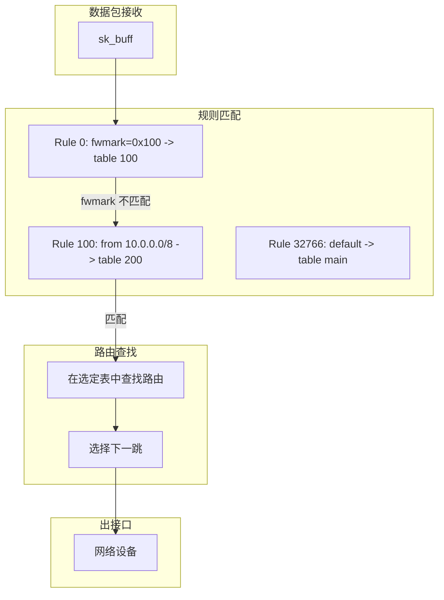

> [!info] Kernel Protocol Stack 深度探索系列 0. [[2026-04-13-kernel-protocol-stack-deep-dive-series-index|全栈学习路径总览]]
>
> 1. [[2026-04-13-kernel-protocol-stack-deep-dive-ch1-skbuff|第一章：sk_buff 与数据包生命周期]]
> 2. [[2026-04-13-kernel-protocol-stack-deep-dive-ch2-netdevice|第二章：Netdevice 与网卡抽象]]
> 3. [[2026-04-13-kernel-protocol-stack-deep-dive-ch3-ring-buffer|第三章：Ring Buffer 与 DMA]]
> 4. [[2026-04-13-kernel-protocol-stack-deep-dive-ch4-softirq|第四章：软中断与 ksoftirqd]]
> 5. [[2026-04-13-kernel-protocol-stack-deep-dive-ch5-napi|第五章：NAPI 与轮询模式]]
> 6. [[2026-04-13-kernel-protocol-stack-deep-dive-ch6-ethernet|第六章：Ethernet 与 MAC 层]]
> 7. [[2026-04-13-kernel-protocol-stack-deep-dive-ch7-bridge|第七章：网桥与 Switchdev]]
> 8. [[2026-04-13-kernel-protocol-stack-deep-dive-ch8-vlan|第八章：VLAN 与 802.1Q]]
> 9. [[2026-04-13-kernel-protocol-stack-deep-dive-ch9-macvlan|第九章：MACVLAN 与虚拟网卡]]
> 10. [[2026-04-13-kernel-protocol-stack-deep-dive-ch10-bonding|第十章：Bonding 与 teamd]]
> 11. [[2026-04-13-kernel-protocol-stack-deep-dive-ch11-ip-framing|第十一章：IP 协议封装]]
> 12. [[2026-04-13-kernel-protocol-stack-deep-dive-ch12-routing|第十二章：路由与 FIB]]
> 13. [[2026-04-13-kernel-protocol-stack-deep-dive-ch13-neighbor|第十三章：Neighbor 与 ARP]]
> 14. [[2026-04-13-kernel-protocol-stack-deep-dive-ch14-iptables|第十四章：iptables 基础]]
> 15. [[2026-04-13-kernel-protocol-stack-deep-dive-ch15-conntrack|第十五章：连接跟踪 Conntrack]]
> 16. [[2026-04-13-kernel-protocol-stack-deep-dive-ch16-nat|第十六章：NAT 与地址转换]]
> 17. [[2026-04-13-kernel-protocol-stack-deep-dive-ch17-gre|第十七章：GRE 隧道协议]]
> 18. [[2026-04-13-kernel-protocol-stack-deep-dive-ch18-vxlan|第十八章：VXLAN 虚拟可扩展局域网]]
> 19. [[2026-04-13-kernel-protocol-stack-deep-dive-ch19-geneve|第十九章：GENEVE 通用网络虚拟化封装]]
> 20. **第二十章：FIB Rules 转发规则**

---

## 1. 概述：为什么需要 FIB Rules

### 1.1 传统路由 vs 策略路由

**传统路由（基于目的地址）：**

```
数据包目的 IP -> 查找路由表 -> 选择出口

所有数据包使用同一路由表
```

**策略路由（基于 FIB Rules）：**

```
数据包 -> 匹配规则（源地址/接口/fwmark/...) -> 选择路由表 -> 选择出口

不同数据包使用不同路由表
```

### 1.2 典型应用场景

| 场景       | 问题                    | 解决方案             |
| ---------- | ----------------------- | -------------------- |
| 多链路 ISP | 不同 ISP 使用不同路由表 | 基于源地址选择路由表 |
| 防火墙标记 | iptables 标记决定路由   | fwmark + ip rule     |
| 流量工程   | 按协议/端口选择路径     | 基于 L4 信息选路     |
| VPN 分离   | 特定流量走 VPN          | 基于目的地址规则     |
| QoS        | 不同流量不同带宽        | 分类 + 策略路由      |

### 1.3 规则优先级

```
数据包到达
    |
    v
+-------+
|Rule 0 |  --> 匹配? --> 使用 table 100
+-------+
    |
    v (不匹配)
+-------+
|Rule 32766|  --> 匹配? --> 使用 table local
+-------+
    |
    v (不匹配)
+-------+
|Rule 32767|  --> 使用 table main (默认)
+-------+
```

---

## 2. FIB Rules 数据结构

### 2.1 规则结构

```c
// include/uapi/linux/fib_rule.h
struct fib_rule {
    unsigned char   family;          // AF_INET / AF_INET6
    unsigned char   dst_len;         // 目的地址掩码长度
    unsigned char   src_len;         // 源地址掩码长度
    unsigned char   tos;             // TOS 值

    __be32          fwmark;          // fwmark 标记
    __u32           fwmask;          // fwmark 掩码
    __u32           priority;       // 规则优先级
    __u32           table;          // 目标路由表 ID
    __be32          src;             // 源地址
    __be32          dst;             // 目的地址
    char            ifname[IFNAMSIZ]; // 入接口名称
    char            oifname[IFNAMSIZ]; // 出接口名称

    unsigned char   action;          // 动作
    unsigned char   flags;           // 标志
    unsigned char   table_id;         // 路由表 ID
};
```

### 2.2 规则动作

```c
enum fib_rule_action {
    FR_ACT_UNREACHABLE = 2,   // 返回网络不可达 ICMP
    FR_ACT_PROHIBIT = 3,      // 返回禁止通信 ICMP
    FR_ACT_BLACKHOLE = 6,     // 黑洞丢弃
    FR_ACT_TO_TBL = 8,        // 查指定路由表
};
```

### 2.3 规则标志

```c
#define FIB_RULE_INVERT       0x01   // 反向匹配
#define FIB_RULE_GOTO         0x02   // 跳转到另一规则
#define FIB_RULE_NO_SAME_IP   0x04   // 禁止同 IP
#define FIB_RULE_DEV_RESTRICTED 0x08 // 设备限制
```

---

## 3. 规则查找流程

### 3.1 策略路由查找

```c
// net/ipv4/fib_frontend.c - 策略路由入口
int fib_lookup(struct net *net, const struct flowi4 *flp,
              struct fib_result *res)
{
    struct fib_table *tb;

    // 1. 遍历规则链
    tb = fib_rules_lookup(net->ipv4.fib_rules_ops,
                          flowi4_to_flowi(flp), 0, &res->r);
    if (!tb)
        return -ENETUNREACH;

    // 2. 在目标表中查找路由
    return fib_table_lookup(tb, flp->fl4_dst, &res->fi, ...);
}

// net/ipv4/fib_rules.c - 规则匹配
struct fib_table *fib_rules_lookup(struct net *net,
                                   struct fib_rule_ops *ops,
                                   struct flowi *fl,
                                   int flags,
                                   struct fib_lookup_arg *arg)
{
    struct fib_rule *rule;

    rcu_read_lock();
    list_for_each_entry_rcu(rule, &ops->rules_list, list) {
        // 按优先级排序，先处理小优先级
        if (fib_rule_match(rule, ops, fl)) {
            if (rule->action == FR_ACT_TO_TBL) {
                return fib_get_table(net, rule->table);
            }
        }
    }
    rcu_read_unlock();

    return NULL;
}
```

### 3.2 规则匹配条件

```c
// 匹配检查 - 必须满足所有条件
static int fib_rule_match(struct fib_rule *rule,
                          struct fib_rule_ops *ops,
                          struct flowi *fl)
{
    // 1. 源地址匹配
    if (rule->src_len) {
        if (!inet_addr_mask_test(fl->nl_u.ip4_src,
                                rule->src, rule->src_len))
            return 0;
    }

    // 2. 目的地址匹配
    if (rule->dst_len) {
        if (!inet_addr_mask_test(fl->nl_u.ip4_dst,
                                rule->dst, rule->dst_len))
            return 0;
    }

    // 3. TOS 匹配
    if (rule->tos && (fl->flowi_tos & rule->tos) != rule->tos)
        return 0;

    // 4. fwmark 匹配
    if (rule->fwmark) {
        if ((fl->flowi_mark & rule->fwmask) != rule->fwmark)
            return 0;
    }

    // 5. 入接口匹配
    if (rule->ifname[0]) {
        if (fl->iif == 0 || strcmp(rule->ifname, fl->iif_name) != 0)
            return 0;
    }

    return 1;  // 所有条件满足
}
```

---

## 4. ip rule 命令详解

### 4.1 查看规则

```bash
# 查看所有 IPv4 规则
ip rule show

# 示例输出
0:      from all fwmark 0x100 lookup 100
100:    from 10.0.0.0/8 lookup 200
32766:  from all lookup main
32767:  from all lookup default
```

### 4.2 添加规则

```bash
# 基于源地址选择路由表
ip rule add from 10.0.0.0/8 table 100 priority 100

# 基于目的地址选择路由表
ip rule add to 192.168.0.0/16 table 200 priority 200

# 基于 TOS 选择路由表
ip rule add tos 0x10 table 300 priority 300

# 基于入接口选择路由表
ip rule add iif eth0 table 400 priority 400

# 基于 fwmark 选择路由表
ip rule add fwmark 0x100 table 500 priority 500
```

### 4.3 基于 fwmark 的完整流程

```bash
# Step 1: 使用 iptables 标记流量
iptables -A PREROUTING -s 10.1.1.0/24 -j MARK --set-mark 0x100

# Step 2: 添加 ip rule 匹配 fwmark
ip rule add fwmark 0x100 table 100 priority 100

# Step 3: 在 table 100 中添加路由
ip route add default via 192.168.1.1 dev eth1 table 100

# 验证
ip rule show
ip route show table 100
```

### 4.4 基于源地址的策略路由

```bash
# 假设有两个 ISP
# ISP1: eth0, 网关 1.1.1.1
# ISP2: eth1, 网关 2.2.2.1

# 添加两个路由表
echo "201 isp1" >> /etc/iproute2/rt_tables
echo "202 isp2" >> /etc/iproute2/rt_tables

# 配置 ISP1 表
ip route add default via 1.1.1.1 dev eth0 table 201

# 配置 ISP2 表
ip route add default via 2.2.2.1 dev eth1 table 202

# 添加规则：10.0.1.0/24 走 ISP1
ip rule add from 10.0.1.0/24 table 201 priority 101

# 添加规则：10.0.2.0/24 走 ISP2
ip rule add from 10.0.2.0/24 table 202 priority 102
```

### 4.5 删除规则

```bash
# 删除指定规则
ip rule del from 10.0.0.0/8 table 100 priority 100

# 删除所有规则（恢复默认）
ip rule flush

# 按优先级删除
ip rule del priority 100
```

---

## 5. 多路由表

### 5.1 路由表配置

```bash
# 查看路由表
ip route show table all

# 查看特定表
ip route show table main
ip route show table 100

# /etc/iproute2/rt_tables 配置
cat /etc/iproute2/rt_tables
# 以下是默认配置：
#
# reserved values
#
255     local
254     main
253     default
0       unspec
#
# local
#
# 1      inr.ruhit
```

### 5.2 常用路由表

| 表名    | ID  | 说明                                       |
| ------- | --- | ------------------------------------------ |
| local   | 255 | 系统保留，本地路由（本地 IP、广播）        |
| main    | 254 | 默认路由表，`ip route show` 显示的就是这个 |
| default | 253 | 默认备用表，空闲时使用                     |

### 5.3 自定义路由表

```bash
# 在 rt_tables 中添加新表
echo "100 custom" >> /etc/iproute2/rt_tables

# 使用表名替代数字
ip route add default via 192.168.1.1 table custom
```

---

## 6. fwmark 与 iptables 协同

### 6.1 MARK 目标

```bash
# 在 mangle 表中标记
iptables -t mangle -A PREROUTING -s 192.168.1.0/24 -j MARK --set-mark 0x10
iptables -t mangle -A PREROUTING -s 192.168.2.0/24 -j MARK --set-mark 0x20

# 查看标记
iptables -t mangle -L -n -v
```

### 6.2 CONNMARK 恢复

```bash
# 标记连接及其后续包
iptables -t mangle -A PREROUTING -m conntrack --ctstate NEW \
    -j MARK --set-mark 0x10

# 后续包自动继承连接标记
iptables -t mangle -A PREROUTING -m conntrack --ctstate ESTABLISHED \
    -j CONNMARK --restore-mark
```

### 6.3 完整流量分类案例

```bash
# 场景：内网用户分级访问
# 高级用户：10.1.1.0/24，走高带宽链路
# 普通用户：10.1.2.0/24，走普通链路

# 1. 标记流量
iptables -t mangle -A PREROUTING -s 10.1.1.0/24 -j MARK --set-mark 0x1
iptables -t mangle -A PREROUTING -s 10.1.2.0/24 -j MARK --set-mark 0x2

# 2. 添加规则
ip rule add fwmark 0x1 table premium priority 100
ip rule add fwmark 0x2 table normal priority 200

# 3. 配置路由表
ip route add default via 10.0.0.1 table premium  # 高速链路
ip route add default via 10.0.1.1 table normal   # 普通链路
```

---

## 7. 高级规则匹配

### 7.1 基于出接口

```bash
# 数据包从 eth0 进入，使用特定表
ip rule add iif eth0 table 100 priority 100

# 数据包将从 eth0 发出，使用特定表
ip rule add oif eth0 table 100 priority 100
```

### 7.2 基于协议类型

```bash
# 基于 IP 协议号
ip rule add ipproto tcp table 100 priority 100
ip rule add ipproto udp table 200 priority 200

# 查看协议号
cat /etc/protocols
```

### 7.3 排除匹配

```bash
# 匹配除 10.0.0.0/8 之外的所有流量
ip rule add not from 10.0.0.0/8 table 100 priority 100
```

### 7.4 uid 范围（本地进程）

```bash
# 基于用户 ID（仅对本地生成的数据包有效）
ip rule add uidrange 1000-2000 table 100 priority 100
```

---

## 8. 规则调试与排查

### 8.1 启用路由调试

```bash
# 启用路由调试日志
echo 1 > /proc/sys/net/ipv4/conf/all/log_martians
echo 1 > /proc/sys/net/ipv4/route/verbose

# 查看 dmesg
dmesg -T | grep -i "fib\|route\|rule"
```

### 8.2 追踪数据包路径

```bash
# 使用 ip route get 测试
ip route get to 8.8.8.8 from 10.0.0.1

# 添加 mark 后测试
ip route get to 8.8.8.8 fwmark 0x100

# 输出示例
# 8.8.8.8 via 1.1.1.1 dev eth0 src 10.0.0.1 mark 0x100
```

### 8.3 规则验证脚本

```bash
#!/bin/bash
# 验证策略路由配置

echo "=== IP Rules ==="
ip rule show

echo ""
echo "=== Table main ==="
ip route show table main

echo ""
echo "=== Table 100 ==="
ip route show table 100 2>/dev/null || echo "Table 100 not exists"

echo ""
echo "=== Testing route lookup ==="
ip route get to 8.8.8.8 from 10.0.0.1
```

---

## 9. 与路由查找的协同

### 9.1 完整数据包流程



### 9.2 快速路径 vs 慢速路径

```c
// 快速路径：已知路由缓存
// net/ipv4/route.c
struct rtable *ip_route_output_fast(struct net *net, struct flowi4 *fl4)
{
    // 直接使用路由缓存
    if (rt_cache_route(net, &fl4->flowi4_mark, ...))
        return ...;

    // 缓存未命中，走完整查找
    return ip_route_output_key_slow(net, fl4);
}
```

---

## 10. 总结

FIB Rules 是 Linux 策略路由的核心：

**关键要点：**

1. 支持基于源地址、目的地址、fwmark、接口、TOS 等多维度匹配
2. 规则按优先级顺序匹配（数值越小优先级越高）
3. 每个规则指向一个路由表
4. fwmark 机制实现 iptables 与路由的深度集成
5. 支持多表查询实现复杂的流量工程

**常见使用模式：**

1. **多 ISP 出口**：基于源地址选择 ISP
2. **VPN 分离**：基于目的地址分流
3. **QoS 分类**：iptables 标记 + 路由选择
4. **防火墙**：基于接口的访问控制
5. **流量监控**：特定流量走监控端口

**配置建议：**

- 规则越少性能越好
- 避免规则冲突
- 定期检查规则顺序
- 使用有意义的优先级编号
