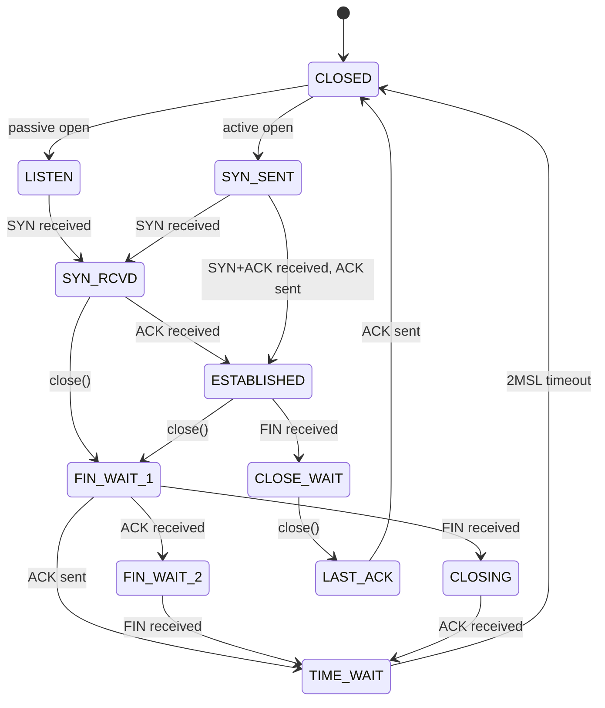

> [!info] Kernel Protocol Stack 深度探索系列
> 0. [[2026-04-13-kernel-protocol-stack-deep-dive-series-index|全栈学习路径总览]]
> 1. [[2026-04-13-kernel-protocol-stack-deep-dive-ch1-skbuff|第一章：sk_buff 与数据包生命周期]]
> 2. [[2026-04-13-kernel-protocol-stack-deep-dive-ch2-netdevice|第二章：Netdevice 与网卡抽象]]
> 3. [[2026-04-13-kernel-protocol-stack-deep-dive-ch3-ring-buffer|第三章：Ring Buffer 与 DMA]]
> 4. [[2026-04-13-kernel-protocol-stack-deep-dive-ch4-softirq|第四章：软中断与 ksoftirqd]]
> 5. [[2026-04-13-kernel-protocol-stack-deep-dive-ch5-napi|第五章：NAPI 与轮询模式]]
> 6. [[2026-04-13-kernel-protocol-stack-deep-dive-ch6-ethernet|第六章：Ethernet 与 MAC 层]]
> 7. [[2026-04-13-kernel-protocol-stack-deep-dive-ch7-bridge|第七章：网桥与 Switchdev]]
> 8. [[2026-04-13-kernel-protocol-stack-deep-dive-ch8-vlan|第八章：VLAN 与 802.1Q]]
> 9. [[2026-04-13-kernel-protocol-stack-deep-dive-ch9-macvlan|第九章：MACVLAN 与虚拟网卡]]
> 10. [[2026-04-13-kernel-protocol-stack-deep-dive-ch10-bonding|第十章：Bonding 与 teamd]]
> 11. [[2026-04-13-kernel-protocol-stack-deep-dive-ch11-ip-framing|第十一章：IP 协议封装]]
> 12. [[2026-04-13-kernel-protocol-stack-deep-dive-ch12-routing|第十二章：路由与 FIB]]
> 13. [[2026-04-13-kernel-protocol-stack-deep-dive-ch13-neighbor|第十三章：Neighbor 与 ARP]]
> 14. [[2026-04-13-kernel-protocol-stack-deep-dive-ch14-iptables|第十四章：iptables 基础]]
> 15. [[2026-04-13-kernel-protocol-stack-deep-dive-ch15-conntrack|第十五章：连接跟踪 Conntrack]]
> 16. [[2026-04-13-kernel-protocol-stack-deep-dive-ch16-nat|第十六章：NAT 与地址转换]]
> 17. [[2026-04-13-kernel-protocol-stack-deep-dive-ch17-gre|第十七章：GRE 隧道协议]]
> 18. [[2026-04-13-kernel-protocol-stack-deep-dive-ch18-vxlan|第十八章：VXLAN 虚拟可扩展局域网]]
> 19. [[2026-04-13-kernel-protocol-stack-deep-dive-ch19-geneve|第十九章：GENEVE 通用网络虚拟化封装]]
> 20. [[2026-04-13-kernel-protocol-stack-deep-dive-ch20-fib-rules|第二十章：FIB Rules 转发规则]]
> 21. [[2026-04-13-kernel-protocol-stack-deep-dive-ch21-tcp-headers|第二十一章：TCP 头部结构]]
> 22. **第二十二章：TCP 状态机**

---

## 1. TCP 状态概述

TCP 是面向连接的协议，连接生命周期中经历多种状态：

```
CLOSED -> LISTEN -> SYN_RCVD -> ESTABLISHED -> CLOSE_WAIT -> LAST_ACK -> CLOSED
                  \                    /
                   -> SYN_SENT ->
```

---

## 2. TCP 状态列表

### 2.1 完整状态表

| 状态 | 说明 | 客户端/服务端 |
|------|------|---------------|
| CLOSED | 关闭状态，无连接 | 双方 |
| LISTEN | 监听状态，等待连接 | 服务端 |
| SYN_SENT | 已发送 SYN，等待确认 | 客户端 |
| SYN_RCVD | 已收到 SYN，已发送 SYN+ACK | 服务端 |
| ESTABLISHED | 连接已建立，可传输数据 | 双方 |
| CLOSE_WAIT | 收到 FIN，等待应用关闭 | 被动关闭方 |
| FIN_WAIT_1 | 已发送 FIN，等待 ACK | 主动关闭方 |
| FIN_WAIT_2 | 收到 ACK，等待对端 FIN | 主动关闭方 |
| CLOSING | 双方同时关闭中 | 双方 |
| LAST_ACK | 等待最后的 ACK | 被动关闭方 |
| TIME_WAIT | 等待 2MSL 后关闭 | 主动关闭方 |

### 2.2 内核状态定义

```c
// include/uapi/linux/tcp.h
enum tcp_conn_state {
    TCP_ESTABLISHED = 1,
    TCP_SYN_SENT,
    TCP_SYN_RECV,
    TCP_FIN_WAIT1,
    TCP_FIN_WAIT2,
    TCP_TIME_WAIT,
    TCP_CLOSE,
    TCP_CLOSE_WAIT,
    TCP_LAST_ACK,
    TCP_LISTEN,
    TCP_CLOSING,
    TCP_NEW_SYN_RECV,
};
```

---

## 3. 连接建立：三次握手

### 3.1 流程图

```
客户端                              服务端
  |                                   |
  |---------- SYN (seq=x) ----------->|  CLOSED -> SYN_SENT
  |                                   |  -> LISTEN -> SYN_RCVD
  |<------ SYN+ACK (seq=y, ack=x+1) --|  SYN_SENT -> ESTABLISHED
  |                                   |  SYN_RCVD -> ESTABLISHED
  |---------- ACK (ack=y+1) -------->|
  |                                   |
  ESTABLISHED                         ESTABLISHED
```

### 3.2 三次握手详解

| 步骤 | 客户端发送 | 服务端发送 | 客户端状态 | 服务端状态 |
|------|------------|------------|------------|------------|
| 1 | SYN, seq=x | - | SYN_SENT | LISTEN |
| 2 | - | SYN+ACK, seq=y, ack=x+1 | SYN_SENT | SYN_RCVD |
| 3 | ACK, ack=y+1 | - | ESTABLISHED | SYN_RCVD/ESTABLISHED |

### 3.3 内核实现

```c
// net/ipv4/tcp_input.c - 第一次握手处理（SYN）
int tcp_v4_conn_request(struct sock *sk, struct sk_buff *skb)
{
    // 为新连接创建 request_sock
    struct request_sock *req = inet_reqsk_alloc(&tcp_request_sock_ops, sk);
    
    // 生成 ISN
    req->seq = secure_tcp_isn(...);
    
    // 发送 SYN+ACK
    tcp_v4_send_synack(sk, req, skb);
    
    return 0;
}

// net/ipv4/tcp_output.c - 第三次握手处理（ACK）
static void tcp_v4_do_rcv(struct sock *sk, struct sk_buff *skb)
{
    if (sk->sk_state == TCP_SYN_RECV) {
        // 收到 ACK，连接建立完成
        struct request_sock *req = inet_reqsk(sk);
        inet_csk(sk)->icsk_af_ops->sk_rx_dst(sk, skb);
        
        // 迁移到 established
        tcp_set_state(sk, TCP_ESTABLISHED);
        sk->sk_state_change(sk);
    }
}
```

### 3.4 半连接队列与全连接队列

```c
// 半连接队列（SYN Queue）
// 存储收到的 SYN 包，等待客户端 ACK
struct request_sock_queue {
    struct request_sock  *rskq_accept_head;  // 半连接队列头
    atomic_t             rskq_qlen;            // 半连接数量
};

// 全连接队列（Accept Queue）
// 完成三次握手，等待 accept() 调用的连接
struct listen_sock {
    int                 max_qlen_log;  // 最大队列长度（对数）
};
```

---

## 4. 连接关闭：四次挥手

### 4.1 流程图

```
主动关闭方                          被动关闭方
  |                                   |
  |---------- FIN (seq=u) ----------->|  ESTABLISHED -> FIN_WAIT_1
  |<--------- ACK (ack=u+1) ---------|  FIN_WAIT_1 -> FIN_WAIT_2
  |                                   |  ESTABLISHED -> CLOSE_WAIT
  |         (应用关闭写端)            |
  |<--------- FIN (seq=w) ------------|  CLOSE_WAIT -> LAST_ACK
  |---------- ACK (ack=w+1) -------->|
  |                                   |  LAST_ACK -> CLOSED
  |  TIME_WAIT (等待 2MSL)           |
  v                                   v
 CLOSED                               CLOSED
```

### 4.2 四次挥手详解

| 步骤 | 主动方发送 | 被动方发送 | 主动方状态 | 被动方状态 |
|------|------------|------------|------------|------------|
| 1 | FIN, seq=u | - | FIN_WAIT_1 | CLOSE_WAIT |
| 2 | - | ACK, ack=u+1 | FIN_WAIT_2 | CLOSE_WAIT |
| 3 | - | FIN, seq=w | FIN_WAIT_2 | LAST_ACK |
| 4 | ACK, ack=w+1 | - | TIME_WAIT | CLOSED |

### 4.3 同时关闭

```
客户端                              服务端
  |                                   |
  |---------- FIN (seq=u) ----------->|
  |<--------- FIN (seq=v) ------------|
  |---------- ACK (ack=u+1) -------->|
  |<--------- ACK (ack=v+1) ----------|
  |                                   |
  CLOSING -> TIME_WAIT               CLOSING -> TIME_WAIT
```

### 4.4 内核实现

```c
// net/ipv4/tcp.c - 主动关闭
void tcp_close(struct sock *sk, long timeout)
{
    struct tcp_sock *tp = tcp_sk(sk);
    
    if (sk->sk_state == TCP_LISTEN) {
        // 关闭监听套接字
        tcp_set_state(sk, TCP_CLOSE);
        return;
    }
    
    if (sk->sk_state == TCP_ESTABLISHED) {
        // 发送 FIN
        tcp_send_fin(sk);
        tcp_set_state(sk, TCP_FIN_WAIT1);
    }
    
    // 等待对端 FIN
    sk_stream_wait_close(sk, timeout);
}

// net/ipv4/tcp_input.c - 处理被动关闭
static int tcp_rcv_state_process(struct sock *sk, struct sk_buff *skb)
{
    switch (sk->sk_state) {
    case TCP_CLOSE_WAIT:
        // 收到 FIN，应该调用 close()
        // 进入 LAST_ACK
        tcp_send_fin(sk);
        tcp_set_state(sk, TCP_LAST_ACK);
        break;
    }
}
```

---

## 5. TIME_WAIT 状态

### 5.1 为什么需要 TIME_WAIT

1. **可靠的连接终止**：确保最后的 ACK 能到达对端
2. **防止旧连接的延迟包干扰新连接**：2MSL 内旧包会消失
3. **等待迷途的 FIN**：确保对方关闭

### 5.2 MSL（Maximum Segment Lifetime）

```bash
# 查看 MSL 设置
sysctl net.ipv4.tcp_fin_timeout

# 默认 60 秒
# TIME_WAIT = 2 * MSL = 120 秒

# 调整 MSL
sysctl -w net.ipv4.tcp_fin_timeout=30
```

### 5.3 TIME_WAIT 优化

```bash
# 启用 TIME_WAIT 复用
sysctl -w net.ipv4.tcp_tw_reuse=1

# 启用 TIME_WAIT 回收
sysctl -w net.ipv4.tcp_tw_recycle=1  # 已被废弃

# 调整 TIME_WAIT 桶数量
sysctl -w net.ipv4.tcp_max_tw_buckets=262144

# 短 TIME_WAIT
sysctl -w net.ipv4.tcp_fin_timeout=30
```

### 5.4 内核处理

```c
// net/ipv4/tcp_timer.c - TIME_WAIT 超时
static void tcp_twsk_work(struct work_struct *work)
{
    struct tcp_timewait_sock *twsk;
    twsk = container_of(work, struct tcp_timewait_sock, twsk_work);
    
    // 2MSL 超时后删除
    inet_twsk_put(twsk);
}

// TIME_WAIT 定时器
static void tcp_tw_handler(unsigned long data)
{
    struct tcp_timewait_sock *twsk = (void *)data;
    
    // 超时，进入 CLOSED
    inet_twsk_kill(twsk);
}
```

---

## 6. CLOSE_WAIT 状态

### 6.1 CLOSE_WAIT 问题

服务器收到客户端的 FIN 后进入 CLOSE_WAIT，如果应用程序没有调用 close()，会一直保持此状态：

```
问题：
  1. 占用文件描述符
  2. 占用内核内存
  3. 耗尽服务器资源

原因：
  应用程序忘记调用 close()
  应用程序阻塞在 I/O 操作
  应用程序死锁
```

### 6.2 检测 CLOSE_WAIT

```bash
# 查看 CLOSE_WAIT 连接
ss -ant | grep CLOSE-WAIT

# 统计各状态数量
ss -s

# 使用 netstat（已废弃）
netstat -ant | grep CLOSE_WAIT | wc -l
```

### 6.3 解决 CLOSE_WAIT

```c
// 设置 SO_LINGER 强制关闭
struct linger ling;
ling.l_onoff = 1;
ling.l_linger = 0;
setsockopt(sockfd, SOL_SOCKET, SO_LINGER, &ling, sizeof(ling));
close(sockfd);  // 直接发送 RST

// 或者在应用中确保及时 close()
while (1) {
    int client = accept(listenfd, ...);
    process_client(client);
    close(client);  // 确保调用
}
```

---

## 7. 异常状态处理

### 7.1 RST 攻击防护

```c
// 内核验证 RST 序列号
static bool tcp_validate_incoming(struct sock *sk, struct sk_buff *skb)
{
    // RST 必须有正确的序列号
    if (th->rst) {
        if (SEQ_GT(th->seq, tp->rcv_nxt) ||
            SEQ_GT(tp->rcv_nxt + tp->rcv_wnd, th->seq)) {
            // 无效 RST，忽略
            return false;
        }
    }
    return true;
}
```

### 7.2 SYN Flood 防护

```bash
# 启用 SYN Cookies
sysctl -w net.ipv4.tcp_syncookies=1

# 调整半连接队列
sysctl -w net.ipv4.tcp_max_syn_backlog=2048

# 查看 SYN 队列溢出
netstat -s | grep -i "SYN"
```

### 7.3 连接超时

```bash
# TCP 超时重传次数
sysctl -w net.ipv4.tcp_retries1=3
sysctl -w net.ipv4.tcp_retries2=15

# 半开连接超时
sysctl -w net.ipv4.tcp_synack_retries=5
```

---

## 8. 状态转换图

### 8.1 完整状态图



### 8.2 客户端状态流

```
CLOSED -> SYN_SENT -> ESTABLISHED -> FIN_WAIT_1 -> FIN_WAIT_2 -> TIME_WAIT -> CLOSED
                                              \-> CLOSING -> TIME_WAIT
```

### 8.3 服务端状态流

```
CLOSED -> LISTEN -> SYN_RCVD -> ESTABLISHED -> CLOSE_WAIT -> LAST_ACK -> CLOSED
```

---

## 9. 连接状态监控

### 9.1 ss 命令

```bash
# 查看所有连接状态
ss -ant

# 查看状态统计
ss -s

# 查看特定状态
ss -ant state time-wait
ss -ant state close-wait

# 查看详细选项
ss -ti

# 示例：查看拥塞控制
ss -ti dst 10.0.0.1
```

### 9.2 /proc 文件系统

```bash
# 查看 TCP 状态
cat /proc/net/tcp
cat /proc/net/tcp6

# 字段说明
# sl  local_address rem_address   st tx_queue:rx_queue tr:tm->when retrnsmt   uid  timeout inode
# 0: 0100007F:0035 00000000:0000 0A 00000000:00000000 00:00000000 00000000     0        0 12345
```

### 9.3 连接追踪

```bash
# 查看 nf_conntrack 中的 TCP 状态
cat /proc/net/nf_conntrack | grep tcp

# 状态映射
# TCP_NONE=0
# TCP_ESTABLISHED=1
# TCP_SYN_SENT=2
# TCP_SYN_RECV=3
# TCP_FIN_WAIT=4
# TCP_CLOSE_WAIT=5
# TCP_LAST_ACK=6
# TCP_TIME_WAIT=7
# TCP_CLOSE=8
```

---

## 10. 总结

TCP 状态机要点：

**连接建立（三次握手）：**
1. 客户端发送 SYN，进入 SYN_SENT
2. 服务端收到 SYN，发送 SYN+ACK，进入 SYN_RCVD
3. 客户端收到 SYN+ACK，发送 ACK，进入 ESTABLISHED
4. 服务端收到 ACK，进入 ESTABLISHED

**连接关闭（四次挥手）：**
1. 主动关闭方发送 FIN，进入 FIN_WAIT_1
2. 被动关闭方发送 ACK，进入 FIN_WAIT_2
3. 被动关闭方发送 FIN，进入 CLOSE_WAIT
4. 主动关闭方收到 FIN，发送 ACK，进入 TIME_WAIT
5. 被动关闭方收到 ACK，进入 CLOSED
6. 主动关闭方等待 2MSL 后进入 CLOSED

**关键状态：**
1. TIME_WAIT：防止旧包干扰，等待 2MSL
2. CLOSE_WAIT：被动关闭方未调用 close()
3. SYN_RCVD：半连接队列
4. ESTABLISHED：数据传输状态
