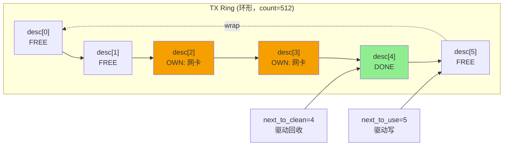
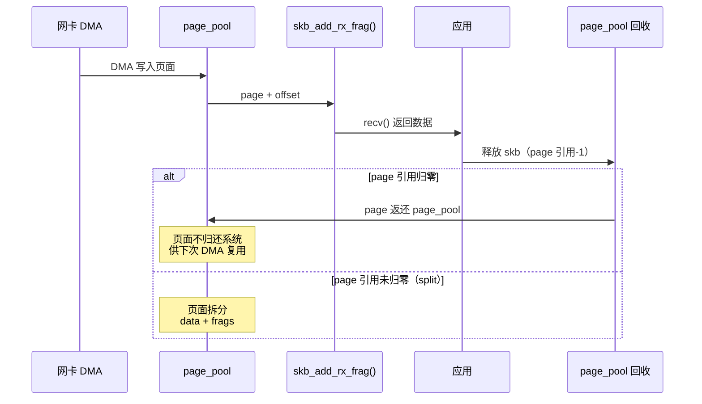
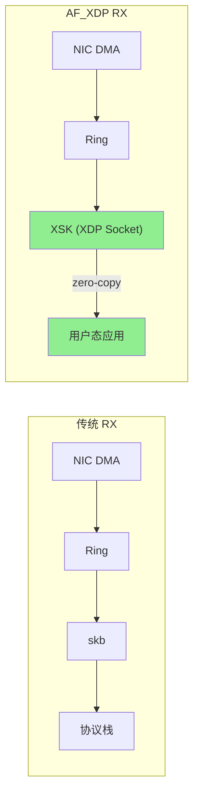

> [!info] Kernel Protocol Stack 深度探索系列
> 0. [[2026-04-13-kernel-protocol-stack-deep-dive-series-index|全栈学习路径总览]]
> 1. [[2026-04-13-kernel-protocol-stack-deep-dive-ch1-skbuff|第一章：sk_buff 与数据包生命周期]]
> 2. [[2026-04-13-kernel-protocol-stack-deep-dive-ch2-netdevice|第二章：Netdevice 与网卡抽象]]
> 3. **第三章：Ring Buffer 与 DMA**
> 4. [[2026-04-13-kernel-protocol-stack-deep-dive-ch4-softirq|第四章：软中断与 ksoftirqd]]
> 5. [[2026-04-13-kernel-protocol-stack-deep-dive-ch5-napi|第五章：NAPI 与轮询模式]]
> 6. [[2026-04-13-kernel-protocol-stack-deep-dive-ch6-ethernet|第六章：Ethernet 与 MAC 层]]

---

## 1. 概述：为什么需要 Ring Buffer？

传统网卡与内核交互有两种模式：

1. **Programmed I/O (PIO)**：CPU 直接读写网卡的寄存器/内存，高速网卡早已不用
2. **DMA (Direct Memory Access)**：网卡直接读写系统内存，CPU 只负责描述符管理

**Ring Buffer（环形缓冲区）** 是 DMA 模式的标配数据结构。它解决了三个问题：

- **异步通信**：网卡和内核可以独立操作，不用互相等待
- **批量传输**：一次中断可以处理多个数据包（批处理）
- **零拷贝基础**：数据直接在内存中，网卡直接 DMA 读取，无需 CPU 拷贝

```
CPU/内核                          网卡
   │                               │
   │  ┌─────────────────────┐       │
   │  │   RX/TX Descriptor  │       │
   │  │       Ring           │       │
   │  │  (共享内存)          │       │
   │  └──────────┬───────────┘       │
   │             │ DMA 访问           │
   │  ┌──────────┴───────────┐       │
   │  │   Data Buffer        │       │
   │  │   (skb->data)        │       │
   │  └──────────────────────┘       │
   │                               │
```

---

## 2. DMA 基础与内存屏障

### 2.1 DMA 原理

DMA 允许网卡直接访问系统物理内存。驱动程序需要：

1. **分配 DMA 一致性内存**（cache-coherent）
2. **将物理地址写入网卡的描述符Ring**
3. **网卡通过 DMA 读写数据**

```c
// 驱动中分配 DMA 一致性内存
void *dma_alloc_coherent(struct device *dev, size_t size,
                          dma_addr_t *dma_handle, gfp_t flag);

// 释放
void dma_free_coherent(struct device *dev, size_t size,
                        void *cpu_addr, dma_addr_t dma_handle);

// 单次映射（streaming DMA，用于 TX）
dma_addr_t dma_map_single(struct device *dev, void *ptr,
                          size_t size, enum dma_data_direction dir);

// 解除映射
void dma_unmap_single(struct device *dev, dma_addr_t addr,
                      size_t size, enum dma_data_direction dir);
```

### 2.2 内存屏障与 Cache 一致性

**Cache 一致性是 DMA 的核心挑战。** CPU 的 L1/L2 Cache 与 DMA 之间需要保证顺序：

```c
// 关键场景：TX 路径
// 1. 驱动写入 descriptor（更新 DMA 地址）
desc->addr = dma_map_single(skb->data);  // CPU 写入 Cache

// 2. 驱动更新 descriptor 状态
desc->cmd = TX_DESC_CMD_OWN;  // 标记"网卡可以读"

// 3. 内存屏障：确保 1,2 都对网卡可见（Cache 刷新到 RAM）
wmb();  // write memory barrier

// 4. 通知网卡（有新的 descriptor）
writeb(NIC_REG_DOORBELL, 1);

// 反向（RX 路径）：
// 1. 网卡 DMA 写入数据到内存
// 2. 网卡更新 descriptor DD 标志
// 3. 内存屏障
rmb();  // read memory barrier
// 4. CPU 才能读取数据
```

**三种屏障：**

| 屏障 | 作用 | 使用场景 |
|------|------|---------|
| `mb()` | 完整内存屏障 | 前后读写都不能重排序 |
| `wmb()` | 写屏障 | 确保写操作对 DMA 可见 |
| `rmb()` | 读屏障 | 确保 DMA 数据对 CPU 可见 |

### 2.3 IOMMU 与 VFIO

**IOMMU（I/O Memory Management Unit）** 为 DMA 提供虚拟化支持：

```
物理地址（PAM）                      虚拟地址（VAM）
┌────────────────────┐            ┌────────────────────┐
│   IOMMU            │            │   CPU Page Table   │
│  ┌──────────────┐  │            │                    │
│  │  IO Page     │  │            │                    │
│  │  Table       │  │            │                    │
│  └──────┬───────┘  │            │                    │
│         │          │            │                    │
│         ▼          │            │                    │
│  ┌──────────────┐  │            │                    │
│  │  Device      │  │            │                    │
│  │  Address     │  │            │                    │
│  │  Space       │  │            │                    │
│  └──────────────┘  │            │                    │
└────────────────────┘            └────────────────────┘
```

**VFIO** 是用户态驱动框架，允许容器/VM 直接访问网卡的 DMA：

```bash
# 加载 vfio-pci
modprobe vfio-pci

# 绑定网卡到 vfio-pci
echo 0000:01:00.0 > /sys/bus/pci/drivers/vfio-pci/unbind
echo 8086 1234 > /sys/bus/pci/drivers/vfio-pci/new_id

# VFIO DMA 映射（用户态代码）
struct vfio_region_info region = { .argsz = sizeof(region) };
ioctl(device_fd, VFIO_DEVICE_GET_REGION_INFO, &region);

// 用户态获得 DMA 物理地址
ioctl(device_fd, VFIO_IOMMU_MAP_DMA, &dma_map);
```

---

## 3. TX Ring：发送环形缓冲区

### 3.1 TX Descriptor 结构

每个 TX Descriptor 告诉网卡："去这个物理地址读取 `len` 字节的数据"：

```c
// Intel i40e TX Descriptor（64 字节）
struct i40e_tx_desc {
    __le64  pkt_addr;      // 数据缓冲区的物理地址
    __le64  hdr_addr;      // 分片头缓冲（可选）
    __le32  paylen;        // 数据长度（不含 Ethernet 头）
    __le16  mss;           // MSS（TSO 时使用）
    __le8   status_flags;  // 状态/命令标志
    __le8   cmd;           // 命令（OWN, EOP, RS, IFCS, etc）
};
```

**Descriptor 状态标志：**

| 标志 | 名称 | 含义 |
|------|------|------|
| `DD` | Descriptor Done | 网卡已完成处理 |
| `EOP` | End of Packet | 数据包最后一个分片 |
| `RS` | Report Status | 请求生成完成状态 |
| `IFCS` | Insert FCS | 让网卡插入 CRC |
| `OTA` | One Transmit Advance | 高级发送模式 |

### 3.2 TX Ring 管理

```c
struct i40e_tx_ring {
    void            *desc;           // TX descriptor 数组（DMA 一致性内存）
    dma_addr_t      dma;              // descriptor 的 DMA 地址
    
    struct i40e_tx_buffer *tx_bp;    // TX buffer 数组（对应每个 descriptor）
    
    unsigned int    count;            // Descriptor 数量（通常 256/512/1024）
    unsigned int    next_to_use;      // 下一个可用位置（驱动写）
    unsigned int    next_to_clean;     // 下一个待清理位置（驱动回收）    
    
    unsigned int    xsk_umem;         // AF_XDP/zero-copy 模式
    struct net_device *netdev;
    struct device   *dev;
};
```



### 3.3 TX 发送流程

```c
static netdev_tx_t i40e_xmit_frame(struct sk_buff *skb,
                                    struct net_device *netdev)
{
    struct i40e_tx_ring *tx_ring;
    bool first = true;
    unsigned int tx_flags = 0;
    
    // 1. 选择 TX 队列（基于 hash 或 priority）
    tx_ring = i40e_txring_csum(skb, netdev);
    
    // 2. 计算需要的 descriptor 数量
    //    - 线性数据：1 个 descriptor
    //    - TSO：每个 MSS 分段需要 1 个
    //    - 线性+分片：每个分片 1 个
    unsigned int desc_needed = i40e_tx_desc_count(skb);
    
    // 3. 检查可用空间
    if (i40e_check_stop_required(tx_ring, desc_needed)) {
        netif_stop_subqueue(netdev, tx_ring->q_index);
        return NETDEV_TX_BUSY;
    }
    
    // 4. TSO 分割（如果启用）
    if (skb_shinfo(skb)->gso_size) {
        tx_flags |= I40E_TX_FLAGS_TSO;
        i40e_tso_first_skb(skb, tx_ring, tx_flags);
        goto do_dma;
    }
    
    // 5. 映射数据缓冲区
    do_dma:
    dma_addr = dma_map_single(dev, skb->data, skb->len, DMA_TO_DEVICE);
    
    // 6. 填充 descriptor
    i40e_tx_desc_fill(tx_ring, dma_addr, skb->len, first, last);
    first = false;
    
    // 7. 更新 next_to_use
    tx_ring->next_to_use++;
    if (tx_ring->next_to_use == tx_ring->count)
        tx_ring->next_to_use = 0;
    
    // 8. 内存屏障
    wmb();
    
    // 9. 通知网卡（写 doorbell）
    writel(tx_ring->next_to_use, tx_ring->tail);
    
    // 10. 记录 skb 到 tx_buffer（用于完成时释放）
    tx_ring->tx_bp[tx_ring->next_to_use].skb = skb;
    
    return NETDEV_TX_OK;
}
```

### 3.4 TX 完成与回收

TX 完成有两种模式：**中断模式**和**轮询模式**：

```c
// TX 完成中断处理
static void i40e_clean_tx_irq(struct i40e_tx_ring *tx_ring)
{
    unsigned int total_bytes = 0, total_packets = 0;
    
    // 遍历直到遇到 OWN 标志（网卡还在用的 descriptor）
    while (tx_ring->next_to_clean != tx_ring->next_to_use) {
        struct i40e_tx_desc *desc;
        struct i40e_tx_buffer *buf;
        
        desc = &tx_ring->desc[tx_ring->next_to_clean];
        buf = &tx_ring->tx_bp[tx_ring->next_to_clean];
        
        // 检查 DD 标志
        if (!(desc->cmd & I40E_TX_DESC_CMD_DONE))
            break;
        
        // 统计
        total_bytes += buf->bytecount;
        total_packets++;
        
        // 解除 DMA 映射
        if (buf->dma) {
            dma_unmap_page(tx_ring->dev, buf->dma, buf->size,
                          DMA_TO_DEVICE);
            buf->dma = 0;
        }
        
        // 释放 skb
        if (buf->skb) {
            dev_kfree_skb_any(buf->skb);
            buf->skb = NULL;
        }
        
        // 移动到下一个
        tx_ring->next_to_clean++;
        if (tx_ring->next_to_clean == tx_ring->count)
            tx_ring->next_to_clean = 0;
    }
    
    // 更新统计
    tx_ring->netdev->stats.tx_packets += total_packets;
    tx_ring->netdev->stats.tx_bytes += total_bytes;
    
    // 如果队列停止且有空间，唤醒
    if (netif_tx_queue_stopped(tx_ring->tx_queue) &&
        likely(tx_ring->count - tx_ring->next_to_clean >= DESC_NEEDED))
        netif_wake_subqueue(tx_ring->netdev, tx_ring->q_index);
}
```

---

## 4. RX Ring：接收环形缓冲区

### 4.1 RX Descriptor 结构

```c
// Intel i40e RX Descriptor（16 字节）
struct i40e_rx_desc {
    __le64  pkt_addr;      // 数据缓冲区的物理地址（网卡拉此地址）
    __le64  hdr_addr;       // 头缓冲地址（可选，优化小包）
    __le32  qw1;            // 长度/状态/校验和信息
    __le16  vlan;           // VLAN tag（如果启用）
};
```

**QW1 字段分解：**

```c
struct {
    __le32  len:16;           // 数据包长度
    __le32  packet_type:8;    // 数据包类型（TCP/UDP/IPv4/IPv6...）
    __le32  status_error:8;   // 状态/错误标志
};

// 状态标志（status_error byte）
#define I40E_RXD_STATUS_DD      0x01   // Descriptor Done
#define I40E_RXD_STATUS_EOF     0x02   // End of Frame
#define I40E_RXD_STATUS_L4CS    0x20   // L4 checksum 计算
#define I40E_RXD_STATUS_IPCS    0x40   // IP header checksum 完成
#define I40E_RXD_STATUS_PIF     0x80   // 非 IP 协议
```

### 4.2 RX 缓冲区分配策略

**传统模式（套接字缓冲区）：**

```c
// 驱动分配 skb，数据存在 skb->data
skb = netdev_alloc_skb(dev, rx_buf_len);
desc->pkt_addr = dma_map_single(dev, skb->data, rx_buf_len, DMA_FROM_DEVICE);
```

**page_pool 模式（现代高速网卡）：**

```c
// page_pool 分配页面，只将页面地址给 DMA
struct page *page = page_pool_alloc_pages(rx_ring->page_pool, ...);
desc->pkt_addr = page_pool_get_device_addr(page);

// skb 只持有 page 引用（zero-copy 基础）
skb = build_skb(skb, page);
skb_add_rx_frag(skb, 0, page, 0, size);
```

### 4.3 RX 接收流程

```c
static int i40e_clean_rx_irq(struct i40e_ring *rx_ring, int budget)
{
    unsigned int total_bytes = 0, total_packets = 0;
    
    while (total_packets < budget) {
        union i40e_rx_desc *desc;
        struct sk_buff *skb;
        unsigned int size;
        
        // 1. 获取当前 descriptor
        desc = &rx_ring->desc[rx_ring->next_to_clean];
        
        // 2. 检查 DD 标志
        if (!(desc->wb.status_error & cpu_to_le16(I40E_RXD_STAT_DD)))
            break;
        
        // 3. 内存屏障
        rmb();
        
        // 4. 解析 descriptor 信息
        size = le16_to_cpu(desc->wb.qword1.pkt_len) & 0x7FFF;
        
        // 5. 构建 skb（page_pool 模式）
        skb = i40e_build_skb(rx_ring, desc);
        if (!skb) {
            rx_ring->rx_stats.alloc_fail++;
            break;
        }
        
        // 6. DMA 同步（CPU 需要访问数据）
        dma_sync_single_for_cpu(rx_ring->dev,
                                 le64_to_cpu(desc->read.pkt_addr),
                                 rx_ring->rx_buf_len,
                                 DMA_FROM_DEVICE);
        
        // 7. 推送数据到协议栈
        skb->protocol = eth_type_trans(skb, rx_ring->netdev);
        napi_gro_receive(&rx_ring->q_vector->napi, skb);
        
        // 8. 统计
        total_packets++;
        total_bytes += size;
        
        // 9. 回收 descriptor（重新填充 buffer）
        i40e_alloc_rx_buffers(rx_ring, 1);
        
        rx_ring->next_to_clean++;
        if (rx_ring->next_to_clean == rx_ring->count)
            rx_ring->next_to_clean = 0;
    }
    
    // 更新统计
    rx_ring->netdev->stats.rx_packets += total_packets;
    rx_ring->netdev->stats.rx_bytes += total_bytes;
    
    return total_packets;
}
```

### 4.4 Descriptor 回收与重新填充

**RX descriptor 是消耗性的**——网卡读取后需要驱动重新补充：

```c
void i40e_alloc_rx_buffers(struct i40e_ring *rx_ring, int count)
{
    while (count--) {
        union i40e_rx_desc *desc;
        struct i40e_rx_buffer *buf;
        
        desc = &rx_ring->desc[rx_ring->next_to_use];
        buf = &rx_ring->rx_bp[rx_ring->next_to_use];
        
        if (!buf->page) {
            // 分配新页面
            buf->page = page_pool_alloc_pages(rx_ring->page_pool, ...);
            if (!buf->page)
                break;
        }
        
        // 清空旧 DD 标志，重新写入 DMA 地址
        desc->read.pkt_addr = cpu_to_le64(buf->dma + buf->page_offset);
        desc->read.hdr_addr = 0;
        
        rx_ring->next_to_use++;
        if (rx_ring->next_to_use == rx_ring->count)
            rx_ring->next_to_use = 0;
    }
    
    // 内存屏障
    wmb();
    
    // 通知网卡有新 descriptor
    writel(rx_ring->next_to_use, rx_ring->tail);
}
```

---

## 5. page_pool：RX 内存管理优化

### 5.1 page_pool 原理

`page_pool` 是内核 4.6 引入的 RX 内存分配优化，旨在解决：

1. **slab 分配器延迟**：每次 RX 分配 skb 都需要 SLAB 分配，延迟高
2. **cache line 抖动**：不同 CPU 的 L1/L2 cache 互相失效
3. **NUMA 局部性**：确保内存分配在正确的 NUMA node



### 5.2 page_pool_params

```c
struct page_pool_params {
    unsigned int    flags;      // PP_FLAG_PAGE_FRAG（分片优化）
    unsigned int    order;      // 页面阶：0=4KB, 1=64KB（hugepage）
    unsigned int    pool_size;  // 池大小：1024-8192
    int             nid;         // NUMA 节点
    struct device   *dev;       // DMA 映射设备
    enum dma_data_direction dma_dir;  // DMA_FROM_DEVICE
    unsigned int    max_len;     // 单个 buffer 最大长度
    unsigned int    offset;      // headroom 偏移
};
```

### 5.3 驱动集成示例

```c
// 驱动初始化时创建 page_pool
static int i40e_setup_rx_buffer(struct i40e_ring *rx_ring)
{
    struct page_pool *pool = rx_ring->page_pool;
    struct page *page;
    
    page = page_pool_alloc_pages(pool, 0);
    if (!page)
        return -ENOMEM;
    
    // 记录 DMA 地址
    rx_ring->rx_bp[rx_ring->next_to_use].page = page;
    rx_ring->rx_bp[rx_ring->next_to_use].page_offset = 0;
    rx_ring->rx_bp[rx_ring->next_to_use].dma = page_pool_get_device_addr(page);
    
    return 0;
}

// RX 处理时，skb 引用页面
static struct sk_buff *i40e_build_skb(struct i40e_ring *rx_ring,
                                       union i40e_rx_desc *desc)
{
    struct page *page = rx_ring->rx_bp[rx_ring->next_to_use].page;
    unsigned int size = le16_to_cpu(desc->wb.qword1.pkt_len) & 0x7FFF;
    
    // 直接从页面构建 skb（zero-copy）
    struct sk_buff *skb = napi_build_skb(page, rx_ring->rx_buf_len);
    if (!skb)
        return NULL;
    
    // 调整 data 指针（跳过 headroom）
    skb_reserve(skb, rx_ring->rx_buf_len - size);
    skb_put(skb, size);
    
    // page 引用给 skb
    skb->head_frag = 1;
    __skb_fill_page_desc(skb, 0, page, 0, size);
    get_page(page);  // 引用 +1
    
    return skb;
}
```

---

## 6. Multi-Queue 与 RSS

### 6.1 Receive Side Scaling (RSS)

现代多核系统使用 RSS 将 RX 流量分散到多个 CPU：

```
Incoming Traffic
       │
       ▼
┌─────────────────┐
│   Hash Func     │  (TOEPLITZ hash: src IP, dst IP, src port, dst port)
└────────┬────────┘
         │
         ▼
┌─────────────────┐
│ Indirection    │  (队列选择表)
│ Table          │
└────────┬────────┘
         │
    ┌────┴────┬────────┬────────┐
    ▼         ▼        ▼        ▼
  Queue 0   Queue 1  Queue 2  Queue 3
    │         │        │        │
    ▼         ▼        ▼        ▼
  CPU 0     CPU 1    CPU 2    CPU 3
```

**配置 RSS：**

```bash
# 查看 RSS 配置
ethtool -x eth0

# 设置 RSS 队列数
ethtool -L eth0 combined 4

# 设置 Hash 字段
ethtool -N eth0 rx-flow-hash udp4 sdfn

# rx-flow-hash 掩码:
#   s = src port
#   d = dst port  
#   f = src IP
#   n = dst IP
```

### 6.2 网卡驱动 RSS 实现

```c
static int i40e_rss_hash(struct sk_buff *skb, u32 *hash, u32 *hash_type)
{
    // 计算 Toeplitz hash
    if (skb->l4_hash) {
        *hash = skb->hash;
        *hash_type = skb->l4_hash;
    } else if (skb->protocol == htons(ETH_P_IP)) {
        struct iphdr *iph = ip_hdr(skb);
        *hash = (iph->saddr ^ iph->daddr ^ 
                (iph->protocol << 16));
        *hash_type = PKT_HASH_TYPE_L3;
    }
    
    // indirection table 查找队列
    queue_idx = (*hash >> 16) % rx_ring->rss_table_size;
    return rx_ring->rss_table[queue_idx];
}
```

---

## 7. AF_XDP：Zero-Copy 发送与接收

### 7.1 AF_XDP 概述

AF_XDP（Address Family XDP）是内核 4.18 引入的高性能用户态网络框架，允许**绕过协议栈直接收发数据包**，同时支持 zero-copy：



### 7.2 XSK (XDP Socket) 关键结构

```c
struct xsk_ring_prod {
    struct xdp_desc *desc;    // TX/RX 描述符
    unsigned int    cached_prod;
    unsigned int    cached_cons;
    unsigned int    mask;
    unsigned int    size;
};

struct xsk_ring_cons {
    struct xdp_desc *desc;
    unsigned int    cached_prod;
    unsigned int    cached_cons;
    unsigned int    mask;
    unsigned int    size;
};

struct xsk {
    struct xsk_socket   *socket;
    struct xsk_map      *map;
    struct xdp_umem     *umem;     // 用户态内存区域
    struct xsk_ring_prod tx;
    struct xsk_ring_cons rx;
    
    struct net_device   *dev;      // 关联网卡
    u32                  queue_id;  // 关联队列
};
```

### 7.3 AF_XDP Zero-Copy 路径

```c
// 用户态 TX（发送）
int send_batch(struct xsk_socket *xsk)
{
    struct xsk_ring_prod *tx = &xsk->tx;
    unsigned int idx = xsk->tx.cached_prod;
    
    for (int i = 0; i < batch_size; i++) {
        struct xdp_desc *desc = &tx->desc[idx % tx->mask];
        
        desc->addr = /* 用户态 buffer 地址 */;
        desc->len = packet_len;
        desc->options = 0;
        
        idx++;
    }
    
    // 提交
    xsk->tx.cached_prod = idx;
    return sendto(xsk->fd, NULL, 0, MSG_DONTWAIT, NULL, 0);
}

// 内核侧（XDP umem）
struct xdp_umem {
    void            *fill_buffer[2];  // fill 队列（RX）
    void            *comp_buffer[2];  // completion 队列（TX）
    
    u64             size;             // 总大小
    u32             headroom;         // headroom 大小
    u32             tailroom;         // tailroom 大小
    struct page     **pages;           // 页面数组
    refcount_t      users;
};
```

---

## 8. 小结与下章预告

本章深入解析了网卡与内核之间的数据传输机制：

1. **DMA 基础**：一致性内存分配、内存屏障、IOMMU/VFIO
2. **TX Ring**：描述符管理、发送流程、hard_start_xmit
3. **RX Ring**：描述符结构、接收流程、descriptor 回收
4. **page_pool**：解决 RX 内存分配延迟，支持 zero-copy
5. **RSS**：多队列流量分散到多 CPU
6. **AF_XDP**：用户态 zero-copy 收发包的最新方案

**下章（软中断与 ksoftirqd）** 将讲解网络数据路径中的软中断机制——NET_RX/NET_TX softirq 如何被触发、`net_rx_action` 如何处理 backlog 队列、以及 ksoftirqd 内核线程的作用。

---

## 参考资料

- `include/linux/skbuff.h` — 第 1 章
- `drivers/net/ethernet/intel/i40e/i40e_txrx.c` — Intel 网卡驱动实现
- `net/core/page_pool.c` — page_pool 实现
- `net/xdp/xsk.c` — AF_XDP 实现
- `Documentation/networking/filter.txt` — BPF/XDP 文档
- Intel I40e Driver Source — `drivers/net/ethernet/intel/i40e/`
