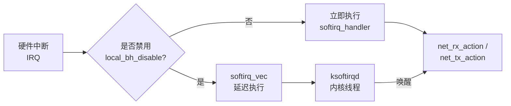
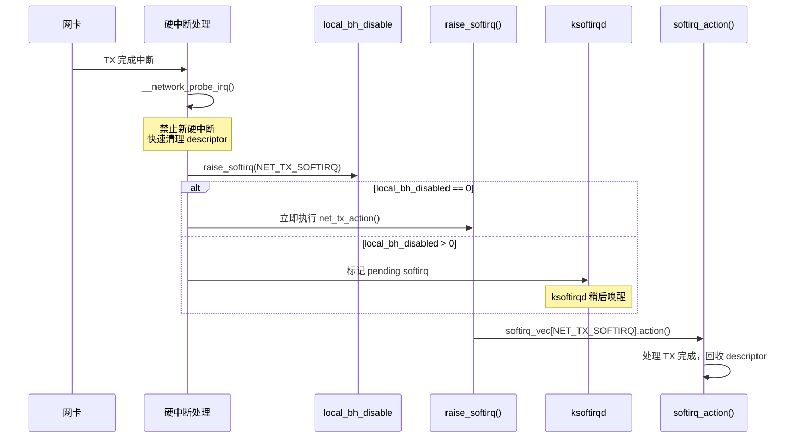

> [!info] Kernel Protocol Stack 深度探索系列
> 0. [[2026-04-13-kernel-protocol-stack-deep-dive-series-index|全栈学习路径总览]]
> 1. [[2026-04-13-kernel-protocol-stack-deep-dive-ch1-skbuff|第一章：sk_buff 与数据包生命周期]]
> 2. [[2026-04-13-kernel-protocol-stack-deep-dive-ch2-netdevice|第二章：Netdevice 与网卡抽象]]
> 3. [[2026-04-13-kernel-protocol-stack-deep-dive-ch3-ring-buffer|第三章：Ring Buffer 与 DMA]]
> 4. **第四章：软中断与 ksoftirqd**
> 5. [[2026-04-13-kernel-protocol-stack-deep-dive-ch5-napi|第五章：NAPI 与轮询模式]]
> 6. [[2026-04-13-kernel-protocol-stack-deep-dive-ch6-ethernet|第六章：Ethernet 与 MAC 层]]

---

## 1. 概述：为什么需要软中断？

Linux 网络栈的 RX/TX 处理发生在**软中断上下文**（softirq context），这是介于硬中断和进程上下文之间的特殊执行环境。

**核心矛盾：**

| 需求 | 硬中断约束 | 软中断优势 |
|------|-----------|-----------|
| 快速响应 | 必须在 `irq` 中响应 | 可延迟处理 |
| 上下文安全 | 不能睡眠、不能进程调度 | 可处理复杂任务 |
| 吞吐量大 | 每个包一次中断 → 中断风暴 | batch processing |
| 实时性 | 极低延迟 | 适中延迟 |

**软中断解决的问题：**

1. **中断分摊**：高速网卡每秒数百万个包，不可能每个包都触发一次硬中断
2. **上下文切换优化**：在软中断中批量处理，减少上下文切换
3. **协议栈兼容性**：TCP/IP 协议栈需要进程上下文（睡眠、调度），硬中断无法提供



---

## 2. 软中断子系统架构

### 2.1 软中断类型定义

Linux 定义了 10 种软中断类型（`include/linux/interrupt.h`）：

```c
// 软中断向量枚举
enum {
    HI_SOFTIRQ=0,        // 高优先级任务队列（多媒体/音频）
    TIMER_SOFTIRQ,       // 定时器
    NET_TX_SOFTIRQ,      // 网络 TX 完成
    NET_RX_SOFTIRQ,      // 网络 RX 接收
    BLOCK_SOFTIRQ,       // 块设备
    IRQ_POLL_SOFTIRQ,    // IRQ poll（blk-mq）
    TASKLET_SOFTIRQ,     // tasklet（驱动广泛使用）
    SCHED_SOFTIRQ,       // 调度器
    HRTIMER_SOFTIRQ,     // 高分辨率定时器
    NR_SOFTIRQS          // 总数 = 10
};

// 软中断处理函数表
static struct softirq_action softirq_vec[NR_SOFTIRQS];

struct softirq_action {
    void    (*action)(struct softirq_action *);
};
```

**网络相关的软中断只有两种：**

| Softirq | 用途 | 处理函数 |
|---------|------|---------|
| `NET_TX_SOFTIRQ` | TX 完成处理 | `net_tx_action()` |
| `NET_RX_SOFTIRQ` | RX 包接收处理 | `net_rx_action()` |

### 2.2 per-CPU softnet_data 结构

每个 CPU 有一个 `softnet_data` 结构，管理该 CPU 的网络软中断状态：

```c
// include/linux/netdevice.h
struct softnet_data {
    /* === RX 路径 === */
    struct sk_buff_head  input_pkt_queue;   // 等待处理的包队列
    struct napi_struct   *current_napi;      // 当前正在轮询的 NAPI
    
    /* === 统计 === */
    unsigned int        processed;           // 本轮处理的包数
    unsigned int        time_squeeze;        // 时间片耗尽而退出的次数
    unsigned int        cpu_collision;       // CPU 竞争计数
    unsigned int        received_rps;        // 收到的 RFS 唤醒
    
    /* === NAPI 列表 === */
    struct list_head    poll_list;           // 待轮询的 NAPI 链表
    
    /* === TX 路径 === */
    struct Qdisc         *output_queue;      // TX qdisc
    struct Qdisc        **output_queue_tailp;
    
    /* === backlog === */
    struct sk_buff_head  process_queue;      // 处理中队列（已废弃）
    
    /* === gro === */
    struct napi_gro_cb   *gro_list;
    int                   gro_count;
    
    /* === 中断亲和性 === */
    unsigned int        cpu;                  // CPU ID
    unsigned int        input_queue_head;
    unsigned int        input_queue_tail;
    
    /* === softnet_data 之间通信 === */
    call_single单_t       csd;
    struct softnet_data   *rps_ipi_next;
    
    /* === IOMMU === */
    unsigned int        iommu_rx;
    
    /* === offload === */
    struct bpf_prog      *xdp_prog;
    
    /* 64 字节对齐的 pad */
} ____cacheline_aligned_in_smp;
```

### 2.3 软中断触发路径

**硬中断 → 软中断的完整路径：**



**`raise_softirq` 关键实现：**

```c
void raise_softirq(unsigned int nr)
{
    unsigned long flags;
    
    // 关闭本地中断，防止并发
    local_irq_save(flags);
    
    // 1. 设置 pending 位图
    __raise_softirq_irqoff(nr);  // set_bit(nr, softirq_pending(cpu))
    
    // 2. 如果不在中断上下文中且有其他 CPU idle
    //    发送 IPI 让他们帮忙处理
    if (!in_interrupt() && may_send_ipi(nr))
        send_remote_softirq();
    
    // 3. 如果在硬中断上下文中，标记为待处理
    //    硬中断返回时会检查并执行
    
    local_irq_restore(flags);
}

// 关键宏：在中断返回前检查 pending
#define irq_exit() \
    do { \
        local_irq_disable(); \
        __irq_exit(); \
    } while (0)

void __irq_exit(void)
{
    // 检查是否有 pending softirq
    if (local_softirq_pending()) {
        // 在中断返回前执行 softirq（递归软中断）
        invoke_softirq();
    }
    
    // 允许进程调度
    preempt_count_dec();
    __schedule(SCHED_SOFTIRQ);
}
```

---

## 3. NET_TX_SOFTIRQ：发送完成处理

### 3.1 net_tx_action

TX softirq 处理网卡的发送完成，回收已发送的 descriptor：

```c
static __latent_entropy void net_tx_action(struct softirq_action *h)
{
    struct softnet_data *sd = this_cpu_ptr(&softnet_data);
    
    // 1. 处理 TX timeout（检测卡死队列）
    rps_unlock(sd);
    
    // 2. 处理 qdisc backlog
    if (sd->output_queue) {
        qdisc_run_endless(sd->output_queue);
    }
    
    // 3. 清理TX completion
    //    遍历所有 TX 队列
    struct list_head *list = &sd->poll_list;
    list_for_each_entry(napi, list, dev_list) {
        struct softnet_data *sd;
        
        // 调用驱动 TX 完成清理
        if (test_bit(NAPI_STATE_SCHED, &napi->state))
            net_tx_complete(napi);
    }
}

static void net_tx_complete(struct napi_struct *napi)
{
    struct softnet_data *sd = this_cpu_ptr(&softnet_data);
    struct net_device *dev = napi->dev;
    
    // 实际在驱动 TX 完成中断中直接处理
    // 这里主要处理 qdisc backlog
}
```

### 3.2 TX 完成处理简化流程

**实际上，TX 完成主要在驱动的硬件中断处理中完成：**

```c
// 驱动 TX 完成中断
static irqreturn_t i40e_msix_clean_rings(int irq, void *data)
{
    struct i40e_q_vector *q_vector = data;
    
    // 1. 禁止这个向量上的中断
    i40e_disable_vectors(q_vector);
    
    // 2. 触发 NET_TX_SOFTIRQ
    raise_softirq(NET_TX_SOFTIRQ);
    
    // 3. 触发 NAPI 轮询（处理 TX + RX）
    napi_schedule(&q_vector->napi);
    
    return IRQ_HANDLED;
}

// NET_TX_SOFTIRQ 回调（net_tx_action）实际上做的不多
// 因为驱动在中断中已经清理了大部分 TX 完成
```

**关键点：TX softirq 的主要作用是触发 qdisc 重排队，而不是处理 descriptor 完成。**

---

## 4. NET_RX_SOFTIRQ：接收处理

### 4.1 net_rx_action：RX softirq 主体

这是网络栈最热的路径之一：

```c
static void net_rx_action(struct softirq_action *h)
{
    struct softnet_data *sd = this_cpu_ptr(&softnet_data);
    unsigned long time_limit = jiffies + 2;  // 最多消耗 2 jiffies
    int budget = weight_p;  // default: 300 / net.core.netdev_budget
    LIST_HEAD(list);
    int work = 0;
    
    // 1. 将当前 NAPI 移到本地列表（避免竞争）
    list_splice_init(&sd->poll_list, &list);
    
    // 2. 循环处理直到 budget 耗尽或时间超时
    while (!list_empty(&list)) {
        struct napi_struct *napi;
        
        if (likely(time_before(jiffies, time_limit)))
            break;
        
        napi = list_first_entry(&list, struct napi_struct, poll_list);
        
        // 3. 调用 NAPI poll 回调（驱动提供）
        //    预算通常是 budget / num_queues
        int work_done = napi->poll(napi, weight);
        
        // 4. 如果工作完成，移除
        if (work_done < weight) {
            list_del_init(&napi->poll_list);
            __napi_complete(napi);
        }
        
        work += work_done;
        budget -= work_done;
        
        if (budget <= 0)
            break;
    }
    
    // 5. 如果还有待处理的 NAPI，重新触发 softirq
    if (!list_empty(&list))
        __raise_softirq_irqoff(NET_RX_SOFTIRQ);
    
    // 6. 处理 RPS（如果启用）
    rps_rx_triggers(sd);
}
```

### 4.2 backlog 处理：非 NAPI 驱动

对于不使用 NAPI 的传统驱动，包会进入 `backlog` 队列：

```c
// netif_rx 路径（传统驱动）
int netif_rx(struct sk_buff *skb)
{
    struct softnet_data *sd;
    int ret;
    
    net_timestamp_check(skb);
    
    // 1. 进入 softirq
    local_bh_disable();
    sd = this_cpu_ptr(&softnet_data);
    
    // 2. 加入 per-CPU backlog 队列
    ret = enqueue_to_backlog(skb, &sd);
    
    local_bh_enable();
    
    return ret;
}

static int enqueue_to_backlog(struct sk_buff *skb, int cpu,
                               unsigned int *pkt_truesize)
{
    struct softnet_data *sd = &per_cpu(softnet_data, cpu);
    unsigned long flags;
    
    // backlog 队列长度限制
    unsigned int qlen = skb_queue_len(&sd->input_pkt_queue);
    
    if (qlen >= rx_queue_len)  // /proc/sys/net/core/netdev_max_backlog
        goto drop;
    
    // 加入队列
    __skb_queue_tail(&sd->input_pkt_queue, skb);
    
    // 3. 如果这个 CPU 没有在运行 softirq，调度它
    if (!test_bit(NAPI_STATE_SCHED, &sd->backlog.state)) {
        ____napi_schedule(sd, &sd->backlog);
        raise_softirq(NET_RX_SOFTIRQ);
    }
    
    return NET_RX_SUCCESS;

drop:
    atomic_long_inc(&skb->dev->stats.rx_dropped);
    return NET_RX_DROP;
}

// backlog 的 NAPI poll 回调
static int process_backlog(struct napi_struct *napi, int budget)
{
    struct softnet_data *sd = this_cpu_ptr(&softnet_data);
    int work = 0;
    
    while (work < budget) {
        struct sk_buff *skb;
        
        // 从 backlog 队列取出
        skb = __skb_dequeue(&sd->input_pkt_queue);
        if (!skb)
            break;
        
        // 送入协议栈
        netif_receive_skb(skb);
        work++;
    }
    
    // 如果队列清空，重新开启硬中断
    if (work < budget)
        napi_complete_done(napi, work);
    
    return work;
}
```

### 4.3 NAPI 轮询权重

**NAPI poll 的 `weight` 参数控制每次 softirq 能处理多少包：**

```c
// 默认权重计算
unsigned int weight = 64;  // 旧版默认值

// 新版（内核 2.6.39+）基于 CPU 数量调整
// /proc/sys/net/core/dev_weight
unsigned int weight = 300;  // 多核系统默认

// 网卡驱动可以指定自己的权重
static int ixgbe_poll(struct napi_struct *napi, int budget)
{
    // 驱动可以选择只使用部分 budget
    // 比如 4 队列网卡，每队列用 1/4
    return ixgbe_clean_rx_irq(q_vector->rx_ring, budget / 4);
}
```

**关键配置：**

```bash
# 查看/设置单个 softirq 的最大 budget
cat /proc/sys/net/core/dev_weight

# 查看/设置 backlog 队列最大长度
cat /proc/sys/net/core/netdev_max_backlog

# 查看 per-CPU backlog 队列长度
netstat -s | grep "packet receive queue"
```

---

## 5. ksoftirqd：软中断守护线程

### 5.1 ksoftirqd 的存在理由

ksoftirqd 是每个 CPU 都有一个的内核线程（优先级最低），负责在**系统空闲时处理积压的 softirq**：

**场景：** 高硬中断频率 + 本地 BH 禁用 + CPU 繁忙

```
CPU 0 正在运行用户进程（local_bh_disabled）

同时：
- 网卡中断触发 10000 次/sec
- 每次中断 raise_softirq(NET_RX_SOFTIRQ)
- 但 softirq 无法立即执行（BH 禁用）
- softirq_pending 累积

用户进程退出 → 调度到 idle → ksoftirqd 处理累积的 softirq
```

### 5.2 ksoftirqd 线程函数

```c
static int ksoftirqd_should_run(unsigned int cpu)
{
    return local_softirq_pending();
}

static void run_ksoftirqd(unsigned int cpu)
{
    local_bh_disable();
    
    if (local_softirq_pending()) {
        // 执行 pending softirq
        __do_softirq();
        
        // 可能触发调度（如果还有工作要做）
        preempt_disable();
        __schedule(SCHED_SOFTIRQ);
        preempt_enable();
    }
    
    local_bh_enable();
}

// 内核线程主体
static int ksoftirqd(void *arg)
{
    set_current_state(TASK_INTERRUPTIBLE);
    
    while (!kthread_should_stop()) {
        if (!ksoftirqd_should_run(smp_processor_id()))
            schedule();
        
        __set_current_state(TASK_RUNNING);
        
        while (local_softirq_pending())
            run_ksoftirqd(smp_processor_id());
        
        set_current_state(TASK_INTERRUPTIBLE);
    }
    
    return 0;
}
```

### 5.3 __do_softirq：实际执行者

```c
asmlinkage __visible void __do_softirq(void)
{
    unsigned long pending = local_softirq_pending();
    struct softirq_action *h;
    unsigned int vec_nr;
    int prev_count;
    
    // 1. 标记进入 softirq 上下文
    prev_count = preempt_count();
    preempt_count_set(prev_count + SOFTIRQ_OFFSET);
    
    local_irq_enable();
    
    // 2. 按优先级顺序处理 softirq
    while (pending) {
        // 获取最低位的 set bit
        vec_nr = __ffs(pending);
        
        // 清除该位
        pending &= ~(1UL << vec_nr);
        
        h = &softirq_vec[vec_nr];
        
        // 调用处理函数
        h->action(h);
    }
    
    local_irq_disable();
    
    // 3. 处理完重新检查（可能有新的 pending）
    pending = local_softirq_pending();
    if (pending) {
        // 如果太多（> 10），唤醒 ksoftirqd 处理
        if (pending >= 10)
            wakeup_softirqd();
    }
    
    // 4. 恢复 preempt count
    preempt_count_set(prev_count);
    
    // 5. 处理网络统计
    rcu_bh_qs();
}
```

---

## 6. 软中断与硬中断的协同

### 6.1 中断处理时间线

```
时间 ─────────────────────────────────────────────────►

硬中断                    软中断（softirq）
   │                          │
   ▼                          │
┌──────────────┐              │
│ 硬件中断处理  │              │
│ (50-100 μs)  │              │
└──────┬───────┘              │
       │                      │
       ▼ 触发 softirq         │
┌──────────────────┐          │
│ 完成最小化清理   │          │
│ (禁用更多中断)   │──────────┼──► net_rx_action()
└──────────────────┘          │
       │                      │
       ▼                      │
┌──────────────────┐          │
│ IRQ 返回         │          │
│ (检查 softirq)   │          │
└──────┬───────────┘          │
       │                      │
       ▼ 继续 softirq         │
┌──────────────────┐          │
│ 处理 backlog     │          │
│ 调用 NAPI poll   │          │
└──────────────────┘
```

### 6.2 中断亲和性与 RPS

**RPS（Receive Packet Steering）** 是软件层面的 RSS：


```bash
# 启用 RPS（单队列网卡需要软件分流）
# /sys/class/net/eth0/queues/rx-0/rps_cpus
echo f > /sys/class/net/eth0/queues/rx-0/rps_cpus

# 查看 RFS（Receive Flow Steering）
cat /proc/sys/net/core/rps_sock_flow_entries
```

### 6.3 中断合并（Interrupt Coalescing）

**硬件层面的优化，配合软中断减少 CPU 负载：**

```c
// ethtool coalesce 设置
struct ethtool_coalesce {
    __u32   rx_coalesce_usecs;      // RX 等待多少 μs 后产生中断
    __u32   rx_max_coalesced_frames; // RX 累积多少帧后产生中断
    __u32   tx_coalesce_usecs;
    __u32   tx_max_coalesced_frames;
    __u32   rx_max_coalesced_frames_irq; // 中断后合并
    __u32   stats_block_coalesce_usecs;
    __u32   use_adaptive_rx_coalesce;    // 自适应合并
};
```

**自适应合并（Intel i40e 示例）：**

```c
// 驱动检测到 CPU 繁忙时自动增加 rx_usecs
// 空闲时减少，降低延迟
static void i40e_update_adaptive_coalesce(struct i40e_q_vector *q_vector)
{
    if (q_vector->adaptive_rx) {
        if (q_vector->rx_pkt_count > 20000) {
            // 繁忙，增加合并时间
            q_vector->rx_usecs = min(q_vector->rx_usecs + 4, 125);
        } else if (q_vector->rx_pkt_count < 1000) {
            // 空闲，减少合并时间
            q_vector->rx_usecs = max(q_vector->rx_usecs - 2, 4);
        }
        q_vector->rx_pkt_count = 0;
    }
}
```

---

## 7. 性能调参与配置

### 7.1 关键 /proc 接口

```bash
# 网络 softirq 相关
cat /proc/softirqs                    # 查看 softirq 触发统计
cat /proc/net/softnet_stat             # per-CPU 网络统计

# 格式：idx | total | dropped | squeeze | ... | cpu
# idx: 每行代表一个包计数器
```

### 7.2 sysctl 参数

```bash
# 查看所有网络相关 sysctl
sysctl -a | grep net

# 关键参数：
# net.core.netdev_max_backlog       # backlog 队列最大长度（默认 1000）
# net.core.netdev_budget            # 每个 softirq 最大处理包数（默认 300）
# net.core.dev_weight               # NAPI poll weight（默认 64）
# net.core.netdev_budget_usecs      # softirq 时间预算（默认 2000 μs）
# net.core.rps_default_cpu          # RPS 默认 CPU 掩码
```

### 7.3 性能调优建议

```bash
# 1. 调整 softirq budget（高吞吐场景）
sysctl -w net.core.netdev_budget=600
sysctl -w net.core.dev_weight=128

# 2. 调整 backlog 长度（防止丢包）
sysctl -w net.core.netdev_max_backlog=2000

# 3. CPU 亲和性（将网卡中断绑定到特定 CPU）
# 查看网卡 IRQ
cat /proc/interrupts | grep eth0

# 设置 IRQ 亲和性
echo 1 > /proc/irq/XXX/smp_affinity

# 4. 启用 turbo mode（如果 BIOS 支持）
# 5. 确保 IRQbalance 服务运行
systemctl enable irqbalance
```

### 7.4 常见问题排查

```bash
# 查看是否有 softirq 积压（time_squeeze）
cat /proc/net/softnet_stat | awk '{print $3}' | sort | uniq -c

# time_squeeze > 0 说明 softirq 时间片耗尽退出了
# 应该增加 netdev_budget 或减少 CPU 负载

# 查看 CPU 是否被 softirq 占用过高
mpstat -P ALL 1 | grep -E "CPU|soft"

# 如果某个 CPU softirq 占用 100%，考虑 RSS/RPS 分散负载
```

---

## 8. 小结与下章预告

本章深入解析了 Linux 内核软中断机制：

1. **软中断类型**：NET_TX/RX softirq 是网络栈的核心
2. **softnet_data**：per-CPU 数据结构管理 RX/TX 状态
3. **触发路径**：硬中断 → raise_softirq → softirq 执行
4. **net_rx_action**：处理 backlog 和 NAPI 轮询
5. **ksoftirqd**：处理 BH 禁用时积压的 softirq
6. **中断合并**：硬件层面减少软中断频率

**下章（NAPI 与轮询模式）** 将深入讲解现代高速网卡的标准接收模式——NAPI 的完整实现、dynirq 动态中断调整、以及 interrupt moderation 策略。

---

## 参考资料

- `kernel/softirq.c` — 软中断子系统实现
- `net/core/dev.c` — net_rx_action, net_tx_action 实现
- `include/linux/netdevice.h` — softnet_data 定义
- `include/linux/interrupt.h` — 软中断类型定义
- Documentation/networking/scaling.txt — RSS/RPS 文档
- Documentation/networking/form_desc.txt — 中断合并文档
