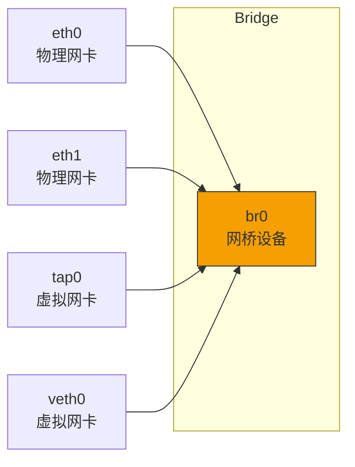
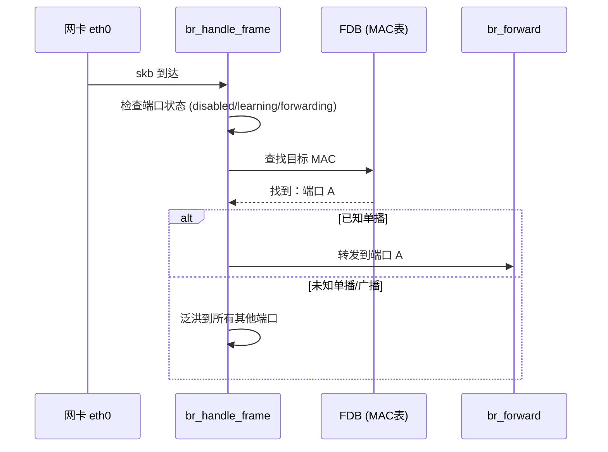
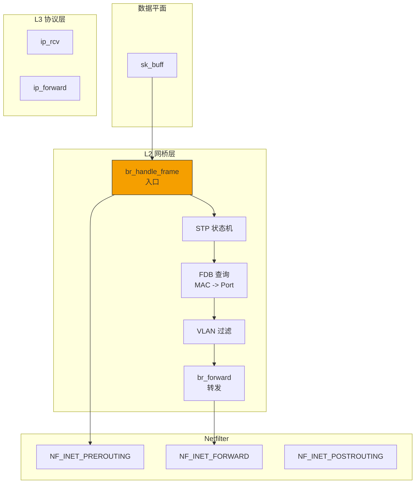

> [!info] Kernel Protocol Stack 深度探索系列
> 0. [[2026-04-13-kernel-protocol-stack-deep-dive-series-index|全栈学习路径总览]]
> 1. [[2026-04-13-kernel-protocol-stack-deep-dive-ch1-skbuff|第一章：sk_buff 与数据包生命周期]]
> 2. [[2026-04-13-kernel-protocol-stack-deep-dive-ch2-netdevice|第二章：Netdevice 与网卡抽象]]
> 3. [[2026-04-13-kernel-protocol-stack-deep-dive-ch3-ring-buffer|第三章：Ring Buffer 与 DMA]]
> 4. [[2026-04-13-kernel-protocol-stack-deep-dive-ch4-softirq|第四章：软中断与 ksoftirqd]]
> 5. [[2026-04-13-kernel-protocol-stack-deep-dive-ch5-napi|第五章：NAPI 与轮询模式]]
> 6. [[2026-04-13-kernel-protocol-stack-deep-dive-ch6-ethernet|第六章：Ethernet 与 MAC 层]]
> 7. **第七章：网桥与 Switchdev**

---

## 1. 概述：网桥在网络栈中的位置

Linux 网桥（Bridge）是工作在内核层面的纯软件交换机实现，连接多个物理网卡或虚拟网卡，使它们像同一物理交换机上的端口一样通信。网桥在虚拟化（KVM/QEMU）、容器网络（Docker、Kubernetes）中扮演核心角色。

**网桥的核心特点：**

1. **二层转发**：基于 MAC 地址学习，无需 IP 配置即可工作
2. **自动学习**：无需手动配置 MAC 表，动态学习源 MAC
3. **广播抑制**：通过生成树协议（STP）避免广播环路
4. **VLAN 支持**：支持 802.1Q VLAN 标签过滤



---

## 2. 网桥数据结构

### 2.1 核心数据结构

网桥在内核中由 `struct net_bridge` 表示：

```c
// net/bridge/bridge_private.h
struct net_bridge {
    struct net_bridge           *br;           // 指向自身的指针
    spinlock_t                   lock;         // 保护网桥状态
    struct net_device            *dev;          // 网桥对应的 net_device
    
    // 端口列表
    struct list_head             port_list;
    struct net_bridge_port       *dev_port;     // 自己的端口
    
    // MAC 地址表
    struct rhashtable            fdb_hash_tbl;    // MAC -> port 映射
    unsigned long                features;
    
    // STP 配置
    struct net_bridge_mc_fdb    mc_lazy;       // 组播转发表
    u16                           bridge_id;     // 网桥优先级 + MAC
    u8                            stp_enabled;   // STP 是否启用
    unsigned long                bridge_max_age;
    unsigned long                 bridge_hello_time;
    unsigned long                 bridge_forward_delay;
    
    // VLAN 配置
    struct net_bridge_vlan_group     vlan_group;
    u16                         vlan_enabled;
    
    // 生成树协议状态
    struct timer_list           hello_timer;
    struct timer_list           tcn_timer;
    struct timer_list           topology_change_timer;
    
    struct rcu_head             rcu;
};
```

### 2.2 网桥端口结构

每个连接到网桥的接口都有一个 `net_bridge_port`：

```c
struct net_bridge_port {
    struct net_bridge           *br;           // 所属网桥
    struct net_device           *dev;           // 对应的网络设备
    struct list_head             list;          // 加入网桥的 port_list
    
    // 端口标识
    u16                           port_no;      // 端口号 (1-255)
    unsigned char                 prio;          // 端口优先级
    u8                            state;         // 当前状态 (disabled/learning/forwarding)
    
    // 配置参数
    unsigned long                 path_cost;    // 路径成本
    unsigned long                 designated_cost;
    u16                           designated_port;
    u16                           designated_bridge;
    u16                           root_id;
    
    // 标志位
    unsigned long                 flags;
    
    // Topology Change Acknowledgment
    u8                            topology_change_ack;
    
    struct rcu_head             rcu;
};
```

### 2.3 MAC 转发表（Forwarding Database）

网桥维护一个 MAC 地址到端口的映射表（FDB）：

```c
struct net_bridge_fdb_entry {
    struct rhash_head           rhnode;
    struct net_bridge_port      *dst;           // 出端口
    
    unsigned char                addr[ETH_ALEN]; // MAC 地址
    __u16                        vlan_id;       // VLAN ID
    unsigned long               updated;
    unsigned long               used;
    
    atomic_t                     usage;
    
    /* 标志位 */
    unsigned char                is_local:1;     // 本地 MAC
    unsigned char                is_static:1;    // 静态条目
    unsigned char                frozen:1;       // 冻结（不学习）
};
```

**FDB 查找时间复杂度：O(1)** —— 使用 rhashtable 实现。

---

## 3. 网桥接收与转发路径

### 3.1 网桥设备注册

网桥通过 `rtnetlink` 机制创建：

```bash
# 创建网桥
ip link add br0 type bridge

# 将接口加入网桥
ip link set eth0 master br0
ip link set eth1 master br0

# 启用网桥
ip link set br0 up
```

内核处理流程：

```c
// net/bridge/br_if.c
int br_add_if(struct net_bridge *br, struct net_device *dev)
{
    struct net_bridge_port *p;
    
    // 1. 分配新的 port 结构
    p = new_nbp(br, dev, index);
    if (IS_ERR(p))
        return PTR_ERR(p);
    
    // 2. 设置 rx_handler（核心！）
    dev->rx_handler = br_handle_frame;
    dev->rx_handler_data = p;
    
    // 3. 添加到网桥的 port_list
    list_add_rcu(&p->list, &br->port_list);
    
    // 4. 通知上层地址变化
    call_netdevice_notifiers(NETDEV_CHANGEADDR, dev);
    
    // 5. 更新 MAC 地址表
    br_fdb_insert(br, p, dev->dev_addr, 0);
    
    return 0;
}
```

### 3.2 数据包接收：br_handle_frame

当数据包到达网桥端口时，`rx_handler` 被调用：

```c
// net/bridge/br_input.c
static rx_handler_result_t br_handle_frame(struct sk_buff **pskb)
{
    struct sk_buff *skb = *pskb;
    struct net_bridge_port *p = rcu_dereference(skb->dev->rx_handler_data);
    struct net_bridge *br;
    const unsigned char *dest;
    
    // 1. 进入快速路径前检查
    if (p->state == BR_STATE_DISABLED)
        return RX_HANDLER_PASS;
    
    br = p->br;
    
    // 2. 更新统计信息
    br_port_stats_inc(p, rx_packets, rx_bytes);
    
    // 3. 提取目标 MAC
    dest = eth_hdr(skb)->h_dest;
    
    // 4. 处理 BPDU（生成树协议）
    if (unlikely(is_link_local(dest))) {
        br_handle_local_finish(skb);
        return RX_HANDLER_PASS;
    }
    
    // 5. 学习源 MAC（源地址学习）
    br_fdb_update(br, p, eth_hdr(skb)->h_source, skb->vlan_tci & VLAN_VID_MASK);
    
    // 6. 查找目标 MAC
    if (br_fdb_find(br, dest, skb->vlan_tci & VLAN_VID_MASK)) {
        // 已知单播地址，转发到对应端口
        return br_forward_finish(skb);
    }
    
    // 7. 广播/未知单播——泛洪
    br_flood_deliver(br, skb, false);
    
    return RX_HANDLER_CONSUMED;
}
```

### 3.3 MAC 地址学习

```c
// net/bridge/br_fdb.c
void br_fdb_update(struct net_bridge *br, struct net_bridge_port *p,
                    const unsigned char *addr, u16 vlan_id)
{
    struct net_bridge_fdb_entry *fdb;
    
    // 查找是否已存在
    fdb = rhltable_lookup(&br->fdb_hash_tbl, &addr, br_fdb_hash_params);
    
    if (likely(fdb)) {
        // 已存在条目——更新
        if (likely(fdb->dst == p))
            return;  // 同一端口，直接返回
        
        // 不同端口，更新（可能是 MAC 漂移）
        fdb->dst = p;
        fdb->used = jiffies;
    } else {
        // 新 MAC——插入
        fdb = kmalloc(sizeof(*fdb), GFP_ATOMIC);
        if (!fdb)
            return;
        
        memcpy(fdb->addr, addr, ETH_ALEN);
        fdb->dst = p;
        fdb->vlan_id = vlan_id;
        fdb->updated = fdb->used = jiffies;
        fdb->is_local = 0;
        fdb->is_static = 0;
        
        rhashtable_insert_fast(&br->fdb_hash_tbl, &fdb->rhnode,
                               br_fdb_hash_params);
    }
}
```

### 3.4 数据包转发流程



---

## 4. 生成树协议（STP）

### 4.1 STP 概述

生成树协议（Spanning Tree Protocol）通过禁用冗余链路来防止广播环路，同时保留故障切换能力。

**STP 端口状态机：**

| 状态 | 说明 | 能学习 MAC | 能转发数据 | 能接收 BPDU |
|------|------|-----------|-----------|-------------|
| Disabled | 端口关闭 | 否 | 否 | 否 |
| Blocking | 初始状态，阻塞冗余 | 否 | 否 | 是 |
| Listening | 等待 BPDU 确认 | 否 | 否 | 是 |
| Learning | 学习 MAC | 是 | 否 | 是 |
| Forwarding | 正常转发 | 是 | 是 | 是 |

### 4.2 BPDU 格式

```c
// net/bridge/stp.h
struct stp_header {
    __u8  dsap;           // 0x42 (LLC SAP)
    __u8  ssap;           // 0x42
    __u8  control;       // 0x03 (UI)
};

struct stp_bpdu {
    __be16  protocol;     // 0x0000 (STP)
    __u8    version;      // 0x00 (STP), 0x02 (RSTP), 0x03 (MSTP)
    __u8    type;        // 0x00 (Config), 0x80 (TCN)
    
    // Config BPDU
    __u8    flags;        // Topology Change flag, etc.
    __u8    root_id[8];  // Root Bridge ID (Priority + MAC)
    __be32  root_path_cost;
    __u8    bridge_id[8]; // Sender Bridge ID
    __be16  port_id;     // Sender Port ID
    __be16  message_age;
    __be16  max_age;
    __be16  hello_time;
    __be16  forward_delay;
};
```

### 4.3 STP 内核实现

```c
// net/bridge/br_stp.c
void br_bpdu_send_config(struct net_bridge_port *p)
{
    struct br_config_bpdu bpdu;
    struct sk_buff *skb;
    
    // 构造 BPDU
    bpdu.protocol = htons(0);
    bpdu.version = p->br->stp_enabled;  // STP/RSTP/MSTP
    bpdu.type = CONFIG_BPDU;
    bpdu.flags = ...;
    bpdu.root_id = p->br->root_id;
    bpdu.root_path_cost = ...;
    bpdu.bridge_id = ...;
    bpdu.port_id = p->port_id;
    
    // 发送到设计端口
    br_send_bpdu(p, &bpdu);
}

static void br_send_bpdu(struct net_bridge_port *p, struct br_config_bpdu *bpdu)
{
    struct sk_buff *skb;
    
    skb = dev_alloc_skb(size);
    // ... 填充 BPDU 数据 ...
    
    // 设置目标 MAC 为桥接多播地址
    eth hdr(skb)->h_dest = bridge_addr;  // 01:80:C2:00:00:00
    
    // 发送到物理网络
    dev_queue_xmit(skb);
}
```

---

## 5. VLAN 与网桥的结合

### 5.1 网桥 VLAN 过滤

启用 VLAN 过滤后，网桥可以限制每个端口允许的 VLAN：

```bash
# 启用网桥 VLAN 过滤
ip link set br0 type bridge vlan_filtering 1

# 设置 trunk 口（允许所有 VLAN）
ip link set eth0 type bridge_slave master br0 vlan_filtering 1

# 设置 access 口（仅 VLAN 100）
ip link set tap0 type bridge_slave master br0 vlan_filtering 1
bridge vlan add dev tap0 vid 100 pvid untagged
```

### 5.2 网桥 VLAN 数据结构

```c
// net/bridge/br_vlan.c
struct net_bridge_vlan {
    struct rhash_head     vnode;       // 哈希表节点
    struct net_bridge_port   *port;    // NULL 表示网桥自身
    u16                  vid;          // VLAN ID (1-4094)
    u16                  flags;        // BRIDGE_VLAN_INFO_* flags
    
    atomic_t              refcount;   // 引用计数
    struct timer_list     timer;       // VLAN 条目超时
    struct rcu_head       rcu;
};

struct net_bridge_vlan_group {
    struct rhashtable   *hash;         // vid -> net_bridge_vlan
    u16                  nr_vlans;     // VLAN 数量
    u16                  pvid;         // Port VLAN ID (native VLAN)
};
```

### 5.3 VLAN 感知转发

```c
// net/bridge/br_forward.c
static void __br_forward(const struct net_bridge_port *to,
                         struct sk_buff *skb, bool local_orig)
{
    struct net_device *indev;
    
    // 获取入端口
    indev = skb->dev;
    
    // 设置出端口
    skb->dev = to->dev;
    
    // VLAN 处理：检查出端口是否允许此 VLAN
    if (skb->vlan_tci && !br_vlan_allowed(to, skb->vlan_tci & VLAN_VID_MASK)) {
        kfree_skb(skb);
        return;
    }
    
    // Forward
    __br_forward_finish(skb);
}

static int br_vlan_allowed(const struct net_bridge_port *p, u16 vid)
{
    struct net_bridge_vlan_group *vg;
    
    vg = nla_data(rca_dereference(p->vlgrp));
    if (!vg)
        return 0;  // 无 VLAN 组，不允许
    
    // 检查此 VID 是否在允许列表中
    return br_vlan_find(vg, vid) != NULL;
}
```

---

## 6. Switchdev 模式

### 6.1 什么是 Switchdev

Switchdev 是一种将硬件交换机卸载（offload）网桥功能的技术。网卡在 switchdev 模式下可以执行：

- MAC 地址学习
- VLAN 过滤
- STP 端口状态
- 硬件转发表

**而不需要 CPU 参与每个包的转发决策。**

### 6.2 Switchdev 数据结构

```c
// include/net/switchdev.h
enum switchdev_attr_id {
    SWITCHDEV_ATTR_ID_PORT_STP_STATE,
    SWITCHDEV_ATTR_ID_PORT_MTU,
    SWITCHDEV_ATTR_ID_BRIDGE_VLAN_FILTERING,
    SWITCHDEV_ATTR_ID_BRIDGE_FDB,
    SWITCHDEV_ATTR_ID_BRIDGE_MDB,
};

struct switchdev_attr {
    enum switchdev_attr_id   id;
    u32                      flags;
    void                     *ctx;
    const void               *orig_dev;
    union {
        struct {
            u8    state;
        }Port_stp_state;
        struct {
            unsigned char   addr[ETH_ALEN];
            u16              vid;
            bool             is_local;
        }Fdb;
    }u;
};

enum switchdev_obj_id {
    SWITCHDEV_OBJ_ID_PORT_VLAN,
    SWITCHDEV_OBJ_ID_FDB,
    SWITCHDEV_OBJ_ID_MDB,
};

struct switchdev_obj {
    enum switchdev_obj_id   id;
    const struct net_device *orig_dev;
    union {
        struct {
            u16              vid;
            u16              flags;
        }Port_vlan;
    }u;
};
```

### 6.3 Switchdev 驱动卸载示例

```c
// 驱动注册 switchdev attr
static int mydev_port_attr_set(struct net_device *dev,
                               const struct switchdev_attr *attr,
                               struct netlink_ext_ack *extack)
{
    switch (attr->id) {
    case SWITCHDEV_ATTR_ID_PORT_STP_STATE:
        // 通知硬件设置端口 STP 状态
        return mydev_set_stp_state(dev, attr->u.Port_stp_state.state);
        
    case SWITCHDEV_ATTR_ID_BRIDGE_VLAN_FILTERING:
        // 启用/禁用 VLAN 过滤
        return mydev_set_vlan_filtering(dev, 
                                        attr->u.bridge_vlan_filtering);
    }
    return -EOPNOTSUPP;
}

// 驱动实现 FDB 卸载
static int mydev_fdb_add(struct net_device *dev,
                         const unsigned char *addr, u16 vid)
{
    // 通知网卡硬件添加 MAC -> VID 映射
    return mydev_hw_fdb_add(dev, addr, vid);
}
```

### 6.4 Switchdev 模式下的网桥

```bash
# 使用 switchdev 模式（需要硬件支持）
ip link set eth0 type switchdev

# 查看 switchdev 信息
cat /sys/class/net/eth0/switchdev
```

---

## 7. 网桥与 Netfilter

### 7.1 网桥防火墙钩子

网桥在 `br_handle_frame` 路径中调用 Netfilter 钩子：

```c
// net/bridge/br_netfilter_hooks.c

// IPv4 转发路径中的 Netfilter 钩子
static unsigned int br_nf_pre_routing(void *priv,
                                      struct sk_buff *skb,
                                      const struct nf_hook_state *state)
{
    struct nf_bridge_info *nf_bridge;
    
    if (skb->protocol != htons(ETH_P_IP))
        return NF_ACCEPT;
    
    // 分配并初始化 bridge info
    nf_bridge = nf_bridge_alloc(skb);
    if (!nf_bridge)
        return NF_DROP;
    
    // 挂载到 skb
    skb->nf_bridge = nf_bridge;
    
    // 调用 iptables 规则（PREROUTING）
    return nf_hook(skb, NF_INET_PRE_ROUTING);
}

// 其他钩子点
static unsigned int br_nf_local_in(void *priv,
                                   struct sk_buff *skb,
                                   const struct nf_hook_state *state);
static unsigned int br_nf_forward(void *priv,
                                  struct sk_buff *skb,
                                  const struct nf_hook_state *state);
```

### 7.2 启用网桥防火墙

```bash
# 加载 br_netfilter 模块
modprobe br_netfilter

# 启用网桥过滤
echo 1 > /proc/sys/net/bridge/bridge-nf-call-iptables

# 也可以通过 sysctl 永久设置
sysctl -w net.bridge.bridge-nf-call-iptables=1
```

---

## 8. 网桥管理命令

```bash
# 创建和配置网桥
ip link add br0 type bridge
ip link set eth0 master br0
ip link set eth1 master br0
ip link set br0 up

# 查看网桥信息
bridge link show
bridge fdb show
bridge vlan show

# 查看 STP 状态
bridge -d -s link show
bridge -d -s vlan show

# 设置 STP 参数
ip link set br0 type bridge stp_state 1
ip link set br0 type bridge forward_delay 15
ip link set br0 type bridge hello_time 2

# 添加静态 MAC 条目
bridge fdb add 00:11:22:33:44:55 dev eth0 master static

# 设置端口路径成本（影响 STP）
ip link set eth0 type bridge_slave path_cost 100
```

---

## 9. 总结：网桥在网络栈中的位置



**网桥是 Linux 虚拟化的核心组件：**

- KVM/QEMU 使用 tap 设备连接网桥实现虚拟机网络
- Docker 默认使用 bridge 驱动
- Kubernetes CNI（如 bridge plugin）使用 Linux 网桥
- OvS (Open vSwitch) 提供更高级的流表功能

**关键点：**

1. 网桥是纯软件实现的二层交换机
2. 通过 rx_handler 拦截数据包，而非驱动
3. FDB 使用 rhashtable 实现 O(1) 查找
4. STP 通过 BPDU 泛洪发现环路并阻塞冗余路径
5. VLAN 过滤在转发时检查 VID
6. Switchdev 将二层转发卸载到硬件
