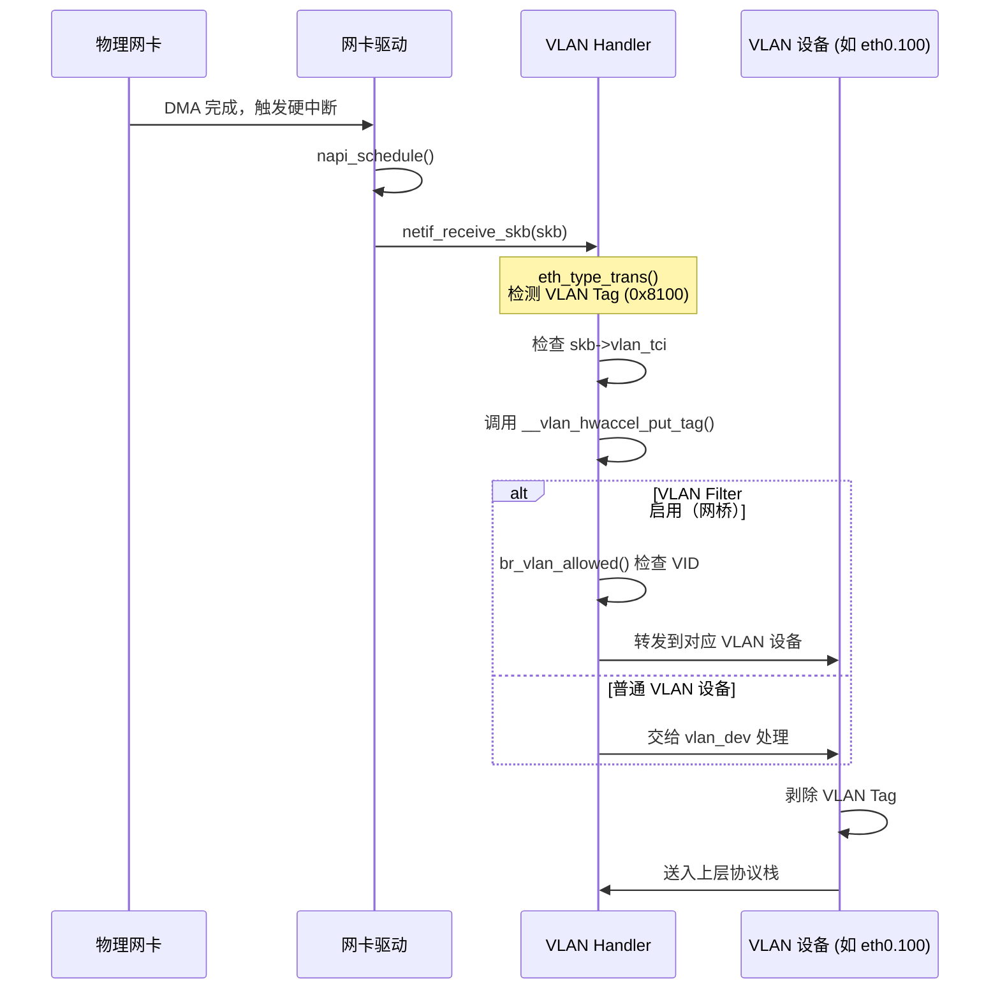

> [!info] Kernel Protocol Stack 深度探索系列
> 0. [[2026-04-13-kernel-protocol-stack-deep-dive-series-index|全栈学习路径总览]]
> 1. [[2026-04-13-kernel-protocol-stack-deep-dive-ch1-skbuff|第一章：sk_buff 与数据包生命周期]]
> 2. [[2026-04-13-kernel-protocol-stack-deep-dive-ch2-netdevice|第二章：Netdevice 与网卡抽象]]
> 3. [[2026-04-13-kernel-protocol-stack-deep-dive-ch3-ring-buffer|第三章：Ring Buffer 与 DMA]]
> 4. [[2026-04-13-kernel-protocol-stack-deep-dive-ch4-softirq|第四章：软中断与 ksoftirqd]]
> 5. [[2026-04-13-kernel-protocol-stack-deep-dive-ch5-napi|第五章：NAPI 与轮询模式]]
> 6. [[2026-04-13-kernel-protocol-stack-deep-dive-ch6-ethernet|第六章：Ethernet 与 MAC 层]]
> 7. [[2026-04-13-kernel-protocol-stack-deep-dive-ch7-bridge|第七章：网桥与 Switchdev]]
> 8. **第八章：VLAN 与 802.1Q**

---

## 1. 概述：VLAN 解决的问题

IEEE 802.1Q VLAN（Virtual Local Area Network）解决了传统交换机的几个关键问题：

1. **广播域隔离**：无需物理隔离即可隔离广播域
2. **网络分段**：同一交换机上实现多业务网络隔离
3. **安全性**：不同 VLAN 之间不能直接通信，需三层路由
4. **简化管理**：修改 VLAN 配置比物理布线更灵活

**VLAN 在 Linux 网络栈中的位置：**

```mermaid
graph LR
    subgraph "应用层"
        APP["用户态"]
    end
    
    subgraph "L4"
        L4["TCP/UDP"]
    end
    
    subgraph "L3"
        L3["IP"]
    end
    
    subgraph "VLAN层"
        VLAN["802.1Q Tag<br/>TCI + Protocol"]
    end
    
    subgraph "L2"
        ETH["Ethernet"]
    end
    
    APP --> L4 --> L3 --> VLAN --> ETH
    
    style VLAN fill:#f59f00,stroke:#333
```

---

## 2. 802.1Q VLAN 帧格式详解

### 2.1 VLAN Tag 结构

802.1Q 在以太网帧的源 MAC 和类型/长度字段之间插入 4 字节 VLAN Tag：

```
┌─────────┬─────────┬──────────┬──────────────┬───────────────────────────┬────────┐
│ Dest MAC│ Src MAC │ VLAN Tag │ EtherType   │ Payload                    │ CRC    │
│ 6 bytes │ 6 bytes │ 4 bytes  │ 2 bytes     │ 46-1500 bytes             │ 4B    │
└─────────┴─────────┴──────────┴──────────────┴───────────────────────────┴────────┘
                                                     ◄─── 标准 Ethernet 帧 ────►
                              ◄─── 带 VLAN Tag: 18 bytes ────►
```

### 2.2 VLAN Tag 内部结构

```c
// include/linux/if_vlan.h
struct vlan_hdr {
    __be16  h_vlan_TCI;              // Tag Control Information (2 bytes)
    __be16  h_vlan_encapsulated_proto; // 负载协议类型 (2 bytes)
} __attribute__((packed));

// VLAN Tag Control Information (TCI)
struct {
#if defined(__LITTLE_ENDIAN_BITFIELD)
    __u16   vid:12,               // VLAN ID (0-4095)
            dei:1,               // DEI (Drop Eligibility Indicator, 原 CFI)
            pcp:3;               // Priority Code Point (802.1p)
#elif defined(__BIG_ENDIAN_BITFIELD)
    __u16   pcp:3,
            dei:1,
            vid:12;
#endif
} __attribute__((packed));
```

### 2.3 TCI 各字段详解

| 字段 | 位宽 | 说明 | 用途 |
|------|------|------|------|
| VID | 12 bits | VLAN Identifier | 标识 VLAN (0-4095) |
| DEI | 1 bit | Drop Eligibility Indicator | 帧是否可被丢弃（QoS） |
| PCP | 3 bits | Priority Code Point | 802.1p QoS 优先级 (0-7) |

**PCP 优先级映射：**

| PCP | 优先级 | 典型用途 |
|-----|--------|----------|
| 0 | Best Effort | 普通数据 |
| 1 | Background | 后台任务 |
| 2 | Reserved | - |
| 3 | Excellent Effort | 关键业务 |
| 4 | Controlled Load | 实时业务 |
| 5 | Video | 视频 (<100ms) |
| 6 | Voice | 语音 (<10ms) |
| 7 | Network Control | 控制平面 |

---

## 3. VLAN 数据结构

### 3.1 VLAN 设备结构

每个 VLAN 接口（如 eth0.100）对应一个 `struct vlan_dev_priv`：

```c
// net/8021q/vlan.h
struct vlan_dev_priv {
    // 关联的物理设备
    struct net_device   *real_dev;
    
    // VLAN 标识
    u16                 vlan_id;         // VLAN ID (1-4094)
    u16                 vlan_proto;      // ETH_P_8021Q 或 ETH_P_8021AD
    
    // VLAN 特性标志
    u32                 flags;
    
    // VLAN 协议处理
    struct packet_type  vlan_pp;
    
    // MAC 地址（默认继承物理设备 MAC）
    unsigned char       addr[ETH_ALEN];
    
    // 统计信息
    struct vlan_stats   __percpu *vlan_stats;
    
    // 广播/多播地址
    struct in_device   *indev;
};
```

### 3.2 VLAN Group（网桥 VLAN 过滤）

网桥使用 `vlan_group` 存储允许的 VLAN 列表：

```c
// net/bridge/br_vlan.c
struct net_bridge_vlan {
    struct rhash_head       vnode;       // 哈希表节点
    struct net_bridge_port  *port;       // NULL 表示网桥自身
    u16                     vid;         // VLAN ID (1-4094)
    u16                     flags;      // BRIDGE_VLAN_* flags
    
    // 状态
    atomic_t                refcount;   // 引用计数
    unsigned long           unused_after;
    struct timer_list       timer;
    
    struct rcu_head         rcu;
};

enum bridge_vlan_flags {
    BRIDGE_VLAN_INFO_UNTAGGED   = BIT(0),  // 无标签出口
    BRIDGE_VLAN_INFO_TAGGED     = BIT(1),  // 标签出口
    BRIDGE_VLAN_INFO_PEER       = BIT(2),  // 来自 peer
    BRIDGE_VLAN_INFO_MASTER     = BIT(3),  // master 设备
    BRIDGE_VLAN_INFO_BRENTRY    = BIT(4),  // 网桥自身
};

struct net_bridge_vlan_group {
    struct rhashtable   *hash;     // vid -> net_bridge_vlan 哈希表
    u16                 nr_vlans; // 当前 VLAN 数量
    u16                 pvid;     // Port VLAN ID (native VLAN)
};
```

### 3.3 skb 中的 VLAN 信息

VLAN 信息存储在 `skb->vlan_tci` 和 `vlan_proto`：

```c
// include/linux/skbuff.h
struct sk_buff {
    // VLAN 相关
    __u16           vlan_tci;        // VLAN Tag Control Information
    __be16          vlan_proto;      // VLAN 协议 (0x8100 or 0x88a8)
    
    // 实际存储位置
    #define VLAN_TAG_PRESENT    0x1000
    #define VLAN_TAG_CONTROL(tci) ((tci) & 0x0FFF)
    #define VLAN_VID_MASK       0x0FFF
    #define VLAN_N_VID          4096
};
```

---

## 4. VLAN 处理流程

### 4.1 VLAN 接收流程



### 4.2 VLAN Tag 剥除与添加

```c
// net/8021q/vlan_dev.c
static netdev_tx_t vlan_dev_start_xmit(struct sk_buff *skb,
                                        struct net_device *dev)
{
    struct vlan_dev_priv *vlan = vlan_dev_priv(dev);
    
    // 1. 确认 VLAN Tag 存在
    BUG_ON(!skb_vlan_tag_present(skb));
    
    // 2. 更新统计
    dev->stats.tx_packets++;
    dev->stats.tx_bytes += skb->len;
    
    // 3. 设置协议为内层协议
    skb->protocol = vlan->vlan_proto;  // 恢复原始 EtherType
    
    // 4. 清除 VLAN tag（硬件已处理，这里只是元数据）
    skb->vlan_tci = 0;
    
    // 5. 发送到物理设备
    return dev_queue_xmit(skb);
}
```

### 4.3 VLAN Tag 的硬件卸载

现代网卡支持 VLAN Tag 的硬件插入/剥离：

```c
// 驱动中的 VLAN offload 支持
static void i40e_vlan_stripping(struct i40e_ring *rx_ring, bool on)
{
    u32 reg;
    
    if (on) {
        // 启用 VLAN stripping（硬件自动剥除 Tag）
        reg = rd32(&rx_ring->q_vector->hw,
                  I40E_QRX_VLAN_PRENA);
        reg |= I40E_QRX_VLAN_PRENA_VLANSTAR_MASK;
        wr32(&rx_ring->q_vector->hw,
             I40E_QRX_VLAN_PRENA, reg);
    } else {
        // 禁用，由软件处理
    }
}

// 检查网卡 VLAN offload 能力
static const char i40e_gstrings_features[][ETH_GSTRING_LEN] = {
    "NETIF_F_HW_VLAN_CTAG_RX",   // 硬件剥离 VLAN Tag
    "NETIF_F_HW_VLAN_CTAG_TX",   // 硬件插入 VLAN Tag
    "NETIF_F_HW_VLAN_STAG_RX",   // 硬件剥离 QinQ Tag
    "NETIF_F_HW_VLAN_STAG_TX",   // 硬件插入 QinQ Tag
};
```

---

## 5. VLAN 与网桥的结合

### 5.1 网桥端口 VLAN 模式

```bash
# 创建带 VLAN 过滤的网桥
ip link add br0 type bridge vlan_filtering 1

# 设置 trunk 口（允许所有 VLAN）
ip link set eth0 master br0
ip link set eth0 type bridge_slave vlan_filtering 1

# 设置 access 口（VLAN 100，仅接收/发送无标签帧）
ip link set tap0 master br0
ip link set tap0 type bridge_slave vlan_filtering 1
bridge vlan add dev tap0 vid 100 pvid untagged

# 查看 VLAN 配置
bridge vlan show
```

### 5.2 VLAN-aware 桥接流程

```c
// net/bridge/br_forward.c
void br_forward(const struct net_bridge_port *to,
                struct sk_buff *skb, bool local_rcv)
{
    // 1. 检查 VLAN 过滤
    if (skb->vlan_tci && !br_vlan_allowed(to, skb->vlan_tci & VLAN_VID_MASK)) {
        kfree_skb(skb);
        return;
    }
    
    // 2. 检查端口状态
    if (to->state != BR_STATE_FORWARDING)
        return;
    
    // 3. 转发
    if (local_rcv)
        br_deliver(to, skb);    // 送本地
    else
        __br_forward(to, skb); // 转发到其他端口
}
```

### 5.3 VLAN 学习

每个 VLAN 有独立的 MAC 地址表：

```c
// net/bridge/br_fdb.c
struct net_bridge_fdb_entry {
    struct rhash_head       rhnode;
    unsigned char           addr[ETH_ALEN];  // MAC 地址
    struct net_bridge_port  *dst;            // 出端口
    u16                     vlan_id;         // 关联的 VLAN
    
    unsigned long           updated;
    unsigned long           used;
    
    atomic_t                usage;
    
    unsigned char           is_local:1;
    unsigned char           is_static:1;
    unsigned char           frozen:1;
    unsigned char           added_by_user:1;
    unsigned char           added_by_external_learn:1;
};
```

**同一 MAC 可能出现在不同 VLAN 的不同端口上。**

---

## 6. QinQ（802.1ad）双层 VLAN

### 6.1 QinQ 帧格式

QinQ（802.1ad）在标准 802.1Q VLAN Tag 外部再封装一层 Service VLAN Tag：

```
┌─────────┬─────────┬────────────┬──────────────┬──────────────┬─────────────────────────┬────────┐
│ Dest MAC│ Src MAC │ S-VLAN Tag│  C-VLAN Tag  │ EtherType    │ Payload                  │ CRC    │
│ 6 bytes │ 6 bytes │ 4 bytes   │ 4 bytes      │ 2 bytes      │ 46-1500 bytes           │ 4B    │
└─────────┴─────────┴───────────┴──────────────┴──────────────┴─────────────────────────┴────────┘
                          ◄── 8 bytes VLAN Tags ──►
                                    ◄── 内层 VLAN ──►
```

### 6.2 QinQ 数据结构

```c
// net/8021q/vlan.h
// QinQ 使用 ETH_P_8021AD (0x88a8)
#define ETH_P_8021AD     0x88a8

struct vlan_ethhdr {
    unsigned char   h_dest[ETH_ALEN];
    unsigned char   h_source[ETH_ALEN];
    __be16          h_vlan_proto;           // 外层: 0x8100 或 0x88a8
    __be16          h_vlan_TCI;            // 外层 TCI
    __be16          h_vlan_encapsulated_proto; // 内层协议类型
} __attribute__((packed));

// QinQ 配置
struct vlan_dev_priv {
    // ...
    u16             vlan_id;               // C-VID (Customer VLAN ID)
    u16             vlan_proto;            // ETH_P_8021Q 或 ETH_P_8021AD
    
    // QinQ 嵌套
    u16             inner_vlan_id;         // 内层 VLAN
    bool            vlan_proto_simple;      // 简化的 QinQ 模式
};
```

### 6.3 QinQ 配置示例

```bash
# 创建 QinQ 设备（外层 VLAN 100，内层从帧中提取）
ip link add link eth0 name eth0.100 type vlan proto 802.1ad id 100

# 或者使用 8021q 模块
modprobe 8021q
vconfig add eth0 100
vconfig set_flag eth0 100 2 1  # 设置 QinQ 模式

# 查看 QinQ 信息
ip -d link show eth0.100
```

---

## 7. VLAN 过滤与安全

### 7.1 VLAN 隔离

启用 VLAN 过滤后，不同 VLAN 的流量天然隔离：

```bash
# 创建隔离的 VLAN
ip link add br0 type bridge vlan_filtering 1

# VLAN 10 - 财务网络
ip link add br0.10 type bridge
ip link set eth0.10 master br0
bridge vlan add dev eth0.10 vid 10

# VLAN 20 - 研发网络
ip link add br0.20 type bridge
ip link set eth0.20 master br0
bridge vlan add dev eth0.20 vid 20

# 两个 VLAN 无法直接通信
```

### 7.2 VLAN Hopping 攻击防护

常见的 VLAN 攻击方式及防护：

| 攻击方式 | 描述 | 内核防护 |
|---------|------|---------|
| Switch Spoofing | 模拟交换机发送 DTP | 禁用 DTP，手动设置 trunk |
| Double Tagging | 双层标签外层剥离 | 交换机端口启用 VLAN 过滤 |
| ARP Spoofing | VLAN 内 ARP 欺骗 | 启用 802.1X 认证 |

### 7.3 Private VLAN（PVLAN）

PVLAN 将一个 VLAN 进一步划分为：

- **Primary VLAN**：与外部通信
- **Secondary VLAN**：
  - **Isolated**：与其他端口完全隔离
  - **Community**：同 community 内可通信

```bash
# Linux 内核通过 ebtables 实现 PVLAN
ebtables -A PVLAN --vlan-id 100 -j ACCEPT
ebtables -A PVLAN --vlan-id 100 --vlan-prio 0 --pvlan-member-type isolated -j DROP
```

---

## 8. VLAN 配置与管理

### 8.1 VLAN 创建与删除

```bash
# 方法 1: ip link（推荐）
ip link add link eth0 name eth0.100 type vlan id 100
ip addr add 192.168.100.1/24 dev eth0.100
ip link set eth0.100 up

# 方法 2: vconfig（传统方式）
vconfig add eth0 100
ifconfig eth0.100 192.168.100.1 netmask 255.255.255.0 up

# 删除 VLAN
ip link delete eth0.100
# 或
vconfig rem eth0.100
```

### 8.2 查看 VLAN 信息

```bash
# 查看 VLAN 设备
ip link show type vlan

# 查看 /proc/net/vlan
cat /proc/net/vlan/config

# 查看详细 VLAN 信息
ip -d link show eth0.100

# 查看网桥 VLAN 表
bridge vlan show
bridge fdb show
```

### 8.3 VLAN 与 udev

```bash
# /etc/systemd/network/10-eth0.100.network
[Match]
Name=eth0.100

[Network]
Address=192.168.100.1/24
Gateway=192.168.100.254
DNS=8.8.8.8

[VLAN]
Id=100
```

---

## 9. VLAN 性能优化

### 9.1 VLAN 批量处理

```c
// 驱动支持批量 VLAN 操作
static int mydev_set_vlan_filter(struct net_device *dev, u16 vid, bool enable)
{
    struct mydev_priv *priv = netdev_priv(dev);
    
    // 硬件设置 VLAN 过滤表
    return mydev_hw_vlan_filter(priv, vid, enable);
}

// 批量添加 VLAN（VLAN 范围）
static int mydev_set_vlan_filter_range(struct net_device *dev,
                                        u16 vid_start, u16 vid_end)
{
    // 使用硬件 VLAN 过滤器的范围功能
    return mydev_hw_vlan_filter_range(dev, vid_start, vid_end);
}
```

### 9.2 GRO 与 VLAN

```c
// 驱动在 GRO 时保留 VLAN 信息
static gro_result_t mydev_gro_receive(struct napi_struct *napi,
                                        struct sk_buff *skb)
{
    struct vlan_hdr *vhdr;
    
    if (skb->protocol == htons(ETH_P_8021Q)) {
        vhdr = (struct vlan_hdr *)skb->data;
        skb->vlan_tci = ntohs(vhdr->h_vlan_TCI);
        skb->vlan_proto = htons(ETH_P_8021Q);
        
        // 移动 skb->data 到内层
        __skb_pull(skb, VLAN_HLEN);
        skb->protocol = eth_type_trans(skb, dev);
    }
    
    // 调用标准 GRO
    return napi_gro_receive(napi, skb);
}
```

---

## 10. 总结：VLAN 在网络栈中的位置

```mermaid
graph TD
    subgraph "用户态"
        APP["应用"]
    end
    
    subgraph "Socket 层"
        SKT["sock"]
    end
    
    subgraph "L4"
        L4["TCP/UDP"]
    end
    
    subgraph "L3"
        L3["IP"]
    end
    
    subgraph "VLAN 层"
        VLAN_TAG["VLAN Tag<br/>(TCI + Protocol)"]
    end
    
    subgraph "L2"
        ETH["Ethernet"]
    end
    
    subgraph "硬件"
        NIC["网卡"]
    end
    
    APP --> SKT --> L4 --> L3
    L3 --> VLAN_TAG --> ETH --> NIC
    
    style VLAN_TAG fill:#f59f00,stroke:#333
```

**VLAN 关键点：**

1. **802.1Q 在 Ethernet 帧中插入 4 字节 Tag**
2. **VID (12 bits) 支持 4096 个 VLAN (0-4095)**
3. **PCP (3 bits) 支持 8 级 QoS 优先级**
4. **VLAN Group 在网桥中实现 VLAN 过滤**
5. **QinQ (802.1ad) 实现双层 VLAN 标签**
6. **硬件可卸载 VLAN Tag 的插入/剥离**
7. **不同 VLAN 天然隔离，需三层路由互通**
