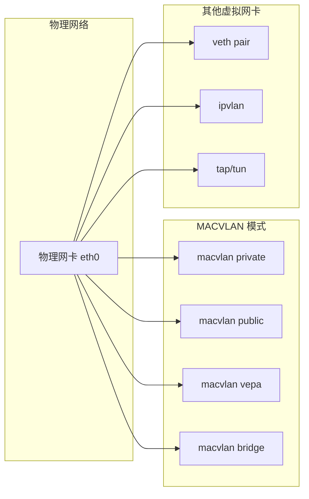
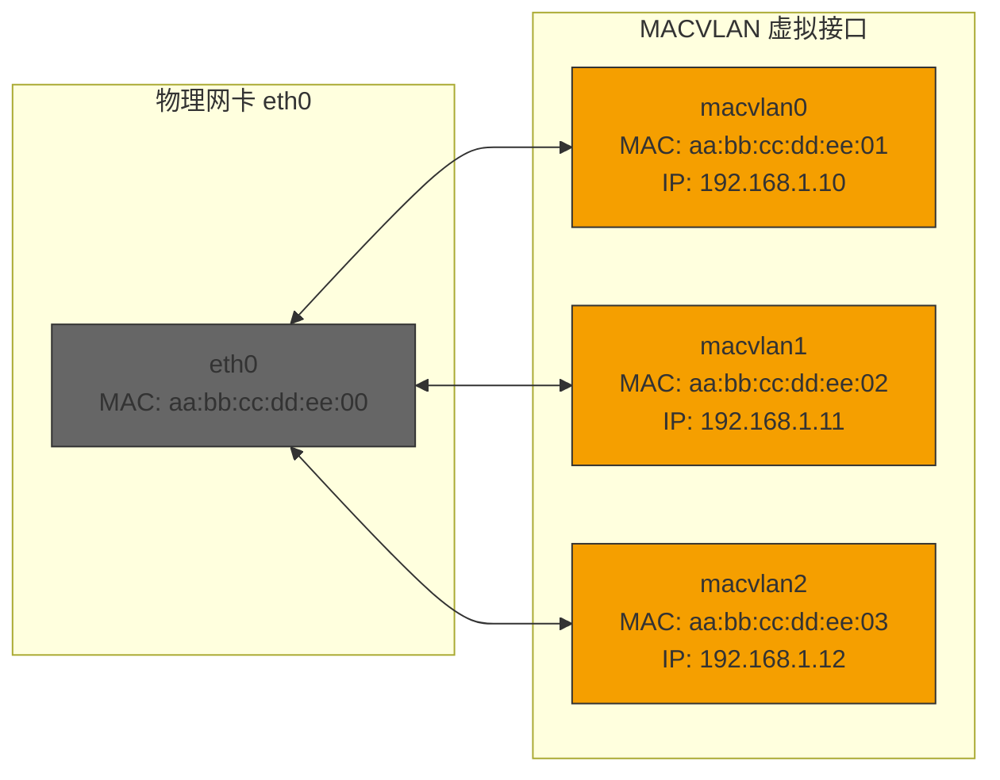
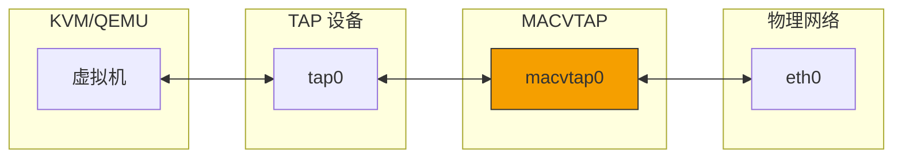
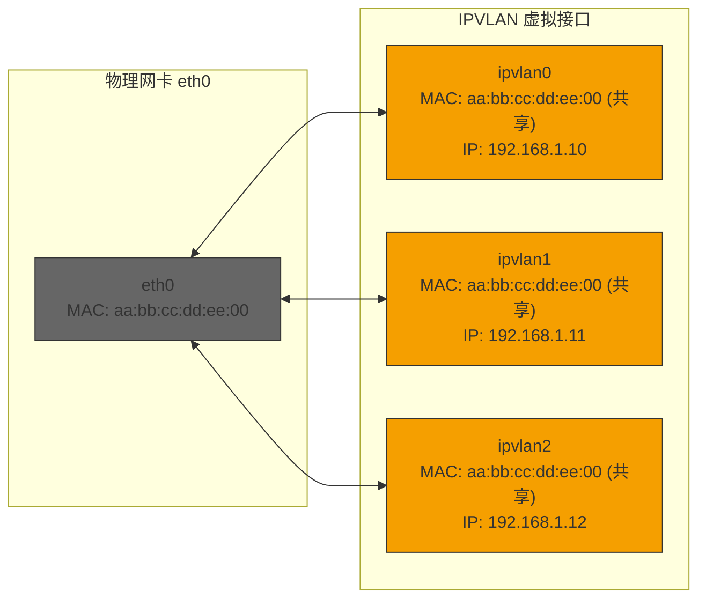
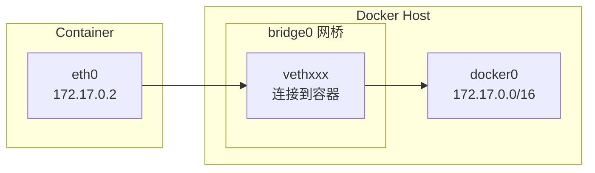
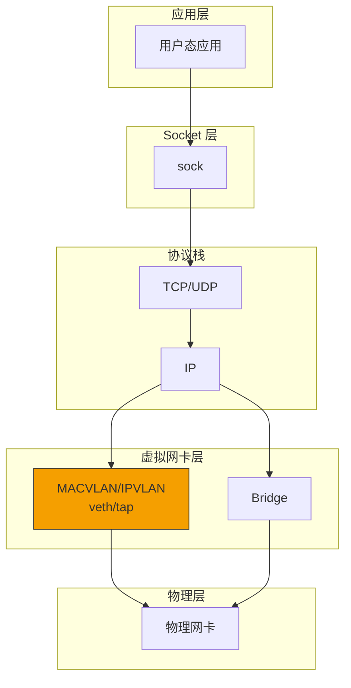

> [!info] Kernel Protocol Stack 深度探索系列 0. [[2026-04-13-kernel-protocol-stack-deep-dive-series-index|全栈学习路径总览]]
>
> 1. [[2026-04-13-kernel-protocol-stack-deep-dive-ch1-skbuff|第一章：sk_buff 与数据包生命周期]]
> 2. [[2026-04-13-kernel-protocol-stack-deep-dive-ch2-netdevice|第二章：Netdevice 与网卡抽象]]
> 3. [[2026-04-13-kernel-protocol-stack-deep-dive-ch3-ring-buffer|第三章：Ring Buffer 与 DMA]]
> 4. [[2026-04-13-kernel-protocol-stack-deep-dive-ch4-softirq|第四章：软中断与 ksoftirqd]]
> 5. [[2026-04-13-kernel-protocol-stack-deep-dive-ch5-napi|第五章：NAPI 与轮询模式]]
> 6. [[2026-04-13-kernel-protocol-stack-deep-dive-ch6-ethernet|第六章：Ethernet 与 MAC 层]]
> 7. [[2026-04-13-kernel-protocol-stack-deep-dive-ch7-bridge|第七章：网桥与 Switchdev]]
> 8. [[2026-04-13-kernel-protocol-stack-deep-dive-ch8-vlan|第八章：VLAN 与 802.1Q]]
> 9. **第九章：MACVLAN 与虚拟网卡**

---

## 1. 概述：虚拟网卡技术全景

Linux 提供多种虚拟网卡技术，它们在不同的应用场景中扮演关键角色：

| 技术          | 工作层 | MAC 地址       | 典型用途                     |
| ------------- | ------ | -------------- | ---------------------------- |
| **veth pair** | L2     | 独立           | 容器网络（Docker、K8s）      |
| **macvlan**   | L2     | 虚拟独立 MAC   | KVM 虚拟机、网络命名空间     |
| **macvtap**   | L2     | 虚拟独立 MAC   | KVM 虚拟化（ TAP + macvlan） |
| **ipvlan**    | L2/L3  | 共享父接口 MAC | 容器、高密度虚拟化           |
| **bridge**    | L2     | 无（透明）     | 虚拟机/容器互联              |



---

## 2. MACVLAN 深入解析

### 2.1 MACVLAN 架构

MACVLAN 允许在单个物理网卡上创建多个虚拟接口，每个接口拥有独立的 MAC 地址和 IP 地址。它们就像连接到同一物理交换机的独立网卡。



### 2.2 MACVLAN 数据结构

```c
// drivers/net/macvlan.c
struct macvlan_dev {
    struct list_head        list;
    struct net_device       *dev;           // MACVLAN 设备自身
    struct net_device       *lowerdev;      // 父物理设备
    struct macvlan_port    *port;           // MACVLAN 端口

    // MACVLAN 模式
    unsigned char           mode;            // MACVLAN_MODE_*

    // MAC 地址
    unsigned char           addr[ETH_ALEN];

    // 标志位
    unsigned long           flags;

    // 统计
    struct macvlan_stats   __percpu *stats;

    // 下游接收回调
    void                    (*receive)(struct sk_buff *skb);
    void                    (*forward)(struct net_device *dev,
                                      struct sk_buff *skb);

    struct rcu_head         rcu;
};

struct macvlan_port {
    struct net_device       *dev;           // 物理设备
    struct list_head        vlans;           // 关联的 MACVLAN 设备列表
    unsigned long           flags;
    u16                     nr_vlan_mc;     // 组播地址数量

    // 接收队列
    struct napi_struct      *napi;

    bool                    bc_queue;
    struct sk_buff_head     bc_queue;
};
```

### 2.3 MACVLAN 模式详解

```c
// include/linux/if_link.h
enum macvlan_mode {
    MACVLAN_MODE_PRIVATE = 1,     // 私有模式：不允许与其他 macvlan 通信
    MACVLAN_MODE_VEPA    = 2,     // VEPA 模式：流量发送到外部交换机
    MACVLAN_MODE_BRIDGE  = 4,     // Bridge 模式：macvlan 之间直接通信
    MACVLAN_MODE_PASSTHRU = 8,   // Passthru 模式：允许修改父设备
    MACVLAN_MODE_SOURCE  = 16,   // Source 模式：基于源 MAC 过滤
};
```

| 模式         | 说明         | MACVLAN 间通信 | 与父接口通信         |
| ------------ | ------------ | -------------- | -------------------- |
| **private**  | 隔离模式     | 否             | 否                   |
| **vepa**     | 发送到外部   | 否             | 是（通过外部交换机） |
| **bridge**   | 内部桥接     | 是             | 是（通过父接口）     |
| **passthru** | 单个 MACVLAN | N/A            | 完全接管父接口       |
| **source**   | 源 MAC 过滤  | 基于配置       | 基于配置             |

### 2.4 MACVLAN 接收流程

```c
// drivers/net/macvlan.c
static rx_handler_result_t macvlan_handle_frame(struct sk_buff **pskb)
{
    struct sk_buff *skb = *pskb;
    struct macvlan_port *port;
    struct net_device *dev;
    unsigned char *dest;

    // 1. 获取 macvlan_port
    port = rcu_dereference(skb->dev->macvlan_port);
    if (!port)
        return RX_HANDLER_PASS;

    // 2. 根据模式处理
    if (port->flags & MACVLAN_FLAG_VEPA) {
        // VEPA 模式：所有流量发送到外部
        return macvlan_dev_queue_xmit(skb, port->dev);
    }

    // 3. 查找目标 MAC 对应的 macvlan 设备
    dest = eth_hdr(skb)->h_dest;
    list_for_each_entry(dev, &port->vlans, macvlan.list) {
        if (ether_addr_equal(macvlan_dev(dev)->addr, dest)) {
            // 找到目标设备
            skb->dev = dev;
            return RX_HANDLER_PASS;  // 传递给目标设备的协议栈
        }
    }

    // 4. 未找到——广播或丢弃
    if (is_multicast_ether_addr(dest)) {
        return macvlan_broadcast_ok(skb, port)
            ? macvlan_broadcast()
            : RX_HANDLER_PASS;
    }

    // 未知单播
    return RX_HANDLER_PASS;
}
```

---

## 3. MACVTAP 与 TAP

### 3.1 TAP 设备

TAP 设备是工作在二层的虚拟网卡，数据包通过字符设备 `/dev/net/tun` 与用户态交互：

```c
// drivers/net/tun.c
struct tun_struct {
    struct net_device      *dev;           // tun 设备
    struct file            *file;          // 关联的文件描述符

    // 队列
    struct tun_file        *tfile;
    struct ptr_ring        tx_ring;        // 发送队列

    // 标志
    unsigned int           flags;          // IFF_TAP, IFF_TUN 等
    char                   name[IFNAMSIZ];

    // 统计
    struct pcpu_sw_netstats __percpu *stats;
};
```

### 3.2 MACVTAP：MACVLAN + TAP

MACVTAP 将 MACVLAN 和 TAP 结合，提供给 KVM/QEMU 虚拟机使用：



### 3.3 MACVTAP 配置

```bash
# 创建 macvtap 设备（bridge 模式）
ip link add link eth0 name macvtap0 type macvtap mode bridge

# 获取 TAP 文件描述符
cat /dev/net/tap$(cat /sys/class/net/macvtap0/ifindex)

# 在 QEMU 中使用
qemu-system-x86_64 -netdev tap,fd=3,id=hostnet0 \
    -device virtio-net-pci,netdev=hostnet0,mac=aa:bb:cc:dd:ee:01
```

---

## 4. IPVLAN

### 4.1 IPVLAN 架构

IPVLAN 与 MACVLAN 的主要区别是**共享父接口的 MAC 地址**：



**IPVLAN 优势：**

1. **节省 MAC 地址**：适合 MAC 地址有限的环境
2. **避免 MAC 过滤**：某些交换机对每个端口 MAC 数量有限制
3. **更简单的网络管理**：无需担心 MAC 地址冲突

### 4.2 IPVLAN 模式

```c
// drivers/net/ipvlan/ipvlan.h
enum ipvl_mode {
    IPVLAN_MODE_L2 = 1,        // 二层模式：独立 MAC
    IPVLAN_MODE_L3 = 2,        // 三层模式：共享 MAC，IP 隔离
    IPVLAN_MODE_L3S = 4,       // 三层对称模式：L3 + conntrack 支持
};
```

| 模式    | MAC  | IP   | 隔离级别            |
| ------- | ---- | ---- | ------------------- |
| **L2**  | 共享 | 独立 | 二层隔离            |
| **L3**  | 共享 | 独立 | 三层隔离（需路由）  |
| **L3S** | 共享 | 独立 | L3 + conntrack 兼容 |

### 4.3 IPVLAN 数据结构

```c
// drivers/net/ipvlan/ipvlan.h
struct ipvl_dev {
    struct net_device       *dev;           // ipvlan 设备
    struct net_device       *phy_dev;       // 父设备
    struct ipvl_port        *port;          // 端口
    void                    *priv;          // 私有数据

    // IP 地址
    struct in_ifaddr         *ip4addr;      // IPv4 主地址
    struct inet6_ifaddr      *ip6addr;       // IPv6 主地址

    // 模式
    unsigned char            mode;

    struct list_head         adj_list;       // L3 模式的 ARP 表
};

struct ipvl_port {
    struct net_device       *dev;           // 物理设备
    struct ipvl_dev          *master;       // L3S 模式的 master
    unsigned int             dev_cnt;       // ipvlan 设备数量

    struct list_head        head;           // ipvlan 设备链表

    unsigned int             mode;
};
```

### 4.4 IPVLAN L3 模式接收流程

```c
// drivers/net/ipvlan/ipvlan.c
static rx_handler_result_t ipvlan_rcv_frame(struct ipvl_buf *buf,
                                              struct ipvl_port *port)
{
    struct sk_buff *skb = buf->skb;
    struct ipvl_dev *ipvlan;
    union inet_addr *saddr, *daddr;

    // L2 模式：基于 MAC 查找
    if (port->mode == IPVLAN_MODE_L2) {
        list_for_each_entry(ipvlan, &port->head, pnode) {
            if (ether_addr_equal(eth_hdr(skb)->h_dest,
                                ipvlan->dev->dev_addr)) {
                return ipvlan_deliver_skb(buf, ipvlan);
            }
        }
        return RX_HANDLER_PASS;
    }

    // L3 模式：基于 IP 查找
    saddr = inet_ifa_match(buf->iphdr->saddr, ...);
    daddr = inet_ifa_match(buf->iphdr->daddr, ...);

    list_for_each_entry(ipvlan, &port->head, pnode) {
        if (ipvlan_addr_match(ipvlan, daddr)) {
            return ipvlan_deliver_skb(buf, ipvlan);
        }
    }

    return RX_HANDLER_PASS;
}
```

---

## 5. veth pair（虚拟以太网对）

### 5.1 veth pair 架构

veth pair 是一对虚拟网卡，数据在一端发送会直接到达另一端：

```
┌─────────────┐         ┌─────────────┐
│   veth0     │────────▶│   veth1     │
│  (namespace A)│◀────────│  (namespace B)│
└─────────────┘         └─────────────┘
```

**典型应用：连接网络命名空间**

```bash
# 创建 veth pair
ip link add veth0 type veth peer name veth1

# 将一端移到 namespace
ip link set veth1 netns ns1

# 配置 IP
ip addr add 192.168.1.1/24 dev veth0
ip link set veth0 up

# 在 namespace 中配置
ip netns exec ns1 ip addr add 192.168.1.2/24 dev veth1
ip netns exec ns1 ip link set veth1 up
```

### 5.2 veth 数据结构

```c
// drivers/net/veth.c
struct veth_priv {
    struct net_device __rcu   *peer;           // veth 配对设备
    struct dentry           *dir;              // debugfs 目录
    struct list_head        rcv;               // 接收队列
    atomic64_t              dropped;           // 丢包计数
    unsigned int            request_queue_idx;
};
```

### 5.3 veth 发送流程

```c
// drivers/net/veth.c
static netdev_tx_t veth_xmit(struct sk_buff *skb, struct net_device *dev)
{
    struct veth_priv *priv = netdev_priv(dev);
    struct net_device *rcv;
    struct sk_buff *skb_out;

    // 1. 获取配对设备
    rcu_read_lock();
    rcv = rcu_dereference(priv->peer);
    if (unlikely(!rcv)) {
        rcu_read_unlock();
        goto drop;
    }

    // 2. 检查配额
    if (likely(!pskb_expand_head(skb, 0, 0, GFP_ATOMIC))) {
        skb_out = skb;
    } else {
        goto drop;
    }

    // 3. 统计
    dev->stats.tx_packets++;
    dev->stats.tx_bytes += skb_out->len;

    // 4. 设置目标设备
    skb_out->dev = rcv;
    skb_out->queue_mapping = 0;

    // 5. 发送到配对设备（直接调用对方接收）
    netif_rx(skb_out);

    rcu_read_unlock();
    return NETDEV_TX_OK;

drop:
    rcu_read_unlock();
    dev->stats.tx_dropped++;
    kfree_skb(skb);
    return NETDEV_TX_OK;
}
```

---

## 6. 容器网络中的虚拟网卡

### 6.1 Docker 网络模型

Docker 使用 veth pair 连接容器和网络命名空间：



### 6.2 Kubernetes CNI

Kubernetes 使用 CNI（Container Network Interface）管理网络：

```bash
# 查看 pod 网络命名空间
ls /var/run/netns/
cat /proc/$(pidof nginx)/ns/net

# 查看 veth pair
ip link show | grep veth
bridge fdb show | grep veth

# 查看容器内 eth0
nsenter -t <pid> -n ip addr
```

### 6.3 Calico 的虚拟网卡策略

Calico 使用 veth pair + routing 实现三层网络：

```bash
# Calico 在容器内创建 veth
ip link add cali0 type veth peer name cali0a

# 配置路由
ip route add 192.168.0.0/16 dev cali0 scope link

# 查看 Felix（Calico agent）配置
cat /etc/calico/felix.cfg
```

---

## 7. 虚拟网卡对比与选择

### 7.1 技术对比

| 特性           | macvlan    | ipvlan     | veth        | bridge      |
| -------------- | ---------- | ---------- | ----------- | ----------- |
| MAC 地址       | 独立/共享  | 共享       | 各自独立    | 透明        |
| 需要的 MAC 数  | 多         | 1          | 各自独立    | 透明        |
| 二层通信       | 可直接互连 | 需外部交换 | 通过 pair   | 通过 bridge |
| 三层通信       | 正常路由   | 正常路由   | 正常路由    | 正常路由    |
| 连接外部网络   | 可以       | 可以       | 需要 bridge | 需要 bridge |
| Netfilter 支持 | 完整       | 有限       | 完整        | 完整        |

### 7.2 使用场景

| 场景           | 推荐技术           | 原因                     |
| -------------- | ------------------ | ------------------------ |
| KVM 虚拟机     | macvtap            | 支持 TAP，直接读写数据包 |
| Docker 容器    | veth pair + bridge | 成熟稳定，生态完善       |
| K8s Pod        | veth + CNI         | 灵活的 CNI 插件支持      |
| 高密度容器     | ipvlan L3          | 节省 MAC，减少广播       |
| 网络隔离测试   | macvlan            | 完全的二层隔离           |
| 简单点对点连接 | veth pair          | 最简单，无额外开销       |

---

## 8. 虚拟网卡配置示例

### 8.1 macvlan 配置

```bash
# 创建 macvlan（bridge 模式）
ip link add link eth0 name macvlan0 type macvlan mode bridge

# 配置 IP
ip addr add 192.168.100.1/24 dev macvlan0
ip link set macvlan0 up

# 查看
ip link show macvlan0
ip addr show macvlan0

# 删除
ip link delete macvlan0
```

### 8.2 ipvlan 配置

```bash
# 创建 ipvlan（L3 模式）
ip link add link eth0 name ipvlan0 type ipvlan mode l3

# 配置 IP
ip addr add 192.168.100.1/24 dev ipvlan0
ip link set ipvlan0 up

# 查看
ip link show ipvlan0
```

### 8.3 veth pair 配置

```bash
# 创建 veth pair
ip link add veth0 type veth peer name veth1

# 查看
ip link show type veth

# 配置
ip addr add 10.0.0.1/24 dev veth0
ip link set veth0 up
ip link set veth1 up
```

---

## 9. 总结：虚拟网卡技术栈



**关键点总结：**

1. **MACVLAN**：每个虚拟接口有独立 MAC，可工作在不同模式
2. **IPVLAN**：共享父接口 MAC，减少 MAC 地址消耗
3. **veth pair**：最简单的虚拟网卡对，用于连接命名空间
4. **TAP/TUN**：提供用户态与内核的数据通路
5. **MACVTAP**：结合 MACVLAN 和 TAP，用于虚拟化
6. **容器网络**：通常使用 veth pair + bridge 或 CNI 插件
