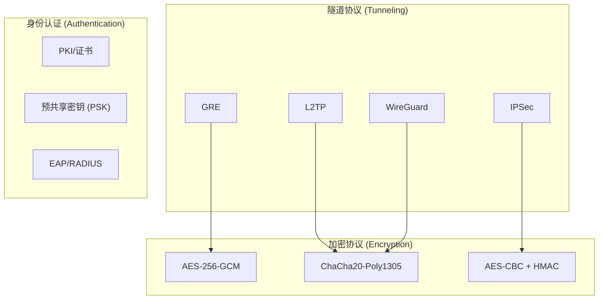
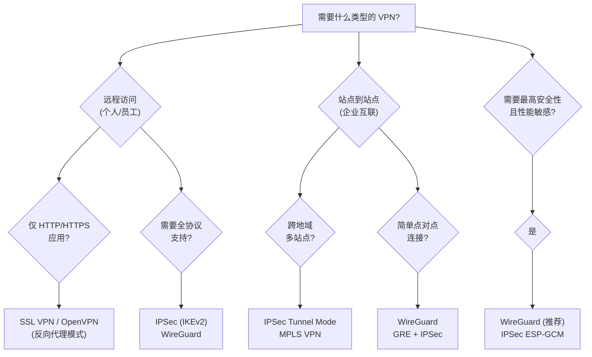

> [!info] VPN 技术深度探索系列 0. [[2026-04-13-vpn-deep-dive-series-index|全栈学习路径总览]]
> | 1. [[2026-04-13-vpn-deep-dive-ch1-vpn-fundamentals|VPN 基础概念]] (current)
> | 2. [[2026-04-13-vpn-deep-dive-ch2-tunnel-basics|第二章：隧道技术基础]]
> | 3. [[2026-04-13-vpn-deep-dive-ch3-crypto-fundamentals|第三章：密码学基础]]
> | 4. [[2026-04-13-vpn-deep-dive-ch4-authentication|第四章：身份认证基础]]

---

## 1. 概述：什么是 VPN？

**VPN (Virtual Private Network)** 的核心目标是**在公共网络（通常是 Internet）上构建一条虚拟的专用通信通道**，使得两个端点之间的通信具备"专线"级别的隐私性和完整性。

"Virtual"强调这条通道并非物理专线，而是通过公共网络上的**封装/隧道技术**模拟的逻辑专线；"Private"强调数据在传输过程中**经过加密**，只有通信双方能解密读取。

```mermaid
graph LR
    subgraph Internet["公共网络 (Internet)"]
        A["📍 Site A"] <-->|"加密隧道|", B["🔒 VPN 数据包"]
        B <--> C["📍 Site B"]
    end

    style A fill:#f59f00,stroke:#333
    style C fill:#f59f00,stroke:#333
```

**VPN 的三大核心价值：**

| 价值                          | 说明               | 场景                 |
| ----------------------------- | ------------------ | -------------------- |
| **Confidentiality（机密性）** | 加密数据，防止窃听 | 公共WiFi下的企业通信 |
| **Integrity（完整性）**       | 防篡改，HMAC 校验  | 金融交易、政府公文   |
| **Authentication（认证）**    | 验证对端身份       | 远程办公、跨地域互联 |

---

## 2. VPN 分类

### 2.1 按用途分类

```
VPN 分类
├── 远程访问 VPN (Remote Access VPN)
│   ├── 个人 VPN (Individual VPN)
│   └── 企业远程接入 (Corporate VPN)
│
├── 站点到站点 VPN (Site-to-Site VPN)
│   ├── 内部网 VPN (Intranet VPN)
│   └── 外联网 VPN (Extranet VPN)
│
└── 客户端-网关 VPN (Client-Gateway VPN)
    ├── SSL VPN (Browser-based)
    └── IPSec VPN (Client-based)
```

**远程访问 VPN** 适用于单用户连接到企业网络，用户终端需要安装客户端软件（或使用 Web 浏览器）。员工在家或出差时通过 VPN 访问内网资源。

**站点到站点 VPN** 适用于连接两个或多个地理上分离的网络，形成统一的企业内网。常见于公司总部与分支机构之间。

### 2.2 按协议层次分类

```
OSI 模型层                    VPN 协议
─────────────────────────────────────────────────
第7层 (Application)     →     SSL VPN, OpenVPN
第6层 (Presentation)   →     (TLS/SSL 封装)
第5层 (Session)        →     PPTP, L2TP
第4层 (Transport)       →     IPSec (Transport Mode)
第3层 (Network)        →     IPSec (Tunnel Mode), GRE, WireGuard
第2层 (Data Link)      →     L2TP, L2TPv3, MPLS VPN
```

### 2.3 核心分类对比

| 分类               | 协议代表           | 工作层 | 加密              | 适用场景           |
| ------------------ | ------------------ | ------ | ----------------- | ------------------ |
| **传统 PPTP/L2TP** | PPTP, L2TP         | L2/L3  | 可选（MPPE）      | 快速搭建（已淘汰） |
| **IPSec VPN**      | IPSec/IKEv2        | L3     | 强制 (ESP)        | 企业标配           |
| **SSL VPN**        | OpenVPN, WireGuard | L4/L7  | TLS/AES-ChaCha20  | 远程访问           |
| **WireGuard**      | WireGuard          | L3     | ChaCha20-Poly1305 | 现代替代           |
| ** MPLS VPN**      | MPLS L3VPN         | L3     | 可选              | 运营商骨干网       |
| **SDP/ZTNA**       | Google BeyondCorp  | 应用层 | mTLS              | 零信任替代         |

---

## 3. VPN 的核心组件

### 3.1 隧道协议 + 加密协议

VPN 系统通常由**隧道协议**和**加密协议**两层组成：



**IPSec** 是一个**体系**，同时包含隧道协议（ESP/AH）和加密协议（ESPNULL/AES），可以独立工作。

**PPTP** 依赖 **MPPE** 加密，但 MPPE 已被证明不安全。

**WireGuard** 则将隧道和加密**紧耦合**——固定使用 ChaCha20-Poly1305，无协商。

### 3.2 关键概念：SA (Security Association)

**SA（安全关联）** 是 IPSec 的核心概念，定义了通信双方之间的**单向安全通道**。

```c
// SAD (Security Association Database) 中的一条 SA 记录
struct sadb_sa {
    __u16 sadb_sa_len;           // 结构长度
    __u16 sadb_sa_exttype;       // 扩展类型 (SADB_EXT_SA)
    __u64 sadb_sa_spi;           // SPI (Security Parameter Index)
    __u8  sadb_sa_replay;        // 抗重放窗口大小
    __u8  sadb_sa_state;         // SA 状态
    __u8  sadb_sa_auth;          // 认证算法 (AUTH_ALG)
    __u8  sadb_sa_encrypt;       // 加密算法 (ENC_ALG)
    __u32 sadb_sa_flags;         // 标志位 (ESPCIV_MODE_TUNNEL 等)
};
```

每个 IPSec VPN 连接需要**两个 SA**：一个用于入站流量，一个用于出站流量。

### 3.3 隧道模式 vs 传输模式

**IPSec ESP 为例的两种封装模式：**

```
传输模式 (Transport Mode)：
┌────────────────┬──────────────────────┐
│   IP Header    │  ESP Header │ Data │ ESP Trailer │ Auth │
│   (不改)       │                      │              │
└────────────────┴──────────────────────┘

隧道模式 (Tunnel Mode)：
┌──────────────────────────────────────────────────────────┐
│ New IP Header │ ESP Header │ Original IP Header │ Data │ ESP Trailer │ Auth │
└──────────────────────────────────────────────────────────┘
                │              │                           │
                └─ 完全加密 ────┘
```

| 特性     | 传输模式     | 隧道模式             |
| -------- | ------------ | -------------------- |
| 原 IP 头 | 不变（可见） | 加密                 |
| 新 IP 头 | —            | VPN 网关地址         |
| 适用场景 | 主机到主机   | 站点到站点、远程接入 |
| NAT 兼容 | 差           | 好                   |

---

## 4. VPN 与代理的区别

很多人混淆 VPN 和代理（Proxy），两者有本质区别：

| 维度           | VPN                | 代理               |
| -------------- | ------------------ | ------------------ |
| **OSI 层**     | 通常 L3/L4（全局） | 通常 L7（应用级）  |
| **流量范围**   | 所有流量（全局）   | 特定协议/端口      |
| **IP 可见性**  | 端到端加密         | 代理可见源 IP      |
| **隧道方式**   | 隧道协议封装       | HTTP/SOCKS 中转    |
| **性能开销**   | 较高（加解密）     | 较低（仅协议转发） |
| **配置复杂度** | 较复杂             | 简单               |
| **典型用途**   | 企业内网接入       | 地域解锁、缓存     |

**本质区别**：VPN 创建一个**网络层**的虚拟接口，所有流量都走这个接口；代理只是**应用层**的中转，不创建虚拟网卡。

---

## 5. 典型 VPN 协议选择决策树



---

## 6. VPN 的性能影响因素

VPN 性能瓶颈通常在以下几个环节：

### 6.1 加解密开销

```mermaid
graph LR
    A["明文数据"] -->|"1. 分组加密", B["AES 加密"]
    B -->|"2. 模式运算", C["CBC/GCM"]
    C -->|"3. 认证", D["HMAC/SHA"]
    D --> E["密文数据"]

    style B fill:#ef4444
    style C fill:#ef4444
    style D fill:#ef4444
```

**不同算法的 CPU 开销对比（单核，1Gbps 吞吐量）：**

| 算法              | CPU 占用 | 备注                     |
| ----------------- | -------- | ------------------------ |
| AES-128-CBC       | 15%      | 现代 CPU 有 AES-NI 加速  |
| AES-128-GCM       | 8%       | 支持 AES-NI + PCLMULQDQ  |
| ChaCha20-Poly1305 | 12%      | 无硬件加速时优于 AES-CBC |
| AES-256-GCM       | 10%      | 仍可由 AES-NI 加速       |

### 6.2 MTU 与分片

VPN 封装会**增加额外头部**，导致数据包变大，可能触发 IP 分片：

```
原始包:          1500B (Ethernet MTU)
│
│  WireGuard 封装
│  +60B (Outer IP + UDP + WG Header)
│
└──► 1560B → 需要分片！性能下降 30%+
```

**解决方案**：在 VPN 隧道两端设置 **MSS Clamping** 或调整 MTU：

```bash
# WireGuard 设置 MTU
[Interface]
MTU = 1420

# IPSec 设置 MTU
ip link set dev eth0 mtu 1400
```

### 6.3 隧道建立开销

| VPN 类型      | 首次握手延迟 | 抗重连恢复           |
| ------------- | ------------ | -------------------- |
| PPTP          | ~500ms       | 即时                 |
| L2TP/IPSec    | 1-3s         | 1-2s                 |
| IPSec (IKEv2) | 500ms-1s     | ~200ms (DPD)         |
| OpenVPN       | 1-3s         | 即时 (http://replay) |
| WireGuard     | ~100ms       | 即时（无状态）       |

---

## 7. 常见 VPN 部署架构

### 7.1 远程访问架构

```
┌─────────────┐    Internet     ┌──────────────┐    企业内网    ┌──────────────┐
│   员工笔记本 │◄───VPN 隧道───► │  VPN Gateway │◄────────────►│   内网资源   │
│  (VPN Client)│   (加密)        │  (IPSec/WG)  │              │  (192.168.x.x)│
└─────────────┘                 └──────────────┘              └──────────────┘
```

### 7.2 站点到站点架构

```
┌─────────────┐              Internet              ┌─────────────┐
│   总部      │◄──────── VPN Tunnel (Gateway) ────►│   分支      │
│ 10.0.0.0/8  │                                 │ 172.16.0.0/12│
└─────────────┘                                 └─────────────┘
```

### 7.3 Full-Mesh 多站点架构

```
  Site A ◄──────► Site B
    │    VPN        │
    │               │
    ▼               ▼
  Site C ◄──────► Site D
```

---

## 8. 总结：VPN 技术全景

| 维度            | 结论                                                     |
| --------------- | -------------------------------------------------------- |
| **VPN 是什么**  | 在公共网络上构建加密的虚拟专用通道                       |
| **核心价值**    | 机密性 + 完整性 + 身份认证                               |
| **协议分层**    | 隧道协议 (GRE/IPSec/WireGuard) + 加密协议 (AES/ChaCha20) |
| **传输模式**    | IPSec 传输模式（端到端）vs 隧道模式（网关到网关）        |
| **VPN vs 代理** | VPN L3 全流量隧道 vs 代理 L7 协议中转                    |
| **性能瓶颈**    | 加解密 CPU、MTU 分片、握手延迟                           |

**下一章预告：** [[2026-04-13-vpn-deep-dive-ch2-tunnel-basics|第二章：隧道技术基础]] — tun/tap 虚拟设备、隧道封装原理、隧道接口配置。

---

> [!quote] 参考文献
>
> - [[2026-04-13-kernel-protocol-stack-deep-dive-ch17-gre|GRE 隧道 (Kernel Protocol Stack)]] — 内核 GRE 实现
> - [[2026-03-12-wireguard-protocol-deep-dive|WireGuard 协议深度解析]] — 现代 VPN 协议
> - [[2026-03-12-ipsec-protocol-deep-dive|IPSec 协议深度解析]] — 企业 VPN 事实标准
> - [[2026-03-11-sdp-zero-trust-overview|SDP 与零信任]] — VPN 的替代架构
