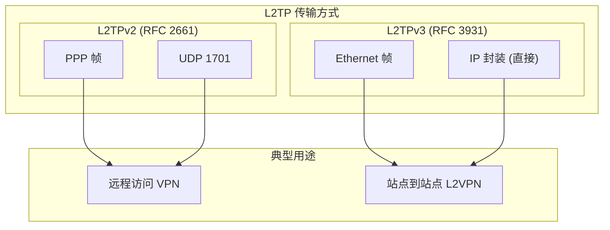
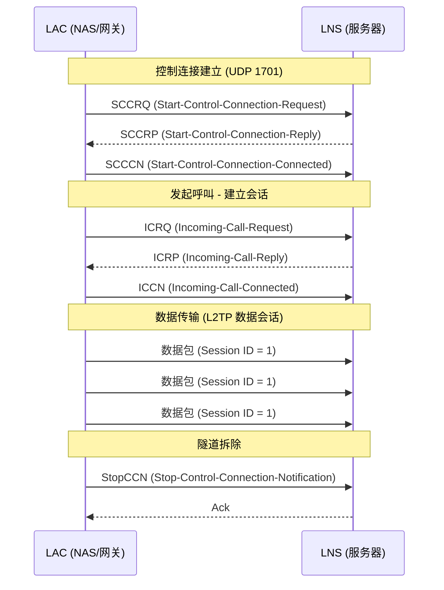

> [!info] VPN 技术深度探索系列
> 0. [[2026-04-13-vpn-deep-dive-series-index|全栈学习路径总览]]
> 1. [[2026-04-13-vpn-deep-dive-ch1-vpn-fundamentals|VPN 基础概念]]
> 2. [[2026-04-13-vpn-deep-dive-ch2-tunnel-basics|第二章：隧道技术基础]]
> 3. [[2026-04-13-vpn-deep-dive-ch3-crypto-fundamentals|第三章：密码学基础]]
> 4. [[2026-04-13-vpn-deep-dive-ch4-authentication|第四章：身份认证基础]]
> 5. [[2026-04-13-vpn-deep-dive-ch5-gre|第五章：GRE 通用路由封装]]
> 6. [[2026-04-13-vpn-deep-dive-ch6-ipip|SIT 隧道]]
> 7. [[2026-04-13-vpn-deep-dive-ch7-mpls-vpn|MPLS VPN]]
> 8. [[2026-04-13-vpn-deep-dive-ch8-vxlan-tunnel|VXLAN 覆盖网络]]
> 9. [[2026-04-13-vpn-deep-dive-ch9-pptp|第九章：PPTP 点对点隧道]]

---

## 1. 概述：L2TP 的设计目标

**L2TP (Layer 2 Tunneling Protocol)** 定义于 RFC 2661，是 PPTP 的增强版本。PPTP 只能通过 GRE 封装，L2TP 则同时支持 **UDP 封装**（更易 NAT 穿透）和通过 **L2TPv3 (L2TP Version 3)** 支持直接基于 IP 的 L2 封装。

L2TP 的核心价值是**传输 L2 帧**——它不仅能封装 PPP 帧（承载 IP 流量），还能封装以太网、帧中继、ATM 等多种二层协议。



| 属性 | L2TPv2 | L2TPv3 |
|------|---------|---------|
| **RFC** | RFC 2661 | RFC 3931 |
| **传输层** | UDP 1701 | IP (Protocol 115) 或 UDP |
| **封装层次** | PPP → L2TP → UDP → IP | L2 帧 → L2TP → IP |
| **控制平面** | 可靠 (Retransmission) | 可靠 (Differentiated Services Code Point) |
| **会话类型** | PPP (仅 IP) | 任意 L2 帧 |
| **典型场景** | 远程访问 VPN | L2VPN (伪线服务) |

---

## 2. L2TPv2 协议架构

### 2.1 L2TP 角色：LAC 和 LNS

L2TP 有两个核心角色：

| 角色 | 全称 | 说明 |
|------|------|------|
| **LAC (L2TP Access Concentrator)** | L2TP 访问集中器 | 客户端或靠近客户端的网络设备，负责发起 L2TP 隧道 |
| **LNS (L2TP Network Server)** | L2TP 网络服务器 | 服务端，负责接收隧道并处理流量 |

```
L2TP 远程访问架构：

┌─────────────┐    PPP + L2TP     ┌─────────────┐    PPP 终止     ┌─────────────┐
│  Remote PC   │───► LAC (NAS) ──►│     LNS      │───────────────►│  企业内网   │
│  (Windows)   │   UDP 1701       │ (L2TP Server)│   解封装后      │  10.0.0.0/8 │
│              │   + IPSec 可选    │              │   转发 IP       │             │
└─────────────┘                   └─────────────┘                  └─────────────┘

L2TP 站点到站点架构（通过 LAC）：

┌─────────────┐              Internet              ┌─────────────┐
│  Site A     │◄──── L2TP/IPSec 隧道 ─────────────►│  Site B     │
│  10.1.0.0/16│                                    │  10.2.0.0/16│
│  [LAC/LNS]  │                                    │  [LAC/LNS]  │
└─────────────┘                                    └─────────────┘
```

### 2.2 控制连接与会话层次



---

## 3. L2TP 消息格式

### 3.1 L2TP 头格式 (L2TPv2)

```
L2TPv2 头格式：
┌────────────────────────────────────────────────────────────────────┐
│  LSB                                         MSB                  │
│  0  1  2  3  4  5  6  7  8  9 10 11 12 13 14 15 16 17 18 19 20... │
│  T  L  |  0  0  0  0 |  Sequence |  Length |      Offset        │
│  (2bits)    Reserved                                                  │
└────────────────────────────────────────────────────────────────────┘

各字段：
T  (Type, 1 bit)       = 0 数据包 / 1 控制数据包
L  (Length, 1 bit)     = 0 无 Length 字段 / 1 有 Length 字段
Reserved (4 bits)      = 必须为 0
Sequence (2 bytes)     = Ns (发送序号) + Nr (接收序号) [可选]
Length (2 bytes)       = 总消息长度 [可选]
Offset (2 bytes)       = 偏移量 [可选]

┌─────────────────────────────────────────────────────────────────────┐
│  Tunnel ID (2 bytes)   = 隧道标识符（本端分配）                      │
│  Session ID (2 bytes) = 会话标识符（本端分配）                        │
└─────────────────────────────────────────────────────────────────────┘
```

### 3.2 控制消息类型

```bash
# L2TPv2 主要控制消息
CONTROL_MESSAGE_TYPES = {
    # 隧道管理
    1:  "SCCRQ",   # Start-Control-Connection-Request
    2:  "SCCRP",   # Start-Control-Connection-Reply
    3:  "SCCCN",   # Start-Control-Connection-Connected
    4:  "StopCCN", # Stop-Control-Connection-Notification

    # 呼叫管理
    5:  "ENCRYPTED_MESSAGES",  # (已废弃)
    6:  "HELLO",               # 链路保活
    7:  "OCRQ",   # Outgoing-Call-Request (LNS→LAC)
    8:  "OCRP",   # Outgoing-Call-Reply
    9:  "OCCN",   # Outgoing-Call-Connected
    10: "ICRQ",   # Incoming-Call-Request (LAC→LNS)
    11: "ICRP",   # Incoming-Call-Reply
    12: "ICCN",   # Incoming-Call-Connected
    13: "CDN",    # Call-Disconnect-Notify
    14: "WEN",    # WAN-Error-Notify
    15: "SLI",    # Set-Link-Info

    # L2TPv3 扩展
    20: "CSSI",   # Control-Session-Suppress-Indication
    21: "SFE",    # Start-Forwarding-Entry
    22: "STF",    # Stop-Forwarding-Entry
    23: "FWA",    # Forwarding-Address
}
```

### 3.3 L2TP 数据包封装

```
L2TPv2 数据包封装（远程访问 VPN 场景）：

┌──────────────────────────────────────────────────────────────────┐
│  外层 IP Header                                                   │
│    Src: Client IP / LAC IP                                        │
│    Dst: LNS IP                                                     │
├───────────────────────────────────────────────────────────────────┤
│  UDP Header                                                        │
│    Src: 1701 (或动态)                                              │
│    Dst: 1701                                                       │
├───────────────────────────────────────────────────────────────────┤
│  L2TP Header                                                       │
│    T=0, L=1, S=0 (无序列号), L=1           │
│    Tunnel ID: 0x0001                                              │
│    Session ID: 0x0001                                             │
├───────────────────────────────────────────────────────────────────┤
│  PPP Header                                                        │
│    Protocol: 0x0021 (IP)                                          │
├───────────────────────────────────────────────────────────────────┤
│  IP Payload (原始 IP 包)                                          │
│    源/目的 IP                                                      │
├───────────────────────────────────────────────────────────────────┤
│  TCP/UDP/应用层...                                                 │
└──────────────────────────────────────────────────────────────────┘
```

---

## 4. L2TP 控制连接建立

### 4.1 完整握手过程

```bash
# 1. SCCRQ (Start-Control-Connection-Request)
# LAC → LNS，发起控制连接建立

SCCRQ {
    Message Type AVP (vendor=0, type=0) = 1
    Protocol Version AVP = 0x0100 (version 1, revision 0)
    Host Name AVP = "lac-router-01"
    Framing Capabilities AVP = 0x01 (digital)
    Bearer Capabilities AVP = 0x00
    Tunnel Secret AVP (可选) = HMAC-SHA1
    Assigned Tunnel ID AVP = 0x0001  # 本端分配的隧道 ID
    Receive Window Size AVP = 4       # 本端接收窗口大小
}

# 2. SCCRP (Start-Control-Connection-Reply)
# LNS → LAC，同意建立，返回自己的隧道 ID

SCCRP {
    Message Type AVP = 2
    Protocol Version AVP = 0x0100
    Host Name AVP = "lns-server-01"
    Framing Capabilities AVP = 0x03 (digital + analog)
    Assigned Tunnel ID AVP = 0x0001  # LNS 分配的隧道 ID
    Assigned Control Connection ID AVP = 0x00000001
    Receive Window Size AVP = 4
}

# 3. SCCCN (Start-Control-Connection-Connected)
# LAC → LNS，确认连接建立完成

SCCCN {
    Message Type AVP = 3
    # 可选：Tunnel Secret 验证
}
```

### 4.2 隧道 ID vs 会话 ID

```bash
# Tunnel ID 和 Session ID 的区别

┌─────────────────────────────────────────────────────────────────┐
│                    L2TP Tunnel                                    │
│  控制连接 (Control Connection)                                    │
│    Tunnel ID = 0x0001 (双向共享)                                 │
│    承载所有控制消息                                               │
│                                                                  │
│    ┌─────────────────────────────────────────────────────────┐  │
│    │  Session 1 (PPP Session)                                 │  │
│    │    Session ID = 0x0001                                   │  │
│    │    承载用户 A 的流量                                      │  │
│    └─────────────────────────────────────────────────────────┘  │
│                                                                  │
│    ┌─────────────────────────────────────────────────────────┐  │
│    │  Session 2 (PPP Session)                                 │  │
│    │    Session ID = 0x0002                                   │  │
│    │    承载用户 B 的流量                                      │  │
│    └─────────────────────────────────────────────────────────┘  │
└─────────────────────────────────────────────────────────────────┘

# 关键点：
# - Tunnel ID 是隧道级别标识，控制连接使用
# - Session ID 是会话级别标识，每个用户 PPP 会话一个
# - 控制消息使用 (Tunnel ID, Session ID) 共同标识目标
# - 数据包复用同一个控制连接，通过 Session ID 区分不同流
```

---

## 5. L2TP/IPSec 配合

### 5.1 为什么需要 IPSec

L2TP 本身**不提供加密**。L2TP + PPP 只提供隧道封装，PPP 的可选加密（MPPE）已被证明不安全。因此 L2TP 通常与 **IPSec ESP** 配合使用，形成 **L2TP/IPSec**：

```bash
# L2TP/IPSec 封装层次

┌──────────────────────────────────────────────────────────────────┐
│  外层 IP Header (IPSec 外层)                                      │
│    Src: 203.0.113.10 (客户端公网 IP)                            │
│    Dst: 198.51.100.50 (VPN 网关 IP)                             │
├───────────────────────────────────────────────────────────────────┤
│  IPSec ESP Header                                                 │
│    SPI: 0x12345678                                               │
│    Sequence Number                                               │
│    Encryption: AES-256-CBC                                       │
│    Authentication: HMAC-SHA256                                   │
├───────────────────────────────────────────────────────────────────┤
│  UDP Header (ESP 封装在 UDP 中穿越 NAT)                          │
│    Src: 4500 (NAT-T 端口)                                        │
│    Dst: 4500                                                     │
├───────────────────────────────────────────────────────────────────┤
│  IPSec ESP Trailer                                               │
├───────────────────────────────────────────────────────────────────┤
│  L2TP Header (在 ESP 加密范围内)                                │
│    Tunnel ID + Session ID                                       │
├───────────────────────────────────────────────────────────────────┤
│  PPP Header + Payload (IP 包)                                    │
│    原始目的地址可见                                                │
└──────────────────────────────────────────────────────────────────┘

# L2TP/IPSec 的优势：
# 1. IPSec ESP 提供强加密（AES-GCM）
# 2. IPSec AH 提供完整性校验
# 3. NAT-T (UDP 4500) 解决 NAT 穿透问题
# 4. IKEv2 提供抗重放和完美前向保密
```

### 5.2 NAT-Traversal (NAT-T)

```bash
# NAT-T 工作原理
# 当检测到 NAT 设备时，ESP 封装在 UDP 4500 中

# 检测过程：
# 1. 双方交换 NAT-D (NAT Detection) AVP
# 2. 如果检测到 NAT，则切换到 NAT-T 模式

# NAT-T 封装：
#   原始：IP + ESP + UDP(L2TP)  ← 错误
#   NAT-T：IP + UDP(4500) + ESP + UDP(L2TP)

# Wireshark 过滤：
udp.port == 4500  # NAT-T ESP
```

### 5.3 L2TP/IPSec vs L2TP 纯文本

```
┌─────────────────┬──────────────────────┬─────────────────────────┐
│     特性         │   纯 L2TP            │   L2TP/IPSec           │
├─────────────────┼──────────────────────┼─────────────────────────┤
│ 加密            │ 无（或依赖 PPP MPPE） │ IPSec ESP + AES         │
│ 完整性          │ 无                   │ IPSec HMAC              │
│ NAT 穿透        │ 差                   │ 好 (NAT-T UDP 4500)     │
│ 认证            │ PPP PAP/CHAP/MS-CHAP │ IPSec IKEv2 + X.509/PSK │
│ 典型端口        │ UDP 1701             │ UDP 1701 + UDP 500/4500 │
│ 性能开销        │ 低                   │ 中等                    │
│ 兼容性          │ 好（Windows 内置）    │ 好（现代系统均支持）    │
│ 安全等级        │ 低                   │ 高                      │
└─────────────────┴──────────────────────┴─────────────────────────┘
```

---

## 6. L2TPv3 (Layer 2 Tunneling Protocol Version 3)

### 6.1 L2TPv3 的改进

L2TPv3 (RFC 3931) 将 L2TP 从 PPP 隧道扩展为**通用 L2 帧传输协议**：

```bash
# L2TPv3 vs L2TPv2

L2TPv2：
- 仅支持 PPP 帧（承载 IP）
- 只能封装网络层流量

L2TPv3：
- 支持任意 L2 帧：Ethernet, Frame Relay, ATM, HDLC, PPP
- 可作为纯 L2VPN 解决方案（无 PPP）
- 控制平面更高效
- 支持 IP 直接封装（无 UDP）

# L2TPv3 典型应用：Ethernet over L2TPv3 (EoL2TP)
# 实现类似 VPLS 的 L2VPN，但基于 IP 网络
```

### 6.2 L2TPv3 头格式

```
L2TPv3 控制消息头：

┌────────────────────────────────────────────────────────────────┐
│  0                   1                   2                   3  │
│  0 1 2 3 4 5 6 7 8 9 0 1 2 3 4 5 6 7 8 9 0 1 2 3 4 5 6 7 8 9 0 1 │
├────────────────────────────────────────────────────────────────┤
│  Enhanced L2TP Header                                           │
│    T=1 | F=0 | H=0 | S=0 | s=1 | Res | Ver=3 |   Length (opt)  │
├────────────────────────────────────────────────────────────────┤
│  Cookie (0-64 bits, 可选)                                      │
├────────────────────────────────────────────────────────────────┤
│  L2-Sublayer Data ID (32 bits, 仅当 s=1)                       │
└────────────────────────────────────────────────────────────────┘

T: Type (1=控制, 0=数据)
F: Fragmentation (分片)
H: Hybrid (混合模式)
S: Sequence flag
s: Sequence numbers present
Ver: 版本 (3)
```

---

## 7. 典型配置

### 7.1 Linux L2TP/IPSec (strongSwan + xl2tpd)

```bash
# 安装组件
apt install strongswan xl2tpd

# /etc/ipsec.conf - IPSec 配置
config setup
    charondebug="ike 2, knl 2, cfg 2, net 2, esp 2, dfg 2"
    uniqueids=never

# L2TP/IPSec 连接
conn %default
    ikelifetime=8h
    keylife=1h
    rekeymargin=3m
    keyexchange=ikev1
    authby=secret        # 预共享密钥模式
    ike=aes256-sha1-modp1024!
    esp=aes256-sha1!

conn l2tp-vpn
    auto=add
    left=198.51.100.50      # LNS 公网 IP
    leftsubnet=10.10.0.0/24 # LNS 侧内网子网
    right=%any              # 任意客户端
    rightsubnet=10.10.1.0/24 # 客户端获分配的 IP 池
    rightdns=8.8.8.8
    type=transport
    # 启用 NAT-T
    nat_traversal=yes
    forceencaps=yes

# /etc/ipsec.secrets - PSK
: PSK "your-psk-secret-here"

# /etc/xl2tpd/xl2tpd.conf
[global]
port = 1701
auth file = /etc/ppp/chap-secrets

[lns default]
ip range = 10.10.1.10-10.10.1.250
local ip = 10.10.1.1
require chap = yes
refuse pap = yes
require authentication = yes
name = l2tp-vpn
pppoptfile = /etc/ppp/options.xl2tpd
length bit = yes

# /etc/ppp/options.xl2tpd
require-mschap-v2
ms-dns 8.8.8.8
ms-dns 8.8.4.4
noccp
noauth
crtscts
idle 1800
mtu 1400
mru 1400
nodefaultroute
lock
proxyarp

# /etc/ppp/chap-secrets - 用户认证
# username  server  secret  IP address
user1     l2tp-vpn  password1  10.10.1.10
user2     l2tp-vpn  password2  10.10.1.11

# 启动服务
systemctl restart strongswan
systemctl restart xl2tpd

# IP 转发和 NAT
echo 1 > /proc/sys/net/ipv4/ip_forward
iptables -t nat -A POSTROUTING -s 10.10.1.0/24 -o eth0 -j MASQUERADE
```

### 7.2 Windows Server L2TP/IPSec

```powershell
# Windows Server: 使用 Routing and Remote Access (RRAS)

# 1. 安装角色
Install-WindowsFeature RemoteAccess -IncludeManagementTools

# 2. 配置 L2TP/IPSec VPN
$VPNParams = @{
    Protocol = "L2tpIpSec"
   IPsecParameters = @{
        CustomPolicy = $true
        StartTLLSecret = "Pre-Shared-Key-Here"
        PerfectForwardSecrecy = "Pfs2048"
    }
}

# 3. 配置地址池
Add-VpnIPAddressRange -Name "VPN Clients" `
    -IPAddressRange 10.10.1.10 -10.10.1.250 `
    -Server "LNS01"

# 4. 配置 NPS RADIUS 认证（推荐）
# NPS 策略：允许 L2TP/IPSec + MS-CHAPv2 + AD 账户
```

### 7.3 iOS/macOS L2TP/IPSec 客户端配置

```bash
# iOS L2TP/IPSec 配置（使用配置文件或 UI）

# UI 配置步骤：
# 设置 → VPN → 添加 VPN 配置
# 类型: L2TP
# 描述: Corporate VPN
# 服务器: vpn.company.com
# 账户: username
# 密码: (从钥匙串选择)
# 密钥: Pre-Shared-Key
# 发送所有流量: 开启

# 或使用.mobileconfig (Apple Configurator)
```

---

## 8. L2TP 流量分析与排错

### 8.1 Wireshark 过滤

```bash
# L2TP 控制消息
l2tp

# L2TPv2
l2tpv2

# L2TPv3
l2tpv3

# 仅控制消息（Z-bit 置位）
l2tp.type == control

# 按 Tunnel/Session ID 过滤
l2tp.tunnel_id == 1
l2tp.session_id == 1

# NAT-T ESP (UDP 4500)
udp.port == 4500

# 组合过滤：L2TP + IPSec
ip.addr == 198.51.100.50 && (udp.port == 1701 || udp.port == 4500)
```

### 8.2 常见问题与排错

```bash
# 问题 1: "Control connection fatal error" - Tunnel ID 冲突
# 解决：确保双方使用不同的 Tunnel ID

# 问题 2: NAT 环境下 L2TP 无法连接
# 解决：启用 NAT-T (UDP 4500)
# 检查：tcpdump 'udp port 4500'

# 问题 3: IPSec Phase 1/2 失败
# 解决：
#   - 检查 PSK 是否一致
#   - 检查 IKE/ESP 算法匹配
#   - 确认防火墙开放 UDP 500, 4500

# 问题 4: L2TP 隧道建立但无数据
# 解决：
#   - 检查 MSS clamping (iptables -t mangle -A FORWARD)
#   - 检查 IP 转发 (net.ipv4.ip_forward)
#   - 检查 NAT/Masquerade 规则

# 排错命令
ip xfrm state show     # IPSec SA 状态
ip xfrm policy show    # IPSec 策略
ipsec status           # IPSec 连接状态
cat /var/log/auth.log  # L2TP/xl2tpd 日志
```

---

## 9. L2TP vs PPTP vs L2TPv3

| 维度 | PPTP | L2TPv2 | L2TPv3 |
|------|------|---------|--------|
| **隧道协议** | GRE (TCP 1723) | UDP 1701 | UDP 1701 / IP 115 |
| **加密** | MPPE (RC4) | 无（靠 IPSec） | 无（靠 IPSec） |
| **NAT 穿透** | 差 | 好（NAT-T） | 好 |
| **隧道复用** | 单会话 | 多会话 | 多会话 |
| **L2 封装** | 仅 PPP | 仅 PPP | Ethernet/ATM/FR |
| **控制可靠性** | 无序列号 | 有序列号 | 有序列号 |
| **Windows 支持** | 原生 | 原生 | 需第三方 |
| **安全等级** | 低 | 中（+IPSec） | 中（+IPSec） |

---

## 10. 总结

| 维度 | 结论 |
|------|------|
| **协议定位** | L2 层隧道协议，传输 PPP/L2 帧 |
| **核心价值** | 隧道封装 + 可选 IPSec 加密 |
| **与 PPTP 区别** | L2TP 无内置加密，通过 IPSec 弥补 |
| **L2TPv3** | 通用 L2 帧传输，支持 Ethernet 伪线 |
| **NAT 穿透** | 好（NAT-T UDP 4500） |
| **当前状态** | L2TP/IPSec 仍在企业使用，但逐步被 IKEv2/WireGuard 替代 |

**下一章预告：** [[2026-04-13-vpn-deep-dive-ch11-openvpn|OpenVPN 基础]] — SSL VPN、TUN/TAP 模式、OpenSSL 加密、easy-rsa 证书、客户端配置。

---

> [!quote] 参考文献
> - RFC 2661 - L2TP Version 2
> - RFC 3931 - L2TP Version 3
> - RFC 3193 - L2TP/IPSec
> - [[2026-04-13-vpn-deep-dive-ch9-pptp|PPTP 隧道 (本系列)]] — PPTP 与 L2TP 的历史关系
> - [[2026-04-13-vpn-deep-dive-ch14-ipsec-overview|IPSec 体系概述 (本系列)]] — L2TP/IPSec 配合
