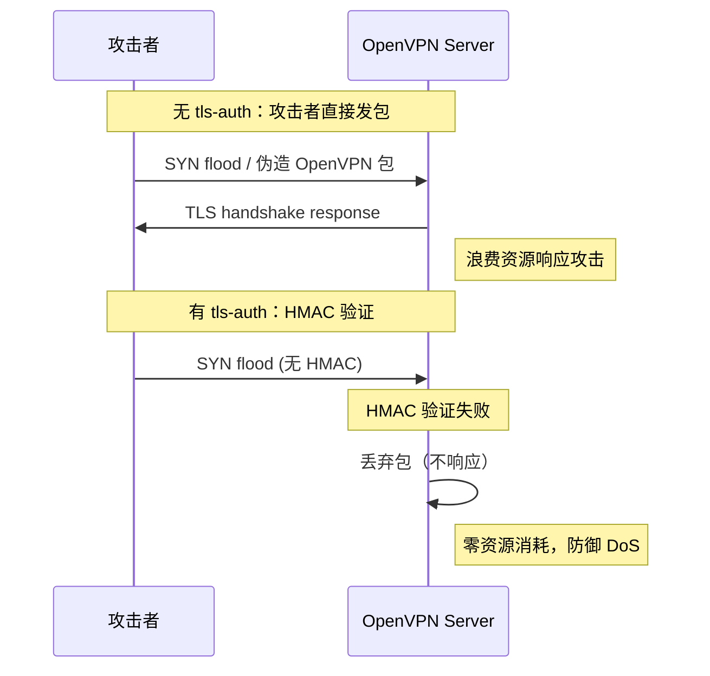

> [!info] VPN 技术深度探索系列 0. [[2026-04-13-vpn-deep-dive-series-index|全栈学习路径总览]]
>
> 1. [[2026-04-13-vpn-deep-dive-ch1-vpn-fundamentals|VPN 基础概念]]
> 2. [[2026-04-13-vpn-deep-dive-ch2-tunnel-basics|第二章：隧道技术基础]]
> 3. [[2026-04-13-vpn-deep-dive-ch3-crypto-fundamentals|第三章：密码学基础]]
> 4. [[2026-04-13-vpn-deep-dive-ch4-authentication|第四章：身份认证基础]]
> 5. [[2026-04-13-vpn-deep-dive-ch5-gre|第五章：GRE 通用路由封装]]
> 6. [[2026-04-13-vpn-deep-dive-ch6-ipip|SIT 隧道]]
> 7. [[2026-04-13-vpn-deep-dive-ch7-mpls-vpn|MPLS VPN]]
> 8. [[2026-04-13-vpn-deep-dive-ch8-vxlan-tunnel|VXLAN 覆盖网络]]
> 9. [[2026-04-13-vpn-deep-dive-ch9-pptp|第九章：PPTP 点对点隧道]]
> 10. [[2026-04-13-vpn-deep-dive-ch10-l2tp|第十章：L2TP 第二层隧道]]
> 11. [[2026-04-13-vpn-deep-dive-ch11-openvpn|OpenVPN 基础]]

---

## 1. tls-auth 防御

### 1.1 tls-auth 的作用

**tls-auth (Static Key TLS Authentication)** 是 OpenVPN 的额外安全层，在 TLS 握手前对所有数据包进行 HMAC 签名验证。它能有效防御：

- **DoS 攻击**：攻击者无法通过发送伪造包消耗服务器资源
- **TLS 端口扫描**：恶意扫描无法获取 TLS 握手响应
- **协议识别**：未携带正确 HMAC 的包直接被丢弃

```bash
# 生成 tls-auth 密钥（静态密钥）
openvpn --genkey secret /etc/openvpn/ta.key

# 密钥特性：
# - Pre-shared key (PSK)，双方共享
# - 不是 TLS 密钥，是 HMAC 密钥
# - 每条发送的消息都用 sender_secret 做 HMAC
# - 接收消息必须验证 HMAC
```

### 1.2 tls-auth 工作原理



### 1.3 配置

```bash
# 服务器端 /etc/openvpn/server.conf
# 0 = 服务器端（发送方使用 sender_secret）
tls-auth ta.key 0

# 客户端 /etc/openvpn/client.ovpn
# 1 = 客户端（发送方使用 sender_secret）
tls-auth ta.key 1
key-direction 1

# 禁用 tls-auth（仅用于调试）
;tls-auth disabled

# HMAC 算法（默认 HMAC-SHA256）
;tls-crypt ta.key 0    # OpenVPN 2.5+ 支持更安全的 tls-crypt
```

---

## 2. 压缩配置

### 2.1 压缩算法

OpenVPN 支持 LZO 和 LZ4 (v2) 压缩：

| 算法       | 说明                               | 风险                  |
| ---------- | ---------------------------------- | --------------------- |
| **LZO**    | Lempel-Ziv-Oberhumer，快速，无认证 | CRIME/BREACH 攻击风险 |
| **LZ4-v2** | LZ4 第二版，性能更好               | CRIME/BREACH 攻击风险 |
| **禁用**   | `--compress none` 或不配置         | 推荐生产使用          |

> [!danger]
> **CRIME/BREACH 攻击**：压缩与加密并用时，攻击者可通过观测密文长度推断明文内容。所有启用压缩的 TLS/OpenVPN 都受此影响。生产环境建议禁用压缩或使用 TLS 1.3。

### 2.2 配置

```bash
# 服务器端 /etc/openvpn/server.conf

# LZ4-v2 压缩（OpenVPN 2.4+）
compress lz4-v2
# 推送压缩设置给客户端
push "compress lz4-v2"

# 旧版 LZO 压缩（兼容旧客户端）
;compress lzo
;push "compress lzo"

# 自适应压缩（流量低时压缩）
;compress lz4-v2 adaptive

# 客户端兼容性：客户端和服务器都需要配置相同算法
# 服务器推送的压缩选项会覆盖客户端配置
```

---

## 3. redirect-gateway 全流量路由

### 3.1 redirect-gateway 的效果

**redirect-gateway** 将 VPN 服务器设置为客户端的默认网关，使所有流量都通过 VPN 隧道：

```bash
# 不使用 redirect-gateway（Split Tunnel）
# 路由表：
# default via 192.168.1.1 dev eth0   ← 本地路由器
# 10.8.0.0/24 via 10.8.0.1 dev tun0  ← VPN 内网
# 192.168.1.0/24 dev eth0            ← 本地网络

# 使用 redirect-gateway def1（Full Tunnel）
# 通过推送 0.0.0.0/1 覆盖默认路由
push "redirect-gateway def1 bypass-dhcp"

# 推送后的客户端路由表：
# 0.0.0.0/1 via 10.8.0.1 dev tun0   ← VPN（覆盖 default）
# 128.0.0.0/1 via 10.8.0.1 dev tun0  ← VPN（覆盖 default）
# default via 192.168.1.1 dev eth0   ← 被覆盖，但仍存在
# 10.8.0.0/24 via 10.8.0.1 dev tun0  ← VPN 内网
# 192.168.1.0/24 dev eth0            ← 本地网络

# 选项说明：
# def1     - 使用 0.0.0.0/1 + 128.0.0.0/1 而非 0.0.0.0/0（更安全）
# bypass-dhcp - 不改变 DHCP 服务器地址（Windows 特有）
# local    - 仅通过本地 VPN 网关路由
```

### 3.2 服务器端配置

```bash
# /etc/openvpn/server.conf

# 基础配置
server 10.8.0.0 255.255.255.0

# 全流量路由
push "redirect-gateway def1"

# 或仅推送特定路由（Split Tunnel）
;push "redirect-gateway def1"           # 注释掉 = 不全路由
push "route 192.168.10.0 255.255.255.0"  # 内网
push "route 10.0.0.0 255.0.0.0"          # 特定大网段

# DNS 配置
push "dhcp-option DNS 10.8.0.1"          # VPN 服务器做 DNS 解析
push "dhcp-option DNS 8.8.8.8"           # Google DNS

# 启用 NAT（服务器端必须配置）
# /etc/iptables rules:
iptables -t nat -A POSTROUTING -s 10.8.0.0/24 -o eth0 -j MASQUERADE
```

### 3.3 DNS 泄漏防护

```bash
# 问题：即使使用 redirect-gateway，DNS 查询仍可能走本地 DNS
# 解决：使用 DNS 泄漏防护

# 方案 1：服务器推送 VPN DNS
push "dhcp-option DNS 10.8.0.1"

# 方案 2：使用 DNS 加密（DNS-over-TLS/HTTPS）
# 在 VPN 服务器上运行 dnsmasq 或 unbound
# 服务器配置：
push "dhcp-option DNS 10.8.0.1"   # VPN 服务器 DNS
push "dhcp-option DOMAIN-SEARCH corp.local"

# 方案 3：客户端使用防火墙上传 DNS
# /etc/openvpn/client.ovpn
block-outside-dns   # Windows 阻止 DNS 泄漏

# Linux 上使用 resolvconf 脚本：
# script-security 2
# up /etc/openvpn/update-resolv-conf
# down /etc/openvpn/update-resolv-conf
```

---

## 4. 客户端配置文件目录 (CCD)

### 4.1 CCD 的作用

**CCD (Client Configuration Directory)** 允许为每个客户端分配**独立配置**，实现：

- 固定 IP 地址
- 独立路由
- 独立推送设置
- iroute 内部路由

```bash
# 服务器配置
# /etc/openvpn/server.conf

# 启用 CCD
client-config-dir /etc/openvpn/ccd

# CCD 中每客户端一个文件，文件名为 CN（证书 Common Name）
# /etc/openvpn/ccd/client1
# /etc/openvpn/ccd/client2
```

### 4.2 固定客户端 IP

```bash
# /etc/openvpn/ccd/client1
# 为 client1 分配固定 IP

ifconfig-push 10.8.0.50 10.8.0.49

# 解释：
# 10.8.0.50 = 客户端 tun0 IP
# 10.8.0.49 = 服务器端 tun0 IP（点对点）
# 注意：必须使用 /30 子网（点对点隧道）
# 可用对：10.8.0.1-10.8.0.254 中 4 的倍数地址
```

### 4.3 独立路由

```bash
# /etc/openvpn/ccd/client1
# 只给 client1 推送特定路由（其他客户端看不到）

# 推送内网 A
push "route 192.168.10.0 255.255.255.0"

# 不推送（但允许 client1 直接访问）
# iroute 用于 OpenVPN 内部路由（服务器端使用）
iroute 192.168.10.0 255.255.255.0

# 对比：
# route - 推送给客户端，影响客户端路由表
# iroute - 服务器内部路由，让 OpenVPN 知道往哪转发
```

### 4.4 完整示例

```bash
# 服务器端 /etc/openvpn/server.conf
server 10.8.0.0 255.255.255.0

# 启用 CCD
client-config-dir /etc/openvpn/ccd

# 启用内部路由（iroute 生效必须）
route 192.168.10.0 255.255.255.0   # 顶层路由
route 192.168.20.0 255.255.255.0

# /etc/openvpn/ccd/client1
# Client1: 访问 192.168.10.0/24
ifconfig-push 10.8.0.50 10.8.0.49
iroute 192.168.10.0 255.255.255.0
push "route 192.168.10.0 255.255.255.0"

# /etc/openvpn/ccd/client2
# Client2: 访问 192.168.20.0/24
ifconfig-push 10.8.0.54 10.8.0.53
iroute 192.168.20.0 255.255.255.0
push "route 192.168.20.0 255.255.255.0"
```

---

## 5. ifconfig-pool-persist

### 5.1 固定 IP 持久化

```bash
# 服务器配置
# /etc/openvpn/server.conf

# 持久化客户端 IP 分配
ifconfig-pool-persist /etc/openvpn/ipp.txt

# ipp.txt 格式：
# client1,10.8.0.2
# client2,10.8.0.3
# client3,10.8.0.4

# 重启 OpenVPN 后，IP 分配不变
# 如果注释掉 ifconfig-pool-persist，服务器会重新分配 IP
```

### 5.2 手动编辑 ipp.txt

```bash
# 直接编辑 ipp.txt
cat /etc/openvpn/ipp.txt
# client1,10.8.0.50    # 手动指定
# client2,10.8.0.51
# client3,10.8.0.52

# 注意事项：
# - 每行格式：CN,IP
# - 服务器重启后自动加载
# - 如果与 CCD 中的 ifconfig-push 冲突，以 CCD 为准
```

---

## 6. 多客户端与服务端架构

### 6.1 多客户端路由

```bash
# /etc/openvpn/server.conf

# 基础多客户端模式
server 10.8.0.0 255.255.255.0

# 客户端之间的流量
# 允许客户端互相通信（默认关闭）
;client-to-client
client-to-client    # 开启后，client1 可直接访问 client2

# 禁用时：所有客户端只能访问服务器内网
# 启用时：客户端之间直接通信（通过 VPN 服务器路由）

# 模拟以太网广播（client-to-client 时有效）
# 让 VPN 像一个 L2 交换机
;topology subnet     # TUN 模式下每个客户端一个 IP
;topology p2p        # TUN 模式下每个客户端一个 /30
topology subnet      # 推荐（现代 OpenVPN 2.4+ 默认）
```

### 6.2 子网可达性配置

```bash
# 服务器需要知道如何路由到客户端子网
# 如果 OpenVPN 服务器不是内网网关，需要：

# 方案 1: 在服务器上添加内网路由
ip route add 192.168.10.0/24 via 10.8.0.2

# 方案 2: 让内网网关知道 VPN 路由
# 在内网路由器上：
ip route add 10.8.0.0/24 via <OpenVPN 服务器 IP>

# 方案 3: 使用 iroute（OpenVPN 内部路由）
# iroute 只在 OpenVPN 进程内生效，不影响系统路由
# 配合 route 使用：
route 192.168.10.0 255.255.255.0   # 系统路由
iroute 192.168.10.0 255.255.255.0  # OpenVPN 内部路由
```

---

## 7. 插件与脚本

### 7.1 连接脚本

```bash
# /etc/openvpn/server.conf

# 客户端连接时执行的脚本
# script-security 2   # 必须设置为 2+ 才能执行脚本
# up /etc/openvpn/up.sh     # TUN 设备启动后执行
# down /etc/openvpn/down.sh  # TUN 设备关闭前执行
# client-connect /etc/openvpn/client-connect.sh  # 客户端连接时
# client-disconnect /etc/openvpn/client-disconnect.sh  # 客户端断开时

# up/down 脚本示例：设置 DNS
#!/bin/bash
# /etc/openvpn/up.sh
# 参数：TUNDEV TUNMTU IPLOCAL IPRemote
export TUNNEL_DEV="$1"
export INTERNAL_IP="$4"

# 设置 DNS（使用 resolvconf）
echo "nameserver 10.8.0.1" | resolvconf -a "$TUNNEL_DEV" -m 0 -x

exit 0
```

### 7.2 auth-user-pass 验证

```bash
# /etc/openvpn/server.conf

# 启用用户名/密码认证（额外验证层）
auth-user-pass-verify /etc/openvpn/auth.sh via-env

# 可选：验证证书 CN + 用户名匹配
# 适合企业双因素认证

# /etc/openvpn/auth.sh 示例
#!/bin/bash
# 从环境变量获取用户名密码
USER="$username"
PASS="$password"

# 验证（可以用 LDAP、RADIUS 等）
if [ "$USER" = "vpnuser" ] && [ "$PASS" = "securepassword" ]; then
    exit 0   # 成功
else
    exit 1   # 失败
fi

# auth-user-pass-verify 选项：
# via-env     - 通过环境变量传递（脚本可读）
# via-file    - 通过临时文件传递（更安全，脚本执行后删除）
```

### 7.3 plugin 方式认证

```bash
# 使用 OpenVPN 插件进行认证
# /etc/openvpn/server.conf

# 常用插件：
# openvpn-plugin-auth-pam.so - 使用 PAM（Linux 系统账户）
# openvpn-plugin-down-root.so - 以 root 权限运行 down 脚本

# PAM 认证
plugin /usr/lib/openvpn/openvpn-plugin-auth-pam.so login

# 客户端配置添加：
# auth-user-pass   # 登录时输入用户名密码
```

---

## 8. 日志与状态管理

### 8.1 日志配置

```bash
# /etc/openvpn/server.conf

# 日志级别：
# 0 - 静默（仅致命错误）
# 2 - 每次输出 4-12 行
# 3-4 - 调试用
# 6+ - 噪声（每个包都记录）
verb 3

# 日志文件轮转
# OpenVPN 2.4+ 支持 logrotate
;compress lz4-v2
;keepalive 10 60

# 日志输出位置
# 方式 1: syslog（默认）
;syslog vpn-server

# 方式 2: 指定文件
;log-append /var/log/openvpn.log

# 方式 3: stdout（systemd 环境）
;log-append /dev/stdout

# 排除敏感信息
# auth-user-pass 认证时不记录密码
# tls-auth 密钥不记录
mute 20    # 重复消息最多记录 20 次
```

### 8.2 状态文件

```bash
# 实时连接状态
# /etc/openvpn/server.conf

# 管理接口（UNIX socket 或 TCP）
management /var/run/openvpnmgmt.sock unix

# 或 TCP 管理接口
;management 127.0.0.1 7505

# 状态文件（周期性写入）
status /var/run/openvpn/status.log 10

# 状态文件格式：
# OpenVPN CLIENT LIST
# Common Name,Real Address,Virtual Address,Bytes Received,Bytes Sent,Connected Since
# client1,203.0.113.10:54321,10.8.0.2,1234,5678,Tue Apr 14 10:00:00 2026
# ROUTING TABLE
# Virtual Address,Common Name,Real Address,Last Ref
# 10.8.0.2,client1,203.0.113.10:54321,Tue Apr 14 11:00:00 2026
```

### 8.3 管理接口

```bash
# 连接管理接口
# 需要 management 配置文件
socat - UNIX-CONNECT:/var/run/openvpnmgmt.sock

# 管理命令：
# status    - 查看连接状态
# kill client1  - 断开指定客户端
# signal SIGHUP - 重载配置
# signal SIGUSR1 - 重连所有客户端
# log on   - 开启日志输出
# log off  - 关闭日志输出
# echo X   - 向状态文件写入消息
# help     - 查看帮助

# 使用 telnet 方式连接
# /etc/openvpn/server.conf
;management 127.0.0.1 7505

# telnet 127.0.0.1 7505
# 输入管理密码（配置中指定）
# management password "secretpassword"
```

---

## 9. 进阶配置示例

### 9.1 高可用多服务器

```bash
# 客户端配置：多个服务器
# /etc/openvpn/client.ovpn

client
dev tun
proto udp

# 主服务器
remote vpn1.example.com 1194

# 备用服务器 1
remote vpn2.example.com 1194

# 备用服务器 2
remote vpn3.example.com 1194

# 故障转移设置
resolv-retry 60        # 失败后重试 60 秒
persist-key
persist-tun

# 服务器选择策略
remote-random         # 随机选择（负载均衡）
;remote-random-once    # 仅启动时随机一次
```

### 9.2 TCP 模式（防火墙严格环境）

```bash
# 当 UDP 被防火墙阻断时，使用 TCP
# 服务器
port 443
proto tcp-server     # TCP 服务器模式

# 客户端
remote vpn.example.com 443
proto tcp-client

# 注意：TCP 模式性能较低，因为 TCP 重传会叠加
# OpenVPN over TCP = TCP-over-TCP，性能显著下降
# 仅作为最后手段使用
```

### 9.3 IPv6 支持

```bash
# /etc/openvpn/server.conf

# 分配 IPv6 地址池
server-ipv6 2001:db8::/64

# 推送 IPv6 默认路由（支持 IPv6）
push "route-ipv6 ::/0"

# 推送内网 IPv6 路由
push "route-ipv6 2001:db8:1::/64"

# 客户端配置
# /etc/openvpn/client.ovpn
tun-ipv6
remote random
```

---

## 10. 总结

| 高级特性                 | 功能                   | 备注             |
| ------------------------ | ---------------------- | ---------------- |
| **tls-auth**             | HMAC 签名防御 DoS/扫描 | 推荐开启         |
| **Compression**          | 压缩流量               | 生产环境建议禁用 |
| **redirect-gateway**     | 全流量 VPN             | 注意 DNS 泄漏    |
| **CCD**                  | 客户端独立配置         | 固定 IP/路由     |
| **iroute**               | OpenVPN 内部路由       | 配合 route 使用  |
| **client-to-client**     | 客户端互访             | 模拟 L2 交换机   |
| **Management Interface** | 运行时管理             | 连接控制/调试    |
| **Plugins/Scripts**      | 扩展认证/DNS           | PAM/LDAP/RADIUS  |

**下一章预告：** [[2026-04-13-vpn-deep-dive-ch13-ssl-vpn|SSL VPN 技术]] — SSL VPN 全路由/反向代理/端口转发模式、OpenConnect、AnyConnect、企业 SSL VPN 方案。

---

> [!quote] 参考文献
>
> - OpenVPN Community Documentation - https://community.openvpn.net/OpenVPN
> - [[2026-04-13-vpn-deep-dive-ch11-openvpn|OpenVPN 基础 (本系列)]] — 基础配置与证书
> - [[2026-04-13-vpn-deep-dive-ch3-crypto-fundamentals|密码学基础 (本系列)]] — HMAC/压缩攻击
> - [[2026-04-13-vpn-deep-dive-ch4-authentication|身份认证基础 (本系列)]] — PAM/RADIUS 认证
