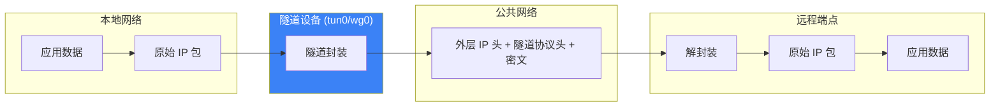
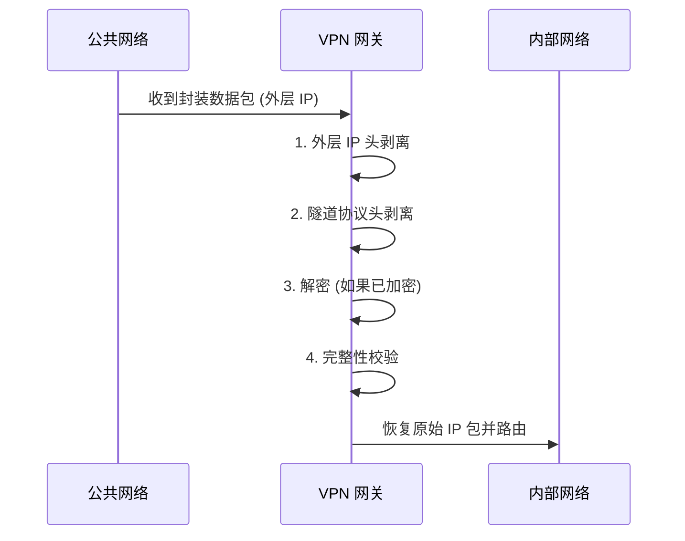
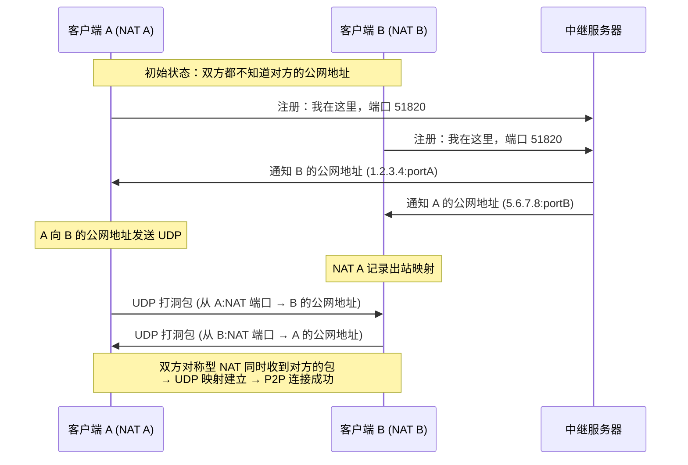

> [!info] VPN 技术深度探索系列
> 0. [[2026-04-13-vpn-deep-dive-series-index|全栈学习路径总览]]
> 1. [[2026-04-13-vpn-deep-dive-ch1-vpn-fundamentals|VPN 基础概念]]
> 2. **第二章：隧道技术基础**
> 3. [[2026-04-13-vpn-deep-dive-ch3-crypto-fundamentals|第三章：密码学基础]]
> 4. [[2026-04-13-vpn-deep-dive-ch4-authentication|第四章：身份认证基础]]

---

## 1. 概述：隧道技术的本质

**隧道 (Tunnel)** 是 VPN 的核心机制——在两个端点之间创建一个**虚拟的点到点连接**，将原始数据包封装在一种**隧道协议**内部，通过公共网络传输，到达对端后再解封装。

隧道技术的核心问题只有三个：
1. **如何创建虚拟通道？** — tun/tap 虚拟设备
2. **如何封装数据？** — 隧道协议 (GRE/IPIP/WireGuard)
3. **如何转发到对端？** — 隧道接口与路由



---

## 2. tun/tap 虚拟网络设备

### 2.1 什么是 tun/tap？

Linux 内核提供两种虚拟网络设备：

| 类型 | 工作层 | 传输单元 | 典型用途 |
|------|--------|----------|----------|
| **tun** | L3 (网络层) | IP 数据包 | WireGuard、IPSec、OpenVPN (TUN 模式) |
| **tap** | L2 (数据链路层) | Ethernet 帧 | OpenVPN (TAP 模式)、桥接、虚拟机网络 |

**tun** = network **tun**nel  
**tap** = network **tap** (模拟以太网接口)

### 2.2 tun/tap 工作原理

```
用户空间程序                          内核网络栈
      │                                    │
      │    ┌─────────────────────────┐     │
      │    │     tun0 虚拟网卡        │     │
      │◄──►│  (tun/tap 字符设备)      │◄──►│
      │    └─────────────────────────┘     │
      │              │                     │
      ▼              ▼                     ▼
 read()/write()   /dev/net/tun          路由表
 (文件描述符)     (字符设备)             网卡注册
```

**数据流（发送方向）：**
1. 应用向 tun0 写入 IP 数据包
2. 内核将数据包传递给绑定该 tun0 的用户空间进程（通过 read()）
3. 用户空间进程收到数据包，处理后通过隧道发送出去

**数据流（接收方向）：**
1. 隧道收到外部数据包
2. 用户空间进程通过 write() 将处理后的数据包写回 tun0
3. 内核网络栈像处理普通网卡一样处理它

### 2.3 tun/tap 编程接口

创建 tun 设备的经典方式——使用 tun/tap 字符设备：

```c
#include <linux/if.h>
#include <linux/if_tun.h>
#include <fcntl.h>
#include <sys/ioctl.h>

int tun_create(const char *dev_name) {
    struct ifreq ifr = {0};
    int fd = open("/dev/net/tun", O_RDWR);
    
    // 指定 TUN 模式（而非 TAP）
    ifr.ifr_flags = IFF_TUN | IFF_NO_PI;  // IFF_NO_PI = 不包含包信息头
    
    // 请求创建名为 "tun0" 的设备
    strncpy(ifr.ifr_name, dev_name, IFNAMSIZ - 1);
    
    ioctl(fd, TUNSETIFF, &ifr);
    return fd;  // 通过这个 fd 读写 IP 数据包
}
```

**IFF_NO_PI 标志**：控制是否在数据包前附加额外的元数据头。不设置时，每 read/write 多 4 字节的 metadata。

读取一个 IP 数据包：

```c
uint8_t packet[65535];
int n = read(tun_fd, packet, sizeof(packet));
// packet 现在是一个完整的 IP 数据包
// 可直接用 libpcap / wireguard-tools / 自定义协议处理
```

### 2.4 tun vs tap 的数据包差异

```
tun 设备 read() 收到的数据：
┌──────────────────────────────┐
│     IP Header (20B+)         │  ← 纯粹的 L3 IP 数据包
├──────────────────────────────┤
│     TCP/UDP/ICMP Header     │
├──────────────────────────────┤
│     Payload                 │
└──────────────────────────────┘

tap 设备 read() 收到的数据：
┌──────────────────────────────┐
│     Ethernet Header (14B)    │  ← L2 帧
├──────────────────────────────┤
│     IP Header (20B+)         │
├──────────────────────────────┤
│     TCP/UDP Header           │
├──────────────────────────────┤
│     Payload                 │
└──────────────────────────────┘
```

### 2.5 ip 命令创建 tun/tap

```bash
# 创建 tun 设备（无需编程）
ip tunnel add tun0 mode tun

# 创建 tap 设备
ip link add tap0 type tap

# 启用设备
ip link set tun0 up

# 分配 IP 地址
ip addr add 10.0.0.2/24 dev tun0

# 查看设备
ip link show tun0
```

---

## 3. 隧道封装与解封装

### 3.1 封装原理

**隧道封装**是将原始数据包作为**载荷 (Payload)**，在最外层添加新的 IP 头和隧道协议头：

```
原始数据包：
┌─────────────────────────┐
│  Src: 192.168.1.10      │  ← 原始 Src IP
│  Dst: 192.168.2.20      │  ← 原始 Dst IP
├─────────────────────────┤
│  TCP Header             │
├─────────────────────────┤
│  Application Data       │
└─────────────────────────┘
           │
           │ 隧道封装
           ▼
封装后（在 Internet 上传输）：
┌─────────────────────────────────────────────────────┐
│  Src: 203.0.113.10         │  ← 外层 Src IP（VPN 网关）│
│  Dst: 198.51.100.20       │  ← 外层 Dst IP（对端网关）│
├─────────────────────────────────────────────────────┤
│  隧道协议头 (GRE/IPSec/WireGuard)                    │
├─────────────────────────────────────────────────────┤
│  加密/认证 wrapping                                 │
├─────────────────────────────────────────────────────┤
│  原始 IP 包（加密或明文，取决于协议）                  │
└─────────────────────────────────────────────────────┘
```

### 3.2 解封装过程

解封装是封装的逆过程：



### 3.3 隧道协议的共同特征

所有隧道协议都有几个共同特征：

| 特征 | 说明 |
|------|------|
| **封装协议头** | 在原始包外层添加自己的头部 (GRE Header / WireGuard Header) |
| **外层传输层** | 通常使用 UDP（WireGuard）或直接用 IP 协议号 (GRE=47, ESP=50) |
| **多路复用** | 通过某种方式区分不同隧道的流量（GRE 用 Key，WireGuard 用 Session） |
| **可选加密** | 部分协议自带加密 (WireGuard)，部分需配合 IPSec (GRE+IPSec) |

---

## 4. 三种典型隧道协议对比

### 4.1 IPIP (IP in IP)

最简单的隧道协议——直接将 IP 包封装在另一个 IP 包内：

```bash
# 创建 IPIP 隧道
ip tunnel add ipip0 mode ipip \
    local 203.0.113.10 remote 198.51.100.20

# 封装结构
┌──────────────────────────────┐
│  外层 IP Header (protocol=4) │  ← IP-in-IP
├──────────────────────────────┤
│  内层 IP Header              │
├──────────────────────────────┤
│  Payload                     │
└──────────────────────────────┘
```

**问题**：IPIP 没有任何加密，原始内容完全明文；无法穿越 NAT。

### 4.2 GRE (Generic Routing Encapsulation)

GRE 是最通用的 L3 隧道协议，支持多种载荷类型：

```bash
# 创建 GRE 隧道
ip tunnel add gre0 mode gre \
    local 203.0.113.10 remote 198.51.100.20 \
    key 0x12345678  # 启用键控 GRE
```

GRE 头结构：

```
┌─────────────────────────────────────────────────────┐
│  外层 IP Header                                     │
├─────────────────────────────────────────────────────┤
│  GRE Header                                         │
│  ┌────────────────────────────────────────────────┐ │
│  │ C | R | K | S | s | Recursion │ Flags | Ver=0  │ │
│  ├────────────────────────────────────────────────┤ │
│  │  Protocol Type (0x0800 = IPv4)                 │ │
│  ├────────────────────────────────────────────────┤ │
│  │  Key (可选, 4B) - 区分不同隧道流                 │ │
│  ├────────────────────────────────────────────────┤ │
│  │  Sequence Number (可选) - 序列化                │ │
│  └────────────────────────────────────────────────┘ │
├─────────────────────────────────────────────────────┤
│  内层 IP Header + Payload                           │
└─────────────────────────────────────────────────────┘
```

GRE vs IPIP 的关键区别：

| 特性 | IPIP | GRE |
|------|------|-----|
| 协议号 | IP Protocol 4 | IP Protocol 47 |
| 多协议封装 | 否（仅 IP） | 是（IP/Ethernet/MPLS） |
| Key 字段 | 无 | 有 |
| Checksum | 无 | 可选 |
| Sequence | 无 | 可选 |
| 加密 | 无 | 无（需配合 IPSec） |

### 4.3 WireGuard 隧道

WireGuard 是现代隧道的代表——固定搭配现代密码学，无需协商：

```bash
# WireGuard 配置示例
# /etc/wireguard/wg0.conf

[Interface]
PrivateKey = <服务器私钥>
Address = 10.0.0.1/24

[Peer]
PublicKey = <客户端公钥>
AllowedIPs = 10.0.0.2/32
Endpoint = 203.0.113.10:51820
PersistentKeepalive = 25
```

WireGuard 封装结构（基于 UDP）：

```
┌─────────────────────────────────────────────────────┐
│  外层 UDP Header                                    │
│  Src: 203.0.113.10:51820                           │
│  Dst: 198.51.100.20:51820                           │
├─────────────────────────────────────────────────────┤
│  WireGuard Header (第1类握手包 or 密文数据包)        │
│  - Type: Handshake Initiation / Response / Cookie  │
│  - Sender Index: 标识发送方                         │
│  - Encrypted Static/Transient/Receipts              │
├─────────────────────────────────────────────────────┤
│  加密载荷 (Encrypted Content)                        │
│  - 内层 IP 包 (ChaCha20-Poly1305 加密)              │
└─────────────────────────────────────────────────────┘
```

### 4.4 协议对比总览

|| IPIP | GRE | WireGuard |
|------|------|-----|------------|
| **协议号** | IP=4 | IP=47 | UDP=51820 |
| **加密** | 无 | 无 | ChaCha20-Poly1305 |
| **密钥交换** | 无 | 无 | Curve25519 DH |
| **NAT 穿透** | 差 | 一般 | 好 (UDP) |
| **多协议** | 仅 IPv4 | 是 | 是 (任何 L3) |
| **复杂度** | 极简 | 中等 | 低 |
| **性能** | 高 | 高 | 高 |

---

## 5. 隧道接口与路由

### 5.1 隧道即路由

隧道在 Linux 中表现为一个虚拟网络接口，与普通网卡一样参与路由决策：

```bash
# WireGuard 隧道接口
ip link show wg0
# wg0: <POINTOPOINT,MULTICAST,NOARP,UP,LOWER_UP> mtu 1420
#     link/gre 10.0.0.1 peer 10.0.0.2

# 查看路由
ip route show dev wg0
# 10.0.0.0/24 via 10.0.0.2 dev wg0
```

**路由决定流量是否走隧道**——当内核决定某个目标 IP 符合隧道接口的路由时，将该包发往隧道设备。

### 5.2 不同隧道的路由行为差异

```
OpenVPN (TUN 模式):
  路由: 0.0.0.0/0 via 10.8.0.1 → 所有流量走 VPN
  隧道接口收到 IP 包 → 用户空间解密 → 写入 tun 设备

WireGuard:
  路由: 10.0.0.0/24 dev wg0 → 指定网段走 VPN
  隧道接口收到 IP 包 → 内核加密 → UDP 发送

IPSec (Tunnel Mode):
  路由: 正常路由 → 命中 SAD → 内核直接加密转发（无需用户空间）
```

### 5.3 split-tunnel vs full-tunnel

| 模式 | 说明 | 路由 |
|------|------|------|
| **Full Tunnel** | 所有流量都走 VPN | `0.0.0.0/0 via VPN_GW` |
| **Split Tunnel** | 仅特定流量走 VPN | `10.0.0.0/8 via VPN_GW` |

```bash
# Full Tunnel - WireGuard 配置
[Peer]
AllowedIPs = 0.0.0.0/0, ::/0  # 全部流量

# Split Tunnel - 仅企业网段
[Peer]
AllowedIPs = 10.0.0.0/8, 172.16.0.0/12
```

---

## 6. 隧道 MTU 问题

### 6.1 隧道 MTU 叠加

VPN 隧道会叠加额外的头部，导致数据包变大：

```
以太网 MTU: 1500B

WireGuard 封装:
  原始包:        1500B
  + WG Header:    32B  (keepalive + encrypted)
  + UDP Header:    8B
  + Outer IP:      20B
  = Total:       1560B  → 超过 1500，需要分片！
```

### 6.2 MTU 配置策略

```bash
# 方案1: 手动设置 MTU（最安全）
ip link set dev wg0 mtu 1420
# 1420 = 1500 - 60 (WireGuard overhead) - 20 (outer IP)

# 方案2: MSS Clamping (对 TCP 有效)
iptables -t mangle -A FORWARD -p tcp \
    --syn -m tcpmss --mss 1380 -j TCPMSS set-clamp-mss-to-pmtu

# 方案3: 路径 MTU Discovery (PMTUD)
# 隧道两端开启 PMTUD，让路由器反馈 ICMP "Packet Too Big"
```

### 6.3 不同隧道的 MTU 开销

|| 协议 | MTU Overhead | 推荐隧道 MTU |
|------|------|-------------|--------------|
| IPIP | 20B | 1480 |
| GRE | 24B (含 GRE 头) | 1476 |
| WireGuard | ~60B | 1420 |
| IPSec (ESP) | ~70B | ~1430 |
| OpenVPN (UDP) | ~70B | 1430 |

---

## 7. 隧道与 NAT

### 7.1 隧道穿越 NAT 的问题

隧道协议穿越 NAT 有两个核心挑战：

1. **协议识别**：NAT 设备需要理解隧道协议才能正确转发
2. **返回路径**：外部数据包如何正确路由回 NAT 后的隧道端点

### 7.2 NAT 穿透方案

```
NAT 类型          穿透难度    解决方案
─────────────────────────────────────────────
全锥形 (Full Cone)   易        直接端口映射
受限锥 (Restricted)  中        STUN/TURN
对称形 (Symmetric)   难        UDP 打洞 / 中继

WireGuard: 纯 UDP，天生支持 NAT 穿透
  → 通过 PersistentKeepalive 保持 UDP 会话活跃
  → 无需理解协议内容，NAT 设备只需保持 UDP 映射

GRE: 需要额外配置 NAT-T (NAT Traversal)
  → ESP (IPSec) 封装在 UDP 4500 端口中
```

### 7.3 UDP 打洞原理

两个位于 NAT 后的客户端如何直接建立连接：



---

## 8. 总结：隧道技术全景

|| 维度 | 结论 |
|------|------|------|
| **tun vs tap** | tun = L3 IP 包，tap = L2 帧 | WireGuard 用 tun，桥接用 tap |
| **封装原理** | 外层 IP + 隧道头 + 原始包 | 增加 MTU 开销 |
| **隧道协议** | IPIP（无加密）/ GRE（通用）/ WireGuard（加密） | 按需选择 |
| **路由** | 隧道 = 虚拟网卡，路由决定流量走向 | split-tunnel vs full-tunnel |
| **MTU** | 隧道额外头部导致 MTU 叠加 | 设置 1420 左右 |
| **NAT** | UDP 隧道穿透性最好 | WireGuard 天然穿透 |

**下一章预告：** [[2026-04-13-vpn-deep-dive-ch3-crypto-fundamentals|第三章：密码学基础]] — AES 对称加密、RSA/ECC 非对称加密、Diffie-Hellman 密钥交换、HMAC 完整性校验。

---

> [!quote] 参考文献
> - [[2026-04-13-kernel-protocol-stack-deep-dive-ch17-gre|GRE 隧道 (Kernel Protocol Stack)]] — 内核 GRE 实现
> - [[2026-03-12-wireguard-protocol-deep-dive|WireGuard 协议深度解析]] — 现代 VPN 协议
> - [[2026-03-12-ipsec-protocol-deep-dive|IPSec 协议深度解析]] — 企业 VPN 事实标准
