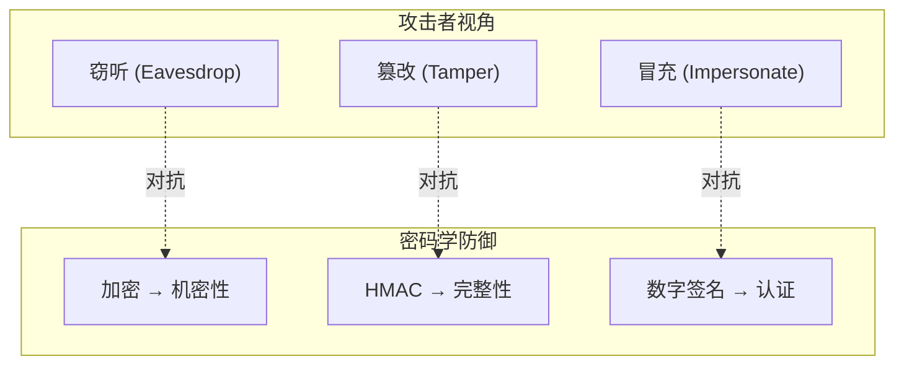
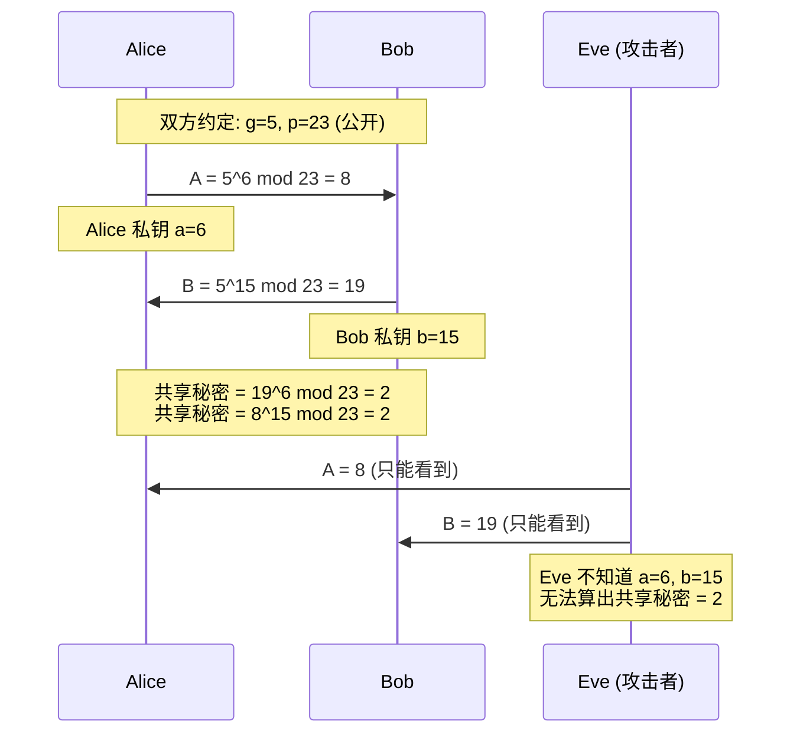

> [!info] VPN 技术深度探索系列 0. [[2026-04-13-vpn-deep-dive-series-index|全栈学习路径总览]]
>
> 1. [[2026-04-13-vpn-deep-dive-ch1-vpn-fundamentals|VPN 基础概念]]
> 2. [[2026-04-13-vpn-deep-dive-ch2-tunnel-basics|第二章：隧道技术基础]]
> 3. **第三章：密码学基础**
> 4. [[2026-04-13-vpn-deep-dive-ch4-authentication|第四章：身份认证基础]]

---

## 1. 概述：VPN 为什么要加密？

VPN 的核心价值是**在不可信的公共网络上建立安全的通信通道**。没有加密的隧道，原始数据在 Internet 上明文传输，任何中间攻击者都能窃听、篡改。

密码学为 VPN 提供：

| 安全目标                     | 密码学工具      | 说明                       |
| ---------------------------- | --------------- | -------------------------- |
| **机密性 (Confidentiality)** | 对称/非对称加密 | 防止数据被窃听             |
| **完整性 (Integrity)**       | HMAC / AEAD     | 防止数据被篡改             |
| **密钥交换 (Key Exchange)**  | DH / ECDH       | 在不安全通道上建立共享密钥 |
| **认证 (Authentication)**    | 数字签名 / 证书 | 验证对端身份               |



---

## 2. 对称加密：AES

### 2.1 什么是对称加密

**对称加密**：加密和解密使用**同一个密钥**。优点是速度快，缺点是密钥传输问题——如何把密钥安全地交给对方？

```
密钥: K (例如 256 位的随机数)

明文 P ──► 加密 (E, K) ──► 密文 C
密文 C ──► 解密 (D, K) ──► 明文 P

P = D(E(P, K), K)
```

**VPN 中的对称加密**：用于加密实际传输的数据（海量数据），因为对称加密比非对称快 100-1000 倍。

### 2.2 AES 算法详解

**AES (Advanced Encryption Standard)** 是目前最广泛使用的对称加密算法：

| 参数         | 选项                                       |
| ------------ | ------------------------------------------ |
| **密钥长度** | 128 / 192 / 256 位                         |
| **分组长度** | 固定 128 位 (16 字节)                      |
| **迭代次数** | 10 (AES-128) / 12 (AES-192) / 14 (AES-256) |

AES 不是简单地对 16 字节进行一次性加密，而是通过多轮变换（SubBytes → ShiftRows → MixColumns → AddRoundKey）打乱数据：

```python
# AES 加密核心步骤（简化）
def aes_round(state, round_key):
    state = sub_bytes(state)      # S-Box 非线性替换
    state = shift_rows(state)      # 行移位
    state = mix_columns(state)     # 列混淆
    state = add_round_key(state)   # 与轮密钥异或
    return state
```

### 2.3 AES 工作模式

AES 本身是**分组加密**（Block Cipher），每次加密固定 16 字节。但实际数据远大于 16 字节，需要用**工作模式 (Mode of Operation)** 将分组串联起来：

#### CBC 模式 (Cipher Block Chaining)

最经典的工作模式——每个明文块与前一个密文块异或后再加密：

```
IV (初始化向量) ──────────────────►┌─────────────────┐
                                    │                 │
明文块 1 ──► XOR ──► AES 加密 ──┐  │                 │
                    │            ▼  │                 │
明文块 2 ──► XOR ◄──┘ 密文块 1 ──► AES 加密 ──┐      │
                                      │      │      │
明文块 3 ──► XOR ◄──────────────────────┘ 密文块 2 ──► AES 加密 ──► 密文块 3
```

**CBC 的问题**：

- 必须顺序解密（前一个块损坏会导致后续无法解密）
- 无完整性保护（攻击者可修改密文位）
- 并行化困难

#### GCM 模式 (Galois/Counter Mode)

**现代 VPN 的首选**——同时提供加密和完整性认证（AEAD）：

```
计数器模式加密：
Counter 0 ──► AES 加密 ──► Keystream 0 ──► XOR ──► 密文块 1
Counter 1 ──► AES 加密 ──► Keystream 1 ──► XOR ──► 密文块 2
...

同时计算 Authentication Tag（类似 HMAC）
```

**GCM 的优势**：

- 可以并行加密（Counter 模式）
- 同时输出密文和认证标签
- 认证加密一体化，防止密文篡改

### 2.4 AES 在 VPN 中的使用

```bash
# OpenVPN 使用 AES
cipher AES-256-GCM        # 加密算法
auth SHA256               # 完整性校验

# IPSec ESP 使用 AES
esp=aes-gcm256            # AES-GCM 认证加密
esp=aes-cbc                # 纯加密（需另加 HMAC）

# WireGuard 使用 ChaCha20-Poly1305
# ChaCha20 是流密码，专门为低功耗设备优化
# Poly1305 是 MAC，用于完整性认证
```

---

## 3. 非对称加密：RSA 与 ECC

### 3.1 非对称加密的核心思想

**非对称加密**：有一对密钥——**公钥 (Public Key)** 和**私钥 (Private Key)**。公钥加密只能用私钥解密，私钥签名只能用公钥验证。

```
加密场景：
明文 P ──► 用公钥加密 ──► 密文 C ──► 用私钥解密 ──► 明文 P
P = D(E(P, PK), SK)

签名场景：
消息 M ──► 用私钥签名 ──► 签名 S ──► 用公钥验证 ──► 有效/无效
```

**用途**：非对称加密**不用于加密大量数据**（太慢），而是用于：

1. 密钥交换（建立对称密钥）
2. 数字签名（身份认证）

### 3.2 RSA 算法

RSA 是最经典的非对称加密算法，基于**大数分解的数学难题**：

```
数学基础：
- 选择两个大素数 p 和 q
- N = p × q（N 的长度即 RSA 密钥长度，通常 2048 或 4096 位）
- 找到 e 使得 e 与 (p-1)(q-1) 互质
- 计算 d 使得 e × d ≡ 1 (mod φ(N))

公钥: (N, e)
私钥: (N, d)

加密: C = M^e mod N
解密: M = C^d mod N
```

**RSA 的 VPN 使用场景**：

```bash
# 生成 RSA 密钥对 (OpenVPN)
openssl genrsa -out server.key 4096
openssl rsa -in server.key -pubout -out server.crt  # 导出公钥

# IPSec 证书认证
# 数字证书中包含 RSA 公钥
```

**RSA 的问题**：

- 密钥长度大（2048 位 RSA ≈ 2304 位密文）
- 计算慢（比 AES 慢约 1000 倍）
- 无法抵御量子计算（ Shor's Algorithm）

### 3.3 ECC 算法

**ECC (Elliptic Curve Cryptography)** 使用椭圆曲线数学，**用更短的密钥提供同等安全性**：

| RSA 密钥长度 | ECC 密钥长度 | 安全性 |
| ------------ | ------------ | ------ |
| 2048 位      | 256 位       | 相当   |
| 3072 位      | 384 位       | 相当   |
| 4096 位      | 512 位       | 相当   |

```
椭圆曲线方程：y² = x³ + ax + b (mod p)

密钥生成：
- 选择曲线上的基点 G
- 私钥 d：随机数
- 公钥 Q = d × G（椭圆曲线点乘）

签名（ECDSA）：
- 选择随机数 k
- 计算 R = k × G
- 计算 s = k⁻¹(H(m) + d×r) mod p
- 签名 = (r, s)
```

**VPN 中的 ECC**：

```bash
# 生成 ECDSA 密钥 (WireGuard)
# WireGuard 固定使用 Curve25519（ECC 的一种）
# 私钥: 256 位随机数（经 Elligator 映射）
# 公钥: 255 位的 Curve25519 点

# OpenVPN 支持 ECDSA
openssl ecparam -name prime256v1 -genkey -out ec.key
openssl ec -in ec.key -pubout -out ec.pub
```

### 3.4 Curve25519：WireGuard 的选择

WireGuard 使用 **Curve25519**——目前最优雅的椭圆曲线实现之一：

```c
// Curve25519 密钥交换
// 双方各有一个静态密钥对 (sks, pks) 和临时密钥对 (ske, pke)

// 双方计算共享秘密
shared_secret = curve25519(ske, pks)  // 客户端
shared_secret = curve25519(sks, pke)  // 服务器
// 两者数学上相等 → 共享秘密建立
```

**Curve25519 的优势**：

- 密钥仅 32 字节，签名仅 64 字节
- 设计的曲线参数避免多种攻击
- 实现简单、速度快、侧信道攻击抵抗好

---

## 4. Diffie-Hellman 密钥交换

### 4.1 密钥交换问题

对称加密需要双方拥有相同的密钥，但如何**在不安全的通道上安全地传输密钥**？

```
Alice ─────────────────────────────── Bob
  │                                      │
  │  "我用 AES-256-GCM，密钥是 0x1234..." │  ← 攻击者能看到！
  │ ───────────────────────────────────►│
  │                                      │
  ❌ 任何人都能截获密钥                    │
```

### 4.2 DH 原理

**Diffie-Hellman** 允许双方在公开通道上建立共享秘密：

```
数学基础：离散对数问题

给定 g 和 p（公开常数）：
- Alice 选择 a，计算 A = g^a mod p，发给 Bob
- Bob 选择 b，计算 B = g^b mod p，发给 Alice
- 共享秘密 = (g^a)^b mod p = (g^b)^a mod p = g^(ab) mod p

攻击者只知道 A、B、g、p，无法算出 a、b 或 g^(ab)
```



### 4.3 ECDH (Elliptic Curve DH)

现代 VPN 普遍使用 **ECDH**——用 ECC 效率替换 DH：

```bash
# WireGuard 使用的 ECDH
# 固定 Curve25519，无需协商曲线参数

# 握手过程
客户端 ──► 发送临时公钥 ──► 服务器
服务器 ──► 计算共享秘密 ──► 服务器
客户端 ──► 计算共享秘密 ──► 客户端
# 双方得到相同的 256 位共享秘密
# 用于派生出实际的加密密钥
```

### 4.4 前向保密 (Perfect Forward Secrecy, PFS)

**前向保密**：即使攻击者后来获取了服务器的长期私钥，**也无法解密之前截获的通信**（因为每次会话使用了临时密钥对）。

```
没有 PFS：
  长期私钥泄露 → 所有历史会话可解密 ❌

有 PFS（每次 DH 重新协商）：
  长期私钥泄露 → 仅当前会话可解密（如果攻击者同时截获了当前会话）
  历史会话安全，因为用的是当时的临时 DH 私钥 ✅
```

```bash
# OpenVPN 启用 PFS
# 每隔 N 秒重新协商密钥
reneg-sec 3600        # 1 小时重新协商一次

# IPSec 默认使用 PFS（IKEv2 每次 Child SA 都重新 DH）
```

---

## 5. HMAC 与完整性校验

### 5.1 什么是 HMAC

**HMAC (Hash-based Message Authentication Code)** 用于验证消息完整性和认证来源：

```
原始消息 M + 共享密钥 K → HMAC(M, K) → 认证标签 T

接收方：
- 用相同密钥 K 计算 HMAC(M', K)
- 比较 T == HMAC(M', K)
- 相等 → 消息未被篡改
- 不等 → 消息被修改或来自假冒者
```

**HMAC 不是加密**——它不隐藏消息内容，只验证完整性。

### 5.2 HMAC 的结构

HMAC 使用哈希函数（SHA-256、SHA-384、SHA-512）：

```c
// HMAC-SHA256 简化实现
// HMAC(K, m) = H( (K' ⊕ opad) || H( (K' ⊕ ipad) || m ) )

#define KEY_LEN 32  // SHA-256 输出 32 字节

void hmac_sha256(uint8_t *key, size_t key_len,
                 uint8_t *msg, size_t msg_len,
                 uint8_t *out) {
    uint8_t k_ipad[64] = {0};
    uint8_t k_opad[64] = {0};
    uint8_t k[64] = {0};

    // 密钥填充/扩展到 64 字节
    memcpy(k, key, key_len);

    // 内部填充 (ipad = 0x36) 和外部填充 (opad = 0x5c)
    for (int i = 0; i < 64; i++) {
        k_ipad[i] = k[i] ^ 0x36;
        k_opad[i] = k[i] ^ 0x5c;
    }

    // 内层哈希
    uint8_t inner[32];
    sha256_update(k_ipad, 64);
    sha256_update(msg, msg_len);
    sha256_final(inner);

    // 外层哈希
    sha256_update(k_opad, 64);
    sha256_update(inner, 32);
    sha256_final(out);  // 32 字节 HMAC 输出
}
```

### 5.3 HMAC 在 VPN 中的应用

```
IPSec ESP 封装（AES-CBC + HMAC）:
┌─────────────────────────┬──────────────────┬──────────────┐
│  ESP Header │ 加密载荷   │ ESP Trailer │ ICV (HMAC) │
└─────────────────────────┴──────────────────┴──────────────┘
                              │                │
                              └── 加密 ────────┘
                                              └── HMAC（完整性）

HMAC 计算范围：ESP Header + 加密载荷 + ESP Trailer（不含外层 IP）
```

### 5.4 认证标签长度与安全性

| HMAC 类型   | 输出长度 | 安全性                 |
| ----------- | -------- | ---------------------- |
| HMAC-SHA1   | 20 字节  | 已不推荐（SHA-1 弱点） |
| HMAC-SHA256 | 32 字节  | 推荐                   |
| HMAC-SHA384 | 48 字节  | 高安全场景             |

---

## 6. AEAD：认证加密

### 6.1 什么是 AEAD

**AEAD (Authenticated Encryption with Associated Data)** 是一种同时提供**加密 + 认证**的加密模式，是现代 VPN 的首选。

**三大保证**：

1. **机密性**：攻击者无法获知明文
2. **完整性**：攻击者无法篡改密文
3. **认证**：只有持有密钥的人能生成有效密文

### 6.2 AES-GCM：主流 AEAD

AES-GCM = CTR 模式加密 + Galois Field MAC：

```
加密过程：
1. 生成 12 字节 IV (Nonce)
2. AES-CTR 加密明文 → 密文
3. GHASH 计算认证标签
4. 输出: IV + 密文 + 认证标签 (16 字节)

解密过程：
1. 验证认证标签 → 失败则拒绝
2. 用 IV 解密 → 明文
```

```bash
# OpenVPN 使用 AES-GCM
cipher AES-256-GCM    # ← GCM 后缀表示 AEAD

# WireGuard 使用 ChaCha20-Poly1305
# ChaCha20: 流密码加密
# Poly1305: 基于 GHASH 的 MAC
```

### 6.3 认证加密与非认证加密的对比

| 场景       | 非认证加密 (AES-CBC) | AEAD (AES-GCM)         |
| ---------- | -------------------- | ---------------------- |
| 机密性     | ✅                   | ✅                     |
| 完整性校验 | ❌ (需额外 HMAC)     | ✅                     |
| 篡改攻击   | 可能成功             | **必定检测到**         |
| VPN 协议   | 旧版 IPSec           | 现代 IPSec / WireGuard |

**篡改攻击示例（AES-CBC，无 HMAC）**：

```
原始密文（攻击者可修改任意位）:
  密文块 C1, C2, C3...

攻击者翻转 C2 的某个比特:
  C1, C2⊕Δ, C3...

解密后:
  P1 正常
  P2 = ... ⊕ Δ (部分损坏，但无法检测)
  P3 正常

攻击者成功修改了部分内容，但接收方无法察觉！
```

---

## 7. 密钥派生：DKF 与 HKDF

### 7.1 为什么需要密钥派生

VPN 握手建立后，得到的是一个**原始共享秘密 (Shared Secret)**，通常称为 **IK (Initial Key)** 或 **PSK (Pre-Shared Key)**。但 VPN 需要多个密钥：

- 加密密钥 (Encryption Key)
- 认证密钥 (Authentication Key)
- 每次会话用不同密钥（实现 PFS）

### 7.2 HKDF：标准密钥派生函数

**HKDF (HMAC-based Key Derivation Function)** 是标准的密钥派生方法：

```
HKDF(secret, salt, info, length) → derived keys

- secret: 原始密钥材料（DH 共享秘密或 PSK）
- salt: 随机盐值（通常为 nonce 或 IV）
- info: 上下文信息（"encryption" / "authentication"）
- length: 输出密钥长度
```

```c
// HKDF 简化实现
void hkdf_extract(uint8_t *secret, size_t secret_len,
                   uint8_t *salt, size_t salt_len,
                   uint8_t *prk) {
    // Extract: HMAC-Hash(salt, secret)
    hmac_sha256(salt, salt_len, secret, secret_len, prk);
}

void hkdf_expand(uint8_t *prk,
                  uint8_t *info, size_t info_len,
                  uint8_t *okm, size_t okm_len) {
    // Expand: 迭代计算 HMAC 链
    uint8_t T[32] = {0};
    uint8_t counter = 1;

    while (okm_len > 0) {
        hmac_sha256(prk, 32, T, 32, T);
        hmac_sha256(prk, 32, T, 32, info, info_len, &counter, 1, T);
        memcpy(okm, T, min(32, okm_len));
        okm += 32;
        okm_len -= 32;
        counter++;
    }
}
```

### 7.3 WireGuard 的密钥派生

WireGuard 的握手协议用 **HKDF 派生出多个会话密钥**：

```
HKDF(ck, DH 结果, " WireGuard v1 zt1 etc")
  ├─► session_tokens
  │     ├─► sending_hmac_key
  │     └─► receiving_hmac_key
  ├─► sending_cipher_key  (用于加密数据)
  └─► receiving_cipher_key  (用于解密数据)
```

---

## 8. 总结：VPN 密码学全景

|                | 组件                        | 技术                     | 用途 |
| -------------- | --------------------------- | ------------------------ | ---- |
| **对称加密**   | AES-256-GCM, ChaCha20       | 加密传输数据             |
| **非对称加密** | RSA-4096, ECDH (Curve25519) | 密钥交换、签名           |
| **密钥交换**   | ECDH, DH                    | 安全建立共享密钥         |
| **完整性校验** | HMAC-SHA256, Poly1305       | 防篡改                   |
| **认证加密**   | AES-GCM, ChaCha20-Poly1305  | 加密 + 认证一体化        |
| **密钥派生**   | HKDF                        | 从原始秘密派生出各类密钥 |

**密钥体系的核心原则**：

1. 数据加密用**对称密钥**（快）
2. 对称密钥通过 **DH/ECDH** 交换（安全）
3. 身份通过**数字签名**验证（证书）
4. **AEAD** 同时保证机密性和完整性
5. **PFS** 确保历史会话安全

**下一章预告：** [[2026-04-13-vpn-deep-dive-ch4-authentication|第四章：身份认证基础]] — PKI/CA 体系、X.509 数字证书、预共享密钥、RADIUS/LDAP 企业认证。

---

> [!quote] 参考文献
>
> - [[2026-03-12-wireguard-protocol-deep-dive|WireGuard 协议深度解析]] — 密码学应用
> - [[2026-03-12-ipsec-protocol-deep-dive|IPSec 协议深度解析]] — ESP 加密与认证
> - [[2026-04-13-vpn-deep-dive-ch2-tunnel-basics|第二章：隧道技术基础]] — 隧道封装原理
