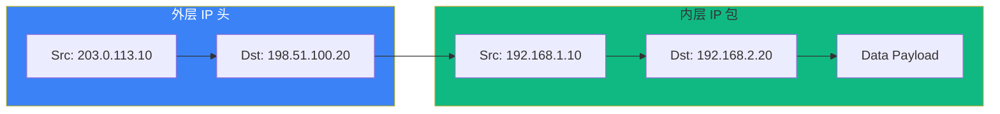
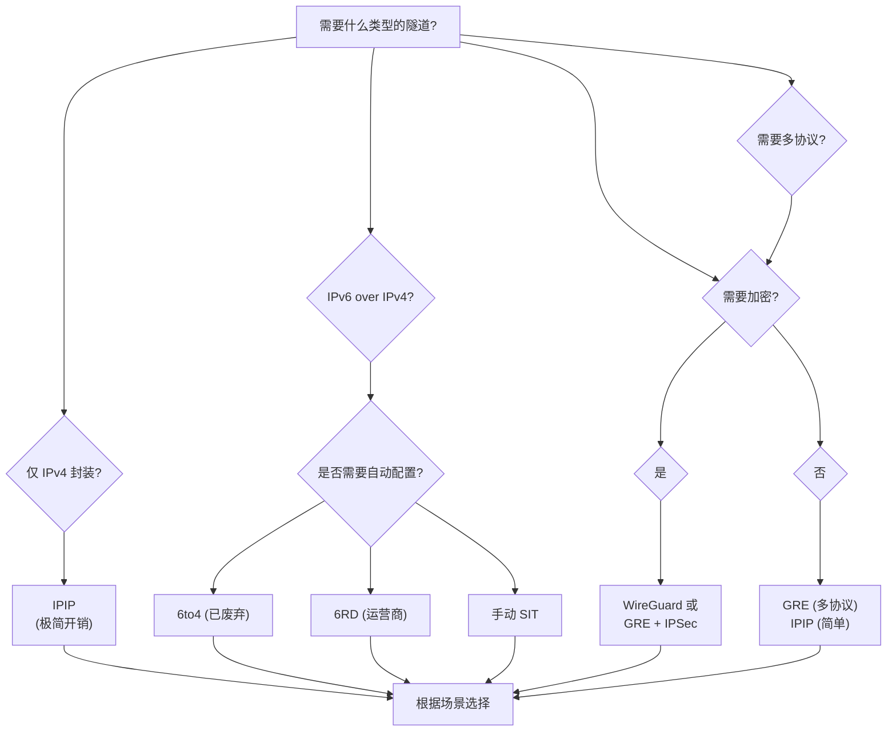

> [!info] VPN 技术深度探索系列
> 0. [[2026-04-13-vpn-deep-dive-series-index|全栈学习路径总览]]
> 1. [[2026-04-13-vpn-deep-dive-ch1-vpn-fundamentals|VPN 基础概念]]
> 2. [[2026-04-13-vpn-deep-dive-ch2-tunnel-basics|第二章：隧道技术基础]]
> 3. [[2026-04-13-vpn-deep-dive-ch3-crypto-fundamentals|第三章：密码学基础]]
> 4. [[2026-04-13-vpn-deep-dive-ch4-authentication|第四章：身份认证基础]]
> 5. [[2026-04-13-vpn-deep-dive-ch5-gre|第五章：GRE 通用路由封装]]

---

## 1. 概述：IP-in-IP 封装

**IP-in-IP**（RFC 2003）是最简单的隧道封装形式——直接将一个 IP 包封装在另一个 IP 包内部。这种隧道协议在 Linux 中对应两种实现：

| 类型 | 说明 |
|------|------|
| **IPIP** | IPv4-in-IPv4，最基本的隧道 |
| **SIT** | Simple Internet Transition，IPv6-in-IPv4 |

IP-in-IP 的设计哲学是**极简主义**——只做封装，不做加密、不做认证、不做多协议支持。在需要这些特性时，通常叠加 IPSec。



---

## 2. IPIP 协议详解

### 2.1 IPIP 封装格式

IPIP 是最简单的隧道协议，仅增加一层外层 IP 头：

```
┌──────────────────────────────────────────────────────┐
│  外层 IP Header (Protocol = 4)                      │
│  Src: 203.0.113.10 (隧道入口)                       │
│  Dst: 198.51.100.20 (隧道出口)                      │
├──────────────────────────────────────────────────────┤
│  内层 IP Header (原始数据包)                         │
│  Src: 192.168.1.10                                  │
│  Dst: 192.168.2.20                                  │
├──────────────────────────────────────────────────────┤
│  内层载荷                                            │
└──────────────────────────────────────────────────────┘
```

### 2.2 外层 IP 头 Protocol 字段

| Protocol 值 | 协议 | 说明 |
|-------------|------|------|
| 4 | IP-IP | IP-in-IP 封装 |
| 41 | IPv6 | 6in4 隧道 (SIT) |
| 47 | GRE | GRE 封装 |
| 50 | ESP | IPSec ESP |
| 51 | AH | IPSec AH |

### 2.3 IPIP vs GRE 头对比

```
IPIP 头：
┌──────────────────────────────────────────────────────┐
│  外层 IP Header (20 bytes)                          │
│  Protocol = 4                                       │
└──────────────────────────────────────────────────────┘

GRE 头（最小 4 字节）：
┌──────────────────────────────────────────────────────┐
│  外层 IP Header (20 bytes)                          │
│  Protocol = 47                                      │
├──────────────────────────────────────────────────────┤
│  GRE Header (4+ bytes)                              │
│  C|R|K|S|s|Recursion|Flags|Ver | Protocol Type     │
└──────────────────────────────────────────────────────┘
```

|| IPIP | GRE |
|------|------|-----|
| 额外头部 | 0 bytes（仅外层IP） | 4-24 bytes |
| 开销 | 最小 | 稍大 |
| 多协议支持 | 仅 IPv4 | IPv4/IPv6/Ethernet |
| Key 字段 | 无 | 有 |
| NAT 穿越 | 稍好（单层IP） | 差（GRE 协议号） |

---

## 3. Linux IPIP 配置

### 3.1 基本 IPIP 隧道配置

```bash
# 创建 IPIP 隧道
ip tunnel add ipip0 mode ipip \
    local 203.0.113.10 \
    remote 198.51.100.20

# 设置 IP 地址
ip addr add 10.0.0.1/30 dev ipip0

# 启用隧道
ip link set ipip0 up

# 查看配置
ip -d link show ipip0
# ipip0: ipip@NONE, remote 198.51.100.20, local 203.0.113.10, ttl inherit
#     link/ipip 198.51.100.20 dev eth0
```

### 3.2 IPIP 隧道路由配置

```bash
# 指定走 IPIP 隧道的目标网段
ip route add 192.168.2.0/24 dev ipip0

# 或者通过 tunneldst 方式
ip route add 192.168.2.0/24 via 198.51.100.20 dev ipip0

# 查看路由
ip route show dev ipip0
# 192.168.2.0/24 via 198.51.100.20 dev ipip0
```

### 3.3 IPIP 完整配置示例

```bash
# Site A 配置（203.0.113.10）
ip tunnel add ipip0 mode ipip local 203.0.113.10 remote 198.51.100.20
ip addr add 10.0.0.1/30 dev ipip0
ip link set ipip0 up
ip route add 192.168.2.0/24 dev ipip0

# Site B 配置（198.51.100.20）
ip tunnel add ipip0 mode ipip local 198.51.100.20 remote 203.0.113.10
ip addr add 10.0.0.2/30 dev ipip0
ip link set ipip0 up
ip route add 192.168.1.0/24 dev ipip0

# 测试连通性
# Site A: ping 192.168.2.1
```

---

## 4. SIT 隧道详解

### 4.1 SIT 是什么

**SIT (Simple Internet Transition)** 是一种**IPv6-in-IPv4 隧道**协议，用于在纯 IPv4 基础设施上传递 IPv6 流量。SIT 在 Linux 内核中的实现使用 `mode sit`。

```
┌──────────────────────────────────────────────────────┐
│  外层 IPv4 Header (Protocol = 41)                   │
│  Src: 203.0.113.10 (隧道入口)                        │
│  Dst: 198.51.100.20 (隧道出口)                       │
├──────────────────────────────────────────────────────┤
│  内层 IPv6 Header                                    │
│  Src: 2001:db8:1::1                                 │
│  Dst: 2001:db8:2::1                                 │
├──────────────────────────────────────────────────────┤
│  IPv6 Payload                                       │
└──────────────────────────────────────────────────────┘
```

### 4.2 SIT 隧道配置

```bash
# 创建 SIT 隧道（IPv6-in-IPv4）
ip tunnel add sit0 mode sit \
    local 203.0.113.10 \
    remote 198.51.100.20

# 设置 IPv6 地址
ip -6 addr add 2001:db8:1::1/64 dev sit0

# 启用隧道
ip link set sit0 up

# 查看
ip -d link show sit0
# sit0: ipv6/ip6tap@NONE, remote 198.51.100.20, local 203.0.113.10, ttl inherit
```

### 4.3 SIT 与 6to4 的关系

**6to4** 是一种基于 SIT 的自动隧道技术，使用特殊的 IPv6 前缀（2002::/16）：

```bash
# 6to4 地址格式：
# 2002:XXXX:XXXX::/48
# 其中 XXXX:XXXX 是公网 IPv4 地址的十六进制表示

# 例如 203.0.113.10 → 0xCB00730A → CB00:730A
# 6to4 前缀: 2002:CB00:730A::/48

# 自动生成 6to4 地址
ip -6 addr add 2002:cb00:730a::1/16 dev eth0

# 6to4 路由器会自动将 2002::/16 的流量通过 SIT 隧道发送
```

---

## 5. 6to4 隧道

### 5.1 6to4 工作原理

**6to4** 允许 IPv6 站点通过 IPv4 网络进行通信，无需配置显式隧道：

```
站点 A (公网 IPv4: 203.0.113.10)          站点 B (公网 IPv4: 198.51.100.20)
2002:cb00:730a:1::1    ◄───────────────────►   2002:c633:7114:1::1
                             SIT (Protocol 41)
                    203.0.113.10 ◄───────► 198.51.100.20
                    
通信过程：
1. 站点 A 要访问 2002:c633:7114:1::1
2. 从 IPv6 前缀 2002:c633:7114: 提取 IPv4 地址 198.51.100.20
3. 通过 IPv4 网络建立 SIT 隧道到 198.51.100.20
```

### 5.2 6to4 自动隧道配置

```bash
# 在公网接口上启用 6to4
ip -6 addr add 2002:cb00:730a::1/16 dev eth0

# 启用 6to4 转发
sysctl -w net.ipv6.conf.all.forwarding=1
sysctl -w net.ipv6.conf.eth0.autoconf=0

# 创建 6to4 隧道（使用 anycast 地址 192.88.99.1）
ip tunnel add tun6to4 mode sit remote 192.88.99.1 local 203.0.113.10
ip -6 addr add 2002:cb00:730a::1/16 dev tun6to4
ip link set tun6to4 up

# 192.88.99.1 是 6to4 中继的 Anycast 地址
# 6to4 站点可通过它访问原生 IPv6 网络
```

### 5.3 6to4 的问题

| 问题 | 说明 |
|------|------|
| **依赖公网 IPv4** | 每个 6to4 站点必须有公网 IPv4 |
| **无法穿越 NAT** | NAT 设备通常不支持 Protocol 41 |
| **Anycast 不稳定** | 6to4 中继 Anycast 地址不可靠 |
| **已被放弃** | 2011 年后主流转向 6rd/原生 IPv6 |

---

## 6. ISATAP 隧道

### 6.1 ISATAP 原理

**ISATAP (Intra-Site Automatic Tunnel Addressing Protocol)** 是一种**站内自动隧道协议**，用于在 IPv4 网络内部访问 IPv6 资源：

```bash
# ISATAP 地址格式：
# IPv4 内嵌在 IPv6 地址的最后 32 位

# 例如：IPv4 = 192.168.1.100
# ISATAP IPv6 = ::0000:5efe:192.168.1.100
# 或简写: ::5efe:192.168.1.100

# 完整 IPv6 地址：
# 2001:db8:1:1:0000:5efe:192.168.1.100
```

### 6.2 ISATAP 配置

```bash
# 创建 ISATAP 隧道
ip tunnel add isatap0 mode isatap remote 203.0.113.10

# 设置 ISATAP 地址（基于本地 IPv4 自动生成）
ip -6 addr add 2001:db8:1:1::5efe:203.0.113.10/64 dev isatap0

# 启用
ip link set isatap0 up

# Windows 使用 netsh 配置 ISATAP
# netsh interface ipv6 isatap set router isatap.example.com
```

### 6.3 ISATAP vs 6to4

|| ISATAP | 6to4 |
|--------|--------|------|
| 用途 | 访问 IPv6 资源（客户端侧） | 站点间 IPv6 互联 |
| 地址格式 | IPv4 内嵌在 ::5efe: 之后 | 特殊 2002::/16 前缀 |
| 隧道建立 | 指向 ISATAP 路由器 | 自动发现（Anycast） |
| NAT 穿越 | 差 | 差 |
| 现代用途 | 企业内网 IPv6 迁移 | 已基本废弃 |

---

## 7. 6rd (6 Rapid Deployment)

### 7.1 6rd 设计背景

6to4 有稳定性问题，运营商开始部署 **6RD (RFC 5969)** 作为过渡方案：

```bash
# 6RD vs 6to4 的关键区别：
# 6to4: 使用固定 2002::/16 前缀，Anycast 中继
# 6RD:  运营商自定义 IPv6 前缀，自家 6RD 网关

# 运营商示例：
# IPv6 前缀: 2001:db8:xxxx::/32（自家前缀）
# IPv4 前缀: 203.0.113.0/24（客户 IPv4 地址）
# 6RD 前缀 = 2001:db8:xxxx:CB007300::/56 (CB00 = 203.0)
```

### 7.2 6RD 配置

```bash
# Linux 不原生支持 6RD，但可以通过自定义脚本实现
# 通常由运营商 CPE 路由器处理

# 6RD 隧道由 ISP 提供
# 客户端通过 DHCPv4 获取 6RD 参数
```

---

## 8. NAT 穿越与 IP-in-IP

### 8.1 IP-in-IP 的 NAT 问题

IPIP 使用 **Protocol 4**（IP-in-IP）或 **Protocol 41**（IPv6），这些协议号在许多 NAT 设备上**不被正确处理**：

```bash
# NAT 穿越对比
┌─────────────┬───────────────┬────────────────────┐
│  协议        │  NAT 支持      │  穿越方案            │
├─────────────┼───────────────┼────────────────────┤
│  IPIP (4)   │  通常不支持     │  NAT-T (UDP 4500)  │
│  SIT (41)   │  通常不支持     │  NAT-T (UDP 4500)  │
│  GRE (47)   │  通常不支持     │  NAT-T + IPSec    │
│  WireGuard  │  原生支持 (UDP) │  直接穿越          │
└─────────────┴───────────────┴────────────────────┘
```

### 8.2 NAT-T 解决方案

当 IPIP/GRE 需要穿越 NAT 时，通常封装在 **UDP 4500** 中（NAT-Traversal）：

```bash
# NAT-T 封装结构：
# ┌────────────────────────────────────┐
# │  外层 UDP Header (Src/Dst: 4500)  │
# ├────────────────────────────────────┤
# │  原始 IP-in-IP / GRE + ESP        │
# └────────────────────────────────────┘

# Linux IPSec NAT-T 自动处理此封装
# strongSwan 配置:
# nat_traversal = yes
# force_nat_traversal = yes
```

---

## 9. IPIP/SIT 隧道的 MTU

### 9.1 MTU 计算

```bash
# IPIP 隧道 MTU 计算（外层 eth0 MTU = 1500）

# IPIP 开销：
# 外层 IPv4 头 = 20 bytes
# 总计开销 = 20 bytes

# 推荐 MTU = 1500 - 20 = 1480

ip link set ipip0 mtu 1480

# SIT (6in4) 开销：
# 外层 IPv4 头 = 20 bytes
# 推荐 MTU = 1500 - 20 = 1480

ip link set sit0 mtu 1480
```

### 9.2 MSS Clamping 配置

```bash
# 对 TCP 流量设置 MSS Clamping
iptables -t mangle -A FORWARD -p tcp \
    --syn -m tcpmss --mss 1380 -j TCPMSS set-clamp-mss-to-pmtu

# 对于 IPSec 封装的 IPIP/MPLS 隧道
iptables -t mangle -A FORWARD -p tcp \
    --syn -m tcpmss --mss 1360 -j TCPMSS set-clamp-mss-to-pmtu
```

---

## 10. 综合对比

### 10.1 所有 L3 隧道协议对比

|| IPIP | SIT (6in4) | GRE | WireGuard |
|------|------|-----------|-----|-----------|
| **封装协议** | IP=4 | IP=41 | IP=47 | UDP=51820 |
| **载荷** | 仅 IPv4 | IPv6 | 任意 L3 | 任意 L3 |
| **Key 字段** | 无 | 无 | 可选 | 内置 |
| **加密** | 无 | 无 | 无 | ChaCha20 |
| **MTU 开销** | 20B | 20B | 4-24B | ~60B |
| **NAT 穿越** | 差 | 差 | 差 | 好 |
| **复杂度** | 极简 | 极简 | 中等 | 低 |
| **典型场景** | 运营商互联 | IPv6 过渡 | 企业互联 | 现代 VPN |

### 10.2 隧道选择决策树



---

## 11. 总结

|| IPIP/SIT 关键知识点 |
|---|---|
| **IPIP 定位** | 最简单的 L3 隧道，Protocol 4，仅封装 IPv4 |
| **SIT 定位** | IPv6-in-IPv4 隧道，Protocol 41 |
| **开销** | 仅 20 字节（外层 IP 头） |
| **核心缺陷** | 无加密、无认证、无多协议、穿越 NAT 困难 |
| **6to4** | 基于 SIT 的自动 IPv6 隧道，已基本废弃 |
| **ISATAP** | 站内 IPv4 网络的 IPv6 访问 |
| **现代替代** | WireGuard（加密）或 GRE+IPSec（多协议） |

**下一章预告：** [[2026-04-13-vpn-deep-dive-ch7-mpls-vpn|MPLS VPN]] — MPLS 标签分发、L3VPN (VRF)、L2VPN (VPLS)。

---

> [!quote] 参考文献
> - RFC 2003 - IP Encapsulation within IP
> - RFC 2473 - Generic Packet Tunneling in IPv6
> - RFC 3053 - IPv6 Tunnel Broker
> - RFC 3056 - Connection of IPv6 Domains via IPv4 Clouds (6to4)
> - RFC 5214 - Intra-Site Automatic Tunnel Addressing Protocol (ISATAP)
> - RFC 5969 - IPv6 Rapid Deployment on IPv4 Infrastructures (6RD)
