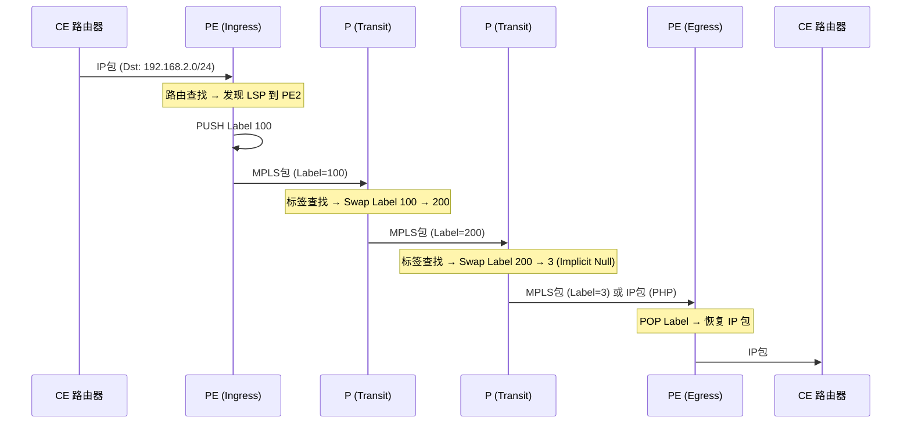
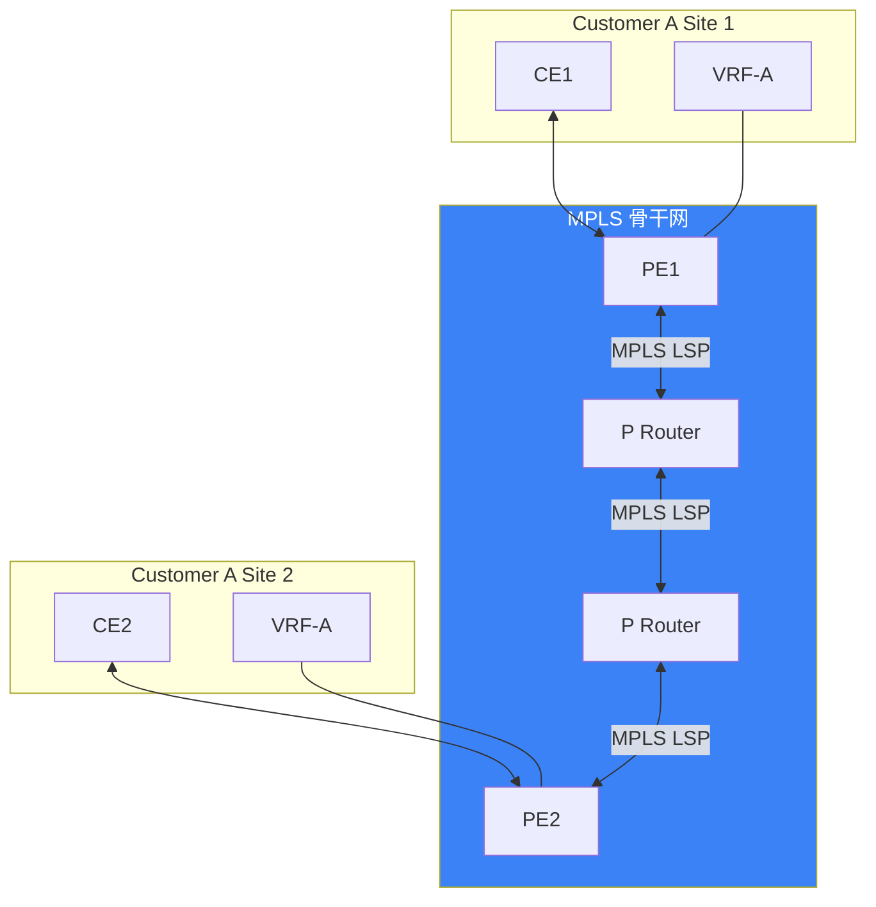

> [!info] VPN 技术深度探索系列
> 0. [[2026-04-13-vpn-deep-dive-series-index|全栈学习路径总览]]
> 1. [[2026-04-13-vpn-deep-dive-ch1-vpn-fundamentals|VPN 基础概念]]
> 2. [[2026-04-13-vpn-deep-dive-ch2-tunnel-basics|第二章：隧道技术基础]]
> 3. [[2026-04-13-vpn-deep-dive-ch3-crypto-fundamentals|第三章：密码学基础]]
> 4. [[2026-04-13-vpn-deep-dive-ch4-authentication|第四章：身份认证基础]]
> 5. [[2026-04-13-vpn-deep-dive-ch5-gre|第五章：GRE 通用路由封装]]
> 6. [[2026-04-13-vpn-deep-dive-ch6-ipip|SIT 隧道]]

---

## 1. 概述：MPLS 是什么

**MPLS (Multiprotocol Label Switching)** 是一种在 IP 网络中用**标签**替代最长前缀匹配进行转发的高速交换技术。与传统 IP 路由的"每跳查找目的地"不同，MPLS 在入口处打标签，中间节点只需基于标签交换。

MPLS 的核心价值：

| 特性 | 说明 |
|------|------|
| **高速转发** | 标签查找取代复杂路由表查找 |
| **TE (Traffic Engineering)** | 精确控制流量路径 |
| **VPN 构建块** | L3VPN (VRF) 和 L2VPN (VPLS) 的基础 |
| **多协议支持** | 支持 IPv4/IPv6/Ethernet/OSI 等 |

```mermaid
graph LR
    subgraph Traditional["传统 IP 路由"]
        T1["Router A"] -->|"查找路由表", T2["Router B"]
        T2 -->|"查找路由表", T3["Router C"]
        T3 -->|"查找路由表", T4["Router D"]
    end
    
    subgraph MPLS["MPLS 标签交换"]
        M1["入口 LSR"] -->|"打标签", M2["LSR B"]
        M2 -->|"标签交换", M3["LSR C"]
        M3 -->|"标签弹出", M4["出口 LSR"]
    end
    
    style MPLS fill:#3b82f6,color:#fff
```

---

## 2. MPLS 标签机制

### 2.1 MPLS 标签结构

MPLS 标签是插入在 Layer 2 和 Layer 3 之间的 **shim header**：

```
传统 Ethernet 帧：
┌───────────┬─────────────────────┬────────────────────────────────────┐
│ Ethernet  │     IP Header       │         Payload                    │
│  Header   │    (20-60 bytes)     │                                   │
└───────────┴─────────────────────┴────────────────────────────────────┘

MPLS 帧（Ethernet）：
┌───────────┬────────┬─────────────────────┬────────────────────────────────────┐
│ Ethernet  │ Label  │     IP Header       │         Payload                    │
│  Header   │(4B)   │    (20-60 bytes)     │                                   │
└───────────┴────────┴─────────────────────┴────────────────────────────────────┘
              ↑
         MPLS shim header
```

### 2.2 MPLS Label 格式（4 字节）

```
┌────────────────────────────────────┐
│  Label (20 bits)                   │
├────────────────────────────────────┤
│  EXP (3 bits)  - QoS/CoS           │
├────────────────────────────────────┤
│  Bottom of Stack (1 bit)           │
├────────────────────────────────────┤
│  TTL (8 bits)                     │
└────────────────────────────────────┘
```

| 字段 | 位 | 说明 |
|------|----|------|
| **Label** | 20 bits | 标签值 (0-2^20-1) |
| **EXP** | 3 bits | Experimental (QoS/CoS) |
| **BoS** | 1 bit | 1=栈底，0=更多标签 |
| **TTL** | 8 bits | 生存时间（防止环路） |

### 2.3 MPLS 标签的特殊值

| 标签值 | 名称 | 用途 |
|--------|------|------|
| 0-15 | 保留 | 特殊用途 |
| **0** | IPv4 Explicit Null | 保持 IPv4 QoS，通知弹出所有标签 |
| **1** | Router Alert Label | 包需要特殊处理（不常用） |
| **2** | IPv6 Explicit Null | 保持 IPv6 QoS |
| **3** | Implicit Null | 通知弹出标签（用于 PHP） |
| 4-15 | 保留 | 特殊用途 |
| 16+ | 动态 | 正常分配的标签 |

### 2.4 MPLS 转发操作

```bash
# MPLS 标签操作类型：

# 1. PUSH（压入）：入口 LSR 在数据包前添加标签
#    Input: IP包 → Output: MPLS包(Label=16)

# 2. SWAP（交换）：中间 LSR 替换顶层标签
#    Input: MPLS包(Label=16) → Output: MPLS包(Label=27)

# 3. POP（弹出）：出口 LSR 移除标签
#    Input: MPLS包(Label=3) → Output: IP包

# 4. PHP（Penultimate Hop Popping）：倒数第二跳弹出标签
#    出口 LSR 的前一跳发现 Label=3 (Implicit Null)
#    自动弹出，将 IP 包直接发给出口 LSR

# 标签转发表示例：
# R1 --(Label 16)--> R2 --(Label 27)--> R3 --(Label 3)--> R4
#                                                            ↓
#                                                      IP包（无标签）
```

---

## 3. MPLS 架构与组件

### 3.1 MPLS 路由器角色

```
Label Switch Router (LSR) - 所有 MPLS 路由器
├── 入口 LSR (Ingress LSR)     - 第一次打标签
├── 出口 LSR (Egress LSR)      - 最后一次弹标签
└── 中间 LSR (Transit LSR)     - 标签交换

Label Switching Path (LSP) - 一条完整的标签交换路径
R1(Ingress) → R2 → R3 → R4(Egress)
```

### 3.2 MPLS 转发过程



### 3.3 MPLS 与传统 IP 路由对比

| 维度 | 传统 IP 路由 | MPLS |
|------|-------------|------|
| **转发方式** | 最长前缀匹配 (LPM) | 标签查找 (O(1)) |
| **每跳行为** | 重新查找路由表 | 简单标签交换 |
| **路径控制** | 仅靠路由协议 | TE 可精确控制 |
| **VPN 支持** | 需要额外隧道 | 内置 VPN 能力 |
| **QoS** | DSCP/ToS | EXP 位 |
| **复杂度** | 低 | 高 |

---

## 4. 标签分发协议

### 4.1 LDP (Label Distribution Protocol)

**LDP** 是最常用的标签分发协议，用于在 MPLS 网络中自动分发标签：

```bash
# LDP 工作原理：
# 1. LSR 通过 IGP (OSPF/IS-IS) 获知路由
# 2. LDP 为每条路由分配标签
# 3. LDP 将 (路由, 标签) 映射分发给邻居
# 4. 建立 LSP

# LDP 消息类型：
# - Discovery (Hello)      : 发现邻居 (UDP 646)
# - Session                : 建立 TCP 连接 (TCP 646)
# - Advertisement          : 分发标签映射
# - Notification           : 通知错误

# LDP 标签分配方式：
# - DU (Downstream Unsolicited) : 主动分发（常用）
# - DoD (Demand on Demand)       : 按需分发
```

### 4.2 RSVP-TE (Resource Reservation Protocol)

**RSVP-TE** 是带流量工程扩展的 RSVP，用于建立**显式路径 LSP**：

```bash
# RSVP-TE vs LDP 的关键区别：
# LDP:   自动按 IGP 最短路径建立 LSP
# RSVP-TE: 可指定严格/宽松的显式路径 (ER-LSP)

# RSVP-TE 特点：
# - 带宽预留
# - 路径约束 (CSPF)
# - 快速故障恢复 (FRR)
# - 路径重优化

# 配置 Cisco RSVP-TE：
interface GigabitEthernet0/0
    ip rsvp bandwidth 100000  # 100Mbps 带宽预留
```

### 4.3 LDP vs RSVP-TE 对比

|| LDP | RSVP-TE |
|------|-----|---------|
| **标签分发** | 按需/主动 | 主动 |
| **路径控制** | 无（依赖 IGP） | 精确控制 (ER-LSP) |
| **带宽预留** | 无 | 支持 |
| **复杂度** | 低 | 高 |
| **收敛速度** | 较快 | 慢（需重路由） |
| **适用场景** | 普通 MPLS VPN | 运营商骨干 TE |

---

## 5. L3VPN (基于 VRF)

### 5.1 VRF 概念

**VRF (Virtual Routing and Forwarding)** 是 MPLS VPN 的核心——在同一台路由器上创建**多个隔离的路由表**：

```bash
# VRF 的核心思想：
# 没有 VRF: 所有路由 → Global RIB → 一张路由表
# 有 VRF:    每客户路由 → 独立 VRF RIB → 多个路由表

# 典型 VRF 配置 (Cisco IOS):
ip vrf CUSTOMER_A
    rd 65000:100              # Route Distinguisher
    route-target export 65000:100
    route-target import 65000:200

ip vrf CUSTOMER_B
    rd 65000:200
    route-target export 65000:200
    route-target import 65000:100

# 将接口绑定到 VRF
interface GigabitEthernet0/0
    ip vrf forwarding CUSTOMER_A
    ip address 10.0.0.1 255.255.255.0
```

### 5.2 VPNv4 路由与 Route Distinguisher

**RD (Route Distinguisher)** 用于区分不同 VRF 中的相同前缀：

```
无 RD 时的问题：
  Customer A: 192.168.1.0/24
  Customer B: 192.168.1.0/24  ← 无法区分！

有 RD 后：
  Customer A: 65000:100:192.168.1.0/24  ← RD 区分
  Customer B: 65000:200:192.168.1.0/24
```

**RD 格式**: `AS number:nn` 或 `IP address:nn`

### 5.3 Route Target (RT)

**RT (Route Target)** 控制 VRF 之间的路由导入/导出：

```bash
# RT 机制：
# 导出 (Export): 本地 VRF 路由 → 添加 RT 标记
# 导入 (Import): 收到路由 → 检查 RT → 匹配则加入 VRF

# 示例：
# Customer A 的两个站点
# Site 1 (VRF-A-Site1): 
#   RD = 65000:101
#   RT Export = 65000:100
#   RT Import = 65000:200

# Site 2 (VRF-A-Site2):
#   RD = 65000:102
#   RT Export = 65000:100
#   RT Import = 65000:200

# Site 1 的路由 10.1.0.0/16 携带 RT=65000:100
# Site 2 收到后，因为 Import 包含 65000:100，所以接受
```

### 5.4 MPLS L3VPN 架构



### 5.5 L3VPN 转发过程

```
CE1 → PE1：
  1. CE1 发送 IP 包到 PE1 (Dst: 192.168.2.0/24)
  2. PE1 查找 VRF-A 路由表
  3. 找到 VPNv4 路由 192.168.2.0/24 → 下一跳是 PE2
  4. PE1 查找到 PE2 的 LSP，打标签 (如 Label 500)
  5. PE1 发送 MPLS 包 (Outer Label=500) 到 P1

P1 → P2：
  1. P1 收到 MPLS 包 (Label=500)
  2. 标签交换 (Swap 500 → 600)
  3. P1 发送 MPLS 包 (Outer Label=600) 到 P2

P2 → PE2：
  1. P2 收到 MPLS 包 (Label=600)
  2. 标签交换 (Swap 600 → 3, 即 Implicit Null)
  3. P2 弹出标签，发送 IP 包到 PE2

PE2 → CE2：
  1. PE2 收到 IP 包
  2. 查找 VRF-A 路由表
  3. 转发到 CE2
```

---

## 6. L2VPN (VPLS)

### 6.1 VPLS 概述

**VPLS (Virtual Private LAN Service)** 是在 MPLS 网络上模拟**以太网桥接**的服务——不同站点的设备如同在同一 LAN 中：

```
传统 LAN：
┌─────────┐    ┌─────────┐
│  Switch │◄──►│  Switch │
└────┬────┘    └────┬────┘
     │              │
     ▼              ▼
┌─────────┐    ┌─────────┐
│   H1    │    │   H2    │
└─────────┘    └─────────┘

VPLS（跨地域）：
┌─────────┐                          ┌─────────┐
│   H1    │◄── MPLS 骨干网 (VPLS) ──►│   H2    │
└─────────┘                          └─────────┘

结果：H1 和 H2 在同一个广播域，像是连在同一台交换机上
```

### 6.2 VPLS vs L3VPN

|| VPLS | L3VPN |
|------|------|-------|
| **工作层** | L2 (Ethernet) | L3 (IP) |
| **学习方式** | MAC 学习 | VRF 路由 |
| **广播处理** |  flooding | 路由协议 |
| **适用场景** | 多站点 LAN 互联 | 多站点 IP 网络 |
| **配置复杂度** | 高 | 中 |
| **典型协议** | Kompella (LDP) / BGP | MP-BGP |

### 6.3 VPLS 封装

```
┌──────────────────────────────────────────────────────────┐
│  外层 MPLS Label(s)                                     │
├──────────────────────────────────────────────────────────┤
│  VPLS Control Word (4 bytes, 可选)                       │
├──────────────────────────────────────────────────────────┤
│  Ethernet 帧                                            │
│  ┌──────────┬──────────────────┬────────────────────┐   │
│  │Dst MAC   │   Src MAC        │   Type/Length     │   │
│  ├──────────┴──────────────────┴────────────────────┤   │
│  │   IP Packet (or other L3)                      │   │
│  └─────────────────────────────────────────────────┘   │
└──────────────────────────────────────────────────────────┘
```

### 6.4 VPLS 配置示例 (Cisco IOS)

```cisco
! VPLS 配置 (BGP-based Kompella)
l2vpn vfi context VPLS-A
    vpn id 100
    autodiscovery bgp
    signaling protocol bgp
    
    rd 65000:100
    route-target export 65000:100
    route-target import 65000:100
    
    ! PE 连接到 VPLS 的接口
    interface GigabitEthernet0/0
        no ip address
        xconnect vfi VPLS-A
```

---

## 7. MPLS VPN 配置示例

### 7.1 运营商骨干网配置

```bash
# Linux MPLS 支持（需要内核模块）
modprobe mpls_iptunnel
modprobe mpls_gso

# 查看 MPLS 支持
cat /proc/net/mpls/

# 华为 VRP 配置 MPLS L3VPN
mpls lsr-id 1.1.1.1
mpls

# 配置 LDP
mpls ldp
 interface GigabitEthernet0/0
```

### 7.2 PE 路由器 VRF 配置

```cisco
! Cisco IOS - PE 路由器配置

! 1. 创建 VRF
ip vrf CUSTOMER_A
    rd 65000:100
    route-target both 65000:100

! 2. 配置 PE-CE 路由协议（使用 OSPF）
router ospf 100 vrf CUSTOMER_A
    network 10.1.0.0 0.0.255.255 area 0

! 3. 配置 MP-BGP 与其他 PE 交换 VPNv4
router bgp 65000
    neighbor 192.168.1.2 remote-as 65000
    
    address-family vpnv4
        neighbor 192.168.1.2 activate
        neighbor 192.168.1.2 send-community extended
```

### 7.3 Linux MPLS GRE 隧道

```bash
# Linux 可以用 ip mpls 命令配置 MPLS 隧道
# 但实际运营商网络通常使用专用路由器

# 创建 MPLS 隧道（基于 GRE）
ip tunnel add mpls-gre0 mode gre \
    local 203.0.113.10 \
    remote 198.51.100.20 \
    key 0x12345678

# 设置 MPLS 封装
ip link set mpls-gre0 mpls on

# 添加静态 MPLS 路由
ip -mroute add 192.168.2.0/24 dev mpls-gre0 via 198.51.100.20
```

---

## 8. MPLS QoS 与 Traffic Engineering

### 8.1 MPLS EXP 位

MPLS 的 EXP 位 (3 bits) 用于 QoS 标记：

```bash
# EXP 位映射到服务等级
EXP=7  # Network Control (最高优先级)
EXP=6  # Internetwork Control
EXP=5  # EF (Expedited Forwarding, VoIP)
EXP=4  # AF43 (High Priority)
EXP=3  # AF33
EXP=2  # AF23
EXP=1  # AF13
EXP=0  # Best Effort (默认)

# Cisco 配置 EXP 映射
mpls traffic-eng tunnels
class-map match-all EF
    match dscp ef
policy-map SET-EXP
    class EF
        set mpls experimental imposition 5
```

### 8.2 MPLS TE 路径约束

```
RSVP-TE CSPF 计算考虑：
1. 带宽约束
2. 亲和属性 (Attribute Flags)
3. 跳数约束
4. 显式路径 (Strict/Loose)

建立 TE LSP：
1. 入口 LSR 计算路径 (CSPF)
2. 发送 RSVP PATH 消息
3. 中间 LSR 资源预留
4. 出口 LSR 返回 RSVP RESV
5. LSP 建立完成
```

---

## 9. MPLS 故障排除

### 9.1 常见问题

| 问题 | 原因 | 排查 |
|------|------|------|
| LSP 不建立 | IGP 不通 | 检查 OSPF/IS-IS |
| 标签未分发 | LDP 会话失败 | 检查 TCP 646 连通性 |
| VRF 不通 | RT 不匹配 | 检查 import/export RT |
| MPLS 转发失败 | 标签栈错误 | 抓包分析标签 |
| VPLS 不通 | MAC 学习失败 | 检查 STP/Pseudo-wire |

### 9.2 排错命令

```bash
# Cisco MPLS 排错
show mpls ldp neighbor        # LDP 邻居
show mpls ldp bindings        # 标签数据库
show mpls forwarding-table    # LFIB
show mpls traffic-eng tunnels # TE LSP
show vrf                      # VRF 列表
show ip bgp vpnv4 all        # VPNv4 路由

# Linux MPLS 排错
ip -m route show              # MPLS 路由表
cat /proc/net/mpls/           # MPLS 内核表
tcpdump -i eth0 -v MPLS       # MPLS 抓包
```

---

## 10. MPLS 与 IPSec/GRE 配合

### 10.1 MPLS over IPSec

运营商骨干网使用 IPSec 保护 MPLS 流量：

```
包结构：
┌──────────────────────────────────────────────────────┐
│  外层 IP Header (ESP)                                │
├──────────────────────────────────────────────────────┤
│  ESP Header                                          │
├──────────────────────────────────────────────────────┤
│  内层 MPLS Label(s)                                  │
├──────────────────────────────────────────────────────┤
│  Ethernet + IP + Payload                             │
├──────────────────────────────────────────────────────┤
│  ESP Trailer + ICV                                   │
└──────────────────────────────────────────────────────┘
```

### 10.2 MPLS GRE 组合

在 MPLS VPN 上使用 GRE 承载客户协议：

```bash
# 场景：客户需要运行 OSPF between sites
# MPLS VPN 天然支持 IP，但不能直接支持某些协议
# GRE 可以在 MPLS 上封装任意协议

# 封装层次：
# 1. 内层：客户数据包
# 2. GRE：封装客户协议
# 3. MPLS：VPN 转发
# 4. IPSec：可选加密
```

---

## 11. 总结

|| MPLS VPN 关键知识点 |
|---|---|
| **MPLS 定位** | L2.5 层高速转发，基于标签交换 |
| **标签格式** | 4 字节 (Label 20b + EXP 3b + BoS 1b + TTL 8b) |
| **标签操作** | PUSH / SWAP / POP / PHP |
| **LDP** | 标签分发协议，自动建立 LSP |
| **RSVP-TE** | 带 TE 的标签分发，精确路径控制 |
| **L3VPN** | 基于 VRF + MP-BGP，客户 IP 路由隔离 |
| **L2VPN** | 基于 VPLS，客户 Ethernet 桥接 |
| **RD/RT** | RD 区分路由，RT 控制导入/导出 |
| **MPLS 开销** | 4 字节/标签（可多层叠加） |

**下一章预告：** [[2026-04-13-vpn-deep-dive-ch8-vxlan-tunnel|VXLAN 覆盖网络]] — VXLAN 封装、VNI、VTEP、组播/unicast 转发。

---

> [!quote] 参考文献
> - RFC 3031 - Multiprotocol Label Switching Architecture
> - RFC 3032 - MPLS Label Stack Encoding
> - RFC 4364 - BGP/MPLS IP Virtual Private Networks (L3VPN)
> - RFC 4761 - Virtual Private LAN Service (VPLS) Using BGP
> - RFC 4762 - VPLS Using LDP Signaling
> - RFC 3209 - RSVP-TE: Extensions to RSVP for LSP Tunnels
