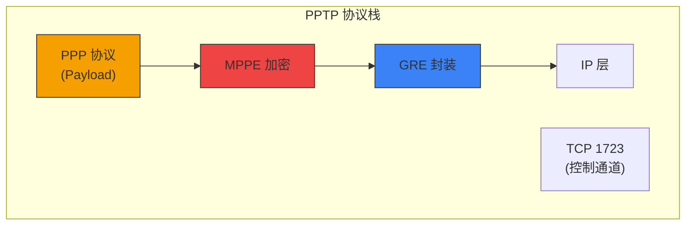
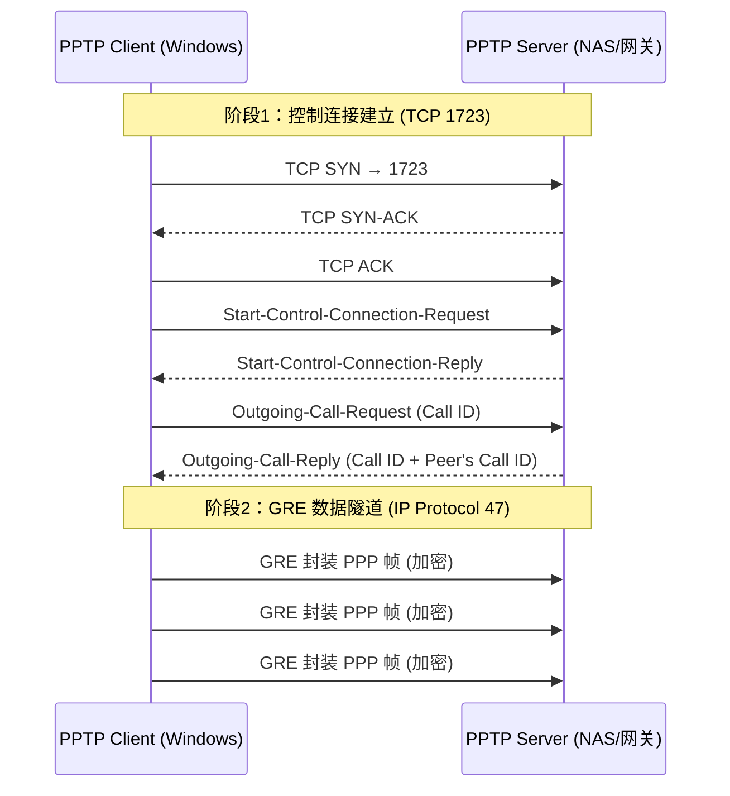
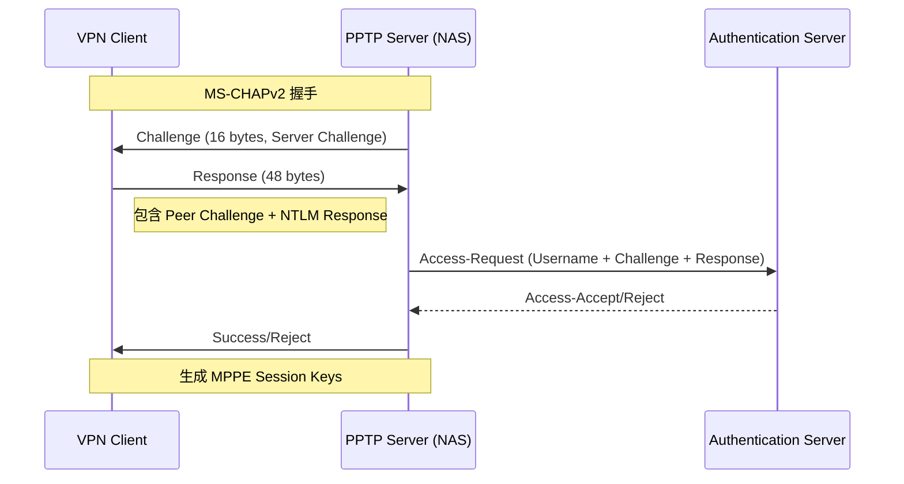

> [!info] VPN 技术深度探索系列 0. [[2026-04-13-vpn-deep-dive-series-index|全栈学习路径总览]]
>
> 1. [[2026-04-13-vpn-deep-dive-ch1-vpn-fundamentals|VPN 基础概念]]
> 2. [[2026-04-13-vpn-deep-dive-ch2-tunnel-basics|第二章：隧道技术基础]]
> 3. [[2026-04-13-vpn-deep-dive-ch3-crypto-fundamentals|第三章：密码学基础]]
> 4. [[2026-04-13-vpn-deep-dive-ch4-authentication|第四章：身份认证基础]]
> 5. [[2026-04-13-vpn-deep-dive-ch5-gre|第五章：GRE 通用路由封装]]
> 6. [[2026-04-13-vpn-deep-dive-ch6-ipip|SIT 隧道]]
> 7. [[2026-04-13-vpn-deep-dive-ch7-mpls-vpn|MPLS VPN]]
> 8. [[2026-04-13-vpn-deep-dive-ch8-vxlan-tunnel|VXLAN 覆盖网络]]

---

## 1. 概述：PPTP 的历史地位

**PPTP (Point-to-Point Tunneling Protocol)** 是最早广泛部署的 VPN 协议之一，由 Microsoft 主导，于 1999 年在 RFC 2637 中正式定义。它通过 **GRE (Generic Routing Encapsulation)** 封装 PPP 帧，并依赖 **MPPE (Microsoft Point-to-Point Encryption)** 提供加密。



|              | 属性                   | 值      |
| ------------ | ---------------------- | ------- |
| **RFC**      | RFC 2637               | 1999 年 |
| **主导厂商** | Microsoft              |         |
| **隧道协议** | GRE (IP Protocol 47)   |         |
| **控制通道** | TCP 1723               |         |
| **加密**     | MPPE (40-128bit)       |         |
| **认证**     | MS-CHAPv1/v2, PAP, EAP |         |
| **工作层**   | L2 (PPP) → L3 (GRE)    |         |
| **NAT 兼容** | 差（GRE 穿透问题）     |         |

**PPTP 的历史贡献**：它是第一个将隧道协议与加密绑定的主流商业 VPN 方案，在 2000 年代初广泛部署于 Windows RAS (Remote Access Service) 环境。

---

## 2. PPTP 协议架构

### 2.1 隧道建立的两个阶段

PPTP 的隧道建立分为 **控制连接** 和 **数据隧道** 两个独立阶段：



### 2.2 控制连接 (Control Connection)

控制连接基于 **TCP 1723**，负责建立、维护和拆除隧道。它携带 PPTP 消息（ICRP、ICCN、CDN 等），这些消息是明文传输的。

```bash
# PPTP 控制消息类型
PPTP_MESSAGE_TYPE = {
    1:   "Start-Control-Connection-Request",   # 发起连接
    2:   "Start-Control-Connection-Reply",     # 响应
    3:   "Stop-Control-Connection-Request",    # 关闭连接
    4:   "Stop-Control-Connection-Reply",     # 关闭响应
    5:   "Echo-Request",                        # 存活检测
    6:   "Echo-Reply",                          # 存活响应
    7:   "Outgoing-Call-Request",               # 发起呼叫
    8:   "Outgoing-Call-Reply",                 # 呼叫响应
    9:   "Incoming-Call-Request",              # 接收呼叫
    10:  "Incoming-Call-Reply",                 # 接收响应
    11:  "Incoming-Call-Connected",            # 呼叫已连接
    12:  "Call-Clear-Request",                  # 清除呼叫
    13:  "Call-Disconnect-Notify",              # 断开通知
}
```

### 2.3 GRE 隧道封装

PPTP 的数据平面使用 **Enhanced GRE (PPTP-specific GRE)** 封装 PPP 帧：

```
PPTP GRE 头部格式：
┌────────────────────────────────────────────────────────────┐
│  0 | 1 |  2  |  3  |  4  | 5 | 6 | 7 |  8-15  |  16-31   │
│  C | R | K |  S  |  s  |  Recur |  Flags |   Offset     │
├────────────────────────────────────────────────────────────┤
│                     Call ID (16 bits)                      │
├────────────────────────────────────────────────────────────┤
│                   Sequence Number (32 bits)                 │
│                   (Optional, K=1)                           │
├────────────────────────────────────────────────────────────┤
│                   Acknowledgment Number                    │
│                   (Optional, R=1)                           │
└────────────────────────────────────────────────────────────┘

C = Checksum Present (0 or 1)
R = Routing Present (0)
K = Key Present (1 = 加密)
S = Sequence Number Present (1)
s = Reserved (0)
Recur = Recursion Control (0)
```

| 字段     | 位  | 说明                              |
| -------- | --- | --------------------------------- |
| C        | 1   | 校验和是否存在                    |
| K        | 1   | Key 字段存在（PPTP 固定为 1）     |
| S        | 1   | 序列号是否存在                    |
| Call ID  | 16  | 标识会话的唯一 ID（由服务器分配） |
| Sequence | 32  | 包序列号（用于顺序保证）          |
| Ack      | 32  | 确认号（用于可靠性）              |

### 2.4 完整封装层次

```bash
# PPTP 完整封装（从内到外）
┌─────────────────────────────────────────────────────────────────┐
│  外层 IP Header                                                 │
│    Src: 203.0.113.10 (Client)                                   │
│    Dst: 198.51.100.50 (Server)                                 │
├─────────────────────────────────────────────────────────────────┤
│  GRE Header (IP Protocol 47)                                   │
│    C=0, K=1, S=1, Call ID=0x1234                               │
├─────────────────────────────────────────────────────────────────┤
│  PPP Header                                                     │
│    Protocol: 0x0021 (IP Datagram)                              │
├─────────────────────────────────────────────────────────────────┤
│  PPP Payload (加密后的 IP 包)                                  │
│    MPPE 加密 + MPPE Header                                     │
├─────────────────────────────────────────────────────────────────┤
│  Inner IP Header (原始数据包)                                   │
│    Src: 10.0.0.5 (VPN 客户端内网 IP)                           │
│    Dst: 10.0.1.100 (内网服务器)                                 │
├─────────────────────────────────────────────────────────────────┤
│  TCP/UDP/ICMP ...                                               │
└─────────────────────────────────────────────────────────────────┘
```

---

## 3. MPPE 加密

### 3.1 MPPE 工作原理

**MPPE (Microsoft Point-to-Point Encryption)** 是 PPTP 的加密协议，嵌入在 PPP 协议层和 GRE 隧道之间：

```bash
# MPPE 加密流程
┌────────────┐    PPP Encapsulation     ┌──────────────┐    GRE 封装    ┌─────────┐
│ 原始 IP 包 │ ──────────────────────► │ PPP Protocol  │ ─────────────► │ GRE     │
│ (1500B)    │                          │ (0x0021)      │                │         │
└────────────┘                          └────────────────┘                └─────────┘
                                              │
                                              │ MPPE 加密
                                              ▼
                                       ┌────────────────┐
                                       │ MPPE Header    │  ← Stateless 或 Stateful
                                       │ + Encrypted    │
                                       │ Payload        │
                                       │ + MPPE CheckSum│
                                       └────────────────┘
```

### 3.2 MPPE 密钥派生

MPPE 密钥从 **MS-CHAPv1/v2** 握手过程中派生：

```bash
# MS-CHAPv2 密钥派生过程

# 1. 用户密码 → NTLM Hash
PasswordHash = NTLM(password)

# 2. NTLM Hash → MasterKey (52 字节，MPPE-40/56/128)
MasterKey = NTLM(password)  # 经过 PBKDF 等处理

# 3. MasterKey → MPPE Session Keys
# Stateful 模式：每发送 8KB 数据更新密钥
# Stateless 模式：每个包都派生新密钥
```

### 3.3 MPPE 算法对比

| 算法         | 密钥长度 | 状态 | 安全性 | 备注                     |
| ------------ | -------- | ---- | ------ | ------------------------ |
| MPPE 40-bit  | 40 bits  | 禁用 | 极弱   | 出口限制版本（美国以外） |
| MPPE 56-bit  | 56 bits  | 禁用 | 弱     | 曾经美国国内使用         |
| MPPE 128-bit | 128 bits | 可用 | 中等   | RC4 + 初始向量，易受攻击 |

```bash
# MPPE 加密选项（pptpd.conf 示例）
# 选项含义：
# 40  - MPPE 40-bit (出口版)
# 56  - MPPE 56-bit
# 128 - MPPE 128-bit
# stateful - 每包更新密钥（更安全）
# stateless - 每 8KB 更新密钥

# /etc/pptpd.conf
option /etc/ppp/pptpd-options
listen 0.0.0.0

# /etc/ppp/pptpd-options
encrypt                 # 启用 MPPE
require-mschap-v2      # 要求 MS-CHAPv2 认证
mppe required,stateless  # 必须使用 128-bit + Stateful 模式
```

---

## 4. 认证机制

### 4.1 MS-CHAPv2 握手过程

PPTP 通常使用 **MS-CHAPv2 (Microsoft CHAP v2)** 认证，是 CHAP 协议的 Microsoft 扩展：



### 4.2 MS-CHAPv2 细节

```bash
# MS-CHAPv2 握手包结构

# Server → Client: Challenge
# 16 bytes 随机数
Challenge_S = RandomBytes(16)

# Client → Server: Response
# 构建方法：
# 1. 生成 Peer Challenge (16 bytes)
# 2. 计算 Authenticator Challenge = SHA1(PeerChallenge + ServerChallenge + Username)
# 3. 计算 NTLM Response = NTLM_Response(AuthenticatorChallenge, Password)
# 4. 构造 Response 包：PeerChallenge + Reserved + NTLM Response + Flags

# Response 包结构 (48 bytes)：
# +0  16: Peer Challenge
# +16  8: Reserved
# +24 24: NTLM Response
# +48  0: (end)

# 成功响应后，双方派生 MPPE 密钥：
# Send Key = NTLM2SessionKey(SessionKey, 'pad')[:16]
# Recv Key = NTLM2SessionKey(SessionKey, 'pad')[16:32]
```

---

## 5. PPTP 安全漏洞

PPTP 存在大量严重安全漏洞，已被业界认定为**不安全协议**：

### 5.1 主要漏洞

```bash
# 漏洞 1: MS-CHAPv2 离线字典攻击
# 问题：MS-CHAPv2 握手可被离线暴力破解
# 影响：攻击者获取 VPN 密码 → 解密所有历史会话
# 工具：chapcrack, thc-pptp-cracker

# 漏洞 2: MPPE RC4 初始化向量重用
# 问题：RC4 密钥流重用导致密文可预测
# 影响：可恢复明文、注入恶意内容
# 根源：MPPE 使用 " Stateless" 模式，8KB 同一密钥

# 漏洞 校 3: GRE 头无完整性校验
# 问题：GRE 封装可被篡改（无 HMAC）
# 影响：流量注入攻击

# 漏洞 4: Control Channel 明文传输
# 问题：PPTP 控制消息（TCP 1723）未加密
# 影响：可收集隧道元信息（Call ID、IP）

# 漏洞 5: NAT 穿透问题
# 问题：GRE (IP Protocol 47) 在某些 NAT 环境下无法工作
# 影响：客户端在 NAT 后面无法建立 PPTP 隧道
```

### 5.2 漏洞时间线

| 年份 | 事件                   | 影响                                                        |
| ---- | ---------------------- | ----------------------------------------------------------- |
| 1998 | RC4 已知弱点被公开     | MPPE 加密可被攻击                                           |
| 2012 | MS-CHAPv2 被完全破解   | https://cloudcracker.com/blog/2012/7/23/cracking-ms-chap-v2 |
| 2012 | DEF CON 演示 chapcrack | 实时破解 MS-CHAPv2 认证                                     |
| 2019 | 进一步优化攻击         | 利用 TPM/硬件安全模块缓解                                   |

### 5.3 安全建议

> [!danger]
> **PPTP 已被公认为不安全协议。** 2019 年起，Microsoft 建议禁用 PPTP，所有已知实现均有严重漏洞。

**替代方案：**

| 协议           | 安全性 | 说明                    |
| -------------- | ------ | ----------------------- |
| **IPSec**      | 高     | ESP + AES-GCM，企业标准 |
| **OpenVPN**    | 高     | TLS 隧道，AES-256       |
| **WireGuard**  | 高     | 现代协议，ChaCha20      |
| **L2TP/IPSec** | 中高   | L2TP + IPSec 加密       |

---

## 6. 典型配置

### 6.1 Windows Server NPS/RAS 配置

```powershell
# Windows Server: 启用 PPTP VPN
# 1. 安装 Routing and Remote Access (RRAS)

# 2. 配置 PPTP 端口
netsh routing ip show config

# 3. 设置 PPTP 加密级别
# PowerShell: Set-VpnServerConfiguration
Set-VpnServerConfiguration `
    -TunnelType Pptp `
    -EncryptionLevel Required `
    -RejectMd5 $false `
    -RejectUnencrypted $false

# 4. 配置 MS-CHAPv2 认证（通过 NPS/RADIUS）
# NPS 策略：要求 MS-CHAPv2，使用 AD 账户验证
```

### 6.2 Linux PoPToP (pptpd) 配置

```bash
# /etc/pptpd.conf
option /etc/ppp/pptpd-options
# 本地 IP 地址（VPN 网关）
localip 10.10.0.1
# 远程客户端 IP 池
remoteip 10.10.0.100-200

# /etc/ppp/pptpd-options
name pptpd
refuse-pap
require-mschap-v2
# 启用 MPPE 128-bit 加密
mppe required,stateless

# 启用 PPTP 转发
# /etc/sysctl.conf
net.ipv4.ip_forward = 1

# iptables 规则
iptables -t nat -A POSTROUTING -s 10.10.0.0/24 -o eth0 -j MASQUERADE
```

### 6.3 Windows 客户端连接

```bash
# Windows 内置 PPTP 客户端配置
# 控制面板 → 网络和共享中心 → 设置新的连接或网络

# PowerShell 创建 VPN 连接
Add-VpnConnection `
    -Name "Corporate VPN" `
    -ServerAddress "vpn.company.com" `
    -TunnelType Pptp `
    -AuthenticationMethod MsChapv2 `
    -EncryptionLevel Required `
    -RememberCredential $true

# 查看连接状态
rasdial "Corporate VPN" username password
```

---

## 7. PPTP 数据包捕获分析

### 7.1 识别 PPTP 流量

```bash
# Wireshark 过滤 PPTP

# 控制通道（TCP 1723）
tcp.port == 1723

# GRE 封装（IP Protocol 47）
ip.proto == 47

# PPTP 控制消息
pptp.msgtype == 1          # Start-Control-Connection-Request
pptp.call_id               # Call ID 字段

# GRE + PPP 组合
ip.proto == 47 && ppp.addr == 0xff  # PPP 寻址（填充）
```

### 7.2 抓包示例

```bash
# tcpdump 捕获 PPTP 流量
# 1. 捕获控制通道
tcpdump -i eth0 'tcp port 1723' -nnvv

# 2. 捕获 GRE 数据隧道
tcpdump -i eth0 'ip proto 47' -nnvv

# 3. 完整捕获（两种）
tcpdump -i eth0 '(tcp port 1723) or (ip proto 47)' -nnvv
```

```
# Wireshark 显示过滤器
# PPTP 控制连接
pptp

# 完整 PPTP 解析（显示 Call ID、序列号）
pppdemo.pptp

# GRE Call ID 过滤
pptp.call_id == 0x1234
```

---

## 8. 性能特性

| 指标         | 数值                                      | 说明           |
| ------------ | ----------------------------------------- | -------------- |
| **MTU**      | 1500 - 40 (IP) - 8 (GRE) - 4 (PPP) = 1448 | 额外头部开销   |
| **吞吐量**   | ~100 Mbps (RC4 软加密)                    | CPU 成为瓶颈   |
| **延迟**     | 低（无额外压缩开销）                      | GRE 直接封装   |
| **CPU 开销** | 中等                                      | RC4 软加密     |
| **并发连接** | 受限                                      | GRE 无多路复用 |

```bash
# PPTP MTU 问题
# 原始 MTU: 1500B
# PPTP 封装后：
#   IP (20) + GRE (8-16) + PPP (4) + MPPE (4-12) = 36-52 bytes 开销
#   结果: ~1448-1464B 最大包

# Path MTU Discovery 在 PPTP 中经常失效
# 导致 ICMP "Fragmentation needed" 被阻断 → 大包丢弃

# 解决方案：
# 客户端设置 MTU = 1400
# 或使用 MSS Clamping (TCP MSS 1350)
```

---

## 9. 总结

| 维度         | 结论                                     |
| ------------ | ---------------------------------------- |
| **协议定位** | 早期 VPN 协议，PPP over GRE              |
| **历史地位** | 1999 年 RFC，Microsoft Windows 默认 VPN  |
| **安全性**   | 已淘汰——MS-CHAPv2 + MPPE 存在严重漏洞    |
| **加密强度** | RC4 40/56/128-bit，易受攻击              |
| **NAT 穿透** | 差（GRE 协议问题）                       |
| **当前状态** | 不推荐使用，被 IPSec/L2TP/WireGuard 取代 |

**下一章预告：** [[2026-04-13-vpn-deep-dive-ch10-l2tp|L2TP 第二层隧道协议]] — L2TP 控制消息、会话建立、LAC/LNS 架构、与 IPSec 的配合。

---

> [!quote] 参考文献
>
> - RFC 2637 - Point-to-Point Tunneling Protocol (PPTP)
> - [[2026-04-13-vpn-deep-dive-ch5-gre|GRE 隧道 (本系列)]] — PPTP 的 GRE 封装基础
> - [[2026-04-13-vpn-deep-dive-ch3-crypto-fundamentals|密码学基础 (本系列)]] — RC4/MPPE 加密分析
> - Microsoft RRAS Documentation — Windows Server PPTP 配置
