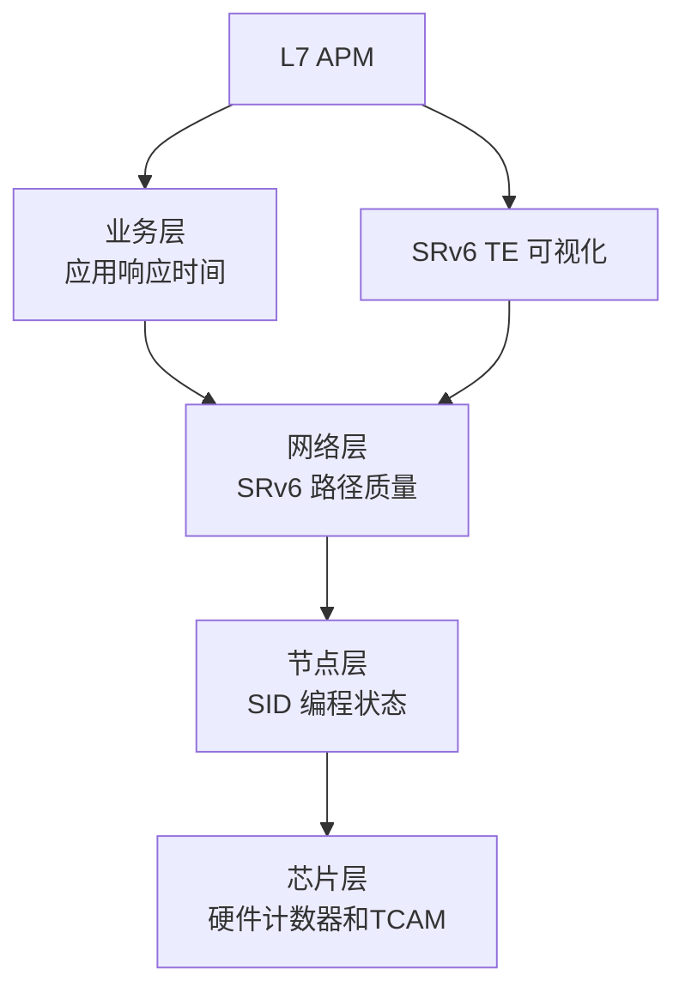
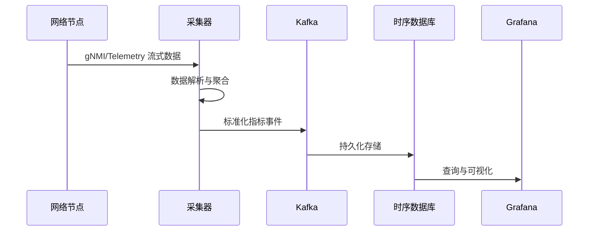
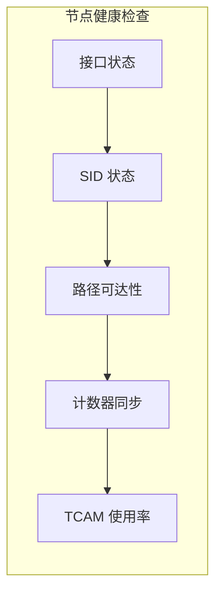
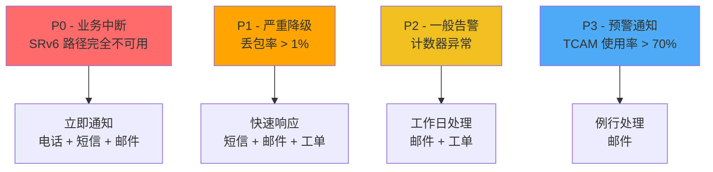
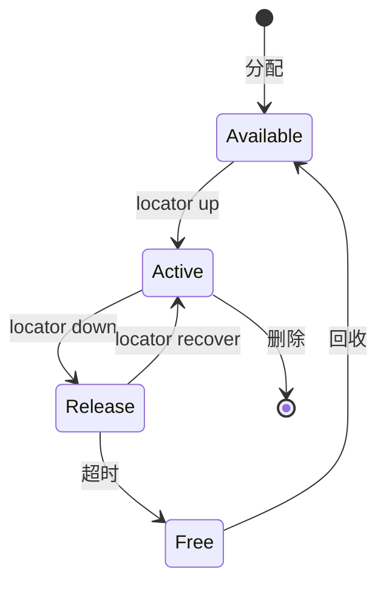
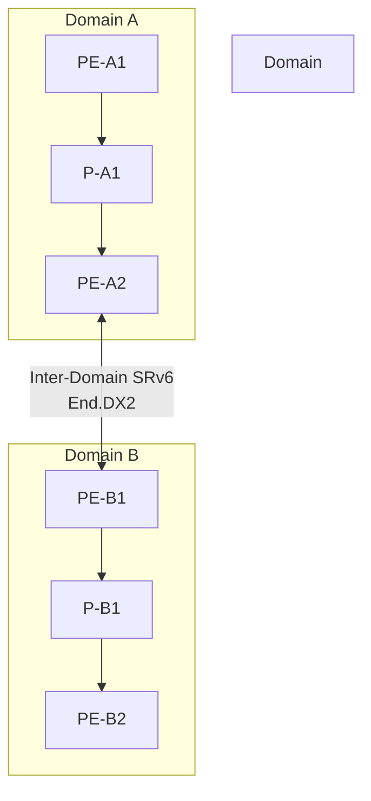
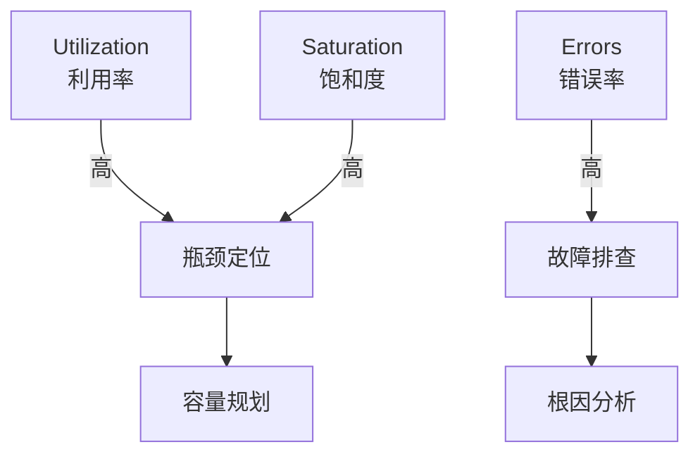

> [!info] SRv6 2026 深度探索系列 0. [[2026-04-14-srv6-comprehensive-learning-roadmap|SRv6 全栈学习路径总览]]
>
> 1. [[2026-04-14-srv6-deep-dive-ch1-fundamentals|SRv6 基础：路由与Segment机制]]
> 2. [[2026-04-14-srv6-deep-dive-ch2-sid|SRv6 SID 结构与部署模式]]
> 3. [[2026-04-14-srv6-deep-dive-ch3-traffic-engineering|SRv6 流量工程基础]]
>    ...
> 4. [[2026-04-14-srv6-deep-dive-ch27-advanced-security|SRv6 高级安全架构]]
>    **28. 第二八章：运营概述与监控体系**
> 5. [[2026-04-14-srv6-deep-dive-ch29-troubleshooting|第二九章：故障诊断与排错实战]]
> 6. [[2026-04-14-srv6-deep-dive-ch30-te-operations|第三十章：流量工程运营实战]]
> 7. [[2026-04-14-srv6-deep-dive-ch31-security-operations|第三一章：安全运营与攻击防御]]
> 8. [[2026-04-14-srv6-deep-dive-ch32-deployment-migration|第三二章：部署与迁移运营]]

---

## 1. 概述：SRv6 运营的核心挑战

SRv6（Segment Routing over IPv6）作为新一代网络协议，将 Segment Routing 的控制平面与 IPv6 的数据平面深度融合。其运营复杂度远超传统 MPLS SR-TE，原因在于：

1. **128位 SID 地址空间**：可编程性极强，但可观测性数据量倍增
2. **多层嵌套的 Segment 栈**：路径行为需要端到端追踪
3. **ICV/TCM 计数器的复杂性**：多种计数器类型需要统一管理
4. **与 IPv6 Extension Header 的交互**：包转发路径分析更复杂

本章聚焦 SRv6 运营的**监控体系设计**与**日常运维最佳实践**。

---

## 2. SRv6 运营监控体系架构

### 2.1 监控金字塔模型



| 层级   | 监控指标                        | 采集频率 | 工具链               |
| :----- | :------------------------------ | :------- | :------------------- |
| 业务层 | 应用延迟、丢包率、SLA达标率     | 秒级     | Prometheus + Grafana |
| 网络层 | SRv6 路径跳数、包丢失、延迟抖动 | 秒级     | Telegraf + InfluxDB  |
| 节点层 | SID 活跃度、Segment 栈深度      | 分钟级   | SNMP / gNMI          |
| 芯片层 | HW 计数器、TCAM 使用率          | 分钟级   | 厂商 SDK             |

### 2.2 数据采集架构



---

## 3. 关键运营指标 (KPI) 体系

### 3.1 SRv6 路径质量指标

```bash
# 使用 ssxnmp 或 gNMI 查询 SRv6 路径统计
# Cisco IOS-XR 示例
show segment-routing srv6 sid
show segment-routing srv6 traffic-eng policy
show segment-routing srv6 segment-list
```

| 指标           | 公式                                   | 告警阈值 | 严重级别 |
| :------------- | :------------------------------------- | :------- | :------- |
| SRv6 包丢失率  | `lost_packets / total_packets * 100`   | > 0.1%   | Critical |
| 端到端延迟     | `ingress_timestamp - egress_timestamp` | > 50ms   | Warning  |
| SID 活跃率     | `active_sids / total_sids * 100`       | < 95%    | Warning  |
| Segment 栈深度 | max_stack_depth                        | > 8 层   | Warning  |
| ICV 计数误差   | `hw_count - sw_count`                  | > 1%     | Warning  |

### 3.2 节点级运营指标

```bash
# Juniper Junos 示例
show srv6 sid database
show srv6 interface
show srv6 neighbors
```



**核心检查项：**

- **接口 IPv6 状态**：链路本地地址是否正常
- **SID 分配状态**：`Active / Release / Free` 三态转换
- **邻接关系**：L2 / L3 邻居是否稳定
- **计数器同步**：软件计数器与硬件计数器偏差

---

## 4. SRv6 监控数据模型

### 4.1 YANG 模型与 gNMI

SRv6 配置与状态使用 `ietf-srv6@2022` YANG 模型：

```yang
container srv6 {
    container global {
        leaf locator-block {
            type inet:ipv6-prefix;
        }
        leaf locator-length {
            type uint8;
        }
    }

    list locator {
        key "name";
        leaf name { type string; }
        leaf prefix { type inet:ipv6-prefix; }

        list sid {
            key "sid";
            leaf sid { type inet:ipv6-address; }
            leaf state { type enumeration; }
            leaf operation { type string; }
        }
    }

    list policy {
        key "name";
        leaf name { type string; }
        leaf color { type uint32; }
        leaf endpoint { type inet:ipv6-address; }

        list candidate-path {
            key "preference";
            leaf preference { type uint32; }
            leaf path-id { type uint32; }
            leaf protocol-origin { type string; }
        }
    }
}
```

### 4.2 Prometheus 指标导出

使用 `srv6_exporter` 将指标导出为 Prometheus 格式：

```bash
# srv6_exporter 配置
cat > /etc/srv6_exporter.yml << 'EOF'
targets:
  - device: router-a
    transport: gNMI
    credentials: /etc/gnmi_cert.json
    yang_models:
      - ietf-srv6@2022
  - device: router-b
    transport: gNMI
    credentials: /etc/gnmi_cert.json

metrics:
  - name: srv6_sid_state
    type: gauge
    labels: [device, locator, sid, state]
  - name: srv6_policy_traffic
    type: counter
    labels: [device, policy, color, endpoint]
  - name: srv6_segment_stack_depth
    type: gauge
    labels: [device, interface]
EOF
```

**关键 Prometheus 指标：**

| 指标名                              | 类型    | 说明                            |
| :---------------------------------- | :------ | :------------------------------ |
| `srv6_sid_state`                    | Gauge   | SID 状态 (1=Active, 0=Inactive) |
| `srv6_policy_traffic_packets_total` | Counter | SRv6 策略包数                   |
| `srv6_policy_traffic_bytes_total`   | Counter | SRv6 策略字节数                 |
| `srv6_hardware_counter_sync_errors` | Counter | HW/SW 计数器同步错误            |
| `srv6_locator_prefix_allocated`     | Gauge   | locator 前缀分配数              |

---

## 5. 告警策略设计

### 5.1 告警分级模型



### 5.2 告警规则示例 (Prometheus AlertManager)

```yaml
# alert_rules.yml
groups:
  - name: srv6_operations
    rules:
      - alert: SRv6PathDown
        expr: avg(srv6_path_up{policy_name=~".*"}) by (policy_name) == 0
        for: 1m
        labels:
          severity: critical
        annotations:
          summary: "SRv6 路径 {{ $labels.policy_name }} 不可用"

      - alert: SRv6HighPacketLoss
        expr: rate(srv6_packets_dropped_total[5m]) / rate(srv6_packets_total[5m]) > 0.01
        for: 5m
        labels:
          severity: warning
        annotations:
          summary: "SRv6 丢包率超过 1%"

      - alert: SRv6CounterDesync
        expr: abs(srv6_hw_counter - srv6_sw_counter) / srv6_sw_counter > 0.01
        for: 10m
        labels:
          severity: warning
        annotations:
          summary: "SRv6 计数器失步超过 1%"
```

---

## 6. 可视化大盘设计

### 6.1 SRv6 运营中心大盘

```
┌─────────────────────────────────────────────────────────────────────┐
│                     SRv6 运营中心 - {{ .Time }}                       │
├─────────────────────────────────────────────────────────────────────┤
│                                                                      │
│  [路径状态]           [SID 活跃度]        [流量趋势]                  │
│  ┌─────────┐         ┌─────────┐         ┌─────────────┐             │
│  │ 98.5%   │         │ 1,234   │         │    ╱╲      │             │
│  │ 可用率  │         │ 活跃SID │         │   ╱  ╲     │             │
│  └─────────┘         └─────────┘         │  ╱    ╲    │             │
│                                           └─────────────┘             │
│  [设备地图]                                                        │
│  ┌──────────────────────────────────────────────────────────────┐   │
│  │  ●──●──●──●──●──●──●                                         │   │
│  │  A   B   C   D   E   F   (节点状态: 全部正常)                  │   │
│  └──────────────────────────────────────────────────────────────┘   │
│                                                                      │
│  [告警面板]                      [流量工程]                           │
│  ┌─────────────────────┐        ┌─────────────────────────────┐     │
│  │ P0: 0  P1: 2  P2: 5  │        │ Policy-1:  ═══════ 45%      │     │
│  │ P3: 12              │        │ Policy-2:  ═══════ 30%      │     │
│  └─────────────────────┘        │ Policy-3:  ═══      15%      │     │
│                                  └─────────────────────────────┘     │
└─────────────────────────────────────────────────────────────────────┘
```

### 6.2 SID 生命周期状态机



---

## 7. 日常运维流程

### 7.1 巡检清单

```bash
#!/bin/bash
# SRv6 每日巡检脚本

DATE=$(date +%Y%m%d)
OUTPUT="/var/log/srv6/healthcheck_${DATE}.log"

echo "=== SRv6 Daily Health Check $(date) ===" > $OUTPUT

# 1. 检查节点状态
echo "[1] 节点状态检查" >> $OUTPUT
show srv6 interface >> $OUTPUT
echo "" >> $OUTPUT

# 2. 检查 SID 分配
echo "[2] SID 分配检查" >> $OUTPUT
show srv6 sid database >> $OUTPUT
echo "" >> $OUTPUT

# 3. 检查策略状态
echo "[3] 策略状态检查" >> $OUTPUT
show srv6 traffic-eng policy >> $OUTPUT
echo "" >> $OUTPUT

# 4. 检查计数器
echo "[4] 计数器检查" >> $OUTPUT
show srv6 counters >> $OUTPUT
echo "" >> $OUTPUT

# 5. 检查 TCAM 使用率
echo "[5] TCAM 使用率" >> $OUTPUT
show hardware resources tcam-usage >> $OUTPUT

# 6. 生成报告
send-alert --severity=info --message="SRv6 daily check completed" --attach=$OUTPUT
```

### 7.2 变更管理流程

```
变更申请 → 影响评估 → 审批 → 预检 → 执行 → 验证 → 归档
    │           │          │       │      │       │       │
    ▼           ▼          ▼       ▼      ▼       ▼       ▼
  RFC-xxx   风险评估    变更委员会   N+1   回滚方案   监控   完成
```

**SRv6 变更特殊检查项：**

1. SID 分配冲突检测
2. Segment 栈深度是否会超限
3. ICV 计数器是否会溢出
4. TCAM 空间是否足够

---

## 8. 容量规划

### 8.1 SID 数量规划

| 网络规模          | 预估 SID 数 | TCAM 需求    | 内存需求 |
| :---------------- | :---------- | :----------- | :------- |
| 小型 (10节点)     | ~100        | 128 entries  | 512KB    |
| 中型 (50节点)     | ~1,000      | 2K entries   | 5MB      |
| 大型 (200节点)    | ~10,000     | 16K entries  | 50MB     |
| 超大型 (1000节点) | ~100,000    | 128K entries | 500MB    |

### 8.2 增长曲线模型

```python
# SID 容量预测模型
import numpy as np

def predict_sid_capacity(days, initial_sids=1000, growth_rate=0.05):
    """
    预测 SID 容量需求

    Args:
        days: 预测天数
        initial_sids: 初始 SID 数量
        growth_rate: 日增长率
    """
    t = np.arange(days)
    capacity = initial_sids * np.exp(growth_rate * t)
    return capacity

# 90天后容量预警
capacity_90d = predict_sid_capacity(90)
if capacity_90d[-1] > HW_TCAM_LIMIT * 0.8:
    trigger_alert("容量预警：90天后 TCAM 使用率将超过 80%")
```

---

## 9. 跨域 SRv6 运营

### 9.1 Multi-Domain 架构



### 9.2 跨域监控要点

| 监控维度   | 本域内    | 跨域               |
| :--------- | :-------- | :----------------- |
| 路径可见性 | ✅ 全路径 | ⚠️ 端到端覆盖      |
| 延迟测量   | ✅ 精确   | ⚠️ 需要 RFC 9001   |
| 丢包定位   | ✅ 逐跳   | ⚠️ 需要 ITU Y.1731 |
| 计数器同步 | ✅ 完整   | ⚠️ 跨域误差        |

---

## 10. 运营最佳实践

### 10.1 黄金指标 (USE 方法)



**SRv6 黄金指标：**

- **利用率**：TCAM 使用率、接口带宽利用率
- **饱和度**：Segment 栈深度、队列长度
- **错误率**：ICV 校验失败率、包封装错误率

### 10.2 运维自动化

```python
# SRv6 自动化运维框架
class SRv6Operations:
    def __init__(self, northbound_api):
        self.api = northbound_api
        self.monitor = SRv6Monitor()
        self.rollback = RollbackManager()

    def deploy_policy(self, policy_config):
        """自动化策略部署"""
        # 1. 预检查
        self._pre_deployment_check(policy_config)

        # 2. 快照
        self.rollback.create_snapshot()

        # 3. 部署
        self.api.configure(policy_config)

        # 4. 验证
        if not self._verify_deployment():
            self.rollback.rollback()
            raise DeploymentError("验证失败，已回滚")

        # 5. 监控
        self.monitor.track_policy(policy_config.name)

    def auto_heal_path(self, path_name):
        """路径自动修复"""
        current_path = self.api.get_path(path_name)
        if current_path.state != "active":
            # 计算替代路径
            alternative = self._compute_backup_path(path_name)
            self.api.switch_path(path_name, alternative)
            self.monitor.alert("路径自动切换: {} -> {}".format(
                current_path, alternative))
```

---

## 11. 总结

SRv6 运营体系的核心要点：

| 领域         | 关键点                              |
| :----------- | :---------------------------------- |
| **监控架构** | 分层监控：业务 → 网络 → 节点 → 芯片 |
| **数据采集** | gNMI/Telemetry + YANG 模型标准化    |
| **指标体系** | 黄金指标：利用率、饱和度、错误率    |
| **告警策略** | P0-P3 分级，自动分级上报            |
| **可视化**   | 路径状态图、SID 生命周期、SLA 大盘  |
| **容量规划** | SID 增长模型、TCAM 余量监控         |
| **自动化**   | 预检-快照-部署-验证-回滚流程        |

---
