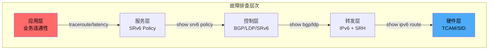
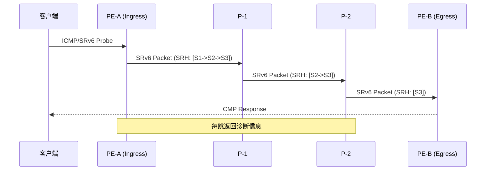
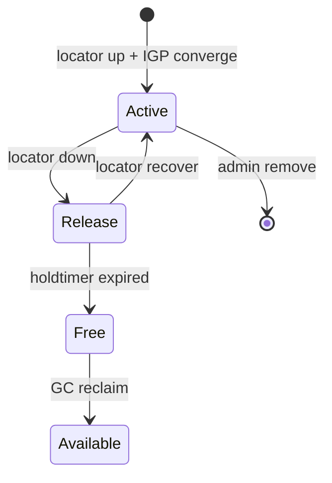
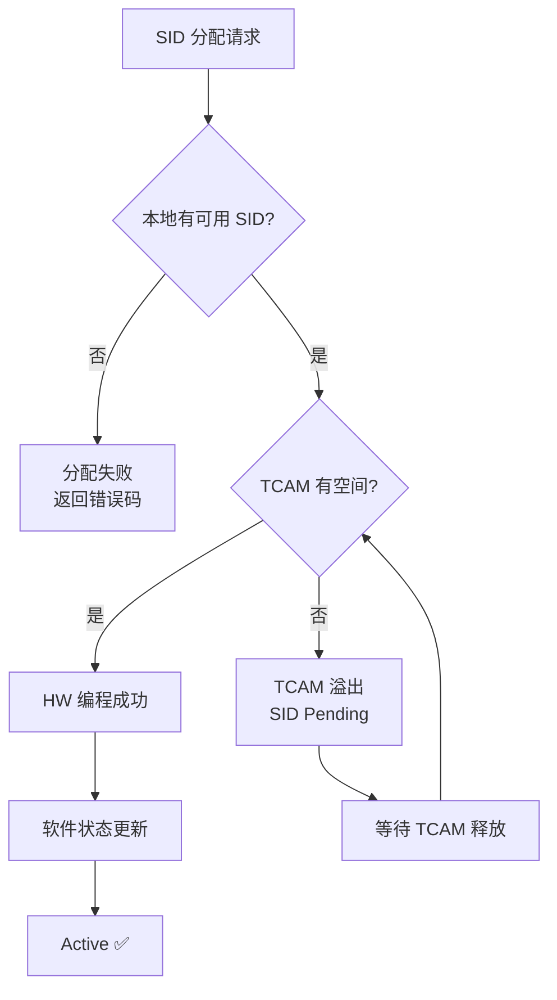
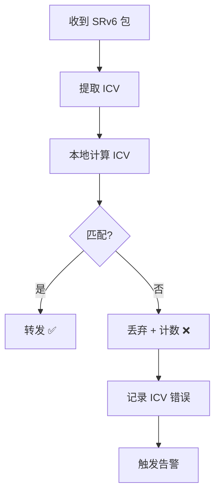
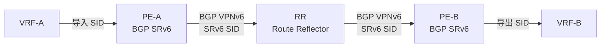
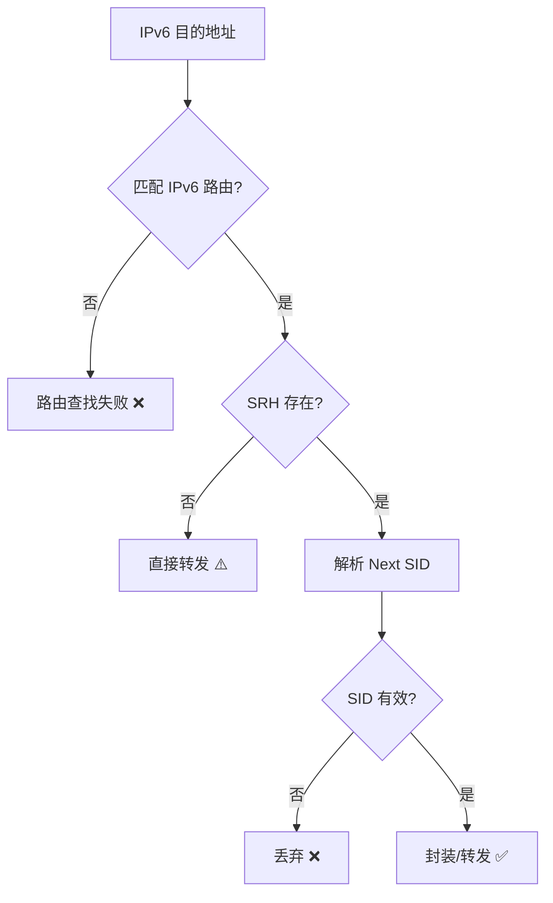
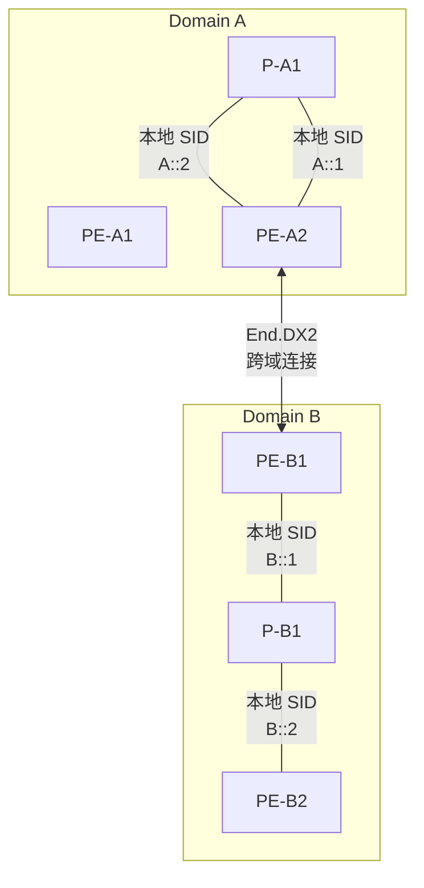
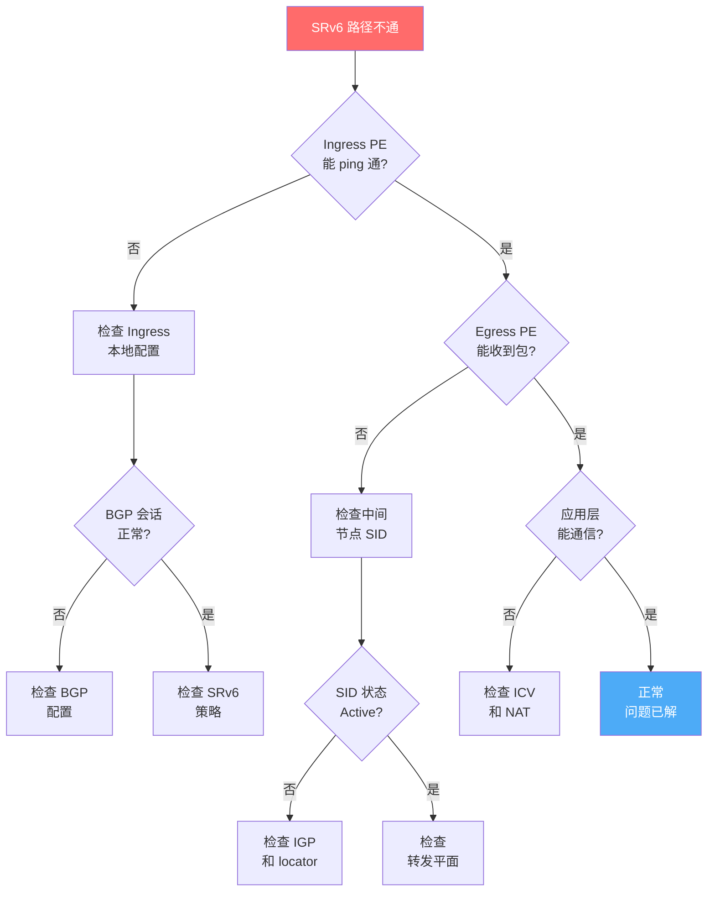

> [!info] SRv6 2026 深度探索系列
> 0. [[2026-04-14-srv6-comprehensive-learning-roadmap|SRv6 全栈学习路径总览]]
> 1. [[2026-04-14-srv6-deep-dive-ch1-fundamentals|SRv6 基础：路由与Segment机制]]
> ...
> 28. [[2026-04-14-srv6-deep-dive-ch28-operations-overview|第二八章：运营概述与监控体系]]
> **29. 第二九章：故障诊断与排错实战**
> 30. [[2026-04-14-srv6-deep-dive-ch30-te-operations|第三十章：流量工程运营实战]]
> 31. [[2026-04-14-srv6-deep-dive-ch31-security-operations|第三一章：安全运营与攻击防御]]
> 32. [[2026-04-14-srv6-deep-dive-ch32-deployment-migration|第三二章：部署与迁移运营]]

---

## 1. 概述：SRv6 故障诊断方法论

SRv6 故障排查的复杂性源于其**多层架构**：



> [!important] 排查第一原则
> **从症状到根因，从外到内**。先确认业务层面是否受影响，再逐层往下定位。

---

## 2. 常见故障分类与诊断流程

### 2.1 故障分类矩阵

| 故障类型 | 症状表现 | 优先级 | 平均修复时间 |
| :--- | :--- | :--- | :--- |
| 路径不可达 | traceroute 在某跳超时 | P0 | 15-30 min |
| SID 分配失败 | 新 SID 状态为 Release | P1 | 30-60 min |
| 计数器失步 | HW/SW 计数器偏差 > 1% | P2 | 2-4 h |
| TCAM 溢出 | 新 SID 无法编程 | P0 | 5-15 min |
| ICV 校验失败 | 包被错误丢弃 | P0 | 10-20 min |
| 跨域不通 | End.DX2 路径中断 | P0 | 20-45 min |

### 2.2 标准诊断流程


**Step 1: 症状确认**

```bash
# 检查业务连通性
ping -Sv6 <destination> -c 10
traceroute6 <destination>

# 检查 SRv6 特定指标
show srv6 sessions
show srv6 policies
```

**Step 2: 影响评估**

```bash
# 统计受影响的流量
show srv6 policy traffic-stats | match <affected-endpoint>

# 统计受影响用户/应用
show access-lists | match <policy-name>
```

**Step 3: 路径追踪**

```bash
# Juniper: SRv6 traceroute
traceroute section-routing srv6 <destination>

# Cisco: SRv6 path tracing  
trace srv6 <destination>

# Huawei: SRv6 track
trace srv6 segment-list <sid-list>
```

---

## 3. 路径不可达故障排查

### 3.1 端到端 traceroute 诊断



### 3.2 分段定位

```bash
# 在 Ingress PE 检查 SRv6 封装
show srv6 encapsulated-traffic
show srv6 sid-database

# 在 Transit P 检查转发
show srv6 forwarding table
show srv6 segment-list <sid>

# 在 Egress PE 检查解封装
show srv6 decapsulated-traffic
show ipv6 neighbor
```

### 3.3 典型故障案例

> [!example] 案例：SRv6 路径在第三跳中断
> 
> **症状**：`traceroute6` 显示第一、二跳正常，第三跳超时
> 
> **排查过程**：
> ```bash
> # Step 1: 在 Ingress PE 检查 SID 状态
> show srv6 sid
> # 结果: Active ✅
> 
> # Step 2: 在 P-1 检查
> show srv6 sid
> # 结果: Active ✅
> 
> # Step 3: 在 P-2 检查  
> show srv6 sid
> # 结果: Release ❌ - locator down
> 
> # Step 4: 检查 P-2 物理接口
> show interfaces ge-0/0/0
> # 结果: link down ⚠️
> ```
> 
> **根因**：P-2 节点接口故障导致 locator 不可达
> 
> **修复**：恢复物理链路，SID 自动恢复为 Active

---

## 4. SID 相关故障

### 4.1 SID 状态异常



| 状态 | 含义 | 可能原因 |
| :--- | :--- | :--- |
| `Active` | 正常工作 | - |
| `Release` | 临时候用 | locator down / IGP 收敛中 |
| `Free` | 已释放 | holdtimer 超时 |
| `Pending` | 创建中 | 等待编程完成 |

### 4.2 SID 分配失败

```bash
# 检查 SID 分配日志
show log | match "srv6.*sid.*fail"

# 检查 SID 前缀冲突
show srv6 locator-prefixes

# 检查 SID 配额
show system resources
show srv6 sid-quota
```



### 4.3 常见 SID 故障

| 故障 | 命令检查 | 根因 | 解决方案 |
| :--- | :--- | :--- | :--- |
| SID not found | `show srv6 sid` | SID 未分配 | 重新分配 SID |
| SID pending | `show srv6 sid` | TCAM 满 | 清理无用 SID |
| SID flapping | `show srv6 sid history` | locator 不稳定 | 检查底层协议 |
| ICV fail | `show srv6 icv-errors` | 密钥不一致 | 同步 ICV 密钥 |

---

## 5. ICV/计数器故障

### 5.1 ICV 校验失败

```bash
# 检查 ICV 错误计数器
show srv6 counters icv-errors
show srv6 security statistics

# 检查 ICV 配置一致性
show srv6 security policy
show srv6 security keychain
```



**ICV 故障常见原因：**
- 密钥不一致（跨厂商对接）
- 密钥轮换不同步
- 中间设备修改了 SRH（没有重新计算 ICV）

### 5.2 计数器同步问题

```bash
# 对比 HW 和 SW 计数器
show srv6 counters hardware
show srv6 counters software

# 检查计数器漂移
show srv6 counters drift
```

| 偏差范围 | 可能原因 | 处理方式 |
| :--- | :--- | :--- |
| < 0.1% | 正常采样误差 | 忽略 |
| 0.1% - 1% | 计数器延迟上报 | 监控观察 |
| > 1% | 计数丢失或重复 | 触发告警 |
| > 10% | 硬件故障 | 立即排查 |

---

## 6. 控制平面故障

### 6.1 BGP SRv6 VPN 故障

```bash
# 检查 BGP SRv6 地址族
show bgp summary
show bgp neighbor <neighbor>

# 检查 VPNv6 前缀
show bgp vpnv6 unicast <prefix>
show route table <vpn-rt>
```



**BGP SRv6 故障排查清单：**
- [ ] BGP 会话状态是否为 Established
- [ ] VPNv6 单播地址族是否启用
- [ ] SRv6 能力是否协商成功
- [ ] RT 导入/导出规则是否匹配
- [ ] SID 是否正确携带在 Path Attribute 中

### 6.2 IGP 收敛故障

```bash
# IS-IS SRv6 配置检查
show isis interface
show isis adjacency
show isis srv6 locator

# OSPFv3 SRv6 配置检查  
show ospf3 interface
show ospf3 neighbor
show ospf3 srv6 locator
```

---

## 7. 数据平面故障

### 7.1 转发层面检查

```bash
# 检查 SRv6 转发表
show srv6 forwarding table

# 检查 IPv6 路由表
show route table inet6

# 检查硬件转发表
show hardware l3match
show hardware tcam
```



### 7.2 包捕获分析

```bash
# 使用 tcpdump 捕获 SRv6 包
tcpdump -i <interface> -nn -vv 'ip6 and ip6[54:1] == 0' 

# 使用 EXTCP 以太网头部过滤
# SRv6 封装格式:
# ETH | IPv6 (SRH) | Upper Layer

# Wireshark 过滤器
# 显示 SRH
# ipv6.transport_next_header == 43

# 显示具体 Segment
# ipv6.segment_list == <sid>
```

```bash
# 使用 ESPuppet 深度抓包分析
esxpuppet capture \
    --interface ge-0/0/0 \
    --filter 'ip6[54] == 0x04' \
    --output srv6_capture.pcap \
    --snaplen 128 \
    --count 1000
```

### 7.3 SRv6 封装格式解析

```
┌─────────┬────────────────────────────────────────────────────────────┐
│ Ethernet │ IPv6 Header (Next Header = 43)                            │
│          ├─────────────────────────────────────────────────────────┤
│          │ SRH (Segment Routing Header)                             │
│          │  - Next Header: <upper-layer-protocol>                   │
│          │  - Hdr Ext Len: <sr-header-length>                      │
│          │  - Segment Left: <segments-remaining>                    │
│          │  - Segment List: [SID_1, SID_2, ..., SID_N]              │
│          │  - ICV (optional)                                        │
├─────────┼────────────────────────────────────────────────────────────┤
│          │ Upper Layer (TCP/UDP/ICMPv6)                              │
└─────────┴────────────────────────────────────────────────────────────┘
```

---

## 8. 跨域故障排查

### 8.1 Inter-Domain SRv6 架构



### 8.2 跨域故障排查步骤

```bash
# Step 1: 检查域间连接
ping6 -Sv6 <inter-domain-sid>

# Step 2: 检查 End.DX2 功能
show srv6 function type end-dx2
show srv6 function end-dx2 statistics

# Step 3: 检查 BGP 跨域会话
show bgp neighbor <inter-domain-rr>
show bgp l2vpn-evpn sessions

# Step 4: 检查路由泄露
show route table <rt-instance> <prefix>
```

---

## 9. 自动化诊断工具

### 9.1 诊断脚本框架

```python
#!/usr/bin/env python3
"""
SRv6 故障诊断自动化工具
"""

import json
import subprocess
from typing import Dict, List, Optional
from dataclasses import dataclass

@dataclass
class DiagnosticResult:
    check_name: str
    status: str  # PASS / FAIL / WARNING
    details: str
    command: str

class SRv6Diagnostic:
    def __init__(self, device_ip: str):
        self.device_ip = device_ip
        self.results: List[DiagnosticResult] = []
    
    def run_command(self, cmd: str) -> str:
        """执行命令并返回输出"""
        result = subprocess.run(
            ['ssh', f'admin@{self.device_ip}', cmd],
            capture_output=True, text=True, timeout=30
        )
        return result.stdout + result.stderr
    
    def check_locator_status(self) -> DiagnosticResult:
        """检查 Locator 状态"""
        output = self.run_command("show srv6 locator")
        
        if "Active" in output:
            status = "PASS"
            details = "所有 Locator 处于 Active 状态"
        elif "Release" in output:
            status = "FAIL"
            details = "存在 Release 状态的 Locator"
        else:
            status = "WARNING"
            details = "无法确定 Locator 状态"
        
        return DiagnosticResult(
            check_name="Locator Status",
            status=status,
            details=details,
            command="show srv6 locator"
        )
    
    def check_sid_programming(self) -> DiagnosticResult:
        """检查 SID 编程状态"""
        output = self.run_command("show srv6 sid database")
        
        pending_count = output.count("Pending")
        active_count = output.count("Active")
        
        if pending_count > 0:
            status = "WARNING"
            details = f"存在 {pending_count} 个 Pending SID"
        else:
            status = "PASS"
            details = f"所有 SID 已编程完成 ({active_count} Active)"
        
        return DiagnosticResult(
            check_name="SID Programming",
            status=status,
            details=details,
            command="show srv6 sid database"
        )
    
    def check_icv_errors(self) -> DiagnosticResult:
        """检查 ICV 错误"""
        output = self.run_command("show srv6 counters icv-errors")
        
        # 解析错误计数
        error_count = 0
        for line in output.split('\n'):
            if 'icv_errors' in line.lower():
                error_count = int(line.split()[-1])
        
        if error_count > 1000:
            status = "FAIL"
        elif error_count > 0:
            status = "WARNING"
        else:
            status = "PASS"
        
        return DiagnosticResult(
            check_name="ICV Errors",
            status=status,
            details=f"ICV 错误计数: {error_count}",
            command="show srv6 counters icv-errors"
        )
    
    def full_diagnostic(self) -> Dict:
        """执行完整诊断"""
        checks = [
            self.check_locator_status,
            self.check_sid_programming,
            self.check_icv_errors,
        ]
        
        for check in checks:
            self.results.append(check())
        
        return {
            "device": self.device_ip,
            "timestamp": subprocess.run(
                ['date'], capture_output=True, text=True
            ).stdout.strip(),
            "results": [
                {
                    "check": r.check_name,
                    "status": r.status,
                    "details": r.details
                }
                for r in self.results
            ]
        }

# 使用示例
if __name__ == "__main__":
    diag = SRv6Diagnostic("192.168.1.1")
    report = diag.full_diagnostic()
    print(json.dumps(report, indent=2))
```

### 9.2 根因分析决策树



---

## 10. 日志分析

### 10.1 关键日志位置

```bash
# Linux 主机日志
/var/log/syslog
/var/log/messages

# 厂商设备日志
# Juniper
show log <logfile>

# Cisco
show logging

# Huawei
info-center logfile
```

### 10.2 日志关键词过滤

```bash
# 查找 SRv6 相关日志
grep -i "srv6\|segment\|sid\|icv" /var/log/messages

# 查找错误日志
grep -iE "error|fail|reject|drop" /var/log/messages | grep srv6

# 查找 ICV 失败日志
grep -i "icv.*fail\|校验.*失败" /var/log/messages
```

### 10.3 日志分析示例

```
2026-04-14T10:23:45.123456+08:00 router-a SRv6[1234]: SID A::1001 state change: Active -> Release
2026-04-14T10:23:45.234567+08:00 router-a SRv6[1234]: Locator ge-0/0/0 down
2026-04-14T10:24:00.345678+08:00 router-a SRv6[1234]: ICV validation failed for packet from A::200
2026-04-14T10:24:01.456789+08:00 router-a SRv6[1234]: Counter desync detected: hw=123456 sw=123000
```

---

## 11. 排错命令速查表

### 11.1 Juniper 命令

| 场景 | 命令 |
| :--- | :--- |
| SID 状态 | `show srv6 sid` |
| Locator 状态 | `show srv6 locator` |
| 策略状态 | `show srv6 policy` |
| 计数器 | `show srv6 counters` |
| ICV 错误 | `show srv6 security statistics` |
| 转发表 | `show srv6 forwarding table` |
| 路径追踪 | `traceroute section-routing srv6 <dest>` |

### 11.2 Cisco 命令

| 场景 | 命令 |
| :--- | :--- |
| SID 状态 | `show segment-routing srv6 sid` |
| Locator 状态 | `show segment-routing srv6 locator` |
| 策略状态 | `show segment-routing srv6 traffic-eng policy` |
| 计数器 | `show segment-routing srv6 counters` |
| Segment List | `show segment-routing srv6 segment-list` |
| 路径追踪 | `trace srv6 <dest>` |

### 11.3 Huawei 命令

| 场景 | 命令 |
| :--- | :--- |
| SID 状态 | `display srv6 sid` |
| Locator 状态 | `display srv6 locator` |
| 策略状态 | `display srv6 traffic-engine policy` |
| 计数器 | `display srv6 statistics` |
| ICV 错误 | `display srv6 security` |

---

## 12. 总结

SRv6 故障排查要点：

| 故障类型 | 第一检查点 | 核心命令 |
| :--- | :--- | :--- |
| 路径不通 | Ingress PE | `traceroute6 / trace srv6` |
| SID 异常 | 本地节点 | `show srv6 sid` |
| ICV 失败 | 接收节点 | `show srv6 counters icv-errors` |
| 计数器失步 | 所有节点 | `show srv6 counters hardware` |
| 跨域不通 | 边界节点 | `show srv6 function end-dx2` |

**排错最佳实践：**
1. **从症状到根因**：业务 → 网络 → 节点 → 芯片
2. **分层排查**：先确认是哪一层的问题
3. **证据链**：保留完整的诊断输出
4. **变更关联**：检查故障前是否有变更
5. **复现验证**：修复后需复测确认

---
