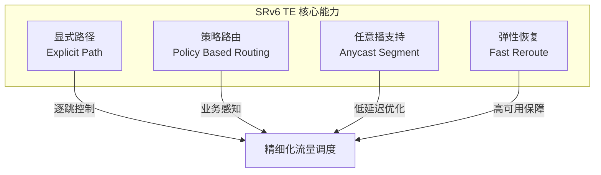
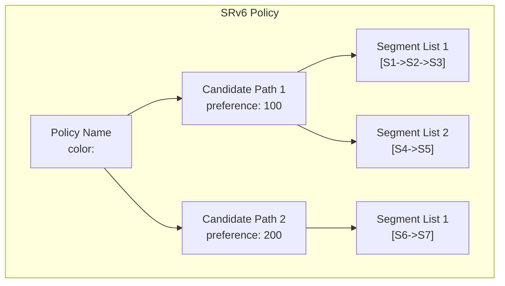
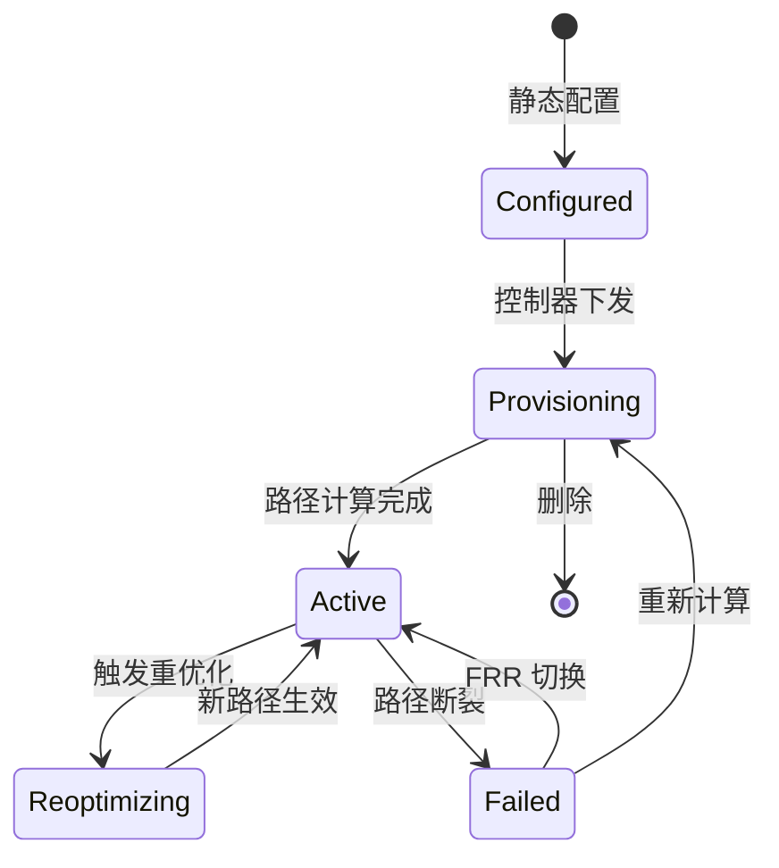
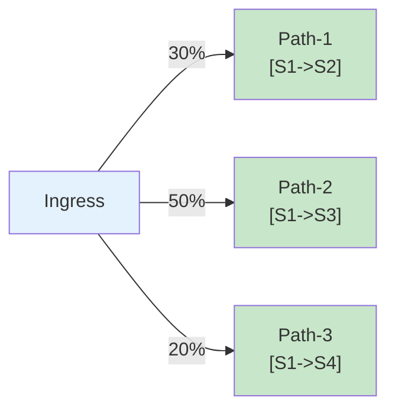
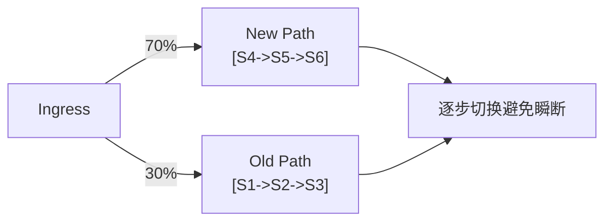
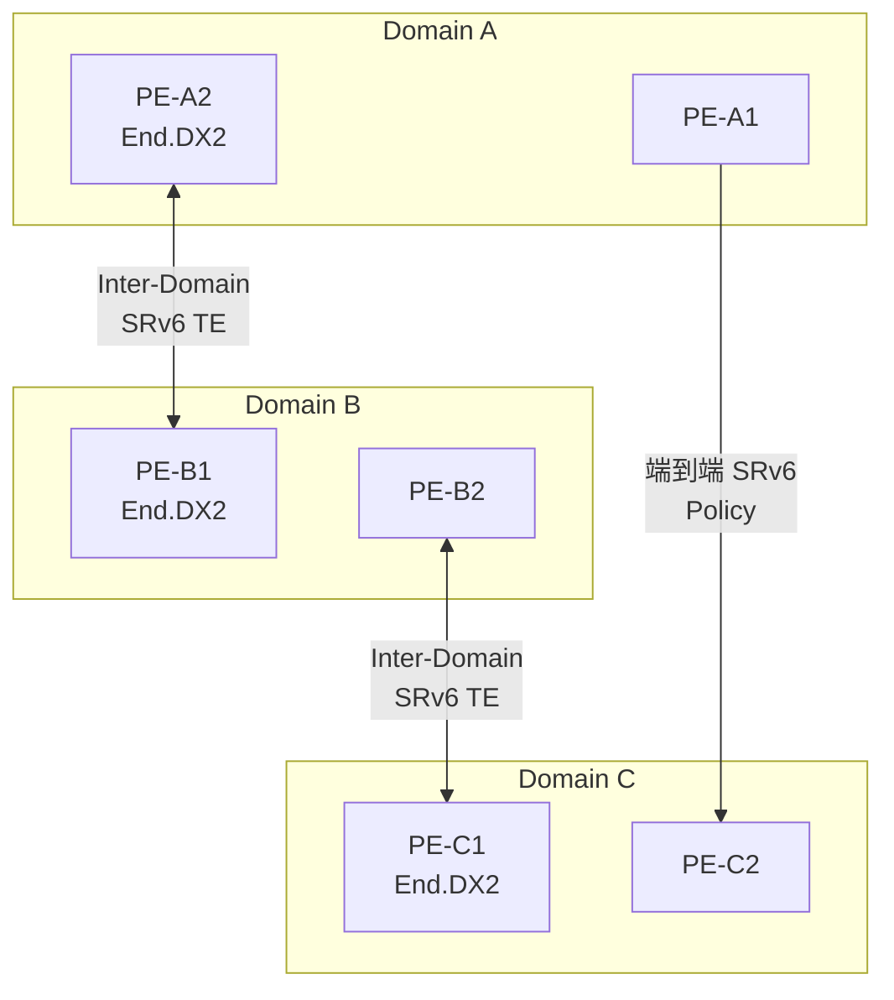
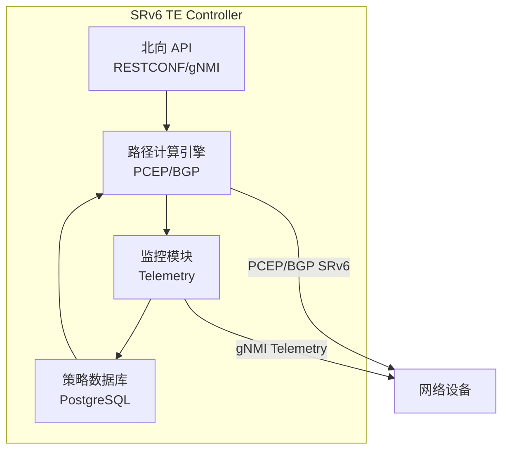
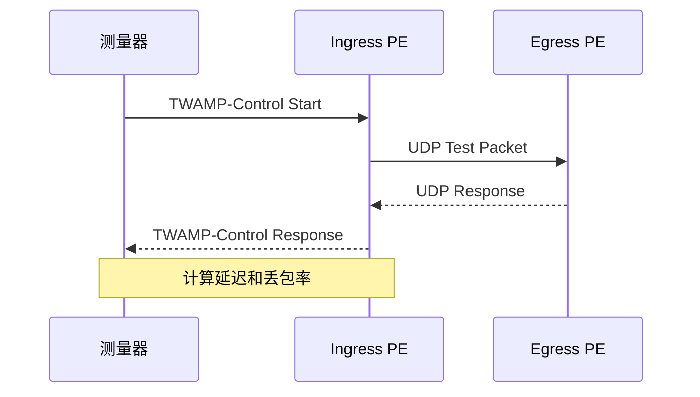

> [!info] SRv6 2026 深度探索系列
> 0. [[2026-04-14-srv6-comprehensive-learning-roadmap|SRv6 全栈学习路径总览]]
> ...
> 29. [[2026-04-14-srv6-deep-dive-ch29-troubleshooting|第二九章：故障诊断与排错实战]]
> **30. 第三十章：流量工程运营实战**
> 31. [[2026-04-14-srv6-deep-dive-ch31-security-operations|第三一章：安全运营与攻击防御]]
> 32. [[2026-04-14-srv6-deep-dive-ch32-deployment-migration|第三二章：部署与迁移运营]]

---

## 1. 概述：SRv6 TE 的运营价值

SRv6 Traffic Engineering (TE) 将 segment routing 的**源路由能力**与 **IPv6 的可编程空间**结合，为网络运营带来前所未有的控制粒度：



| 能力 | 传统 MPLS TE | SRv6 TE |
| :--- | :--- | :--- |
| 路径控制 | RSVP-TE 动态信令 | BGP SRv6 Policy / PCEP |
| 扩展性 | 受限于 LSP 数量 | 受限于 SID 空间 |
| 中间盒支持 | GRE 封装 | Native IPv6 + SRH |
| 运营复杂度 | 高 (状态ful) | 低 (stateless) |
| Anycast 支持 | 有限 | 完整支持 |

---

## 2. SRv6 Policy 架构

### 2.1 SRv6 Policy 模型



**关键概念：**
- **Policy**：由 `(color, endpoint)` 元组标识
- **Candidate Path**：策略的候选路径，带 preference
- **Segment List**：实际的 SID 序列
- **Active Path**：当前使用的最优 Candidate Path

### 2.2 SRv6 Policy 生命周期



---

## 3. SRv6 Policy 日常运营

### 3.1 Policy 查看与验证

```bash
# Juniper: 查看 SRv6 Policy 状态
show srv6 traffic-eng policy
show srv6 traffic-eng policy detail name <policy-name>

# Cisco: 查看 SRv6 Policy
show segment-routing srv6 traffic-eng policy
show segment-routing srv6 traffic-eng policy <name> detail

# Huawei: 查看 SRv6 Policy
display srv6 traffic-engine policy
display srv6 traffic-engine policy <name>
```

**关键检查项：**

| 检查项 | 期望值 | 异常处理 |
| :--- | :--- | :--- |
| Policy 状态 | `Up` | 检查 candidate-path |
| Active Path | 存在 | 检查 segment-list |
| 流量统计 | 非零 | 检查路由是否命中 |
| Segment List | 全部 `Active` | 检查中间节点 SID |

### 3.2 Policy 流量监控

```bash
# 查看策略流量统计
show srv6 traffic-eng policy statistics

# 按 color 查看
show srv6 traffic-eng policy | match "color:100"
```

**流量统计输出示例：**

```
Policy Name: policy-100
  Color: 100, Endpoint: 2001:db8::2
  Status: Up
  Candidate Paths:
    Preference: 100
      Protocol Origin: BGP
      Path ID: 1
      Segment Lists:
        SID List: [A::100, A::200, A::300]
        State: Active
        Traffic Stats: 1.23 Gbps, 456.78 Mpps
        Packets: 1234567890
        Bytes: 9876543210
```

### 3.3 流量分担监控



---

## 4. 路径重优化 (Reoptimization)

### 4.1 重优化触发条件

| 触发类型 | 触发条件 | 自动化 |
| :--- | :--- | :--- |
| 定时重优化 | 定时器到期 | 自动 |
| 事件触发 | 接口 up/down | 自动 |
| 手动触发 | 运维人员 | 手动 |
| 性能触发 | 延迟/丢包超阈值 | 自动 |
| 容量触发 | 带宽利用率变化 | 自动 |

### 4.2 手动重优化

```bash
# Juniper: 手动触发重优化
request srv6 traffic-eng policy <policy-name> reoptimize

# Cisco: 手动重优化
segment-routing srv6
  traffic-eng policy <name>
    reoptimize

# Huawei: 手动重优化
srv6 traffic-engine policy <name> reoptimize
```

### 4.3 重优化日志分析

```
2026-04-14T10:30:00.123+08:00 router-a SRv6-TE: Policy policy-100 reoptimization triggered
2026-04-14T10:30:00.456+08:00 router-a SRv6-TE: New path computed: [A::100 -> A::200 -> A::300]
2026-04-14T10:30:00.789+08:00 router-a SRv6-TE: Path switch completed, traffic moved
2026-04-14T10:30:01.012+08:00 router-a SRv6-TE: Old path removed
```

---

## 5. 流量调优操作

### 5.1 流量切割

将现有流量从一条路径迁移到另一条路径：

```bash
# Step 1: 创建新的 Segment List
configure
srv6 traffic-eng
  policy policy-100
    candidate-path preference 150
      segment-list sl-new
        index 10 sid A::400
        index 20 sid A::500
        index 30 sid A::600

# Step 2: 设置流量权重
srv6 traffic-eng
  policy policy-100
    candidate-path preference 150
      weight 70  # 70% 流量走新路径
```



### 5.2 流量抑制

```bash
# 限制特定策略的带宽
configure
srv6 traffic-eng
  policy policy-video
    bandwidth limit 500 Mbps
    bandwidth reserved 400 Mbps
```

### 5.3 DSCP 映射

```bash
# 将 DSCP 值映射到不同的 SRv6 Policy
configure
srv6 traffic-eng
  policy policy-premium
    match dscp af41, af42, af43
  policy policy-best-effort
    match dscp be, cs1, cs2
```

---

## 6. TE 可靠性保障

### 6.1 FRR (Fast Reroute) 配置

```mermaid
graph TD
    A["Ingress"] -->|"主路径<br/>S1->S2->S3"| B["Egress"]
    A -.->|"备份路径<br/>S1->S4->S5".-> B
    
    style A fill:#e3f2fd
    style B fill:#e3f2fd
```

```bash
# Juniper: 启用 FRR
configure
set srv6 traffic-eng policy <name> fast-reroute
set srv6 traffic-eng policy <name> fast-reroute bandwidth <bw>
set srv6 traffic-eng policy <name> fast-reroute path-protection

# Cisco: 启用 FRR
segment-routing srv6
  traffic-eng
    policy <name>
      protection
```

### 6.2 FRR 切换验证

```bash
# 查看 FRR 状态
show srv6 traffic-eng policy <name> fast-reroute

# 查看备份路径
show srv6 traffic-eng backup-path

# 模拟故障触发
request srv6 traffic-eng policy <name> simulate-failure
```

**FRR 切换时间目标：**

| 保护类型 | 切换时间 | 标准 |
| :--- | :--- | :--- |
| 节点保护 | < 50 ms | ITUT Y.1711 |
| 链路保护 | < 50 ms | ITUT Y.1711 |
| 路径保护 | < 200 ms | RFC 4098 |

---

## 7. 多域 TE 运营

### 7.1 Multi-Domain SRv6 TE 架构



### 7.2 跨域 TE 策略

```bash
# 配置跨域 SRv6 Policy
configure
srv6 traffic-eng
  policy cross-domain
    color 1000
    endpoint 2001:db8:c::3
    candidate-path preference 100
      protocol-origin bgp
      segment-list domain-a-to-b
        index 10 sid A::1      # Domain A SID
        index 20 sid A::B::1   # Inter-domain SID
        index 30 sid B::1      # Domain B SID
        index 40 sid B::C::1   # Inter-domain SID
        index 50 sid C::1      # Domain C SID
```

### 7.3 跨域流量工程挑战

| 挑战 | 问题 | 解决方案 |
| :--- | :--- | :--- |
| 路径可见性 | 各域独立监控 | 端到端Telemetry |
| SID 协调 | 跨域 SID 规划 | 统一编址方案 |
| 延迟测量 | 跨域延迟分布 | RFC 9001 |
| 策略一致性 | 各域策略同步 | 集中式控制器 |

---

## 8. TE 自动化运营

### 8.1 控制器架构



### 8.2 自动化调优示例

```python
#!/usr/bin/env python3
"""
SRv6 TE 自动调优脚本
基于实时流量负载调整路径分担
"""

import json
import requests
from typing import Dict, List

class SRv6TEAutoTuner:
    def __init__(self, controller_url: str):
        self.controller_url = controller_url
        self.session = requests.Session()
    
    def get_policy_stats(self, policy_name: str) -> Dict:
        """获取策略流量统计"""
        response = self.session.get(
            f"{self.controller_url}/api/v1/policy/{policy_name}/stats"
        )
        return response.json()
    
    def calculate_target_weights(self, policy_name: str) -> Dict[str, float]:
        """基于当前负载计算目标权重"""
        stats = self.get_policy_stats(policy_name)
        
        segment_lists = stats['segment_lists']
        total_bandwidth = sum(sl['bandwidth'] for sl in segment_lists)
        
        # 计算均匀分担权重
        weights = {}
        for sl in segment_lists:
            sl_name = sl['name']
            # 简单均匀分担逻辑
            # 实际生产环境应考虑延迟、跳数、可用带宽
            weights[sl_name] = 100.0 / len(segment_lists)
        
        return weights
    
    def rebalance_traffic(self, policy_name: str):
        """执行流量再平衡"""
        target_weights = self.calculate_target_weights(policy_name)
        
        # 分步骤调整，避免一次性切换
        for sl_name, weight in target_weights.items():
            self._adjust_weight(policy_name, sl_name, weight)
    
    def _adjust_weight(self, policy_name: str, sl_name: str, weight: float):
        """调整单个 Segment List 权重"""
        payload = {
            "policy": policy_name,
            "segment_list": sl_name,
            "weight": weight
        }
        
        response = self.session.patch(
            f"{self.controller_url}/api/v1/policy/{policy_name}/weight",
            json=payload
        )
        
        if response.status_code == 200:
            print(f"✓ {sl_name} 权重调整为 {weight}%")
        else:
            print(f"✗ {sl_name} 权重调整失败: {response.text}")
    
    def check_load_balance(self, policy_name: str, threshold: float = 0.2) -> bool:
        """检查负载均衡是否均匀（标准差 < 阈值）"""
        stats = self.get_policy_stats(policy_name)
        
        bandwidths = [sl['bandwidth'] for sl in stats['segment_lists']]
        if not bandwidths:
            return True
        
        avg = sum(bandwidths) / len(bandwidths)
        variance = sum((b - avg) ** 2 for b in bandwidths) / len(bandwidths)
        std_dev = variance ** 0.5
        
        # 计算变异系数 (CV)
        cv = std_dev / avg if avg > 0 else 0
        
        print(f"当前负载均衡 CV: {cv:.2%} (阈值: {threshold:.2%})")
        return cv < threshold


# 使用示例
if __name__ == "__main__":
    tuner = SRv6TEAutoTuner("https://srv6-controller.example.com:8080")
    
    # 检查负载均衡
    if not tuner.check_load_balance("policy-video"):
        print("开始自动调优...")
        tuner.rebalance_traffic("policy-video")
    else:
        print("负载均衡正常，无需调优")
```

### 8.3 TE 容量规划自动化

```python
#!/usr/bin/env python3
"""
SRv6 TE 容量规划预测
"""

import numpy as np
from datetime import datetime, timedelta

def predict_capacity_requirements(
    current_bandwidth: float,
    growth_rate: float,
    forecast_days: List[int]
) -> Dict[int, float]:
    """
    预测未来容量需求
    
    Args:
        current_bandwidth: 当前带宽 (Gbps)
        growth_rate: 日增长率
        forecast_days: 预测天数列表
    """
    predictions = {}
    
    for days in forecast_days:
        # 指数增长模型
        future_bandwidth = current_bandwidth * ((1 + growth_rate) ** days)
        predictions[days] = future_bandwidth
    
    return predictions

def check_tcam_capacity(
    current_sids: int,
    max_sids: int,
    sid_growth_rate: float,
    forecast_days: int
) -> Dict:
    """
    检查 TCAM 容量是否满足增长需求
    """
    future_sids = current_sids * ((1 + sid_growth_rate) ** forecast_days)
    utilization = future_sids / max_sids
    
    return {
        "current_sids": current_sids,
        "future_sids": int(future_sids),
        "max_sids": max_sids,
        "future_utilization": f"{utilization:.1%}",
        "warning": utilization > 0.8,
        "critical": utilization > 0.95
    }

# 使用示例
if __name__ == "__main__":
    # 容量预测
    predictions = predict_capacity_requirements(
        current_bandwidth=100,  # 100 Gbps
        growth_rate=0.02,       # 2% 日增长
        forecast_days=[30, 60, 90]
    )
    
    print("容量预测:")
    for days, bw in predictions.items():
        print(f"  {days}天后: {bw:.1f} Gbps")
    
    # TCAM 检查
    tcam_status = check_tcam_capacity(
        current_sids=5000,
        max_sids=16000,
        sid_growth_rate=0.01,
        forecast_days=90
    )
    
    print(f"\nTCAM 容量 ({tcam_status['forecast_days']}天后):")
    print(f"  当前: {tcam_status['current_sids']}")
    print(f"  预测: {tcam_status['future_sids']}")
    print(f"  最大: {tcam_status['max_sids']}")
    print(f"  利用率: {tcam_status['future_utilization']}")
    
    if tcam_status['warning']:
        print("⚠️ 容量预警: 90天后 TCAM 使用率将超过 80%")
    if tcam_status['critical']:
        print("🔴 容量紧急: 90天后 TCAM 将接近满载")
```

---

## 9. TE SLA 保障

### 9.1 SLA 指标定义

| SLA 指标 | 定义 | 测量方法 | 目标值 |
| :--- | :--- | :--- | :--- |
| 可用性 | Policy Up 时间占比 | 监控系统 | 99.99% |
| 延迟 | 端到端包延迟 P99 | Active probing | < 20 ms |
| 抖动 | 延迟变化范围 | Active probing | < 5 ms |
| 丢包率 | 丢失包/总包 | Active probing | < 0.01% |
| 带宽保证 | 实际可用带宽 | 流量统计 | >= 承诺带宽 |

### 9.2 SLA 监控配置

```bash
# 配置 SLA 测量 (TWAMP-Light)
configure
set protocols srv6 traffic-eng policy <name> sla
set protocols srv6 traffic-eng policy <name> sla measurement
  interval 60          # 测量间隔（秒）
  packet-size 64       # 包大小
  padding-length 128   # 填充长度
```



---

## 10. TE 运营最佳实践

### 10.1 变更窗口管理

| 场景 | 建议窗口 | 备注 |
| :--- | :--- | :--- |
| Policy 调整 | 业务低峰期 | 避免流量突变 |
| 路径切换 | 提前通知 | 可能触发重路由 |
| 控制器升级 | 维护窗口 | 需要备用手控 |
| 大规模迁移 | 凌晨 2-5 AM | 风险最低 |

### 10.2 日常检查清单

```bash
#!/bin/bash
# SRv6 TE 每日检查脚本

echo "=== SRv6 TE Daily Checklist $(date) ==="

# 1. Policy 状态检查
echo "[1] Policy 状态"
show srv6 traffic-eng policy | grep -E "Policy|Status|Up|Down"

# 2. 流量分担检查
echo "[2] 流量分担"
show srv6 traffic-eng policy statistics | grep -E "Policy|SegList|Weight"

# 3. FRR 状态检查
echo "[3] FRR 保护状态"
show srv6 traffic-eng policy | grep -E "Fast-Reroute|Protection"

# 4. 容量预警检查
echo "[4] 容量状态"
show srv6 sid count
show srv6 traffic-eng policy count

# 5. SLA 指标检查
echo "[5] SLA 指标"
show srv6 sla statistics
```

### 10.3 应急响应流程

```
P0 告警: Policy Down
│
├─ 立即通知值班工程师 (5分钟内)
├─ 自动触发 FRR 切换 (如已配置)
├─ 检查是否影响业务
│   │
│   ├─ 是 → 启动应急切换流程
│   │
│   └─ 否 → 继续监控，准备修复
│
├─ 值班工程师响应 (15分钟内)
│   ├─ 确认告警真实性
│   ├─ 定位故障节点
│   └─ 启动故障排查
│
└─ 修复完成 → 验证业务恢复 → 事件报告
```

---

## 11. 性能调优

### 11.1 Segment 栈深度优化

```bash
# 监控 Segment 栈深度分布
show srv6 statistics segment-depth

# 优化路径计算，优先选择短路径
configure
set srv6 traffic-eng path-computation
  prefer-short-path    # 优先短路径
  max-segment-depth 8  # 最大段数限制
```

### 11.2 ICV 计算优化

```bash
# 优化 ICV 计算位置
configure
set srv6 security icv
  compute-at egress   # 在 egress 计算 ICV
  hw-offload enable   # 启用硬件卸载
```

### 11.3 批量操作优化

```bash
# 使用批量配置减少操作时间
commit batch policy-update-20260414
```

---

## 12. 总结

SRv6 TE 运营核心要点：

| 运营领域 | 关键操作 | 工具/命令 |
| :--- | :--- | :--- |
| **Policy 管理** | 创建/修改/删除 | `srv6 traffic-eng policy` |
| **流量监控** | 实时统计、分担比例 | `show srv6 policy statistics` |
| **路径调优** | 手动/自动重优化 | `request srv6 policy reoptimize` |
| **可靠性** | FRR 配置与验证 | `show srv6 fast-reroute` |
| **跨域** | 多域 TE 协同 | 集中式控制器 |
| **自动化** | 流量调优、容量预测 | REST API / PCEP |

**TE 运营黄金法则：**
1. **观察 → 决策 → 执行**：数据驱动的调优决策
2. **渐进式变更**：避免大幅度的瞬时切换
3. **自动化优先**：重复性操作必须自动化
4. **容量余量**：始终保持 20% 以上的设计余量

---
