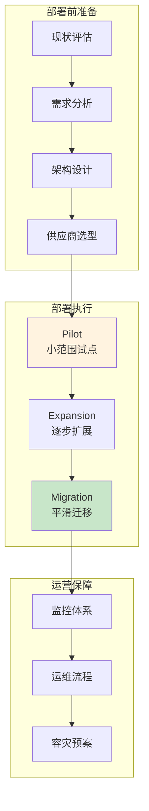
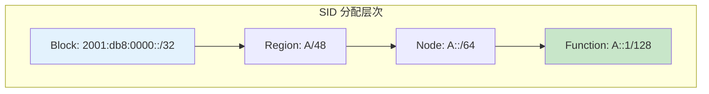
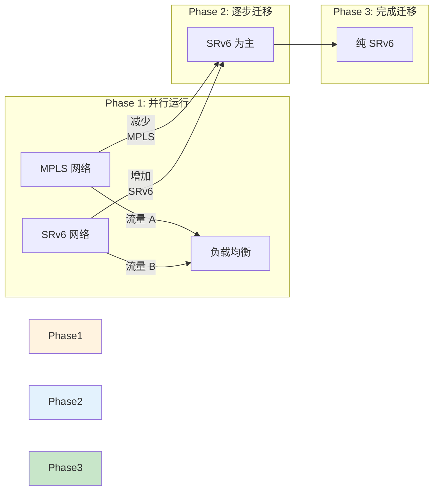
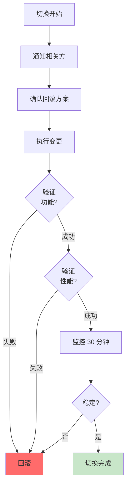
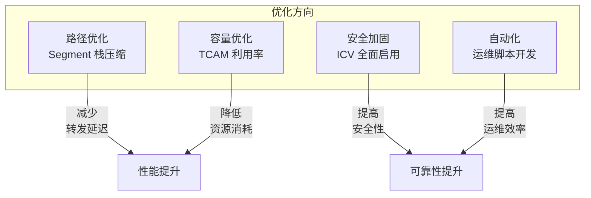

> [!info] SRv6 2026 深度探索系列
> ...
> 31. [[2026-04-14-srv6-deep-dive-ch31-security-operations|第三一章：安全运营与攻击防御]]
> **32. 第三二章：部署与迁移运营**

---

## 1. 概述：SRv6 部署策略

SRv6 部署是一个系统工程，需要考虑**技术选型、风险控制、迁移策略**等多方面因素。



| 部署模式 | 适用场景 | 风险 | 周期 |
| :--- | :--- | :--- | :--- |
| 全新部署 | 新网络 | 低 | 3-6 月 |
| 并行部署 | 混合网络 | 中 | 6-12 月 |
| 渐进迁移 | 现有 MPLS 升级 | 中高 | 12-18 月 |
| 试点后推广 | 保守场景 | 低 | 6-9 月 |

---

## 2. 部署前准备

### 2.1 现状评估清单

```bash
#!/bin/bash
# 网络现状评估脚本

echo "=== SRv6 部署前现状评估 ==="

# 1. 设备能力评估
echo "[1] 设备 SRv6 能力检查"
show version | grep -E "model|hardware"
show system hardware | grep -E "FPC|PIC"

# 2. 软件版本检查
echo "[2] 软件版本"
show version
show version detail

# 3. 现有协议栈
echo "[3] 现有协议"
show protocols
show bgp summary
show isis summary

# 4. 资源使用情况
echo "[4] 资源使用"
show system resources
show chassis hardware

# 5. 接口信息
echo "[5] 接口信息"
show interfaces terse
```

**评估要点：**

| 检查项 | 要求 | 备注 |
| :--- | :--- | :--- |
| 设备型号 | 支持 SRv6 | 确认厂商硬件能力 |
| 软件版本 | >= 推荐版本 | Juniper: 21.x+, Cisco: 7.x+ |
| 内存 | >= 8GB | 高端设备建议 16GB+ |
| TCAM | 充足余量 | SID 编程需要 TCAM |
| 接口 | IPv6 支持 | 确保控制平面可用 |

### 2.2 需求分析

```
┌─────────────────────────────────────────────────────────┐
│                  SRv6 部署需求矩阵                       │
├─────────────────────────────────────────────────────────┤
│ 业务需求:                                                │
│   [ ] L3VPN over SRv6                                    │
│   [ ] EVPN over SRv6                                     │
│   [ ] 流量工程 (TE)                                      │
│   [ ] 高级安全 (ICV)                                     │
│                                                          │
│ 性能需求:                                                │
│   [ ] 带宽: ___ Gbps                                     │
│   [ ] 延迟: < ___ ms                                     │
│   [ ] 可用性: ___%                                       │
│                                                          │
│ 规模需求:                                                │
│   [ ] 节点数: ___                                        │
│   [ ] SID 数量: ___                                     │
│   [ ] Policy 数量: ___                                  │
└─────────────────────────────────────────────────────────┘
```

---

## 3. 架构设计

### 3.1 SID 分配方案



**SID 分配原则：**

```bash
# Juniper: SID 分配配置示例
configure
set srv6
  locator-block 2001:db8:0000::/32
  locator <locator-name>
    prefix 2001:db8:0001::/64
    algorithm 0
```

| 层次 | 前缀长度 | 用途 | 示例 |
| :--- | :--- | :--- | :--- |
| Block | /32 | IANA 分配 | 2001:db8::/32 |
| Region | /48 | 地理区域 | 2001:db8:0001::/48 |
| Node | /64 | 节点标识 | 2001:db8:0001:0001::/64 |
| Function | /128 | 节点功能 | A::100, A::200 |

### 3.2 Locator 规划

```bash
# Locator 规划示例
configure
set srv6
  locator-block 2001:db8::/32
  
  # Region A locators
  set locator locator-a1 prefix 2001:db8:1::/64
  set locator locator-a2 prefix 2001:db8:2::/64
  
  # Region B locators
  set locator locator-b1 prefix 2001:db8:3::/64
  set locator locator-b2 prefix 2001:db8:4::/64
```

### 3.3 网络拓扑设计

```
┌─────────────────────────────────────────────────────────────┐
│                  SRv6 网络拓扑设计                            │
├─────────────────────────────────────────────────────────────┤
│                                                              │
│                    ┌─────────┐                               │
│                    │   RR    │  (Route Reflector)            │
│                    └────┬────┘                               │
│              ┌──────────┼──────────┐                         │
│              │          │          │                         │
│         ┌────┴────┐ ┌────┴────┐ ┌────┴────┐                    │
│         │  PE-A1  │ │  PE-A2  │ │  PE-A3  │  Region A         │
│         └────┬────┘ └────┬────┘ └────┬────┘                    │
│              │          │          │                         │
│         ┌────┴──────────┴──────────┴────┐                    │
│         │         P-A1 (Transit)         │                    │
│         └──────────────┬─────────────────┘                    │
│                        │                                      │
│              ┌─────────┴─────────┐                            │
│              │                   │                            │
│         ┌────┴────┐          ┌────┴────┐                        │
│         │  PE-B1  │          │  PE-B2  │  Region B             │
│         └─────────┘          └─────────┘                       │
│                                                              │
│  SID 规划:                                                   │
│    PE-A1: 2001:db8:1::1/64                                   │
│    PE-A2: 2001:db8:1::2/64                                   │
│    PE-B1: 2001:db8:2::1/64                                   │
│                                                              │
└─────────────────────────────────────────────────────────────┘
```

---

## 4. Pilot 阶段部署

### 4.1 Pilot 节点选择

| 选择标准 | 说明 | 权重 |
| :--- | :--- | :--- |
| 业务重要性 | 非核心业务优先 | 30% |
| 地理位置 | 便于物理访问 | 20% |
| 设备型号 | 主流型号，避免新型号 | 25% |
| 人员能力 | 运维人员熟悉度高 | 25% |

**建议 Pilot 节点：**
- 1-2 个核心 PE
- 1 个 Transit P
- 1 个 RR (如有)

### 4.2 Pilot 配置模板

```bash
# ========== SRv6 Pilot 配置模板 ==========

# 1. 全局 SRv6 使能
configure
set protocols srv6
set protocols srv6 globally enable

# 2. Locator 配置
configure
set protocols srv6 locator <locator-name>
set protocols srv6 locator <locator-name> prefix <sid-prefix>/64
set protocols srv6 locator <locator-name> algorithm 0

# 3. IGP SRv6 配置 (IS-IS 为例)
configure
set protocols isis interface <interface> srv6
set protocols isis interface <interface> srv6 locator <locator-name>
set protocols isis level <level> srv6

# 4. BGP SRv6 VPN 配置
configure
set protocols bgp group <group> family vpnv6-unicast
set protocols bgp group <group> family srv6-vpn

# 5. ICV 配置 (可选，生产建议启用)
configure
set security srv6 icv enable
set security srv6 icv key <key-id> algorithm hmac-sha-256
set security srv6 icv key <key-id> secret <pre-shared-key>
```

### 4.3 Pilot 验证清单

```bash
#!/bin/bash
# Pilot 节点验证脚本

echo "=== SRv6 Pilot 验证清单 ==="

# 1. Locator 状态
echo "[1] Locator 状态"
show srv6 locator
show srv6 locator <locator-name> detail

# 2. SID 分配
echo "[2] SID 分配"
show srv6 sid
show srv6 sid database

# 3. IGP 邻接
echo "[3] IGP 邻接"
show isis adjacency
show isis srv6 adjacency

# 4. BGP 会话
echo "[4] BGP 会话"
show bgp summary
show bgp neighbor <neighbor>

# 5. 连通性测试
echo "[5] 连通性测试"
ping6 <peer-link-local> -Sv6 -c 5
traceroute6 <peer-address>

# 6. Policy 测试
echo "[6] Policy 测试"
show srv6 traffic-eng policy
show srv6 traffic-eng policy statistics
```

---

## 5. 渐进迁移策略

### 5.1 迁移模式对比

| 迁移模式 | 原理 | 优点 | 缺点 |
| :--- | :--- | :--- | :--- |
| 硬切换 | 一次性从 MPLS 切换到 SRv6 | 简单 | 风险高 |
| 软切换 | 双栈并行，逐步流量迁移 | 平滑 | 复杂 |
| 混合 | 部分业务走 SRv6，部分 MPLS | 灵活 | 运维复杂 |



### 5.2 迁移步骤

```bash
# Step 1: 部署 SRv6 控制平面
configure
set protocols srv6 globally enable
set protocols srv6 locator locator-a1 prefix 2001:db8:1::/64

# Step 2: 配置 IGP SRv6
configure
set protocols isis interface ge-0/0/0 srv6
set protocols isis level 2 srv6

# Step 3: 配置 BGP SRv6 VPN
configure
set protocols bgp group IBGP family vpnv6-unicast
set protocols bgp group IBGP family srv6-vpn

# Step 4: 启用双栈
configure
set routing-instances <name> protocols bgp group <group> family <dual-stack>

# Step 5: 流量迁移
configure
set protocols srv6 traffic-eng policy <policy> weight 30
# 观察一段时间后逐步增加

# Step 6: 关闭 MPLS (确认 SRv6 稳定后)
configure
delete protocols mpls
```

### 5.3 迁移时间窗口

| 阶段 | 建议时间 | 风险评估 | 回滚窗口 |
| :--- | :--- | :--- | :--- |
| Pilot 部署 | 工作日 14:00-17:00 | 低 | 2 小时 |
| 首批扩展 | 周末 02:00-06:00 | 中 | 1 小时 |
| 全网迁移 | 维护窗口 | 中高 | 30 分钟 |
| 旧协议退网 | 维护窗口 | 高 | 即时回退 |

---

## 6. 验证与测试

### 6.1 功能验证

```bash
# 1. 基本连通性
ping6 -Sv6 <dest-sid> -c 100

# 2. 路径验证
traceroute6 -Sv6 <dest-sid>

# 3. Policy 验证
show srv6 traffic-eng policy <name> detail

# 4. 流量统计
show srv6 traffic-eng policy statistics

# 5. ICV 验证
show srv6 security statistics icv
```

### 6.2 性能基准测试

```python
#!/usr/bin/env python3
"""
SRv6 性能基准测试脚本
"""

import time
import subprocess
from dataclasses import dataclass

@dataclass
class PerformanceResult:
    metric: str
    value: float
    unit: str
    status: str  # PASS/FAIL

def measure_latency(destination: str, count: int = 1000) -> PerformanceResult:
    """测量延迟"""
    result = subprocess.run(
        ['ping6', '-Sv6', destination, '-c', str(count)],
        capture_output=True, text=True
    )
    
    # 解析延迟
    output = result.stdout
    # ... 解析逻辑
    
    return PerformanceResult(
        metric="Average Latency",
        value=latency_ms,
        unit="ms",
        status="PASS" if latency_ms < 20 else "FAIL"
    )

def measure_throughput(policy_name: str) -> PerformanceResult:
    """测量吞吐量"""
    result = subprocess.run(
        ['show', 'srv6', 'policy', policy_name, 'statistics'],
        capture_output=True, text=True
    )
    
    # 计算吞吐量
    return PerformanceResult(
        metric="Throughput",
        value=throughput_gbps,
        unit="Gbps",
        status="PASS" if throughput_gbps > 10 else "FAIL"
    )

def measure_packet_loss(destination: str) -> PerformanceResult:
    """测量丢包率"""
    result = subprocess.run(
        ['ping6', '-Sv6', destination, '-c', 10000],
        capture_output=True, text=True
    )
    
    return PerformanceResult(
        metric="Packet Loss Rate",
        value=packet_loss_rate,
        unit="%",
        status="PASS" if packet_loss_rate < 0.01 else "FAIL"
    )

# 基准测试矩阵
BENCHMARK_TESTS = [
    ("延迟 P99", "< 20ms"),
    ("抖动", "< 5ms"),
    ("丢包率", "< 0.01%"),
    ("吞吐量", "> 设计带宽的 95%"),
    ("ICV 开销", "< 5% 延迟增加"),
]
```

### 6.3 回归测试

```bash
#!/bin/bash
# 迁移后回归测试脚本

echo "=== SRv6 迁移回归测试 ==="

# 测试用例清单
TESTS=(
    "ping6 -Sv6 2001:db8:1::2 -c 100"
    "ping6 -Sv6 2001:db8:2::3 -c 100"
    "traceroute6 -Sv6 2001:db8:3::1"
    "show srv6 policy | grep -c Up"
    "show srv6 counters | grep -v 0$"
)

PASS_COUNT=0
FAIL_COUNT=0

for test in "${TESTS[@]}"; do
    echo "执行: $test"
    if eval "$test" > /dev/null 2>&1; then
        echo "  ✓ PASS"
        ((PASS_COUNT++))
    else
        echo "  ✗ FAIL"
        ((FAIL_COUNT++))
    fi
done

echo ""
echo "测试结果: $PASS_COUNT 通过, $FAIL_COUNT 失败"
```

---

## 7. 资源配置

### 7.1 TCAM 规划

```bash
# 查看 TCAM 使用
show hardware tcam

# Juniper TCAM 分配示例
configure
set chassis fpc 0 pic 0 tcam-server srv6
set chassis fcam size medium
```

| 设备型号 | TCAM 总量 | SRv6 SID 需求 | 余量 |
| :--- | :--- | :--- | :--- |
| MX240 | 32K | 4K | 28K |
| MX480 | 64K | 8K | 56K |
| MX960 | 128K | 16K | 112K |

### 7.2 内存规划

```bash
# 查看内存使用
show system memory

# SRv6 内存需求估算
# - SID database: ~1KB per SID
# - Policy: ~10KB per policy
# - Counters: ~100B per counter
```

---

## 8. 切换流程

### 8.1 切换前检查清单

```
┌─────────────────────────────────────────────────────────┐
│              SRv6 切换前检查清单                          │
├─────────────────────────────────────────────────────────┤
│ □ 所有 Pilot 节点 SRv6 功能正常                          │
│ □ SID 分配无冲突                                        │
│ □ ICV 配置一致                                          │
│ □ BGP SRv6 VPN 会话正常                                 │
│ □ Policy 状态 Up                                        │
│ □ 监控大盘已配置                                        │
│ □ 回滚方案已准备                                        │
│ □ 变更窗口已确认                                        │
│ □ 值班人员已通知                                        │
│ □ 备件/工具已准备                                       │
└─────────────────────────────────────────────────────────┘
```

### 8.2 切换执行流程



### 8.3 回滚方案

```bash
# 回滚触发条件
# - 丢包率 > 1%
# - 延迟增加 > 50%
# - Policy Down > 5 分钟

# 回滚命令序列
configure
# 恢复 MPLS 配置
set protocols mpls interface <interface>

# 禁用 SRv6
delete protocols srv6 globally enable

# 流量切回 MPLS
set protocols bgp family <mpls-family>

commit
```

---

## 9. 运营交接

### 9.1 文档移交

```
┌─────────────────────────────────────────────────────────┐
│              SRv6 运营文档清单                             │
├─────────────────────────────────────────────────────────┤
│ 1. 网络拓扑图 (含 SID 分配)                              │
│ 2. 设备配置基线                                         │
│ 3. IP 地址规划表                                         │
│ 4. SID 分配表                                            │
│ 5. Policy 配置清单                                       │
│ 6. 监控指标定义                                          │
│ 7. 告警阈值配置                                          │
│ 8. 故障处理手册                                          │
│ 9. 变更记录                                              │
│ 10. 联系人列表                                            │
└─────────────────────────────────────────────────────────┘
```

### 9.2 培训计划

| 培训内容 | 课时 | 目标 |
| :--- | :--- | :--- |
| SRv6 基础 | 4 小时 | 理解原理 |
| 配置操作 | 8 小时 | 独立配置 |
| 故障排查 | 8 小时 | 独立排错 |
| 日常运维 | 4 小时 | 熟练操作 |

### 9.3 运营支持

```bash
# 日常运维命令速查
# 查看 Policy 状态
show srv6 policy

# 查看 SID 状态
show srv6 sid

# 查看计数器
show srv6 counters

# 查看告警
show system alarm

# 查看日志
show log | match srv6
```

---

## 10. 持续优化

### 10.1 部署后评估

| 评估维度 | 指标 | 目标 | 实际 |
| :--- | :--- | :--- | :--- |
| 功能完整性 | Feature覆盖率 | 100% | 待填 |
| 性能达标 | 延迟 P99 | < 20ms | 待填 |
| 可用性 | SLA达标率 | 99.99% | 待填 |
| 运维效率 | MTTR | < 30min | 待填 |
| 成本控制 | OpEx 变化 | < 10% | 待填 |

### 10.2 优化方向



---

## 11. 常见问题与解决方案

| 问题 | 原因 | 解决方案 |
| :--- | :--- | :--- |
| SID 无法分配 | TCAM 满 | 清理无用 SID |
| Policy 无法 Up | 中间节点不支持 | 检查设备能力 |
| ICV 验证失败 | 密钥不一致 | 同步密钥 |
| 流量未走 SRv6 | 路由未命中 | 检查路由配置 |
| 双栈冲突 | 策略优先级 | 调整 preference |

---

## 12. 总结

SRv6 部署与迁移核心要点：

| 阶段 | 关键活动 | 产出物 |
| :--- | :--- | :--- |
| **准备** | 现状评估、架构设计 | 规划文档 |
| **Pilot** | 小范围部署、验证 | 验证报告 |
| **扩展** | 逐步扩展、监控调优 | 配置基线 |
| **迁移** | 流量切换、旧协议退网 | 迁移报告 |
| **运营** | 日常运维、持续优化 | SLA 达标 |

**部署黄金法则：**
1. **充分准备**：部署前完成所有验证
2. **渐进迁移**：小步快跑，及时回滚
3. **监控先行**：监控体系先于业务上线
4. **文档完备**：所有变更必须有记录
5. **知识传承**：确保团队具备运维能力

---

> [!success] SRv6 Part VII: Operations 完结
> 本系列涵盖：
> - Ch28: 运营概述与监控体系
> - Ch29: 故障诊断与排错实战
> - Ch30: 流量工程运营实战
> - Ch31: 安全运营与攻击防御
> - Ch32: 部署与迁移运营
