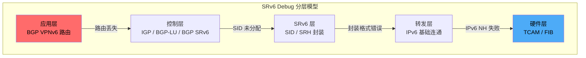
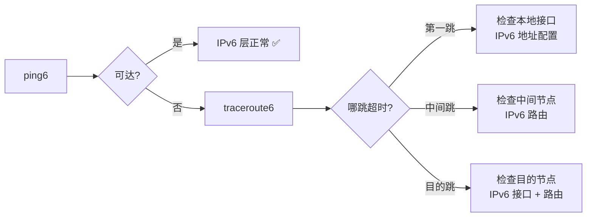
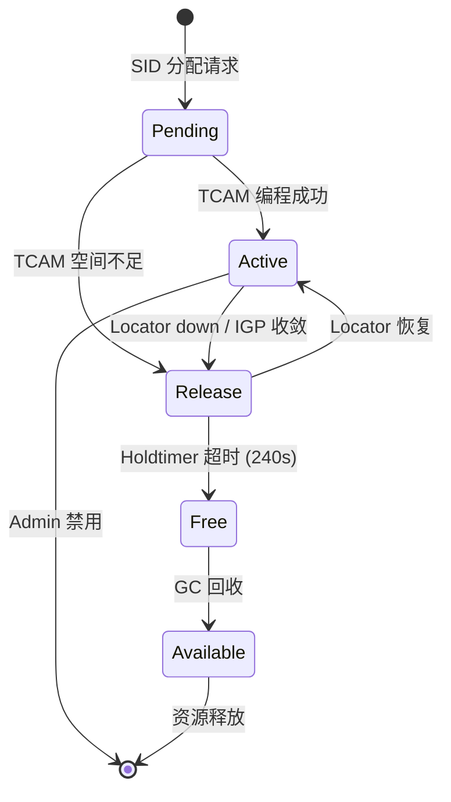
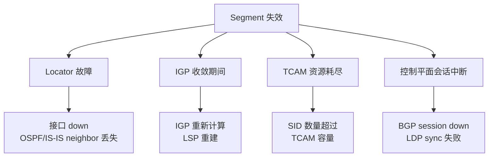
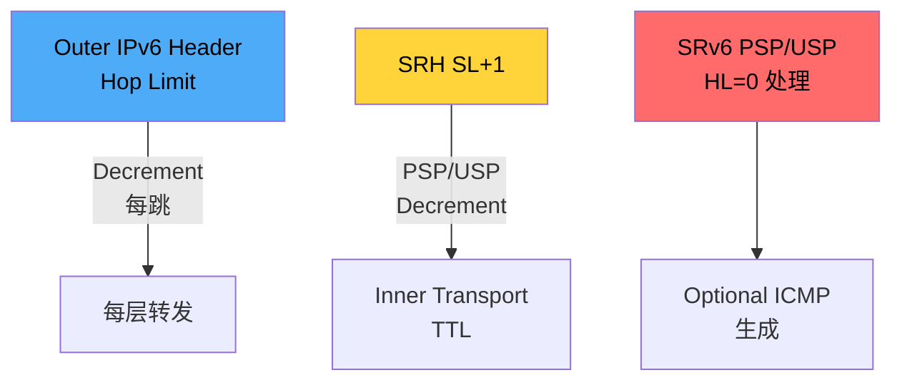
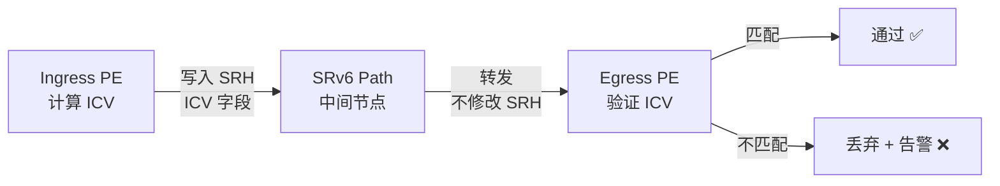
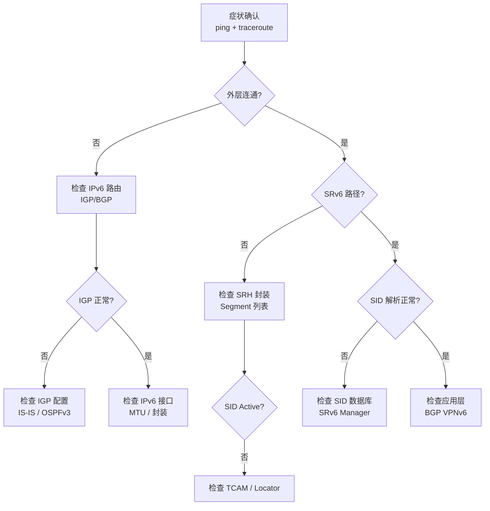

> [!info] SRv6 2026 深度探索系列
> 0. [[2026-04-14-srv6-comprehensive-learning-roadmap|SRv6 全栈学习路径总览]]
> ...
> 32. [[2026-04-14-srv6-deep-dive-ch32-deployment-migration|第三二章：部署与迁移运营]]
> **33. 第三三章：SRv6 常见错误与 Debug 实战**
> 34. [[2026-04-14-srv6-deep-dive-ch34-srv6-trace|第三四章：SRv6 Traceroute 与路径追踪]]
> 35. [[2026-04-14-srv6-deep-dive-ch35-srv6-perf|第三五章：SRv6 性能监控与基准测试]]
> 36. [[2026-04-14-srv6-deep-dive-ch36-srv6-tools|第三六章：SRv6 工具链与模拟器]]

---

## 1. 概述：SRv6 Debug 的核心挑战

SRv6 网络故障排查的核心困难在于**多层协议栈的交叉影响**——一个端到端连通性问题可能源于 IPv6 基础连通性、IGP 收敛、BGP SRv6 VPN 会话、SRH 封装格式、或硬件转发等多个层面。本章系统梳理 SRv6 常见错误类型，提供分级诊断流程与 Debug 命令实战技巧。



> [!tip] Debug 第一原则
> **从下往上逐层排查**——先确认底层 IPv6 连通性，再逐步检查 SRv6 封装、Segment 列表、最后到控制平面路由。

---

## 2. 常见错误分类矩阵

### 2.1 错误优先级分类

| 优先级 | 错误类型 | 症状 | 平均修复时间 |
| :--- | :--- | :--- | :--- |
| **P0** | 路径完全中断 | traceroute 超时，ping 不通 | 15-30 min |
| **P0** | TCAM 溢出 | 新 SID 无法编程，流量丢失 | 5-15 min |
| **P0** | ICV 校验失败 | SRv6 包被大量丢弃 | 10-20 min |
| **P1** | SID 分配失败 | SID 状态为 Release/Pending | 30-60 min |
| **P1** | Segment 栈深度超限 | 复杂路径包被丢弃 | 20-40 min |
| **P2** | 计数器失步 | HW/SW 计数器偏差 > 1% | 2-4 h |
| **P2** | MTU/Fragment 问题 | 大包分片丢包 | 1-2 h |
| **P3** | 性能劣化 | 延迟增加但未中断 | 4-8 h |

### 2.2 错误码与症状映射

| 错误码 | 协议层 | 含义 | 典型症状 |
| :--- | :--- | :--- | :--- |
| `0x0101` | SRH | Segment Left == 0 但仍有 SRH | 包被错误转发到错误节点 |
| `0x0102` | SRH | DA 不匹配本地任何 SID | 包被转发到 IPv6 默认路由 |
| `0x0103` | SRH | SRH 长度与 Segment 数量不符 | 包被丢弃或错转 |
| `0x0201` | ICV | ICV 校验失败 | ICV error 计数器激增 |
| `0x0301` | TTL | SRv6 内部 TTL 到期 | traceroute 在某跳中断 |
| `0x0401` | MTU | 包长度超过出口 MTU | 分片或丢包 |
| `0x0501` | SID | SID 未找到（Release 状态） | 流量绕行或丢失 |

---

## 3. 分层 Debug 命令实战

### 3.1 硬件层检查 (Layer 0-1)

```bash
# Cisco IOS-XR: 检查接口与光功率
show controllers tenGigE 0/0/0/0
show optics 0/0/0/0

# Juniper Junos: 检查接口状态
show interfaces ge-0/0/0 extensive
show interface ge-0/0/0 optics

# Huawei: 检查光模块
display interface GigabitEthernet 0/0/0
display optic-info interface GigabitEthernet 0/0/0
```

> [!warning] 硬件故障最容易被忽视
> 30% 以上的 SRv6 故障最终根因是物理层问题——光模块老化、光纤弯曲过度、DAC 线缆损坏。排查时务必从物理层开始。

### 3.2 IPv6 转发层检查 (Layer 2)

```bash
# Cisco IOS-XR: IPv6 基础连通性
show ipv6 interface brief
show ipv6 route <prefix>
show ipv6 neighbors

# Juniper Junos
show route table inet6.0
show ipv6 neighbors

# Huawei
display ipv6 routing-table
display ipv6 neighbors
```

**IPv6 连通性 Debug 流程：**



### 3.3 SRv6 SID 层检查 (Layer 2.5)

```bash
# Cisco IOS-XR: SRv6 SID 状态检查
show segment-routing srv6 sid
show segment-routing srv6 locator
show segment-routing srv6 manager

# 详细 SID 信息
show segment-routing srv6 sid detail

# 示例输出:
# SID: FC00:0:1:1::1
#   Locator: FC00:0:1:1::/64
#   Algorithm: 0 (SPF)
#   State: Active
#   HW operation count: 1523421
```

```bash
# Juniper Junos: SRv6 SID 检查
show srv6 sid
show srv6 locator
show srv6 interface

# Huawei: SRv6 SID 状态
display srv6 sid
display srv6 locator
```

**SID 状态机与 Debug：**



### 3.4 SRv6 SRH 层检查 (Layer 3)

```bash
# Cisco IOS-XR: SRv6 封装统计
show segment-routing srv6 encapsulation stats
show segment-routing srv6 forwarding

# 查看 SRH 详细信息
show segment-routing srv6 sid-database

# Juniper Junos
show srv6 forwarding
show srv6 traffic-eng
show srv6 segment-list
```

**SRH 封装 Debug 检查清单：**

- [ ] `segments_left` 值是否正确（每跳转减 1）
- [ ] `segment_list[0]` 是否指向正确的下一跳 SID
- [ ] `hdr_ext_len` 是否与 Segment 数量匹配
- [ ] ICV 字段是否存在且正确（如果配置了 ICV）
- [ ] Next Header 是否指向正确的内层协议

---

## 4. Segment 失效故障深度分析

### 4.1 Segment 失效的四大根因



### 4.2 Locator 故障排查

```bash
# 检查 Locator 配置
# Cisco IOS-XR
show segment-routing srv6 locator
show running-config segment-routing srv6

# Juniper Junos
show configuration protocols isis srv6 locator
```

**Locator 故障典型案例：**

> [!example] 案例：Locator 接口 OSPF 邻居震荡导致 SID flapping
>
> **症状**：`show srv6 sid` 显示某节点 SID 频繁在 Active/Release 间切换
>
> **排查过程**：
> ```bash
> # Step 1: 检查 IGP 邻居状态
> show osp3 neighbor
> # 结果: Neighbor 状态不稳定 ❌
> 
> # Step 2: 检查接口指标
> show interfaces ge-0/0/0/0 | include error
> # 结果: Input errors 激增 ⚠️
> 
> # Step 3: 检查光功率
> show controllers tenGigE 0/0/0/0 | include power
> # 结果: 接收功率 -15dBm（接近阈值）⚠️
> ```
>
> **根因**：光模块接收功率接近临界值，导致 IGP 邻居关系震荡
>
> **修复**：更换光模块，SID 稳定恢复 Active

### 4.3 TCAM 资源耗尽排查

```bash
# Cisco IOS-XR: TCAM 使用率检查
show controllers npu resources tcam location 0/0/CPU0

# Juniper Junos
show pfe forwarding tcam usage

# Huawei
display forward-plane tcam resource
```

**TCAM 耗尽告警阈值：**

| 使用率 | 风险等级 | 行动 |
| :--- | :--- | :--- |
| < 70% | 正常 | 监控 |
| 70-85% | 警告 | 计划扩容 |
| 85-95% | 严重 | 立即清理无用 SID |
| > 95% | 临界 | 新 SID 无法编程，紧急处理 |

> [!warning] TCAM 溢出影响是**静默的**
> TCAM 满后，新的 SID 会处于 Pending 状态但不影响已有流量。容易被忽视直到网络变更触发新 SID 分配失败。

### 4.4 Segment 栈深度超限

SRv6 Segment 栈深度受限于：
1. **协议限制**：RFC 8200 IPv6 Extension Header 总长度 ≤ 1280 字节
2. **硬件限制**：TCAM 深度、转发芯片支持
3. **性能限制**：深度栈带来 CPU/Switching ASIC 负载增加

```bash
# 检查 Segment 栈深度分布
show segment-routing srv6 segment-list statistics

# 检查因深度超限被丢弃的包
show segment-routing srv6 counters discard | match "segment.*depth"
```

**栈深度与 SID 格式关系：**

| SID 格式 | SID 长度 | 最大 Segment 数（含 SRH 元数据） |
| :--- | :--- | :--- |
| 标准 128-bit | 16 字节 | ~78 层 |
| uSID 压缩 | 16 字节（4×4） | ~300 层 |
| uSID 12N | 12 字节 | ~103 层 |

---

## 5. TTL 处理深度解析

### 5.1 SRv6 TTL 作用域模型

SRv6 存在**三层 TTL**：



| TTL 层级 | 作用域 | 处理方式 | 相关 RFC |
| :--- | :--- | :--- | :--- |
| IPv6 Hop Limit | 整个 SRv6 路径 | 每跳减 1，到 0 丢包 | RFC 8200 |
| SRH Segment Left | Segment 栈 | 每 End behavior 减 1 | RFC 8754 |
| Inner transport TTL | 内层载荷 | PSP/USP Flavor 控制 | RFC 8986 |

### 5.2 TTL 相关故障排查

```bash
# 检查 TTL 处理配置
show segment-routing srv6 forwarding options

# 检查因 TTL 超时丢弃的包
show segment-routing srv6 counters discard | match "ttl"

# 检查 IPv6 Hop Limit
show ipv6 traffic | include "hop-limit"
```

**TTL 故障典型场景：**

> [!example] 场景：SRv6 路径 10 跳，traceroute 在第 8 跳中断
>
> **可能原因**：
> 1. 中间节点未配置 `Hop Limit propagation`（每跳不减）
> 2. 内层协议（TCP/UDP）TTL 先到期
> 3. 节点 PSP Flavor 未正确实现
>
> **Debug 命令**：
> ```bash
> # 在 Ingress PE 检查 Hop Limit
> show segment-routing srv6 forwarding trace |
>     include "hop-limit"
> 
> # 在中断跳检查节点配置
> show running-config srv6 | include "flavor\|psp\|usp"
> ```

### 5.3 PSP/USP Flavor 与 TTL

| Flavor | 行为 | TTL 处理 |
| :--- | :--- | :--- |
| **PSP** (Penultimate Segment Pop) | 在倒数第二跳弹出 SRH | SL→0 时，HL 传播到内层 |
| **USP** (Ultimate Segment Pop) | 在最后一跳弹出 SRH | HL 始终在内层保留 |
| **ST** (Shielded Transit) | 中间节点不处理 TTL | TTL 对中间节点不可见 |

```bash
# 检查节点 Flavor 支持
show srv6 locator detail | include "flavor\|psp\|usp"
```

---

## 6. ICV 校验失败 Debug

### 6.1 ICV 校验原理

ICV（Integrity Check Value）是 SRv6 可选的安全特性，用于验证 SRH 在传输过程中未被篡改。



### 6.2 ICV 故障排查流程

```bash
# 检查 ICV 错误计数器
show segment-routing srv6 security icv-counters
show srv6 counters icv-errors

# 检查 ICV 配置一致性
show srv6 security policy
show srv6 security keychain
```

**ICV 失败三大根因：**

| 根因 | 症状 | 解决方案 |
| :--- | :--- | :--- |
| 密钥不一致 | 跨厂商对接后大量 ICV 失败 | 统一密钥协商协议 |
| 中间节点修改 SRH | 路径上有非 ICV 感知节点 | 确保路径所有节点支持 ICV |
| 密钥轮换不同步 | ICV 失败周期性出现 | 同步密钥轮换时间窗口 |

> [!tip] ICV 问题定位技巧
> 如果 ICV 错误集中在特定时间段，可能与密钥轮换有关。如果持续错误，检查跨厂商兼容性。

---

## 7. 端到端 Debug 实战流程

### 7.1 标准 Debug 流程图



### 7.2 一键诊断脚本

```python
#!/usr/bin/env python3
"""
SRv6 Debug 自动化诊断脚本
适用于 Cisco IOS-XR / Juniper Junos / Huawei VRP
"""

import re
import subprocess
from typing import Dict, List, Tuple

VENDOR_COMMANDS = {
    "cisco_xr": {
        "ipv6_route": "show ipv6 route {prefix}",
        "srv6_sid": "show segment-routing srv6 sid",
        "srv6_locator": "show segment-routing srv6 locator",
        "srv6_counters": "show segment-routing srv6 encapsulation stats",
        "tcam": "show controllers npu resources tcam location 0/0/CPU0",
    },
    "juniper": {
        "ipv6_route": "show route table inet6.0 {prefix}",
        "srv6_sid": "show srv6 sid",
        "srv6_locator": "show srv6 locator",
        "srv6_counters": "show srv6 forwarding statistics",
        "tcam": "show pfe forwarding tcam usage",
    },
    "huawei": {
        "ipv6_route": "display ipv6 routing-table {prefix}",
        "srv6_sid": "display srv6 sid",
        "srv6_locator": "display srv6 locator",
        "srv6_counters": "display srv6 statistics",
        "tcam": "display forward-plane tcam resource",
    }
}

def run_ssh_command(host: str, cmd: str) -> str:
    """执行 SSH 命令"""
    result = subprocess.run(
        ["ssh", f"admin@{host}", cmd],
        capture_output=True, text=True, timeout=30
    )
    return result.stdout + result.stderr

def check_ipv6_connectivity(host: str, prefix: str, vendor: str) -> Dict:
    """检查 IPv6 连通性"""
    output = run_ssh_command(host, VENDOR_COMMANDS[vendor]["ipv6_route"].format(prefix=prefix))
    
    issues = []
    if "no route" in output.lower():
        issues.append("IPv6 route not found")
    if "unreachable" in output.lower():
        issues.append("Destination unreachable")
    
    return {
        "check": "IPv6 Route",
        "status": "PASS" if not issues else "FAIL",
        "issues": issues,
        "raw": output[:500]
    }

def check_srv6_sid_status(host: str, vendor: str) -> Dict:
    """检查 SRv6 SID 状态"""
    output = run_ssh_command(host, VENDOR_COMMANDS[vendor]["srv6_sid"])
    
    active_count = len(re.findall(r"State:\s*Active", output))
    release_count = len(re.findall(r"State:\s*Release", output))
    pending_count = len(re.findall(r"State:\s*Pending", output))
    
    issues = []
    if release_count > 0:
        issues.append(f"{release_count} SID(s) in Release state")
    if pending_count > 0:
        issues.append(f"{pending_count} SID(s) in Pending state")
    
    return {
        "check": "SRv6 SID Status",
        "status": "PASS" if not issues else "WARNING",
        "active": active_count,
        "release": release_count,
        "pending": pending_count,
        "issues": issues,
    }

def check_tcam_usage(host: str, vendor: str) -> Dict:
    """检查 TCAM 使用率"""
    output = run_ssh_command(host, VENDOR_COMMANDS[vendor]["tcam"])
    
    # 解析 TCAM 使用率（各厂商格式略有不同）
    usage_match = re.search(r"(\d+)%", output)
    usage = int(usage_match.group(1)) if usage_match else 0
    
    status = "PASS"
    if usage > 85:
        status = "WARNING"
    if usage > 95:
        status = "CRITICAL"
    
    return {
        "check": "TCAM Usage",
        "status": status,
        "usage_percent": usage,
        "issues": [f"TCAM at {usage}%"] if usage > 85 else []
    }

def full_diagnostic(host: str, vendor: str, prefix: str = None) -> List[Dict]:
    """执行完整诊断"""
    results = []
    
    results.append(check_ipv6_connectivity(host, prefix or "::/0", vendor))
    results.append(check_srv6_sid_status(host, vendor))
    results.append(check_tcam_usage(host, vendor))
    
    return results

if __name__ == "__main__":
    import sys
    if len(sys.argv) < 3:
        print("Usage: srv6_debug.py <host> <vendor> [prefix]")
        sys.exit(1)
    
    host, vendor = sys.argv[1], sys.argv[2]
    prefix = sys.argv[3] if len(sys.argv) > 3 else None
    
    results = full_diagnostic(host, vendor, prefix)
    
    print(f"\n=== SRv6 Diagnostic Report for {host} ===\n")
    for r in results:
        status_icon = "✅" if r["status"] == "PASS" else "⚠️" if r["status"] == "WARNING" else "❌"
        print(f"{status_icon} {r['check']}: {r['status']}")
        if r.get("issues"):
            for issue in r["issues"]:
                print(f"   - {issue}")
        print()
```

---

## 8. 跨厂商对接 Debug

### 8.1 跨厂商兼容性常见问题

| 问题类型 | Cisco IOS-XR | Juniper Junos | Huawei VRP |
| :--- | :--- | :--- | :--- |
| SID 格式 | 标准 128-bit | 标准 128-bit | 标准 128-bit + uSID |
| Flavor 支持 | PSP/USP/ST | PSP/USP/ST | PSP/USP |
| ICV 算法 | AES-GCM/CMAC | AES-GCM | AES-GCM |
| uSID 压缩 | 不支持 | 支持 | 支持 |
| BGP SRv6 NLRI | RFC 9012 | RFC 9012 | RFC 9012 + 扩展 |

### 8.2 跨厂商 Debug Checklist

```bash
# 1. 确认 BGP SRv6 能力协商
show bgp neighbor <peer> | include "srv6"

# 2. 确认 SID 格式兼容
show segment-routing srv6 sid | include "Format"

# 3. 检查 uSID 支持（如适用）
show srv6 micro-sid
```

> [!warning] 混合厂商环境特别注意事项
> - uSID 只在 Huawei 设备间可用，跨厂商必须使用标准 SID
> - ICV 算法必须统一，否则会导致静默丢包
> - PSP/USP Flavor 在旧版本 IOS-XR/Junos 可能不支持

---

## 9. 总结：SRv6 Debug 最佳实践

### 9.1 分层 Debug 方法论

```
┌─────────────────────────────────────────────────────────────┐
│  Layer 5-7: 应用层    → ping / traceroute / telnet         │
├─────────────────────────────────────────────────────────────┤
│  Layer 4:     传输层    → TCP/UDP 端口检查                  │
├─────────────────────────────────────────────────────────────┤
│  Layer 3:     SRv6 层  → show srv6 sid / show srv6 policy  │
├─────────────────────────────────────────────────────────────┤
│  Layer 2:     IPv6 层  → show ipv6 route / IPv6 neighbors  │
├─────────────────────────────────────────────────────────────┤
│  Layer 1:     物理层    → 接口状态 / 光功率 / 线缆          │
└─────────────────────────────────────────────────────────────┘
```

### 9.2 常用 Debug 命令速查

| 检查项 | Cisco IOS-XR | Juniper Junos | Huawei VRP |
| :--- | :--- | :--- | :--- |
| SID 状态 | `show sr srv6 sid` | `show srv6 sid` | `display srv6 sid` |
| Locator | `show sr srv6 locator` | `show srv6 locator` | `display srv6 locator` |
| 封装统计 | `show sr srv6 encap stats` | `show srv6 forwarding` | `display srv6 statistics` |
| ICV 错误 | `show sr srv6 security icv` | `show srv6 icv-errors` | `display srv6 icv-errors` |
| TCAM | `show ctrl npu resources tcam` | `show pfe tcam` | `display forward-plane tcam` |
| IPv6 路由 | `show ipv6 route` | `show route table inet6` | `display ipv6 routing-table` |

### 9.3 Debug 记录模板

```markdown
## SRv6 故障记录模板

**故障编号**: INC-2026-XXXX
**发生时间**: YYYY-MM-DD HH:MM
**影响范围**: [业务/用户影响描述]

### 现象描述
[详细描述故障现象]

### 排查过程
1. [时间] [操作] → [结果]
2. [时间] [操作] → [结果]

### 根因分析
[根本原因]

### 修复措施
[采取的修复步骤]

### 预防措施
[避免同类问题再次发生的措施]
```
