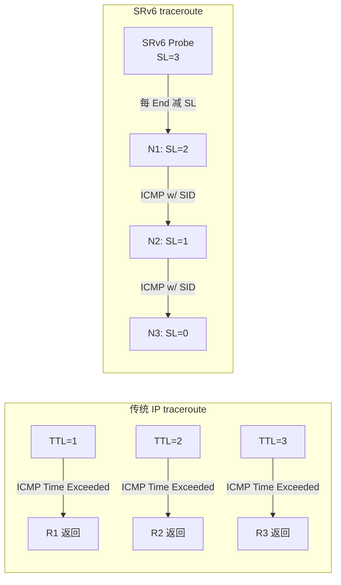
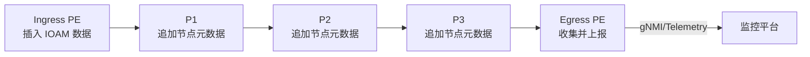
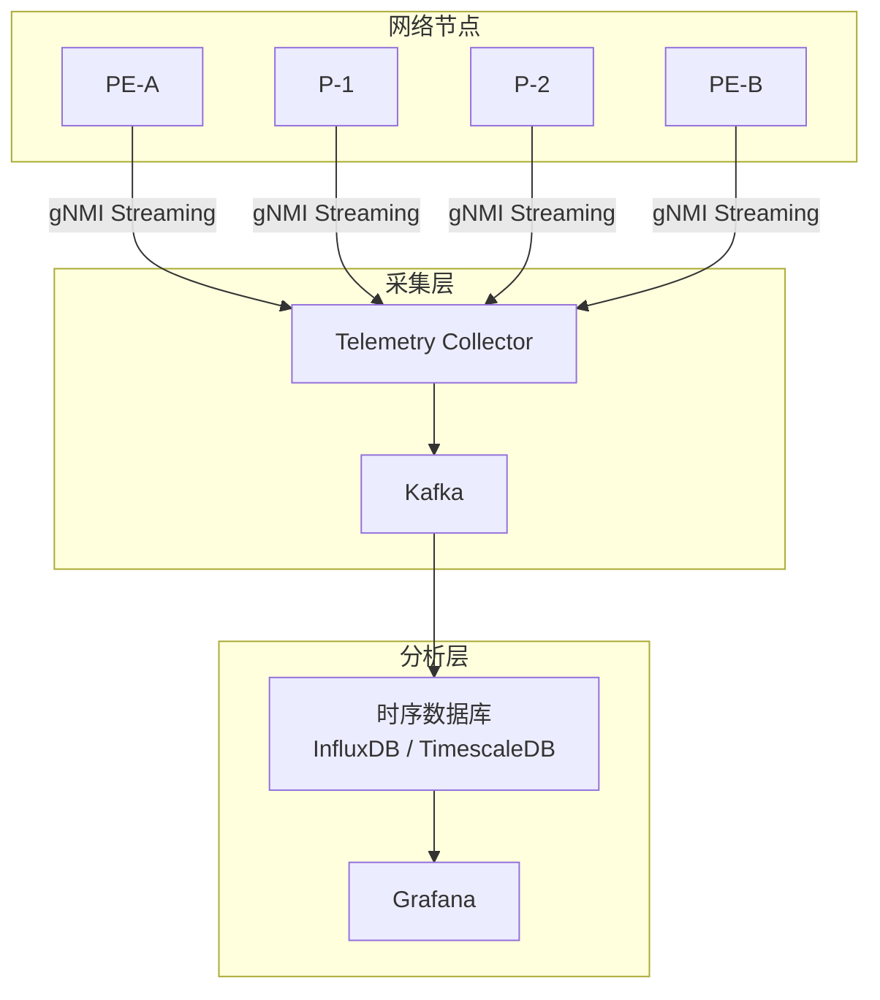

> [!info] SRv6 2026 深度探索系列 0. [[2026-04-14-srv6-comprehensive-learning-roadmap|SRv6 全栈学习路径总览]]
> ... 33. [[2026-04-14-srv6-deep-dive-ch33-srv6-debug|第三三章：SRv6 常见错误与 Debug 实战]]
> **34. 第三四章：SRv6 Traceroute 与路径追踪** 35. [[2026-04-14-srv6-deep-dive-ch35-srv6-perf|第三五章：SRv6 性能监控与基准测试]] 36. [[2026-04-14-srv6-deep-dive-ch36-srv6-tools|第三六章：SRv6 工具链与模拟器]]

---

## 1. 概述：SRv6 路径追踪的独特挑战

传统 IP traceroute 基于 TTL 过期机制，每跳路由器返回 ICMP Time Exceeded 消息。然而 SRv6 的**源路由模型**使得 traceroute 面临新的挑战：

1. **Segment Left 递减**：SRH 中的 Segments Left 字段独立于 IPv6 Hop Limit
2. **中间节点可见性**：只有执行 End/End.X 行为的节点才返回 ICMP
3. **路径隐蔽性**：源节点控制路径，traceroute 不能反映真实路由决策
4. **uSID 压缩问题**：压缩 SID 使得节点标识不直观



> [!tip] SRv6 traceroute 的价值
> SRv6 traceroute 不仅追踪路径，还能验证**每个 Segment 的 SID 是否正确工作**，以及**每跳的延迟/负载**情况。

---

## 2. SRv6 Traceroute 协议原理

### 2.1 RFC 9088: SRv6 Traceroute

SRv6 traceroute 在 RFC 9088 中定义，利用 ICMPv6 和 SRH 的交互实现路径探测：

```mermaid
sequenceDiagram
    participant C as 客户端
    participant PE1 as Ingress PE
    participant P1 as 中间节点
    participant P2 as 中间节点
    participant PE2 as Egress PE

    Note over C,PE2: Probe 1: SL=3
    C->>PE1: SRv6 Probe (DA=S1::, SL=3)
    Note over PE1: End behavior<br/>SL=2, 返回 ICMP
    PE1-->>C: ICMPv6 (Segment=S1::)

    Note over C,PE2: Probe 2: SL=2
    C->>PE1: SRv6 Probe (DA=S2::, SL=2)
    PE1->>P1: SRv6 (DA=S2::, SL=2)
    Note over P1: End behavior<br/>SL=1, 返回 ICMP
    P1-->>C: ICMPv6 (Segment=S2::)

    Note over C,PE2: Probe 3: SL=1
    C->>PE1: SRv6 Probe (DA=S3::, SL=1)
    PE1->>P1->>P2: SRv6 (DA=S3::, SL=1)
    Note over P2: End behavior<br/>SL=0, 返回 ICMP
    P2-->>C: ICMPv6 (Segment=S3::)
```

### 2.2 ICMPv6 在 SRv6 中的扩展

SRv6 traceroute 使用 ICMPv6 的 **Destination Unreachable** (type 3) 或 **Time Exceeded** (type 2) 消息，并在 ICMP 扩展中携带：

```bash
# ICMPv6 Extension for SRv6 traceroute
ICMPv6 Header:
  Type: 2 (Time Exceeded) 或 3 (Dest Unreachable)
  Code: 0
  Checksum: <icmp-checksum>

SRv6 Traceroute Extension (RFC 9088):
  - Original Address: 探测包的源 IPv6 地址
  - Original Segment List: 原始 Segment 列表
  - Current Segment: 当前节点的 SID
  - Segments Left: 剩余段数
  - Sender's Name: 节点标识符（可选）
```

### 2.3 Traceroute 报文格式详解

```
┌──────────────────────────────────────────────────────────────────────┐
│ Outer IPv6 Header                                                     │
│   Source: <Probe Originator>                                          │
│   Destination: <Target SID>                                           │
│   Next Header: 43 (Routing)                                           │
├──────────────────────────────────────────────────────────────────────┤
│ SRH (Segment Routing Header)                                           │
│   Next Header: 58 (ICMPv6)                                            │
│   Hdr Ext Len: 6 (根据 Segment 数量)                                 │
│   Segment Left: <N-M> (当前探测的段索引)                              │
│   Last Entry: N-1                                                      │
│   Segment List[0]: <SID_1>                                            │
│   Segment List[1]: <SID_2>                                            │
│   ...                                                                  │
│   Segment List[N-1]: <SID_N>                                          │
├──────────────────────────────────────────────────────────────────────┤
│ ICMPv6 Header                                                         │
│   Type: 2 (Time Exceeded) or 3 (Dest Unreachable)                     │
│   Code: 0                                                              │
│   Checksum: <icmp-checksum>                                           │
├──────────────────────────────────────────────────────────────────────┤
│ ICMPv6 Extension (RFC 9088)                                           │
│   Traceroute ID: <unique-probe-id>                                    │
│   Local Segment: <current-SID>                                        │
│   Segments Left: <SL-value-at-node>                                  │
│   Reserved: 0                                                          │
└──────────────────────────────────────────────────────────────────────┘
```

---

## 3. 厂商 Traceroute 命令实战

### 3.1 Cisco IOS-XR

```bash
# 基础 SRv6 traceroute
traceroute segment-routing srv6

# 指定目标的 SRv6 traceroute
traceroute segment-routing srv6 <destination-sid>

# 带源地址的 traceroute
traceroute segment-routing srv6 <destination-sid> source <source-sid>

# 显示详细 SID 信息
traceroute segment-routing srv6 <destination-sid> detail

# 示例输出:
# Type escape sequence to abort.
# Tracing the SRv6 path to 2001:db8::10
#  Router 1 [SF1::1]:   1  10.0.1.2   2.341 ms  2.198 ms  2.123 ms
#    Segment List[0]: SF1::1:1::  (Active)
#  Router 2 [SF2::1:2::]:  2  10.0.2.2   3.112 ms  2.987 ms  2.901 ms
#    Segment List[0]: SF2::1:2::  (Active)
#  Router 3 [SF3::1:3::]:  3  10.0.3.2   4.231 ms  4.102 ms  4.089 ms
#    Segment List[0]: SF3::1:3::  (Active)
```

### 3.2 Juniper Junos

```bash
# SRv6 traceroute
traceroute srv6 <destination-sid>

# 显示每跳详细信息
traceroute srv6 <destination-sid> detail

# 使用特定源 locator
traceroute srv6 <destination-sid> source-locator <source-locator>

# 带 TTL 限制
traceroute srv6 <destination-sid> ttl 10

# 示例输出:
# traceroute6 to 2001:db8::10 (via srv6)
# 1  2001:db8:1::1 (SF1::1:1::)  2.345 ms  2.123 ms  2.098 ms
# 2  2001:db8:2::1 (SF2::1:2::)  3.567 ms  3.234 ms  3.198 ms
# 3  2001:db8:3::1 (SF3::1:3::)  4.789 ms  4.543 ms  4.521 ms
```

### 3.3 Huawei VRP

```bash
# SRv6 traceroute
traceroute srv6 <destination-sid>

# 显示详细信息
traceroute srv6 <destination-sid> verbose

# 使用 segment-list
traceroute srv6 segment-list <sid-list>

# 示例输出:
# traceroute srv6 to 2001:db8::10
# 1  PE1 (FC00:0:1:1::1)  1.234 ms  1.098 ms  1.067 ms
# 2  P1 (FC00:0:2:1::1)   2.456 ms  2.321 ms  2.287 ms
# 3  P2 (FC00:0:3:1::1)   3.678 ms  3.543 ms  3.498 ms
# 4  PE2 (FC00:0:4:1::1)  4.890 ms  4.756 ms  4.723 ms
```

---

## 4. SRv6 Path Tracing 技术

### 4.1 Path Tracing vs Traceroute

传统 traceroute 是**主动探测**，而 Path Tracing 是**被动记录**：

| 特性     | Traceroute      | Path Tracing     |
| :------- | :-------------- | :--------------- |
| 方式     | 主动发送探测包  | 数据包携带元数据 |
| 开销     | 每跳需返回 ICMP | 内嵌于数据流     |
| 精度     | 依赖探测频率    | 100% 覆盖        |
| 延迟影响 | 引入额外延迟    | 无               |
| 适用场景 | 故障诊断        | 持续监控         |

### 4.2 SRv6 IOAM 路径追踪

SRv6 IOAM（In-situ Operations, Administration, and Maintenance）实现路径追踪：



**IOAM 数据字段：**

```bash
# IOAM Trace Type = 0x0C (Node ID + Timestamp + Transit Delay)
# 在 SRv6 中通过 SRH 扩展或 uSID metadata 携带
IOAM-Trace-Data:
  - Node ID: 节点唯一标识
  - Timestamp: 精确时间戳
  - Ingress Timestamp: 入向时间
  - Egress Timestamp: 出向时间
  - Queue Depth: 队列深度（可选）
  - Interface Index: 入出接口（可选）
```

### 4.3 华为 Path Tracing 配置

```bash
# 启用 SRv6 IOAM
system-view
srv6
  ioam enable
  ioam trace-type node-id-timestamp

# 配置 IOAM 导出
ioam profile <profile-id>
  export-to collector <collector-ip>
  export-protocol gRPC

# 查看 IOAM 统计数据
display srv6 ioam statistics
display srv6 ioam trace
```

---

## 5. SRv6 Telemetry 深度解析

### 5.1 gNMI/gRPC Telemetry 架构



### 5.2 SRv6 Telemetry 数据模型

```bash
# gNMI 路径: /srl/srv6/state/
SRv6 Telemetry Data Model:
├── locator
│   ├── name
│   ├── prefix
│   ├── state (Active/Release)
│   └── sid-count
├── sid
│   ├── sid-value
│   ├── behavior
│   ├── state
│   ├── packet-count
│   ├── byte-count
│   └── last-change
├── policy
│   ├── name
│   ├── candidate-path
│   ├── segment-list
│   ├── traffic-stats
│   └── active
└── counters
    ├── icv-errors
    ├── ttl-errors
    ├── malformed-srh
    └── drops
```

### 5.3 Telemetry 配置示例

**Cisco IOS-XR gRPC Telemetry：**

```bash
# 配置 gRPC
grpc
 port 57400
 service-layer
!
# 配置 Telemetry
telemetry model-driven
 destination-group <group-id>
  v6 address <collector-ip> port 57400
  encoding json
  transport grpc
 !
 sensor-group <sensor-id>
  sensor-path Cisco-IOS-XR-srv6-os-sal-grpc:srv6-locators
  sensor-path Cisco-IOS-XR-srv6-os-sal-grpc:srv6-sids
  sensor-path Cisco-IOS-XR-srv6-os-sal-grpc:srv6-policies
 !
 subscription <sub-id>
  sensor-group-id <sensor-id> sample-interval 10000
  destination-id <group-id>
```

**Juniper Junos JVision：**

```bash
# 配置 gRPC
set system services grpc port 50051
set system services grpc ssl-key /var/tmp/grpc.key
set system services grpc ssl-cert /var/tmp/grpc.crt

# 配置 OpenConfig sensor
set services input firewall srv6-policys
set services input firewall srv6-sids
set services input firewall srv6-locators

# 绑定到 gRPC 输出
set services output analytics grpc destination <collector-ip>
```

---

## 6. SRv6 traceroute 故障案例

### 6.1 案例：Traceroute 在中间跳无响应

> [!example] 场景：traceroute 显示前 3 跳正常，第 4 跳超时，第 5-6 跳正常
>
> **可能原因**：
>
> 1. 第 4 跳节点未使能 SRv6 traceroute response
> 2. ICMP rate-limit 导致探测包被丢弃
> 3. 节点处于低功耗状态（休眠/省电模式）
>
> **排查过程**：
>
> ```bash
> # Step 1: 检查超时跳节点的 traceroute 配置
> show segment-routing srv6 forwarding trace-options
>
> # Step 2: 检查 ICMP rate-limit
> show system stats icmp | include "rate-limit"
>
> # Step 3: 检查节点 SRv6 功能
> show srv6 interface
> ```
>
> **解决方案**：
>
> - 启用节点的 traceroute response 功能
> - 调整 ICMP rate-limit 配置
> - 检查节点电源管理策略

### 6.2 案例：Traceroute 显示错误的 SID

> [!example] 场景：traceroute 路径与实际配置不符
>
> **根因分析**：
>
> - IGP 收敛期间路径临时变化
> - ECMP 负载均衡导致不同探测走不同路径
> - 节点重新上线后 SID 状态未完全恢复
>
> **解决方案**：
>
> ```bash
> # 多次 traceroute 确认稳定性
> traceroute segment-routing srv6 <dest> repeat 10
>
> # 检查 IGP 邻居状态
> show isis neighbor
> show ospf3 neighbor
> ```

---

## 7. 自动化 traceroute 监控

### 7.1 Prometheus Exporter 示例

```python
#!/usr/bin/env python3
"""
SRv6 Traceroute Prometheus Exporter
收集 SRv6 路径延迟指标
"""

from prometheus_client import start_http_server, Gauge
import subprocess
import re
import time

# 定义指标
srv6_path_latency = Gauge(
    'srv6_path_latency_ms',
    'SRv6 path latency in milliseconds',
    ['source', 'destination', 'hop']
)

srv6_hop_packet_loss = Gauge(
    'srv6_hop_packet_loss_percent',
    'SRv6 hop packet loss percentage',
    ['source', 'destination', 'hop']
)

srv6_path_hops = Gauge(
    'srv6_path_total_hops',
    'Total number of hops in SRv6 path',
    ['source', 'destination']
)

def parse_traceroute_output(output: str, src: str, dst: str):
    """解析 traceroute 输出"""
    lines = output.strip().split('\n')
    hop_count = 0

    for line in lines:
        # 解析 hop 行（各厂商格式略有不同）
        match = re.search(r'\d+\s+(\S+).*?([\d.]+)\s*ms', line)
        if match:
            hop_count += 1
            sid = match.group(1)
            latency = float(match.group(2))

            srv6_path_latency.labels(
                source=src,
                destination=dst,
                hop=sid
            ).set(latency)

    srv6_path_hops.labels(source=src, destination=dst).set(hop_count)

def collect_traceroute_metrics(targets: list):
    """收集 traceroute 指标"""
    for src, dst in targets:
        try:
            result = subprocess.run(
                ['ssh', f'admin@{src}',
                 f'traceroute segment-routing srv6 {dst}'],
                capture_output=True, text=True, timeout=60
            )
            parse_traceroute_output(result.stdout, src, dst)
        except Exception as e:
            print(f"Error tracing {src} -> {dst}: {e}")

if __name__ == "__main__":
    start_http_server(9100)

    # 配置监控目标
    MONITOR_TARGETS = [
        ("pe-a", "2001:db8::10"),
        ("pe-b", "2001:db8::20"),
    ]

    while True:
        collect_traceroute_metrics(MONITOR_TARGETS)
        time.sleep(60)  # 每分钟采集一次
```

### 7.2 Grafana Dashboard 配置

```json
{
  "dashboard": {
    "title": "SRv6 Path Tracing Dashboard",
    "panels": [
      {
        "title": "SRv6 Path Latency",
        "type": "timeseries",
        "targets": [
          {
            "expr": "srv6_path_latency{source=~\"$source\", destination=~\"$dest\"}",
            "legendFormat": "{{hop}}"
          }
        ]
      },
      {
        "title": "SRv6 Path Hops",
        "type": "stat",
        "targets": [
          {
            "expr": "srv6_path_total_hops{source=~\"$source\", destination=~\"$dest\"}",
            "legendFormat": "Total Hops"
          }
        ]
      },
      {
        "title": "Hop-by-Hop Latency Heatmap",
        "type": "heatmap",
        "targets": [
          {
            "expr": "srv6_path_latency_bucket{source=~\"$source\", destination=~\"$dest\"}",
            "legendFormat": "{{le}}"
          }
        ]
      }
    ]
  }
}
```

---

## 8. 高级 traceroute 技巧

### 8.1 指定 Segment List 探测

```bash
# 使用自定义 Segment List 进行 traceroute
# 绕过正常 IGP 最短路径，测试指定路径

# Cisco IOS-XR
traceroute segment-routing srv6 <dest> segment-list <sid1> <sid2> <sid3>

# Juniper Junos
traceroute srv6 <dest> via SF1::1:1:: SF2::1:2::

# Huawei VRP
traceroute srv6 <dest> segment-list FC00:0:1:1::1 FC00:0:2:1::1
```

### 8.2 带 TTL 限制的探测

```bash
# 只探测到第 N 跳
traceroute segment-routing srv6 <dest> ttl 5

# 跳过前 N 跳
traceroute segment-routing srv6 <dest> probe-ttl 3
```

### 8.3 连续 traceroute 监控

```bash
# 连续 traceroute 检测路径稳定性
watch -n 5 'traceroute segment-routing srv6 <dest>'

# 输出到文件用于后续分析
nohup traceroute segment-routing srv6 <dest> repeat 1000 > /var/log/srv6_trace.log &
```

---

## 9. 总结：SRv6 Traceroute 最佳实践

### 9.1 Traceroute 使用场景

| 场景         | 推荐方法                 | 工具              |
| :----------- | :----------------------- | :---------------- |
| 快速故障定位 | 主动 traceroute          | 各厂商 CLI        |
| 持续路径监控 | Path Tracing + Telemetry | gNMI + Prometheus |
| 性能基准测试 | 多次 traceroute 统计     | 自定义脚本        |
| 路径变更检测 | 定时 traceroute 对比     | 自动化监控        |

### 9.2 常见问题与解决方案

| 问题              | 原因              | 解决方案                      |
| :---------------- | :---------------- | :---------------------------- |
| Traceroute 无响应 | 中间节点未使能    | 启用 SRv6 traceroute response |
| 延迟波动大        | 链路拥塞/路由动荡 | 结合 telemetry 分析           |
| SID 显示不一致    | ECMP 负载均衡     | 使用固定源端口重复探测        |
| 超时跳不固定      | 链路不稳定        | 物理层检查                    |
