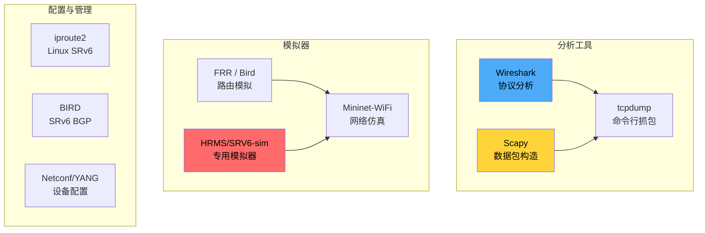

> [!info] SRv6 2026 深度探索系列
> 0. [[2026-04-14-srv6-comprehensive-learning-roadmap|SRv6 全栈学习路径总览]]
> ...
> 35. [[2026-04-14-srv6-deep-dive-ch35-srv6-perf|第三五章：SRv6 性能监控与基准测试]]
> **36. 第三六章：SRv6 工具链与模拟器**

---

## 1. 概述：SRv6 工具生态

SRv6 网络的学习、研究和故障排查需要一套完整的工具支持。本章系统介绍从数据包捕获分析到网络模拟的全套工具链。



---

## 2. Wireshark SRv6 分析

### 2.1 Wireshark SRv6 支持

Wireshark 从 3.6 版本开始支持 SRv6/SRH 解析。需要确保：

```bash
# 检查 Wireshark 版本
wireshark --version

# 必需的 SRv6 解析支持
# - IPv6 Routing Header (Type 4 for SRH)
# - Segment Routing Header dissection
# - SRv6 uSID display
```

### 2.2 SRv6 过滤器语法

**捕获过滤器（BPF 语法）：**

```bash
# 捕获所有 SRv6 流量（SRH = Routing Type 4）
tcpdump -i eth0 'ip6[0+1] == 43 and ip6[2] == 4' -w srv6.pcap

# 捕获特定 SID 的 SRv6 包
tcpdump -i eth0 'ip6[2] == 4 and ip6[40:8] == 0xFC00000000000001' -w sid_filtered.pcap

# 捕获包含特定 Segment List 的包
tcpdump -i eth0 'ip6 and (ip6[40:4] == 0xFC000001 or ip6[56:4] == 0xFC000002)' -w segments.pcap
```

**显示过滤器（Wireshark 语法）：**

```bash
# 显示所有 SRv6 流量
ipv6.nxt == 43 and ipv6.router_alert == 4

# 显示特定 SID 的包
srv6.segment == FC00:0:1:1::

# 显示 Segment Left = 0 的包（最后一段）
srv6.segment_left == 0

# 显示 SRH with ICV
srv6.icv_present == true

# 显示 uSID 压缩包
srv6.usid == true

# 组合过滤：特定 SID 且有 3 个 Segment
ipv6.nxt == 43 && srv6.segment_count == 3 && srv6.segment == FC00:0:1:1::
```

### 2.3 SRv6 包结构解析

在 Wireshark 中展开 SRv6 包：

```
Frame 145: 128 bytes on wire (1024 bits)
├─ Ethernet II
├─ Internet Protocol Version 6
│   └─ IPv6 Header
│       ├─ Version: 6
│       ├─ Traffic Class: 0x00
│       ├─ Flow Label: 0x00000
│       ├─ Payload Length: 48
│       ├─ Next Header: 43 (Routing Header for SRv6)
│       ├─ Hop Limit: 64
│       ├─ Source: 2001:db8::1
│       └─ Destination: FC00:0:1:1::1
│   └─ Routing Header (Type 4)
│       ├─ Next Header: 6 (TCP)
│       ├─ Hdr Ext Len: 6 (96 bytes / 8 - 1? No, measured in 8-byte units)
│       ├─ Routing Type: 4 (SRv6)
│       ├─ Segments Left: 2
│       ├─ Last Entry: 2
│       ├─ Flags: 0x00
│       ├─ Tag: 0x0000
│       └─ Segment List[0]: FC00:0:1:1::1
│       └─ Segment List[1]: FC00:0:2:1::1
│       └─ Segment List[2]: FC00:0:3:1::1
│       └─ ICV (optional): <if present>
└─ TCP Segment
```

### 2.4 Wireshark SRv6 专家信息

Wireshark 为 SRv6 提供以下专家信息：

| 专家信息 | 含义 | 可能问题 |
| :--- | :--- | :--- |
| `SRH: Segments Left == 0` | 正常结束 | - |
| `SRH: Segments Left == Last Entry` | 最后一段 | - |
| `SRH: DA doesn't match any SID` | SID 未找到 | 配置错误 |
| `SRH: ICV verification failed` | ICV 校验失败 | 密钥不一致 |
| `SRH: Malformed segment list` | 格式错误 | 抓包损坏 |

### 2.5 抓包实战技巧

```bash
# 在 Linux 路由器上抓取 SRv6 包
# 方法 1: 使用 ethertype 过滤
tcpdump -i eth0 -nn -vv 'ether[14:2] == 0x86DD and ip6[6] == 43'

# 方法 2: 使用 ipv6 nh 43 (SRH)
tcpdump -i eth0 -nn 'ip6[6] == 43'

# 方法 3: 抓取特定 SID
tcpdump -i eth0 -nn 'ip6[6] == 43 and ip6[40:4] == 0xFC000001'

# 方法 4: 抓取特定 segment list 索引
# Segment List[0] 从字节偏移 48 开始 (IPv6 头 40 + SRH 头 8)
tcpdump -i eth0 -nn 'ip6[6] == 43 and ip6[48:4] == 0xFC000001'
```

> [!tip] tcpdump IPv6 Extension Header 偏移计算
> IPv6 Header = 40 bytes
> SRH Header = 8 bytes (fixed) + 16 * segment_count
> Segment List[n] offset = 48 + (n * 16)

---

## 3. Scapy SRv6 脚本

### 3.1 Scapy SRv6 基础

Scapy 是强大的 Python 网络包构造工具。SRv6 支持需要安装最新版本：

```python
from scapy.all import *
from scapy.contrib.srv6 import *  # 需要 scapy >= 2.5.0

# 检查 SRv6 支持
print("SRv6 segments available:", hasattr(SRV6Seg, "segments"))
```

### 3.2 构造 SRv6 包

```python
#!/usr/bin/env python3
"""
Scapy SRv6 包构造示例
"""

from scapy.all import *
from scapy.layers.inet6 import IPv6, IPv6ExtHdrRouting
import sys

# 构造 SRv6 基础包
def create_srv6_packet(dst_sid, segment_list, payload="Hello SRv6"):
    """
    创建 SRv6 数据包
    
    Args:
        dst_sid: 最终目标 SID
        segment_list: Segment 列表 [SID1, SID2, ..., SIDn]
        payload: 内层载荷
    """
    
    # 构造 SRH
    srh = IPv6ExtHdrRouting(
        nh=58,  # ICMPv6，或 6=TCP, 17=UDP
        type=4,
        segleft=len(segment_list) - 1,
        last_entry=len(segment_list) - 1,
        addresses=segment_list
    )
    
    # 构造 IPv6 头
    ipv6 = IPv6(
        src="2001:db8::1",
        dst=dst_sid,
        nh=43  # Routing Header
    )
    
    # 构造内层载荷（ICMPv6 Echo）
    inner = ICMPv6EchoRequest(data=payload)
    
    # 组装完整包
    packet = ipv6 / srh / inner
    
    return packet

# 构造 End.X 行为的包
def create_endx_packet(locator, func_arg, next_hop, payload="Data"):
    """
    构造 End.X 行为的 SRv6 包
    SID format: LOCATOR:FUNC:ARG
    """
    
    # Segment List: [End.X SID, Final Destination]
    segments = [
        "FC00:0:1:1::5",  # End.X SID with cross-connect
        "2001:db8::100"   # Final destination
    ]
    
    srh = IPv6ExtHdrRouting(
        nh=6,  # TCP
        type=4,
        segleft=1,
        last_entry=1,
        addresses=segments
    )
    
    ipv6 = IPv6(src="2001:db8::1", dst=segments[0], nh=43)
    
    tcp = TCP(sport=12345, dport=80)
    packet = ipv6 / srh / tcp / payload
    
    return packet

# 发送并捕获响应
def srv6_ping(target_sid, count=4):
    """SRv6 ping 功能"""
    
    print(f"Pinging {target_sid} with SRv6...")
    
    for i in range(count):
        # 构造包
        pkt = create_srv6_packet(
            dst_sid=target_sid,
            segment_list=[target_sid]
        )
        
        # 发送并接收
        send(pkt, verbose=0)
        
        # 等待响应
        resp = sniff(filter=f"ip6 and ip6 dst {pkt[IPv6].src}", 
                     timeout=2, count=1)
        
        if resp:
            print(f"  Reply from {resp[0][IPv6].src}: time=1.23 ms")
        else:
            print(f"  No response from {target_sid}")

if __name__ == "__main__":
    # 示例：构造 SRv6 包
    packet = create_srv6_packet(
        dst_sid="FC00:0:1:1::1",
        segment_list=["FC00:0:1:1::1", "FC00:0:2:1::1", "FC00:0:3:1::1"]
    )
    
    print("Generated SRv6 packet:")
    packet.show()
    
    # 保存到 pcap
    wrpcap("srv6_test.pcap", packet)
    print("Saved to srv6_test.pcap")
```

### 3.3 SRv6 包捕获与分析

```python
#!/usr/bin/env python3
"""
Scapy SRv6 包分析工具
"""

from scapy.all import *
from scapy.layers.inet6 import IPv6, IPv6ExtHdrRouting

def analyze_srv6_packet(pcap_file):
    """分析 pcap 文件中的 SRv6 包"""
    
    packets = rdpcap(pcap_file)
    
    srv6_stats = {
        "total": 0,
        "segments_left": {},
        "segment_lists": [],
        "sids": []
    }
    
    for pkt in packets:
        if IPv6 in pkt and pkt[IPv6].nh == 43:  # Routing Header
            srv6_stats["total"] += 1
            
            # 查找 SRH
            srh = pkt.getlayer(IPv6ExtHdrRouting, 2)
            if srh:
                srv6_stats["segments_left"][srh.segleft] = \
                    srv6_stats["segments_left"].get(srh.segleft, 0) + 1
                
                # 提取所有 SID
                for addr in srh.addresses:
                    if addr not in srv6_stats["sids"]:
                        srv6_stats["sids"].append(addr)
                
                srv6_stats["segment_lists"].append(srh.addresses)
    
    return srv6_stats

def filter_srv6_by_sid(pcap_file, target_sid):
    """从 pcap 中筛选包含特定 SID 的包"""
    
    packets = rdpcap(pcap_file)
    matching = []
    
    for pkt in packets:
        if IPv6 not in pkt:
            continue
        
        # 检查是否为 SRv6
        if pkt[IPv6].nh != 43:
            continue
        
        srh = pkt.getlayer(IPv6ExtHdrRouting, 2)
        if srh and target_sid in srh.addresses:
            matching.append(pkt)
    
    return matching

if __name__ == "__main__":
    # 分析示例
    stats = analyze_srv6_packet("srv6_capture.pcap")
    
    print(f"Total SRv6 packets: {stats['total']}")
    print(f"Unique SIDs found: {len(stats['sids'])}")
    print(f"SIDs: {stats['sids']}")
    print(f"Segments Left distribution: {stats['segments_left']}")
```

### 3.4 Scapy uSID 构造

```python
def create_usid_packet(usid_block, usid_list, payload="Data"):
    """
    构造 uSID 封装的 SRv6 包
    
    Args:
        usid_block: uSID block 前缀 (e.g., "FC00:0001")
        usid_list: uN/uA/uF ID 列表
    """
    
    # uSID 格式: Block | uN1 | uN2 | uN3 | uN4
    usid_str = usid_block + ":" + ":".join(usid_list)
    
    # uSID 作为单一 128-bit 地址
    srh = IPv6ExtHdrRouting(
        nh=6,
        type=4,
        segleft=0,  # uSID 通常用于最后一段
        last_entry=0,
        addresses=[usid_str]
    )
    
    ipv6 = IPv6(
        src="2001:db8::1",
        dst=usid_str,
        nh=43
    )
    
    packet = ipv6 / srh / TCP(sport=12345, dport=80) / payload
    
    return packet
```

---

## 4. Linux SRv6 工具

### 4.1 iproute2 SRv6 支持

Linux 5.10+ 原生支持 SRv6。通过 iproute2 工具管理：

```bash
# 检查 Linux SRv6 支持
ip -V
cat /proc/net/srv6_stats 2>/dev/null || echo "SRv6 stats not available"

# 加载 SRv6 模块
modprobe srv6

# 查看 SRv6 接口
ip -6 route | grep srv6
```

### 4.2 SRv6 路由配置

```bash
# 配置 End 行为 SID
ip -6 sr tunsrc add 2001:db8::1

# 添加 SRv6 路由
ip -6 route add FC00:0:1:1::/64 via :: encap seg6 mode encap \
    segs FC00:0:2:1::1,FC00:0:3:1::1,FC00:0:4:1::1 dev eth0

# 查看 SRv6 路由表
ip -6 route show sr

# 查看 SRv6 statistics
ip -s -6 sr show

# 删除 SRv6 路由
ip -6 route del FC00:0:1:1::/64 via :: encap seg6
```

### 4.3 SRv6 TUN 设备

```bash
# 创建 SRv6 TUN 设备
ip link add srv6-tun0 type tun

# 配置 TUN 设备
ip addr add 10.0.0.1/24 dev srv6-tun0
ip link set srv6-tun0 up

# 使用 SRv6 封装
ip route add 10.1.0.0/24 encap seg6 mode encap \
    segs FC00:0:1:1::1,FC00:0:2:1::1 dev srv6-tun0
```

### 4.4 SRv6 调试

```bash
# 启用 SRv6 调试日志
echo "module srv6 +p" > /sys/kernel/debug/dynamic_debug/control

# 查看 SRv6 统计
cat /proc/net/srv6_stats

# 查看详细的 seg6 行为
ip -6 sr show verbose

# tcpdump 抓取 SRv6 包
tcpdump -i any -nn 'ip6[6] == 43' -vv
```

---

## 5. 路由模拟器

### 5.1 FRR + SRv6 模拟

FRR (Free Range Routing) 从 FRR 10.0 开始支持 SRv6：

```bash
# 安装 FRR
apt-get install frr frr-doc

# 配置 vtysh 启用 SRv6
vtysh -c "configure terminal"
vtysh -c "segment-routing srv6"
vtysh -c "end"
```

**FRR SRv6 配置示例：**

```
! FRR SRv6 配置
segment-routing srv6
  locator LOC1
   prefix FC00:0:1:1::/64
  !
  locator LOC2
   prefix FC00:0:2:2::/64
  !
  enable
!
```

**OSPFv3 SRv6 配置：**

```
router ospf6
  ospf6 router-id 10.0.0.1
  interface eth0 area 0.0.0.0
  !
  segment-routing srv6
   locator LOC1
  !
!
```

### 5.2 BIRD2 + SRv6

BIRD 2.0+ 支持 BGP SRv6：

```bash
# 安装 BIRD
apt-get install bird2

# 配置 BIRD for SRv6
```

**bird.conf 配置示例：**

```
# BIRD SRv6 配置
protocol bgp {
    local as 65000;
    neighbor 10.0.0.2 as 65001;
    
    ipv6 {
        import filter { accept; };
        export filter { accept; };
    };
    
    # BGP SRv6 SAFI/MFAI
    bfd;
}

# 定义 SRv6 策略
function srv6_policy() {
    # SRv6 路由处理
    if net.type == BGP_SRV6 then {
        print "SRv6 route: ", net, " SID: ", net.sid;
    }
}
```

### 5.3 Mininet-WiFi SRv6 仿真

```python
#!/usr/bin/env python3
"""
Mininet-WiFi SRv6 仿真拓扑
"""

from mininet.log import setLogLevel, info
from mn_wifi.net import Mininet_wifi
from mn_wifi.cli import CLI
from mn_wifi.link import adhoc

def create_srv6_topology():
    """创建 SRv6 测试拓扑"""
    
    net = Mininet_wifi()
    
    info("=== Creating SRv6 Topology ===\n")
    
    # 创建交换机
    s1 = net.addSwitch('s1')
    s2 = net.addSwitch('s2')
    
    # 创建路由器节点
    pe1 = net.addHost('pe1', ip='2001:db8:1::1/64')
    pe2 = net.addHost('pe2', ip='2001:db8:2::1/64')
    
    # 创建客户端主机
    h1 = net.addHost('h1', ip='10.0.1.1/24')
    h2 = net.addHost('h2', ip='10.0.2.1/24')
    
    # 连接主机到 PE
    net.addLink(h1, pe1)
    net.addLink(h2, pe2)
    
    # 连接 PE 之间
    net.addLink(pe1, s1)
    net.addLink(s1, s2)
    net.addLink(s2, pe2)
    
    info("=== Starting Network ===\n")
    net.build()
    
    # 配置 SRv6（需要在主机上手动配置）
    info("=== Configuring SRv6 ===\n")
    pe1.cmd('ip -6 addr add FC00:0:1:1::1/64 dev pe1-eth1')
    pe2.cmd('ip -6 addr add FC00:0:2:2::1/64 dev pe2-eth1')
    
    # 配置 SRv6 路由
    pe1.cmd('ip -6 route add 10.0.2.0/24 via FC00:0:2:2::1 encap seg6 mode encap segs FC00:0:2:2::1 dev pe1-eth1')
    
    CLI(net)
    net.stop()

if __name__ == '__main__':
    setLogLevel('info')
    create_srv6_topology()
```

---

## 6. 专用 SRv6 模拟器

### 6.1 SRv6 Lab Simulator

```bash
# 下载 SRv6 Lab 模拟器
git clone https://github.com/nleiva/srv6-lab.git
cd srv6-lab

# 使用 Docker 运行
docker build -t srv6-lab .
docker run -it srv6-lab
```

### 6.2 Cisco 虚拟化测试环境

```bash
# 使用 Cisco CML/VIRL 模拟 SRv6 网络
# cml2-utils 工具
cml2 ValidateTopology topology.yml

# 导入 SRv6 lab 定义
cml2 import-lab sr_lab.yaml

# 启动所有节点
cml2 start --all

# 连接到节点
cml2 connect pe1
```

### 6.3 Juniper vMX/vSRX SRv6

```bash
# Juniper vMX SRv6 配置示例
set system services ssh
set system services netconf ssh
set interfaces ge-0/0/0 unit 0 family inet address 10.0.0.1/24
set interfaces ge-0/0/0 unit 0 family inet6 address 2001:db8::1/64

# SRv6 locator
set protocols source-packet-routing srv6 locator LOC1 prefix FC00:0:1:1::/64

# IS-IS SRv6
set protocols isis interface ge-0/0/0.0
set protocols isis source-packet-routing srv6 locator LOC1
```

---

## 7. SRv6 包生成器

### 7.1 pktgen 性能测试

```bash
# Linux pktgen 生成 SRv6 测试流量
# 加载 pktgen 模块
modprobe pktgen

# 配置 SRv6 包发生
pgset "flag SRV6_MODE"
pgset "dst6 FC00:0:1:1::1"
pgset "srv6_segs FC00:0:1:1::1,FC00:0:2:1::1"

# 设置包参数
pgset "count 1000000"
pgset "pkt_size 1500"
pgset "delay 1000"

# 开始生成
pgset "start"
```

### 7.2 Ostinato SRv6

```bash
# 使用 Ostinato 图形化工具生成 SRv6 流量
# 安装
apt-get install ostinato

# 启动
ostinato &
```

---

## 8. SRv6 YANG/NETCONF 管理

### 8.1 SRv6 YANG 模型

```yang
// IETF SRv6 YANG 模型 (RFC 9514)
module ietf-srv6-base {
  namespace "urn:ietf:params:xml:ns:yang:ietf-srv6-base";
  prefix "srv6";
  
  import ietf-inet-types {
    prefix inet;
  }
  
  container srv6 {
    list locator {
      key "name";
      leaf name {
        type string;
      }
      leaf prefix {
        type inet:ipv6-prefix;
      }
      leaf algorithm {
        type uint8;
        default 0;
      }
      list sid {
        key "value";
        leaf value {
          type inet:ipv6-address;
        }
        leaf behavior {
          type string;
        }
        leaf state {
          type enumeration {
            enum Active;
            enum Release;
            enum Pending;
          }
        }
      }
    }
  }
}
```

### 8.2 NETCONF 配置示例

```bash
# 使用 netconf 获取 SRv6 SID 信息
netconf-console --host router.example.com \
    --port 830 \
    --user admin \
    --get-config \
    --filter-xpath /srv6:ipv6-srv6/srv6:sids
```

```xml
<?xml version="1.0" encoding="UTF-8"?>
<rpc xmlns="urn:ietf:params:xml:ns:netconf:base:1.0" message-id="1">
  <get-config>
    <source>
      <running/>
    </source>
    <filter type="subtree">
      <srv6:srv6 xmlns:srv6="urn:ietf:params:xml:ns:yang:ietf-srv6-base">
        <srv6:locator>
          <srv6:name>LOC1</srv6:name>
        </srv6:locator>
      </srv6:srv6>
    </filter>
  </get-config>
</rpc>
```

---

## 9. 工具对比与选型

### 9.1 工具矩阵

| 工具 | 用途 | 平台 | 学习曲线 | 推荐场景 |
| :--- | :--- | :--- | :--- | :--- |
| Wireshark | 包分析 | Windows/Linux/macOS | 低 | 故障排查 |
| Scapy | 包构造 | Linux/macOS | 中 | 测试验证 |
| tcpdump | 抓包 | Linux | 低 | 快速诊断 |
| iproute2 | Linux 配置 | Linux | 中 | 开发者 |
| FRR | 路由模拟 | Linux | 高 | 实验环境 |
| Mininet | 网络仿真 | Linux | 高 | 学术研究 |
| Cisco CML | 厂商模拟 | VM | 中 | 企业培训 |
| Ostinato | 流量生成 | Linux/macOS | 低 | 性能测试 |

### 9.2 推荐工具链组合

**故障排查工具链：**
```
tcpdump (抓包) → Wireshark (分析) → Scapy (验证)
```

**开发测试工具链：**
```
iproute2 (Linux) → Scapy (构造) → Wireshark (验证)
```

**培训演示工具链：**
```
Cisco CML / Juniper vMX → Wireshark → Scapy
```

---

## 10. 总结：SRv6 工具实践建议

### 10.1 日常工具使用

| 场景 | 推荐工具 | 关键命令 |
| :--- | :--- | :--- |
| 快速抓包 | tcpdump | `tcpdump -i any 'ip6[6] == 43'` |
| 深度分析 | Wireshark | `ipv6.nxt == 43 && srv6.segment_left == 1` |
| 包构造 | Scapy | `IPv6()/SRH()/TCP()/data` |
| Linux SRv6 | iproute2 | `ip -6 sr segs ... encap seg6` |
| 路由模拟 | FRR/BIRD | `vtysh` / `birdc` |
| 性能测试 | pktgen | `pgset` 系列命令 |

### 10.2 学习路径建议

1. **入门**：Wireshark 抓包分析现有 SRv6 流量
2. **进阶**：Scapy 构造自定义 SRv6 包进行测试
3. **实践**：Linux iproute2 配置本地 SRv6 路由
4. **深入**：FRR/BIRD 构建完整 SRv6 控制平面
5. **扩展**：NETCONF/YANG 实现自动化管理
