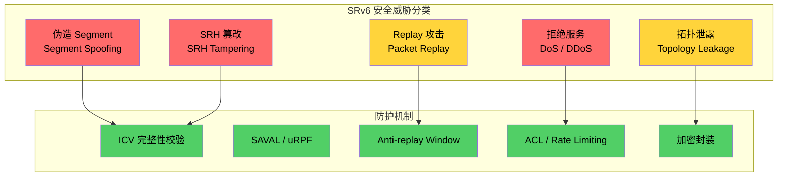
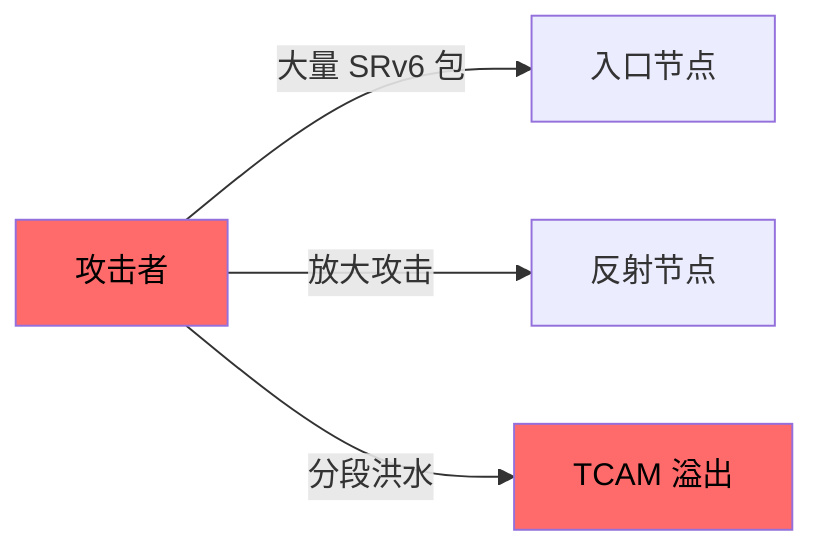
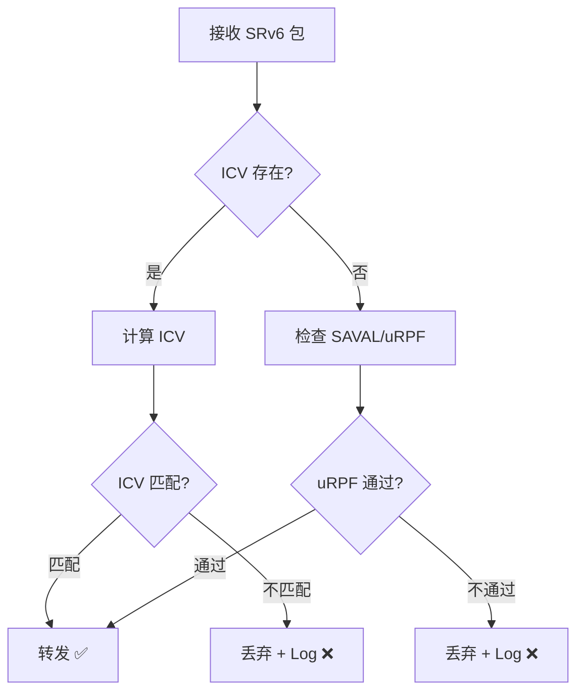
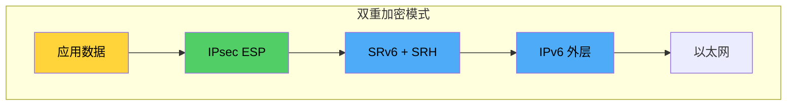

> [!info] SRv6 2026 深度探索系列
> 0. [[2026-04-14-srv6-comprehensive-learning-roadmap|SRv6 全栈学习路径总览]]
> ...
> 36. [[2026-04-14-srv6-deep-dive-ch36-srv6-tools|第三六章：SRv6 工具链与模拟器]]
> **37. 第三七章：SRv6 安全威胁与防护机制**
> 38. [[2026-04-14-srv6-deep-dive-ch38-srv6-security-rfc|第三八章：SRv6 Source Address Validation 与 uRPF]]
> 39. [[2026-04-14-srv6-deep-dive-ch39-srv6-ipsec|第三九章：SRv6 + IPsec 端到端加密]]
> 40. [[2026-04-14-srv6-deep-dive-ch40-srv6-perf|第四十章：SRv6 转发性能与 TCAM]]

---

## 1. 概述：SRv6 安全模型

SRv6 作为 IPv6 原生的 Segment Routing 技术，继承了 IPv6 的安全特性，同时也引入了新的安全挑战。理解 SRv6 的安全模型对于设计可靠的 SRv6 网络至关重要。



### 1.1 SRv6 vs SR-MPLS 安全对比

|| 安全维度 | SR-MPLS | SRv6 | 风险等级 |
|| :--- | :--- | :--- | :--- |
|| 标签伪造 | 需要 MPLS 标签操作知识 | 需要 IPv6 地址猜测 | SRv6 更高 |
|| 拓扑泄露 | 标签栈可反映网络拓扑 | 完整 IPv6 SID 暴露拓扑 | SRv6 更高 |
|| DoS 攻击面 | 标签处理简单 | SRH 解析更复杂 | SRv6 更高 |
|| 加密支持 | IPsec 封装 | IPsec + SRv6 双重封装 | 相当 |
|| 硬件支持 | 成熟 ACL/MACSEC | 部分支持 | SR-MPLS 更成熟 |

### 1.2 SRv6 安全标准体系

SRv6 安全相关 RFC 和草案：

| 文档 | 主题 | 状态 |
| :--- | :--- | :--- |
| RFC 8754 | SRv6 Handoff to Other Networks | Proposed Standard |
| RFC 8986 | SRv6 Network Programming | Proposed Standard |
| draft-ietf-spring-srv6-security | SRv6 Security | Internet-Draft |
| draft-ietf-spring-srh-validation | SRH Validation | Internet-Draft |

---

## 2. SRv6 安全威胁详解

### 2.1 Segment 伪造攻击 (Segment Spoofing)

攻击者构造包含伪造 SID 的 SRv6 包，试图：

- 将流量重定向到恶意节点
- 绕过安全策略
- 建立到内部网络的非法通道

```
正常 SRv6 路径：
[A] -> [B:End] -> [C:End] -> [D]

攻击者伪造路径：
[A] -> [B:End] -> [M:伪造节点] -> [D]
```

**攻击向量分析：**

```python
# 伪造的 SRv6 包示例
"""
IPv6 Header:
  Source: 2001:db8::attacker
  Destination: FC00:0:1:1::1  (伪造的 End SID)
  
SRH:
  Segments Left: 1
  Segment List[0]: FC00:0:1:1::1   # 伪造的中间节点
  Segment List[1]: 2001:db8::victim  # 真实目标
"""
```

### 2.2 SRH 篡改攻击 (SRH Tampering)

中间人攻击者修改 SRH 中的 Segment Left 或 Segment List：

| 攻击类型 | 修改内容 | 后果 |
| :--- | :--- | :--- |
| SL 修改 | Segments Left 值被篡改 | 路径跳跃错误 |
| Segment 替换 | Segment List 中 SID 被替换 | 流量重定向 |
| ICV 破坏 | 修改后重新计算 ICV | ICV 校验失败 |
| Flag 篡改 | PSP/USP Flag 被修改 | 转发行为异常 |

### 2.3 重放攻击 (Replay Attack)

攻击者记录有效 SRv6 流量的完整副本，然后在稍后时间重放：

- 利用已过期的 Segment 路径
- 绕过一次性策略
- 造成路由环路或状态混乱

### 2.4 DoS/DDoS 攻击

SRv6 DoS 攻击向量：



**放大攻击原理：**

```
攻击者发送: 小包 (64B) + 伪造源地址
反射节点处理: SRH 解析 + IPv6 转发
受害者收到: 放大后流量 (MTU 1500B+)
放大倍数: 20-30x
```

---

## 3. SRv6 ICV 完整性校验

### 3.1 ICV 机制原理

ICV（Integrity Check Value）提供 SRH 的端到端完整性保护：

```
┌─────────────────────────────────────────────────────────────┐
│ SRH with ICV                                                  │
├─────────────────────────────────────────────────────────────┤
│ IPv6 Header (40B)                                             │
├─────────────────────────────────────────────────────────────┤
│ SRH Base (8B)                                                 │
│   Next Header (1B)                                            │
│   Hdr Ext Len (1B) = 6                                        │
│   Routing Type (1B) = 4                                        │
│   Segments Left (1B)                                          │
│   Last Entry (1B)                                             │
│   Flags (1B) = 0x80 (ICV Present)                             │
│   Tag (2B)                                                    │
├─────────────────────────────────────────────────────────────┤
│ Segment List[0..n] (16B × n)                                  │
├─────────────────────────────────────────────────────────────┤
│ ICV (variable, 8B aligned)                                    │
│   - Cryptographic ICV using AES-GCM/CMAC                     │
│   - Covers SRH + Inner headers                               │
└─────────────────────────────────────────────────────────────┘
```

### 3.2 ICV 计算范围

```
ICV 覆盖范围：
┌──────────────┬────────────────────────────────┬──────────────┐
│ Outer IPv6   │ SRH + Inner Payload          │ ICV         │
│ Header       │ (被 ICV 保护)                 │ (跟在 SRH 后) │
└──────────────┴────────────────────────────────┴──────────────┘
      ↑                   ↑                        ↑
   不被保护           完整保护                  ICV 本身
```

### 3.3 ICV 配置示例

**Cisco IOS-XR ICV 配置：**

```bash
# 配置 SRv6 ICV 密钥
segment-routing srv6
  encap icv keychain SRV6-ICV-KEY
  !
  keychain SRV6-ICV-KEY
    key 1
      accept-lifetime 00:00:00 Jan 1 2024 infinite
      send-lifetime 00:00:00 Jan 1 2024 infinite
      key string cisco123
      algorithm aes-128-gcm
```

**Juniper Junos ICV 配置：**

```bash
# 配置 SRv6 安全参数
set protocols segment-routing-srv6 icv enable
set protocols segment-routing-srv6 icv key-chain SRV6-KEY-CHAIN
set protocols segment-routing-srv6 icv algorithm aes-128-gcm

# 配置密钥链
set security authentication key-chain SRV6-KEY-CHAIN key 1 
    key-string "juniper456"
    algorithm aes-128-gcm
    lifetime start-time 2024-01-01.00:00:00
```

### 3.4 ICV 验证失败处理



---

## 4. SRv6 ACL 防护机制

### 4.1 SRv6 ACL 分类

| ACL 类型 | 作用 | 典型部署位置 |
| :--- | :--- | :--- |
| SRv6 入口 ACL | 过滤伪造 SID 流量 | Ingress PE / Edge Router |
| SRv6 转发 ACL | 控制 Segment 栈深度 | 核心节点 |
| SRv6 出口 ACL | 验证目标 SID 合法性 | Egress PE |
| SRv6 Segment ACL | 基于 SID 的精细控制 | 全网节点 |

### 4.2 Cisco IOS-XR SRv6 ACL 配置

```bash
# 创建 SRv6 扩展 ACL
ipv6 access-list SRV6-SECURITY
  # 允许已知 SID 范围
  permit srv6 any FC00:0:1::/32 any
  permit srv6 any FC00:0:2::/32 any
  
  # 允许特定行为
  permit srv6 behavior end any any
  permit srv6 behavior end-x any any
  
  # 拒绝所有其他 SRv6 流量
  deny srv6 any any any
  
  # 允许普通 IPv6（非 SRv6）
  permit ipv6 any any

# 应用到接口
interface GigabitEthernet 0/0/0/0
  ipv6 access-group SRV6-SECURITY ingress
```

### 4.3 Juniper Junos SRv6 ACL 配置

```bash
# 创建 SRv6 过滤策略
set firewall family inet6 filter SRV6-FILTER term 1 
    from next-header 43
    from srv6-segment FC00:0:1::/32
    then accept

set firewall family inet6 filter SRV6-FILTER term 2
    from next-header 43
    from srv6-segment FC00:0:2::/32
    then accept

set firewall family inet6 filter SRV6-FILTER term 3
    from next-header 43
    from srv6-segment-list-depth above 8
    then log
    then discard

set firewall family inet6 filter SRV6-FILTER term REJECT-SPOOF
    from next-header 43
    from source-prefix-list UNAUTHORIZED-SOURCES
    then discard

# 应用到接口
set interfaces ge-0/0/0 unit 0 family inet6 filter input SRV6-FILTER
```

### 4.4 Huawei SRv6 ACL 配置

```bash
# 创建 SRv6 ACL
acl ipv6 name SRV6-SECURITY
  rule 5 permit srv6 segment FC00:0:1::/32
  rule 10 permit srv6 segment FC00:0:2::/32
  rule 15 permit srv6 behavior end
  rule 20 permit srv6 behavior end-x
  rule 25 deny srv6 
  rule 30 permit ipv6

# 应用到接口
interface GigabitEthernet 0/0/0
  ipv6 traffic-filter SRV6-SECURITY inbound
```

### 4.5 SRv6 Segment 栈深度限制

防止深度栈攻击导致 TCAM 溢出或转发性能下降：

```bash
# Cisco IOS-XR: 限制 Segment 栈深度
segment-routing srv6
  max-segments 8
  
# Juniper Junos: Segment 深度策略
set system sr-srv6 max-segments 8

# 验证配置
show srv6 max-segments
```

---

## 5. SRv6 与 IPsec 集成

### 5.1 SRv6 + IPsec 部署模式

SRv6 可以与 IPsec 形成多层安全防护：



### 5.2 SRv6 + IPsec 封装顺序

| 模式 | 封装顺序 | 使用场景 |
| :--- | :--- | :--- |
| 路由协议加密 | IPsec -> SRv6 | Overlay 网络 |
| 传输模式 | SRv6 (传输) + IPsec | 端到端安全 |
| 隧道模式 | IPsec -> SRv6 -> IPsec | 双层加密 |

### 5.3 配置示例

**Cisco IOS-XR: SRv6 + IPsec：**

```bash
# 配置 IPsec 保护 SRv6 流量
crypto ipsec profile SRV6-IPSEC
  set transform-set ESP-AES-GCM-256
  set pfs group14
  set security-association lifetime seconds 3600
  
# 配置 SRv6 并应用 IPsec
segment-routing srv6
  encap ipsec
  ipsec profile SRV6-IPSEC
```

---

## 6. SRv6 安全最佳实践

### 6.1 纵深防御策略

```
┌─────────────────────────────────────────────────────────────┐
│ Layer 1: 物理层安全                                            │
│ - MACsec 端口安全                                             │
│ - 控制平面物理隔离                                             │
├─────────────────────────────────────────────────────────────┤
│ Layer 2: 数据平面安全                                          │
│ - SAVAL / uRPF Source Address Validation                     │
│ - ACL 过滤非法 SID                                            │
│ - ICV 完整性校验                                              │
├─────────────────────────────────────────────────────────────┤
│ Layer 3: 传输层安全                                            │
│ - IPsec ESP 加密                                              │
│ - NAT64 安全考量                                              │
├─────────────────────────────────────────────────────────────┤
│ Layer 4: 管理平面安全                                          │
│ - SSHv2 / NETCONF 安全                                       │
│ - RPKI 路由安全                                               │
│ - BMP 监控                                                    │
└─────────────────────────────────────────────────────────────┘
```

### 6.2 SID 管理安全规范

| 规范 | 说明 | 优先级 |
| :--- | :--- | :--- |
| SID 范围隔离 | 生产/测试/管理 SID 分离 | 必须 |
| SID 分配最小化 | 按需分配，避免过度分配 | 必须 |
| SID 生命周期管理 | 定期轮换、撤销过期 SID | 应该 |
| SID 监控 | 检测异常 SID 访问 | 应该 |
| SID 秘密管理 | 保护 ICV 密钥安全 | 必须 |

### 6.3 监控与响应

```bash
# Cisco IOS-XR: SRv6 安全计数器监控
show srv6 counters
show srv6 segments
show srv6 security counters

# 检测异常 SID 访问
show srv6 policy | include "invalid"

# Juniper Junos: 安全日志
show security log events | match srv6
show system commit server-events | match SRV6
```

---

## 7. 总结：SRv6 安全 checklist

> [!tip] SRv6 部署安全 checklist
> - [ ] 启用 ICV 完整性校验（跨 AS 流量）
> - [ ] 配置 uRPF/SAVAL 防止源地址伪造
> - [ ] 部署 SRv6 ACL 过滤非法 SID
> - [ ] 限制 Segment 栈深度（建议 ≤8）
> - [ ] IPsec 加密敏感流量
> - [ ] 定期轮换 ICV 密钥
> - [ ] 监控 SRv6 安全计数器
> - [ ] 分离生产/测试 SID 范围

---

**延伸阅读**

- [[2026-04-14-srv6-deep-dive-ch38-srv6-security-rfc|第三八章：SRv6 Source Address Validation 与 uRPF]]
- [[2026-04-14-srv6-deep-dive-ch39-srv6-ipsec|第三九章：SRv6 + IPsec 端到端加密]]
