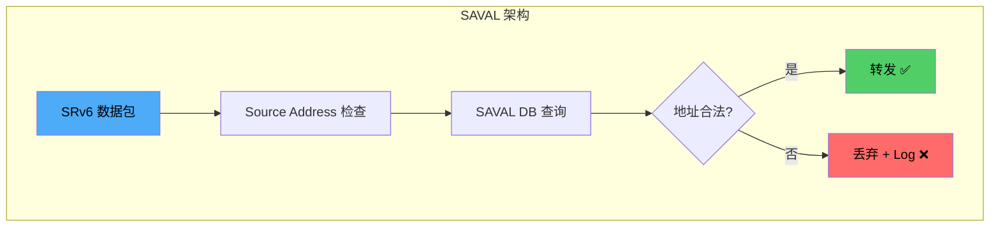
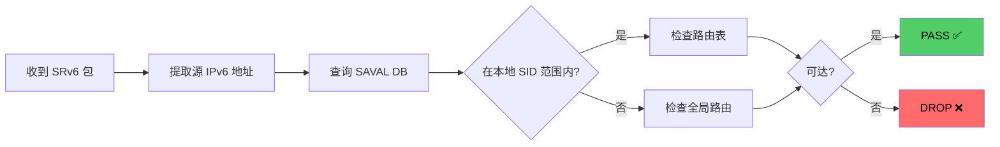
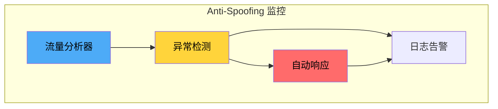
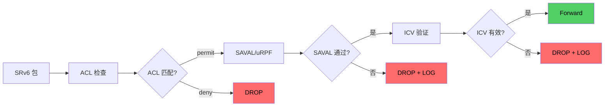

> [!info] SRv6 2026 深度探索系列
> 0. [[2026-04-14-srv6-comprehensive-learning-roadmap|SRv6 全栈学习路径总览]]
> ...
> 36. [[2026-04-14-srv6-deep-dive-ch36-srv6-tools|第三六章：SRv6 工具链与模拟器]]
> 37. [[2026-04-14-srv6-deep-dive-ch37-srv6-security|第三七章：SRv6 安全威胁与防护机制]]
> **38. 第三八章：SRv6 Source Address Validation 与 uRPF**
> 39. [[2026-04-14-srv6-deep-dive-ch39-srv6-ipsec|第三九章：SRv6 + IPsec 端到端加密]]
> 40. [[2026-04-14-srv6-deep-dive-ch40-srv6-perf|第四十章：SRv6 转发性能与 TCAM]]

---

## 1. 概述：Source Address Validation

Source Address Validation (SAVAL) 是 RFC 段落标题中的关键技术，用于防止伪造源地址的攻击。SRv6 网络中，SAVAL 与 uRPF (Unicast Reverse Path Forwarding) 共同构成源地址反欺诈的第一道防线。



### 1.1 SRv6 地址类型与验证策略

| 地址类型 | 格式 | 验证策略 | 示例 |
| :--- | :--- | :--- | :--- |
| 节点 SID | LOCATOR:FUNC:ARG | 验证 LOCATOR 属于本地 | FC00:0:1:1::1 |
| Anycast SID | LOCATOR:ANY:FUNC | 验证 LOCATOR 可达 | FC00:0:1:1::A |
| uSID | Block+uN1+uN2+uN3 | 验证 Block 注册 | FC00:0001:01:02:03:04:: |
| 业务 SID | 用户定义 | 验证路由存在 | 2001:db8:1::1 |

---

## 2. uRPF 在 SRv6 中的应用

### 2.1 uRPF 模式

uRPF (Unicast Reverse Path Forwarding) 有两种主要模式：

| 模式 | 行为 | 适用场景 |
| :--- | :--- | :--- |
| Strict Mode | 检查源地址的 FIB 下一跳是否是接收接口 | 对称路由网络 |
| Loose Mode | 检查源地址在 FIB 中存在任意可达路径 | 非对称路由网络 |

### 2.2 Strict Mode vs Loose Mode

```
Strict Mode 检查：
┌─────────────────────────────────────────────────┐
│ Packet arrives on Interface A                   │
│ Source Address = 2001:db8::1                   │
│ FIB lookup: 2001:db8::1 -> via Interface B     │
│                                                  │
│ Strict Mode: B != A → DROP ❌                   │
│ Loose Mode: 2001:db8::1 exists in FIB → PASS ✅ │
└─────────────────────────────────────────────────┘
```

### 2.3 SRv6 uRPF 配置

**Cisco IOS-XR uRPF 配置：**

```bash
# 接口级别启用 uRPF
interface GigabitEthernet 0/0/0/0
  ipv6 verify unicast source reachable-via any
  
# 启用 Strict Mode
interface GigabitEthernet 0/0/0/0
  ipv6 verify unicast source reachable-via usr-definated

# 配置 ACL 例外
ipv6 verify unicast source reachable-via allow-default
```

**Juniper Junos uRPF 配置：**

```bash
# 接口启用 uRPF
set interfaces ge-0/0/0 unit 0 family inet6 rpf-check

# 配置 Loose Mode
set interfaces ge-0/0/0 unit 0 family inet6 rpf-check mode loose

# 配置允许默认路由
set system rpf-free-mode
```

**Huawei uRPF 配置：**

```bash
# 启用 uRPF
interface GigabitEthernet 0/0/0
  ipv6 urpf loose

# 配置严格模式
interface GigabitEthernet 0/0/0
  ipv6 urpf strict
```

---

## 3. SAVAL 机制详解

### 3.1 SAVAL 工作原理

SAVAL (Source Address Validation Architecture) 是 IETF SAVNET 工作组提出的框架：



### 3.2 SAVAL 与 SRH 验证

SAVAL 需要验证两个层面：

| 验证对象 | 验证内容 | RFC 参考 |
| :--- | :--- | :--- |
| 外层 IPv6 源地址 | 源节点身份 | RFC 3704 |
| SRH Segment List | 路径完整性 | RFC 8754 |
| DA (Destination Address) | 当前处理节点 | RFC 8986 |

### 3.3 SAVAL 数据库结构

```
SAVAL Database:
┌────────────────────────────────────────────────────────┐
│ SID Registry                                             │
├────────────────────────────────────────────────────────┤
│ LOCATOR        │ SID Type  │ Owner      │ State         │
│ FC00:0:1::/32 │ End      │ Router-A   │ Assigned      │
│ FC00:0:1::/32 │ End.X    │ Router-A   │ Assigned      │
│ FC00:0:2::/32 │ End      │ Router-B   │ Assigned       │
│ FC00:0:2::/32 │ End.DT4  │ Router-B   │ Assigned       │
├────────────────────────────────────────────────────────┤
│ Route Registry                                           │
├────────────────────────────────────────────────────────┤
│ Prefix          │ Next Hop    │ Interface │ Metric       │
│ 2001:db8::/32  │ fe80::1     │ ge-0/0/0  │ 10           │
│ FC00:0:1::/48  │ fe80::2     │ ge-0/0/1  │ 20           │
└────────────────────────────────────────────────────────┘
```

---

## 4. Anti-Spoofing 策略

### 4.1 入口过滤 (Ingress Filtering)

RFC 2827 建议的入口过滤策略：

```bash
# 传统 IPv6 入口过滤 ACL
ipv6 access-list INGress-FILTER
  # 过滤私有地址（不应出现在互联网）
  deny ipv6 2001:db8::/32 any
  
  # 过滤链路本地（不应跨链路）
  deny ipv6 fe80::/10 any
  
  # 过滤本地链路（ULA）
  deny ipv6 fc00::/7 any
  
  # 过滤回环地址
  deny ipv6 ::1/128 any
  
  # 过滤未分配地址
  deny ipv6 ::/128 any
  
  # 允许合法源地址
  permit ipv6 2001:XXXX::/24 any
```

### 4.2 SRv6 特定 Anti-Spoofing

```bash
# SRv6 源地址白名单
ipv6 access-list SRV6-SOURCE-WHITELIST
  # 允许已知 SRv6 域的源地址
  permit ipv6 2001:db8:1::/48 any
  permit ipv6 2001:db8:2::/48 any
  
  # 拒绝来自管理 SID 范围的流量
  deny ipv6 FC00:0:FF00::/56 any
  
  # 拒绝来自伪造 Locator 的流量
  deny ipv6 FC00:0:1::/32 fe80::/10
```

### 4.3 流向追踪 (Flow-based Tracking)



---

## 5. SRv6 源地址验证配置实战

### 5.1 Cisco IOS-XR 完整配置

```bash
# 1. 配置 SRv6 locator 和 SID
segment-routing srv6
  locator LOC1 FC00:0:1:1::/64
  
# 2. 启用 SRv6 Source Address Validation
ipv6 source-route
ipv6 source-address-validation
  
# 3. 配置 uRPF
interface GigabitEthernet 0/0/0/0
  ipv6 verify unicast source reachable-via any
  
# 4. 配置 SAVAL 策略
ipv6 source-guard policy SRV6-SAVAL
  validate source-address
  validate reverse-path
  trusted target

# 5. 应用策略
ipv6 source-guard attach-policy SRV6-SAVAL interface all
```

### 5.2 Juniper Junos 完整配置

```bash
# 1. 配置 SRv6
set protocols segment-routing-srv6
set protocols segment-routing-srv6 locator LOC1
    prefix FC00:0:1:1::/64

# 2. 启用 RPF 检查
set interfaces ge-0/0/0 unit 0 family inet6 rpf-check

# 3. 配置 Source Address Filter
set firewall family inet6 filter SOURCE-FILTER term 1
    from source-address {
        2001:db8::/32;
        2001:db8:1::/48;
    }
    then accept

set firewall family inet6 filter SOURCE-FILTER term 2
    from source-address fc00::/7
    then log
    then discard

# 4. 应用过滤器
set interfaces ge-0/0/0 unit 0 family inet6 filter input SOURCE-FILTER
```

### 5.3 验证命令

```bash
# Cisco IOS-XR: 验证 uRPF 统计
show ipv6 urpf
show ipv6 traffic

# 检查丢弃计数器
show interfaces GigabitEthernet 0/0/0/0 | include drops

# Juniper: 验证 SAVAL 状态
show firewall filter SOURCE-FILTER
show source-guard policy SRV6-SAVAL

# 检查 RPF 统计
show interfaces ge-0/0/0 unit 0 family inet6 rpf-check
```

---

## 6. SAVAL 与现有安全的集成

### 6.1 与 ACL 的协同



### 6.2 与 IPsec 的集成

当 SRv6 流量使用 IPsec 加密时：

| 验证点 | 明文包 | 加密包 |
| :--- | :--- | :--- |
| 外层 IPv6 源地址 | ✅ uRPF 验证 | ✅ uRPF 验证 |
| 内层载荷源地址 | ✅ SAVAL 验证 | ❌ 无法验证（解密前） |
| SRH 完整性 | ✅ ICV 验证 | ✅ ICV 验证（ESP 内） |

---

## 7. 常见问题与故障排查

### 7.1 uRPF 导致正常流量被丢弃

**症状：** 合法源地址的流量被意外丢弃

**排查步骤：**

```bash
# 1. 检查 uRPF 统计
show ipv6 urpf interface GigabitEthernet 0/0/0/0

# 2. 检查 FIB 中该地址的路由
show ipv6 route 2001:db8::1

# 3. 检查接口配置
show interfaces GigabitEthernet 0/0/0/0 | include urpf

# 4. 临时切换到 Loose Mode
interface GigabitEthernet 0/0/0/0
  no ipv6 verify unicast source reachable-via any
  ipv6 verify unicast source reachable-via any loose
```

### 7.2 SAVAL DB 与实际路由不一致

**解决方案：**

```bash
# Juniper: 清除并重建 SAVAL DB
clear source-guard database
commit
```

---

## 8. 总结：SAVAL/uRPF 最佳实践

> [!tip] SRv6 Source Address Validation checklist
> - [ ] 在所有 SRv6 节点启用 uRPF（优先 Loose Mode）
> - [ ] 部署入口 ACL 过滤非授权源地址
> - [ ] 维护准确的 SID Registry
> - [ ] 监控 uRPF 丢弃计数器
> - [ ] 定期审计源地址白名单
> - [ ] 在对称路由路径使用 Strict Mode
> - [ ] 在非对称路由路径使用 Loose Mode

---

**延伸阅读**

- [[2026-04-14-srv6-deep-dive-ch37-srv6-security|第三七章：SRv6 安全威胁与防护机制]]
- [[2026-04-14-srv6-deep-dive-ch39-srv6-ipsec|第三九章：SRv6 + IPsec 端到端加密]]
