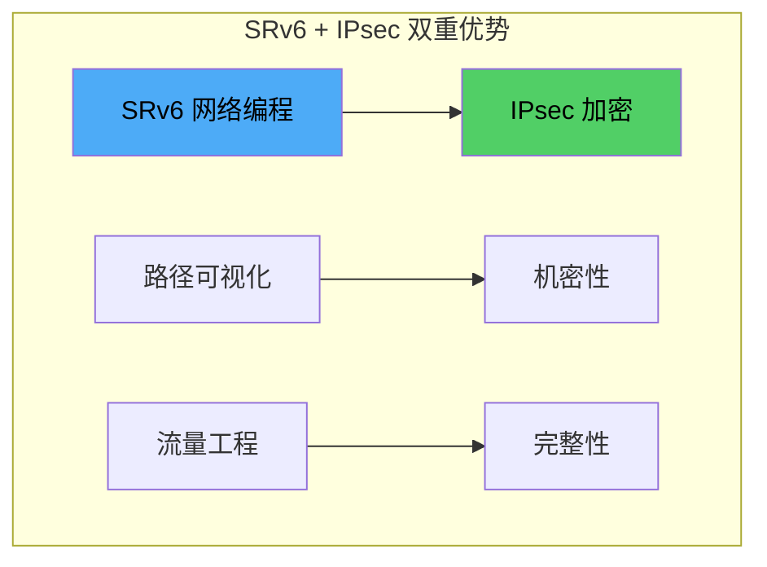
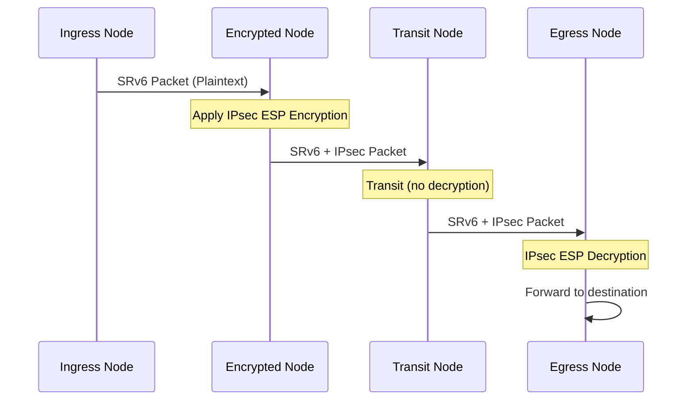
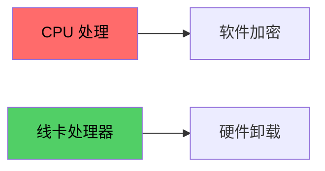

> [!info] SRv6 2026 深度探索系列
> 0. [[2026-04-14-srv6-comprehensive-learning-roadmap|SRv6 全栈学习路径总览]]
> ...
> 37. [[2026-04-14-srv6-deep-dive-ch37-srv6-security|第三七章：SRv6 安全威胁与防护机制]]
> 38. [[2026-04-14-srv6-deep-dive-ch38-srv6-security-rfc|第三八章：SRv6 Source Address Validation 与 uRPF]]
> **39. 第三九章：SRv6 + IPsec 端到端加密**
> 40. [[2026-04-14-srv6-deep-dive-ch40-srv6-perf|第四十章：SRv6 转发性能与 TCAM]]

---

## 1. 概述：SRv6 与 IPsec 集成

SRv6 提供了网络编程和流量工程能力，而 IPsec 提供了端到端加密保护。将两者结合可以实现**可编程的安全传输**——既保留 SRv6 的路径控制能力，又获得 IPsec 的机密性和完整性保护。



### 1.1 集成模式对比

| 模式 | SRv6 作用 | IPsec 作用 | 适用场景 |
| :--- | :--- | :--- | :--- |
| SRv6 Outer + IPsec Inner | 路径控制 | 载荷加密 | 传输模式 |
| IPsec Outer + SRv6 Inner | 载荷加密 | 路径控制 | 隧道模式 |
| SRv6 + IPsec 独立 | 各自独立 | 各自独立 | 双层保护 |

### 1.2 封装层次对比

```
模式 1: SRv6 Outer + IPsec Inner (传输模式)
┌─────────────────────────────────────────────────┐
│ Ethernet │ IPv6 (Outer) │ SRH │ IPsec ESP │ Inner IPv6 │ Data │
└─────────────────────────────────────────────────┘
            ↑ SRv6 路径          ↑ 加密载荷

模式 2: IPsec Outer + SRv6 Inner (隧道模式)
┌─────────────────────────────────────────────────┐
│ Ethernet │ IPsec ESP │ SRH │ Inner IPv6 │ Data │
└─────────────────────────────────────────────────┘
       ↑ 加密整个包     ↑ SRv6 路径

模式 3: SRv6 + IPsec 独立封装
┌─────────────────────────────────────────────────┐
│ Ethernet │ IPsec ESP │ IPv6 │ SRH │ Inner IPv6 │ Data │
└─────────────────────────────────────────────────┘
```

---

## 2. SRv6 + IPsec 封装流程

### 2.1 加密节点处理流程



### 2.2 加密前后对比

```
加密前 (Plaintext SRv6):
┌────────────────────────────────────────────────────────────┐
│ Src: 2001:db8::1    Dst: FC00:0:1:1::1                    │
├────────────────────────────────────────────────────────────┤
│ SRH: Segments Left=1                                       │
│   Segment[0]: FC00:0:2:1::1                                │
│   Segment[1]: FC00:0:3:1::1                                │
├────────────────────────────────────────────────────────────┤
│ Inner: TCP payload "Sensitive Data"                         │
└────────────────────────────────────────────────────────────┘

加密后 (SRv6 + IPsec ESP):
┌────────────────────────────────────────────────────────────┐
│ Src: 2001:db8::1    Dst: FC00:0:1:1::1   [OUTER IPv6]     │
├────────────────────────────────────────────────────────────┤
│ SRH: Segments Left=1                                       │
│   Segment[0]: FC00:0:2:1::1                                │
│   Segment[1]: FC00:0:3:1::1                                │
├────────────────────────────────────────────────────────────┤
│ ESP Header: SPI=0x1234                                     │
│ Encrypted: (TCP + Payload)                                 │
│ ESP Trailer: Padding + Pad Len + Next Header               │
│ ESP Auth: ICV                                              │
└────────────────────────────────────────────────────────────┘
```

---

## 3. Cisco IOS-XR SRv6 + IPsec 配置

### 3.1 IPsec 基础配置

```bash
# 1. 配置 ISAKMP 策略
crypto isakmp policy 10
 encryption aes-256-gcm
 group 14
 lifetime 86400

# 2. 配置 IPsec 变换集
crypto ipsec transform-set SRV6-IPSEC esp-aes-256-gcm
 mode transport

# 3. 配置 IPsec 配置文件
crypto ipsec profile SRV6-IPSEC-PROFILE
 set transform-set SRV6-IPSEC
 set pfs group14
```

### 3.2 SRv6 + IPsec 集成配置

```bash
# 4. 配置 SRv6 并启用 IPsec
segment-routing srv6
  encap ipsec
  ipsec profile SRV6-IPSEC-PROFILE
  
# 5. 配置 SRv6 locator
  locator LOC1 FC00:0:1:1::/64
  
# 6. 配置加密行为
  encryption-behavior encrypted
```

### 3.3 验证命令

```bash
# 检查 IPsec SA 状态
show crypto ipsec sa

# 检查 SRv6 IPsec 统计
show srv6 ipsec

# 检查加密计数器
show crypto engine connections active

# 检查 SRv6 + IPsec 包统计
show srv6 counters ipsec
```

---

## 4. Juniper Junos SRv6 + IPsec 配置

### 4.1 IPsec 配置

```bash
# 1. 配置 IKE
set security ike proposal SRV6-IKE-PROP
    authentication-method pre-shared-keys
    dh-group group14
    authentication-algorithm sha-256
    encryption-algorithm aes-256-gcm

set security ike policy SRV6-IKE-POLICY
    proposal-set standard
    pre-shared-key ascii-text "SRV6-SECRET-KEY"

set security ike gateway SRV6-GW
    ike-policy SRV6-IKE-POLICY
    address 2001:db8::1
    local-address 2001:db8::2
    external-interface ge-0/0/0

# 2. 配置 IPsec
set security ipsec proposal SRV6-IPSEC-PROP
    protocol esp
    authentication-algorithm hmac-sha-256-128
    encryption-algorithm aes-256-gcm

set security ipsec policy SRV6-IPSEC-POLICY
    proposal-set standard
    match-direction input

set security ipsec vpn SRV6-VPN
    bind-interface st0.0
    ike gateway SRV6-GW
    ipsec-policy SRV6-IPSEC-POLICY
```

### 4.2 SRv6 + IPsec 集成

```bash
# 3. 配置 SRv6
set protocols segment-routing-srv6
    locator LOC1
        prefix FC00:0:1:1::/64
        ipsec enable

# 4. 应用到接口
set interfaces ge-0/0/0 unit 0 family inet6 address 2001:db8::1/64
set interfaces ge-0/0/0 unit 0 family inet6 service-domain inside

# 5. 配置加密策略
set security policy SRV6-POLICY
    from zone trust
    to zone untrust
    match source-address any
    match destination-address any
    match application any
    then permit
```

### 4.3 验证命令

```bash
# 检查 IPsec SA
show security ipsec sa

# 检查 SRv6 加密状态
show services rpm probe-results

# 检查 SRv6 + IPsec 包统计
show services statistics ipsec
```

---

## 5. Huawei VRP SRv6 + IPsec 配置

### 5.1 IPsec 配置

```bash
# 1. 配置 IPsec 安全提议
ipsec proposal SRV6-PROPOSAL
 encapsulation-mode transport
 esp authentication-algorithm sha256
 esp encryption-algorithm aes-256

# 2. 配置 IPsec 安全策略
ipsec policy-template SRV6-TEMPLATE 1
 proposal SRV6-PROPOSAL

ipsec policy SRV6-POLICY 1 isakmp template SRV6-TEMPLATE

# 3. 配置 IKE
ike proposal SRV6-IKE-PROPOSAL
 encryption-algorithm aes-256
 authentication-algorithm sha256
 dh group14

ike peer SRV6-PEER
 ike-proposal SRV6-IKE-PROPOSAL
 remote-address 2001:db8::1
 pre-shared-key cipher SRV6-SECRET
```

### 5.2 SRv6 + IPsec 配置

```bash
# 4. 配置 SRv6
segment-routing ipv6
 locator LOC1
  prefix FC00:0:1:1::/64
```

---

## 6. 性能考量与优化

### 6.1 SRv6 + IPsec 性能开销

| 操作 | CPU 开销 | 延迟增加 | 吞吐下降 |
| :--- | :--- | :--- | :--- |
| AES-128-GCM | 中 | ~5% | ~10% |
| AES-256-GCM | 高 | ~10% | ~20% |
| AES-256-GCM + SRv6 | 很高 | ~15% | ~30% |

### 6.2 硬件卸载



**Cisco IOS-XR 硬件卸载：**

```bash
# 启用 IPsec 硬件卸载
crypto ipsec profile SRV6-IPSEC-PROFILE
  hw-module profile ipsec enable

# 验证卸载状态
show crypto ipsec hardware profile
```

**Juniper Junos 硬件卸载：**

```bash
# 配置 Junos 硬件卸载
set security ipsec vpn <vpn-name> hw-rxpad enable
set chassis fpc 0 pic 0 tunnel-services hw-checksum
```

---

## 7. 端到端加密场景

### 7.1 数据中心互联场景

```
DC1                           DC2
┌─────────────────────────────┐     ┌─────────────────────────────┐
│  SRv6 Domain                │     │  SRv6 Domain                │
│                             │     │                             │
│  [App] --> [vSRv6] --> [PE1]│ === │ [PE2] --> [vSRv6] --> [App]│
│         ↑                        │         ↑                     │
│    IPsec 隧道                  │    IPsec 隧道                   │
└─────────────────────────────┘     └─────────────────────────────┘
            ↑                               ↑
     SRv6 + IPsec 端到端隧道
```

### 7.2 云边界互联场景

```
Enterprise                      Cloud
┌──────────────┐           ┌──────────────────────────────┐
│ On-prem      │           │ Cloud VPC                     │
│ [CE] --------|-----------|[VGW]                         │
│   ↑          │  IPsec    │   ↑                          │
│   SRv6        │  隧道     │   SRv6                       │
│   + IPsec     │           │   + IPsec                    │
└──────────────┘           └──────────────────────────────┘
```

---

## 8. 故障排查

### 8.1 常见问题

| 问题 | 症状 | 解决方案 |
| :--- | :--- | :--- |
| IPsec SA 建立失败 | IKE Phase 1 超时 | 检查 ISAKMP 策略匹配 |
| SRv6 封装后 IPsec 失败 | ESP 包被丢弃 | 确认 MTU，启用 Path MTU Discovery |
| 加密后 SRv6 路径中断 | traceroute 显示丢包 | 检查 ICV 验证设置 |
| 性能严重下降 | 吞吐量下降 > 50% | 启用硬件卸载 |

### 8.2 调试命令

```bash
# Cisco IOS-XR: IPsec 调试
debug crypto ipsec
debug crypto isakmp
show crypto logging

# Juniper: 安全日志
show log messages | match "ike\|ipsec"
request security ike debug-level trace

# Huawei: IPsec 调试
debugging ipsec all
debugging Ike all
```

---

## 9. 总结：SRv6 + IPsec 最佳实践

> [!tip] SRv6 + IPsec 部署 checklist
> - [ ] 选择合适的加密算法（AES-256-GCM 优先）
> - [ ] 使用硬件卸载减轻 CPU 负担
> - [ ] 配置足够的 MTU（SRv6 + IPsec 开销约 60-80 字节）
> - [ ] 启用 IKEv2 以获得更好的移动性支持
> - [ ] 定期轮换预共享密钥
> - [ ] 监控 IPsec SA 建立失败率
> - [ ] 考虑 NAT-Traversal 穿越中间设备
> - [ ] 验证 SRv6 ICV 与 IPsec ESP ICV 兼容性

---

**延伸阅读**

- [[2026-04-14-srv6-deep-dive-ch37-srv6-security|第三七章：SRv6 安全威胁与防护机制]]
- [[2026-04-14-srv6-deep-dive-ch38-srv6-security-rfc|第三八章：SRv6 Source Address Validation 与 uRPF]]
- [[2026-04-14-srv6-deep-dive-ch40-srv6-perf|第四十章：SRv6 转发性能与 TCAM]]
