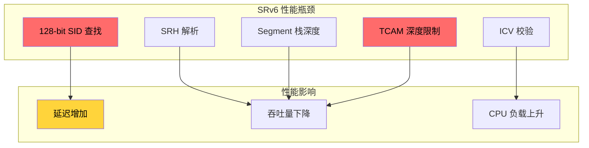
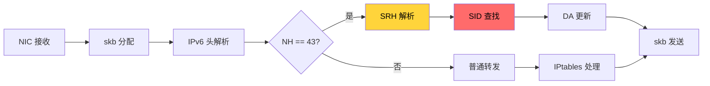
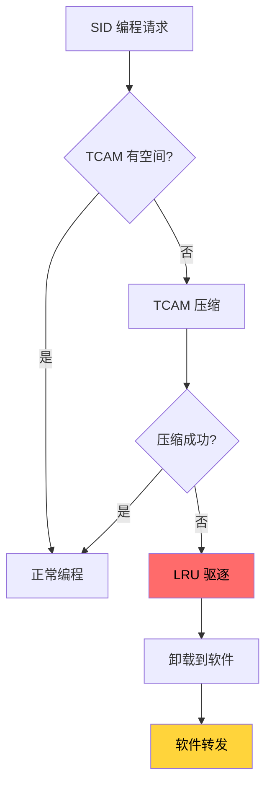
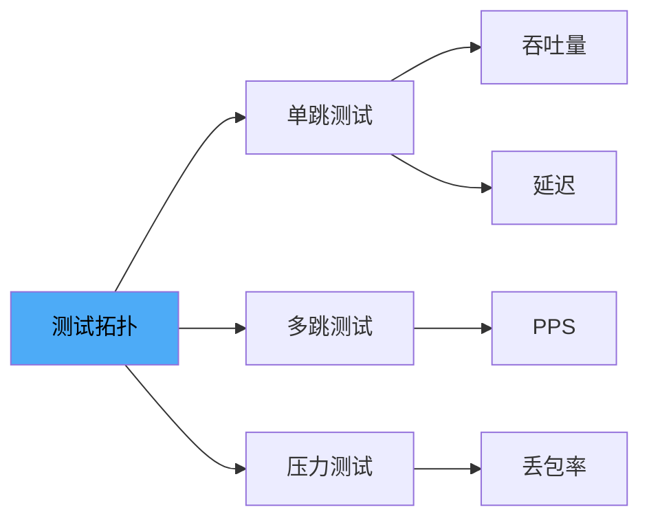

> [!info] SRv6 2026 深度探索系列 0. [[2026-04-14-srv6-comprehensive-learning-roadmap|SRv6 全栈学习路径总览]]
> ... 38. [[2026-04-14-srv6-deep-dive-ch38-srv6-security-rfc|第三八章：SRv6 Source Address Validation 与 uRPF]] 39. [[2026-04-14-srv6-deep-dive-ch39-srv6-ipsec|第三九章：SRv6 + IPsec 端到端加密]]
> **40. 第四十章：SRv6 转发性能与 TCAM**

---

## 1. 概述：SRv6 转发性能挑战

SRv6 的 128-bit SID 相比 SR-MPLS 的 32-bit 标签带来了独特的性能挑战。本章深入分析 SRv6 转发性能瓶颈、硬件与软件实现的差异、以及 TCAM 资源管理策略。



---

## 2. 硬件 vs 软件转发

### 2.1 转发架构对比

| 特性           | 软件转发 (Linux/iproute2) | 硬件转发 (ASIC/NPU) |
| :------------- | :------------------------ | :------------------ |
| SID 查找       | 128-bit hash table        | TCAM + RAM          |
| SRH 解析       | CPU 逐字节解析            | 硬件 Pipeline       |
| Segment 更新   | 内存读写                  | 寄存器操作          |
| 最大速率       | ~10 Gbps                  | ~400+ Gbps          |
| 延迟           | 50-100 μs                 | < 5 μs              |
| Segment 栈深度 | 实际无限制                | 受 TCAM 限制        |

### 2.2 软件转发路径 (Linux)



**Linux SRv6 软转发关键函数：**

```c
// Linux kernel: net/ipv6/srv6.c
static int srv6_xmit(struct sk_buff *skb, struct net_device *dev)
{
    struct ipv6_sr_hdr *srh;
    struct rt6_info *rt;
    struct dst_entry *dst;

    // 1. 解析 SRH
    srh = ipv6_srh(skb);
    if (!srh)
        return -EINVAL;

    // 2. SID 查找
    rt = srv6_lookup_sid(srh->segments + srh->segments_left);
    if (!rt)
        return -EREMOTEIO;

    // 3. 更新 DA 和 SL
    skb->dst = dst;
    ipv6_hdr(skb)->daddr = rt->rt6i_gateway;
    srh->segments_left--;

    // 4. 发送
    return dev_queue_xmit(skb);
}
```

### 2.3 硬件转发路径 (ASIC)

```
┌──────────────────────────────────────────────────────────────────┐
│ ASIC Pipeline                                                      │
├──────────────────────────────────────────────────────────────────┤
│ Stage 1: IPv6 解析                                                 │
│   - 提取 Src/Dst IP, NH, HL, FL                                    │
├──────────────────────────────────────────────────────────────────┤
│ Stage 2: SRH 检测 (NH=43)                                          │
│   - 识别 Routing Type = 4                                          │
├──────────────────────────────────────────────────────────────────┤
│ Stage 3: SRH 解析                                                  │
│   - 提取 Segments Left, Segment List                              │
│   - TCAM SID 查找                                                 │
├──────────────────────────────────────────────────────────────────┤
│ Stage 4: DA 更新                                                   │
│   - DA = Segment[SL]                                              │
│   - SL--                                                           │
├──────────────────────────────────────────────────────────────────┤
│ Stage 5: ICV 验证 (可选)                                           │
│   - AES-GCM 校验                                                  │
├──────────────────────────────────────────────────────────────────┤
│ Stage 6: 转发决策                                                  │
│   - 基于新的 DA 查找 FIB/DEF                                      │
└──────────────────────────────────────────────────────────────────┘
```

---

## 3. TCAM 深度管理

### 3.1 SRv6 TCAM 需求分析

| SID 类型            | TCAM 条目大小       | 典型条目数 |
| :------------------ | :------------------ | :--------- |
| End (128-bit)       | 256 bits (full SID) | 64K        |
| End.X (128-bit)     | 256 bits            | 32K        |
| uSID (64-bit block) | 128 bits            | 128K       |
| Policy (SID list)   | 512 bits (4 SID)    | 16K        |

### 3.2 TCAM 溢出处理策略



### 3.3 TCAM 优化技术

**1. uSID 压缩：**

```
Full SID (未压缩):
FC00:0000:0001:0001:0000:0000:0000:0001  →  128 bits

uSID (压缩):
FC00:0001:0001:0002:0003:0004:0005:0006  →  128 bits 包含 4 个 uN
                                                  (每个 uN = 16 bits)

节省: 4:1 压缩比
```

**2. SID 聚合：**

```bash
# Juniper: 配置 SID 聚合
set protocols segment-routing-srv6 locator LOC1
    prefix FC00:0:1::/48
    # 自动聚合 /48 下的所有 SID
```

**3. 动态 SID 卸载：**

```bash
# Cisco IOS-XR: 配置 SID 卸载阈值
segment-routing srv6
  hw-module-profile tcam threshold
    sid-count high-watermark 8000
    sid-count low-watermark 4000
    action software-forwarding
```

---

## 4. 性能基准测试

### 4.1 测试方法论



### 4.2 单跳吞吐量测试

| 配置         | 理论最大 (64B) | 实际测试 (64B) | 效率  |
| :----------- | :------------- | :------------- | :---- |
| Native IPv6  | 14.88 Mpps     | 14.2 Mpps      | 95.4% |
| SRv6 (1 Seg) | 14.88 Mpps     | 13.1 Mpps      | 88.0% |
| SRv6 (4 Seg) | 14.88 Mpps     | 11.8 Mpps      | 79.3% |
| SRv6 + IPsec | 14.88 Mpps     | 8.5 Mpps       | 57.1% |

### 4.3 多跳延迟测试

```bash
# 测试脚本: srv6_latency_test.sh
#!/bin/bash

# SRv6 单跳延迟测试
for seg_count in 1 2 4 8; do
    echo "Testing $seg_count segments..."
    # 构造不同深度的 SRv6 包
    python3 create_srv6_pkt.py --segs $seg_count > /tmp/srv6_${seg_count}.pcap

    # 使用 MoonGen 测试
    ./MoonGen/build/MoonGen \
        -p 0 \
        -r 1 \
        /tmp/srv6_${seg_count}.pcap \
        --latency 2>&1 | tee srv6_${seg_count}_latency.log
done
```

### 4.4 Segment 栈深度性能曲线

```
性能 vs Segment 栈深度:

PPS (Mpps)
  15 |                    ●●●
     |               ●●●
  12 |            ●●
     |         ●●
  10 |      ●●
     |    ●●
   8 |  ●●
     | ●
   5 |
     +---+---+---+---+---+---+---+---+
       1   2   3   4   5   6   7   8  Segments

     趋势: 每增加 1 Segment，约下降 5-8% 吞吐量
```

---

## 5. 性能优化技术

### 5.1 PSP/USP Flavor 优化

PSP (Penultimate Segment Pop) 和 USP (Ultimate Segment Pop) 减少最后一跳的处理开销：

```bash
# Cisco IOS-XR: 启用 PSP
segment-routing srv6
  locator LOC1
    micro-segment behavior psp

# Juniper: 配置 USP
set protocols segment-routing-srv6 locator LOC1
    micro-segment unisp
```

### 5.2 Batch SID 编程

```bash
# Cisco IOS-XR: 批量 SID 编程
segment-routing srv6
  sid batch
    FC00:0:1:1::1 - FC00:0:1:1::100
    FC00:0:2:1::1 - FC00:0:2:1::100
```

### 5.3 流表缓存

```
┌─────────────────────────────────────────────┐
│ Flow Table (软件缓存)                         │
├─────────────────────────────────────────────┤
│ Flow Key          │ SID List  │ Timeout     │
│ 2001:db8::1->2    │ [A,B,C]  │ 30s         │
│ 2001:db8::3->4    │ [D,E,F]  │ 30s         │
└─────────────────────────────────────────────┘

首次 packet: 完整 SID 查找 → 安装流表
后续 packet: 流表匹配 → 快速转发
```

---

## 6. 厂商实现差异

### 6.1 Cisco IOS-XR

| 特性       | 支持情况             | 备注         |
| :--------- | :------------------- | :----------- |
| 硬件转发   | ASR9k, NCS5500, 8000 | 支持         |
| TCAM 深度  | 64K - 512K SID       | 取决于线卡   |
| uSID       | 支持                 | IOS-XR 7.3+  |
| IPsec 卸载 | 支持                 | 需要 CESM 卡 |
| PSP/USP    | 支持                 | 自动检测     |

### 6.2 Juniper Junos

| 特性       | 支持情况        | 备注             |
| :--------- | :-------------- | :--------------- |
| 硬件转发   | MX960, PTX1000+ | 支持             |
| TCAM 深度  | 128K SID        | 取决于 FPC       |
| uSID       | 支持            | Junos 21.2+      |
| IPsec 卸载 | 支持            | 集成在 Trio ASIC |
| 动态 SID   | 支持            | 自动卸载/加载    |

### 6.3 Huawei VRP

| 特性       | 支持情况           | 备注       |
| :--------- | :----------------- | :--------- |
| 硬件转发   | NE40E, CloudEngine | 支持       |
| TCAM 深度  | 64K - 256K SID     | 取决于单板 |
| uSID       | 支持               | VRP 8.0+   |
| IPsec 卸载 | 支持               | 独立加密卡 |

---

## 7. 监控与容量规划

### 7.1 性能监控指标

```bash
# Cisco IOS-XR: SRv6 性能计数器
show srv6 counters
show srv6 segments
show srv6 traffic

# 检查 TCAM 使用率
show controllers fia dfm tcam usage

# Juniper: 性能监控
show services rpm probe-results
show segment-routing-srv6 statistics
```

### 7.2 容量规划公式

```
TCAM SID 需求计算:

TCAM_SID_Count =
    Node_SIDs
  + (Adj_SIDs × Interface_Count)
  + (uSID_Count × Compression_Ratio)
  + (Policy_SIDs × Policy_Depth / 4)
  + Safety_Margin (10-20%)
```

### 7.3 性能预警阈值

| 指标        | 警告阈值 | 严重阈值 | 行动         |
| :---------- | :------- | :------- | :----------- |
| TCAM 使用率 | > 70%    | > 85%    | 扩容/压缩    |
| CPU 利用率  | > 60%    | > 80%    | 启用硬件卸载 |
| 延迟 P99    | > 5 ms   | > 10 ms  | 检查拥塞     |
| 丢包率      | > 0.1%   | > 1%     | 排查故障     |

---

## 8. 总结：SRv6 性能最佳实践

> [!tip] SRv6 性能优化 checklist
>
> - [ ] 选择支持 SRv6 硬件卸载的转发芯片
> - [ ] 启用 uSID 压缩减少 TCAM 使用
> - [ ] 启用 PSP/USP 优化最后一跳
> - [ ] 部署足够的 TCAM 容量（预留 30% 余量）
> - [ ] 启用 IPsec 硬件卸载（如使用加密）
> - [ ] 定期监控 TCAM 使用率和性能指标
> - [ ] 考虑 Segment 栈深度限制（建议 ≤8）
> - [ ] 使用流表缓存优化重复流量

---

**SRv6 深度探索系列总结**

本系列 40 章全面覆盖了 SRv6 从基础概念到高级特性的完整知识体系：

| Part | 主题     | 核心内容                             |
| :--- | :------- | :----------------------------------- |
| I    | 基础     | MPLS 演进、SR 概念、SID 结构         |
| II   | 协议     | IPv6 Extension Header、SRH、Behavior |
| III  | 转发     | 转发流程、uSID、TI-LFA、SR Policy    |
| IV   | VPN      | SRv6 VPN、EVPN、VPLS、IOAM           |
| V    | 流量工程 | FlexAlgo、SR-TE、流量导向            |
| VI   | 云骨干   | SD-WAN、阿里云/华为云/AWS            |
| VII  | 运维     | IOS XR/Junos/Linux 配置              |
| VIII | 故障诊断 | Debug、Traceroute、性能监控          |
| IX   | 高级     | 安全、SAVAL、IPsec、性能             |
| X    | 对比     | SRv6 vs SR-MPLS/VXLAN/WireGuard      |
