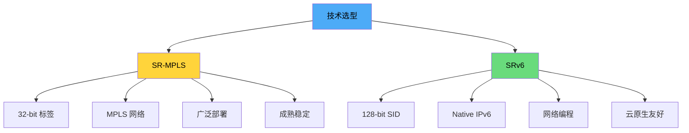
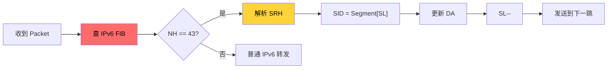
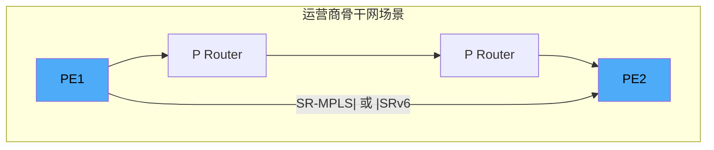
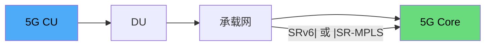
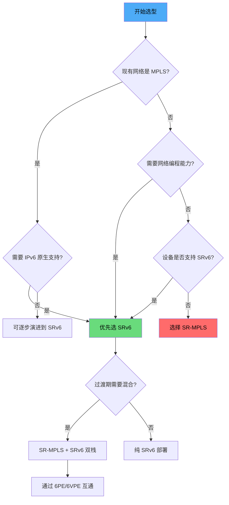
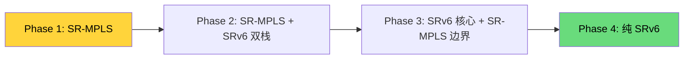

> [!info] SRv6 2026 深度探索系列 0. [[2026-04-14-srv6-comprehensive-learning-roadmap|SRv6 全栈学习路径总览]]
> ... 39. [[2026-04-14-srv6-deep-dive-ch39-srv6-ipsec|第三九章：SRv6 + IPsec 端到端加密]] 40. [[2026-04-14-srv6-deep-dive-ch40-srv6-perf|第四十章：SRv6 转发性能与 TCAM]]
> **41. 第四一章：SRv6 vs SR-MPLS：选型决策树**

---

## 1. 概述：SRv6 与 SR-MPLS 的根本差异

SRv6 和 SR-MPLS 都是 Segment Routing 的实现方式，但它们在底层协议、报文格式、硬件需求和演进方向上存在本质差异。本章通过详细的对比分析，帮助读者在不同场景下做出正确的技术选型决策。



---

## 2. 协议栈对比

### 2.1 报文格式差异

| 层面             | SR-MPLS                    | SRv6                        |
| :--------------- | :------------------------- | :-------------------------- |
| **封装**         | MPLS 标签栈 (32-bit/label) | IPv6 Extension Header (SRH) |
| **Segment ID**   | 32-bit Label               | 128-bit SID                 |
| **Segment List** | 标签栈 (LIFO)              | IPv6 地址列表               |
| **Next Hop**     | MPLS lookup (Label FIB)    | IPv6 FIB                    |
| **MTU**          | 接近理论值                 | 额外 40B (SRH)              |

**SR-MPLS 报文结构：**

```
┌─────────┬─────────┬─────────┐
│ Ethernet│  MPLS   │ Payload │
│  Header │ Label   │         │
│  (14B)  │ Stack   │         │
└─────────┴─────────┴─────────┘
              ↑
         标签栈 (4B/label)
         ┌────────┬──────┬──────┐
         │ Label   │ TC   │  TTL │
         │ (20bit) │ (3b) │ (8b) │
         └────────┴──────┴──────┘
```

**SRv6 报文结构：**

```
┌─────────┬───────────────┬───────────────┬─────────┐
│Ethernet │ IPv6 Header    │ SRH           │ Payload │
│ Header  │ (40B)          │ (40B + 16B*n)│         │
│ (14B)   │                │               │         │
└─────────┴───────────────┴───────────────┴─────────┘
              ↑                    ↑
         Outer IPv6 DA =      Segment List
         Segment[SL]          (n × 128-bit)
```

### 2.2 控制平面对比

| 特性         | SR-MPLS                    | SRv6                       |
| :----------- | :------------------------- | :------------------------- |
| **IGP 扩展** | IS-IS/OSPF SR (Type=22/23) | IS-IS/OSPFv3 SR (RFC 8986) |
| **BGP 扩展** | BGP-LS, BGP Prefix-SID     | BGP VPNv6, BGP SRv6        |
| **SID 通告** | Sub-TLV (Label, Flags)     | TLV (128-bit IPv6 address) |
| **路径计算** | CSPF, PCE                  | PCE, FlexAlgo              |
| **TE 属性**  | TE-LSA, TI-LFA             | TI-LFA, Encapsulation      |

---

## 3. 转发机制对比

### 3.1 转发流程

**SR-MPLS 转发：**


**SRv6 转发：**



### 3.2 PSP/USP Flavor 对比

SRv6 的 PSP (Penultimate Segment Pop) 和 USP (Ultimate Segment Pop) 是优化最后一跳处理的关键机制：

```bash
# SR-MPLS: PHP (Penultimate Hop Popping)
#   倒数第二跳弹出标签，最后一跳直接转发

# SRv6 PSP: 倒数第二跳移除 SRH
#   最后一跳处理纯 IPv6 包

# SRv6 USP: 源节点不插入 SRH（仅最后一跳处理）
#   减少中间节点 SRH 处理
```

### 3.3 ECMP 处理

| 场景          | SR-MPLS            | SRv6               |
| :------------ | :----------------- | :----------------- |
| **Hash 因子** | Top of Stack Label | Segment[SL]        |
| **等价路径**  | Label + IP 5-tuple | SID + Inner Header |
| **负载均衡**  | 标签一致时等价     | 基于 SID 计算      |

---

## 4. 网络编程能力对比

### 4.1 uSID vs 标签栈

SR-MPLS 的标签栈深度受限于 MTU 和硬件：

```bash
# SR-MPLS 标签栈限制
# MTU 1500 - Ethernet(14) - MPLS(4*n) - Payload >= 64
# 最大标签数 ≈ (1500 - 14 - 64) / 4 ≈ 355

# SRv6 SID 栈限制
# uSID 可压缩: 4 × 16-bit uN = 64-bit/128-bit
# FC00:0001:0002:0003:0004:0005:0006:0007 → 8 个 uN
```

### 4.2 Behavior 多样性

| Behavior | SR-MPLS               | SRv6    | 功能              |
| :------- | :-------------------- | :------ | :---------------- |
| End      | Pop & Forward         | End     | 简单转发          |
| End.X    | Pop & L2 Xconnect     | End.X   | 邻接转发          |
| End.T    | Pop & Lookup IPv6     | End.T   | IPv6 Table lookup |
| End.DT4  | Pop & Lookup IPv4 VRF | End.DT4 | IPv4 VPN lookup   |
| End.DT6  | Pop & Lookup IPv6 VRF | End.DT6 | IPv6 VPN lookup   |
| End.DX2  | Pop & L2 Xconnect     | End.DX2 | L2 VPN            |
| End.B6   | -                     | End.B6  | SRv6 Policy       |
| End.BM   | -                     | End.BM  | Binding SID       |

**SRv6 独有的 Behavior：**

```python
# SRv6 网络编程示例
# 场景: 流量经过 A -> B(加密) -> C(负载均衡) -> D

# SR-MPLS 实现
#   Label Stack: [D, LB_C, ENCRYPT_B, A]
#   需要多个 Label 编码加密指令

# SRv6 实现
#   Segment List: [End.BM(encrypt), End.X(lb), End, D]
#   每个 SID 携带完整 Function + Argument
```

---

## 5. 部署场景对比

### 5.1 运营商骨干网



| 考量              | SR-MPLS                | SRv6                  |
| :---------------- | :--------------------- | :-------------------- |
| **现网兼容性**    | ✅ 现有 MPLS 可升级    | ❌ 需要 IPv6 全网部署 |
| **设备支持**      | ✅ 绝大多数路由器支持  | ⚠️ 需要新硬件/软件    |
| **标签容量**      | ✅ 充足 (20-bit label) | ✅ 充足 (128-bit)     |
| **SCADA/OT 集成** | ⚠️ 需要改造            | ✅ 原生支持           |

### 5.2 数据中心互联 (DCI)

| 考量             | SR-MPLS       | SRv6         |
| :--------------- | :------------ | :----------- |
| **Overlay 协议** | LDP/RSVP-TE   | EVPN + SRv6  |
| **VXLAN 集成**   | 需要 UDP 封装 | 原生 IPv6    |
| **多租户**       | VPNv4/v6      | L3VPN / EVPN |
| **扩展性**       | 受限于标签栈  | uSID 压缩    |

### 5.3 5G 承载网



| 需求           | SR-MPLS | SRv6         |
| :------------- | :------ | :----------- |
| **低延迟**     | ✅      | ✅ TI-LFA    |
| **网络切片**   | ⚠️ 复杂 | ✅ uSID 隔离 |
| **SFC**        | ❌      | ✅ End.BPF   |
| **确定性网络** | ⚠️      | ✅ 端到端    |

---

## 6. 选型决策树



### 6.1 决策矩阵

| 场景                   | 推荐           | 原因                 |
| :--------------------- | :------------- | :------------------- |
| **新建 IPv6 网络**     | SRv6           | 原生支持，无历史包袱 |
| **现有 MPLS 网络升级** | SR-MPLS → SRv6 | 渐进式演进           |
| **多厂商环境**         | SR-MPLS        | 厂商支持广泛         |
| **云原生/容器环境**    | SRv6           | Kubernetes + IPv6    |
| **低延迟金融交易**     | SRv6 + TI-LFA  | 快速收敛             |
| **传统运营商网络**     | SR-MPLS        | 运维熟悉             |
| **需要加密传输**       | SRv6 + IPsec   | 原生集成             |

### 6.2 混合部署策略

```bash
# Cisco IOS-XR: 双栈 SRv6 + SR-MPLS 配置
segment-routing
  mpls
    connected-prefix-sid
  srv6
    locator LOC1
      prefix FC00:0:1::/48

# 在 IPv6 网络边界配置 6PE/6VPE 互通
router bgp 65000
  address-family vpnv6 unicast
    segment-routing srv6
```

---

## 7. 未来演进路径

### 7.1 SR-MPLS 到 SRv6 迁移



### 7.2 互通机制

| 互通技术           | 说明                | 适用场景          |
| :----------------- | :------------------ | :---------------- |
| **6PE**            | IPv6 over MPLS      | IPv6 跨 MPLS 网络 |
| **6VPE**           | IPv6 VPN over MPLS  | 多租户 IPv6 VPN   |
| **SRv6 over MPLS** | SRv6 封装在 MPLS 中 | 隧道穿越          |
| **MPLS over SRv6** | MPLS 封装在 SRv6 中 | 迁移过渡          |

---

## 8. 总结：选型建议

> [!tip] SRv6 vs SR-MPLS 选型 checklist
>
> - [ ] 评估现有网络基础设施的 MPLS/IPv6 成熟度
> - [ ] 确认设备厂商的 SRv6 支持情况
> - [ ] 分析业务需求：网络编程、加密、多租户
> - [ ] 考虑团队技能和运维能力
> - [ ] 制定渐进式迁移策略

**核心结论：**

| 因素           | 胜出方                      |
| :------------- | :-------------------------- |
| **协议简洁性** | SRv6 (Native IPv6)          |
| **硬件效率**   | SR-MPLS (32-bit vs 128-bit) |
| **网络编程**   | SRv6 (uSID, Behavior)       |
| **云原生集成** | SRv6 (K8s, eBPF)            |
| **生态成熟度** | SR-MPLS (更广泛部署)        |
| **未来演进**   | SRv6 (IETF 重点)            |
| **选型建议**   | 新建用 SRv6，存量渐进演进   |

---

**SRv6 深度探索系列导航**

> 40. [[2026-04-14-srv6-deep-dive-ch40-srv6-perf|第四十章：SRv6 转发性能与 TCAM]]
>     **41. 第四一章：SRv6 vs SR-MPLS：选型决策树**
> 41. [[2026-04-14-srv6-deep-dive-ch42-srv6-vs-vxlan|第四二章：SRv6 vs VXLAN]]
