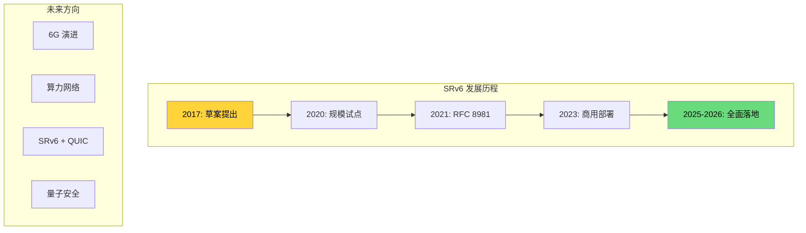
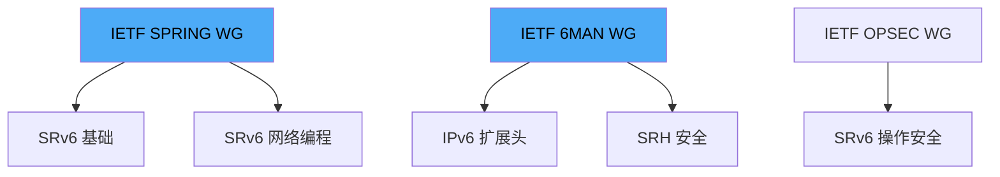
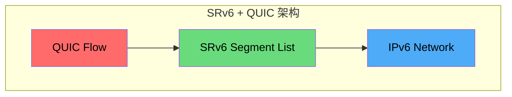
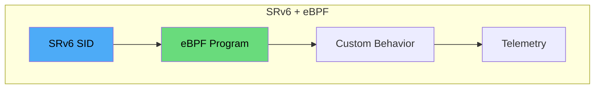
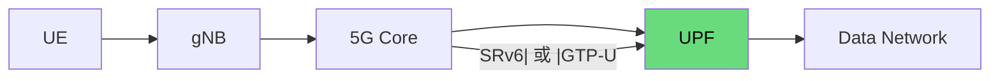
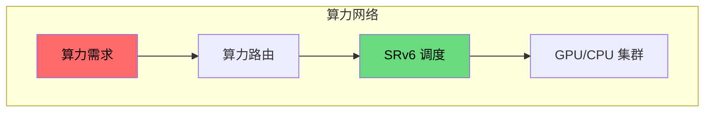
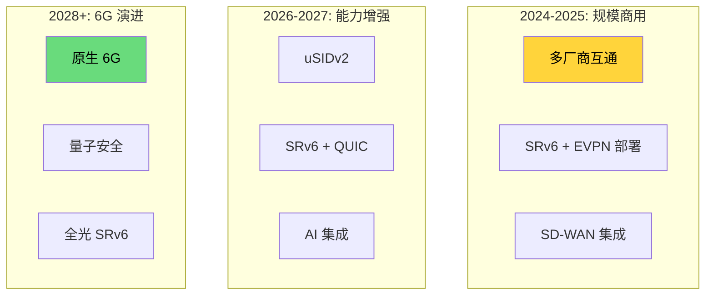

> [!info] SRv6 2026 深度探索系列 0. [[2026-04-14-srv6-comprehensive-learning-roadmap|SRv6 全栈学习路径总览]]
> ... 43. [[2026-04-14-srv6-deep-dive-ch43-srv6-vs-wireguard|第四三章：SRv6 加密 vs WireGuard]] 44. [[2026-04-14-srv6-deep-dive-ch44-srv6-vs-sdwan|第四四章：SRv6 vs 传统 SD-WAN]]
> **45. 第四五章：SRv6 未来演进与 IETF 标准化**

---

## 1. 概述：SRv6 的发展轨迹

SRv6 从 2017 年的草案到 2021 年的 RFC 8981，已经走过了从概念验证到规模部署的历程。本章展望 SRv6 的未来发展方向，包括 IETF 标准化进展、与 QUIC 的融合、网络编程的演进，以及在 5G/6G、算力网络等新兴场景中的应用。



---

## 2. IETF 标准化进展

### 2.1 核心 RFC/Draft 状态

| 文档                                       | 状态    | 描述                              |
| :----------------------------------------- | :------ | :-------------------------------- |
| **RFC 8981**                               | ✅ 标准 | SRv6 Network Programming          |
| **RFC 8754**                               | ✅ 标准 | SRH (IPv6 Segment Routing Header) |
| **RFC 8402**                               | ✅ 标准 | Segment Routing Architecture      |
| **draft-ietf-spring-srv6-usid**            | 🟡 草稿 | uSID (Micro SID) 格式             |
| **draft-ietf-spring-srv6-net-pgm**         | 🟡 草稿 | SRv6 Network Programming 扩展     |
| **draft-ietf-spring-srv6-srh-compression** | 🟡 草稿 | SRH 压缩                          |
| **draft-ietf-6man-srv6-security**          | 🟡 草稿 | SRv6 安全框架                     |

### 2.2 活跃工作组



**SPRING (Source Packet Routing in Networking) 工作组核心贡献：**

- Segment Routing 架构定义
- SRv6 基础协议
- SR-MPLS 共存
- SR Policy框架

---

## 3. SRv6 + QUIC：传输层融合

### 3.1 为什么 SRv6 + QUIC

QUIC 作为下一代传输层协议，与 SRv6 的结合可以提供端到端的可编程传输：



### 3.2 技术融合点

| 层面         | SRv6      | QUIC          | 融合价值   |
| :----------- | :-------- | :------------ | :--------- |
| **连接标识** | SID       | Connection ID | 多路径复用 |
| **路径选择** | SR Policy | MPTCP         | 端到端协同 |
| **可靠性**   | TI-LFA    | Loss Recovery | 双重保护   |
| **加密**     | IPsec     | QUIC Crypto   | 分层安全   |

### 3.3 应用场景

**场景 1：多路径低延迟传输**

```python
# 概念: SRv6 路径 + QUIC 多路径
class SRv6QUICTransport:
    def __init__(self):
        self.srv6_policy = SRv6Policy()
        self.quic_conn = QUICConnection()

    def send_multipath(self, data):
        # 路径 1: 低延迟 SRv6 路径
        path1_segments = [SID_LATENCY_SENSITIVE]

        # 路径 2: 高带宽 SRv6 路径
        path2_segments = [SID_BANDWIDTH_HIGH]

        # QUIC 并行传输
        self.quic_conn.send_on_path(
            data,
            path1_segments,  # Low latency
            path2_segments   # High bandwidth
        )
```

**场景 2：SLA 保证的视频流**

```
┌─────────────────────────────────────────────────────────────┐
│ SRv6 + QUIC 视频传输                                          │
├─────────────────────────────────────────────────────────────┤
│ 发送端                                                        │
│   ┌─────────────┐                                           │
│   │  QUIC Flow  │ ──> Video Frames                         │
│   └─────────────┘                                           │
│         │                                                    │
│         ▼                                                    │
│   ┌─────────────┐                                           │
│   │ SRv6 Path   │ ──> Segment[SL=0] = Low-Latency-SID    │
│   │ Selection    │                                           │
│   └─────────────┘                                           │
│         │                                                    │
│         ▼                                                    │
│   ┌─────────────┐                                           │
│   │  IPv6/SRH   │ ──> Encapsulated with QUIC              │
│   └─────────────┘                                           │
└─────────────────────────────────────────────────────────────┘
```

---

## 4. 网络编程演进

### 4.1 uSID 的演进

**当前 uSID 格式 (12-byte)：**

```
┌─────────────────────────────────────────────────────────────┐
│ uSID Block (48b)    │ uN (16b) │ Func (16b) │ Arg (32b)   │
│ FC00:0000:0001      │    0002  │   0001     │   ...        │
└─────────────────────────────────────────────────────────────┘
```

**uSIDv2 概念（讨论中）：**

```c
// uSIDv2 潜在增强
struct srv6_usid_v2 {
    // 更大的 Block 支持更多节点
    uint48_t  block_id;      // 48-bit block

    // 更灵活的 Function 编码
    uint16_t  function;       // 16-bit function
    uint8_t   flags;         // 扩展标志

    // 压缩的 Argument
    uint32_t  argument;       // 32-bit argument
};
```

### 4.2 可编程 Behavior 扩展

| Behavior     | 功能                   | 状态     |
| :----------- | :--------------------- | :------- |
| **End**      | 简单转发               | ✅ RFC   |
| **End.X**    | 邻接转发               | ✅ RFC   |
| **End.T**    | Table Lookup           | ✅ RFC   |
| **End.DX2**  | L2 Cross-connect       | ✅ RFC   |
| **End.BPF**  | BPF Execution          | 🟡 Draft |
| **End.GTF**  | Generic Traffic Filter | 🟡 Draft |
| **End.C**    | Clone/Header           | 🟡 Draft |
| **End.ISPF** | Incremental SPT        | 📋 概念  |

### 4.3 SRv6 + eBPF 的融合



**应用场景：**

- 自定义数据包采样
- 随流检测
- 动态负载均衡策略

---

## 5. 新兴应用场景

### 5.1 5G/6G 网络

**5G 核心网中的 SRv6：**



| 5G 组件  | SRv6 应用        | 优势     |
| :------- | :--------------- | :------- |
| **UPF**  | End.DX6/End.DT6  | 本地转发 |
| **SMF**  | SR Policy 计算   | 动态切片 |
| **AN**   | SRv6 over 5G RAN | 低延迟   |
| **Edge** | uSID 压缩        | 资源受限 |

**6G 研究方向：**

| 方向           | 研究内容                |
| :------------- | :---------------------- |
| **AI Native**  | SRv6 + ML 路径优化      |
| **THz 通信**   | SRv6 在太赫兹网络的应用 |
| **卫星网络**   | LEO 卫星 SRv6 路由      |
| **智能反射面** | RIS + SRv6 协同         |

### 5.2 算力网络

**SRv6 在算力网络中的角色：**



| 组件           | SRv6 应用 | 功能         |
| :------------- | :-------- | :----------- |
| **算力路由**   | SR Policy | 算力节点选择 |
| **低延迟调度** | TI-LFA    | 故障快速收敛 |
| **负载均衡**   | FlexAlgo  | 算力均衡     |
| **服务发现**   | End.BPF   | 算力服务注册 |

---

## 6. 安全演进

### 6.1 当前安全机制

| 机制      | 描述                            | 状态     |
| :-------- | :------------------------------ | :------- |
| **SAVAL** | Source Address Validation       | 🟡 Draft |
| **uRPF**  | Unicast Reverse Path Forwarding | ✅ 已有  |
| **IPsec** | 端到端加密                      | ✅ 成熟  |
| **ICV**   | Integrity Check Value           | ✅ 已有  |

### 6.2 未来安全增强

**量子安全 SRv6（研究方向）：**

```python
# 概念: 量子安全 SID 签名
class QuantumSecureSID:
    def __init__(self, sid, quantum_key):
        self.sid = sid
        self.quantum_signature = self.sign_with_quantum_key(
            sid, quantum_key
        )

    def sign_with_quantum_key(self, sid, key):
        # 使用 CRYSTALS-Dilithium 或其他 QSK 算法
        # 签名长度: ~2.4 KB (QSK) vs ~64 B (传统)
        pass
```

| 量子安全算法           | 特点               | 适用场景 |
| :--------------------- | :----------------- | :------- |
| **CRYSTALS-Dilithium** | 基于格密码，签名短 | SID 认证 |
| **SPHINCS+**           | 基于哈希，无格假设 | 长期签名 |
| **BIKE**               | 基于码字，效率高   | 密钥交换 |

---

## 7. 产业生态

### 7.1 芯片厂商支持

| 厂商         | 芯片        | SRv6 支持 | 备注           |
| :----------- | :---------- | :-------- | :------------- |
| **Cisco**    | Silicon One | ✅        | ASR9k, NCS5500 |
| **Broadcom** | Tomahawk 5  | ✅        | 主要交换机     |
| **Marvell**  | Teralynx 10 | ✅        | DPU            |
| **Intel**    | Xeon + TMM  | ✅        | 软件转发       |
| **NVIDIA**   | BlueField 3 | ✅        | DPU            |

### 7.2 云厂商支持

| 云厂商           | SRv6 支持 | 产品            |
| :--------------- | :-------- | :-------------- |
| **阿里云**       | ✅ 全面   | ENS, 云骨干     |
| **华为云**       | ✅ 全面   | 云骨干, 广域网  |
| **AWS**          | 🟡 有限   | Transit Gateway |
| **Google Cloud** | 🟡 有限   | Cloud WAN       |
| **Azure**        | ❌        | ExpressRoute    |

---

## 8. 总结与展望

### 8.1 SRv6 发展路线图



### 8.2 关键结论

> [!tip] SRv6 未来发展 checklist
>
> - [ ] 关注 IETF uSID 和 SRv6 Network Programming 扩展草案
> - [ ] 评估 SRv6 + QUIC 融合场景
> - [ ] 布局 5G/6G 网络的 SRv6 应用
> - [ ] 跟进量子安全 SRv6 研究
> - [ ] 参与开源社区 (Linux, FD.io, ONAP)

**SRv6 核心价值总结：**

| 价值维度     | 描述                         |
| :----------- | :--------------------------- |
| **网络编程** | 可编程的转发行为，定制化服务 |
| **统一架构** | L2/L3/SR-TE/加密统一控制平面 |
| **云原生**   | K8s, eBPF, Service Mesh 友好 |
| **5G/6G**    | 网络切片、低延迟原生支持     |
| **标准化**   | IETF 主导，多厂商支持        |

---

## 附录：SRv6 全系列总结

| Part | 主题     | 核心内容                                     | 章节数 |
| :--- | :------- | :------------------------------------------- | :----- |
| I    | 基础     | MPLS 演进、SR 概念、SID 结构                 | 5      |
| II   | 协议     | IPv6 Extension Header、SRH、Behavior         | 5      |
| III  | 转发     | 转发流程、uSID、TI-LFA、SR Policy            | 4      |
| IV   | VPN      | SRv6 VPN、EVPN、VPLS、IOAM                   | 4      |
| V    | 流量工程 | FlexAlgo、SR-TE、流量导向                    | 4      |
| VI   | 云骨干   | SD-WAN、阿里云/华为云/AWS                    | 5      |
| VII  | 运维     | IOS XR/Junos/Linux 配置                      | 5      |
| VIII | 故障诊断 | Debug、Traceroute、性能监控                  | 4      |
| IX   | 高级     | 安全、SAVAL、IPsec、性能                     | 4      |
| X    | 对比     | SRv6 vs SR-MPLS/VXLAN/WireGuard/SD-WAN, 未来 | 5      |

**SRv6 深度探索系列圆满完成！**

---

**SRv6 深度探索系列导航**

> 44. [[2026-04-14-srv6-deep-dive-ch44-srv6-vs-sdwan|第四四章：SRv6 vs 传统 SD-WAN]]
>     **45. 第四五章：SRv6 未来演进与 IETF 标准化**
