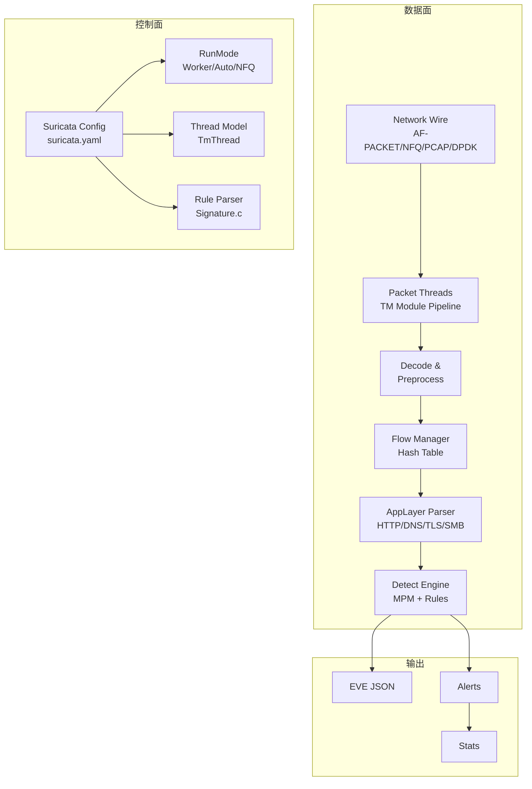

> [!info] Suricata 2026 深度探索系列 0. [[2026-04-15-suricata-deep-dive-series-index|全栈学习路径总览]]
>
> 1. **第一章：Suricata 概述**
> 2. [[2026-04-15-suricata-deep-dive-ch2-config|第二章：Suricata 配置系统]]
> 3. [[2026-04-15-suricata-deep-dive-ch3-runmodes|第三章：Runmodes 运行模式]]
> 4. [[2026-04-15-suricata-deep-dive-ch4-thread-model|第四章：线程模型]]
> 5. [[2026-04-15-suricata-deep-dive-ch5-capture|第五章：Capture 初始化]]

---

## 1. 项目历史与定位

### 1.1 起源与演进

Suricata 由 **OISF (Open Information Security Foundation)** 于 2009 年启动，是一个开源、多线程、模块化的 **IDS/IPS/NSM (Network Security Monitoring)** 引擎。

```
关键里程碑：
2009  — 项目启动，首个版本 0.9
2010  — 加入 Emerging Threats ETOpen 规则支持
2012  — 1.0 发布，支持 IP Reputation
2014  — 2.0 发布，Hyperscan MPM 集成
2016  — 3.0 发布，Rust 语言引入
2018  — 4.0 发布，AppLayer 协议解耦
2020  — 6.0 发布，Rust 重写核心检测引擎
2024  — 7.0 发布，AF-XDP 高性能抓包
```

### 1.2 开源生态

Suricata 采用 **GPLv2** 许可证，核心代码托管于 [oisf.net](https://oisf.net) 和 [GitHub](https://github.com/OISF/suricata)。

### 1.3 与 Snort 对比

|| 特性 | Suricata | Snort |
|| :--- | :--- | :--- |
| **并发模型** | 多线程原生 | 单线程 (DAQ 插件辅助) |
| **MPM 引擎** | AC/Bm/Hyperscan 可选 | AC (固定) |
| **协议解析** | 多线程并行 | 单线程串行 |
| **输出格式** | EVE JSON (结构化) | Unified2 (二进制) |
| **规则兼容** | Snort 规则兼容 | 原生支持 |
| **扩展语言** | Lua脚本 | Lua脚本 |
| **NFQ 模式** | 原生支持 | 需要 ipfw/netfilter |

---

## 2. NIDS vs IPS vs NSM 三种模式

### 2.1 NIDS (Network Intrusion Detection System)

**被动模式**：仅检测，不阻断。Suricata 接收网络流量副本，分析后输出告警。

```yaml
# suricata.yaml — NIDS 模式配置
runmode: auto
engine-analysis:
  rules-fast-pattern: yes
```

**源码入口**：`suricata.c` → `DetectEngineBuild()`

```c
// src/suricata.c
static int SuricataMain(int argc, char **argv)
{
    // 初始化检测引擎（不设置 IPS 标志）
    if (DetectEngineEnabled()) {
        DetectEngineBuild();
    }
    // 进入抓包循环
    TmThreadWaitOnThreadInit();
    // ...
}
```

### 2.2 IPS (Intrusion Prevention System)

**Inline 模式**：流量经过 Suricata 实时检测，可主动丢弃恶意流量。

```yaml
# suricata.yaml — NFQ IPS 模式
runmode: nfq
nfq:
  mode: accept # accept=放行+记录, drop=丢弃+记录
```

**源码实现**：`TmModuleReceiveNFQ` 和 `TmModuleVerdictNFQ` 协同工作：

```c
// src/tm-threads.c — IPS 模式的流量处理
TmEcode TmThreadsSlotVarRun(ThreadVars *thv, Packet *p)
{
    // 遍历所有 TM 模块
    for (TmModule *tm = &tv->tm_modules[0]; tm->id != TM_THREAD_ID_MAX; tm++) {
        if (tm->flags & TM_FLAG_RECEIVE_TM) {
            // 接收模块（如 NFQ）返回 verdict
            if (p->nfq_vf_iif != 0) {
                // 返回 NFQ verdicts: NF_DROP, NF_ACCEPT, NF_REPEAT
                return TM_ECODE_OK;
            }
        }
    }
}
```

### 2.3 NSM (Network Security Monitoring)

**全流量采集**：不仅检测，还记录元数据、会话日志、文件传输内容。

```yaml
# suricata.yaml — NSM 模式配置
outputs:
  -eve-log:
    types:
      - alert
      - http: # 完整 HTTP 日志
      - dns: # DNS 查询/响应
      - tls: # TLS 证书、SNI
      - files: # 文件提取
      - flow: # Flow 元数据
```

---

## 3. 整体架构



---

## 4. 源码目录结构

```
suricata/
|-- src/                    # C 语言核心
|   |-- main.c             # 程序入口
|   |-- suricata.c         # 主循环、信号处理
|   |-- runmode*.c         # 运行模式实现
|   |-- tm-*.c            # 线程管理 (TM = Thread Module)
|   |-- detect-*.c         # 检测引擎相关
|   |-- app-layer-*.c      # 应用层协议解析
|   |-- flow-*.c          # Flow 管理
|   |-- stream-*.c        # TCP 流重组
|   |-- source-*.c        # 数据源 (AF-PACKET/PCAP/NFQ/DPDK)
|   |-- output-*.c        # 日志输出
|   |-- util-*.c          # 工具函数
|   `-- rust.h / rust/src/ # Rust 语言扩展
|-- rust/                   # Rust 语言实现
|   |-- src/
|   |   |-- applayer.rs   # AppLayer 框架
|   |   |-- detect/        # 检测引擎 Rust 绑定
|   |   |-- json/          # EVE JSON 输出
|   |   `-- runmode/       # 运行模式 Rust 实现
|-- etc/
|   |-- classification.config
|   `-- reference.config
|-- rules/                 # 默认规则目录
|-- suricata.yaml          # 主配置文件
`-- doc/                   # 文档
```

---

## 5. 配置与源码的映射关系

Suricata 的配置系统基于 **YAML** + **SCConf** 双轨制：

```yaml
# suricata.yaml — 配置示例
max-pending-packets: 1024
capture:
  concurrency: 4
  set-errors: stats
```

对应 **C 源码**中的配置读取：

```c
// src/util-conf.c — 配置读取入口
int ConfYamlLoad(const char *filename)
{
    yaml_parser_t parser;
    yaml_document_t document;

    // libyaml 解析 YAML
    if (!yaml_parser_load(&parser, f)) {
        return -1;
    }

    // 构建配置树 (ConfNode)
    ConfYamlParse(&parser, NULL, NULL, &document);
    return 0;
}

// src/conf.h — 配置访问接口
#define SCConfGetInt(name, val) \
    ConfGetInt((name), (val))

// src/suricata.c — 实际使用
uint32_t max_pending_packets = 0;
(void)ConfGetInt("max-pending-packets", &max_pending_packets);
// 配置 → 全局变量
```

---

## 6. 核心配置项一览

|| 配置路径 | 默认值 | 说明 | 对应源码 |
|| :--- | :--- | :--- | :--- |
| `max-pending-packets` | 1024 | 每个线程最大待处理包数 | `src/suricata.c` |
| `runmode` | auto | 运行模式 | `src/runmode*.c` |
| `capture.threads` | auto | 抓包线程数 | `src/source-af-packet.c` |
| `stream.memcap` | 64MB | 流缓存内存上限 | `src/stream-tcp.c` |
| `detect.engine-analysis` | - | 规则分析模式 | `src/detect-engine-build.c` |
| `outputs.eve-log` | yes | JSON 日志输出 | `src/output-eve.c` |

---

## 7. 小结

本章介绍了 Suricata 的基本定位和架构：

1. **三种工作模式**：NIDS（被动检测）、IPS（Inline 阻断）、NSM（全流量采集）
2. **多线程架构**：区别于 Snort 单线程模型，天然支持多核并行
3. **YAML + C 配置系统**：下一章将深入解析 `suricata.yaml` 的配置树与 `SCConf` 源码实现

下一章我们将深入 **Suricata 配置系统**，从 `suricata.yaml` 的 YAML 结构到 `ConfGet*` 系列函数，逐行解析配置如何驱动源码行为。
