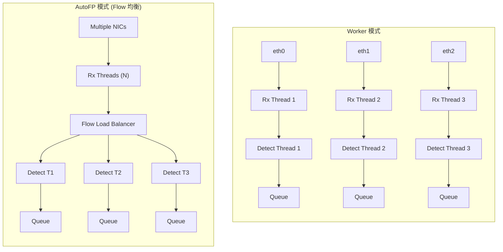
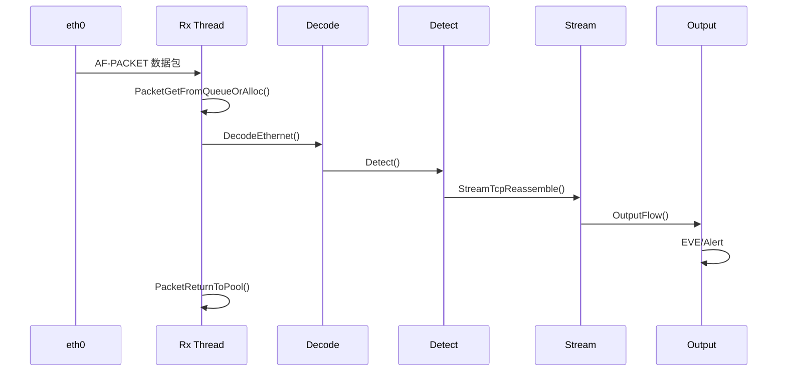

> [!info] Suricata 2026 深度探索系列 0. [[2026-04-15-suricata-deep-dive-series-index|全栈学习路径总览]]
>
> 1. [[2026-15-suricata-deep-dive-ch1-overview|第一章：Suricata 概述]]
> 2. [[2026-04-15-suricata-deep-dive-ch2-config|第二章：Suricata 配置系统]]
> 3. [[2026-04-15-suricata-deep-dive-ch3-runmodes|第三章：Runmodes 运行模式]]
> 4. [[2026-04-15-suricata-deep-dive-ch4-thread-model|第四章：线程模型]]
> 5. [[2026-04-15-suricata-deep-dive-ch5-capture|第五章：Capture 初始化]]
> 6. [[2026-04-15-suricata-deep-dive-ch6-af-packet|第六章：AF-PACKET 接口]]
> 7. [[2026-04-15-suricata-deep-dive-ch7-pcap|第七章：PCAP 接口]]
> 8. [[2026-04-15-suricata-deep-dive-ch8-nfq|第八章：NFQ 与 PF_RING 模式]]
> 9. [[2026-04-15-suricata-deep-dive-ch9-dpdk|第九章：DPDK 接口]]
> 10. **第十章：多线程抓包与负载均衡**

---

## 1. 多线程抓包概述

Suricata 的多线程抓包通过 **Runmode** 系统实现，主要有两种模式：



### 1.1 Worker vs AutoFP

| 特性         | Worker            | AutoFP            |
| :----------- | :---------------- | :---------------- |
| **抓包线程** | 1:1 绑定 NIC      | 独立 Rx 线程池    |
| **分发方式** | 直接              | Flow 哈希均衡     |
| **CPU 效率** | 较高 (无额外分发) | 中等 (有分发开销) |
| **延迟**     | 低                | 中                |
| **适用场景** | 单 NIC 高吞吐     | 多 NIC 复杂分流   |

---

## 2. Runmode 源码解析

### 2.1 Runmode 枚举

```c
// src/runmode.h — Runmode 类型
typedef enum {
    RUNMODE_UNKNOWN = 0,
    RUNMODE_PCAP_DEV,           // PCAP 单设备
    RUNMODE_PCAP_FILE,          // PCAP 文件
    RUNMODE_AF_PACKET,          // AF-PACKET
    RUNMODE_NETMAP,             // Netmap
    RUNMODE_NFQ,                // NFQ Inline
    RUNMODE_WINDIVERT,          // Windows
    RUNMODE_DPDK,               // DPDK
    RUNMODE_UNITTEST,           // 单元测试
    RUNMODE_ENGINE_ANALYSIS,    // 规则分析
} RunMode;
```

### 2.2 Runmode 选择

```c
// src/runmode.c — 自动选择 Runmode
const char *RunModeAutoConf(void)
{
    /* 检查是否指定了接口 */
    const char *pcap_intf = NULL;
    (void)ConfGet("pcap.interface", &pcap_intf);

    /* 检查 AF-PACKET */
    const char *afp_intf = NULL;
    (void)ConfGet("af-packet.interface", &afp_intf);

    /* 检查 DPDK */
    int dpdk_enabled = 0;
    (void)ConfGetBool("dpdk.enabled", &dpdk_enabled);

    /* 根据优先级选择 */
    if (pcap_intf != NULL) {
        return "pcap";
    } else if (afp_intf != NULL) {
        return "af-packet";
    } else if (dpdk_enabled) {
        return "dpdk";
    } else if (ConfigRunModeGet() == RUNMODE_NFQ) {
        return "nfq";
    }

    /* 默认使用 AF-PACKET */
    return "af-packet";
}
```

---

## 3. Worker 模式

### 3.1 Worker 模式初始化

```c
// src/runmode-af-packet.c — Worker 模式
int RunModeAFPWorker(DetectEngineCtx *de_ctx)
{
    /* 1. 获取接口配置 */
    const char *iface;
    if (ConfGet("af-packet.interface", &iface) != 1) {
        iface = "default";
    }

    /* 2. 获取线程数 */
    int thread_count = AFPGetDefaultThreadCount();

    /* 3. 创建 Capture 线程 */
    for (int i = 0; i < thread_count; i++) {
        ThreadVars *tv = TmThreadCreatePacketHandler(
            "RxAFPacket",              // 线程名
            "packetpool",              // 输入队列
            "flow.wrk.1",             // 输出队列
            "FlowManager",             // 管理线程
            "AFPacketDissect"         // 处理函数
        );

        /* 设置 Capture 模块 */
        TmVarSlotSetFunc(tv, TmModuleGetByName("ReceiveAFPPacket"));

        /* 设置 Verdict 模块 */
        TmVarSlotAppendFunc(tv, TmModuleGetByName("VerdictAFPPacket"));

        /* 设置 Decode 模块 */
        TmVarSlotAppendFunc(tv, TmModuleGetByName("DecodeAFPacket"));

        /* 设置 Detect 模块 */
        TmVarSlotAppendFunc(tv, TmModuleGetByName("Detect"));

        /* 设置 Stream 重组 */
        TmVarSlotAppendFunc(tv, TmModuleGetByName("StreamTcp"));

        /* 设置输出 */
        TmVarSlotAppendFunc(tv, TmModuleGetByName("LogRecycler"));

        /* 启动线程 */
        TmThreadSpawn(tv);
    }

    return 0;
}
```

### 3.2 Worker 线程管道



### 3.3 线程函数注册

```c
// src/tm-threads.h — TmThread 管道结构
typedef struct ThreadVars_ {
    /* 线程标识 */
    char *name;                   // 线程名 "RxAFPacket #0"
    int id;                       // 线程 ID
    thread_type type;             // 线程类型
    int cpu;                      // CPU 亲和性

    /* TM 模块管道 */
    TmSlot *tm_slots;            // 模块槽位链表
    int tm_id;                   // 当前执行到的槽位

    /* 输入/输出队列 */
    const char *inq_name;         // 输入队列名
    const char *outq_name;       // 输出队列名
    Tmq *inq;                    // 输入队列
    Tmq *outq;                   // 输出队列

    /* 状态 */
    SCSofa icq;                  // 输入消息队列
    SCSofa ocq;                  // 输出消息队列

    void *data;                  // 模块私有数据
    void *ctx;                   // 线程上下文
} ThreadVars;

// 模块槽位
typedef struct TmSlot_ {
    int id;                       // 槽位 ID
    TmModule *tm;                // TM 模块
    void *data;                  // 模块私有数据
    struct TmSlot_ *next;        // 下一个槽位
} TmSlot;
```

---

## 4. AutoFP 模式 (Flow 负载均衡)

### 4.1 AutoFP 模式初始化

```c
// src/runmode-af-packet.c — AutoFP 模式
int RunModeAFPAutoFp(DetectEngineCtx *de_ctx)
{
    /* 1. 获取线程数 */
    int capture_thread_count = AFPGetDefaultThreadCount();
    int detect_thread_count = UtilCpuGetNumProcessors();

    /* 2. 创建 Capture 线程 (Rx) */
    ThreadVars *tv_rx[capture_thread_count];
    for (int i = 0; i < capture_thread_count; i++) {
        tv_rx[i] = TmThreadCreatePacketHandler(
            "RxAFPacket",
            "packetpool",
            "flow.auto",          // 输出到 Flow 队列
            "FlowManager",
            "AFPacketDissect"
        );

        TmVarSlotSetFunc(tv_rx[i], TmModuleGetByName("ReceiveAFPPacket"));
        TmVarSlotAppendFunc(tv_rx[i], TmModuleGetByName("DecodeAFPacket"));
        TmVarSlotAppendFunc(tv_rx[i], TmModuleGetByName("FlowWorker"));

        TmThreadSpawn(tv_rx[i]);
    }

    /* 3. 创建 Detect 线程池 */
    ThreadVars *tv_detect[detect_thread_count];
    for (int i = 0; i < detect_thread_count; i++) {
        tv_detect[i] = TmThreadCreatePacketHandler(
            "Detect",
            "flow.auto",          // 输入来自 Flow 队列
            "queue. outputs",
            NULL,
            "DetectReloadTemplate"
        );

        TmVarSlotSetFunc(tv_detect[i], TmModuleGetByName("Detect"));
        TmVarSlotAppendFunc(tv_detect[i], TmModuleGetByName("StreamTcp"));
        TmVarSlotAppendFunc(tv_detect[i], TmModuleGetByName("RespondReject"));

        TmThreadSpawn(tv_detect[i]);
    }

    /* 4. 设置 Flow Load Balancer */
    FlowLoadBalancingSetup(capture_thread_count, detect_thread_count);

    return 0;
}
```

### 4.2 Flow Hash 均衡

```c
// src/flow.c — Flow Load Balancer
typedef struct FlowLB_ {
    /* 一致性哈希环 */
    rte_ring *buckets[FlowBucketCount];  // 1024 个桶

    /* 线程映射 */
    int thread_count;           // 检测线程数
    int8_t *thread_map;         // 线程映射表

    /* 统计 */
    uint64_t total_flows;       // 总 Flow 数
    uint64_t drops;              // 丢弃数
} FlowLB;

static uint32_t FlowGetHash(Packet *p)
{
    /* 计算 Flow 哈希 (5-tuple) */
    uint32_t hash = 0;

    /* Source IP */
    hash ^= p->src.addr_data32[0];
    hash ^= p->src.addr_data32[1];

    /* Destination IP */
    hash ^= p->dst.addr_data32[0];
    hash ^= p->dst.addr_data32[1];

    /* Ports */
    hash ^= (p->sp << 16) ^ p->dp;

    /* Protocol */
    hash ^= p->proto;

    /* VLAN */
    if (p->vlan_id) {
        hash ^= p->vlan_id;
    }

    return hash;
}

static int FlowLoadBalance(FlowLB *lb, Packet *p)
{
    /* 计算哈希 */
    uint32_t hash = FlowGetHash(p);

    /* 映射到桶 */
    uint32_t bucket = hash % FlowBucketCount;

    /* 获取目标检测线程 */
    int thread_id = lb->thread_map[bucket];

    return thread_id;
}
```

### 4.3 Flow Worker 处理

```c
// src/source-af-packet.c — Flow Worker
static TmEcode FlowWorker(ThreadVars *tv, Packet *p)
{
    /* 查找或创建 Flow */
    Flow *f = FlowGetOrCreate(p);
    if (f == NULL) {
        return TM_ECODE_OK;
    }

    /* 关联 Packet 和 Flow */
    f->flowflags |= FLOW_PKT_TOSERVER_FIRST;
    p->flow = f;

    /* 添加到 Flow */
    if (!FlowSetStorage(p, f)) {
        FlowDecrUsecnt(f);
        return TM_ECODE_OK;
    }

    /* 更新 Flow 统计 */
    FlowUpdateState(f, p);

    /* 分发到 Detect 线程 */
    int thread_id = FlowLoadBalance(lb, p);
    Tmq *outq = lb->output_queues[thread_id];

    /* 入队 */
    if (TmQueueSend(outq, p) != 0) {
        /* 队列满，丢包 */
        FlowDecrUsecnt(f);
        return TM_ECODE_FAILED;
    }

    return TM_ECODE_OK;
}
```

---

## 5. 线程间通信

### 5.1 Tmq (Thread Message Queue)

```c
// src/tmq.h — 队列结构
typedef struct Tmq_ {
    char *name;                  // 队列名
    SCSofa *q;                  // Sofa 消息队列

    /* 生产者/消费者 */
    uint16_t producer_cnt;      // 生产者数量
    uint16_t consumer_cnt;      // 消费者数量

    /* 队列参数 */
    uint32_t q_len;             // 队列长度
    uint32_t elems;            // 当前元素数

    /* 统计 */
    uint64_t enqs;             // 入队次数
    uint64_t discards;         // 丢弃次数
} Tmq;
```

### 5.2 队列配置

```yaml
# suricata.yaml
threading:
  stack-size: 4MB # 线程栈大小
  cpu-affinity:
    - cpu: [0, 1] # 管理线程
    - cpu: [2, 3, 4, 5] # Capture 线程
    - cpu: [6, 7, 8, 9, 10, 11] # Detect 线程

# Flow 队列配置
flow:
  heap-size: 16MB # Flow 哈希表内存
  queues:
    - size: 1024 # Flow 队列大小
      count: 8 # 队列数量
```

---

## 6. CPU 亲和性

### 6.1 CPU 亲和性配置

```yaml
# suricata.yaml — CPU 亲和性
threading:
  stack-size: 4MB

  cpu-affinity:
    - management:
        cpu: [0] # 管理线程 (FlowManager)

    - worker-cpu:
        cpu: [1, 2, 3, 4, 5, 6, 7, 8, 9, 10, 11]

    # 或详细指定每种线程
    - receive-cpu: [1, 2, 3, 4]
    - decode-cpu: [5, 6, 7, 8]
    - detect-cpu: [9, 10, 11, 12, 13, 14, 15]
    - verdict-cpu: [9, 10, 11, 12, 13, 14, 15]
    - output-cpu: [0, 1]
```

### 6.2 NUMA 感知

```yaml
# suricata.yaml — NUMA 感知
af-packet:
  - interface: eth0
    threads: 8
    use-per-node-hash: yes # 按 NUMA 节点分布
    # 或
    numa-mbere: yes # NUMA 感知
```

---

## 7. 配置 → 源码映射表

| YAML 配置                     | C 变量                        | 源文件               | 说明        |
| :---------------------------- | :---------------------------- | :------------------- | :---------- |
| `runmode`                     | `RunModeSet()`                | `runmode.c`          | 运行模式    |
| `capture.threads`             | `thread_count`                | `runmode-*.c`        | 抓包线程数  |
| `threading.stack-size`        | `pthread_attr_setstacksize()` | `tm-threads.c`       | 栈大小      |
| `threading.cpu-affinity`      | `sched_setaffinity()`         | `tm-threads.c`       | CPU 亲和性  |
| `af-packet.use-per-node-hash` | `rte_lcore_to_socket_id()`    | `source-af-packet.c` | NUMA 分布   |
| `flow.queues`                 | `TmqCreate()`                 | `flow.c`             | Flow 队列   |
| `flow.heap-size`              | `FlowHashInit()`              | `flow.c`             | Flow 哈希表 |

---

## 8. 性能调优

### 8.1 线程数计算

```bash
# 估算公式
Capture_threads = NIC_Queues
Detect_threads = N_CPU_Cores - 1 - Capture_threads
# 保留 1 个核心给管理线程

# 示例: 16 核 CPU + 4 队列 NIC
Capture_threads = 4
Detect_threads = 16 - 1 - 4 = 11
```

### 8.2 高性能配置

```yaml
# suricata.yaml — 16 核高性能配置
runmode: autofp

threading:
  stack-size: 8MB
  cpu-affinity:
    - management:
        cpu: [0]
    - receive-cpu:
        cpu: [1, 2, 3, 4]
    - decode-cpu:
        cpu: [5, 6, 7, 8]
    - detect-cpu:
        cpu: [9, 10, 11, 12, 13, 14, 15]

af-packet:
  - interface: eth0
    threads: 4 # 与 receive-cpu 匹配
    ring-size: 8192
    buffer-size: 4096
    tpacket-v3: yes

flow:
  heap-size: 32MB
  queues:
    - size: 4096
      count: 8

stream:
  memcap: 256MB
  reassembly:
    depth: 1048576 # 1MB
    chunk-prealloc: 256
```

### 8.3 监控与调优

```bash
# 查看 Suricata 线程
ps -eLo pid,lwp,psr,comm

# 查看 Flow 哈希表使用
suricata -c suricata.yaml --list-runmodes
suricata -c suricata.yaml --engine-analysis

# 使用 perf 分析
perf stat -e cycles,instructions,cache-misses -p $(pidof suricata)
perf top -p $(pidof suricata)
```

---

## 9. 故障排除

### 9.1 常见问题

| 问题         | 原因                | 解决方案            |
| :----------- | :------------------ | :------------------ |
| 线程饥饿     | 队列太小            | 增大队列长度        |
| CPU 利用率低 | 线程绑定冲突        | 调整 cpu-affinity   |
| Flow 丢包    | 哈希表太小          | 增大 flow.heap-size |
| 延迟高       | AutoFP 模式过多分发 | 改用 Worker 模式    |
| 内存占用高   | Flow 未超时         | 调整 flow-timeout   |

### 9.2 调试方法

```bash
# 查看线程 CPU 使用
top -Hp $(pidof suricata)

# 查看队列统计
suricata -c suricata.yaml -i eth0 --stats

# 使用 Trace 日志
# suricata.yaml
logging:
  outputs:
    - console:
        enabled: yes
        level: debug
        thread-info: yes
```

---

## 10. 小结

本章解析了 Suricata 多线程抓包与负载均衡的完整实现：

1. **Worker 模式**：1:1 NIC-CPU 绑定，最简单高效
2. **AutoFP 模式**：Flow 哈希均衡，解耦 Capture 与 Detect
3. **Flow Load Balancer**：一致性哈希实现 Flow 级别分发
4. **Tmq 队列**：线程间消息队列，支持多生产者/消费者
5. **CPU 亲和性**：核心绑定与 NUMA 感知优化

多线程抓包是 Suricata 高性能的核心，结合前几章的抓包接口，可以根据场景选择最优方案：

- **低流量**：PCAP 模式足够
- **中等流量**：AF-PACKET Worker 模式
- **高性能**：AF-PACKET AutoFP + 优化
- **超高性能**：DPDK 模式

---

## 相关章节

- [[2026-04-15-suricata-deep-dive-ch4-thread-model|第四章：线程模型]]
- [[2026-04-15-suricata-deep-dive-ch5-capture|第五章：Capture 初始化]]
- [[2026-04-15-suricata-deep-dive-ch6-af-packet|第六章：AF-PACKET 接口]]
- [[2026-04-15-suricata-deep-dive-ch22-flow|Flow 管理]] (Part V)
