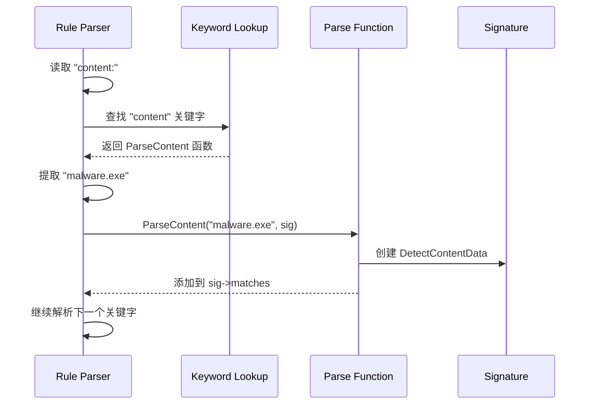

> [!info] Suricata 2026 深度探索系列
> 0. [[2026-04-15-suricata-deep-dive-series-index|全栈学习路径总览]]
> 1. [[2026-04-15-suricata-deep-dive-ch1-overview|第一章：Suricata 概述]]
> 2. [[2026-04-15-suricata-deep-dive-ch2-config|第二章：Suricata 配置系统]]
> 3. [[2026-04-15-suricata-deep-dive-ch3-runmodes|第三章：Runmodes 运行模式]]
> 4. [[2026-04-15-suricata-deep-dive-ch4-thread-model|第四章：线程模型]]
> 5. [[2026-04-15-suricata-deep-dive-ch5-capture|第五章：Capture 初始化]]
> 6. [[2026-04-15-suricata-deep-dive-ch6-af-packet|第六章：AF-PACKET 接口]]
> 7. [[2026-04-15-suricata-deep-dive-ch7-pcap|第七章：PCAP 接口]]
> 8. [[2026-04-15-suricata-deep-dive-ch8-nfq|第八章：NFQ 与 PF_RING 模式]]
> 9. [[2026-04-15-suricata-deep-dive-ch9-dpdk|第九章：DPDK 接口]]
> 10. [[2026-04-15-suricata-deep-dive-ch10-loadbalancing|第十章：多线程抓包与负载均衡]]
> 11. [[2026-04-15-suricata-deep-dive-ch11-detect-engine|第十一章：检测引擎架构]]
> 12. **第十二章：规则解析**

---

## 1. 规则格式概述

Suricata 兼容 Snort 规则语法，规则由**规则头**和**规则选项**两部分组成：

```
action protocol src dst sp dp (options)
```

```snort
# 完整规则示例
alert tcp $HOME_NET any -> $EXTERNAL_NET $HTTP_PORTS (
    msg:"ET TROJAN Possible Trickbot HTTP GET";
    flow:to_server,established;
    content:"/path/to/malware.exe";
    http.uri;
    pcre:"/\/download[0-9]*\.exe$/U";
    sid:2020493;
    rev:2;
)
```

### 1.1 规则结构分解

```
┌─────────────────────────────────────────────────────────────────────────────┐
│                           规 则 头 (Rule Header)                            │
├─────────────────────────────────────────────────────────────────────────────┤
│ action   │  protocol  │   src      │   dst      │  sp    │  dp             │
│ alert    │  tcp       │  $HOME_NET │  $EXTERNAL_NET │  any   │  $HTTP_PORTS   │
├─────────────────────────────────────────────────────────────────────────────┤
│                           规则选项 (Rule Options)                            │
├─────────────────────────────────────────────────────────────────────────────┤
│ (msg:"..."; flow:...; content:"..."; http.uri; pcre:"..."; sid:...; rev:...;)│
└─────────────────────────────────────────────────────────────────────────────┘
```

---

## 2. 规则动作

### 2.1 动作类型

| 动作 | 说明 | IPS 模式行为 |
| :--- | :--- | :--- |
| `alert` | 生成告警 | 记录后放行 |
| `pass` | 忽略匹配流量 | 放行 |
| `drop` | 丢弃并告警 | 丢弃 + 记录 |
| `reject` | 发送 RST/ICMP | 丢弃 + 拒绝 |
| `rejectsrc` | 仅发送拒绝 | 丢弃 |
| `rejectdst` | 仅向目标发送拒绝 | 丢弃 |
| `rejectboth` | 向两端发送拒绝 | 丢弃 |
| `log` | 仅记录 | 记录 |

### 2.2 动作源码映射

```c
// src/detect.h — 动作枚举
typedef enum {
    ACTION_NONE = 0,
    ACTION_ALERT,
    ACTION_LOG,
    ACTION_PASS,
    ACTION_DROP,
    ACTION_REJECT,
    ACTION_REJECT_SRC,
    ACTION_REJECT_DST,
    ACTION_REJECT_BOTH,
    ACTION_QUEUE,
} ActionFlag;

// src/detect-engine-build.c — 动作解析
static int ParseAction(const char *action)
{
    if (strcmp(action, "alert") == 0) return ACTION_ALERT;
    if (strcmp(action, "pass") == 0) return ACTION_PASS;
    if (strcmp(action, "drop") == 0) return ACTION_DROP;
    if (strcmp(action, "reject") == 0) return ACTION_REJECT;
    if (strcmp(action, "log") == 0) return ACTION_LOG;
    // ...
    return ACTION_ALERT;  // 默认
}
```

---

## 3. 协议与地址解析

### 3.1 支持的协议

```c
// src/detect.h — 协议类型
typedef enum {
    PROTOCOL_UNKNOWN = 0,
    PROTOCOL_IP,
    PROTOCOL_ICMP,
    PROTOCOL_TCP,
    PROTOCOL_UDP,
    PROTOCOL_RAW,
    PROTOCOL_APP_LAYER,  // DNS/HTTP/TLS 等
} Proto proto;
```

### 3.2 地址变量与解析

```c
// src/detect.h — 地址匹配结构
typedef struct DetectAddress_ {
    /* 地址类型 */
    uint8_t type;                    // ADDR_TYPE_* (IPV4/IPV6/ANY)
    
    /* IP 地址 */
    uint8_t ip[16];                  // IPv6 地址
    uint8_t ip2[16];                 // 范围结束地址
    uint16_t family;                 // AF_INET / AF_INET6
    
    /* 掩码 */
    uint8_t netmask;                // CIDR 掩码
    
    /* 否定 */
    bool negated;                    // 否定标志
    
    /* 链表 */
    struct DetectAddress_ *next;    // 下一个地址
} DetectAddress;

// src/detect-engine.c — 地址解析
static DetectAddress *ParseAddress(const char *addr)
{
    DetectAddress *da = SCCalloc(1, sizeof(DetectAddress));
    
    /* 检查否定 */
    if (addr[0] == '!') {
        da->negated = true;
        addr++;
    }
    
    /* 检查变量 ($HOME_NET 等) */
    if (addr[0] == '$') {
        const char *value = VarNameResolve(addr + 1);
        addr = value;
    }
    
    /* 解析 IP/范围/CIDR */
    if (strchr(addr, '/') != NULL) {
        /* CIDR 格式: 192.168.0.0/16 */
        ParseCIDR(addr, da);
    } else if (strchr(addr, '-') != NULL) {
        /* 范围格式: 192.168.0.0-192.168.255.255 */
        ParseRange(addr, da);
    } else {
        /* 单个 IP */
        ParseIP(addr, da);
    }
    
    return da;
}
```

### 3.3 端口解析

```c
// src/detect-engine.c — 端口解析
static uint16_t ParsePort(const char *port_str)
{
    /* 检查端口变量 ($HTTP_PORTS 等) */
    if (port_str[0] == '$') {
        const char *value = VarNameResolve(port_str + 1);
        return PortVarResolve(value);
    }
    
    /* 检查任意端口 */
    if (strcmp(port_str, "any") == 0) {
        return 0;
    }
    
    /* 解析数字端口 */
    return (uint16_t)atoi(port_str);
}
```

---

## 4. 关键字解析系统

### 4.1 关键字注册表

```c
// src/detect.h — 关键字注册表
typedef struct DetectKeyword_ {
    const char *name;                // 关键字名称
    int id;                          // 关键字 ID
    const char *desc;                // 描述
    void (*Parse)(const char *, Signature *);  // 解析函数
    
    /* flags */
    uint16_t flags;
#define SIGMATCH_NO_SUB    0x01   // 不支持子选项
    
} DetectKeyword;

// src/detect.c — 内置关键字注册
static DetectKeyword sigmatch_table[] = {
    { "msg",        DETECT_MSG,        "告警信息",          ParseMsg },
    { "content",    DETECT_CONTENT,    "内容匹配",          ParseContent },
    { "nocase",     DETECT_NOCASE,    "不区分大小写",      ParseNoCase },
    { "depth",      DETECT_DEPTH,      "匹配深度",          ParseDepth },
    { "offset",     DETECT_OFFSET,     "匹配偏移",          ParseOffset },
    { "pcre",       DETECT_PCRE,       "正则匹配",          ParsePcre },
    { "uricontent", DETECT_URICONTENT,"URI 内容匹配",      ParseUriContent },
    { "http_uri",   DETECT_HTTP_URI,  "HTTP URI",          ParseHttpUri },
    { "http_header",DETECT_HTTP_HEADER,"HTTP 头",          ParseHttpHeader },
    { "flow",       DETECT_FLOW,       "流属性",            ParseFlow },
    { "flowbits",   DETECT_FLOWBITS,   "流状态",            ParseFlowbits },
    { "dsize",      DETECT_DSIZE,      "Payload 大小",      ParseDsize },
    { "sid",        DETECT_SID,        "签名 ID",           ParseSid },
    { "rev",        DETECT_REV,        "修订版本",          ParseRev },
    { "classtype",  DETECT_CLASSTYPE, "分类",              ParseClasstype },
    { "priority",   DETECT_PRIORITY,  "优先级",            ParsePriority },
    { "threshold",  DETECT_THRESHOLD,  "阈值",              ParseThreshold },
    { "reference",  DETECT_REFERENCE,  "参考链接",          ParseReference },
    { "gid",        DETECT_GID,        "组 ID",             ParseGid },
    { "tag",        DETECT_TAG,        "标签",              ParseTag },
    { "metadata",   DETECT_METADATA,  "元数据",            ParseMetadata },
    // ...
    { NULL, 0, NULL, NULL }
};
```

### 4.2 关键字解析流程



---

## 5. content 关键字详解

### 5.1 content 解析

```c
// src/detect-content.c — content 解析
typedef struct DetectContentData_ {
    /* 原始内容 */
    uint8_t *content;               // 匹配内容
    uint16_t content_len;            // 内容长度
    
    /* 偏移/深度 */
    int32_t offset;                  // 匹配偏移
    int32_t depth;                   // 匹配深度
    
    /* 修饰符 */
    uint8_t flags;
#define CONTENT_NOCASE      0x01   // 不区分大小写
#define CONTENT_RELATIVE    0x02   // 相对匹配
#define CONTENT_NEGATED     0x04   // 否定
#define CONTENT_FAST_PATTERN  0x08  // 快速模式
#define CONTENT_MPM         0x10   // MPM 匹配
    
    /* 距离/within */
    int32_t distance;                // 距离
    int32_t within;                  // 范围
    
    /* 替换数据 (很少用) */
    uint8_t *replace;               // 替换内容
    
    /* 链表 */
    struct DetectContentData_ *next;
} DetectContentData;

// src/detect-content.c — content 解析函数
static int ParseContent(const char *optstr, Signature *sig)
{
    /* 分配数据结构 */
    DetectContentData *cd = SCCalloc(1, sizeof(DetectContentData));
    
    /* 解析 content:"..." 格式 */
    const char *start = strchr(optstr, '"');
    const char *end = strchr(start + 1, '"');
    
    /* 提取内容 */
    uint16_t len = end - start - 1;
    cd->content = SCMalloc(len);
    memcpy(cd->content, start + 1, len);
    cd->content_len = len;
    
    /* 处理转义字符 */
    DecodeContentEscape(cd->content, &cd->content_len);
    
    /* 处理修饰符 */
    const char *pos = end + 1;
    while (*pos != '\0' && *pos != ')') {
        if (strncmp(pos, "nocase", 6) == 0) {
            cd->flags |= CONTENT_NOCASE;
            pos += 6;
        } else if (strncmp(pos, "depth:", 6) == 0) {
            pos += 6;
            cd->depth = atoi(pos);
        } else if (strncmp(pos, "offset:", 7) == 0) {
            pos += 7;
            cd->offset = atoi(pos);
        } else if (strncmp(pos, "distance:", 9) == 0) {
            pos += 9;
            cd->distance = atoi(pos);
        } else if (strncmp(pos, "within:", 6) == 0) {
            pos += 6;
            cd->within = atoi(pos);
        }
        pos++;
    }
    
    /* 添加到签名 */
    cd->next = sig->matches;
    sig->matches = cd;
    
    return 0;
}
```

### 5.2 内容转义

```c
// src/detect-content.c — 字符串转义解析
static void DecodeContentEscape(uint8_t *content, uint16_t *len)
{
    uint8_t *src = content;
    uint8_t *dst = content;
    uint16_t remaining = *len;
    
    while (remaining > 0) {
        if (*src == '\\' && remaining >= 2) {
            src++;
            remaining--;
            
            switch (*src) {
                case 'n':  *dst = '\n'; break;
                case 'r':  *dst = '\r'; break;
                case 't':  *dst = '\t'; break;
                case '\\': *dst = '\\'; break;
                case 'x':  // 十六进制: \xNN
                    *dst = 0;
                    if (remaining >= 2) {
                        *dst = (HexToVal(src[0]) << 4) | HexToVal(src[1]);
                        src += 2;
                        remaining -= 2;
                    }
                    break;
                default:
                    *dst = *src;
                    break;
            }
        } else {
            *dst = *src;
        }
        
        src++;
        dst++;
        remaining--;
    }
    
    *len = dst - content;
}
```

---

## 6. pcre 关键字详解

### 6.1 PCRE 解析

```c
// src/detect-pcre.c — PCRE 数据结构
typedef struct DetectPcreData_ {
    /* PCRE 正则表达式 */
    pcre *re;                        // 编译后的 PCRE
    pcre_extra *study;               // 学习信息
    
    /* 模式字符串 */
    char *pattern;                   // 原始模式
    uint16_t pattern_len;           // 模式长度
    
    /* 修饰符 */
    uint8_t flags;
#define PCRE_CASELESS    0x01   // 不区分大小写
#define PCRE_MULTILINE   0x02   // 多行模式
#define PCRE_DOTALL      0x04   // . 匹配换行
#define PCRE_ANCHORED    0x08   // 锚定
#define PCRE_RAW         0x10   // 原始模式
    
    /* 捕获组偏移 */
    int capture_group[10];           // 最多 10 个组
    
    /* 是否 URI 模式 */
    bool uri_matching;              // URI 匹配模式
} DetectPcreData;

// src/detect-pcre.c — PCRE 解析
static int ParsePcre(const char *optstr, Signature *sig)
{
    DetectPcreData *pd = SCCalloc(1, sizeof(DetectPcreData));
    
    /* 提取正则表达式 */
    const char *start = strchr(optstr, '"');
    const char *end = strrchr(start + 1, '"');
    
    pd->pattern = SCStrndup(start + 1, end - start - 1);
    pd->pattern_len = strlen(pd->pattern);
    
    /* 解析修饰符 */
    const char *modifiers = end + 1;
    while (*modifiers != '\0' && *modifiers != ')') {
        switch (*modifiers) {
            case 'i': pd->flags |= PCRE_CASELESS; break;
            case 'm': pd->flags |= PCRE_MULTILINE; break;
            case 's': pd->flags |= PCRE_DOTALL; break;
            case 'A': pd->flags |= PCRE_ANCHORED; break;
            case 'U': pd->flags |= PCRE_RAW; break;  // URI 模式
        }
        modifiers++;
    }
    
    /* 编译 PCRE */
    const char *errptr;
    int erroffset;
    int options = PCRE_COMPILE_OPTIONS;
    
    if (pd->flags & PCRE_CASELESS) options |= PCRE_CASELESS;
    if (pd->flags & PCRE_MULTILINE) options |= PCRE_MULTILINE;
    if (pd->flags & PCRE_DOTALL) options |= PCRE_DOTALL;
    
    pd->re = pcre_compile(pd->pattern, options, &errptr, &erroffset, NULL);
    if (pd->re == NULL) {
        SCLogError("PCRE compilation failed: %s at offset %d", errptr, erroffset);
        SCFree(pd);
        return -1;
    }
    
    /* 可选学习阶段 */
    pd->study = pcre_study(pd->re, 0, &errptr);
    
    /* 添加到签名 */
    sig->sig_pcre = pd;
    
    return 0;
}
```

---

## 7. uricontent 与 HTTP 修饰符

### 7.1 uricontent 解析

```c
// src/detect-uricontent.c — uricontent 解析
typedef struct DetectContentData_ DetectUricontentData;

static int ParseUricontent(const char *optstr, Signature *sig)
{
    /* uricontent 与 content 共用数据结构 */
    DetectContentData *cd = SCCalloc(1, sizeof(DetectContentData));
    
    /* 解析内容（与 content 相同）*/
    ParseContentString(optstr, cd);
    
    /* 标记为 URI 内容 */
    cd->flags |= CONTENT_URI;
    
    /* 添加到 URI 内容列表 */
    cd->next = sig->uri_content;
    sig->uri_content = cd;
    
    return 0;
}
```

### 7.2 HTTP 修饰符

```c
// src/detect-http.c — HTTP 修饰符关键字
typedef enum {
    HTTP_MODE_NOTSET = 0,
    HTTP_URI,                        // http_uri
    HTTP_HEADER,                     // http_header
    HTTP_METHOD,                     // http_method
    HTTP_BODY,                       // http_body
    HTTP_USER_AGENT,                 // http.user_agent
    HTTP_HOST,                       // http.host
    HTTP_COOKIE,                     // http.cookie
} HttpMode;

// src/detect-http.c — HTTP 关键字解析
static int ParseHttp(const char *optstr, Signature *sig, HttpMode mode)
{
    /* 下一个 content 关键字将应用于 HTTP 字段 */
    DetectContentData *cd = sig->matches;
    if (cd != NULL) {
        cd->http_mode = mode;
        cd->flags |= CONTENT_HTTP;
    }
    
    return 0;
}
```

---

## 8. sid/rev/gid 解析

### 8.1 签名标识符

```c
// src/detect-sid.c — sid 解析
static int ParseSid(const char *optstr, Signature *sig)
{
    sig->id = (uint64_t)atoi(optstr);
    
    /* sid 必须 > 0 */
    if (sig->id == 0) {
        SCLogWarning("Invalid sid 0");
        return -1;
    }
    
    return 0;
}

// src/detect-rev.c — rev 解析
static int ParseRev(const char *optstr, Signature *sig)
{
    sig->rev = (uint64_t)atoi(optstr);
    return 0;
}

// src/detect-gid.c — gid 解析
static int ParseGid(const char *optstr, Signature *sig)
{
    sig->gid = (uint64_t)atoi(optstr);
    return 0;
}
```

---

## 9. flowbits 详解

### 9.1 flowbits 解析

```c
// src/detect-flowbits.c — flowbits 数据结构
typedef struct DetectFlowbitsData_ {
    /* flowbit 命令 */
    uint8_t type;                    // FLOWBIT_SET/CHECK/ISSET/ISNOTSET/UNSET/TOGGLE
#define FLOWBIT_NONE     0
#define FLOWBIT_SET       1
#define FLOWBIT_CHECK     2
#define FLOWBIT_ISSET     3
#define FLOWBIT_ISNOTSET  4
#define FLOWBIT_UNSET     5
#define FLOWBIT_TOGGLE    6
    
    /* flowbit 名称 */
    char *name;                      // flowbit 名称
    
    /* flags */
    uint8_t flags;
#define FLOWBIT_NOALERT   0x01   // 不产生告警
#define FLOWBIT_TOSERVER   0x02   // toserver 方向
#define FLOWBIT_TOCLIENT   0x04   // toclient 方向
} DetectFlowbitsData;

// src/detect-flowbits.c — flowbits 解析
static int ParseFlowbits(const char *optstr, Signature *sig)
{
    DetectFlowbitsData *fd = SCCalloc(1, sizeof(DetectFlowbitsData));
    
    /* 解析 "flowbits:set,mybit" 或 "flowbits:isset,mybit" */
    char *command = SCStrdup(optstr);
    char *comma = strchr(command, ',');
    
    if (comma != NULL) {
        *comma = '\0';
        comma++;
        
        /* 解析命令 */
        if (strcmp(command, "set") == 0) {
            fd->type = FLOWBIT_SET;
        } else if (strcmp(command, "isset") == 0) {
            fd->type = FLOWBIT_ISSET;
        } else if (strcmp(command, "isnotset") == 0) {
            fd->type = FLOWBIT_ISNOTSET;
        } else if (strcmp(command, "unset") == 0) {
            fd->type = FLOWBIT_UNSET;
        } else if (strcmp(command, "toggle") == 0) {
            fd->type = FLOWBIT_TOGGLE;
        }
        
        /* 解析名称 */
        fd->name = SCStrdup(comma);
    }
    
    SCFree(command);
    
    /* 添加到签名 */
    fd->next = sig->flowbits;
    sig->flowbits = fd;
    
    return 0;
}
```

---

## 10. 规则解析主流程

### 10.1 SigInit 主函数

```c
// src/detect-engine.c — 规则解析主函数
Signature *SigInit(DetectEngineCtx *de_ctx, const char *sig_str)
{
    /* 1. 分配签名结构 */
    Signature *sig = SCCalloc(1, sizeof(Signature));
    if (sig == NULL) return NULL;
    
    /* 2. 复制原始规则 */
    sig->raw = SCStrdup(sig_str);
    
    /* 3. 词法分析：分割规则头和选项 */
    char *opts_start = strchr(sig_str, '(');
    if (opts_start != NULL) {
        /* 解析规则头 */
        char *rule_header = SCStrndup(sig_str, opts_start - sig_str);
        ParseRuleHeader(sig, rule_header);
        SCFree(rule_header);
        
        /* 解析规则选项 */
        ParseRuleOptions(sig, opts_start);
    } else {
        SCLogError("Rule missing options");
        goto error;
    }
    
    /* 4. 验证签名 */
    if (SigValidate(sig) != 0) {
        goto error;
    }
    
    /* 5. 设置 MPM 标记 */
    if (sig->matches != NULL) {
        sig->mpm_pattern = 1;
    }
    
    return sig;

error:
    SigFree(sig);
    return NULL;
}
```

### 10.2 ParseRuleOptions 规则选项解析

```c
// src/detect-engine.c — 规则选项解析
static int ParseRuleOptions(Signature *sig, const char *opts)
{
    /* 解析 "(option1;option2;option3)" */
    char *options = SCStrdup(opts + 1);  // 跳过 '('
    options[strlen(options) - 1] = '\0';  // 移除 ')'
    
    char *token = strtok(options, ";");
    while (token != NULL) {
        /* 去除前后空格 */
        while (*token == ' ') token++;
        char *end = token + strlen(token) - 1;
        while (*end == ' ') *end-- = '\0';
        
        /* 查找关键字解析函数 */
        char *colon = strchr(token, ':');
        if (colon != NULL) {
            *colon = '\0';
            char *keyword = token;
            char *value = colon + 1;
            
            /* 查找关键字 */
            DetectKeyword *kw = FindKeyword(keyword);
            if (kw != NULL && kw->Parse != NULL) {
                kw->Parse(value, sig);
            } else {
                SCLogWarning("Unknown keyword: %s", keyword);
            }
        } else {
            /* 无值的选项（如 nocase, http_uri） */
            DetectKeyword *kw = FindKeyword(token);
            if (kw != NULL && kw->Parse != NULL) {
                kw->Parse("", sig);
            }
        }
        
        token = strtok(NULL, ";");
    }
    
    SCFree(options);
    return 0;
}
```

---

## 11. 配置与规则加载

### 11.1 规则文件配置

```yaml
# suricata.yaml
default-rule-path: /etc/suricata/rules

rule-files:
  - emerging-malware.rules     # 恶意软件规则
  - emerging-trojan.rules      # 木马规则
  - emerging-web.rules         # Web 攻击规则
  - emerging-networking.rules  # 网络规则
  - emerging-info.rules       # 信息类规则
  - classification.config      # 分类配置
```

### 11.2 变量定义

```yaml
# suricata.yaml
vars:
  address-groups:
    HOME_NET: "[192.168.0.0/16,10.0.0.0/8]"
    EXTERNAL_NET: "[$HOME_NET,!192.168.0.0/16]"
    DNS_SERVERS: "[10.0.0.1,10.0.0.2]"
    SMTP_SERVERS: "$HOME_NET"
    HTTP_SERVERS: "$HOME_NET"
    
  port-groups:
    HTTP_PORTS: "[80,81,82,83,84,85,86,87,88,89,90,311,591,593,631,800,801,808,880,888,900,901,908,980,981,1158,1220,1414,1500,1560,1701,1801,1830,1900,2000,2001,2049,2065,2082,2083,2086,2087,2095,2096,3000,3001,3029,3037,3050,3054,3100,3102,3128,3283,3333,3389,3400,3689,3800,4000,4001,4002,4003,4004,4005,4006,4007,4045,4111,4242,4433,4444,4445,4567,4711,4712,4840,4843,4847,4848,5000,5001,5009,5050,5051,5060,5061,5104,5108,5190,5280,5281,5432,5500,5550,5678,5718,5800,5801,5802,5803,5910,5915,5984,6000,6001,6002,6003,6004,6005,6060,6100,6379,6543,6560,6561,6588,6646,6660,6661,6662,6663,6664,6665,6666,6667,6668,6669,6686,6697,6767,6770,6771,6800,6888,7000,7001,7005,7009,7100,7200,7201,7400,7443,7474,7547,7548,7549,7676,7700,7777,7778,7779,7801,8000,8001,8008,8009,8010,8020,8021,8022,8025,8030,8042,8080,8081,8082,8083,8084,8085,8086,8087,8088,8089,8090,8091,8100,8101,8118,8123,8180,8181,8200,8222,8243,8280,8281,8333,8400,8443,8444,8500,8761,8765,8800,8834,8880,8888,8889,8983,9000,9001,9002,9003,9009,9010,9042,9043,9050,9051,9080,9090,9091,9092,9093,9094,9095,9096,9097,9098,9099,9100,9101,9102,9103,9104,9105,9110,9111,9200,9201,9202,9203,9204,9205,9206,9207,9208,9209,9210,9211,9212,9213,9214,9215,9216,9217,9220,9221,9290,9291,9300,9301,9306,9309,9310,9311,9418,9443,9500,9530,9595,9600,9875,9876,9877,9878,9898,9900,9943,9944,9999,10000,10001,10080,10081,10082,10161,10243,10443,10880,11001,11211,11235,11311,11371,12000,12345,12443,12555,13000,14000,14441,14443,15000,15002,15672,16000,16001,16080,17000,17500,17988,18000,18080,18081,18091,18092,18093,18094,18095,18096,18097,18098,18099,18100,18101,18245,18246,18247,18248,18249,19000,19080,19090,19527,19888,20000,20001,20180,20880,21000,22000,22001,22222,23000,24000,25000,25565,26000,26001,26002,26003,26004,26005,26257,26484,27000,27017,27018,27019,27080,27081,27230,27500,28000,28017,29000,29015,29182,30000,30080,30888,31000,31101,31161,31200,32000,32400,32764,33060,33333,34000,35000,36000,36915,37417,38000,39000,40000,41080,42000,43000,44000,45000,46000,47000,48000,49000,50000,50030,50060,50070,50090,51000,52000,53000,54000,55000,55555,55556,56000,57000,58000,59000,60000,61000,62000,63000,64000,65000,65500]"
    IRC_PORTS: "[6665,6666,6667,6668,6669,6670,6697]"
    SHELLCODE_PORTS: "!80"
```

---

## 12. 配置 → 源码映射表

|| YAML 配置 | C 变量 | 源文件 | 说明 ||
|| :--- | :--- | :--- | :--- ||
|| `vars.address-groups` | `SCAddress` | `detect-engine.c` | 地址变量 ||
|| `vars.port-groups` | `SCPort` | `detect-engine.c` | 端口变量 ||
|| `rule-files` | `sig_files` | `detect-engine.c` | 规则文件列表 ||
|| `address-groups.HOME_NET` | `home_net` | `detect-engine.c` | 内部网络 ||
|| `port-groups.HTTP_PORTS` | `http_ports` | `detect-engine.c` | HTTP 端口组 ||
|| `detect.profile` | `sig_profile` | `detect-engine-build.c` | 规则配置文件 ||

---

## 13. 小结

本章深入解析了 Suricata 的规则解析系统：

1. **Snort 兼容语法**：规则由规则头（action/protocol/src/dst/sp/dp）和规则选项（关键字）组成
2. **关键字注册表**：通过 `sigmatch_table` 动态注册关键字及其解析函数
3. **content 解析**：支持转义字符、nocase/depth/offset/distance/within 等修饰符
4. **pcre 解析**：封装 libpcre，支持不区分大小写/多行/锚定等修饰符
5. **flowbits**：流状态标记，支持 set/isset/isnotset/unset/toggle 等操作
6. **规则验证**：解析后验证签名完整性（sid/rev/msg 必须存在）

下一章我们将深入 **多模式匹配（MPM）**，解析 AC（Aho-Corasick）/Bm（Bruce-Mayer）/Hyperscan 三种算法的原理与 Suricata 集成。
